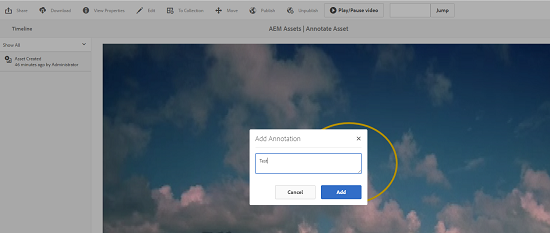

# Gestire le risorse video {#manage-video-assets}

Il formato video è una parte fondamentale delle risorse digitali di un&#39;organizzazione. [!DNL Adobe Experience Manager] offre offerte e funzionalità mature per gestire l’intero ciclo di vita delle risorse video dopo la loro creazione.

Scopri come gestire e modificare le risorse video in [!DNL Adobe Experience Manager Assets]. La codifica e la transcodifica video, ad esempio la transcodifica FFmpeg, è possibile utilizzando l’integrazione [!DNL Dynamic Media] .

## Caricare e visualizzare in anteprima le risorse video {#upload-and-preview-video-assets}

[!DNL Adobe Experience Manager Assets] genera le anteprime per le risorse video con l’estensione MP4. Se il formato della risorsa non è MP4, installa il pacchetto FFmpeg per generare un&#39;anteprima. FFmpeg crea rappresentazioni video di tipo OGG e MP4. Puoi visualizzare in anteprima le rappresentazioni nell’ interfaccia utente di [!DNL Assets] .

1. Nella cartella o nelle sottocartelle delle risorse digitali, individua il percorso in cui desideri aggiungere le risorse digitali.
1. Per caricare la risorsa, fai clic su **[!UICONTROL Crea]** nella barra degli strumenti e scegli **[!UICONTROL File]**. In alternativa, trascinare un file sull’interfaccia utente. Per ulteriori informazioni, consulta [caricare le risorse](manage-assets.md#uploading-assets) .
1. Per visualizzare un video in anteprima nella vista a schede, fai clic sull&#39;opzione **[!UICONTROL Play]**  sulla risorsa video. È possibile mettere in pausa o riprodurre video solo nella vista a schede. Le opzioni [!UICONTROL Play] e [!UICONTROL Pause] non sono disponibili nella vista a elenco.

1. Per visualizzare l’anteprima del video nella pagina dei dettagli della risorsa, fai clic su **[!UICONTROL Modifica]** sulla scheda . Il video viene riprodotto nel lettore video nativo del browser. È possibile riprodurre, mettere in pausa, controllare il volume e ingrandire il video a schermo intero.

   

## Configurazione per caricare risorse di dimensioni superiori a 2 GB {#configuration-to-upload-assets-that-are-larger-than-gb}

Per impostazione predefinita, [!DNL Assets] non consente di caricare risorse di dimensioni superiori a 2 GB a causa di un limite di dimensione del file. Tuttavia, puoi sovrascrivere questo limite entrando in CRXDE Lite e creando un nodo sotto la directory `/apps` . Il nodo deve avere lo stesso nome del nodo, la struttura della directory e le proprietà del nodo confrontabili dell&#39;ordine.

Oltre alla configurazione [!DNL Assets], modifica le seguenti configurazioni per caricare risorse di grandi dimensioni:

* Aumenta il tempo di scadenza del token. Consulta [!UICONTROL Adobe Granite CSRF Servlet] nella console Web all&#39;indirizzo `https://[aem_server]:[port]/system/console/configMgr`. Per ulteriori informazioni, consulta [Protezione CSRF](/help/sites-developing/csrf-protection.md).
* Aumenta il `receiveTimeout` nella configurazione del Dispatcher. Per ulteriori informazioni, consulta [Configurazione di Experience Manager Dispatcher](https://experienceleague.adobe.com/docs/experience-manager-dispatcher/using/configuring/dispatcher-configuration.html#renders-options).

>[!NOTE]
>
>L&#39;interfaccia utente [!DNL Experience Manager] Classic non ha un limite di dimensione del file di 2 GB. Inoltre, il flusso di lavoro end-to-end per video di grandi dimensioni non è completamente supportato.

Per configurare un limite di dimensione del file più elevato, esegui i seguenti passaggi nella directory `/apps` .

1. In [!DNL Experience Manager], fai clic su **[!UICONTROL Strumenti]** > **[!UICONTROL Generale]** > **[!UICONTROL CRXDE Lite]**.
1. In CRXDE Lite, passa a `/libs/dam/gui/content/assets/jcr:content/actions/secondary/create/items/fileupload`. Per visualizzare la finestra della directory, fai clic su `>>`.
1. Dalla barra degli strumenti, fai clic su **[!UICONTROL Sovrapponi nodo]**. In alternativa, seleziona **[!UICONTROL Sovrapponi nodo]** dal menu di scelta rapida.
1. Nella finestra di dialogo **[!UICONTROL Sovrapponi nodo]**, fai clic su **[!UICONTROL OK]**.

   

1. Aggiorna il browser. Il nodo di sovrapposizione `/apps/dam/gui/content/assets/jcr:content/actions/secondary/create/items/fileupload` è selezionato.
1. Nella scheda **[!UICONTROL Proprietà]** , immetti il valore appropriato in byte per aumentare il limite di dimensioni alle dimensioni desiderate. Ad esempio, per aumentare il limite di dimensione a 30 GB, immetti il valore `32212254720` .

1. Dalla barra degli strumenti, fai clic su **[!UICONTROL Salva tutto]**.
1. In [!DNL Experience Manager], fai clic su **[!UICONTROL Strumenti]** > **[!UICONTROL Operazioni]** > **[!UICONTROL Console web]**.
1. Nella pagina [!DNL Adobe Experience Manager] [!UICONTROL Bundle della console Web], nella colonna Nome della tabella, individua e fai clic su **[!UICONTROL Adobe Granite Workflow External Process Job Handler]**.
1. Nella pagina [!UICONTROL Adobe Granite Workflow External Process Job Handler] , imposta i secondi per i campi **[!UICONTROL Default Timeout]** e **[!UICONTROL Max Timeout]** su `18000` (cinque ore). Fai clic su **[!UICONTROL Salva]**.
1. In [!DNL Experience Manager], fai clic su **[!UICONTROL Strumenti]** > **[!UICONTROL Flusso di lavoro]** > **[!UICONTROL Modelli]**.
1. Nella pagina Modelli flusso di lavoro, seleziona **[!UICONTROL Codifica video Dynamic Media]**, quindi fai clic su **[!UICONTROL Modifica]**.
1. Nella pagina del flusso di lavoro, fai doppio clic sul componente **[!UICONTROL Processo servizio video Dynamic Media]** .
1. Nella finestra di dialogo [!UICONTROL Step Properties (Proprietà passo)], nella scheda **[!UICONTROL Common (Comune)]**, espandi **Impostazioni avanzate**.
1. Nel campo **[!UICONTROL Timeout]** , specifica un valore di `18000`, quindi fai clic su **[!UICONTROL OK]** per tornare alla pagina del flusso di lavoro **[!UICONTROL Codifica video Dynamic Media]**.
1. Nella parte superiore della pagina, sotto il titolo della pagina [!UICONTROL Codifica video Dynamic Media], fai clic su **[!UICONTROL Salva]**.

## Pubblicare risorse video {#publish-video-assets}

Dopo la pubblicazione, puoi includere le risorse video in una pagina web come URL o incorporarle direttamente. Per informazioni dettagliate, consulta [pubblicare risorse Dynamic Media](/help/assets/publishing-dynamicmedia-assets.md).

## Annotare risorse video {#annotate-video-assets}

1. Dalla console [!DNL Assets], seleziona **[!UICONTROL Modifica]** nella scheda delle risorse per visualizzare la pagina dei dettagli delle risorse.
1. Per riprodurre il video, fai clic su **[!UICONTROL Anteprima]**.
1. Per annotare il video, fai clic su **[!UICONTROL Annota]**. Viene aggiunta un’annotazione alla data e all’ora specifiche (fotogramma) del video. Durante l&#39;annotazione, potete disegnare sull&#39;area di lavoro e includere un commento nel disegno. I commenti vengono salvati automaticamente. Per uscire dalla procedura guidata di annotazione, fare clic su **[!UICONTROL Chiudi]**.

   

1. Individua un punto specifico del video, specifica il tempo in secondi nel campo di **testo**, infine fai clic su **Jump (Passa a)**. Ad esempio, per saltare i primi 20 secondi del video, inserisci 20 nel campo di testo.

   

1. Per visualizzarlo nella timeline, fate clic su un’annotazione. Per eliminare l’annotazione dalla timeline, fai clic su **[!UICONTROL Elimina]**.

   

>[!MORELIKETHIS]
>
>* [Gestire le risorse digitali in Risorse di Experience Manager](/help/assets/manage-assets.md)
* [Gestire le raccolte in Risorse di Experience Manager](/help/assets/manage-collections.md)
* [Documentazione video su Dynamic Media](/help/assets/video.md).

