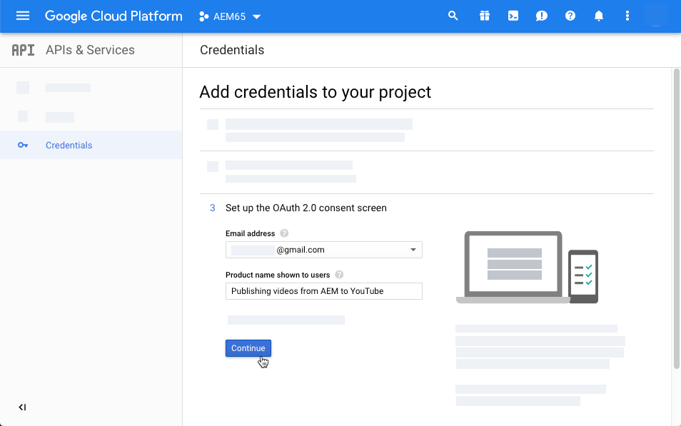

# Gestire le risorse video {#manage-video-assets}

| Versione | Collegamento articolo |
| -------- | ---------------------------- |
| AEM as a Cloud Service | [Fai clic qui](https://experienceleague.adobe.com/docs/experience-manager-cloud-service/content/assets/manage/manage-video-assets.html?lang=en) |
| AEM 6.5 | Questo articolo |

Il formato video è una parte fondamentale delle risorse digitali di un’organizzazione. [!DNL Adobe Experience Manager] offre offerte e funzionalità mature per gestire l&#39;intero ciclo di vita delle risorse video dopo la loro creazione.

Scopri come gestire e modificare le risorse video in [!DNL Adobe Experience Manager Assets]. La codifica video e la transcodifica, ad esempio la transcodifica FFmpeg, sono possibili utilizzando l&#39;integrazione [!DNL Dynamic Media].

## Caricare e visualizzare in anteprima le risorse video {#upload-and-preview-video-assets}

[!DNL Adobe Experience Manager Assets] genera anteprime per le risorse video con estensione MP4. Se il formato della risorsa non è MP4, installa il pacchetto FFmpeg per generare un’anteprima. FFmpeg crea rappresentazioni video di tipo OGG e MP4. È possibile visualizzare l&#39;anteprima delle copie trasformate nell&#39;interfaccia utente [!DNL Assets].

1. Nella cartella o nelle sottocartelle delle risorse digitali, individua il percorso in cui desideri aggiungere le risorse digitali.
1. Per caricare la risorsa, fai clic su **[!UICONTROL Crea]** nella barra degli strumenti e scegli **[!UICONTROL File]**. In alternativa, trascina un file sull’interfaccia utente. Per informazioni, consulta [caricare le risorse](manage-assets.md#uploading-assets).
1. Per visualizzare l&#39;anteprima di un video nella vista a schede, fai clic sull&#39;opzione **[!UICONTROL Riproduci]**  nella risorsa video. È possibile mettere in pausa o riprodurre il video solo nella vista a schede. Le opzioni [!UICONTROL Riproduci] e [!UICONTROL Pausa] non sono disponibili nella visualizzazione elenco.

1. Per visualizzare l&#39;anteprima del video nella pagina dei dettagli della risorsa, fai clic su **[!UICONTROL Modifica]** sulla scheda. Il video viene riprodotto nel lettore video nativo del browser. È possibile riprodurre, mettere in pausa, controllare il volume e ingrandire il video a schermo intero.

   

## Configurazione per caricare risorse superiori a 2 GB {#configuration-to-upload-assets-that-are-larger-than-gb}

Per impostazione predefinita, [!DNL Assets] non ti consente di caricare risorse di dimensioni superiori a 2 GB a causa di un limite di dimensione file. Tuttavia, è possibile sovrascrivere questo limite accedendo a CRXDE Lite e creando un nodo nella directory `/apps`. Il nodo deve avere lo stesso nome di nodo, la stessa struttura di directory e le stesse proprietà di nodo comparabili ordinate.

Oltre alla configurazione [!DNL Assets], modifica le seguenti configurazioni per caricare risorse di grandi dimensioni:

* Aumenta il tempo di scadenza del token. Vedere [!UICONTROL Adobe Granite CSRF Servlet] nella console Web in `https://[aem_server]:[port]/system/console/configMgr`. Per ulteriori informazioni, vedere [Protezione CSRF](/help/sites-developing/csrf-protection.md).
* Aumenta `receiveTimeout` nella configurazione Dispatcher. Per ulteriori informazioni, vedere [Experience Manager configurazione Dispatcher](https://experienceleague.adobe.com/docs/experience-manager-dispatcher/using/configuring/dispatcher-configuration.html#renders-options).

>[!NOTE]
>
>L&#39;interfaccia utente classica di [!DNL Experience Manager] non ha un limite di dimensione file di 2 GB. Inoltre, il flusso di lavoro end-to-end per i video di grandi dimensioni non è del tutto supportato.

Per configurare un limite di dimensioni file più elevato, effettuare le seguenti operazioni nella directory `/apps`.

1. In [!DNL Experience Manager], fare clic su **[!UICONTROL Strumenti]** > **[!UICONTROL Generale]** > **[!UICONTROL CRXDE Liti]**.
1. In CRXDE Lite, passa a `/libs/dam/gui/content/assets/jcr:content/actions/secondary/create/items/fileupload`. Per visualizzare la finestra della directory, fare clic su `>>`.
1. Dalla barra degli strumenti, fare clic sul nodo **[!UICONTROL Sovrapposizione]**. In alternativa, seleziona **[!UICONTROL Sovrapponi nodo]** dal menu di scelta rapida.
1. Nella finestra di dialogo **[!UICONTROL Sovrapponi nodo]**, fai clic su **[!UICONTROL OK]**.

   

1. Aggiorna il browser. Il nodo di sovrapposizione `/apps/dam/gui/content/assets/jcr:content/actions/secondary/create/items/fileupload` è selezionato.
1. Nella scheda **[!UICONTROL Proprietà]** immettere il valore appropriato in byte per aumentare il limite di dimensioni alle dimensioni desiderate. Ad esempio, per aumentare il limite di dimensioni a 30 GB, immettere il valore `32212254720`.

1. Dalla barra degli strumenti, fare clic su **[!UICONTROL Salva tutto]**.
1. In [!DNL Experience Manager], fare clic su **[!UICONTROL Strumenti]** > **[!UICONTROL Operazioni]** > **[!UICONTROL Console Web]**.
1. Nella pagina [!DNL Adobe Experience Manager] [!UICONTROL Bundle console Web], individuare nella colonna Nome della tabella **[!UICONTROL Adobe Granite Workflow External Process Job Handler]**.
1. Nella pagina [!UICONTROL Adobe Granite Workflow External Process Job Handler], impostare i secondi per i campi **[!UICONTROL Default Timeout]** e **[!UICONTROL Max Timeout]** su `18000` (cinque ore). Fai clic su **[!UICONTROL Salva]**.
1. In [!DNL Experience Manager], fai clic su **[!UICONTROL Strumenti]** > **[!UICONTROL Flusso di lavoro]** > **[!UICONTROL Modelli]**.
1. Nella pagina Modelli flusso di lavoro, seleziona **[!UICONTROL Codifica video Dynamic Medie]**, quindi fai clic su **[!UICONTROL Modifica]**.
1. Nella pagina del flusso di lavoro fare doppio clic sul componente **[!UICONTROL Processo servizio video Dynamic Medie]**.
1. Nella finestra di dialogo [!UICONTROL Step Properties (Proprietà passo)], nella scheda **[!UICONTROL Common (Comune)]**, espandi **Impostazioni avanzate**.
1. Nel campo **[!UICONTROL Timeout]**, specifica un valore di `18000`, quindi fai clic su **[!UICONTROL OK]** per tornare alla pagina del flusso di lavoro **[!UICONTROL Codifica video Dynamic Medie]**.
1. Nella parte superiore della pagina, sotto il titolo della pagina [!UICONTROL Codifica video Dynamic Medie], fai clic su **[!UICONTROL Salva]**.

## Risorse video Publish {#publish-video-assets}

Dopo la pubblicazione, puoi includere le risorse video in una pagina web come URL o incorporarle direttamente. Per informazioni dettagliate, consulta [pubblicare risorse Dynamic Medie](/help/assets/publishing-dynamicmedia-assets.md).

## Video Publish su YouTube {#publishing-videos-to-youtube}

Puoi pubblicare risorse video di Experience Manager on-premise direttamente su un canale YouTube creato in precedenza.

Per pubblicare risorse video in YouTube, imposta Experience Manager Assets con i tag. Associa questi tag a un canale YouTube. Se il tag di una risorsa video corrisponde a quello di un canale YouTube, il video viene pubblicato in YouTube. Il passaggio da Publish ad YouTube si verifica insieme a una normale pubblicazione del video, purché venga utilizzato un tag associato.

YouTube esegue la propria codifica. Di conseguenza, il file video originale caricato in Experience Manager viene pubblicato in YouTube invece di qualsiasi rendering video creato con la codifica Dynamic Medie. Anche se non è necessario per elaborare i video utilizzando Dynamic Medie, è previsto che lo facciano nel caso in cui sia necessario un predefinito visualizzatore per la riproduzione.

Quando salti il profilo di elaborazione video e pubblichi direttamente in YouTube, significa semplicemente che la risorsa video in Experience Manager Asset non riceve una miniatura visualizzabile. Significa anche che se si esegue in modalità di esecuzione `dynamicmedia` o `dynamicmedia_scene7`, i video non codificati non funzionano con nessuno dei tipi di risorse Dynamic Medie.

La pubblicazione di risorse video sui server YouTube prevede il completamento delle seguenti attività per garantire un’autenticazione server-to-server sicura con YouTube:

1. [Configurare le impostazioni di Google Cloud](#configuring-google-cloud-settings)
1. [Creare un canale YouTube](#creating-a-youtube-channel)
1. [Aggiungi tag per la pubblicazione](#adding-tags-for-publishing)
1. [Abilitare l’agente di replica di YouTube Publish](#enabling-the-youtube-publish-replication-agent)
1. [Configurare YouTube in Experience Manager](#setting-up-youtube-in-aem)
1. [(Facoltativo) Automatizza l&#39;impostazione delle proprietà predefinite di YouTube per i video caricati](#optional-automating-the-setting-of-default-youtube-properties-for-your-uploaded-videos)
1. [Video Publish sul tuo canale YouTube](#publishing-videos-to-your-youtube-channel)
1. [(Facoltativo) Verifica il video pubblicato su YouTube](/help/assets/video.md#optional-verifying-the-published-video-on-youtube)
1. [Collegare gli URL di YouTube all’applicazione web](#linking-youtube-urls-to-your-web-application)

Puoi anche [annullare la pubblicazione dei video per rimuoverli da YouTube](#unpublishing-videos-to-remove-them-from-youtube).

### Configurare le impostazioni di Google Cloud {#configuring-google-cloud-settings}

Per pubblicare su YouTube, è necessario un account Google. Se si dispone di un account GMAIL, si dispone già di un account Google; se non si dispone di un account Google, è possibile crearne facilmente uno. L’account è necessario perché sono necessarie credenziali per pubblicare risorse video in YouTube. Se hai già creato un account, salta questa attività e passa direttamente a [Crea un canale YouTube](#creating-a-youtube-channel).

Non è necessario che l’account utilizzato con Google Cloud e l’account Google utilizzato per YouTube siano gli stessi.

Google modifica periodicamente l’interfaccia utente. Di conseguenza, i passaggi per pubblicare video in YouTube possono variare leggermente rispetto a quanto documentato di seguito. Questa avvertenza si applica anche ad YouTube quando tenti di verificare se i video sono stati caricati su di esso.

>[!NOTE]
>
>I seguenti passaggi erano accurati al momento della presente stesura. Tuttavia, Google aggiorna periodicamente i propri siti web senza preavviso. Di conseguenza, questi passaggi possono essere leggermente diversi.

Per configurare le impostazioni di Google Cloud:

1. Crea un account Google.

   Se disponi già di un account Google, passa al passaggio successivo.

1. Vai a [https://cloud.google.com/](https://cloud.google.com/).
1. Nella pagina Google Cloud, nell’angolo superiore destro, fai clic su **[!UICONTROL Console]**.

   Se necessario, **[!UICONTROL Accedi]** utilizzando le credenziali dell&#39;account Google per visualizzare l&#39;opzione **[!UICONTROL Console]**.

1. Nella pagina Dashboard, a destra di **[!UICONTROL Google Cloud Platform]**, fai clic sull&#39;elenco a discesa Progetto per aprire la finestra di dialogo Seleziona un progetto.
1. Nella finestra di dialogo Seleziona un progetto, seleziona **[!UICONTROL Nuovo progetto]**.

   

1. Nella finestra di dialogo Nuovo progetto digitare il nome del nuovo progetto nel campo Nome progetto.

   L&#39;ID progetto si basa sul nome del progetto. Pertanto, scegli attentamente il nome del progetto, che non può essere modificato dopo la creazione. Inoltre, devi immettere nuovamente lo stesso ID progetto quando configuri YouTube in Experience Manager in un secondo momento; prova a scriverlo.

1. Fai clic su **[!UICONTROL Crea]**.

1. Effettuare una delle seguenti operazioni:

   * Nella scheda Guida introduttiva del dashboard del progetto, seleziona **[!UICONTROL Esplora e abilita API]**.
   * Nella scheda API del dashboard del progetto, seleziona **[!UICONTROL Vai alla panoramica delle API]**.

   

1. Nella parte superiore della pagina API e servizi, seleziona **[!UICONTROL Abilita API e servizi]**.
1. Nella pagina Libreria API, a sinistra, in **[!UICONTROL Categoria]**, seleziona **[!UICONTROL YouTube]**. Sul lato destro della pagina, selezionare **[!UICONTROL YouTube Data API]**.
1. Nella pagina YouTube Data API v3, seleziona **[!UICONTROL Abilita]**.

   

1. Per utilizzare l’API, sono necessarie le credenziali. Se necessario, fare clic su **[!UICONTROL Crea credenziali]**.

   

1. Nella pagina **[!UICONTROL Aggiungi credenziali al progetto]**, passaggio 1, eseguire le operazioni seguenti:

   * Da **[!UICONTROL Quale API si utilizza?Elenco a discesa]**, selezionare **[!UICONTROL YouTube Data API v3]**.

   * Da **[!UICONTROL Da dove stai chiamando l&#39;API?Elenco a discesa]**, selezionare **[!UICONTROL Server Web (ad esempio, node.js, Tomcat)]**

   * Da **[!UICONTROL A quali dati accedi?]**, selezionare **[!UICONTROL Dati utente]**.

   

1. Seleziona **[!UICONTROL Di quali credenziali ho bisogno?]**
1. Inserisci un nome univoco nel campo Nome della pagina **[!UICONTROL Add credentials to your project (Aggiungi credenziali alla pagina del progetto)]**, al passaggio 2, sotto l’intestazione **[!UICONTROL Create an OAuth 2.0 client ID (Crea un ID client OAuth 2.0)]**. Oppure puoi utilizzare il nome predefinito specificato da Google.
1. Nell&#39;intestazione **[!UICONTROL Origini JavaScript autorizzate]**, immettere nel campo di testo il percorso seguente, sostituendo il proprio dominio e il proprio numero di porta nel percorso, quindi premere **[!UICONTROL Invio]** per aggiungere il percorso all&#39;elenco:

   `https://<servername.domain>:<port_number>`

   Ad esempio `https://1a2b3c.mycompany.com:4321`

   **Nota**: l&#39;esempio di percorso sopra riportato è solo a scopo dimostrativo.

   

1. Nell&#39;intestazione **[!UICONTROL URI di reindirizzamento autorizzati]**, immettere nel campo di testo il percorso seguente, sostituendo il dominio e il numero di porta nel percorso, quindi premere **[!UICONTROL Invio]** per aggiungere il percorso all&#39;elenco:

   `https://<servername.domain>:<port_number>/etc/cloudservices/youtube.youtubecredentialcallback.json`

   Ad esempio `https://1a2b3c.mycompany.com:4321/etc/cloudservices/youtube.youtubecredentialcallback.json`

   **Nota**: l&#39;esempio di percorso sopra riportato è solo a scopo dimostrativo.

1. Fai clic su **[!UICONTROL Crea ID client OAuth]**.
1. Nella pagina **[!UICONTROL Add credentials to your project (Aggiungi credenziali al progetto)]**, al passaggio 3, vai all’intestazione **[!UICONTROL Set up the OAuth 2.0 consent screen (Imposta la schermata di autorizzazione OAuth 2.0)]** e seleziona l’indirizzo e-mail di Gmail che è in uso.

   

1. Sotto l&#39;intestazione **[!UICONTROL Nome prodotto mostrato agli utenti]**, immetti nel campo di testo ciò che desideri visualizzare nella schermata di consenso.

   La schermata di consenso viene visualizzata dall’amministratore Experience Manager quando si autentica in YouTube; l’Experience Manager contatta YouTube per ottenere l’autorizzazione.

1. Fai clic su **[!UICONTROL Continua]**.
1. Nella pagina Add credentials to your project (Aggiungi credenziali al progetto), passaggio 4, nell&#39;intestazione **[!UICONTROL Download credentials]** (Scarica credenziali), seleziona **[!UICONTROL Download]**.

   

1. Salva il file `client_id.json`.

   Questo file json scaricato è necessario per la configurazione di YouTube in Adobe Experience Manager in un secondo momento.

1. Fai clic su **[!UICONTROL Fine]**.

   Esci dal tuo account Google. Ora crea un canale YouTube.

### Creare un canale YouTube {#creating-a-youtube-channel}

La pubblicazione di video in YouTube richiede la presenza di uno o più canali. Se hai già creato un canale YouTube, puoi saltare questa attività e passare a [Aggiungi tag per la pubblicazione](/help/assets/video.md#adding-tags-for-publishing).

>[!WARNING]
>
>Assicurati di aver già configurato uno o più canali in YouTube *prima* di aggiungere canali nelle impostazioni YouTube in Experience Manager (vedi [Configurazione di YouTube nell&#39;Experience Manager](#setting-up-youtube-in-aem) di seguito). Se non si configurano uno o più canali, non viene visualizzato alcun avviso relativo ai canali inesistenti. Tuttavia, l’autenticazione Google viene comunque eseguita quando si aggiunge un canale, ma non è possibile scegliere quale canale inviare il video.

**Per creare un canale YouTube:**

1. Vai a [https://www.youtube.com](https://www.youtube.com/) e accedi utilizzando le credenziali del tuo account Google.
1. Nell&#39;angolo superiore destro della pagina di YouTube, fai clic sull&#39;immagine del tuo profilo (che può anche apparire come una lettera in un cerchio di colore uniforme), quindi fai clic su **[!UICONTROL Impostazioni YouTube]** (icona a forma di ingranaggio circolare).
1. Nella pagina Panoramica, sotto l&#39;intestazione Caratteristiche aggiuntive, fare clic su **[!UICONTROL Visualizza tutti i miei canali o crea un canale]**.
1. Nella pagina Canali, fare clic su **[!UICONTROL Crea un nuovo canale]**.
1. Nella pagina Account marchio, inserisci il nome di un&#39;azienda o di un altro canale scelto per la pubblicazione delle risorse video nel campo Nome account marchio, quindi fai clic su **[!UICONTROL Crea]**.

   Ricorda il nome che hai immesso qui perché devi immetterlo nuovamente quando configuri YouTube in Experience Manager.

1. Se necessario, aggiungi altri canali.

   Ora aggiungi i tag per la pubblicazione.

### Aggiungi tag per la pubblicazione {#adding-tags-for-publishing}

Per pubblicare i video in YouTube, Experience Manager associa i tag a uno o più canali di YouTube. Per aggiungere i tag per la pubblicazione, vedere [Amministrare i tag](/help/sites-administering/tags.md).

Oppure, se desideri utilizzare i tag predefiniti in Experience Manager, puoi saltare questa attività e passare a [Abilita l&#39;agente di replica di YouTube Publish](#enabling-the-youtube-publish-replication-agent).

### Abilitare l’agente di replica di YouTube Publish {#enabling-the-youtube-publish-replication-agent}

Dopo aver abilitato l&#39;agente di replica di YouTube Publish, se si desidera verificare la connessione all&#39;account Google Cloud, selezionare **[!UICONTROL Verifica connessione]**. I risultati della connessione vengono visualizzati in una scheda del browser. Se hai aggiunto dei canali YouTube, come parte del test ne viene visualizzato un elenco.

1. Nell&#39;angolo superiore sinistro dell&#39;Experience Manager fare clic sul logo dell&#39;Experience Manager, quindi nella barra a sinistra fare clic su **[!UICONTROL Strumenti]** > **[!UICONTROL Distribuzione]** > **[!UICONTROL Replica]** > **[!UICONTROL Agenti per creazione]**.
1. Nella pagina Agenti di authoring fare clic su **[!UICONTROL YouTube Publish]**.
1. Sulla barra degli strumenti, a destra di Impostazioni, fare clic su **[!UICONTROL Modifica]**.
1. Selezionare la casella di controllo **[!UICONTROL Abilitato]** per attivare l&#39;agente di replica.
1. Fai clic su **[!UICONTROL OK]**.

   Ora configura YouTube in Experience Manager.

### Configurare YouTube in Experience Manager {#setting-up-youtube-in-aem}

A partire dall’Experience Manager 6.4, è stato introdotto un nuovo metodo di interfaccia utente touch per configurare la pubblicazione YouTube in Experience Manager. In base all&#39;istanza installata di Experience Manager in uso, eseguire una delle operazioni seguenti:

* Per configurare YouTube in Experience Manager prima della versione 6.4, vedere [Configurare YouTube in Experience Manager prima della versione 6.4](/help/assets/video.md#setting-up-youtube-in-aem-before).
* Per configurare YouTube nell&#39;Experience Manager 6.4 o versione successiva, vedere [Configurare YouTube nell&#39;Experience Manager 6.4 o versione successiva](#setting-up-youtube-in-aem-and-later).

#### Configurare YouTube all’Experience Manager 6.4 e versioni successive {#setting-up-youtube-in-aem-and-later}

1. Accertati di accedere alla tua istanza di Dynamic Medie come amministratore.
1. Nell&#39;angolo in alto a sinistra, seleziona il logo dell&#39;Experience Manager, quindi nella barra a sinistra seleziona **[!UICONTROL Strumenti]**(icona a forma di martello) > **[!UICONTROL Cloud Service]** > **[!UICONTROL Configurazione pubblicazione YouTube]**.
1. Seleziona **[!UICONTROL global]** (non selezionarlo).

1. Selezionare **[!UICONTROL Crea]** nell&#39;angolo superiore destro della pagina globale.
1. Nella pagina Crea configurazione YouTube, seleziona Impostazioni piattaforma Google Cloud, quindi immetti l’ID progetto Google nel campo **[!UICONTROL Nome applicazione]**.

   Hai specificato l’ID del progetto al momento della configurazione iniziale delle impostazioni di Google Cloud.
Lascia aperta la pagina Crea configurazione di YouTube; tra un attimo la tornerai.

   

1. Utilizzando un editor di testo normale, apri il file JSON scaricato e salvato in precedenza nell&#39;attività [Configura impostazioni Google Cloud](/help/assets/video.md#configuring-google-cloud-settings).
1. Seleziona e copia l’intero testo JSON.
1. Torna alla finestra di dialogo Impostazioni account YouTube. Nel campo **[!UICONTROL Configurazione JSON]**, incolla il testo JSON.
1. Seleziona **[!UICONTROL Salva]** nell&#39;angolo superiore destro della pagina.

   Ora imposta i canali YouTube in Experience Manager.

1. Seleziona **[!UICONTROL Aggiungi canale]**.
1. Nel campo Nome canale, immetti il nome del canale creato nell&#39;attività **[!UICONTROL Aggiunta di uno o più canali a YouTube]** in precedenza.

   Facoltativamente, puoi aggiungere una descrizione, se necessario.

1. Seleziona **[!UICONTROL Aggiungi]**.
1. Viene visualizzata l’autenticazione YouTube/Google. Se non hai già effettuato l’accesso all’account Google Cloud, salta questo passaggio.

   * Inserisci il nome utente e la password di Google associati all’ID progetto Google e al testo JSON qui sopra.
   * A seconda di quanti canali dispone il tuo account, puoi visualizzare due o più elementi. Seleziona un canale. Non selezionare l&#39;indirizzo di posta elettronica, non è un canale.
   * Nella pagina successiva, seleziona **[!UICONTROL Accetta]** per consentire l&#39;accesso a questo canale.

1. Seleziona **[!UICONTROL Consenti]**.

   Ora imposta i tag per la pubblicazione.

1. **[!UICONTROL Impostazione dei tag per la pubblicazione]** - Nella pagina Cloud Service > YouTube, seleziona l&#39;icona a forma di matita per modificare l&#39;elenco dei tag che desideri utilizzare.
1. Seleziona l’icona dell’elenco a discesa (cursore a discesa) per visualizzare l’elenco dei tag disponibili in Experience Manager.
1. Seleziona uno o più tag per poterli aggiungere.

   Per eliminare un tag aggiunto, selezionarlo e selezionare **[!UICONTROL X]**.

1. Dopo aver aggiunto i tag desiderati, selezionare **[!UICONTROL Salva]**.

   Ora pubblichi i video sul tuo canale YouTube.

#### Configurare YouTube in Experience Manager prima della versione 6.4 {#setting-up-youtube-in-aem-before}

1. Accertati di accedere alla tua istanza di Dynamic Medie come amministratore.

1. Nell&#39;angolo in alto a sinistra, seleziona il logo dell&#39;Experience Manager, quindi nella barra a sinistra seleziona **[!UICONTROL Strumenti]** (icona a forma di martello) > **[!UICONTROL Distribuzione]** > **[!UICONTROL Cloud Service]**.
1. Nell&#39;intestazione Servizi di terze parti, in YouTube, seleziona **[!UICONTROL Configura ora]**.
1. Nella finestra di dialogo Crea configurazione, immetti un titolo (obbligatorio) e un nome (facoltativo) nei rispettivi campi.
1. Seleziona **[!UICONTROL Crea]**.
1. Nella finestra di dialogo Impostazioni account di YouTube, immetti l’ID progetto Google nel campo **[!UICONTROL Nome applicazione]**.

   Hai specificato l&#39;ID del progetto quando hai [configurato le impostazioni di Google Cloud](/help/assets/video.md#configuring-google-cloud-settings) in precedenza.
Lascia aperta la finestra di dialogo YouTube Account Setting (Impostazione account di); tornerai su di essa tra un attimo.

1. Utilizzando un editor di testo normale, apri il file JSON scaricato e salvato in precedenza nell’attività Configurazione delle impostazioni di Google Cloud.
1. Seleziona e copia l’intero testo JSON.
1. Torna alla finestra di dialogo Impostazioni account YouTube. Nel campo **[!UICONTROL Configurazione JSON]**, incolla il testo JSON.
1. Selezionare **[!UICONTROL OK]**.

   Ora imposta i canali YouTube in Experience Manager.

1. A destra di **[!UICONTROL Canali disponibili]**, selezionare **+** (icona del segno più).
1. Nella finestra di dialogo Impostazioni canale YouTube, fai clic sul campo Titolo e immetti il nome del canale creato nell’attività precedente **[!UICONTROL Aggiunta di uno o più canali a YouTube]**.

   Facoltativamente, puoi aggiungere una descrizione, se necessario.

1. Selezionare **[!UICONTROL OK]**.
1. Viene visualizzata l’autenticazione YouTube/Google. Se non hai già effettuato l’accesso all’account Google Cloud, salta questo passaggio.

   * Inserisci il nome utente e la password di Google associati all’ID progetto Google e al testo JSON qui sopra.
   * A seconda di quanti canali dispone il tuo account, puoi visualizzare due o più elementi. Seleziona un canale. Non selezionare l&#39;indirizzo di posta elettronica, non è un canale.
   * Nella pagina successiva, seleziona **[!UICONTROL Accetta]** per consentire l&#39;accesso a questo canale.

1. Seleziona **[!UICONTROL Consenti]**.

   Ora imposta i tag per la pubblicazione.

1. **[!UICONTROL Impostazione dei tag per la pubblicazione]** - Nella pagina Cloud Service > YouTube, seleziona l&#39;icona a forma di matita per modificare l&#39;elenco dei tag che desideri utilizzare.
1. Seleziona l’icona dell’elenco a discesa (cursore a discesa) per visualizzare l’elenco dei tag disponibili in Experience Manager.
1. Seleziona uno o più tag per poterli aggiungere.

   Per eliminare un tag aggiunto, selezionarlo e selezionare **X**.

1. Dopo aver aggiunto i tag desiderati, selezionare **[!UICONTROL OK]**.

   Ora pubblichi i video sul tuo canale YouTube.

### (Facoltativo) Automatizza l&#39;impostazione delle proprietà predefinite di YouTube per i video caricati {#optional-automating-the-setting-of-default-youtube-properties-for-your-uploaded-videos}

Facoltativamente, puoi automatizzare l’impostazione delle proprietà di YouTube al caricamento dei video creando un profilo di elaborazione dei metadati in Experience Manager.

Per creare il profilo di elaborazione dei metadati, devi prima copiare i valori dai campi **[!UICONTROL Etichetta campo]**, **[!UICONTROL Mappa su proprietà]** e **[!UICONTROL Scelte]**, tutti disponibili in Schemi metadati per i video. Quindi, aggiungi questi valori al profilo di elaborazione dei metadati video di YouTube.

Per automatizzare l’impostazione delle proprietà predefinite di YouTube per i video caricati:

1. Nell&#39;angolo in alto a sinistra, seleziona il logo dell&#39;Experience Manager, quindi nella barra a sinistra fai clic su **[!UICONTROL Strumenti]** (icona a forma di martello) > **[!UICONTROL Assets]** > **[!UICONTROL Schemi di metadati]**.
1. Fare clic su **[!UICONTROL default]**. (Non aggiungere un segno di spunta alla casella di selezione a sinistra di &quot;default&quot;).
1. Nella pagina **[!UICONTROL default]**, seleziona la casella a sinistra di **[!UICONTROL video]**, quindi seleziona **[!UICONTROL Modifica]**.
1. Nella pagina Editor schema metadati, seleziona la scheda **[!UICONTROL Avanzate]**.
1. Nell’intestazione Pubblicazione su YouTube, fai clic su **[!UICONTROL Categoria YouTube]**.
1. Nella parte destra della pagina, nella scheda **[!UICONTROL Impostazioni]**, eseguire le operazioni seguenti:

   * Nel campo di testo **[!UICONTROL Mappa su proprietà]**, seleziona e copia il valore.
Incolla il valore copiato nell’editor di testo aperto. Questo valore sarà necessario in un secondo momento quando creerai il profilo di elaborazione dei metadati. Lascia aperto l’editor di testo.

   * In **[!UICONTROL Scelte]**, seleziona e copia il valore predefinito che desideri utilizzare (ad esempio Persone e blog o Scienza e tecnologia).
Incolla il valore copiato nell’editor di testo aperto. Questo valore sarà necessario in un secondo momento quando creerai il profilo di elaborazione dei metadati. Lascia aperto l’editor di testo.

1. Nell&#39;intestazione Pubblicazione YouTube, seleziona **[!UICONTROL Privacy YouTube]**.
1. Nella parte destra della pagina, nella scheda **[!UICONTROL Impostazioni]**, eseguire le operazioni seguenti:

   * Nel campo di testo **[!UICONTROL Mappa su proprietà]**, seleziona e copia il valore.
Incolla il valore copiato nell’editor di testo aperto. Questo valore sarà necessario in un secondo momento quando creerai il profilo di elaborazione dei metadati. Lascia aperto l’editor di testo.

   * In **[!UICONTROL Scelte]**, seleziona e copia il valore predefinito che desideri utilizzare. Notate che le scelte sono raggruppate in coppie di due. Il campo inferiore della coppia è il valore predefinito che si desidera copiare, ad esempio public, unlisted o private.
Incolla il valore copiato nell’editor di testo aperto. Questo valore sarà necessario in un secondo momento quando creerai il profilo di elaborazione dei metadati. Lascia aperto l’editor di testo.

1. Fare clic su **[!UICONTROL Annulla]** nell&#39;angolo superiore destro della pagina Editor schema metadati.
1. Nell&#39;angolo superiore sinistro dell&#39;Experience Manager, seleziona il logo dell&#39;Experience Manager, quindi nella barra a sinistra fai clic su **[!UICONTROL Strumenti]** (icona a forma di martello) > **[!UICONTROL Assets]** > **[!UICONTROL Profili metadati]**.

1. Nella pagina Profili metadati, nell&#39;angolo superiore destro della pagina, fare clic su **[!UICONTROL Crea]**.
1. Nella finestra di dialogo Aggiungi profilo metadati, vai al campo di testo **[!UICONTROL Titolo profilo]**, immetti il nome `YouTube Video` e fai clic su **[!UICONTROL Crea]**.
1. Nella pagina Editor profilo metadati fare clic sulla scheda **[!UICONTROL Avanzamento]**.
1. Aggiungi al profilo i valori di pubblicazione di YouTube copiati effettuando le seguenti operazioni:

   * Sul lato destro della pagina, fare clic sulla scheda **[!UICONTROL Genera modulo]**.
   * (Facoltativo) Trascina il componente con etichetta **[!UICONTROL Intestazione sezione]** a sinistra e rilascialo nell&#39;area del modulo.
   * (Facoltativo) Fai clic su **[!UICONTROL Etichetta campo]** per selezionare il componente.
   * (Facoltativo) Sul lato destro della pagina, nella scheda Impostazioni, immettere `YouTube Publishing` nel campo di testo Etichetta campo.
   * Fai clic sulla scheda **[!UICONTROL Genera modulo]**, trascina il componente con l&#39;etichetta **[!UICONTROL Testo con più valori]** e rilascialo sotto l&#39;intestazione **[!UICONTROL Pubblicazione YouTube]** creata.

   * Fare clic su **[!UICONTROL Etichetta campo]** per selezionare il componente.
   * Nella parte destra della pagina, nella scheda Impostazioni, incolla i valori di pubblicazione di YouTube (valore Etichetta campo e Mappa su valore proprietà) copiati in precedenza nei rispettivi campi del modulo. Incolla il valore Scelte nel campo Valore predefinito.

1. Aggiungi i valori di YouTube Privacy copiati al profilo effettuando le seguenti operazioni:

   * Sul lato destro della pagina, fare clic sulla scheda **[!UICONTROL Genera modulo]**.
   * (Facoltativo) Trascina il componente con etichetta **[!UICONTROL Intestazione sezione]** a sinistra e rilascialo nell&#39;area del modulo.
   * (Facoltativo) Fai clic su **[!UICONTROL Etichetta campo]** per selezionare il componente.
   * (Facoltativo) Sul lato destro della pagina, nella scheda Impostazioni, immettere `YouTube Privacy` nel campo di testo Etichetta campo.
   * Fai clic sulla scheda **[!UICONTROL Genera modulo]**, trascina il componente con l&#39;etichetta **[!UICONTROL Testo con più valori]** e rilascialo sotto l&#39;intestazione **[!UICONTROL YouTube Privacy]** che hai creato.

   * Fare clic su **[!UICONTROL Etichetta campo]** per selezionare il componente.
   * Nella parte destra della pagina, nella scheda Impostazioni, incolla i valori di pubblicazione di YouTube (valore Etichetta campo e Mappa su valore proprietà) copiati in precedenza nei rispettivi campi del modulo. Incolla il valore Scelte nel campo Valore predefinito.

1. Fai clic su **[!UICONTROL Salva]** nell’angolo superiore destro della pagina.
1. Applica il profilo di metadati Pubblicazione YouTube alle cartelle in cui stai per caricare i video. Devi avere sia il Profilo metadati che il Profilo video impostati.

   Consulta le sezioni [Profili di metadati](/help/assets/metadata-config.md#metadata-profiles) e [Profili video](/help/assets/video-profiles.md).

### Video Publish sul tuo canale YouTube {#publishing-videos-to-your-youtube-channel}

Ora associ alle risorse video i tag aggiunti in precedenza. Questo consente agli Experienci Manager di sapere quali risorse pubblicare nel canale YouTube.

>[!NOTE]
>
>Se l’esecuzione è in modalità Dynamic Medie - Scene7, la pubblicazione immediata non viene automaticamente pubblicata in YouTube. Quando è impostata la modalità Dynamic Medie - Scene7, è possibile scegliere tra due opzioni di pubblicazione: **[!UICONTROL Immediatamente]** o **[!UICONTROL All&#39;attivazione]**.
>
>**[!UICONTROL Publish Immediatamente]** significa che la risorsa caricata, dopo essere stata sincronizzata con IPS, viene pubblicata automaticamente nel sistema di consegna. Anche se questo è vero per Dynamic Medie, non lo è per YouTube. Per pubblicare in YouTube, devi utilizzare l’Autore Experience Manager.

>[!NOTE]
>
>Per pubblicare contenuti da YouTube, Experience Manager utilizza il flusso di lavoro da **[!UICONTROL Publish ad YouTube]**, che consente di monitorare lo stato di avanzamento e visualizzare eventuali informazioni sull&#39;errore.
>
>Consulta [Monitorare la codifica video e lo stato di pubblicazione di YouTube](#monitoring-video-encoding-and-youtube-publishing-progress).
>
>Per informazioni più dettagliate sullo stato di avanzamento, puoi monitorare il registro di YouTube in replica. Tieni presente, tuttavia, che tale monitoraggio richiede l’accesso come amministratore.

**Per pubblicare video sul tuo canale YouTube:**

1. Ad Experience Manager, individua la risorsa video da pubblicare sul tuo canale YouTube.
1. Seleziona la risorsa video (il set di video adattivi).
1. Sulla barra degli strumenti fare clic su **[!UICONTROL Proprietà]**.
1. Nella scheda Base, sotto l&#39;intestazione Metadati, fare clic su **[!UICONTROL Apri finestra di dialogo per selezione]** a destra del campo Tag.
1. Nella pagina Seleziona tag passare ai tag che si desidera utilizzare e quindi selezionare uno o più tag.

   Ricorda che i tag devono essere associati al canale YouTube.

1. Nell&#39;angolo superiore destro della pagina fare clic su **[!UICONTROL Seleziona]**.
1. Nell&#39;angolo superiore destro della pagina delle proprietà del video, fai clic su **[!UICONTROL Salva e chiudi]**.
1. Sulla barra degli strumenti fare clic su **[!UICONTROL Publish rapido]**.

   Vedi anche [Utilizzo di Gestione pubblicazioni con Experience Manager Sites](https://experienceleague.adobe.com/docs/experience-manager-learn/sites/page-authoring/publication-management-feature-video-use.html).

   Facoltativamente, puoi verificare il video pubblicato sul tuo canale YouTube.

### (Facoltativo) Verifica il video pubblicato su YouTube {#optional-verifying-the-published-video-on-youtube}

Facoltativamente, puoi monitorare lo stato della pubblicazione (o dell’annullamento della pubblicazione) in YouTube.

Consulta [Monitorare la codifica video e lo stato di pubblicazione di YouTube](#monitoring-video-encoding-and-youtube-publishing-progress).

I tempi di pubblicazione possono variare notevolmente a seconda di numerosi fattori, tra cui il formato del video sorgente principale, la dimensione del file e il traffico di caricamento. Il processo di pubblicazione può richiedere da pochi minuti a diverse ore. Inoltre, i formati a risoluzione più elevata vengono riprodotti molto più lentamente. Ad esempio, le modalità 720p e 1080p richiedono più tempo rispetto alla modalità 480p.

Se dopo otto ore viene ancora visualizzato un messaggio di stato che indica **[!UICONTROL Caricato (elaborazione, attendi)]**, prova a rimuovere il video dal sito di Adobe e a caricarlo di nuovo.

### Collegare gli URL di YouTube all’applicazione web {#linking-youtube-urls-to-your-web-application}

Dopo la pubblicazione del video, puoi ottenere una stringa URL di YouTube generata da Dynamic Medie. Quando copi l’URL di YouTube, questo viene inserito negli Appunti, in modo da poterlo incollare nelle pagine del sito web o dell’applicazione.

>[!NOTE]
>
>L’URL di YouTube non è disponibile per la copia finché non hai pubblicato la risorsa video in YouTube.

**Per collegare gli URL di YouTube all&#39;applicazione Web:**

1. Passa alla *risorsa video YouTube pubblicata* di cui desideri copiare l&#39;URL, quindi selezionala.

   Ricorda che gli URL di YouTube sono disponibili solo per copiare *dopo* che hai *pubblicato* le risorse video in YouTube.

1. Sulla barra degli strumenti fare clic su **[!UICONTROL Proprietà]**.
1. Fare clic sulla scheda **[!UICONTROL Avanzate]**.
1. Nell’elenco URL di YouTube Publishing, seleziona e copia il testo dell’URL nel browser Web per visualizzare in anteprima la risorsa o aggiungerlo alla pagina di contenuto Web, sotto l’intestazione Pubblicazione di YouTube.

### Annullare la pubblicazione dei video per rimuoverli da YouTube {#unpublishing-videos-to-remove-them-from-youtube}

Quando annulli la pubblicazione di una risorsa video in Experience Manager, il video viene rimosso da YouTube.

>[!CAUTION]
>
>Se rimuovi un video direttamente da YouTube, Experience Manager non ne è a conoscenza e continua a comportarsi come se il video fosse ancora pubblicato in YouTube. Per Experience Manager, annulla sempre la pubblicazione di una risorsa video da YouTube.

>[!NOTE]
>
>Per rimuovere contenuto da YouTube, Experience Manager utilizza il flusso di lavoro **[!UICONTROL Annulla pubblicazione da YouTube]**, che consente di monitorare l&#39;avanzamento e visualizzare eventuali informazioni sull&#39;errore.
>
>Consulta [Monitorare la codifica video e lo stato di pubblicazione di YouTube](#monitoring-video-encoding-and-youtube-publishing-progress).

**Per annullare la pubblicazione di video per rimuoverli da YouTube:**

1. Passa alle risorse video di cui vuoi annullare la pubblicazione dal tuo canale YouTube.
1. In modalità di selezione delle risorse, seleziona una o più risorse video pubblicate.
1. Sulla barra degli strumenti fare clic su **[!UICONTROL Gestisci pubblicazione]**. Seleziona l’icona dei tre punti (. . .) sulla barra degli strumenti in modo che venga aperta **[!UICONTROL Gestisci pubblicazione]**.
1. Nella pagina Gestisci pubblicazione selezionare **[!UICONTROL Annulla pubblicazione]**.
1. Nell&#39;angolo superiore destro della pagina, seleziona **[!UICONTROL Successivo]**.
1. Nell&#39;angolo superiore destro della pagina, seleziona **[!UICONTROL Annulla pubblicazione]**.

## Monitorare la codifica video e l’avanzamento della pubblicazione in YouTube {#monitoring-video-encoding-and-youtube-publishing-progress}

Quando carichi un nuovo video in una cartella a cui è applicata la codifica video, o pubblichi il video in YouTube, puoi monitorare l’avanzamento della codifica video/pubblicazione su Youtube. L’avanzamento effettivo della pubblicazione in YouTube è disponibile solo tramite i registri. Tuttavia, il suo fallimento o successo è elencato in modi aggiuntivi descritti nella procedura seguente. Inoltre, ricevi notifiche e-mail quando un flusso di lavoro o una codifica video di YouTube Publish viene completato o interrotto.

### Monitorare l’avanzamento {#monitoring-progress}

1. Visualizza l’avanzamento della codifica video nella cartella delle risorse:

   * Nella vista a schede, l’avanzamento della codifica video viene visualizzato sulla risorsa in percentuale. In caso di errore, queste informazioni vengono visualizzate anche sulla risorsa.

   

   * Nella vista a elenco, l&#39;avanzamento della codifica video viene visualizzato nella colonna **[!UICONTROL Stato elaborazione]**. In caso di errore, il messaggio viene visualizzato nella stessa colonna.

   

   Questa colonna non viene visualizzata per impostazione predefinita. Per abilitare la colonna, selezionare **[!UICONTROL Visualizza impostazioni]** dal menu a discesa delle visualizzazioni, aggiungere la colonna **[!UICONTROL Stato elaborazione]** e fare clic su **[!UICONTROL Aggiorna]**.

   

1. Visualizza l’avanzamento nei dettagli della risorsa. Quando fai clic su una risorsa, apri il menu a discesa e seleziona **[!UICONTROL Timeline]**. Per limitare il campo alle attività del flusso di lavoro, ad esempio la codifica o la pubblicazione YouTube, selezionare **[!UICONTROL Flussi di lavoro]**.

   

   Tutte le informazioni del flusso di lavoro, ad esempio la codifica, vengono visualizzate nella timeline. Per YouTube Publish, la timeline del flusso di lavoro include anche il nome del canale YouTube e l’URL del video YouTube. Inoltre, una volta completata la pubblicazione, nella timeline del flusso di lavoro vengono visualizzate tutte le notifiche di errore.

   >[!NOTE]
   >
   >Potrebbero essere necessari tempi lunghi per la registrazione dei messaggi di errore/guasto, a causa della presenza di più configurazioni di flusso di lavoro nei **[!UICONTROL nuovi tentativi]**, nel **[!UICONTROL ritardo tentativi]** e nel **[!UICONTROL timeout]** da [https://localhost:4502/system/console/configMgr](https://localhost:4502/system/console/configMgr), ad esempio:
   >
   >* Configurazione coda processi Apache Sling
   >* Adobe Granite Workflow External Process Job Handler
   >* Coda di timeout del flusso di lavoro Granite
   >
   >In queste configurazioni è possibile regolare le proprietà **[!UICONTROL nuovi tentativi]**, **[!UICONTROL ritenta tentativo]** e **[!UICONTROL timeout]**.

1. Per i flussi di lavoro in corso, vedi l’opzione Istanze flusso di lavoro accedendo a **[!UICONTROL Strumenti]** > **[!UICONTROL Flusso]** di lavoro > **[!UICONTROL Istanze]**.

   >[!NOTE]
   >
   >Sono necessari diritti amministrativi per accedere al menu **[!UICONTROL Strumenti]**.

   

   Selezionare l&#39;istanza e selezionare **[!UICONTROL Cronologia elementi aperti]**.

   

   Dall’area Istanze flusso di lavoro, puoi anche sospendere, terminare o rinominare i flussi di lavoro. Per ulteriori informazioni, vedere [Amministrazione dei flussi di lavoro](/help/sites-administering/workflows-administering.md).

1. Per i processi non riusciti, consulta l’opzione Errori di flusso di lavoro, accessibile da **[!UICONTROL Strumenti]** > **[!UICONTROL Flusso di lavoro]** > **[!UICONTROL Errori]**. In **[!UICONTROL Errore flusso di lavoro]** sono elencate tutte le attività del flusso di lavoro che hanno generato errori.

   >[!NOTE]
   >
   >Sono necessari diritti amministrativi per accedere al menu **[!UICONTROL Strumenti]**.

   

   >[!NOTE]
   >
   >Potrebbero essere necessari tempi lunghi per la registrazione del messaggio di errore, a causa della presenza di più configurazioni di flusso di lavoro nei **[!UICONTROL nuovi tentativi]**, **[!UICONTROL ritenta il tentativo]** e **[!UICONTROL timeout]** da [https://localhost:4502/system/console/configMgr](https://localhost:4502/system/console/configMgr), ad esempio:
   >
   >* Configurazione coda processi Apache Sling
   >* Adobe Granite Workflow External Process Job Handler
   >* Coda di timeout del flusso di lavoro Granite
   >
   >In queste configurazioni è possibile regolare le proprietà **[!UICONTROL nuovi tentativi]**, **[!UICONTROL ritenta tentativo]** e **[!UICONTROL timeout]**.

1. Per i flussi di lavoro completati, consulta Archivio flussi di lavoro, accessibile da **[!UICONTROL Strumenti]** > **[!UICONTROL Flusso di lavoro]** > **[!UICONTROL Archivio]**. **[!UICONTROL Archivio flussi di lavoro]** elenca tutte le attività del flusso di lavoro che sono state completate.

   >[!NOTE]
   >
   >Sono necessari diritti amministrativi per accedere al menu **[!UICONTROL Strumenti]**.

   

1. Ricevi notifiche e-mail sui processi del flusso di lavoro interrotti o non riusciti. Queste notifiche e-mail possono essere configurate da un amministratore. Consulta [Configurare le notifiche e-mail](#configuring-e-mail-notifications).

#### Configurare le notifiche e-mail {#configuring-e-mail-notifications}

>[!NOTE]
>
>Sono necessari diritti amministrativi per accedere al menu **[!UICONTROL Strumenti]**.

La modalità di configurazione delle notifiche dipende dal fatto che si desideri ricevere notifiche per i processi di codifica o per i processi di pubblicazione YouTube:

* Per i processi di codifica, puoi accedere alla pagina di configurazione per tutte le notifiche e-mail del flusso di lavoro di Experience Manager all&#39;indirizzo **[!UICONTROL Strumenti]** > **[!UICONTROL Operazioni]** > **[!UICONTROL Console Web]** e cercare il servizio di notifica e-mail del flusso di lavoro CQ di **[!UICONTROL giorni]**. Vedi [Configurare le notifiche e-mail in Experience Manager](/help/sites-administering/notification.md). È possibile selezionare o deselezionare le caselle di controllo per **[!UICONTROL Notify on Abort]** o **[!UICONTROL Notify on Complete]**.

* Per i processi di pubblicazione di YouTube, effettua le seguenti operazioni:

1. In Experience Manager, selezionare **[!UICONTROL Strumenti]** > **[!UICONTROL Flusso di lavoro]** > **[!UICONTROL Modelli]**.
1. Nella pagina Modelli di flusso di lavoro, seleziona **[!UICONTROL Da Publish ad YouTube]**, quindi seleziona **[!UICONTROL Modifica]** sulla barra degli strumenti.
1. Nell&#39;angolo superiore destro della pagina del flusso di lavoro da Publish ad YouTube, seleziona **[!UICONTROL Modifica]**.
1. Passa il puntatore del mouse sul componente Caricamento di YouTube, quindi seleziona una volta per visualizzare la barra degli strumenti in linea.

   

1. Sulla barra degli strumenti in linea, seleziona l’icona Configurazione (chiave inglese). Fare clic sulla scheda **[!UICONTROL Argomenti]**.

   

1. Nella finestra di dialogo Processo di caricamento YouTube - Proprietà passaggio, seleziona la scheda **[!UICONTROL Argomenti]**.

   

1. È possibile selezionare o deselezionare le seguenti caselle di controllo:

   * Inizio pubblicazione
   * Errore di pubblicazione
   * Completamento Publish: include informazioni su canali e URL

   Deselezionando una casella di controllo si evita di ricevere la notifica e-mail specificata dal flusso di lavoro di YouTube Publish.

   >[!NOTE]
   >
   >Queste e-mail sono specifiche per YouTube e si aggiungono alle notifiche e-mail generiche del flusso di lavoro. Di conseguenza, puoi ricevere due set di notifiche e-mail: la notifica generica disponibile nel servizio **[!UICONTROL Day CQ Workflow Email Notification Service]** e una specifica per YouTube a seconda delle impostazioni di configurazione.

1. Al termine, nell&#39;angolo superiore destro della finestra di dialogo, selezionare l&#39;icona **[!UICONTROL Fine]** (segno di spunta).
1. Nella pagina del flusso di lavoro da Publish ad YouTube, nell&#39;angolo superiore destro, seleziona **[!UICONTROL Sincronizza]**.

## Annotare risorse video {#annotate-video-assets}

1. Dalla console [!DNL Assets], seleziona **[!UICONTROL Modifica]** nella scheda delle risorse per visualizzare la pagina dei dettagli della risorsa.
1. Per riprodurre il video, fare clic su **[!UICONTROL Anteprima]**.
1. Per aggiungere annotazioni al video, fare clic su **[!UICONTROL Annota]**. Nel video viene aggiunta un’annotazione in corrispondenza del momento specifico (fotogramma). Durante l&#39;annotazione, è possibile disegnare sull&#39;area di lavoro e includere un commento con il disegno. I commenti vengono salvati automaticamente. Per uscire dalla procedura guidata di annotazione, fare clic su **[!UICONTROL Chiudi]**.

   

1. Individua un punto specifico del video, specifica il tempo in secondi nel campo di **testo**, infine fai clic su **Jump (Passa a)**. Ad esempio, per saltare i primi 20 secondi del video, inserisci 20 nel campo di testo.

   

1. Per visualizzarlo nella timeline, fai clic su un’annotazione. Per eliminare l&#39;annotazione dalla sequenza temporale, fare clic su **[!UICONTROL Elimina]**.

   

>[!MORELIKETHIS]
>
>* [Gestione delle risorse digitali in Experience Manager Assets](/help/assets/manage-assets.md)
>* [Gestisci raccolte in Experience Manager Assets](/help/assets/manage-collections.md)
>* [Documentazione video Dynamic Medie](/help/assets/video.md).
