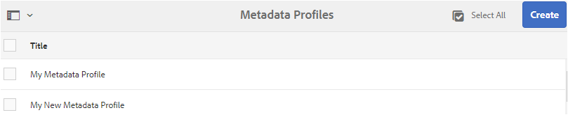

# Configurazione e amministrazione della funzionalità dei metadati in [!DNL Assets] {#config-metadata}

| Versione | Collegamento articolo |
| -------- | ---------------------------- |
| AEM as a Cloud Service | [Fai clic qui](https://experienceleague.adobe.com/docs/experience-manager-cloud-service/content/assets/manage/metadata-profiles.html?lang=en) |
| AEM 6.5 | Questo articolo |

<!-- Scope of metadata articles:
* metadata.md: The scope of this article is basic metadata updates, changes, etc. operations that end-users can do.
* metadata-concepts.md: All conceptual information. Minor instructions are OK but it is an FYI article about support and standards.
* metadata-config.md: New article. Contains all configuration and administration how-to info related to metadata of assets.
-->

[!DNL Adobe Experience Manager Assets] conserva i metadati per ogni risorsa. Consente di organizzare e classificare più facilmente le risorse e aiuta le persone che cercano una specifica risorsa. Grazie alla possibilità di mantenere e gestire i metadati con le risorse, puoi organizzare ed elaborare automaticamente le risorse in base ai relativi metadati. [!DNL Adobe Experience Manager Assets] consente agli amministratori di configurare e personalizzare la funzionalità dei metadati per modificare l’offerta di Adobe predefinita.

## Modifica schema metadati {#metadata-schema}

Per maggiori dettagli, vedi [modifica dei moduli schema metadati](metadata-schemas.md#edit-metadata-schema-forms).

## Registra uno spazio dei nomi personalizzato in [!DNL Experience Manager] {#registering-a-custom-namespace-within-aem}

Puoi aggiungere spazi dei nomi personalizzati all’interno di [!DNL Experience Manager]. Allo stesso modo in cui esistono spazi dei nomi predefiniti, ad esempio `cq`, `jcr`e `sling`, è possibile disporre di uno spazio dei nomi per i metadati del repository e l&#39;elaborazione XML.

1. Accedi alla pagina di amministrazione del tipo di nodo `https://[aem_server]:[port]/crx/explorer/nodetypes/index.jsp`.
1. Per accedere alla pagina di amministrazione dello spazio dei nomi, fai clic su **[!UICONTROL Namespace]** nella parte superiore della pagina.
1. Per aggiungere uno spazio dei nomi, fai clic su **[!UICONTROL Nuovo]** nella parte inferiore della pagina.
1. Specifica uno spazio dei nomi personalizzato nella convenzione dello spazio dei nomi XML. Specifica l’ID sotto forma di URI e un prefisso associato per l’ID. Fai clic su **[!UICONTROL Salva]**.

## Configurare i limiti per l’aggiornamento in massa dei metadati {#bulk-metadata-update-limit}

Per evitare una situazione di negazione del servizio (DOS), [!DNL Enterprise Manager] limita il numero di parametri supportati in una richiesta Sling. Quando aggiorni i metadati di molte risorse in una sola volta, potresti raggiungere il limite e i metadati non vengono aggiornati per altre risorse. Enterprise Manager genera il seguente avviso nei registri:

`org.apache.sling.engine.impl.parameters.Util Too many name/value pairs, stopped processing after 10000 entries`

Per modificare il limite, accedi **[!UICONTROL Strumenti]** > **[!UICONTROL Operazioni]** > **[!UICONTROL Console web]** e modificare il valore di **[!UICONTROL Parametri massimi di POST]** in **[!UICONTROL Gestione dei parametri della richiesta Sling Apache]** Configurazione OSGi.

## Profili metadati {#metadata-profiles}

Un profilo di metadati consente di applicare metadati predefiniti alle risorse all’interno di una cartella. Crea un profilo di metadati e applicalo a una cartella. Qualsiasi risorsa caricata successivamente nella cartella eredita i metadati predefiniti configurati nel profilo di metadati.

### Aggiungere un profilo di metadati {#adding-a-metadata-profile}

1. Passa a **[!UICONTROL Strumenti]** > **[!UICONTROL Risorse]** > **[!UICONTROL Profili metadati]** e fai clic su **[!UICONTROL Crea]**.
1. Immetti un titolo per il profilo, ad esempio `Sample Metadata`e fai clic su **[!UICONTROL Crea]**. La [!UICONTROL Modifica modulo] viene visualizzato il profilo metadati .

   

1. Fai clic su un componente e configurane le proprietà nel **[!UICONTROL Impostazioni]** scheda . Ad esempio, fai clic su **[!UICONTROL Descrizione]** e modificane le proprietà.

   

   Modifica le seguenti proprietà per **[!UICONTROL Descrizione]** componente:

   * **[!UICONTROL Etichetta campo]**: Nome visualizzato della proprietà metadati. È solo per il riferimento utente.

   * **[!UICONTROL Mappa su proprietà]**: Il valore di questa proprietà fornisce il percorso o il nome relativo al nodo della risorsa in cui viene salvata nell’archivio. Il valore deve sempre iniziare con `./` perché indica che il percorso si trova sotto il nodo della risorsa.

   

   Il valore specificato per **[!UICONTROL Mappa su proprietà]** è memorizzato come proprietà sotto il nodo di metadati della risorsa. Ad esempio, se specifichi `./jcr:content/metadata/dc:desc` come nome **[!UICONTROL Mappa su proprietà]**, [!DNL Assets] memorizza il valore `dc:desc` nel nodo di metadati della risorsa. Adobe consiglia di mappare un solo campo a una determinata proprietà nello schema metadati. In caso contrario, il sistema seleziona il campo aggiunto più recente mappato alla proprietà.

   * **[!UICONTROL Valore predefinito]**: Utilizzare questa proprietà per aggiungere un valore predefinito per il componente metadati. Ad esempio, se specifichi &quot;Descrizione personale&quot;, questo valore viene assegnato alla proprietà `dc:desc` nel nodo di metadati della risorsa.

   

   >[!NOTE]
   >
   >Aggiunta di un valore predefinito a una nuova proprietà di metadati (che non esiste in `/jcr:content/metadata` node) non visualizza la proprietà e il relativo valore nel [!UICONTROL Proprietà] per impostazione predefinita. Per visualizzare la nuova proprietà sulle risorse [!UICONTROL Proprietà] modificare il modulo schema corrispondente.

1. (Facoltativo) In **[!UICONTROL Crea modulo]** scheda , aggiungi altri componenti a [!UICONTROL Modifica modulo]e configurane le proprietà in **[!UICONTROL Impostazioni]** scheda . Le seguenti proprietà sono disponibili nel **[!UICONTROL Crea modulo]** scheda:

| Componente | Proprietà |
| ----------------------------- | ----------------------------------------------------------------------- |
| [!UICONTROL Intestazione sezione] | Etichetta campo,   Descrizione |
| [!UICONTROL Testo a riga singola] | Etichetta campo,   Mappa su proprietà,   Valore predefinito |
| [!UICONTROL Testo con più valori] | Etichetta campo,   Mappa su proprietà,   Valore predefinito |
| [!UICONTROL Numero] | Etichetta campo,   Mappa su proprietà,   Valore predefinito |
| [!UICONTROL Data] | Etichetta campo,   Mappa su proprietà,   Valore predefinito |
| [!UICONTROL Tag standard] | Etichetta campo,   Mappa su proprietà,   Valore predefinito,   Descrizione |

1. Fai clic su **[!UICONTROL Fine]**. Il profilo metadati viene aggiunto all’elenco dei profili nel **[!UICONTROL Profili metadati]** pagina. 

   

### Copiare un profilo di metadati {#copying-a-metadata-profile}

1. Da **[!UICONTROL Profili metadati]** , seleziona un profilo di metadati per crearne una copia.

   

1. Fai clic su **[!UICONTROL Copia]** dalla barra degli strumenti.
1. In **[!UICONTROL Copia profilo metadati]** immetti un titolo per la nuova copia del profilo metadati.
1. Fai clic su **[!UICONTROL Copia]**. La copia del profilo metadati viene visualizzata nell’elenco apposito della pagina **[!UICONTROL Profili metadati]**.

   

### Eliminare un profilo di metadati {#deleting-a-metadata-profile}

1. Da **[!UICONTROL Profili metadati]** , seleziona un profilo da eliminare.

1. Fai clic su **[!UICONTROL Elimina profili metadati]** nella barra degli strumenti.
1. Nella finestra di dialogo, fai clic su **[!UICONTROL Elimina]** per confermare l’operazione di eliminazione. Il profilo metadati viene eliminato dall’elenco.

<!-- TBD: Revisit to find out the correct config. and update these steps. When fixed, also o
These steps have been carried forward from old AEM versions. See https://helpx.adobe.com/experience-manager/6-2/assets/using/metadata-profiles.html#ApplyingaMetadataProfiletoFolders

### Configuration to apply a metadata profile globally {#apply-a-metadata-profile-globally}

In addition to applying a profile to a folder, you can also apply one globally so that any content uploaded into [!DNL Experience Manager] assets in any folder has the selected profile applied.

You can reprocess assets in a folder that already has an existing metadata profile that you later changed. See [Reprocessing assets in a folder after you have edited its processing profile](processing-profiles.md#reprocessing-assets).

To apply a metadata profile globally, follow these steps:

* Navigate to `https://[aem_server]:[port]/mnt/overlay/dam/gui/content/assets/foldersharewizard.html/content/dam` and apply the appropriate profile and click **[!UICONTROL Save]**.

  

* In CRXDE Lite, navigate to the following node: `/content/dam/jcr:content`. Add the property `metadataProfile:/etc/dam/metadata/dynamicmedia/<name of metadata profile>` and click **[!UICONTROL Save All]**.

  
-->

## Schema metadati per una cartella {#folder-metadata-schema}

[!DNL Adobe Experience Manager Assets] consente di creare schemi di metadati per le cartelle di risorse, che definiscono il layout e i metadati visualizzati nelle pagine delle proprietà della cartella.

### Aggiunta di un modulo schema metadati cartella {#add-a-folder-metadata-schema-form}

Utilizza l’editor Forms per Schema metadati cartelle per creare e modificare schemi di metadati per le cartelle.

1. In [!DNL Experience Manager] interfaccia, vai a **[!UICONTROL Strumenti]** > **[!UICONTROL Risorse]** > **[!UICONTROL Schemi metadati cartelle]**.
1. Sulla [!UICONTROL Forms schema metadati cartelle] pagina, fai clic su **[!UICONTROL Crea]**.
1. Specificare un nome per il modulo e fare clic su **[!UICONTROL Crea]**. Il nuovo modulo schema è elencato nella [!UICONTROL Schema Forms] pagina.

### Modifica dei moduli dello schema metadati della cartella {#edit-folder-metadata-schema-forms}

È possibile modificare un modulo schema metadati appena aggiunto o esistente, che include quanto segue:

* Schede
* Elementi modulo all’interno di schede.

Puoi mappare/configurare questi elementi del modulo su un campo all’interno di un nodo di metadati nell’archivio CRX. È possibile aggiungere nuove schede o nuovi elementi modulo al modulo schema metadati.

1. Nella pagina Forms schema, selezionare il modulo creato, quindi selezionare il **[!UICONTROL Modifica]** dalla barra degli strumenti.
1. Nella pagina Editor schema metadati cartelle, fai clic su `+` per aggiungere una scheda al modulo. Per rinominare la scheda, fare clic sul nome predefinito e specificare il nuovo nome in **[!UICONTROL Impostazioni]**.

   

   Per aggiungere altre schede, fai clic su `+`. Per eliminare, fai clic su `X` su una scheda.

1. Nella scheda attiva , aggiungi uno o più componenti dal **[!UICONTROL Crea modulo]** scheda .

   

   Se crei più schede, fai clic su una scheda specifica per aggiungere componenti.

1. Per configurare un componente, selezionalo e modificane le proprietà nel **[!UICONTROL Impostazioni]** scheda .

   Se necessario, elimina un componente dal **[!UICONTROL Impostazioni]** scheda .

   

1. Per salvare le modifiche, seleziona **[!UICONTROL Salva]** dalla barra degli strumenti.

#### Componenti per la creazione di moduli {#components-to-build-forms}

La **[!UICONTROL Crea modulo]** nella scheda vengono elencati gli elementi del modulo utilizzati nel modulo schema metadati della cartella. La **[!UICONTROL Impostazioni]** visualizza gli attributi per ogni elemento selezionato nella scheda **[!UICONTROL Crea modulo]** scheda . Elenco degli elementi del modulo disponibili nel **[!UICONTROL Crea modulo]** scheda:

| Nome componente | Descrizione |
|---|---|
| [!UICONTROL Intestazione sezione] | Aggiungi un’intestazione di sezione per un elenco di componenti comuni. |
| [!UICONTROL Testo su riga singola] | Aggiungi una proprietà di testo a riga singola. Viene memorizzato come stringa. |
| [!UICONTROL Testo con più valori] | Aggiungi una proprietà di testo con più valori. Viene memorizzato come array di stringhe. |
| [!UICONTROL Numero] | Aggiungi un componente numerico. |
| [!UICONTROL Data] | Aggiungi un componente data . |
| [!UICONTROL A discesa] | Aggiungi un elenco a discesa. |
| [!UICONTROL Tag standard] | Aggiungi un tag. |
| [!UICONTROL Campo nascosto] | Aggiungi un campo nascosto. Viene inviato come parametro POST al momento del salvataggio della risorsa. |

#### Modifica degli elementi del modulo {#editing-form-items}

Per modificare le proprietà degli elementi del modulo, fai clic sul componente e modifica tutte le proprietà o un sottoinsieme di esse nel **[!UICONTROL Impostazioni]** scheda .

**[!UICONTROL Etichetta campo]**: Nome della proprietà di metadati visualizzata nella pagina delle proprietà della cartella.

**[!UICONTROL Mappa su proprietà]**: Questa proprietà specifica il percorso relativo del nodo della cartella nell&#39;archivio CRX in cui viene salvato. Inizia con &quot;**./**&quot;, che indica che il percorso si trova sotto il nodo della cartella.

Di seguito sono riportati i valori validi per questa proprietà:

* `./jcr:content/metadata/dc:title`: Memorizza il valore nel nodo di metadati della cartella come proprietà `dc:title`.

* `./jcr:created`: Visualizza la proprietà JCR nel nodo della cartella. Se configuri queste proprietà in CRXDE, Adobe consiglia di contrassegnarle come Disabilita modifica, perché sono protette. Altrimenti, l&#39;errore &#39; `Asset(s) failed to modify`&quot; si verifica quando salvi le proprietà della risorsa.

Per garantire che il componente sia visualizzato correttamente nel modulo schema metadati, non includere uno spazio nel percorso della proprietà.

**[!UICONTROL Percorso JSON]**: Usarlo per specificare il percorso del file JSON in cui specificare coppie chiave-valore per le opzioni.

**[!UICONTROL Segnaposto]**: Utilizzare questa proprietà per specificare il testo segnaposto pertinente relativo alla proprietà metadati.

**[!UICONTROL Scelte]**: Utilizzare questa proprietà per specificare le scelte in un elenco.

**[!UICONTROL Descrizione]**: Utilizza questa proprietà per aggiungere una breve descrizione per il componente metadati.

**[!UICONTROL Classe]**: Classe oggetto a cui è associata la proprietà.

### Eliminare i moduli di schema metadati della cartella {#delete-folder-metadata-schema-forms}

È possibile eliminare i moduli schema metadati cartelle dalla pagina Forms Schema metadati cartelle. Per eliminare un modulo, selezionarlo e fare clic sull’opzione Elimina sulla barra degli strumenti.

### Assegnare uno schema di metadati della cartella {#assign-a-folder-metadata-schema}

È possibile assegnare uno schema di metadati a una cartella dalla pagina Forms Schema metadati cartelle o durante la creazione di una cartella.

Se si configura uno schema di metadati per una cartella, il percorso del modulo schema viene memorizzato in `folderMetadataSchema` proprietà del nodo della cartella sotto `./jcr:content`.

#### Assegnare a uno schema dalla pagina Schema metadati cartelle {#assign-to-a-schema-from-the-folder-metadata-schema-page}

1. In [!DNL Experience Manager] interfaccia, vai a **[!UICONTROL Strumenti]** > **[!UICONTROL Risorse]** > **[!UICONTROL Schemi metadati cartelle]**.
1. Nella pagina Forms Schema metadati cartelle selezionare il modulo schema da applicare a una cartella.
1. Dalla barra degli strumenti, fai clic su **[!UICONTROL Applica a cartelle]**.

1. Selezionare la cartella in cui applicare lo schema, quindi fare clic su **[!UICONTROL Applica]**. Se nella cartella è già applicato uno schema di metadati, un messaggio di avviso segnala che lo schema di metadati esistente sta per essere sovrascritto. Fai clic su **[!UICONTROL Sovrascrittura]**.
1. Apri le proprietà dei metadati per la cartella a cui hai applicato lo schema metadati.

   

   Per visualizzare i campi di metadati della cartella, fai clic sul pulsante **[!UICONTROL Metadati cartella]** scheda .

   

#### Assegnare uno schema durante la creazione di una cartella {#assign-a-schema-when-creating-a-folder}

È possibile assegnare uno schema di metadati della cartella durante la creazione di una cartella. Se nel sistema è presente almeno uno schema di metadati della cartella, viene visualizzato un elenco aggiuntivo nel **[!UICONTROL Crea cartella]** finestra di dialogo. È possibile selezionare lo schema desiderato. Per impostazione predefinita, non è selezionato alcun schema.

1. Da [!DNL Experience Manager Assets] interfaccia utente, fai clic su **[!UICONTROL Crea]** dalla barra degli strumenti.
1. Specifica un titolo e un nome per la cartella.
1. Dall’elenco Schema metadati cartelle, selezionare lo schema desiderato. Quindi, fai clic su **[!UICONTROL Crea]**.

   

1. Apri le proprietà dei metadati per la cartella a cui hai applicato lo schema metadati.
1. Per visualizzare i campi di metadati della cartella, fai clic sul pulsante **[!UICONTROL Metadati cartella]** scheda .

### Utilizzare lo schema metadati della cartella {#use-the-folder-metadata-schema}

Apri le proprietà di una cartella configurata con uno schema di metadati della cartella. A **[!UICONTROL Metadati cartella]** nella cartella [!UICONTROL Proprietà] pagina. Seleziona questa scheda per visualizzare il modulo schema metadati della cartella.

Immetti i valori dei metadati nei vari campi e fai clic su **[!UICONTROL Salva]** per memorizzare i valori. I valori specificati vengono memorizzati nel nodo della cartella nell&#39;archivio CRX.

## Suggerimenti e limitazioni {#best-practices-limitations}

* Per importare i metadati negli spazi dei nomi personalizzati, registra innanzitutto gli spazi dei nomi.
* Selettore proprietà visualizza le proprietà utilizzate negli editor dello schema e nei moduli di ricerca. Il selettore proprietà non seleziona le proprietà dei metadati da una risorsa.
* È possibile che siano già presenti profili di metadati preesistenti prima dell’aggiornamento a [!DNL Experience Manager] 6.5. Dopo l&#39;aggiornamento, se si applica un profilo di questo tipo nella cartella [!UICONTROL Proprietà] in [!UICONTROL Profili metadati] i campi del modulo metadati non vengono visualizzati. Tuttavia, se si applica un profilo di metadati appena creato, i campi del modulo vengono visualizzati ma non sono disponibili come previsto. Non si verifica alcuna perdita di funzionalità, ma se desideri visualizzare i campi del modulo (non disponibili), modifica e salva i profili di metadati esistenti.

>[!MORELIKETHIS]
>
>* [Concetti di metadati e comprensione](metadata-concepts.md).
>* [Modifica delle proprietà dei metadati di più raccolte](manage-collections.md#editing-collection-metadata-in-bulk).
>* [Importazione ed esportazione di metadati in Experience Manager Assets](https://experienceleague.adobe.com/docs/experience-manager-learn/assets/metadata/metadata-import-export.html).
>* [Profili per elaborare metadati, immagini e video](processing-profiles.md).
>* [Best practice per organizzare le risorse digitali in modo da utilizzare i profili di elaborazione](/help/assets/organize-assets.md).
>* [XMP](/help/assets/xmp-writeback.md).

