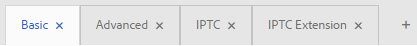
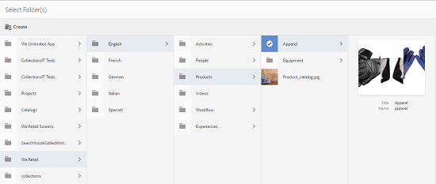

# Schemi metadati {#metadata-schemas}

Le organizzazioni dispongono di un modello di metadati che migliora l’individuazione delle risorse, l’utilizzo, l’interoperabilità e così via. La corretta applicazione di metadati è fondamentale per mantenere i flussi di lavoro e i processi basati su metadati. Per aderire alla strategia e agli standard dei metadati a livello di organizzazione, potete utilizzare schemi di metadati che aiutano gli utenti DAM ad allineare. [!DNL Adobe Experience Manager] consente di creare, gestire e applicare schemi di metadati in modo semplice e flessibile.

Gli schemi [!DNL Adobe Experience Manager Assets]contengono campi specifici per informazioni specifiche da compilare. Contiene inoltre informazioni sul layout per visualizzare i campi di metadati in modo semplice e intuitivo. Le proprietà dei metadati includono titolo, descrizione, tipi MIME, tag e altro. Potete usare l’editor Forms [!UICONTROL Schema] metadati per modificare gli schemi esistenti o aggiungere schemi di metadati personalizzati.

Per visualizzare e modificare la pagina delle proprietà di una risorsa, effettuate le seguenti operazioni:

1. Fate clic sull’opzione **[!UICONTROL Visualizza proprietà]** dalle azioni rapide nella sezione delle risorse nella vista a schede. In alternativa, seleziona una risorsa e fai clic su **[!UICONTROL Proprietà]** per  dalla barra degli strumenti.

1. Potete modificare le varie proprietà di metadati modificabili nelle schede disponibili. Tuttavia, non è possibile modificare il [!UICONTROL tipo] di risorsa nella scheda [!UICONTROL Base] della pagina delle proprietà.

   

*Figura: Scheda Base in[!UICONTROL Proprietà]risorsa.*

Per modificare il tipo MIME di una risorsa, utilizzate un modulo schema di metadati personalizzato o modificate un modulo esistente. Per ulteriori informazioni, consultate [Modifica Forms](/help/assets/metadata-schemas.md#edit-metadata-schema-forms) schema metadati. Se modificate lo schema di metadati di un tipo MIME, viene modificato il layout della pagina delle proprietà per le risorse e tutti i sottotipi. Ad esempio, modificando uno schema jpeg in `default/image` viene modificato solo il layout dei metadati (proprietà risorsa) per le risorse con tipo MIME `image/jpeg`. Tuttavia, se modificate lo schema predefinito, le modifiche apportate modificheranno il layout dei metadati per tutti i tipi di risorse.

## Metadata Schema forms {#default-metadata-schema-forms}

Per visualizzare un elenco di moduli o modelli, nell&#39; [!DNL Experience Manager] interfaccia passare a **[!UICONTROL Strumenti]** > **[!UICONTROL Risorse]** > Schemi **[!UICONTROL di]** metadati.

[!DNL Experience Manager] fornisce i seguenti modelli di modulo Schema metadati.

| Modelli |  | Descrizione |
|---|---|---|
| [!UICONTROL impostazione predefinita] |  | Modulo schema metadati di base per le risorse. |
|  | I seguenti moduli secondari ereditano le proprietà del modulo [!UICONTROL predefinito] : |  |
|  | <ul><li>[!UICONTROL dm_video]</li></ul> | Modulo di schema per video Contenuti multimediali dinamici. |
|  | <ul><li>[!UICONTROL immagine]</li></ul> | Modulo schema per immagini con tipo MIME, ad esempio `image/jpeg` e `image/png`.   Il modulo [!UICONTROL immagine] include i seguenti modelli di modulo figlio: <ul><li> [!UICONTROL jpeg]: Modulo schema per risorse con [!UICONTROL jpeg]di tipo secondario.</li> <li>[!UICONTROL tiff]: Modulo schema per le risorse con il sottotipo TIFF.</li></ul> |
|  | <ul><li>[!UICONTROL applicazione]</li></ul> | Modulo schema per risorse con tipo MIME, ad esempio `application/pdf` e `application/zip`.  [!UICONTROL pdf]: Modulo schema per risorse con PDF di tipo secondario. |
|  | <ul><li>[!UICONTROL video]</li></ul> | Modulo schema per risorse video con tipo MIME, ad esempio `video/avi` e `video/mp4`. |
| [!UICONTROL collection] |  | Modulo schema per le raccolte. |
| [!UICONTROL contentFragment] |  | [Modulo schema per frammenti](/help/sites-developing/customizing-content-fragments.md)di contenuto. |
| [!UICONTROL forms] |  | Questo modulo schema si riferisce a [Adobe Experience Manager Forms](/help/forms/home.md). |
| [!UICONTROL ugc_contentfragment] |  | Modulo di schema per contenuti generati dall&#39;utente e risorse integrate  Experience Manager dai social media. |

>[!NOTE]
>
>Per visualizzare i moduli secondari di un modulo schema, fare clic sul nome del modulo schema.

## Aggiunta di uno schema di metadati {#add-a-metadata-schema-form}

Per aggiungere uno schema di metadati, effettuate le seguenti operazioni:

1. Per aggiungere un modello personalizzato all’elenco, fate clic su **[!UICONTROL Crea]** dalla barra degli strumenti.

   >[!NOTE]
   >
   >Un simbolo di blocco viene visualizzato con i modelli non modificati. Se personalizzate un modello, esso non è bloccato .

1. Nella finestra di dialogo, specificare il titolo del modulo schema e fare clic su **[!UICONTROL Crea]** per completare il processo di creazione del modulo.

## Modificare i moduli dello schema di metadati {#edit-metadata-schema-forms}

È possibile modificare un modulo di schema di metadati appena aggiunto o esistente. Il modulo schema metadati include schede ed elementi modulo all&#39;interno di schede. È possibile mappare/configurare questi elementi del modulo su un campo all’interno di un nodo di metadati nell’archivio CRX. È possibile aggiungere schede o elementi modulo al modulo schema di metadati. Le schede e gli elementi del modulo derivati dall&#39;elemento padre sono nello stato bloccato. Non è possibile modificarle a livello di figlio.

1. Nella pagina Forms [!UICONTROL Schema] metadati, selezionate un modulo e fate clic su **[!UICONTROL Modifica]** nella barra degli strumenti.

1. Nella pagina Editor **[!UICONTROL modulo schema]** metadati, personalizzate il modulo di metadati. Trascinare i componenti necessari dalla scheda **[!UICONTROL Genera modulo]** su una delle schede.

   

   *Figura: Pagina Editor[!UICONTROL di moduli schema]metadati con schede disponibili.*

1. Per configurare un componente, selezionatelo e modificatene le proprietà nella scheda **[!UICONTROL Impostazioni]** .

### Componenti nella scheda [!UICONTROL Genera modulo] {#components-within-the-build-form-tab}

Nella scheda **[!UICONTROL Genera modulo]** sono elencati gli elementi del modulo utilizzati nel modulo schema. La scheda **[!UICONTROL Impostazioni]** fornisce gli attributi di ogni elemento selezionato nella scheda **[!UICONTROL Modulo]** di creazione. Nella tabella seguente sono elencati gli elementi del modulo disponibili nella scheda **[!UICONTROL Genera modulo]** :

| Nome componente | Descrizione |
| -------------------------------- | ----------------------------------------------------------------------------------- |
| [!UICONTROL Intestazione sezione] | Aggiungere un&#39;intestazione di sezione per un elenco di componenti comuni. |
| [!UICONTROL Testo su riga singola] | Aggiungere una proprietà di testo a riga singola. È memorizzato come stringa. |
| [!UICONTROL Testo con più valori] | Aggiungete una proprietà di testo con più valori. È memorizzato come array di stringhe. |
| [!UICONTROL Numero] | Aggiungere un componente numero. |
| [!UICONTROL Data] | Aggiungere un componente data. |
| [!UICONTROL A discesa] | Aggiungere un elenco a discesa. |
| [!UICONTROL Tag standard] | Aggiungi un tag. |
| [!UICONTROL Tag avanzati] | Aggiungete nuove funzionalità di ricerca aggiungendo automaticamente tag di metadati. |
| [!UICONTROL Campo nascosto] | Aggiungere un campo nascosto. Viene inviato come parametro POST al momento del salvataggio della risorsa. |
| [!UICONTROL Risorsa con riferimento da] | Aggiungete questo componente per visualizzare l’elenco delle risorse a cui fa riferimento la risorsa. |
| [!UICONTROL Risorsa con riferimento a] | Aggiungi per visualizzare un elenco delle risorse che fanno riferimento alla risorsa. |
| [!UICONTROL Riferimenti sui prodotti] | Aggiungi per visualizzare l’elenco dei prodotti collegati alla risorsa. |
| [!UICONTROL Valutazione risorsa] | Aggiungi a opzioni di visualizzazione per la valutazione della risorsa. |
| [!UICONTROL Metadati contestuali] | Aggiungi per controllare la visualizzazione di altre schede di metadati nella pagina delle proprietà delle risorse. |

#### Modificare il componente metadati {#edit-the-metadata-component}

Per modificare le proprietà di un componente di metadati sul modulo, fate clic sul componente per modificare tutte o un sottoinsieme delle seguenti proprietà nella scheda **[!UICONTROL Impostazioni]** .

**Etichetta** campo: Nome della proprietà di metadati visualizzata nella pagina delle proprietà della risorsa.

**Mappa su proprietà**: Questa proprietà specifica il percorso relativo o il nome del nodo della risorsa in cui viene salvato nell&#39;archivio CRX. Inizia con `./` per indicare che il percorso si trova sotto il nodo della risorsa.

Di seguito sono riportati i valori validi per questa proprietà:

* `./jcr:content/metadata/dc:title`: memorizza il valore come proprietà nel nodo di metadati della risorsa `dc:title`.

* `./jcr:created`: Memorizza la data e l’ora di creazione di una risorsa. È una proprietà protetta. Se configurate queste proprietà,  Adobe consiglia di contrassegnarle come Disattiva modifica.

Per garantire che il componente venga visualizzato correttamente nel modulo dello schema di metadati, il percorso della proprietà non deve includere spazi.

* **Segnaposto**: Utilizzare questa proprietà per specificare il testo segnaposto relativo alla proprietà metadata.
* **Obbligatorio**: Utilizzare questa proprietà per contrassegnare una proprietà di metadati come obbligatoria nella pagina delle proprietà.
* **Disattiva modifica**: Utilizzare questa proprietà per non consentire alcuna modifica a una proprietà nella pagina delle proprietà.
* **Mostra campo vuoto in sola** lettura: Contrassegnate questa proprietà per visualizzare una proprietà di metadati nella pagina delle proprietà anche se non ha alcun valore. Per impostazione predefinita, quando una proprietà di metadati non ha alcun valore, non viene elencata nella pagina delle proprietà.
* **Mostra elenco ordinato**: Utilizzare questa proprietà per visualizzare un elenco ordinato di scelte.
* **Scelte**: Utilizzare questa proprietà per specificare le scelte in un elenco.
* **Descrizione** : Utilizzate questa proprietà per aggiungere una breve descrizione per il componente di metadati.
* **Classe**: Classe oggetto a cui è associata la proprietà.
* **Elimina**: Fare clic su [!UICONTROL Elimina] per eliminare un componente dal modulo schema.

>[!NOTE]
>
>Il componente Campo  nascosto non include questi attributi. ma include proprietà quali Nome, Valore, Etichetta campo e Descrizione. I valori per il componente Campo nascosto vengono inviati come parametro POST ogni volta che la risorsa viene salvata. Non viene salvato come metadati per la risorsa.

Se selezioni l’opzione **[!UICONTROL Obbligatorio]**, puoi cercare le risorse per le quali mancano i metadati obbligatori. Dal pannello **[!UICONTROL Filtri]**, espandi il predicato **[!UICONTROL Convalida metadati]** e seleziona l’opzione **[!UICONTROL Non valido]**. Nei risultati della ricerca vengono visualizzate le risorse per le quali mancano i metadati obbligatori, che sono stati configurati dal modulo schema.

Se aggiungete il componente Metadati contestuali a qualsiasi scheda di un modulo dello schema, il componente viene visualizzato come un elenco nella pagina delle proprietà delle risorse a cui è applicato lo schema specifico. L’elenco include tutte le altre schede eccetto la scheda a cui è stato applicato il componente Metadati contestuali. Attualmente, questa funzione fornisce funzionalità di base per controllare la visualizzazione dei metadati in base al contesto.

Per visualizzare una scheda qualsiasi nella pagina delle proprietà, oltre alla scheda in cui è applicato il componente Metadati contestuali, selezionare la scheda dall&#39;elenco. La scheda viene aggiunta alla pagina delle proprietà.

*Figura: Metadati contestuali nella pagina delle proprietà della risorsa.*

### Specificare le proprietà nel file JSON {#specify-properties-in-json-file}

Invece di specificare le proprietà delle opzioni nella scheda **[!UICONTROL Impostazioni]**, puoi definire le opzioni in un file JSON, specificando le coppie chiave-valore corrispondenti. Nel campo **[!UICONTROL Percorso JSON]**, specifica il percorso del file JSON.

#### Aggiunta o eliminazione di una scheda nel modulo schema {#adding-deleting-a-tab-in-the-schema-form}

L’editor dello schema consente di aggiungere o eliminare una scheda. The default schema form includes the **[!UICONTROL Basic]**, **[!UICONTROL Advanced]** , **[!UICONTROL IPTC]**, and **[!UICONTROL IPTC Extension]** tabs.

Fare clic `+` per aggiungere una scheda a un modulo schema. Per impostazione predefinita, la nuova scheda ha il nome `Unnamed-1`. Potete modificare il nome dalla scheda **[!UICONTROL Impostazioni]** . Fare clic `X` per eliminare una scheda.

## Metadati a cascata {#cascading-metadata}

Quando acquisite le informazioni di metadati di una risorsa, gli utenti forniscono informazioni nei vari campi disponibili. Potete visualizzare campi di metadati o valori di campi specifici che dipendono dalle opzioni selezionate negli altri campi. Tale visualizzazione condizionale dei metadati è denominata metadati CSS. In altre parole, potete creare una dipendenza tra un particolare campo/valore di metadati e uno o più campi e/o relativi valori.

Usate gli schemi di metadati per definire le regole per la visualizzazione dei metadati CSS. Ad esempio, se lo schema di metadati include un campo del tipo di risorsa, potete definire un set di campi pertinenti da visualizzare in base al tipo di risorsa selezionata dall’utente.

>[!CAUTION]
>
>I metadati a cascata non sono supportati per i frammenti di contenuto.

Di seguito sono riportati alcuni casi d’uso per i quali potete definire metadati a cascata:

* Se è richiesta la posizione dell&#39;utente, visualizzate i nomi delle città pertinenti in base alla scelta del paese e dello stato dell&#39;utente.
* Caricate i nomi dei marchi pertinenti in un elenco in base alla scelta della categoria di prodotti da parte dell&#39;utente.
* Attiva o disattiva la visibilità di un particolare campo in base al valore specificato in un altro campo. Ad esempio, visualizzare campi indirizzo di spedizione separati se l&#39;utente desidera che la spedizione venga consegnata a un indirizzo diverso.
* Designare un campo come obbligatorio in base al valore specificato in un altro campo.
* Modifica le opzioni visualizzate per un particolare campo in base al valore specificato in un altro campo.
* Impostate il valore di metadati predefinito in un particolare campo in base al valore specificato in un altro campo.

### Configurare i metadati CSS in [!DNL Experience Manager] {#configure-cascading-metadata-in-aem}

Considerate uno scenario in cui visualizzare i metadati a cascata in base al tipo di risorsa selezionata. Alcuni esempi

* Per un video, visualizzate i campi applicabili come formato, codec, durata e così via.
* Per un documento Word o PDF, visualizzare campi quali conteggio delle pagine, autore e così via.

Indipendentemente dal tipo di risorsa scelta, visualizzate le informazioni sul copyright come campo obbligatorio.

1. Nell’ [!DNL Experience Manager] interfaccia, andate a **[!UICONTROL Strumenti]** > **[!UICONTROL Risorse]** > Schemi di **[!UICONTROL metadati]**.
1. In the **[!UICONTROL Schema Forms]** page, select a schema form and then click **[!UICONTROL Edit]** from the toolbar to edit the schema.

   

1. (Facoltativo) Nell’editor dello schema di metadati, create un nuovo campo da personalizzare. Specificate un nome e un percorso di proprietà nella scheda **[!UICONTROL Impostazioni]** .

   Per creare una nuova scheda, fate clic `+` per aggiungere una scheda e quindi un campo di metadati.

   

1. Aggiungi un campo a discesa per il tipo di risorsa. Specificate un nome e un percorso di proprietà nella scheda **[!UICONTROL Impostazioni]** . Aggiungete una descrizione facoltativa.

   

1. Le coppie di valori chiave sono le opzioni fornite all&#39;utente del modulo. Puoi fornire le coppie chiave-valore manualmente o da un file JSON.

   * Per specificare manualmente i valori, selezionate **[!UICONTROL Aggiungi manualmente]**, quindi fate clic su **[!UICONTROL Aggiungi scelta]** e specificate il testo e il valore dell’opzione. Ad esempio, specificate i tipi di risorse Video, PDF, Word e Immagine.

   * Per recuperare i valori da un file JSON in modo dinamico, selezionate **[!UICONTROL Aggiungi tramite percorso]** JSON e fornite il percorso del file JSON. [!DNL Experience Manager] recupera le coppie chiave-valore in tempo reale quando il modulo viene presentato all&#39;utente.

   Entrambe le opzioni si escludono a vicenda. Non potete importare le opzioni da un file JSON e modificarle manualmente.

   

   >[!NOTE]
   >
   >Quando si aggiunge un file JSON, le coppie chiave-valore non vengono visualizzate nell&#39;editor dello schema di metadati, ma sono disponibili nel modulo pubblicato.

   >[!NOTE]
   >
   >Quando si aggiungono delle scelte, se si fa clic sul campo a discesa, l&#39;interfaccia risulta distorta e l&#39;opzione di eliminazione non funziona più. Non fate clic sul menu a discesa finché non salvate le modifiche. Se si verifica questo problema, salvare lo schema e aprirlo di nuovo per continuare a modificarlo.

1. (Facoltativo) Aggiungete gli altri campi richiesti. Ad esempio, formato, codec e durata per il tipo di risorsa video.

   Allo stesso modo, aggiungete campi dipendenti per altri tipi di risorse. Ad esempio, aggiungere il conteggio delle pagine dei campi e creare risorse per i documenti, come file PDF e Word.

   

1. Per creare una dipendenza tra il campo del tipo di risorsa e altri campi, scegliete il campo dipendente e aprite la scheda **[!UICONTROL Regole]** .

   

1. Under **[!UICONTROL Requirement]**, choose the **[!UICONTROL Required, based on new rule]** option.
1. Click **[!UICONTROL Add Rule]** and choose the **[!UICONTROL Asset Type]** field to create a dependency. Scegli anche il valore del campo in cui creare la dipendenza. In questo caso, scegli **[!UICONTROL Video]**. Click **[!UICONTROL Done]** to save the changes.

   

   >[!NOTE]
   >
   >Con le regole è possibile utilizzare un elenco a discesa con valori predefiniti manualmente. I menu a discesa con percorso JSON configurato non possono essere utilizzati con regole che utilizzano valori predefiniti per applicare condizioni. Se i valori vengono caricati da JSON in fase di esecuzione, non è possibile applicare una regola predefinita.

1. In **[!UICONTROL Visibilità]**, scegli l’opzione **[!UICONTROL Visibile, in base alla nuova regola]**.

1. Click **[!UICONTROL Add Rule]** and choose the **[!UICONTROL Asset Type]** field to create a dependency. Scegli anche il valore del campo in cui creare la dipendenza. In questo caso, scegli **[!UICONTROL Video]**. Click **[!UICONTROL Done]** to save the changes.

   

   >[!NOTE]
   >
   >Facendo clic su uno spazio vuoto (o in un punto diverso dai valori), i valori vengono reimpostati. In tal caso, selezionate nuovamente i valori.

   >[!NOTE]
   >
   >Puoi applicare la condizione **[!UICONTROL Requisito]** e **[!UICONTROL Visibilità]**, pur lasciandole indipendenti tra di loro.

1. Analogamente, create una dipendenza tra il valore Video nel campo Tipo risorsa e altri campi, come Codec e Durata.
1. Ripetete i passaggi per creare una dipendenza tra le risorse del documento (PDF e Word) nel campo Tipo [!UICONTROL di] risorsa e i campi quali Conteggio  pagina e [!UICONTROL Autore].
1. Fai clic su **[!UICONTROL Salva]**. Applicate lo schema di metadati a una cartella.

1. Andate alla cartella alla quale avete applicato lo schema metadati e aprite la pagina delle proprietà di una risorsa. A seconda della scelta effettuata nel campo Tipo risorsa, vengono visualizzati i campi di metadati CSS pertinenti.

   

   *Figura: Cascading metadata for a video.*

   

   *Figura: Cascading metadata for a document.*

## Eliminazione di moduli schema metadati {#delete-metadata-schema-forms}

[!DNL Experience Manager] consente di eliminare solo i moduli schema personalizzati. Non consente di eliminare i moduli/modelli di schema predefiniti. Tuttavia, è possibile eliminare qualsiasi modifica personalizzata in questi moduli.

Per eliminare un modulo, selezionarlo e fare clic su Elimina.

>[!NOTE]
>
>* Dopo aver eliminato le modifiche personalizzate a un modulo predefinito, il  viene nuovamente visualizzato prima del modulo. Indica che il modulo viene ripristinato allo stato predefinito.
>* Non è possibile eliminare i moduli di schema di metadati predefiniti in [!DNL Assets].

## Moduli schema per tipi MIME {#schema-forms-for-mime-types}

[!DNL Experience Manager] fornisce moduli predefiniti per vari tipi MIME. Tuttavia, è possibile aggiungere moduli personalizzati per risorse di vari tipi MIME.

### Aggiunta di nuovi moduli per i tipi MIME {#add-new-forms-for-mime-types}

Creare un modulo con il tipo appropriato. For example, to add a template for the `image/png` subtype, create the form under the &quot;image&quot; forms. Il titolo del modulo schema è il nome del sottotipo. In this case, the title is `png`.

#### Utilizzare un modello di schema esistente per vari tipi MIME {#use-an-existing-schema-template-for-various-mime-types}

È possibile utilizzare un modello esistente per un tipo MIME diverso. Ad esempio, utilizzare il `image/jpeg` modulo per le risorse di tipo MIME `image/png`.

In questo caso, creare un nodo `/etc/dam/metadataeditor/mimetypemappings` nell&#39;archivio CRX. Specificare un nome per il nodo e definire le seguenti proprietà:

| Nome | Descrizione | Tipo | Valore |
|------|-------------|------|-------|
| `exposedmimetype` | Nome del modulo esistente da mappare | `String` | `image/jpeg` |
| `mimetypes` | Elenco di tipi MIME che utilizzano il modulo definito nell&#39; `exposedmimetype` attributo | `String` | `image/png` |

[!DNL Assets] mappa i seguenti tipi MIME e moduli di schema:

| Modulo schema | Tipi MIME |
| --------------------------- | --------------------------------------------------- |
| image/jpeg | image/pjpeg |
| image/tiff | image/x-tiff |
| application/pdf | application/postscript |
| application/x-ImageSet | Multipart/Related; type=application/x-ImageSet |
| application/x-SpinSet | Multipart/Related; type=application/x-SpinSet |
| application/x-MixedMediaSet | Multipart/Related; type=application/x-MixedMediaSet |
| video/quicktime | video/x-quicktime |
| video/mpeg4 | video/mp4 |
| video/avi | video/avi, video/msvideo, video/x-msvideo |
| video/wmv | video/x-ms-wmv |
| video/flv | video/x-flv |

## Come concedere l’accesso agli schemi di metadati {#grant-access-to-metadata-schemas}

La funzione Schema metadati è disponibile solo per gli amministratori. Tuttavia, gli amministratori possono fornire l&#39;accesso ai non amministratori modificando alcune autorizzazioni. Fornite agli utenti non amministratori le autorizzazioni per creare, modificare ed eliminare la `/conf` cartella.

## Applicare metadati specifici per le cartelle {#apply-folder-specific-metadata}

[!DNL Assets] consente di definire una variante di uno schema di metadati e applicarlo a una cartella specifica.

Ad esempio, potete definire una variante dello schema di metadati predefinito e applicarlo a una cartella. Quando applicate lo schema modificato, questo sostituisce lo schema di metadati predefinito originale applicato alle risorse all&#39;interno della cartella.

Solo le risorse caricate nella cartella a cui viene applicato lo schema sono conformi ai metadati modificati definiti nello schema di metadati della variante. [!DNL Assets] in altre cartelle in cui è applicato lo schema originale, continua a essere conforme ai metadati definiti nello schema originale.

L’ereditarietà dei metadati per risorse si basa sullo schema applicato alla cartella di primo livello nella gerarchia. In altre parole, se una cartella non contiene sottocartelle, le risorse all’interno della cartella ereditano i metadati dallo schema applicato alla cartella.

È possibile applicare uno schema diverso nella sottocartella. Le risorse all’interno di una sottocartella ereditano lo schema di metadati della sottocartella immediata. Se a livello di sottocartella non viene applicato alcuno schema o lo stesso schema, le risorse ereditano lo schema dalla cartella principale.

1. Nell’ [!DNL Experience Manager] interfaccia, passa a **[!UICONTROL Strumenti]** > **[!UICONTROL Risorse]** > Schemi di **[!UICONTROL metadati]**. Viene visualizzata la pagina **[!UICONTROL Moduli schema metadati]**.
1. Selezionare la casella di controllo prima di un modulo, ad esempio il modulo di metadati predefinito, fare clic su **[!UICONTROL Copia]** e salvarlo come modulo personalizzato. Specificare un nome personalizzato per il modulo, ad esempio `my_default`. In alternativa, è possibile creare un modulo personalizzato.

1. Nella pagina Forms **[!UICONTROL Schema]** metadati, selezionate il `my_default` modulo, quindi fate clic su **[!UICONTROL Modifica]**.

1. Nella pagina Editor **[!UICONTROL schema]** metadati, aggiungere un campo di testo al modulo schema. Ad esempio, aggiungere un campo con l&#39;etichetta **[!UICONTROL Categoria]**.

   

   *Figura: Campo di testo aggiunto all&#39;editor di moduli dello schema di metadati.*

1. Fai clic su **[!UICONTROL Salva]**. Il modulo modificato è elencato nella pagina Forms **[!UICONTROL Schema]** metadati.
1. Fate clic su **[!UICONTROL Applica alle cartelle]** nella barra degli strumenti per applicare i metadati personalizzati a una cartella.

1. Selezionare la cartella in cui applicare lo schema modificato, quindi fare clic su **[!UICONTROL Applica]**.

   

1. Se alla cartella è applicato un altro schema di metadati, viene visualizzato un messaggio di avviso che informa che lo schema di metadati esistente sta per essere sovrascritto. Fate clic su **Sovrascrivi**.
1. Fate clic su **OK** per chiudere il messaggio di riuscita.
1. Andate alla cartella a cui avete applicato lo schema di metadati modificato.

## Definire i metadati obbligatori {#define-mandatory-metadata}

Potete definire i campi obbligatori a livello di cartella, che vengono applicati alle risorse caricate nella cartella. Se caricate risorse con metadati mancanti per i campi obbligatori definiti in precedenza, sulle risorse nella vista a schede viene visualizzata un’indicazione visiva dei metadati mancanti.

>[!NOTE]
>
>Un campo di metadati può essere definito come obbligatorio in base al valore di un altro campo. Nella vista a schede, [!DNL Experience Manager] non visualizza il messaggio di avviso relativo ai metadati mancanti per tali campi di metadati obbligatori.

1. Nell’ [!DNL Experience Manager] interfaccia, passa a **[!UICONTROL Strumenti]** > **[!UICONTROL Risorse]** > Schemi di **[!UICONTROL metadati]**. Viene visualizzata la pagina **[!UICONTROL Moduli schema metadati]**.
1. Salvare il modulo di metadati predefinito come modulo personalizzato. Ad esempio, salvatelo con nome `my_default`.

1. Modificare il modulo personalizzato. Aggiungere un campo obbligatorio. Ad esempio, aggiungere un campo **[!UICONTROL Categoria]** e rendere il campo obbligatorio.

   

   *Figura: Campo obbligatorio nell&#39;editor di moduli dello schema di metadati.*

1. Fai clic su **[!UICONTROL Salva]**. Il modulo modificato è elencato nella pagina Forms **[!UICONTROL Schema]** metadati. Selezionate il modulo e fate clic su **[!UICONTROL Applica a cartella]** nella barra degli strumenti per applicare i metadati personalizzati a una cartella.

1. Individuate la cartella e caricate alcune risorse con metadati mancanti per il campo obbligatorio aggiunto al modulo personalizzato. Nella vista a schede della risorsa viene visualizzato un messaggio per i metadati mancanti per il campo obbligatorio.

   

1. (Facoltativo) Accesso `https://[aem_server]:[port]/system/console/components/`. Configura e abilita `com.day.cq.dam.core.impl.MissingMetadataNotificationJob` il componente disabilitato per impostazione predefinita. Impostate una frequenza con cui [!DNL Experience Manager] verificare la validità dei metadati per le risorse. Questa configurazione aggiunge una proprietà `hasValidMetadata` alle `jcr:content` risorse. [!DNL Experience Manager] utilizza questa proprietà per filtrare le risorse non valide in un risultato di ricerca. Se aggiungete una risorsa dopo un controllo, la risorsa non viene segnalata `hasValidMetadata` fino al controllo pianificato successivo. Pertanto, le risorse non vengono visualizzate nei filtri di ricerca per i metadati non validi fino a quando non viene eseguito il controllo pianificato successivo.

   >[!CAUTION]
   >
   >I controlli di convalida dei metadati richiedono molte risorse e possono influire sulle prestazioni del sistema. Pianificare i controlli di conseguenza. Se il server non è in grado di gestire il carico, provare a disattivare il processo.

<!-- TBD: Add this method to find invalid metadata in the metadata.md article later when it is published as a top-level metadata article.
-->
