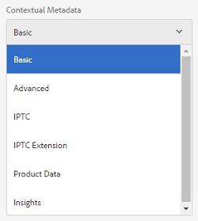

# Schemi metadati {#metadata-schemas}

| Versione | Collegamento articolo |
| -------- | ---------------------------- |
| AEM as a Cloud Service | [Fai clic qui](https://experienceleague.adobe.com/docs/experience-manager-cloud-service/content/assets/manage/metadata-schemas.html?lang=en) |
| AEM 6.5 | Questo articolo |

Le organizzazioni propongono un modello di metadati che migliora l’individuazione delle risorse, l’utilizzo, l’interoperabilità e così via. L’applicazione corretta dei metadati è indispensabile per mantenere i flussi di lavoro e i processi basati sui metadati. Per rispettare la strategia e gli standard per i metadati a livello di organizzazione, puoi utilizzare schemi di metadati che consentono agli utenti DAM di allinearsi. [!DNL Adobe Experience Manager] consente di creare, gestire e applicare schemi di metadati in modo semplice e flessibile.

In entrata [!DNL Adobe Experience Manager Assets], gli schemi contengono campi specifici per informazioni specifiche da compilare. Contiene inoltre informazioni di layout per visualizzare i campi di metadati in modo semplice e intuitivo. Le proprietà dei metadati includono titolo, descrizione, tipi MIME, tag e altro ancora. È possibile utilizzare [!UICONTROL Forms schema metadati] per modificare gli schemi esistenti o aggiungere schemi di metadati personalizzati.

Per visualizzare e modificare la pagina delle proprietà di una risorsa, effettua le seguenti operazioni:

1. Fai clic su **[!UICONTROL Visualizza proprietà]** nella vista a schede. In alternativa, seleziona una risorsa e fai clic su **[!UICONTROL Proprietà]**  dalla barra degli strumenti.

1. Puoi modificare le varie proprietà dei metadati modificabili nelle schede disponibili. Tuttavia, non puoi modificare la risorsa [!UICONTROL Tipo] nel [!UICONTROL Base] scheda della pagina delle proprietà.

   

   *Figura: scheda Base della risorsa [!UICONTROL Proprietà].*

   Assicurati che durante la creazione o la modifica dello schema metadati sia mappata una sola proprietà a un campo.

   Per modificare il tipo MIME di una risorsa, utilizza un modulo schema metadati personalizzato o modifica un modulo esistente. Consulta [Modifica Forms schema metadati](#edit-metadata-schema-forms) per ulteriori informazioni. Se modifichi lo schema metadati di un tipo MIME, viene modificato il layout della pagina delle proprietà per le risorse e tutti i sottotipi. Ad esempio, la modifica di uno schema jpeg in `default/image` modifica solo il layout dei metadati (proprietà risorsa) per le risorse di tipo MIME `image/jpeg`. Tuttavia, se modifichi lo schema predefinito, le modifiche modificano il layout dei metadati per tutti i tipi di risorse.

## Moduli schema metadati {#default-metadata-schema-forms}

Per visualizzare un elenco di moduli o modelli, in [!DNL Experience Manager] interfaccia passare a **[!UICONTROL Strumenti]** > **[!UICONTROL Risorse]** > **[!UICONTROL Schemi metadati]**.

[!DNL Experience Manager] fornisce i seguenti modelli di modulo schema metadati.

| Modelli | | Descrizione |
|---|---|---|
| [!UICONTROL impostazione predefinita] | | Modulo schema metadati di base per le risorse. |
| | I seguenti moduli figlio ereditano le proprietà del [!UICONTROL predefinito] forma: | |
| | <ul><li>[!UICONTROL dm_video]</li></ul> | Modulo schema per video Dynamic Medie. |
| | <ul><li>[!UICONTROL immagine]</li></ul> | Modulo schema per immagini con tipo MIME, ad esempio `image/jpeg` e `image/png`.   Il [!UICONTROL immagine] il modulo include i seguenti modelli di modulo figlio: <ul><li> [!UICONTROL jpeg]: modulo schema per le risorse con sottotipo [!UICONTROL jpeg].</li> <li>[!UICONTROL tiff]: modulo schema per le risorse con sottotipo TIFF.</li></ul> |
| | <ul><li>[!UICONTROL applicazione]</li></ul> | Modulo schema per risorse di tipo MIME, ad esempio `application/pdf` e `application/zip`.  [!UICONTROL pdf]: modulo schema per le risorse con sottotipo PDF. |
| | <ul><li>[!UICONTROL video]</li></ul> | Modulo schema per risorse video di tipo MIME, ad esempio `video/avi` e `video/mp4`. |
| [!UICONTROL raccolta] | | Modulo schema per le raccolte. |
| [!UICONTROL contentfragment] | | [Modulo schema per frammenti di contenuto](/help/sites-developing/customizing-content-fragments.md). |
| [!UICONTROL moduli] | | Questo modulo schema si riferisce a [Adobe Experience Manager Forms](/help/forms/home.md). |
| [!UICONTROL ugc_contentfragment] | | Modulo schema per contenuti e risorse generati dall’utente integrati in Experience Manager da social media. |

>[!NOTE]
>
>Per visualizzare i moduli figlio di un modulo schema, fare clic sul nome del modulo schema.

## Aggiungere un modulo schema metadati {#add-a-metadata-schema-form}

Per aggiungere un modulo schema metadati, effettua le seguenti operazioni:

1. Per aggiungere un modello personalizzato all’elenco, fai clic su **[!UICONTROL Crea]** dalla barra degli strumenti.

   >[!NOTE]
   >
   >Viene visualizzato un simbolo di blocco con i modelli non modificati. Se si personalizza un modello, questo non viene bloccato .

1. Nella finestra di dialogo, specifica il titolo del modulo schema e fai clic su **[!UICONTROL Crea]** per completare il processo di creazione del modulo.

## Modificare i moduli schema metadati {#edit-metadata-schema-forms}

Puoi modificare un modulo schema metadati appena aggiunto o esistente. Il modulo schema metadati include schede ed elementi modulo all’interno di schede. Puoi mappare/configurare questi elementi modulo su un campo all’interno di un nodo di metadati nell’archivio CRX. È possibile aggiungere schede o elementi del modulo al modulo schema metadati. Le schede e gli elementi modulo derivati dall&#39;elemento padre sono nello stato bloccato. Non è possibile modificarli a livello di elemento secondario.

1. Il giorno [!UICONTROL Forms schema metadati] , selezionare un modulo e fare clic su **[!UICONTROL Modifica]** nella barra degli strumenti.

1. Il giorno **[!UICONTROL Editor modulo schema metadati]** , personalizzare il modulo metadati. Trascina i componenti necessari da **[!UICONTROL Genera modulo]** in una delle schede.

1. Per configurare un componente, selezionalo e modificane le proprietà in **[!UICONTROL Impostazioni]** scheda.

### Componenti all&#39;interno di [!UICONTROL Genera modulo] scheda {#components-within-the-build-form-tab}

Il **[!UICONTROL Genera modulo]** scheda elenca gli elementi del modulo utilizzati nel modulo schema. Il **[!UICONTROL Impostazioni]** fornisce gli attributi di ogni elemento selezionato nella scheda **[!UICONTROL Genera modulo]** scheda. Nella tabella seguente sono elencati gli elementi modulo disponibili in **[!UICONTROL Genera modulo]** scheda:

| Nome componente | Descrizione |
| -------------------------------- | ----------------------------------------------------------------------------------- |
| [!UICONTROL Intestazione sezione] | Aggiungi un’intestazione di sezione per un elenco di componenti comuni. |
| [!UICONTROL Testo su riga singola] | Aggiungi una proprietà di testo a riga singola. Viene memorizzato come stringa. |
| [!UICONTROL Testo con più valori] | Aggiungi una proprietà di testo con più valori. Viene memorizzato come array di stringhe. |
| [!UICONTROL Numero] | Aggiungi un componente numero. |
| [!UICONTROL Data] | Aggiungi un componente data. |
| [!UICONTROL A discesa] | Aggiungi un elenco a discesa. |
| [!UICONTROL Tag standard] | Aggiungi un tag. |
| [!UICONTROL Tag avanzati] | Migliora le funzionalità di ricerca aggiungendo automaticamente tag di metadati. |
| [!UICONTROL Campo nascosto] | Aggiungi un campo nascosto. Viene inviato come parametro POST al salvataggio della risorsa. |
| [!UICONTROL Risorsa con riferimento da] | Aggiungi questo componente per visualizzare l’elenco delle risorse a cui fa riferimento la risorsa. |
| [!UICONTROL Risorsa con riferimento a] | Aggiungi per visualizzare un elenco di risorse che fanno riferimento alla risorsa. |
| [!UICONTROL Riferimenti prodotti] | Aggiungi per visualizzare l’elenco dei prodotti collegati alla risorsa. |
| [!UICONTROL Valutazione risorsa] | Aggiungi per visualizzare le opzioni di valutazione della risorsa. |
| [!UICONTROL Metadati contestuali] | Aggiungi per controllare la visualizzazione di altre schede di metadati nella pagina delle proprietà delle risorse. |

#### Modificare il componente metadati {#edit-the-metadata-component}

Per modificare le proprietà di un componente di metadati nel modulo, fai clic sul componente per modificare tutte o un sottoinsieme delle seguenti proprietà nel **[!UICONTROL Impostazioni]** scheda. Si consiglia di mappare un solo campo a una determinata proprietà nello schema metadati. In caso contrario, il sistema seleziona l’ultimo campo aggiunto mappato alla proprietà.

**Etichetta campo**: nome della proprietà dei metadati visualizzata nella pagina delle proprietà della risorsa.

**Mappa su proprietà**: questa proprietà specifica il percorso relativo o il nome del nodo della risorsa in cui viene salvato nell’archivio CRX. Inizia con `./` per indicare che il percorso si trova sotto il nodo della risorsa.

Di seguito sono riportati alcuni esempi di valori validi per una proprietà:

* `./jcr:content/metadata/dc:title`: memorizza il valore come proprietà nel nodo di metadati della risorsa `dc:title`.

* `./jcr:created`: memorizza la data e l’ora di creazione di una risorsa. È una proprietà protetta. Se configuri queste proprietà, l’Adobe consiglia di contrassegnarle come Disattiva modifica. In caso contrario, al momento di salvare le proprietà della risorsa si verifica l’errore “Impossibile modificare le risorse”.

Per garantire che il componente venga visualizzato correttamente nel modulo dello schema metadati, il percorso della proprietà non deve includere spazi.

* **Segnaposto**: utilizza questa proprietà per specificare il testo segnaposto rilevante relativo alla proprietà dei metadati.
* **Obbligatorio**: utilizza questa proprietà per contrassegnare una proprietà di metadati come obbligatoria nella pagina delle proprietà.
* **Disattiva modifica**: utilizza questa proprietà per non consentire alcuna modifica a una proprietà nella pagina delle proprietà.
* **Mostra campo vuoto in sola lettura**: contrassegna questa proprietà per visualizzare una proprietà di metadati nella pagina delle proprietà anche se non ha un valore. Per impostazione predefinita, quando una proprietà di metadati non ha un valore, non viene elencata nella pagina delle proprietà.
* **Mostra elenco ordinato**: utilizza questa proprietà per visualizzare un elenco ordinato di scelte.
* **Scelte**: utilizzare questa proprietà per specificare le scelte in un elenco.
* **Descrizione** : utilizza questa proprietà per aggiungere una breve descrizione del componente metadati.
* **Classe**: classe oggetto a cui è associata la proprietà.
* **Elimina**: fai clic [!UICONTROL Elimina] per eliminare un componente dal modulo schema.

>[!NOTE]
>
>Il [!UICONTROL Campo nascosto] Il componente non include questi attributi. Include invece proprietà, come gli attributi Nome, Valore, Etichetta campo e Descrizione. I valori del componente Campo nascosto vengono inviati come parametro POST ogni volta che la risorsa viene salvata. Non deve essere salvato come metadati della risorsa.

Se selezioni l’opzione **[!UICONTROL Obbligatorio]**, puoi cercare le risorse per le quali mancano i metadati obbligatori. Dal pannello **[!UICONTROL Filtri]**, espandi il predicato **[!UICONTROL Convalida metadati]** e seleziona l’opzione **[!UICONTROL Non valido]**. Nei risultati della ricerca vengono visualizzate le risorse per le quali mancano i metadati obbligatori, che sono stati configurati dal modulo schema.

Se aggiungi il componente Metadati contestuali a una scheda di qualsiasi modulo schema, il componente viene visualizzato come elenco nella pagina delle proprietà delle risorse a cui viene applicato lo schema specifico. L’elenco include tutte le altre schede, ad eccezione della scheda a cui è stato applicato il componente Metadati contestuali. Attualmente, questa funzione fornisce funzionalità di base per controllare la visualizzazione dei metadati in base al contesto.

Per visualizzare qualsiasi scheda nella pagina delle proprietà oltre alla scheda in cui viene applicato il componente Metadati contestuali, seleziona la scheda dall’elenco. La scheda viene aggiunta alla pagina delle proprietà.

*Figura: Metadati contestuali nella pagina delle proprietà della risorsa.*

### Specificare le proprietà nel file JSON {#specify-properties-in-json-file}

Invece di specificare le proprietà delle opzioni nella scheda **[!UICONTROL Impostazioni]**, puoi definire le opzioni in un file JSON, specificando le coppie chiave-valore corrispondenti. Nel campo **[!UICONTROL Percorso JSON]**, specifica il percorso del file JSON.

#### Aggiungere o eliminare una scheda nel modulo schema {#adding-deleting-a-tab-in-the-schema-form}

L’editor dello schema consente di aggiungere o eliminare una scheda. Il modulo schema predefinito include **[!UICONTROL Base]**, **[!UICONTROL Avanzate]** , **[!UICONTROL IPTC]**, e **[!UICONTROL Estensione IPTC]** schede.

Clic `+` per aggiungere una scheda a un modulo schema. Per impostazione predefinita, il nome della nuova scheda è `Unnamed-1`. Puoi modificare il nome dalla sezione **[!UICONTROL Impostazioni]** scheda. Clic `X` per eliminare una scheda.

## Metadati a cascata {#cascading-metadata}

Quando acquisiscono le informazioni sui metadati di una risorsa, gli utenti forniscono informazioni nei vari campi disponibili. Puoi visualizzare campi di metadati specifici o valori di campo che dipendono dalle opzioni selezionate negli altri campi. Tale visualizzazione condizionale dei metadati è denominata metadati a catena. In altre parole, è possibile creare una dipendenza tra un particolare campo/valore di metadati e uno o più campi e/o i relativi valori.

Utilizza gli schemi di metadati per definire regole per la visualizzazione dei metadati a catena. Ad esempio, se lo schema di metadati include un campo del tipo di risorsa, puoi definire un set di campi pertinente da visualizzare in base al tipo di risorsa selezionata da un utente.

>[!CAUTION]
>
>I metadati a cascata non sono supportati per i frammenti di contenuto.

Di seguito sono riportati alcuni casi d’uso per i quali è possibile definire i metadati a catena:

* Se è richiesta la posizione dell&#39;utente, visualizzare i nomi delle città pertinenti in base alla scelta del paese e dello stato dell&#39;utente.
* Carica i nomi di marchi pertinenti in un elenco in base alla categoria di prodotto scelta dall’utente.
* Attiva/disattiva la visibilità di un particolare campo in base al valore specificato in un altro campo. Ad esempio, se l’utente desidera che la spedizione venga consegnata a un indirizzo diverso, visualizza i campi dell’indirizzo di spedizione separato.
* Imposta un campo come obbligatorio in base al valore specificato in un altro campo.
* Modifica le opzioni visualizzate per un particolare campo in base al valore specificato in un altro campo.
* Imposta il valore di metadati predefinito in un particolare campo in base al valore specificato in un altro campo.

### Configurare i metadati a catena in [!DNL Experience Manager] {#configure-cascading-metadata-in-aem}

Considera uno scenario in cui desideri visualizzare i metadati a catena in base al tipo di risorsa selezionata. Alcuni esempi

* Per un video, visualizza i campi applicabili come formato, codec, durata e così via.
* Per un documento Word o PDF, visualizzare i campi, ad esempio il conteggio delle pagine, l&#39;autore e così via.

Indipendentemente dal tipo di risorsa scelto, visualizza le informazioni sul copyright come campo obbligatorio.

1. In entrata [!DNL Experience Manager] , vai a **[!UICONTROL Strumenti]** > **[!UICONTROL Risorse]** > **[!UICONTROL Schemi metadati]**.
1. In **[!UICONTROL Schema Forms]** , selezionare un modulo schema e quindi fare clic su **[!UICONTROL Modifica]** dalla barra degli strumenti per modificare lo schema.

   

1. (Facoltativo) Nell’editor schema metadati, crea un campo da condizionare. Specifica un nome e un percorso di proprietà nel **[!UICONTROL Impostazioni]** scheda.

   Per creare una scheda, fai clic su `+` per aggiungere una scheda e quindi un campo di metadati.

   

1. Aggiungi un campo a discesa per il tipo di risorsa. Specifica un nome e un percorso di proprietà nel **[!UICONTROL Impostazioni]** scheda. Aggiungi una descrizione facoltativa.

   

1. Le coppie chiave-valori sono le opzioni fornite a un utente del modulo. Puoi fornire le coppie chiave-valore manualmente o da un file JSON.

   * Per specificare manualmente i valori, selezionare **[!UICONTROL Aggiungi manualmente]** e fai clic su **[!UICONTROL Aggiungi scelta]** e specifica il testo e il valore dell’opzione. Specifica ad esempio i tipi di risorse Video, PDF, Word e Image.

   * Per recuperare dinamicamente i valori da un file JSON, seleziona **[!UICONTROL Aggiungi tramite percorso JSON]** e fornisci il percorso del file JSON. [!DNL Experience Manager] recupera le coppie chiave-valore in tempo reale quando il modulo viene presentato all’utente.

   Entrambe le opzioni si escludono a vicenda. Non è possibile importare le opzioni da un file JSON e modificarle manualmente.

   

   >[!NOTE]
   >
   >Quando aggiungi un file JSON, le coppie chiave-valore non vengono visualizzate nell’editor schema metadati, ma sono disponibili nel modulo pubblicato.

   >[!NOTE]
   >
   >Quando si aggiungono le scelte, se si fa clic sul campo a discesa, l&#39;interfaccia risulta distorta e l&#39;opzione di eliminazione delle scelte non funziona più. Non fare clic sul menu a discesa fino a quando non salvi le modifiche. Se riscontri questo problema, salva lo schema e aprilo nuovamente per continuare a modificare.

1. (Facoltativo) Aggiungi gli altri campi obbligatori. Ad esempio, formato, codec e durata per il video del tipo di risorsa.

   Allo stesso modo, aggiungi campi dipendenti per altri tipi di risorse. Ad esempio, aggiungi il conteggio delle pagine dei campi e crea le risorse del documento, come i file di PDF e Word.

   

1. Per creare una dipendenza tra il campo del tipo di risorsa e altri campi, scegli il campo dipendente e apri **[!UICONTROL Regole]** scheda.

   

1. Sotto **[!UICONTROL Requisito]**, scegli il **[!UICONTROL Obbligatorio, in base alla nuova regola]** opzione.
1. Clic **[!UICONTROL Aggiungi regola]** e scegli la **[!UICONTROL Tipo risorsa]** per creare una dipendenza. Scegli anche il valore del campo in cui creare la dipendenza. In questo caso, scegli **[!UICONTROL Video]**. Per salvare le modifiche, fai clic su **[!UICONTROL Completati]**.

   

   >[!NOTE]
   >
   >Un elenco a discesa con valori predefiniti manualmente può essere utilizzato con le regole. I menu a discesa con il percorso JSON configurato non possono essere utilizzati con regole che utilizzano valori predefiniti per applicare le condizioni. Se i valori vengono caricati da JSON in fase di runtime, non è possibile applicare una regola predefinita.

1. In **[!UICONTROL Visibilità]**, scegli l’opzione **[!UICONTROL Visibile, in base alla nuova regola]**.

1. Clic **[!UICONTROL Aggiungi regola]** e scegli la **[!UICONTROL Tipo risorsa]** per creare una dipendenza. Scegli anche il valore del campo in cui creare la dipendenza. In questo caso, scegli **[!UICONTROL Video]**. Per salvare le modifiche, fai clic su **[!UICONTROL Completati]**.

   

   >[!NOTE]
   >
   >Facendo clic su uno spazio vuoto (o su un punto qualsiasi diverso dai valori), i valori vengono ripristinati. Se ciò accade, riselezionate i valori.

   >[!NOTE]
   >
   >Puoi applicare la condizione **[!UICONTROL Requisito]** e **[!UICONTROL Visibilità]**, pur lasciandole indipendenti tra di loro.

1. Allo stesso modo, crea una dipendenza tra il valore Video nel campo Tipo di risorsa e altri campi, come Codec e Durata.
1. Ripeti i passaggi per creare una dipendenza tra le risorse del documento (PDF e Word) nel [!UICONTROL Tipo risorsa] campi e campi quali [!UICONTROL Conteggio pagine] e [!UICONTROL Autore].
1. Fai clic su **[!UICONTROL Salva]**. Applica lo schema metadati a una cartella.

1. Passa alla cartella a cui hai applicato lo schema metadati e apri la pagina delle proprietà di una risorsa. A seconda della scelta effettuata nel campo Tipo di risorsa, vengono visualizzati i campi di metadati a cascata pertinenti.

   

   *Figura: Metadati a cascata per un video.*

   

   *Figura: Metadati a cascata per un documento.*

## Eliminare i moduli schema metadati {#delete-metadata-schema-forms}

[!DNL Experience Manager] consente di eliminare solo i moduli schema personalizzati. Non consente di eliminare i moduli/modelli di schema predefiniti. Tuttavia, è possibile eliminare qualsiasi modifica personalizzata in questi moduli.

Per eliminare un modulo, selezionarlo e fare clic su Elimina.

>[!NOTE]
>
>* Dopo aver eliminato le modifiche personalizzate a un modulo predefinito, il blocco  viene nuovamente visualizzato prima del modulo. Indica che il modulo viene ripristinato allo stato predefinito.
>* Non è possibile eliminare i moduli schema metadati predefiniti in [!DNL Assets].

## Moduli schema per tipi MIME {#schema-forms-for-mime-types}

[!DNL Experience Manager] fornisce moduli predefiniti per vari tipi MIME. Tuttavia, puoi aggiungere moduli personalizzati per risorse di vari tipi MIME.

### Aggiungere nuovi moduli per i tipi MIME {#add-new-forms-for-mime-types}

Crea un modulo con il tipo appropriato. Ad esempio, per aggiungere un modello per `image/png` sottotipo, crea il modulo sotto i moduli &quot;image&quot;. Il titolo del modulo schema è il nome del sottotipo. In questo caso, il titolo è `png`.

#### Utilizza un modello di schema esistente per vari tipi MIME {#use-an-existing-schema-template-for-various-mime-types}

Puoi utilizzare un modello esistente per un tipo MIME diverso. Ad esempio, utilizza `image/jpeg` modulo per risorse di tipo MIME `image/png`.

In questo caso, crea un nodo `/etc/dam/metadataeditor/mimetypemappings` nell’archivio CRX. Specifica un nome per il nodo e definisci le seguenti proprietà:

| Nome | Descrizione | Tipo | Valore |
|------|-------------|------|-------|
| `exposedmimetype` | Nome del modulo esistente da mappare | `String` | `image/jpeg` |
| `mimetypes` | Elenco dei tipi MIME che utilizzano il modulo definito nella `exposedmimetype` attributo | `String` | `image/png` |

[!DNL Assets] associa i tipi MIME e i moduli schema seguenti:

| Modulo schema | Tipi MIME |
|---|---|
| image/jpeg | image/pjpeg |
| image/tiff | image/x-tiff |
| application/pdf | application/postscript |
| application/x-ImageSet | Multipart/Related; type=application/x-ImageSet |
| application/x-SpinSet | Multipart/Related; type=application/x-SpinSet |
| application/x-MixedMediaSet | Multipart/Related; type=application/x-MixedMediaSet |
| video/quicktime | video/x-quicktime |
| video/mpeg4 | video/mp4 |
| video/avi | video/avi, video/msvideo, video/x-msvideo |
| video/wmv | video/x-ms-wmv |
| video/flv | video/x-flv |

## Concedere l’accesso agli schemi di metadati {#grant-access-to-metadata-schemas}

La funzione Schema metadati è disponibile solo per gli amministratori. Tuttavia, gli amministratori possono fornire l’accesso ai non amministratori modificando alcune autorizzazioni. Fornire agli utenti non amministratori le autorizzazioni per creare, modificare ed eliminare `/conf` cartella.

## Applicare metadati specifici della cartella {#apply-folder-specific-metadata}

[!DNL Assets] consente di definire una variante di uno schema di metadati e applicarla a una cartella specifica.

Ad esempio, puoi definire una variante dello schema metadati predefinito e applicarla a una cartella. Quando applichi lo schema modificato, questo sovrascrive lo schema metadati predefinito originale applicato alle risorse all’interno della cartella.

Solo le risorse caricate nella cartella a cui è applicato questo schema sono conformi ai metadati modificati definiti nello schema di metadati della variante. [!DNL Assets] nelle altre cartelle in cui viene applicato lo schema originale, continuano a essere conformi ai metadati definiti nello schema originale.

L’ereditarietà dei metadati da parte delle risorse si basa sullo schema applicato alla cartella di livello superiore nella gerarchia. Lo stesso schema viene applicato o ereditato dalle sottocartelle. Se a livello di sottocartella viene applicato uno schema diverso, l’ereditarietà si interrompe.

1. In entrata [!DNL Experience Manager] , passa a **[!UICONTROL Strumenti]** > **[!UICONTROL Risorse]** > **[!UICONTROL Schemi metadati]**. Viene visualizzata la pagina **[!UICONTROL Moduli schema metadati]**.
1. Selezionare la casella di controllo che precede un modulo, ad esempio il modulo di metadati predefinito, e fare clic su **[!UICONTROL Copia]** e salvarlo come modulo personalizzato. Specifica un nome personalizzato per il modulo, ad esempio: `my_default`. In alternativa, è possibile creare un modulo personalizzato.

1. In **[!UICONTROL Forms schema metadati]** , seleziona la `my_default` e quindi fare clic su **[!UICONTROL Modifica]**.

1. In **[!UICONTROL Editor schema metadati]** , aggiungere un campo di testo al modulo schema. Ad esempio, aggiungi un campo con l’etichetta **[!UICONTROL Categoria]**.

   

   *Figura: Campo di testo aggiunto all’editor modulo schema metadati.*

1. Fai clic su **[!UICONTROL Salva]**. Il modulo modificato è elencato in **[!UICONTROL Forms schema metadati]** pagina.
1. Clic **[!UICONTROL Applica a cartelle]** dalla barra degli strumenti per applicare i metadati personalizzati a una cartella.

1. Seleziona la cartella in cui applicare lo schema modificato, quindi fai clic su **[!UICONTROL Applica]**.

   

1. Se alla cartella è applicato l’altro schema metadati, viene visualizzato un messaggio che informa che stai per sovrascrivere lo schema metadati esistente. Clic **Sovrascrivere**.
1. Clic **OK** per chiudere il messaggio di operazione riuscita.
1. Passa alla cartella in cui è stato applicato lo schema metadati modificato.

## Definire i metadati obbligatori {#define-mandatory-metadata}

Puoi definire campi obbligatori a livello di cartella, che vengono applicati alle risorse caricate nella cartella. Se carichi risorse con metadati mancanti per i campi obbligatori definiti in precedenza, nella vista a schede viene visualizzata un’indicazione visiva di metadati mancanti.

>[!NOTE]
>
>Un campo di metadati può essere definito come obbligatorio in base al valore di un altro campo. Nella vista a schede, [!DNL Experience Manager] non visualizza il messaggio di avvertenza relativo a metadati mancanti per tali campi di metadati obbligatori.

1. In entrata [!DNL Experience Manager] , passa a **[!UICONTROL Strumenti]** > **[!UICONTROL Risorse]** > **[!UICONTROL Schemi metadati]**. Viene visualizzata la pagina **[!UICONTROL Moduli schema metadati]**.
1. Salva il modulo metadati predefinito come modulo personalizzato. Ad esempio, salvala con nome `my_default`.

1. Modifica il modulo personalizzato. Aggiungi un campo obbligatorio. Ad esempio, aggiungi un **[!UICONTROL Categoria]** e rendere il campo obbligatorio.

   

   *Figura: Campo obbligatorio nell’editor modulo schema metadati.*

1. Fai clic su **[!UICONTROL Salva]**. Il modulo modificato è elencato in **[!UICONTROL Forms schema metadati]** pagina. Seleziona il modulo e fai clic su **[!UICONTROL Applica a cartelle]** dalla barra degli strumenti per applicare i metadati personalizzati a una cartella.

1. Passa alla cartella e carica alcune risorse con metadati mancanti per il campo obbligatorio aggiunto al modulo personalizzato. Nella vista a schede della risorsa viene visualizzato un messaggio per i metadati mancanti per il campo obbligatorio.

   

1. (Facoltativo) Accesso `https://[aem_server]:[port]/system/console/components/`. Configurare e abilitare `com.day.cq.dam.core.impl.MissingMetadataNotificationJob` componente disabilitato per impostazione predefinita. Impostare una frequenza a cui [!DNL Experience Manager] verifica la validità dei metadati delle risorse. Questa configurazione aggiunge una proprietà `hasValidMetadata` a `jcr:content` delle risorse. [!DNL Experience Manager] utilizza questa proprietà per filtrare le risorse non valide in un risultato di ricerca. Se aggiungi una risorsa dopo un controllo, la risorsa non viene contrassegnata con `hasValidMetadata` fino al prossimo controllo pianificato. Pertanto, le risorse non vengono visualizzate nei filtri di ricerca per i metadati non validi fino al successivo controllo pianificato.

   >[!CAUTION]
   >
   >I controlli di convalida dei metadati richiedono molte risorse e possono influire sulle prestazioni del sistema. Pianificare i controlli di conseguenza. Se il server non è in grado di gestire il carico, provare a disattivare il processo.

<!-- TBD: Add this method to find invalid metadata in the metadata.md article later when it is published as a top-level metadata article.
-->
