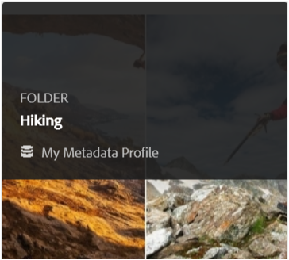

# Gestire i metadati delle risorse digitali {#managing-metadata-for-digital-assets}

| Versione | Collegamento articolo |
| -------- | ---------------------------- |
| AEM as a Cloud Service | [Fai clic qui](https://experienceleague.adobe.com/docs/experience-manager-cloud-service/content/assets/manage/manage-metadata.html?lang=en) |
| AEM 6.5 | Questo articolo |

<!-- Scope of metadata articles:
* metadata.md: The scope of this article is basic metadata updates, changes, and so on, operations that end-users can do.
* metadata-concepts.md: All conceptual information. Minor instructions are OK but it is an FYI article about support and standards.
* metadata-config.md: New article. Contains all configuration and administration how-to info related to metadata of assets.
-->

[!DNL Adobe Experience Manager Assets] conserva i metadati per ogni risorsa. Consente di categorizzare e organizzare più facilmente le risorse e aiuta le persone alla ricerca di una risorsa specifica. Con la possibilità di estrarre metadati dai file caricati in [!DNL Experience Manager Assets], la gestione dei metadati si integra con il flusso di lavoro creativo. Grazie alla possibilità di conservare e gestire i metadati con le risorse, è possibile organizzare ed elaborare automaticamente le risorse in base ai relativi metadati.

## Metadati e relativa origine {#how-to-edit-or-add-metadata}

I metadati sono informazioni aggiuntive sulla risorsa in cui è possibile eseguire ricerche. Viene aggiunto alle risorse e in [!DNL Experience Manager] viene elaborato quando carichi una risorsa. Puoi modificare i metadati esistenti e aggiungere nuove proprietà di metadati ai campi esistenti. Le organizzazioni necessitano di un vocabolario dei metadati controllato e affidabile. Da qui [!DNL Experience Manager Assets] non consente l’aggiunta su richiesta di nuove proprietà di metadati. Solo gli amministratori e gli sviluppatori possono aggiungere nuove proprietà o campi che contengono metadati. Gli utenti possono compilare i campi esistenti con i metadati.

Per aggiungere metadati alle risorse digitali è possibile utilizzare i seguenti metodi:

* Per iniziare, le applicazioni native che creano le risorse vi aggiungono alcuni metadati. Ad esempio: [Acrobat aggiunge alcuni metadati](https://helpx.adobe.com/acrobat/using/pdf-properties-metadata.html) ai file PDF o a una fotocamera aggiunge alcuni metadati di base alle fotografie. Durante la generazione delle risorse, puoi aggiungere i metadati nelle applicazioni native stesse. Ad esempio, puoi [aggiungere metadati IPTC in Adobe Lightroom](https://helpx.adobe.com/lightroom-classic/help/metadata-basics-actions.html).

* Prima di caricare una risorsa in [!DNL Experience Manager], è possibile modificare i metadati utilizzando l’applicazione nativa utilizzata per creare una risorsa o utilizzando un’altra applicazione di modifica dei metadati. Quando carichi una risorsa in Experience Manager, i metadati vengono elaborati. Ad esempio, vedere come [utilizzo dei metadati in [!DNL Adobe Bridge]](https://helpx.adobe.com/bridge/user-guide.html/bridge/using/metadata-adobe-bridge.ug.html) e visualizzare [pannello tag per [!DNL Adobe Bridge]](https://exchange.adobe.com/creativecloud.details.20009.aem-tags-panel-for-bridge-cc.html) in [!DNL Adobe Exchange].

* In entrata [!DNL Experience Manager Assets], puoi aggiungere o modificare manualmente i metadati delle risorse nel [!UICONTROL Proprietà] pagina.

* È possibile utilizzare [profili metadati](/help/assets/metadata-config.md#metadata-profiles) funzionalità di [!DNL Experience Manager Assets] per aggiungere automaticamente i metadati quando le risorse vengono caricate in DAM.

## Aggiungere o modificare i metadati in [!DNL Experience Manager Assets] {#add-edit-metadata}

Per modificare i metadati di una risorsa in [!DNL Assets] nell&#39;interfaccia utente, eseguire la procedura seguente:

1. Effettua una delle operazioni seguenti:

   * Dalla sezione [!DNL Assets] , seleziona la risorsa e fai clic su **[!UICONTROL Visualizza proprietà]** dalla barra degli strumenti.
   * Dalla miniatura della risorsa, seleziona la **[!UICONTROL Visualizza proprietà]** azione rapida.
   * Dalla pagina della risorsa, fai clic su **[!UICONTROL Visualizza proprietà]**  dalla barra degli strumenti.

   Nella pagina delle risorse vengono visualizzati tutti i metadati della risorsa. I metadati vengono estratti quando la risorsa viene caricata (acquisita) in [!DNL Experience Manager].

   

   *Figura: Modificare o aggiungere metadati alla risorsa [!UICONTROL Proprietà] pagina.*

1. Apporta le modifiche necessarie ai metadati delle varie schede e, al termine, fai clic su **[!UICONTROL Salva]** dalla barra degli strumenti per salvare le modifiche. Clic **[!UICONTROL Chiudi]** per tornare al [!DNL Assets] interfaccia web.

   >[!NOTE]
   >
   >Se un campo di testo è vuoto, non è presente alcun set di metadati. Puoi immettere un valore nel campo e salvarlo per aggiungere tale proprietà di metadati.

Eventuali modifiche ai metadati di una risorsa vengono riscritte nel file binario originale come parte dei dati XMP. Il flusso di lavoro di reinserimento dei metadati aggiunge i metadati al binario originale. Modifiche apportate alle proprietà esistenti (ad esempio `dc:title`) vengono sovrascritti e nuove proprietà (incluse le proprietà personalizzate come `cq:tags`) vengono aggiunti con lo schema.

Il write-back XMP è supportato e abilitato per le piattaforme e i formati di file descritti in [requisiti tecnici.](/help/sites-deploying/technical-requirements.md)

## Modificare le proprietà dei metadati di più risorse {#editing-metadata-properties-of-multiple-assets}

[!DNL Adobe Enterprise Manager Assets] consente di modificare i metadati di più risorse contemporaneamente in modo da poter propagare rapidamente modifiche comuni ai metadati di più risorse in blocco. Puoi anche modificare i metadati per più raccolte in blocco. Utilizza la pagina delle proprietà per eseguire le modifiche ai metadati su più risorse o raccolte:

* Modifica le proprietà dei metadati in un valore comune
* Aggiungere o modificare i tag

Per personalizzare la pagina delle proprietà dei metadati, ad esempio per aggiungere, modificare ed eliminare le proprietà dei metadati, utilizzare [editor schema](metadata-config.md#folder-metadata-schema).

>[!NOTE]
>
>I metodi di modifica in blocco funzionano per le risorse disponibili in una cartella o in una raccolta. Per le risorse disponibili in più cartelle o che corrispondono a un criterio comune, è possibile: [aggiorna in blocco i metadati dopo la ricerca](search-assets.md#metadataupdates).

1. In [!DNL Assets] nell’interfaccia utente, individua la posizione delle risorse da modificare.
1. Seleziona le risorse per le quali desideri modificare le proprietà comuni.
1. Dalla barra degli strumenti, fai clic su **[!UICONTROL Proprietà]** per aprire la pagina proprietà per le risorse selezionate.
1. Modifica le proprietà dei metadati per le risorse selezionate nelle varie schede.
1. Per visualizzare i metadati di una risorsa specifica, annulla la selezione delle risorse rimanenti nell’elenco. Se annulli la selezione di alcune risorse nella [!UICONTROL Proprietà] , i metadati di tali risorse non vengono aggiornati.
1. Per selezionare uno schema di metadati diverso per le risorse, fai clic su **[!UICONTROL Impostazioni]** dalla barra degli strumenti e seleziona uno schema. Fai clic su **[!UICONTROL Salva e chiudi]**.
1. Per aggiungere i nuovi metadati a quelli esistenti nei campi che contengono più valori, seleziona **[!UICONTROL Modalità di aggiunta]**. Se non selezioni questa opzione, i nuovi metadati sostituiranno quelli già esistenti nei campi. Fai clic su **[!UICONTROL Invia]**.

>[!CAUTION]
>
>Per i campi con valore singolo, i nuovi metadati non vengono aggiunti al valore esistente nel campo, nemmeno se selezioni **[!UICONTROL Modalità di aggiunta]**.

## Importare metadati {#import-metadata}

[!DNL Assets] consente di importare in blocco i metadati delle risorse utilizzando un file CSV. Per eseguire aggiornamenti in blocco delle risorse caricate di recente o di quelle esistenti, importa un file CSV. Puoi anche inserire in blocco i metadati delle risorse da un sistema di terze parti in formato CSV.

L’importazione dei metadati è asincrona e non impedisce le prestazioni del sistema. L’aggiornamento simultaneo dei metadati per più risorse può richiedere molte risorse, a causa dell’attività di writeback dell’XMP se viene selezionato il flag del flusso di lavoro. Pianifica tale importazione durante l’utilizzo snello del server in modo che le prestazioni per altri utenti non siano influenzate.

>[!NOTE]
>
>Per importare metadati su spazi dei nomi personalizzati, registra innanzitutto gli spazi dei nomi.

1. Accedi a [!DNL Assets] e fai clic su **[!UICONTROL Crea]** dalla barra degli strumenti.
1. Dal menu, seleziona **[!UICONTROL Metadati]**.
1. In **[!UICONTROL Importazione metadati]** pagina, fai clic su **[!UICONTROL Seleziona file]**. Scegli il file CSV con i metadati.
1. Specificare i seguenti parametri. Vedi un esempio di file CSV in [metadata-import-sample-file.csv](/help/assets/assets/metadata-import-sample-file.csv).

   | Parametri di importazione dei metadati | Descrizione |
   |:---|:---|
   | [!UICONTROL Dimensione batch] | Numero di risorse in un batch per le quali devono essere importati i metadati. Il valore predefinito è 50. Il valore massimo è 100. |
   | [!UICONTROL Separatore campi] | Il valore predefinito è `,` (una virgola). È possibile specificare qualsiasi altro carattere. |
   | [!UICONTROL Delimitatore multivalore] | Separatore per i valori dei metadati. Il valore predefinito è `|`. |
   | [!UICONTROL Avvia flussi di lavoro] | False per impostazione predefinita. Se impostato su `true` e le impostazioni predefinite sono attive per [!UICONTROL WriteBack metadati DAM] flusso di lavoro (che scrive i metadati nei dati binari XMP). L’abilitazione dei flussi di lavoro rallenta il sistema. |
   | [!UICONTROL Nome colonna percorso risorsa] | Definisce il nome della colonna per il file CSV con le risorse. |

1. Clic **[!UICONTROL Importa]** dalla barra degli strumenti. Dopo l’importazione dei metadati, in viene visualizzata una notifica [!UICONTROL Notifica] casella in entrata.

1. Per verificare la correttezza dell’importazione, passa a [!UICONTROL Proprietà] e verificare i valori nei campi.

Per aggiungere data e marca temporale durante l’importazione dei metadati, utilizza `YYYY-MM-DDThh:mm:ss.fff-00:00` formato per data e ora. Data e ora sono separate da `T`, `hh` è il numero di ore nel formato 24 ore, `fff` è nanosecondi, e `-00:00` è lo scostamento del fuso orario. Ad esempio: `2020-03-26T11:26:00.000-07:00` è il 26 marzo 2020 alle 11:26:00.000 ora PST.

>[!CAUTION]
>
>Se il formato della data non corrisponde `YYYY-MM-DDThh:mm:ss.fff-00:00`, i valori della data non sono impostati. I formati di data del file CSV dei metadati esportati sono nel formato `YYYY-MM-DDThh:mm:ss-00:00`. Se desideri importarla, convertirla nel formato accettabile aggiungendo il valore nanosecondi indicato da `fff`.

## Esportare i metadati {#export-metadata}

Puoi esportare i metadati per più risorse in formato CSV. I metadati vengono esportati in modo asincrono e non influiscono sulle prestazioni del sistema. Per esportare i metadati: [!DNL Experience Manager] attraversa le proprietà del nodo risorsa `jcr:content/metadata` e i relativi nodi secondari ed esporta le proprietà dei metadati in un file CSV.

Alcuni casi d’uso per l’esportazione in blocco di metadati sono:

* Importa i metadati in un sistema di terze parti durante la migrazione delle risorse.
* Condividere i metadati delle risorse con un team di progetto più ampio.
* Verifica o controlla la conformità dei metadati.
* Esternalizzare i metadati per localizzarli separatamente.

1. Seleziona la cartella delle risorse contenente le risorse di cui desideri esportare i metadati. Dalla barra degli strumenti, seleziona **[!UICONTROL Esportare i metadati]**.

1. In [!UICONTROL Esportazione metadati] specifica un nome per il file CSV. Per esportare i metadati per le risorse nelle sottocartelle, seleziona **[!UICONTROL Includere le risorse nelle sottocartelle]**.

   

1. Seleziona le opzioni desiderate. Fornisci un nome file e, se necessario, una data.

1. In **[!UICONTROL Proprietà da esportare]** , specificare se si desidera esportare tutte le proprietà o proprietà specifiche. Se selezioni Proprietà selettive da esportare, aggiungi le proprietà desiderate.

1. Dalla barra degli strumenti, fai clic su **[!UICONTROL Esporta]**. Un messaggio conferma che i metadati vengono esportati. Chiudi il messaggio.

1. Apri la notifica della casella in entrata del processo di esportazione. Seleziona il processo e fai clic su **[!UICONTROL Apri]** nella barra degli strumenti. Per scaricare il file CSV con i metadati, fai clic su **[!UICONTROL Download CSV]** dalla barra degli strumenti. Fai clic su **[!UICONTROL Chiudi]**.

   

   *Figura: Finestra di dialogo per scaricare il file CSV contenente i metadati esportati in blocco.*

## Modificare i metadati delle raccolte {#collections-metadata}

Per ulteriori informazioni, consulta [visualizzare e modificare i metadati di una raccolta](/help/assets/manage-collections.md#view-edit-collection-metadata) e [modifica in blocco dei metadati di più raccolte](/help/assets/manage-collections.md#editing-collection-metadata-in-bulk).

## Applicare un profilo di metadati alle cartelle {#applying-a-metadata-profile-to-folders}

<!-- TBD: Review this overview.
-->

Quando si assegna un profilo di metadati a una cartella, tutte le sottocartelle ereditano automaticamente il profilo dalla relativa cartella principale. Ciò significa che puoi assegnare un solo profilo di metadati a una cartella. Considera quindi con attenzione la struttura di cartelle in cui caricare, archiviare, utilizzare e archiviare le risorse.

Se hai assegnato un profilo di metadati diverso a una cartella, il nuovo profilo sostituisce quello precedente. Le risorse della cartella esistenti in precedenza rimangono invariate. Il nuovo profilo viene applicato alle risorse che vengono aggiunte alla cartella in un secondo momento.

Le cartelle a cui è assegnato un profilo sono indicate nell’interfaccia utente dal nome del profilo che appare nel nome della scheda.

Puoi applicare profili di metadati a cartelle specifiche o a livello globale a tutte le risorse.

È possibile rielaborare le risorse in una cartella che dispone già di un profilo di metadati esistente che è stato successivamente modificato. Consulta [Rielaborazione delle risorse in una cartella dopo averne modificato il profilo di elaborazione](processing-profiles.md#reprocessing-assets).

Puoi applicare un profilo di metadati a una cartella direttamente dal menu **[!UICONTROL Strumenti]** oppure, se ti trovi nella cartella, da **[!UICONTROL Proprietà]**. Questa sezione descrive come applicare i profili di metadati alle cartelle con entrambe le soluzioni.

Le cartelle a cui è già stato assegnato un profilo sono indicate dalla visualizzazione del nome del profilo che è posto direttamente sotto il nome della cartella.

Puoi rielaborare le risorse in una cartella che dispone già di un profilo video modificato in seguito. Consulta [Rielaborazione delle risorse in una cartella dopo averne modificato il profilo di elaborazione](processing-profiles.md#reprocessing-assets).

### Applicare profili di metadati alle cartelle da [!UICONTROL Profili] interfaccia utente {#applying-metadata-profiles-to-folders-from-profiles-user-interface}

Segui i passaggi per applicare il profilo metadati:

1. Fai clic su [!DNL Experience Manager] e passare a **[!UICONTROL Strumenti]** > **[!UICONTROL Risorse]** > **[!UICONTROL Profili metadati]**.
1. Seleziona il profilo di metadati da applicare a una o più cartelle.
1. Clic **[!UICONTROL Applica profilo metadati a cartelle]** e seleziona la cartella o le cartelle in cui desideri ricevere le risorse appena caricate, quindi fai clic su **[!UICONTROL Fine]**. Le cartelle a cui è già stato assegnato un profilo sono indicate dalla visualizzazione del nome del profilo che è posto direttamente sotto il nome della cartella.

### Applicare profili di metadati alle cartelle da [!UICONTROL Proprietà] {#applying-metadata-profiles-to-folders-from-properties}

1. Nella barra a sinistra, fai clic su **[!UICONTROL Risorse]** quindi passa alla cartella a cui desideri applicare un profilo di metadati.
1. Nella cartella fare clic sul segno di spunta per selezionarla e quindi fare clic su **[!UICONTROL Proprietà]**.

1. Seleziona la **[!UICONTROL Profili metadati]** e selezionare il profilo dal menu a comparsa e fare clic su **[!UICONTROL Salva]**.

Le cartelle a cui è già stato assegnato un profilo sono indicate dalla visualizzazione del nome del profilo che è posto direttamente sotto il nome della cartella.

<!-- TBD: Commenting as the topic in metadata-config.md is incomplete.

### Apply metadata profile globally {#metadata-profile-global}

For details, see [configuration to apply metadata profile globally](/help/assets/metadata-config.md#apply-a-metadata-profile-globally). -->

### Rimuovere un profilo di metadati dalle cartelle {#removing-a-metadata-profile-from-folders}

Quando rimuovi un profilo di metadati da una cartella, tutte le sottocartelle ereditano automaticamente la rimozione del profilo dalla relativa cartella principale. Tuttavia, qualsiasi elaborazione dei file che si è verificata all’interno delle cartelle rimane intatta.

È possibile rimuovere un profilo di metadati da una cartella dall’interno di **[!UICONTROL Strumenti]** o dal menu **[!UICONTROL Proprietà]** dalla cartella.

#### Rimuovere i profili di metadati dalle cartelle tramite l’interfaccia utente Profili {#removing-metadata-profiles-from-folders-via-profiles-user-interface}

1. Fai clic su [!DNL Experience Manager] e passare a **[!UICONTROL Strumenti]** > **[!UICONTROL Risorse]** > **[!UICONTROL Profili metadati]**.
1. Seleziona il profilo di metadati da rimuovere da una o più cartelle.
1. Clic **[!UICONTROL Rimuovi profilo metadati da cartelle]** e seleziona la cartella o le cartelle da cui vuoi rimuovere un profilo e fai clic su **[!UICONTROL Fine]**.

   Puoi confermare che il profilo di metadati non è più applicato a una cartella perché il nome non viene più visualizzato sotto il nome della cartella.

#### Rimuovere i profili di metadati dalle cartelle tramite Proprietà {#removing-metadata-profiles-from-folders-via-properties}

1. Fai clic su [!DNL Experience Manager] logo e navigazione **[!UICONTROL Risorse]** e quindi alla cartella da cui desideri rimuovere un profilo di metadati.
1. Nella cartella fare clic sul segno di spunta per selezionarla e quindi fare clic su **[!UICONTROL Proprietà]**.
1. Seleziona la scheda **[!UICONTROL Profili metadati]**, fai clic su **[!UICONTROL Nessuno]** dal menu a discesa e infine tocca **[!UICONTROL Salva]**. Le cartelle a cui è già stato assegnato un profilo sono indicate dalla visualizzazione del nome del profilo che è posto direttamente sotto il nome della cartella.

## Suggerimenti e limitazioni {#best-practices-limitations}

* Gli aggiornamenti dei metadati tramite l’interfaccia utente modificano le proprietà dei metadati in `dc` spazio dei nomi. Qualsiasi aggiornamento effettuato tramite API HTTP modifica le proprietà dei metadati in `jcr` spazio dei nomi. Consulta [come aggiornare i metadati tramite API HTTP](/help/assets/mac-api-assets.md#update-asset-metadata).

* Il file CSV per l’importazione dei metadati delle risorse è in un formato molto specifico. Per risparmiare tempo e fatica ed evitare errori involontari, puoi iniziare a creare il file CSV utilizzando il formato di un file CSV esportato.

* Quando si importano metadati utilizzando un file CSV, il formato data richiesto è `YYYY-MM-DDThh:mm:ss.fff-00:00`. Se si utilizza un altro formato, i valori della data non vengono impostati. I formati di data del file CSV dei metadati esportati sono nel formato `YYYY-MM-DDThh:mm:ss-00:00`. Se desideri importarla, convertirla nel formato accettabile aggiungendo il valore nanosecondi indicato da `fff`.

>[!MORELIKETHIS]
>
>* [Concetti e informazioni sui metadati](metadata-concepts.md).
>* [Modificare le proprietà dei metadati di più raccolte](manage-collections.md#editing-collection-metadata-in-bulk)
>* [Importazione ed esportazione di metadati in Experience Manager Assets](https://experienceleague.adobe.com/docs/experience-manager-learn/assets/metadata/metadata-import-feature-video-use.html)

<!-- TBD: Try filling the available information in these topics to the extent possible. As and when complete, publish the sections live.

## Where to find metadata of an asset or folder {#find-metadata}

What all methods to access asset Properties. More Details option in column view. Select asset and click Properties. Keyboard shortcut `p`. What else?

## Understand metadata handling in Experience Manager {#metadata-possibilities-with-aem}

Describe the journey of an assets' metadata. What all happens to metadata when an asset is added to Experience Manager.

## Add metadata to your digital assets {#add-metadata}

* To begin with, assets come with some metadata. The applications that create digital assets add some metadata to the assets created. Before uploading an asset to Experience Manager, you can edit and modify metadata using either the native application used to create an asset or using some other metadata editing application. When you upload an asset to Experience Manager, the metadata is processed.

* Link to PS, ID, AI, PDF, and so on, metadata-related help articles.

* Link to XMP writeback.

* Manually add (or edit) metadata in AEM in Properties page.

* Metadata profiles

* Any workflows related to metadata?

* Advanced topic: Add, edit, modify, process and writeback metadata of subassets.

## Metadata of assets, folders, and collections {#metadata-of-assets-folders-collections}

Similarities and differences between metadata of asset and folder. 

Link to metadata handling of collections.

## Modify metadata of an asset, folder, or collection {#modify-metadata}

* While creating assets: Native application.

* Before ingesting assets: Metadata editors

* After ingesting assets: Properties of an asset, folder, collection, and so on.

* Any supported programmatic method to bulk edit metadata directly in JCR?

## Modify metadata in bulk {#modify-metadata-in-bulk}

[!DNL Adobe Enterprise Manager Assets] lets you edit the metadata of multiple assets simultaneously so you can quickly propagate common metadata changes to assets in bulk. You can also edit the metadata for multiple collections in bulk.

Use the properties page to perform metadata changes on multiple assets or collections:

* Change metadata properties to a common value

* Add or modify tags

To customize the metadata properties page, including adding, modifying, deleting metadata properties, use the schema editor.

>[!NOTE]
>
>The bulk editing methods work for assets available in a folder or a collection. For the assets that are available across folders or match a common criteria, it is possible to [bulk update the metadata after searching](search-assets.md#metadataupdates).

1. In the [!DNL Assets] user interface, navigate to the location of the assets you want to edit.
1. Select the assets for which you want to edit common properties.
1. From the toolbar, click **[!UICONTROL Properties]** to open the properties page for the selected assets.

   >[!NOTE]
   >
   >When you select multiple assets, the lowest common parent form is selected for the assets. In other words, the properties page only displays metadata fields that are common across the properties pages of all the individual assets.

1. Modify the metadata properties for selected assets under the various tabs.
1. To view the metadata editor for a specific asset, deselect the remaining assets in the list. The metadata editor fields are populated with the metadata for the particular asset.

   >[!NOTE]
   >
   >* In the Properties page, you can remove assets from the asset list by deselecting them. The asset list has all the assets selected by default. The metadata for assets that you remove from the list is not updated.
   >
   >* At the top of assets list, select the check box near **[!UICONTROL Title]** to toggle between selecting the assets and clearing the list.

1. To select a different metadata schema for the assets, click **[!UICONTROL Settings]** from the toolbar, and select the desired schema.
1. Save the changes.
1. To append the new metadata with the existing metadata in fields that contain multiple values, select **[!UICONTROL Append mode]**. If you do not select this option, the new metadata replaces the existing metadata in the fields. click **[!UICONTROL Submit]**.

   >[!CAUTION]
   >
   >For single-value fields, the new metadata is not appended to the existing value in the field even if you select **[!UICONTROL Append mode]**.

-->
