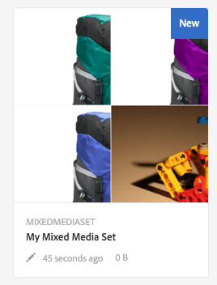

# Set di file multimediali diversi{#mixed-media-sets}

I set di file multimediali diversi consentono di fornire una combinazione di immagini, set di immagini, set 360 gradi e video in una presentazione.

I set di file multimediali diversi sono indicati da un banner con la parola **[!UICONTROL MixedMediaSet]**. Inoltre, se il set di file multimediali diversi è pubblicato, la data di pubblicazione, indicata dall’icona **[!UICONTROL mondo]**, è riportata sul banner insieme all’ultima data di modifica, contrassegnata dall’icona a forma di **[!UICONTROL matita]**.

>[!NOTE]
>
>Per informazioni sull’interfaccia utente di Assets, consulta [Gestione risorse](/help/assets/manage-assets.md).

## Guida introduttiva: Set di file multimediali diversi {#quick-start-mixed-media-sets}

Per iniziare a utilizzare rapidamente i set di file multimediali diversi, effettua le seguenti operazioni:

1. [Caricare le risorse](#uploading-assets).

   Per iniziare, carica le immagini e i video per i set di file multimediali diversi. Se necessario, crea i [Set di immagini](/help/assets/image-sets.md) e i [Set 360 gradi](/help/assets/spin-sets.md). Poiché gli utenti possono ingrandire le immagini nel Visualizzatore set di file multimediali diversi, scegli attentamente le immagini. Verifica che le immagini abbiano una dimensione maggiore che sia di almeno 2000 pixel.

   Consulta [Dynamic Media - Formati di immagine raster supportati](/help/assets/assets-formats.md#supported-raster-image-formats-dynamic-media) per un elenco di formati supportati dai set di file multimediali diversi.

1. [Creare set di file multimediali diversi](#creating-mixed-media-sets).

   Per creare un set di file multimediali diversi, dalla pagina Risorse seleziona **[!UICONTROL Crea]** > **[!UICONTROL Set di file multimediali diversi]** quindi assegna un nome al set, scegli le risorse e stabilisci l’ordine in cui vengono visualizzate le immagini.

   Consulta [Utilizzare i selettori](/help/assets/working-with-selectors.md).

1. Configurazione [Predefiniti visualizzatore file multimediali diversi](/help/assets/managing-viewer-presets.md), in base alle esigenze.

   Gli amministratori possono creare o modificare i predefiniti visualizzatore di set di file multimediali diversi predefiniti. Per visualizzare i file multimediali diversi con un predefinito per visualizzatori, seleziona il set di file multimediali diversi e fai clic su **[!UICONTROL Visualizzatori]** nel menu a discesa della barra a sinistra.

   Per creare o modificare i predefiniti visualizzatore, vedi **[!UICONTROL Strumenti]** > **[!UICONTROL Risorse]** > **[!UICONTROL Predefiniti visualizzatore]**.

   Consulta [Aggiungere e modificare i predefiniti per visualizzatori](/help/assets/managing-viewer-presets.md).

1. [Anteprima set di file multimediali diversi](#previewing-mixed-media-sets).

   Seleziona il set di file multimediali diversi e puoi visualizzarne l’anteprima. Seleziona le icone delle miniature per esaminare il set di file multimediali diversi nel visualizzatore selezionato. È possibile scegliere visualizzatori diversi dalla **[!UICONTROL Visualizzatori]** disponibile dal menu a discesa della barra a sinistra.

1. [Pubblicare set di file multimediali diversi](#publishing-mixed-media-sets).

   La pubblicazione di un set di file multimediali diversi attiva l’URL e la stringa di incorporamento. Inoltre, devi [pubblicare il predefinito visualizzatore](/help/assets/managing-viewer-presets.md#publishing-viewer-presets).

1. [Collegare gli URL all’applicazione web](/help/assets/linking-urls-to-yourwebapplication.md) o [Incorporare il visualizzatore di video o immagini](/help/assets/embed-code.md).

   Adobe Experience Manager Assets crea chiamate URL per set di file multimediali diversi e li attiva dopo la pubblicazione dei set di file multimediali diversi. Puoi copiare questi URL quando visualizzi in anteprima le risorse. In alternativa, puoi incorporarli nel sito web.

   Seleziona il set di file multimediali diversi, quindi fai clic su nel menu a discesa della barra a sinistra **[!UICONTROL Visualizzatori]**.

   Consulta [Collegare un set di file multimediali diversi a una pagina web](/help/assets/linking-urls-to-yourwebapplication.md) e [Incorporare il visualizzatore di video o immagini](/help/assets/embed-code.md).

Se necessario, puoi modificare [Set di file multimediali diversi](#editing-mixed-media-sets). Inoltre, puoi visualizzare e modificare [Proprietà set di file multimediali diversi](/help/assets/manage-assets.md#editing-properties).

>[!NOTE]
>
>In caso di problemi durante la creazione dei set, consulta [Risoluzione dei problemi di Dynamic Media - Modalità Scene7](/help/assets/troubleshoot-dms7.md).

## Carica risorse {#uploading-assets}

Per iniziare, carica le immagini e i video per i set di file multimediali diversi. Poiché gli utenti possono ingrandire le immagini nel Visualizzatore set di file multimediali diversi, scegli attentamente le immagini. Verifica che le immagini abbiano una dimensione maggiore che sia di almeno 2000 pixel.

Inoltre, se desiderate aggiungere set 360 gradi o set di immagini al set di file multimediali diversi, create anche questi set.

Consulta [Dynamic Media - Formati di immagine raster supportati](/help/assets/assets-formats.md#supported-raster-image-formats-dynamic-media) per un elenco di formati supportati dai set di file multimediali diversi.

## Creare un set di file multimediali diversi {#creating-mixed-media-sets}

Puoi aggiungere immagini, set di immagini, set 360 gradi e video al set di file multimediali diversi. Assicurati che i file, i set di immagini e i set 360 gradi siano pronti per la pubblicazione prima di aggiungerli al set di file multimediali diversi.

Quando aggiungi risorse al set, queste vengono aggiunte automaticamente in ordine alfanumerico. Puoi riordinare o ordinare manualmente le risorse dopo che sono state aggiunte.

**Per creare un set di file multimediali diversi:**

1. In Assets, individua il punto in cui vuoi creare un set di file multimediali diversi e seleziona **[!UICONTROL Crea]**, e seleziona **[!UICONTROL Set di file multimediali diversi]**. Puoi anche creare il set dall’interno di una cartella contenente le risorse. Viene visualizzato l’Editor set di file multimediali diversi.

   

1. Nell’Editor set di file multimediali diversi, in **[!UICONTROL Titolo]**, immetti un nome per il set di file multimediali diversi. Il nome viene visualizzato nel banner in tutto il set di file multimediali diversi. È possibile inserire una descrizione.

   

   >[!NOTE]
   >
   >Durante la creazione del set di file multimediali diversi, è possibile modificare la miniatura del set di file multimediali diversi o consentire all’Experience Manager di selezionare la miniatura automaticamente in base alle risorse nel set di file multimediali diversi. Per selezionare una miniatura, seleziona **[!UICONTROL Cambia miniatura]** e selezionare un&#39;immagine (è possibile spostarsi anche in altre cartelle per trovare le immagini). Se hai selezionato una miniatura e vuoi che Experience Manager ne generi una dal set di file multimediali diversi, seleziona **[!UICONTROL Passa alla miniatura automatica]**.

1. Seleziona il Selettore risorse per selezionare le risorse da includere nel set di file multimediali diversi. Selezionale, quindi seleziona **[!UICONTROL Seleziona]**.

   Con il Selettore risorse, puoi cercare le risorse digitando una parola chiave e toccando **[!UICONTROL Invio]**. Per perfezionare i risultati della ricerca, puoi anche applicare i filtri. Puoi filtrare in base a percorso, raccolta, tipo di file e tag. Seleziona il filtro e quindi fai clic su **[!UICONTROL Filtro]** dalla barra degli strumenti. Per modificare la visualizzazione, seleziona l’icona **[!UICONTROL Visualizza]** e fai clic su **[!UICONTROL Vista a elenco]**, **[!UICONTROL Vista a colonne]** o **[!UICONTROL Vista a schede]**.

   Consulta [Utilizzare i selettori](/help/assets/working-with-selectors.md).

   

1. Riordinare le risorse trascinandole verso l’alto o verso il basso nell’elenco (è necessario selezionare **[!UICONTROL Riordina]** ), a seconda delle necessità.

   

   Per aggiungere delle miniature, selezionare **+** **[!UICONTROL miniatura]** accanto all&#39;immagine e passare alla miniatura desiderata. Dopo aver selezionato tutte le miniature, seleziona **[!UICONTROL Salva]**.

   >[!NOTE]
   >
   >Per aggiungere risorse, seleziona **[!UICONTROL Aggiungi risorsa]**.

1. Per eliminare una risorsa, seleziona la casella di controllo corrispondente e fai clic su **[!UICONTROL Elimina risorsa]**.
1. Per applicare un predefinito, seleziona **[!UICONTROL Predefinito]** nell’angolo in alto a destra e seleziona un predefinito da applicare alle risorse.
1. Seleziona **[!UICONTROL Salva]**. Il nuovo set di file multimediali diversi creato viene visualizzato nella cartella in cui è stato creato.

## Modificare un set di file multimediali diversi {#editing-mixed-media-sets}

Puoi eseguire varie attività di modifica delle risorse in Set di file multimediali diversi direttamente nell’interfaccia utente [come qualsiasi risorsa in Assets](/help/assets/manage-assets.md). In Set di file multimediali diversi è inoltre possibile eseguire le azioni seguenti:

* Aggiungi risorse al set di file multimediali diversi.
* Riordinare le risorse nel set di file multimediali diversi.
* Eliminare le risorse nel set di file multimediali diversi.
* Applicare i predefiniti visualizzatore.
* Modifica la miniatura predefinita.

**Per modificare un set di file multimediali diversi:**

1. Effettua una delle seguenti operazioni:

   * Passa il puntatore del mouse su una risorsa set di file multimediali diversi, quindi seleziona **[!UICONTROL Modifica]** (icona della matita).
   * Passa il puntatore del mouse su una risorsa set di file multimediali diversi, seleziona **[!UICONTROL Seleziona]** (icona di spunta), quindi seleziona **[!UICONTROL Modifica]** sulla barra degli strumenti.

   * Seleziona una risorsa set di file multimediali diversi, quindi fai clic su **[!UICONTROL Modifica]** (icona della matita) sulla barra degli strumenti.

1. Nell’Editor set di file multimediali diversi, effettua una delle seguenti operazioni:

   * Per riordinare le risorse: nel pannello a sinistra, seleziona **[!UICONTROL Risorse]** (icona immagine), trascina una risorsa in una nuova posizione.
   * Per aggiungere risorse: sulla barra degli strumenti, seleziona **[!UICONTROL Aggiungi risorsa]**. Passa alle risorse. Per ogni risorsa da aggiungere, passa il puntatore sull&#39;immagine della risorsa (non sul nome), quindi fai clic sull&#39;icona del segno di spunta. Nell’angolo superiore destro, seleziona **[!UICONTROL Seleziona]**.

   * Per eliminare una risorsa: nel pannello a sinistra, seleziona **[!UICONTROL Risorse]** (icona immagine), quindi seleziona la risorsa. Sulla barra degli strumenti, seleziona **[!UICONTROL Elimina risorsa]**.

   * Per ordinare le risorse in base al nome in ordine crescente o decrescente, nel pannello a sinistra seleziona **[!UICONTROL Risorse]** (icona immagine). A destra del **[!UICONTROL Risorse]** , seleziona le icone del cursore su o giù.

      >[!NOTE]
      >
      >* Per eliminare un intero set di file multimediali diversi, da qualsiasi modalità di visualizzazione (ad esempio **[!UICONTROL Vista a schede]** o **[!UICONTROL Vista a colonne]** a) passa al set di file multimediali diversi. Passa il puntatore del mouse sulla risorsa e seleziona l’icona del segno di spunta, in modo da selezionarla. Premi **[!UICONTROL Backspace]** sulla tastiera, oppure selezionare **[!UICONTROL Altro]** (tre punti) sulla barra degli strumenti, quindi seleziona **[!UICONTROL Elimina]**.
      >
      >* Per modificare le risorse di un set di file multimediali diversi, accedi al set e fai clic su **[!UICONTROL Membri set]** nella barra a sinistra. Seleziona la **[!UICONTROL Matita]** su una singola risorsa per aprirla nella finestra di modifica.

1. Seleziona **[!UICONTROL Salva]** al termine della modifica.

   >[!NOTE]
   >
   >* Per modificare le risorse in un set di file multimediali diversi, passa a Set di file multimediali diversi. Tocca (non selezionare) il set per aprirlo nella pagina Anteprima set di Experienci Manager. Nella barra a sinistra, seleziona il cursore verso il basso per aprire l’elenco a discesa, quindi seleziona **[!UICONTROL Membri set]**. Nella pagina Membri set, passa il puntatore del mouse su una risorsa, quindi seleziona **[!UICONTROL Modifica]** (icona a forma di matita) per aprire la pagina di modifica.
   >
   >* Per eliminare un intero set di file multimediali diversi: da qualsiasi modalità di visualizzazione (come Vista a schede o Vista a colonne), vai al set di file multimediali diversi. Passa il puntatore del mouse sul set, quindi seleziona **Seleziona** (icona di spunta). Premi **[!UICONTROL Backspace]** sulla tastiera o selezionare **[!UICONTROL Altro]** (riga di tre punti), quindi seleziona **[!UICONTROL Elimina]**.

## Anteprima di un set di file multimediali diversi {#previewing-mixed-media-sets}

Consulta [Anteprima risorse](/help/assets/previewing-assets.md) per informazioni dettagliate su come visualizzare in anteprima i set di file multimediali diversi.

## Pubblicare un set di file multimediali diversi {#publishing-mixed-media-sets}

Consulta [Pubblicare le risorse](/help/assets/publishing-dynamicmedia-assets.md) per informazioni dettagliate su come pubblicare set di file multimediali diversi.

>[!NOTE]
>
>Se il set di file multimediali diversi non viene completato nel servizio di consegna la prima volta che lo pubblichi, pubblica il set di file multimediali diversi una seconda volta.
