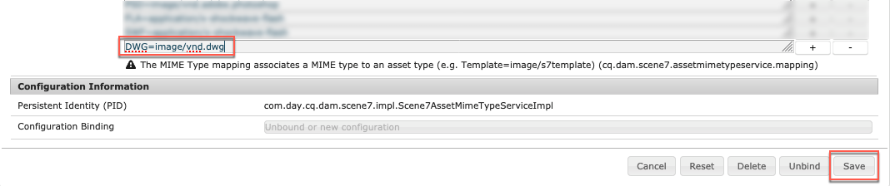

# Configurare Dynamic Media - Modalità Scene7{#configuring-dynamic-media-scene-mode}

Se utilizzi l’impostazione Adobe Experience Manager per ambienti diversi, ad esempio sviluppo, staging e produzione, configura Cloud Services Dynamic Media per ciascuno di tali ambienti.

## Diagramma dell&#39;architettura di Dynamic Media - Modalità Scene7 {#architecture-diagram-of-dynamic-media-scene-mode}

Il diagramma dell&#39;architettura seguente descrive il funzionamento della modalità Dynamic Media - Scene7.

Con la nuova architettura, Experience Manager è responsabile delle risorse di origine primaria e delle sincronizzazioni con Dynamic Media per l’elaborazione e la pubblicazione delle risorse:

1. Quando la risorsa di origine principale viene caricata in Experience Manager, viene replicata in Dynamic Media. A questo punto, Dynamic Media gestisce l’elaborazione e la generazione di rendering delle risorse, ad esempio la codifica video e le varianti dinamiche di un’immagine.
(In modalità Dynamic Media - Scene7, la dimensione predefinita del file di caricamento è inferiore o uguale a 2 GB. Per abilitare le dimensioni dei file di caricamento da 2 GB fino a 15 GB, vedi [(Facoltativo) Configura Dynamic Media - Modalità Scene7 per il caricamento di risorse superiori a 2 GB](#optional-config-dms7-assets-larger-than-2gb).)
1. Dopo la generazione dei rendering, Experience Manager può accedere in modo sicuro e visualizzare in anteprima i rendering Dynamic Media remoti (nessun file binario viene inviato nuovamente all’istanza di Experience Manager).
1. Quando il contenuto è pronto per essere pubblicato e approvato, attiva il servizio Dynamic Media per inviare contenuti ai server di consegna e memorizzare in cache il contenuto nella rete CDN (Content Delivery Network).


>[!IMPORTANT]
>
>Il seguente elenco di funzioni richiede l’utilizzo della rete CDN preconfigurata fornita con Adobe Experience Manager - Dynamic Media. Qualsiasi altra rete CDN personalizzata non è supportata con queste funzioni.
>
>* [Imaging avanzato](/help/assets/imaging-faq.md)
>* [Annullamento della validità della cache](/help/assets/invalidate-cdn-cache-dynamic-media.md)
>* [Protezione del collegamento ipertestuale](/help/assets/hotlink-protection.md)
>* [Distribuzione HTTP/2 dei contenuti](/help/assets/http2.md)
>* Reindirizzamento URL a livello CDN
>* Akamai ChinaCDN (per una consegna ottimale in Cina)


## Abilitare Dynamic Media in modalità Scene7 {#enabling-dynamic-media-in-scene-mode}

[Dynamic Media è disattivato per impostazione predefinita. ](https://business.adobe.com/products/experience-manager/assets/dynamic-media.html) Per sfruttare le funzionalità di Dynamic Media, è necessario abilitarle.

>[!WARNING]
>
>Dynamic Media - La modalità Scene7 è per *Solo istanza di authoring di Experience Manager*. Di conseguenza, devi configurare `runmode=dynamicmedia_scene7` sull’istanza di authoring di Experience Manager, *not* l’istanza Publish di Experience Manager.

Per abilitare Dynamic Media, avvia Experience Manager utilizzando `dynamicmedia_scene7` modalità di esecuzione dalla riga di comando immettendo quanto segue in una finestra terminale (la porta di esempio utilizzata è 4502):

```shell
java -Xms4096m -Xmx4096m -Doak.queryLimitInMemory=500000 -Doak.queryLimitReads=500000 -jar cq-quickstart-6.5.0.jar -gui -r author,dynamicmedia_scene7 -p 4502
```

## (Facoltativo) Migrazione di predefiniti e configurazioni Dynamic Media da 6.3 a 6.5 Zero Downtime {#optional-migrating-dynamic-media-presets-and-configurations-from-to-zero-downtime}

L’aggiornamento di Experience Manager Dynamic Media dalla versione 6.3 alla versione 6.4 o 6.5 ora include la possibilità di eseguire installazioni senza tempi di inattività. Per migrare tutti i predefiniti e le configurazioni da `/etc` a `/conf` in CRXDE Lite, assicurati di eseguire il seguente comando curl.

>[!NOTE]
>
>Se esegui l’istanza di Experience Manager in modalità di compatibilità, ovvero se hai installato il pacchetto di compatibilità, non è necessario eseguire questi comandi.

Per tutti gli aggiornamenti, sia con che senza il pacchetto di compatibilità, puoi copiare i predefiniti predefiniti predefiniti per visualizzatori forniti originariamente con Dynamic Media eseguendo il seguente comando curl Linux®:

`curl -u admin:admin -X POST https://<server_address>:<server_port>/libs/settings/dam/dm/presets/viewer.pushviewerpresets.json`

Per migrare eventuali predefiniti e configurazioni di visualizzatore personalizzati creati da `/etc` a `/conf`, esegui il seguente comando curl Linux®:

`curl -u admin:admin -X POST https://<server_address>:<server_port>/libs/settings/dam/dm/presets.migratedmcontent.json`

## Installa feature pack 18912 per la migrazione di massa delle risorse {#installing-feature-pack-for-bulk-asset-migration}

L&#39;installazione del feature pack 18912 è *facoltativo*.

Il Feature Pack 18912 consente di caricare in massa le risorse tramite FTP oppure di migrare, ad Experience Manager, le risorse da Dynamic Media - Modalità ibrida o Dynamic Media Classic in modalità Dynamic Media - Scene7. È disponibile da [Adobe Professional Services](https://business.adobe.com/customers/consulting-services/main.html).

Vedi [Installa feature pack 18912 per la migrazione di massa delle risorse](/help/assets/bulk-ingest-migrate.md) per ulteriori informazioni.

## Creare una configurazione Dynamic Media nei Cloud Services {#configuring-dynamic-media-cloud-services}

**Prima di configurare Dynamic Media** - Dopo aver ricevuto l&#39;e-mail di provisioning con le credenziali Dynamic Media, devi aprire la [applicazione desktop Dynamic Media Classic](https://experienceleague.adobe.com/docs/dynamic-media-classic/using/getting-started/signing-out.html#getting-started), quindi accedi al tuo account per modificare la tua password. La password fornita nell&#39;e-mail di provisioning è generata dal sistema e destinata solo a essere una password temporanea. È importante aggiornare la password in modo che il Cloud Service Dynamic Media sia configurato con le credenziali corrette.


**Per creare una configurazione Dynamic Media nei Cloud Services:**

1. In modalità Creazione Experience Manager, seleziona il logo Experience Manager per accedere alla console di navigazione globale, quindi seleziona l’icona Strumenti , quindi vai a **[!UICONTROL Cloud Services]** > **[!UICONTROL Configurazione Dynamic Media]**.
1. Nella pagina Browser configurazione Dynamic Media, seleziona nel riquadro a sinistra **[!UICONTROL globale]** (non selezionare l’icona della cartella a sinistra di **[!UICONTROL globale]**), quindi seleziona **[!UICONTROL Crea]**.
1. Sulla **[!UICONTROL Crea configurazione Dynamic Media]** , inserisci un titolo, l&#39;indirizzo e-mail dell&#39;account Dynamic Media, la password, quindi seleziona la tua area geografica. Queste informazioni vengono fornite per Adobe nell’e-mail di provisioning. Se non hai ricevuto l’e-mail, contatta l’Assistenza clienti di Adobe.

   Seleziona **[!UICONTROL Connessione a Dynamic Media]**.

   >[!NOTE]
   **RICK: MANTIENI COSÌ COM&#39;È?** Dopo aver ricevuto l’e-mail di provisioning con le credenziali Dynamic Media, apri la [applicazione desktop Dynamic Media Classic](https://experienceleague.adobe.com/docs/dynamic-media-classic/using/getting-started/signing-out.html#getting-started), quindi accedi al tuo account per modificare la tua password. La password fornita nell&#39;e-mail di provisioning è generata dal sistema e destinata solo a essere una password temporanea. È importante aggiornare la password in modo che il Cloud Service Dynamic Media sia configurato con le credenziali corrette.

1. Quando la connessione ha esito positivo, imposta quanto segue. Le intestazioni con asterisco (*) sono obbligatorie:

   * **[!UICONTROL Azienda]** - il nome dell&#39;account Dynamic Media. Hai più account Dynamic Media. Ad esempio, puoi avere diversi marchi secondari, divisioni, staging o ambienti di produzione.

   * **[!UICONTROL Percorso cartella principale della società]**

   * **[!UICONTROL Pubblicazione delle risorse]** - È possibile scegliere tra le tre opzioni seguenti:
      * **[!UICONTROL Immediatamente]** significa che quando le risorse vengono caricate, il sistema le acquisisce e fornisce l’URL/da incorporare immediatamente. Non è necessario alcun intervento degli utenti per pubblicare le risorse.
      * **[!UICONTROL All&#39;attivazione]** significa che devi pubblicare esplicitamente la risorsa prima prima di fornire un collegamento URL/Incorpora .<br><!-- CQDOC-17478, Added March 9, 2021-->A partire da Experience Manager 6.5.8, l&#39;istanza Publish di Experience Manager riflette valori di metadati precisi di Dynamic Media, come `dam:scene7Domain` e `dam:scene7FileStatus` in **[!UICONTROL All&#39;attivazione]** solo modalità di pubblicazione. Per abilitare questa funzionalità, installare Service Pack 8, quindi riavviare Experience Manager. Vai a Gestione configurazione Sling. Trova la configurazione per `Scene7ActivationJobConsumer Component` o creane uno nuovo). Seleziona la casella di controllo **[!UICONTROL Replicare i metadati dopo la pubblicazione di Dynamic Media]**, quindi seleziona **[!UICONTROL Salva]**.

         

      * **[!UICONTROL Pubblicazione selettiva]** Questa opzione consente di controllare quali cartelle vengono pubblicate in Dynamic Media. Consente di utilizzare funzioni quali Ritaglio avanzato o rappresentazioni dinamiche, oppure di determinare quali cartelle vengono pubblicate esclusivamente in Experience Manager per la visualizzazione dell’anteprima. Le stesse risorse *not* pubblicato in Dynamic Media per la distribuzione nel dominio pubblico.<br>Puoi impostare questa opzione qui nel **[!UICONTROL Configurazione Dynamic Media Cloud]** oppure, se si preferisce, è possibile scegliere di impostare questa opzione a livello di cartella, in una cartella **[!UICONTROL Proprietà]**.<br>Vedi [Utilizzo della pubblicazione selettiva in Dynamic Media](/help/assets/selective-publishing.md).<br>Se successivamente modifichi questa configurazione o la modifichi a livello di cartella, queste modifiche interessano solo le nuove risorse caricate da quel momento in poi. Lo stato di pubblicazione delle risorse esistenti nella cartella rimane invariato finché non le cambi manualmente da **[!UICONTROL Pubblicazione rapida]** o **[!UICONTROL Gestisci pubblicazione]** finestra di dialogo.
   * **[!UICONTROL Server di anteprima protetto]** - consente di specificare il percorso URL del server di anteprima delle rappresentazioni protette. In altre parole, dopo la generazione delle rappresentazioni, Experience Manager può accedere in modo sicuro e visualizzare in anteprima le rappresentazioni Dynamic Media remote (nessun file binario viene inviato nuovamente all’istanza di Experience Manager).
A meno che non si disponga di una disposizione speciale per utilizzare il server della propria azienda o un server speciale, Adobe consiglia di lasciare questa impostazione come specificato.

   * **[!UICONTROL Sincronizza tutti i contenuti]** - <!-- NEW OPTION, CQDOC-15371, Added March 4, 2020-->Selezionato per impostazione predefinita. Deseleziona questa opzione se desideri includere o escludere in modo selettivo le risorse dalla sincronizzazione con Dynamic Media. Deselezionando questa opzione puoi scegliere tra le due seguenti modalità di sincronizzazione Dynamic Media:

   * **[!UICONTROL Modalità di sincronizzazione elementi Dynamic Media]**
      * **[!UICONTROL Abilitato per impostazione predefinita]** - La configurazione viene applicata a tutte le cartelle per impostazione predefinita, a meno che non si contrassegni una cartella specifica per l&#39;esclusione. <!-- you can then deselect the folders that you do not want the configuration applied to.-->
      * **[!UICONTROL Disabilitata per impostazione predefinita]** - La configurazione non viene applicata ad alcuna cartella finché non si contrassegna esplicitamente una cartella selezionata per la sincronizzazione con Dynamic Media.
Per contrassegnare una cartella selezionata per la sincronizzazione con Dynamic Media, seleziona una cartella di risorse, quindi seleziona sulla barra degli strumenti **[!UICONTROL Proprietà]**. Sulla **[!UICONTROL Dettagli]** nella scheda **[!UICONTROL Modalità di sincronizzazione Dynamic Media]** dall’elenco a discesa, scegli una delle tre opzioni seguenti. Al termine, seleziona **[!UICONTROL Salva]**. *Ricorda: queste tre opzioni non sono disponibili se selezionate **[!UICONTROL Sincronizza tutti i contenuti]**prima.* Vedi anche [Utilizzo di Pubblicazione selettiva a livello di cartella in Dynamic Media](/help/assets/selective-publishing.md).
         * **[!UICONTROL Ereditato]** - Nessun valore di sincronizzazione esplicito sulla cartella; la cartella eredita invece il valore di sincronizzazione da una delle cartelle precedenti o dalla modalità predefinita nella configurazione cloud. Lo stato dettagliato per le visualizzazioni ereditate viene visualizzato tramite una descrizione comandi.
         * **[!UICONTROL Abilita per sottocartelle]** - Includi tutto ciò che si trova in questa sottostruttura per la sincronizzazione con Dynamic Media. Le impostazioni specifiche per la cartella sostituiscono la modalità predefinita nella configurazione cloud.
         * **[!UICONTROL Disabilitato per le sottocartelle]** - Escludere tutti gli elementi di questo sottoalbero dalla sincronizzazione con Dynamic Media.

   >[!NOTE]
   Non è supportato il controllo delle versioni in modalità Dynamic Media - Scene7. Inoltre, l’attivazione ritardata si applica solo se l’opzione **[!UICONTROL Pubblica risorse]** della pagina Modifica configurazione Dynamic Media è impostata su **[!UICONTROL All’attivazione]** e soltanto fino alla prima attivazione della risorsa.
   Dopo l’attivazione di una risorsa, tutti gli aggiornamenti vengono immediatamente pubblicati in tempo reale su S7 Delivery.

1. Seleziona **[!UICONTROL Salva]**.
1. Per visualizzare in anteprima in modo sicuro il contenuto Dynamic Media prima della pubblicazione, è necessario &quot;inserire nell&#39;elenco Consentiti&quot; l’istanza di authoring di Experience Manager per connettersi a Dynamic Media:

   * **RICK: ARGOMENTO COLLEGAMENTO A NUOVO ARGOMENTO DI CONFIGURAZIONE PUBBLICAZIONE** Apri [applicazione desktop Dynamic Media Classic](https://experienceleague.adobe.com/docs/dynamic-media-classic/using/getting-started/signing-out.html#getting-started), quindi accedi al tuo account. Le credenziali e i dettagli di accesso sono stati forniti da Adobe al momento del provisioning. Se non disponi di tali informazioni, contatta l’Assistenza clienti Adobe.

   * Nella barra di navigazione in alto a destra della pagina, individua **[!UICONTROL Configurazione]** > **[!UICONTROL Impostazione applicazione]** > **[!UICONTROL Pubblica installazione]** > **[!UICONTROL Server immagini]**.

   * Nella pagina Pubblica su Image Server, seleziona l’elenco a discesa Contesto pubblicazione **[!UICONTROL Test Image Serving]**.
   * Per Filtro indirizzi client, selezionare **[!UICONTROL Aggiungi]**.
   * Per abilitare (attivare) l’indirizzo, selezionare la casella di controllo. Immetti l’indirizzo IP dell’istanza di authoring di Experience Manager (non dell’IP di Dispatcher).
   * Seleziona **[!UICONTROL Salva]**.

La configurazione di base è terminata. è possibile utilizzare la modalità Dynamic Media - Scene7.

Se desideri personalizzare ulteriormente la configurazione, puoi facoltativamente completare una qualsiasi delle attività in [(Facoltativo) Configurare le impostazioni avanzate in modalità Dynamic Media - Scene7](#optional-configuring-advanced-settings-in-dynamic-media-scene-mode).

## (Facoltativo) Configurare le impostazioni avanzate in modalità Dynamic Media - Scene7 {#optional-configuring-advanced-settings-in-dynamic-media-scene-mode}

Se desideri personalizzare ulteriormente la configurazione e l&#39;impostazione della modalità Dynamic Media - Scene7 o ottimizzarne le prestazioni, puoi completare una o più delle seguenti operazioni *facoltativo* attività:

* [(Facoltativo) Configura Dynamic Media - Modalità Scene7 per il caricamento di risorse superiori a 2 GB](#optional-config-dms7-assets-larger-than-2gb)

* [(Facoltativo) Configurazione e configurazione di Dynamic Media - Impostazioni della modalità Scene7](#optional-setup-and-configuration-of-dynamic-media-scene7-mode-settings)

* [(Facoltativo) Ottimizzare le prestazioni di Dynamic Media - Modalità Scene7](#optional-tuning-the-performance-of-dynamic-media-scene-mode)

* [(Facoltativo) Filtrare le risorse per la replica](#optional-filtering-assets-for-replication)

### (Facoltativo) Configura Dynamic Media - Modalità Scene7 per il caricamento di risorse superiori a 2 GB {#optional-config-dms7-assets-larger-than-2gb}

In modalità Dynamic Media - Scene7, la dimensione predefinita del file di caricamento delle risorse è inferiore o uguale a 2 GB. Tuttavia, puoi anche configurare il caricamento di risorse di dimensioni superiori a 2 GB e fino a 15 GB.

Se desideri utilizzare questa funzione, prendi nota dei seguenti prerequisiti e punti:

* Devi eseguire Experience Manager 6.5 con Service Pack 6.5.4.0 o successivo in modalità Dynamic Media - Scene7.
* Questa grande funzione di caricamento è supportata solo per [*Managed Services*](https://business.adobe.com/products/experience-manager/managed-services.html) clienti.
* Assicurati che l’istanza di Experience Manager sia configurata con l’archiviazione BLOB di Amazon S3 o Microsoft® Azure.

   >[!NOTE]
   Configura l’archiviazione BLOB di Azure con una chiave di accesso e una chiave segreta perché questa funzione di caricamento di grandi dimensioni non è supportata con AzureSas nella configurazione dell’archiviazione BLOB.

* di Oak [Download di accesso binario diretto](https://jackrabbit.apache.org/oak/docs/features/direct-binary-access.html) è abilitato (Oak&#39;s *Caricamento accesso binario diretto* non è richiesto).

   Per abilitare il download Direct Binary Access, imposta la proprietà `presignedHttpDownloadURIExpirySeconds > 0` nella configurazione del datastore. Il valore deve essere sufficientemente lungo per scaricare binari di grandi dimensioni e riprovare.

* Le risorse di dimensioni superiori a 15 GB non vengono caricate. (Il limite di dimensione è impostato nel passaggio 8 seguente.)
* Quando il **[!UICONTROL Rielaborazione Dynamic Media]** il flusso di lavoro risorse viene attivato in una cartella e rielabora tutte le risorse di grandi dimensioni già sincronizzate con l’azienda Dynamic Media. Tuttavia, se una risorsa di grandi dimensioni non è ancora sincronizzata nella cartella, non carica la risorsa. Pertanto, per sincronizzare le risorse grandi esistenti in Dynamic Media, puoi eseguire **[!UICONTROL Rielaborazione Dynamic Media]** flusso di lavoro delle risorse sulle singole risorse.

**Per configurare la modalità Dynamic Media - Scene7 per il caricamento di risorse di dimensioni superiori a 2 GB:**

1. In Experience Manager, seleziona il logo Experience Manager per accedere alla console di navigazione globale, quindi accedi a . **[!UICONTROL Strumenti]** > **[!UICONTROL Generale]** > **[!UICONTROL CRXDE Lite]**.

1. Nella finestra di CRXDE Lite, effettuare una delle seguenti operazioni:

   * Nella barra a sinistra, individua il seguente percorso:

      `/libs/dam/gui/content/assets/jcr:content/actions/secondary/create/items/fileupload`

   * Copia e incolla il percorso sopra nel campo del percorso CRXDE Lite sotto la barra degli strumenti, quindi premi `Enter`.

1. Nella barra a sinistra, fai clic con il pulsante destro del mouse su `fileupload`, quindi dal menu a comparsa, seleziona **[!UICONTROL Nodo di sovrapposizione]**.

   

1. Nella finestra di dialogo Sovrapponi nodo selezionare il **[!UICONTROL Tipi di nodo corrispondenti]** casella di controllo per attivare (attivare) l&#39;opzione, quindi selezionare **[!UICONTROL OK]**.

   

1. Dalla finestra di CRXDE Lite, effettuare una delle seguenti operazioni:

   * Nella barra a sinistra, individua il seguente percorso del nodo di sovrapposizione:

      `/apps/dam/gui/content/assets/jcr:content/actions/secondary/create/items/fileupload`

   * Copia e incolla il percorso sopra nel campo del percorso CRXDE Lite sotto la barra degli strumenti, quindi premi `Enter`.

1. In **[!UICONTROL Proprietà]** nella scheda **[!UICONTROL Nome]** colonna, individuare `sizeLimit`.
1. A destra del `sizeLimit` nome, sotto **[!UICONTROL Valore]** fare doppio clic sul campo del valore.
1. Immetti il valore appropriato in byte in modo da poter aumentare il limite di dimensione alla dimensione massima desiderata per il caricamento. Ad esempio, per aumentare il limite di dimensione della risorsa da caricare a 10 GB, immetti `10737418240` nel campo value.
Puoi immettere un valore fino a 15 GB (`2013265920` byte). In questo caso, le risorse caricate di dimensioni superiori a 15 GB non vengono caricate.

   

1. Nell’angolo in alto a sinistra della finestra di CRXDE Lite, seleziona **[!UICONTROL Salva tutto]**.

   *Ora imposta il timeout per il gestore processi esterni del flusso di lavoro di Adobe Granite eseguendo le operazioni seguenti:*

1. In Experience Manager, seleziona il logo Experience Manager per accedere alla console di navigazione globale.
1. Effettua una delle seguenti operazioni:

   * Passa al seguente percorso URL:

      `localhost:4502/system/console/configMgr/com.adobe.granite.workflow.core.job.ExternalProcessJobHandler`

   * Copia e incolla il percorso sopra nel campo URL del browser. Assicurati di sostituire `localhost:4502` con la tua istanza di Experience Manager.

1. In **[!UICONTROL Adobe Granite Workflow External Process Job Handler]** nella finestra di dialogo **[!UICONTROL Timeout massimo]** imposta il valore su `18000` minuti (cinque ore). Il valore predefinito è 10800 minuti (tre ore).

   

1. Nell’angolo inferiore destro della finestra di dialogo, seleziona **[!UICONTROL Salva]**.

   *Ora imposta il timeout per il passaggio del processo di caricamento binario diretto di Scene7 facendo quanto segue:*

1. In Experience Manager, seleziona il logo Experience Manager per accedere alla console di navigazione globale.
1. Passa a **[!UICONTROL Strumenti]** > **[!UICONTROL Flusso di lavoro]** > **[!UICONTROL Modelli]**.
1. Nella pagina Modelli di flusso di lavoro , seleziona **[!UICONTROL Codifica video Dynamic Media]**.
1. Sulla barra degli strumenti, seleziona **[!UICONTROL Modifica]**.
1. Nella pagina del flusso di lavoro, fai doppio clic sul pulsante **[!UICONTROL Caricamento binario diretto Scene7]** fase del processo.
1. In **[!UICONTROL Proprietà passaggio]** nella finestra di dialogo **[!UICONTROL Comune]** nella scheda **[!UICONTROL Impostazioni avanzate]** a) **[!UICONTROL Timeout]** immettere un valore di `18000` minuti (cinque ore). Il valore predefinito è `3600` minuti (un&#39;ora).
1. Seleziona **[!UICONTROL OK]**.
1. Seleziona **[!UICONTROL Sincronizzazione]**.
1. Ripeti i passaggi 14-21 per il **[!UICONTROL Risorsa di aggiornamento DAM]** modello di flusso di lavoro e **[!UICONTROL Rielaborazione Dynamic Media]** modello di flusso di lavoro.

### (Facoltativo) Configurazione e configurazione di Dynamic Media - Impostazioni della modalità Scene7 {#optional-setup-and-configuration-of-dynamic-media-scene7-mode-settings}

In modalità di esecuzione `dynamicmedia_scene7`, utilizza l’interfaccia utente di Dynamic Media Classic per modificare le impostazioni di Dynamic Media.

Le attività di configurazione e configurazione includono:

* [Configurare l’impostazione di pubblicazione Dynamic Media per il server immagini](/help/assets/dm-publish-settings.md)
* [Configurare le impostazioni generali di Dynamic Media](/help/assets/dm-general-settings.md)
* [Configurare la gestione del colore](#configuring-color-management)
* [Modifica tipi MIME per i formati supportati](#editing-mime-types-for-supported-formats)
* [Aggiungi tipi MIME per i formati non supportati](#adding-mime-types-for-unsupported-formats)
* [Creare predefiniti per set di batch per generare automaticamente set di immagini e set 360 gradi](#creating-batch-set-presets-to-auto-generate-image-sets-and-spin-sets)

<!-- #### Configure Dynamic Media Publish Setup for Image Server {#publishing-setup-for-image-server} 

The Dynamic Media Publish Setup page establishes default settings that determine how assets are delivered from Adobe Dynamic Media servers to web sites or applications.

See [Configure Dynamic Media Publish Setup for Image Server](/help/assets/dm-publish-settings.md).

#### Configure Dynamic Media General Settings {#configuring-application-general-settings}

To configure the default color properties so color correction is enabled when images are requested, see [Configure Dynamic Media General Settings](/help/assets/dm-general-settings.md).

See [Configure Dynamic Media General Settings](/help/assets/dm-general-settings.md). -->

#### Configurare la gestione del colore {#configuring-color-management}

La gestione del colore di Dynamic Media consente di colorare le risorse corrette. Con la correzione del colore, le risorse acquisite mantengono lo spazio colore (RGB, CMYK, Grigio) e il profilo colore incorporato. Quando si richiede un rendering dinamico, il colore dell&#39;immagine viene corretto nello spazio colore di destinazione utilizzando l&#39;output CMYK, RGB o Grigio.

Vedi [Configurare i predefiniti per immagini](/help/assets/managing-image-presets.md).

>[!NOTE]
Per impostazione predefinita, il sistema mostra 15 rappresentazioni quando selezioni **[!UICONTROL Rendering]** e 15 predefiniti visualizzatore quando selezioni **[!UICONTROL Visualizzatori]** nella vista Dettaglio della risorsa. Puoi aumentare questo limite. Vedi [Aumenta il numero di predefiniti immagine da visualizzare](/help/assets/managing-image-presets.md#increasing-or-decreasing-the-number-of-image-presets-that-display) o [Aumenta il numero di predefiniti visualizzatore da visualizzare](/help/assets/managing-viewer-presets.md#increasing-the-number-of-viewer-presets-that-display).

#### Modifica tipi MIME per i formati supportati {#editing-mime-types-for-supported-formats}

Puoi definire quali tipi di risorse vengono elaborati da Dynamic Media e personalizzare parametri avanzati di elaborazione delle risorse. Ad esempio, puoi specificare i parametri di elaborazione delle risorse per effettuare le seguenti operazioni:

* Converti un Adobe PDF in una risorsa eCatalog.
* Converti un documento Adobe Photoshop (.PSD) in una risorsa modello banner per la personalizzazione.
* Rasterizza un file Adobe Illustrator (.AI) o un file di PostScript® incapsulato Adobe Photoshop (.EPS).
* [Profili video](/help/assets/video-profiles.md) e [Profili immagine](/help/assets/image-profiles.md) può essere utilizzato rispettivamente per definire l’elaborazione di video e immagini.

Consulta [Caricamento delle risorse](/help/assets/manage-assets.md#uploading-assets).

**Per modificare i tipi MIME per i formati supportati:**

1. In Experience Manager, seleziona il logo Experience Manager per accedere alla console di navigazione globale, quindi accedi a . **[!UICONTROL Strumenti]** > **[!UICONTROL Generale]** > **[!UICONTROL CRXDE Lite]**.
1. Nella barra a sinistra, passa a quanto segue:

   `/conf/global/settings/cloudconfigs/dmscene7/jcr:content/mimeTypes`

   

1. Nella cartella mimeTypes , seleziona un tipo di mime.
1. Sul lato destro della pagina CRXDE Lite, nella parte inferiore:

   * Fai doppio clic sul pulsante **[!UICONTROL abilitato]** campo . Per impostazione predefinita, tutti i tipi di MIME delle risorse sono abilitati (impostati su **[!UICONTROL true]**), il che significa che le risorse vengono sincronizzate in Dynamic Media per l’elaborazione. Se desideri escludere l’elaborazione di questo tipo di MIME delle risorse, modifica questa impostazione in **[!UICONTROL false]**.

   * Doppio tocco **[!UICONTROL jobParam]** per aprire il relativo campo di testo associato. Vedi [Tipi mime supportati](/help/assets/assets-formats.md#supported-mime-types) per un elenco dei valori dei parametri di elaborazione consentiti è possibile utilizzare per un determinato tipo di MIME.

1. Effettua una delle operazioni seguenti:

   * Ripeti i passaggi 3-4 per modificare altri tipi MIME.
   * Nella barra dei menu della pagina CRXDE Lite, seleziona **[!UICONTROL Salva tutto]**.

1. Nell’angolo in alto a sinistra della pagina, seleziona **[!UICONTROL CRXDE Lite]** per tornare all&#39;Experience Manager.

#### Aggiunta di tipi MIME per i formati non supportati {#adding-mime-types-for-unsupported-formats}

In Experience Manager Assets puoi aggiungere tipi MIME personalizzati per i formati non supportati. Assicurati che qualsiasi nuovo nodo aggiunto in CRXDE Lite non venga eliminato per Experience Manager spostando il tipo MIME prima di `image_`. Inoltre, assicurati che il valore abilitato sia impostato su **[!UICONTROL false]**.

**Per aggiungere tipi MIME per i formati non supportati:**

1. Dall’Experience Manager, passa a **[!UICONTROL Strumenti]** > **[!UICONTROL Operazioni]** > **[!UICONTROL Console web]**.

   

1. Viene visualizzata una nuova scheda del browser **[!UICONTROL Configurazione della console Web di Adobe Experience Manager]** pagina.

   

1. Nella pagina, scorri verso il basso fino al nome *Adobe CQ Scene7 Asset MIME type Service*, come illustrato nella schermata successiva. A destra del nome, seleziona la **[!UICONTROL Modifica i valori di configurazione]** (icona a forma di matita).

   

1. Sulla **Servizio Adobe CQ Scene7 Asset MIME type** , selezionare un&#39;icona del segno più &lt;+>. La posizione nella tabella in cui si seleziona il segno più per aggiungere il nuovo tipo di MIME è insignificante.

   

1. Tipo `DWG=image/vnd.dwg` nel campo di testo vuoto appena aggiunto.

   L&#39;esempio `DWG=image/vnd.dwg` è solo a scopo dimostrativo. Il tipo MIME che aggiungi qui può essere qualsiasi altro formato non supportato.

   

1. Nell’angolo inferiore destro della pagina, seleziona **[!UICONTROL Salva]**.

   A questo punto, è possibile chiudere la scheda del browser con la pagina di configurazione della console Web di Adobe Experience Manager aperta.

1. Torna alla scheda del browser con la console di Experience Manager aperta.
1. Dall’Experience Manager, passa a **[!UICONTROL Strumenti]** > **[!UICONTROL Generale]** > **[!UICONTROL CRXDE Lite]**.

   

1. Nella barra a sinistra, passa a quanto segue:

   `conf/global/settings/cloudconfigs/dmscene7/jcr:content/mimeTypes`

1. Trascina il tipo di mime `image_vnd.dwg` e rilasciarlo direttamente sopra `image_` nell&#39;albero come visto nella schermata seguente.

   

1. Con il tipo mime `image_vnd.dwg` ancora selezionato, dal **[!UICONTROL Proprietà]** nella scheda **[!UICONTROL abilitato]** riga, sotto **[!UICONTROL Valore]** intestazione di colonna, tocca due volte il valore per aprire la **[!UICONTROL Valore]** elenco a discesa.
1. Tipo `false` nel campo (o seleziona **[!UICONTROL false]** dall’elenco a discesa).

   

1. Nell’angolo in alto a sinistra della pagina CRXDE Lite, seleziona **[!UICONTROL Salva tutto]**.

#### Creare predefiniti per set di batch per generare automaticamente set di immagini e set 360 gradi {#creating-batch-set-presets-to-auto-generate-image-sets-and-spin-sets}

Utilizza i predefiniti per set di batch per automatizzare la creazione di set di immagini o set 360 gradi durante il caricamento delle risorse in Dynamic Media.

Innanzitutto, definisci la convenzione di denominazione per il raggruppamento delle risorse in un set. Quindi crea un Batch Set Preset che è un set di istruzioni autonomo con nome univoco. Deve definire come creare il set utilizzando immagini che corrispondono alle convenzioni di denominazione definite nella composizione preimpostata.

Quando carichi dei file, Dynamic Media crea automaticamente un set con tutti i file che corrispondono alla convenzione di denominazione definita nei predefiniti attivi.

##### Configurare la denominazione predefinita

Crea una convenzione di denominazione predefinita utilizzata in qualsiasi ricetta predefinita per set di batch. La convenzione di denominazione predefinita selezionata nella definizione del predefinito del set di batch è probabilmente tutto ciò che è necessario per la società per generare i set in batch. Viene creato un predefinito per set di batch per utilizzare la convenzione di denominazione predefinita definita dall’utente. È possibile creare un numero illimitato di predefiniti per set di batch con convenzioni di denominazione alternative e personalizzate necessarie per un determinato set di contenuti nei casi in cui vi sia un’eccezione alla denominazione predefinita definita dall’azienda.

Sebbene non sia necessaria l’impostazione di una convenzione di denominazione predefinita per utilizzare le funzionalità di preimpostazione di set di batch, è consigliabile utilizzare la convenzione di denominazione predefinita. Consente di definire tutti gli elementi della convenzione di denominazione che si desidera raggruppare in un set in modo da semplificare la creazione di set di batch.

In alternativa, puoi utilizzare **[!UICONTROL Visualizza codice]** senza campi modulo disponibili. In questa visualizzazione puoi creare le definizioni delle convenzioni di denominazione utilizzando esclusivamente espressioni regolari.

Sono disponibili due elementi per la definizione, la corrispondenza e il nome di base. Questi campi consentono di definire tutti gli elementi di una convenzione di denominazione e identificare la parte della convenzione utilizzata per denominare il set in cui sono contenuti. La convenzione di denominazione individuale di un’azienda utilizza spesso una o più righe di definizione per ciascuno di questi elementi. Puoi utilizzare altrettante righe per la definizione univoca e raggrupparle in elementi distinti, ad esempio per l’immagine principale, l’elemento Colore, l’elemento Vista alternativa e l’elemento Campione.

**Per configurare la denominazione predefinita:**

1. Apri [applicazione desktop Dynamic Media Classic](https://experienceleague.adobe.com/docs/dynamic-media-classic/using/getting-started/signing-out.html#getting-started), quindi accedi al tuo account.

   Le credenziali e i dettagli di accesso sono stati forniti da Adobe al momento del provisioning. Se non disponi di tali informazioni, contatta l’Assistenza clienti Adobe.

1. Nella barra di navigazione accanto alla parte superiore della pagina, individua **[!UICONTROL Configurazione]** > **[!UICONTROL Impostazione applicazione]** > **[!UICONTROL Predefiniti set di batch]** > **[!UICONTROL Denominazione predefinita]**.
1. Per specificare come visualizzare e immettere le informazioni di ciascun elemento, seleziona **[!UICONTROL Visualizza modulo]** o **[!UICONTROL Visualizza codice]**.

   È possibile selezionare la **[!UICONTROL Visualizza codice]** casella di controllo per visualizzare la creazione del valore dell’espressione regolare accanto alle selezioni del modulo. È possibile immettere o modificare questi valori per definire gli elementi della convenzione di denominazione, se la visualizzazione del modulo vi limita per qualsiasi motivo. Se i valori non possono essere analizzati nella visualizzazione modulo, i campi modulo diventano inattivi.

   >[!NOTE]
   I campi modulo disattivati non eseguono alcuna convalida per verificare che le espressioni regolari siano corrette. Vengono visualizzati i risultati dell’espressione regolare che si sta creando per ogni elemento dopo la riga Risultato. L’espressione regolare completa è visibile nella parte inferiore della pagina.

1. Espandi ogni elemento in base alle esigenze e immetti le convenzioni di denominazione che desideri utilizzare.
1. Se necessario, effettuare una delle seguenti operazioni:

   * Seleziona **[!UICONTROL Aggiungi]** per aggiungere un’altra convenzione di denominazione per un elemento.
   * Seleziona **[!UICONTROL Rimuovi]** per eliminare una convenzione di denominazione per un elemento.

1. Effettua una delle operazioni seguenti:

   * Seleziona **[!UICONTROL Salva con nome]** e digita un nome per il predefinito.
   * Seleziona **[!UICONTROL Salva]** se stai modificando un predefinito esistente.

##### Creare un predefinito per set di batch


Dynamic Media utilizza i predefiniti per set di batch per organizzare le risorse in set di immagini (immagini alternative, opzioni colore, 360 giri) da visualizzare nei visualizzatori. I predefiniti per set di batch vengono eseguiti automaticamente insieme ai processi di caricamento delle risorse in Dynamic Media.

Puoi creare, modificare e gestire i predefiniti per set di batch. Esistono due forme di definizioni di predefiniti per set di batch: uno per una convenzione di denominazione predefinita che è possibile impostare e uno per le convenzioni di denominazione personalizzate create al volo.

È possibile utilizzare il metodo campo modulo per definire un predefinito per set di batch o il metodo del codice, che consente di utilizzare espressioni regolari. Come per la denominazione predefinita, è possibile scegliere Visualizza codice nello stesso momento in cui si sta definendo nella visualizzazione modulo e utilizzare espressioni regolari per creare le definizioni. In alternativa, puoi deselezionare entrambe le visualizzazioni per utilizzare esclusivamente l’una o l’altra.

**Per creare un predefinito per set di batch:**

1. Apri [applicazione desktop Dynamic Media Classic](https://experienceleague.adobe.com/docs/dynamic-media-classic/using/getting-started/signing-out.html#getting-started), quindi accedi al tuo account.

   Le credenziali e i dettagli di accesso sono stati forniti da Adobe al momento del provisioning. Se non disponi di tali informazioni, contatta l’Assistenza clienti Adobe.

1. Nella barra di navigazione accanto alla parte superiore della pagina, individua **[!UICONTROL Configurazione]** > **[!UICONTROL Impostazione applicazione]** > **[!UICONTROL Predefiniti set di batch]** > **[!UICONTROL Preimpostazione set di batch]**.

   **[!UICONTROL Visualizza modulo]**, come impostato nell’angolo superiore destro della pagina Dettagli, è la visualizzazione predefinita.

1. Nel pannello Elenco predefiniti, seleziona **[!UICONTROL Aggiungi]** per attivare i campi di definizione nel pannello Dettagli sul lato destro dello schermo.
1. Nel pannello Dettagli, nel campo Nome predefinito , digita un nome per il predefinito.
1. Selezionare un tipo di predefinito dal menu a discesa Tipo set di batch.
1. Effettua una delle operazioni seguenti:

   * Se utilizzi una convenzione di denominazione predefinita impostata in precedenza in **[!UICONTROL Impostazione applicazione]** > **[!UICONTROL Predefiniti set di batch]** > **[!UICONTROL Denominazione predefinita]**, espandi **[!UICONTROL Convenzioni di denominazione delle risorse]**, quindi seleziona **[!UICONTROL Predefinito]**.

   * Per definire una nuova convenzione di denominazione durante la configurazione del predefinito, espandi **[!UICONTROL Convenzioni di denominazione delle risorse]**, quindi seleziona **[!UICONTROL Personalizzato]**.

1. Per Ordine di sequenza, definite l&#39;ordine in cui le immagini vengono visualizzate dopo il raggruppamento del set in Dynamic Media.

   Per impostazione predefinita, le risorse vengono ordinate in modo alfanumerico. Tuttavia, per definire l’ordine è possibile utilizzare un elenco di espressioni regolari separate da virgola.

1. Per Imposta convenzione di denominazione e creazione, specifica il suffisso o il prefisso al nome di base definito nella convenzione di denominazione delle risorse. Inoltre, definisci dove viene creato il set all’interno della struttura di cartelle Dynamic Media.

   Se definisci un numero elevato di set, mantieni i set separati dalle cartelle contenenti le risorse stesse. Ad esempio, crea una cartella Set di immagini e inserisci qui i set generati.

1. Nel pannello Dettagli, seleziona **[!UICONTROL Salva]**.
1. Seleziona **[!UICONTROL Attivo]** accanto al nuovo nome predefinito.

   L’attivazione del predefinito assicura che quando carichi le risorse in Dynamic Media, il Batch Set Preset venga applicato per generare il set.

##### Creare un set di batch predefinito per la generazione automatica di un set 360 gradi 2D

È possibile utilizzare il tipo di set di batch **[!UICONTROL Set 360 gradi con più assi]** per creare una ricetta che automatizza la generazione di set 360 gradi 2D. Il raggruppamento delle immagini utilizza espressioni regolari Riga e Colonna in modo che le risorse immagine siano correttamente allineate nella posizione corrispondente nell’array multidimensionale. Non esiste un numero minimo o massimo di righe o colonne che è necessario avere in un set 360 gradi a più assi.

Ad esempio, supponi di voler creare un set 360 gradi con più assi denominato `spin-2dspin`. Hai un set di immagini per set 360 gradi che contengono tre righe, con 12 immagini per riga. Le immagini vengono denominate come segue:

```
spin-01-01
 spin-01-02
 …
 spin-01-12
 spin-02-01
 …
 spin-03-12
```

Con queste informazioni, la ricetta Tipo set di batch può essere creata come segue:


Il raggruppamento per la parte del nome della risorsa condivisa del set 360 gradi viene aggiunto al **[!UICONTROL Corrispondenza]** (come evidenziato). La parte variabile del nome della risorsa, contenente la riga e la colonna, viene aggiunta rispettivamente ai campi **[!UICONTROL Riga]** e **[!UICONTROL Colonna]**.

Quando il set 360 gradi viene caricato e pubblicato, puoi attivare il nome della definizione del set 360 gradi 2D che è riportato in **[!UICONTROL Predefiniti set di batch]**, nella finestra di dialogo **[!UICONTROL Opzioni processo di caricamento]**.

**Per creare un Batch Set Preset per la generazione automatica di un Set 360 gradi 2D:**

1. Apri [applicazione desktop Dynamic Media Classic](https://experienceleague.adobe.com/docs/dynamic-media-classic/using/getting-started/signing-out.html#getting-started), quindi accedi al tuo account.

   Le credenziali e i dettagli di accesso sono stati forniti da Adobe al momento del provisioning. Se non disponi di tali informazioni, contatta l’Assistenza clienti Adobe.

1. Nella barra di navigazione accanto alla parte superiore della pagina, individua **[!UICONTROL Configurazione]** > **[!UICONTROL Impostazione applicazione]** > **[!UICONTROL Predefiniti set di batch]** > **[!UICONTROL Preimpostazione set di batch]**.

   **[!UICONTROL Visualizza modulo]**, come impostato nell’angolo superiore destro della pagina Dettagli, è la visualizzazione predefinita.

1. Nel pannello Elenco predefiniti, seleziona **[!UICONTROL Aggiungi]** per attivare i campi di definizione nel pannello Dettagli sul lato destro dello schermo.
1. Nel pannello Dettagli, nel campo Nome predefinito , digita un nome per il predefinito.
1. Nel menu a discesa Tipo set di batch, seleziona **[!UICONTROL Set risorse]**.
1. Nell’elenco a discesa Sottotipo , seleziona **[!UICONTROL Set 360 gradi con più assi]**.
1. Espandi **[!UICONTROL Convenzioni di denominazione delle risorse]**, quindi seleziona **[!UICONTROL Personalizzato]**.
1. Utilizza gli attributi **[!UICONTROL Match (Corrispondenza)]** e, facoltativamente, **[!UICONTROL Nome base]** per definire un’espressione regolare per la denominazione delle risorse dell’immagine che compongono il raggruppamento.

   Ad esempio, l’espressione regolare Corrispondenza letterale può avere un aspetto simile al seguente:

   `(w+)-w+-w+`

1. Espandi **[!UICONTROL Posizione colonna riga]**, quindi definisci il formato del nome per la posizione della risorsa immagine all’interno della matrice Set 360 gradi 2D.

   Utilizzare le parentesi per abbracciare la posizione della riga o della colonna nel nome del file.

   Ad esempio, per l’espressione regolare della riga, può avere un aspetto simile al seguente:

   `\w+-R([0-9]+)-\w+`

   oppure

   `\w+-(\d+)-\w+`

   Per l’espressione regolare della colonna, può essere simile al seguente:

   `\w+-\w+-C([0-9]+)`

   oppure

   `\w+-\w+-C(\d+)`

   I campioni di cui sopra sono solo a scopo dimostrativo. Puoi creare l’espressione regolare in base alle tue esigenze.

   >[!NOTE]
   Se la combinazione di espressioni regolari per riga e colonna non è in grado di determinare la posizione della risorsa all’interno della matrice del set 360 gradi multidimensionale, la risorsa non viene aggiunta al set. Viene registrato anche un errore.

1. Per Imposta convenzione di denominazione e creazione, specifica il suffisso o il prefisso al nome di base definito nella convenzione di denominazione delle risorse.

   Inoltre, definisci dove viene creato il set 360 gradi all’interno della struttura delle cartelle Dynamic Media Classic.

   Se definisci un numero elevato di set, mantieni i set separati dalle cartelle contenenti le risorse stesse. Ad esempio, crea una cartella Set 360 gradi in cui inserire i set generati.

1. Nel pannello Dettagli, seleziona **[!UICONTROL Salva]**.
1. Seleziona **[!UICONTROL Attivo]** accanto al nuovo nome predefinito.

   L’attivazione del predefinito assicura che quando carichi le risorse in Dynamic Media, il Batch Set Preset venga applicato per generare il set.

### (Facoltativo) Ottimizzare le prestazioni di Dynamic Media - Modalità Scene7 {#optional-tuning-the-performance-of-dynamic-media-scene-mode}

Per mantenere la modalità Dynamic Media - Scene7 in esecuzione senza problemi, l&#39;Adobe consiglia i seguenti suggerimenti per l&#39;ottimizzazione delle prestazioni/della scalabilità di sincronizzazione:

* Aggiornamento dei parametri di processo predefiniti per l&#39;elaborazione di diversi formati di file.
* Aggiornamento dei thread di lavoro predefiniti del flusso di lavoro Granite (risorse video) in coda.
* Aggiornamento dei thread di lavoro temporanei di coda predefiniti del flusso di lavoro Granite (immagini e risorse non video).
* Aggiornamento delle connessioni di caricamento massime nel server Dynamic Media Classic.

#### Aggiornare i parametri di processo predefiniti per l’elaborazione di diversi formati di file

Puoi ottimizzare i parametri dei processi per velocizzarne l’elaborazione quando carichi i file. Ad esempio, se carichi i file PSD ma non desideri elaborarli come modelli, puoi impostare l’estrazione del livello su false (disattivato). In questo caso, il parametro del processo di sintonizzazione viene visualizzato come segue: `process=None&createTemplate=false`.

Se desideri attivare la creazione di modelli, utilizza i seguenti parametri: `process=MaintainLayers&layerNaming=AppendName&createTemplate=true`.

<!-- THIS PARAGRAPH WAS REPLACED WITH THE TWO PARAGRAPHS DIRECTLY ABOVE BASED ON CQDOC-17657 You can tune job parameters for faster processing when you upload files. For example, if you are uploading PSD files, but do not want to process them as templates, you can set layer extraction to false (off). In such case, the tuned job parameter would appear as `process=None&createTemplate=false`. -->

Adobe consiglia di utilizzare i seguenti parametri di processo &quot;ottimizzati&quot; per i file PDF, PostScript® e PSD:

<!-- OLD PDF JOB PARAMETERS `pdfprocess=Rasterize&resolution=150&colorspace=Auto&pdfbrochure=false&keywords=false&links=false` -->

<!-- OLD POSTSCRIPT JOB PARAMETERS `psprocess=Rasterize&psresolution=150&pscolorspace=Auto&psalpha=false&psextractsearchwords=false&aiprocess=Rasterize&airesolution=150&aicolorspace=Auto&aialpha=false` -->

| Tipo di file | Parametri di lavoro consigliati |
| ---| ---|
| PDF | `pdfprocess=Thumbnail&resolution=150&colorspace=Auto&pdfbrochure=false&keywords=false&links=false` |
| PostScript® | `psprocess=Rasterize&psresolution=150&pscolorspace=Auto&psalpha=false&psextractsearchwords=false&aiprocess=Thumbnail&airesolution=150&aicolorspace=Auto&aialpha=false` |
| PSD | `process=None&layerNaming=AppendName&anchor=Center&createTemplate=false&extractText=false&extendLayers=false` |

<!-- CQDOC-17657 for PSD entry in table above -->

Per aggiornare uno qualsiasi di questi parametri, segui i passaggi descritti in [Abilitazione del supporto per i parametri di processo di caricamento di Assets/Dynamic Media Classic basati su tipi MIME](/help/sites-administering/scene7.md#enabling-mime-type-based-assets-scene-upload-job-parameter-support).

#### Aggiorna la coda del flusso di lavoro transitorio di Granite {#updating-the-granite-transient-workflow-queue}

La coda del flusso di lavoro di transito Granite viene utilizzata per **[!UICONTROL Risorsa di aggiornamento DAM]** workflow. In Dynamic Media viene utilizzato per l’acquisizione e l’elaborazione delle immagini.

**Per aggiornare la coda del flusso di lavoro transitorio di Granite:**

1. Passa a [https://localhost:4502/system/console/configMgr](https://localhost:4502/system/console/configMgr) e cerca **Coda: Coda flusso di lavoro transitorio di Granite**.

   >[!NOTE]
   È necessaria una ricerca di testo invece di un URL diretto perché il PID OSGi viene generato in modo dinamico.

1. In **[!UICONTROL Processi paralleli massimi]** modifica il numero nel valore desiderato.

   È possibile aumentare **[!UICONTROL Processi paralleli massimi]** per supportare adeguatamente il caricamento di file pesanti in Dynamic Media. Il valore esatto dipende dalla capacità hardware. In alcuni scenari, ovvero una migrazione iniziale o un caricamento in serie una tantum, puoi utilizzare un valore elevato. Tuttavia, l’utilizzo di un valore elevato (come il doppio del numero di core) può avere effetti negativi su altre attività simultanee. Di conseguenza, verifica e regola il valore in base al tuo caso d’uso specifico.

<!--    By default, the maximum number of parallel jobs depends on the number of available CPU cores. For example, on a 4-core server, it assigns 2 worker threads. (A value between 0.0 and 1.0 is ratio based, or any numbers greater than 1 will assign the number of worker threads.)

   Adobe recommends that 32 **[!UICONTROL Maximum Parallel Jobs]** be configured to adequately support heavy upload of files to Dynamic Media Classic (Scene7). -->


1. Seleziona **[!UICONTROL Salva]**.

#### Aggiorna la coda del flusso di lavoro Granite {#updating-the-granite-workflow-queue}

La coda del flusso di lavoro Granite viene utilizzata per i flussi di lavoro non transitori. In Dynamic Media, elaborava i video con il **[!UICONTROL Codifica video Dynamic Media]** workflow.

**Per aggiornare la coda del flusso di lavoro Granite:**

1. Passa a `https://<server>/system/console/configMgr` e cerca **Coda: Coda flusso di lavoro Granite**.

   >[!NOTE]
   È necessaria una ricerca di testo invece di un URL diretto perché il PID OSGi viene generato in modo dinamico.

1. In **[!UICONTROL Processi paralleli massimi]** modifica il numero nel valore desiderato.

   Puoi aumentare il numero massimo di processi paralleli per supportare in modo adeguato il caricamento di file pesanti in Dynamic Media. Il valore esatto dipende dalla capacità hardware. In alcuni scenari, ovvero una migrazione iniziale o un caricamento in serie una tantum, puoi utilizzare un valore elevato. Tuttavia, l’utilizzo di un valore elevato (come il doppio del numero di core) può avere effetti negativi su altre attività simultanee. Di conseguenza, verifica e regola il valore in base al tuo caso d’uso specifico.

   

1. Seleziona **[!UICONTROL Salva]**.

#### Aggiornare la connessione di caricamento Dynamic Media Classic {#updating-the-scene-upload-connection}

L’impostazione Scene7 Upload Connection sincronizza le risorse di Experience Manager con i server Dynamic Media Classic.

**Per aggiornare la connessione di caricamento Dynamic Media Classic:**

1. Accedi a `https://<server>/system/console/configMgr/com.day.cq.dam.scene7.impl.Scene7UploadServiceImpl`
1. In **[!UICONTROL Numero di connessioni]** e/o **[!UICONTROL Timeout processo attivo]** modifica il numero come desiderato.

   La **[!UICONTROL Numero di connessioni]** controlla il numero massimo di connessioni HTTP consentite, ad Experience Manager per il caricamento su Dynamic Media; in genere, il valore predefinito di dieci connessioni è sufficiente.

   La **[!UICONTROL Timeout processo attivo]** determina il tempo di attesa per le risorse Dynamic Media caricate da pubblicare nel server di consegna. Per impostazione predefinita, questo valore è di 2100 secondi o 35 minuti.

   Per la maggior parte dei casi d’uso, è sufficiente impostare 2100.

   

1. Seleziona **[!UICONTROL Salva]**.

### (Facoltativo) Filtrare le risorse per la replica {#optional-filtering-assets-for-replication}

In implementazioni non Dynamic Media, puoi replicare *tutto* risorse (sia immagini che video) dall’ambiente di authoring di Experience Manager al nodo di pubblicazione di Experience Manager. Questo flusso di lavoro è necessario perché anche i server di pubblicazione Experience Manager distribuiscono le risorse.

Tuttavia, nelle implementazioni di Dynamic Media, poiché le risorse vengono distribuite tramite il Cloud Service, non è necessario replicare le stesse risorse nei nodi di pubblicazione di Experience Manager. Questo flusso di lavoro &quot;pubblicazione ibrida&quot; evita costi di storage aggiuntivi e tempi di elaborazione più lunghi per la replica delle risorse. Altri contenuti, come le pagine del sito, continuano a essere serviti dai nodi di pubblicazione di Experience Manager.

I filtri forniscono un modo per *escludere* risorse dalla replica nel nodo di pubblicazione di Experience Manager.

#### Utilizzare filtri di risorse predefiniti per la replica {#using-default-asset-filters-for-replication}

Se utilizzi Dynamic Media per l’imaging, il video o entrambi, puoi utilizzare i filtri predefiniti forniti da Adobe così come sono. I seguenti filtri sono attivi per impostazione predefinita:

|  | Filtro | Tipo MIME | Rappresentazioni |
| --- | --- | --- | --- |
| Consegna immagini Dynamic Media | filter-image<br>set di filtri | Inizia con **immagine/**<br> Contiene **applicazioni/** e termina con **set**. | Le &quot;immagini filtro&quot; predefinite (applicabili alle risorse di immagini singole, comprese le immagini interattive) e i &quot;set di filtri&quot; (applicabili ai set 360 gradi, ai set di immagini, ai set di file multimediali diversi e ai set di caroselli) consentono di:<br>・ Escludere dalla replica le rappresentazioni originali delle immagini e statiche. |
| Distribuzione video Dynamic Media | filter-video | Inizia con **video/** | Il &quot;video filtro&quot; preconfigurato:<br>・ Escludere dalla replica le rappresentazioni video originali e le miniature statiche. |

>[!NOTE]
I filtri si applicano ai tipi MIME e non possono essere specifici del percorso.

#### Personalizzare i filtri delle risorse per la replica {#customizing-asset-filters-for-replication}

1. In Experience Manager, seleziona il logo Experience Manager per accedere alla console di navigazione globale e passa a . **[!UICONTROL Strumenti]** > **[!UICONTROL Generale]** > **[!UICONTROL CRXDE Lite]**.
1. Nella struttura ad albero delle cartelle a sinistra, passa a `/etc/replication/agents.author/publish/jcr:content/damRenditionFilters` per rivedere i filtri.

   

1. Per definire il tipo di MIME per il filtro, potete individuare il tipo di MIME come segue:

   Nella barra a sinistra, espandi `content > dam > <locate_your_asset> > jcr:content > metadata`, quindi nella tabella, individua `dc:format`.

   L’immagine seguente è un esempio del percorso di una risorsa verso `dc:format`.

   

   Tieni presente che `dc:format` per la risorsa `Fiji Red.jpg` è `image/jpeg`.

   Per applicare questo filtro a tutte le immagini, indipendentemente dal formato, imposta il valore su `image/*` dove `*` è un&#39;espressione regolare applicata a tutte le immagini di qualsiasi formato.

   Affinché il filtro si applichi solo alle immagini del tipo JPEG, immetti un valore di `image/jpeg`.

1. Definisci quali rappresentazioni desideri includere o escludere dalla replica.

   I caratteri utilizzabili per filtrare la replica includono:

   | Carattere da utilizzare | Filtrare le risorse per la replica |
   | --- | --- |
   | * | Carattere jolly |
   | + | Include le risorse per la replica |
   | - | Esclude le risorse dalla replica |

   Accedi a `content/dam/<locate your asset>/jcr:content/renditions`.

   L’immagine seguente è un esempio delle rappresentazioni di una risorsa.

   

   Se si desidera replicare solo l&#39;originale, si immetterà `+original`.
