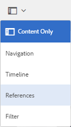

# Preparare le risorse per la conversione {#preparing-assets-for-translation}

Per risorse in più lingue si intendono risorse con file binari, metadati e tag in più lingue. In genere, i file binari, i metadati e i tag delle risorse esistono in una lingua, che vengono poi tradotti in altre lingue per l’utilizzo in progetti multilingue.

In [!DNL Adobe Experience Manager Assets], le risorse in più lingue sono incluse nelle cartelle, dove ciascuna cartella contiene le risorse in un&#39;altra lingua.

Ogni cartella lingua è denominata copia per lingua. La cartella principale di una copia della lingua, nota come radice della lingua, identifica la lingua del contenuto nella copia della lingua. Ad esempio, */content/dam/it* è la radice della lingua italiana per la copia in lingua italiana. Le copie della lingua devono utilizzare una [radice della lingua configurata correttamente](preparing-assets-for-translation.md#creating-a-language-root) in modo che venga utilizzata la lingua corretta quando vengono eseguite le traduzioni delle risorse di origine.

La copia per la lingua per la quale avete aggiunto originariamente le risorse è la lingua principale. La lingua primaria è l&#39;origine tradotta in altre lingue. Una gerarchia di cartelle di esempio include diverse origini di lingua:

```shell
/content
    /- dam
        |- en
        |- fr
        |- de
        |- es
        |- it
        |- ja
        |- zh
```

Per preparare le risorse alla conversione, effettuate le seguenti operazioni:

1. Creare la radice della lingua della lingua principale. Ad esempio, la radice della lingua della copia in lingua inglese nella gerarchia delle cartelle di esempio è `/content/dam/en`. Assicurarsi che la radice della lingua sia configurata correttamente in base alle informazioni in [Crea una radice della lingua](preparing-assets-for-translation.md#creating-a-language-root).

1. Aggiungere risorse alla lingua principale.
1. Create la radice della lingua di ciascuna lingua di destinazione per la quale è necessaria una copia della lingua.

## Creare una radice della lingua {#creating-a-language-root}

Per creare la directory principale della lingua, create una cartella e utilizzate un codice della lingua ISO come valore per la proprietà Name. Dopo aver creato la lingua principale, è possibile creare una copia della lingua a qualsiasi livello all&#39;interno della lingua principale.

Ad esempio, la pagina principale della copia in lingua italiana della gerarchia di esempio ha `it` come proprietà Name. La proprietà Name viene utilizzata come nome del nodo della risorsa nella directory archivio e pertanto determina il percorso delle risorse. (`https://[aem_server]:[port]/assets.html/content/dam/it/`).

1. Dalla console [!DNL Assets], fare clic su **[!UICONTROL Crea]** e scegliere **[!UICONTROL Cartella]** dal menu.

   

1. Nel campo **[!UICONTROL Name]** digitare il codice del paese nel formato `<language-code>`.

   

1. Fai clic su **[!UICONTROL Crea]**. La radice della lingua viene creata nella console [!DNL Assets].

## Visualizzare le radici della lingua {#viewing-language-roots}

[!DNL Experience Manager] l&#39;interfaccia fornisce un pannello  **** Riferimenti che visualizza un elenco delle radici della lingua create all&#39;interno di  [!DNL Assets].

1. Nella console [!DNL Assets], selezionare la lingua principale per la quale si desidera creare delle copie della lingua.
1. Dalla barra a sinistra, selezionare l&#39;opzione **[!UICONTROL Riferimenti]** per aprire il riquadro [!UICONTROL Riferimento].

   

1. Nel riquadro Riferimenti, fare clic su **[!UICONTROL Copie lingua]**. Il pannello [!UICONTROL Copie lingua] mostra le copie della lingua delle risorse.

   
