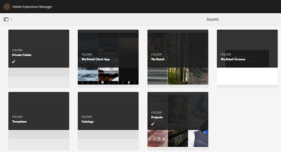

# Cartella privata in [!DNL Adobe Experience Manager Assets] {#private-folder}

È possibile creare una cartella privata nell&#39;interfaccia utente [!DNL Adobe Experience Manager Assets] disponibile esclusivamente per l&#39;utente. Potete condividere questa cartella privata con altri utenti e assegnare loro vari privilegi. In base al livello di privilegio assegnato, gli utenti possono eseguire varie attività sulla cartella, ad esempio visualizzare le risorse all’interno della cartella o modificarle.

>[!NOTE]
>
>La cartella privata ha almeno un membro con il ruolo Proprietario.

## Creazione e condivisione di cartelle private {#create-share-private-folder}

Per creare e condividere una cartella privata:

1. Nella console [!DNL Assets], fare clic su **[!UICONTROL Crea]** nella barra degli strumenti, quindi scegliere **[!UICONTROL Cartella]** dal menu.

   

1. Nella finestra di dialogo **[!UICONTROL Crea cartella]**, immettete un titolo e un nome (facoltativo) per la cartella, quindi selezionate l&#39;opzione **[!UICONTROL Privato]**.

1. Fai clic su **[!UICONTROL Crea]**. Viene creata una cartella privata.

   

1. Per condividere la cartella con altri utenti e assegnare loro i privilegi, selezionate la cartella e fate clic su **[!UICONTROL Proprietà]** nella barra degli strumenti.

   

   >[!NOTE]
   >
   >La cartella non è visibile ad altri utenti finché non la condividete.

1. Nella pagina **[!UICONTROL Proprietà cartella]**, selezionare un utente dall&#39;elenco **[!UICONTROL Aggiungi utente]**, assegnare un ruolo all&#39;utente nella cartella privata e fare clic su **[!UICONTROL Aggiungi]**.

   

   >[!NOTE]
   >
   >Potete assegnare vari ruoli, ad esempio `Editor`, `Owner` o `Viewer` all&#39;utente con cui condividete la cartella. Se assegnate un ruolo `Owner` all&#39;utente, quest&#39;ultimo dispone di privilegi `Editor` nella cartella. Inoltre, l’utente può condividere la cartella con altri utenti. Se assegnate un ruolo `Editor`, l&#39;utente può modificare le risorse nella cartella privata. Se assegnate un ruolo di visualizzatore, l’utente può visualizzare solo le risorse presenti nella propria cartella privata.

   >[!NOTE]
   >
   >La cartella privata ha almeno un membro con il ruolo `Owner`. Pertanto, l’amministratore non può rimuovere tutti i membri del proprietario da una cartella privata. Tuttavia, per rimuovere i proprietari esistenti (e lo stesso amministratore) dalla cartella privata, l&#39;amministratore deve aggiungere un altro utente come proprietario.

1. Fai clic su **[!UICONTROL Salva]**. A seconda del ruolo assegnato, all&#39;utente viene assegnato un set di privilegi nella cartella privata quando accede a [!DNL Assets].
1. Fare clic su **[!UICONTROL Ok]** per chiudere il messaggio di conferma.
1. L’utente con il quale condividete la cartella riceve una notifica di condivisione. Accedete a [!DNL Assets] con le credenziali dell&#39;utente per visualizzare la notifica.

   

1. Fare clic su [!UICONTROL Notifiche] per aprire un elenco di notifiche.

   

1. Fate clic sulla voce relativa alla cartella privata condivisa dall’amministratore per aprire la cartella.

>[!NOTE]
>
>Per creare una cartella privata, è necessario leggere e modificare le [autorizzazioni di controllo di accesso](/help/sites-administering/security.md#permissions-in-aem) nella cartella principale in cui si desidera creare una cartella privata. Se non sei un amministratore, queste autorizzazioni non sono abilitate per impostazione predefinita in `/content/dam`. In questo caso, ottenete prima queste autorizzazioni per l’ID utente o il gruppo prima di tentare di creare cartelle private.

## Eliminazione cartella privata {#delete-private-folder}

È possibile eliminare una cartella selezionando la cartella e selezionando l&#39;opzione [!UICONTROL Elimina] dal menu principale, oppure utilizzando il tasto Backspace sulla tastiera.

>[!CAUTION]
>
>Se eliminate una cartella privata dal CRXDE Lite , i gruppi di utenti ridondanti vengono lasciati nella directory archivio.

>[!NOTE]
>
>Se eliminate una cartella utilizzando il metodo indicato sopra dall’interfaccia utente, vengono eliminati anche i gruppi di utenti associati.
>
>Tuttavia, i gruppi di utenti ridondanti, inutilizzati e generati automaticamente esistenti possono essere rimossi dall&#39;archivio utilizzando il metodo `clean` in JMX nell&#39;istanza di creazione (`http://[server]:[port]/system/console/jmx/com.day.cq.dam.core.impl.team%3Atype%3DClean+redundant+groups+for+Assets`).
