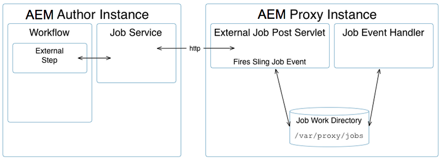

# [!DNL Assets] sviluppo proxy {#assets-proxy-development}

[!DNL Adobe Experience Manager Assets] utilizza un proxy per distribuire l&#39;elaborazione per determinate attività.

Un proxy è un&#39;istanza di Experience Manager specifica (e talvolta separata) che utilizza i lavoratori proxy come processori responsabili della gestione di un processo e della creazione di un risultato. Un processo di lavoro proxy può essere utilizzato per un&#39;ampia gamma di attività. Se è presente un proxy [!DNL Assets], può essere utilizzato per caricare le risorse per il rendering in Assets. Il processo di lavoro proxy [IDS](indesign.md) utilizza ad esempio un server [!DNL Adobe InDesign] per elaborare i file da utilizzare in Assets.

Quando il proxy è un&#39;istanza [!DNL Experience Manager] separata, ciò consente di ridurre il carico sulle istanze di authoring [!DNL Experience Manager]. Per impostazione predefinita, [!DNL Assets] esegue le attività di elaborazione delle risorse nella stessa JVM (esternalizzata tramite Proxy) per ridurre il carico sull&#39;istanza di authoring [!DNL Experience Manager].

## Proxy (accesso HTTP) {#proxy-http-access}

Un proxy è disponibile tramite HTTP Servlet quando è configurato per accettare processi di elaborazione in: `/libs/dam/cloud/proxy`. Questo servlet crea un processo sling dai parametri inviati. Questa viene quindi aggiunta alla coda del processo proxy e connessa al processo di lavoro proxy appropriato.

### Operazioni supportate {#supported-operations}

* `job`

  **Requisiti**: il parametro `jobevent` deve essere impostato come mappa di valori serializzati. Utilizzato per creare un `Event` per un processore di processi.

  **Risultato**: aggiunge un nuovo processo. In caso di esito positivo, viene restituito un ID processo univoco.

```shell
curl -u admin:admin -F":operation=job" -F"someproperty=xxxxxxxxxxxx"
    -F"jobevent=serialized value map" http://localhost:4502/libs/dam/cloud/proxy
```

* `result`

  **Requisiti**: impostare il parametro `jobid`.

  **Risultato**: restituisce una rappresentazione JSON del nodo del risultato creato dal processore del processo.

```shell
curl -u admin:admin -F":operation=result" -F"jobid=xxxxxxxxxxxx"
    http://localhost:4502   /libs/dam/cloud/proxy
```

* `resource`

  **Requisiti**: è necessario impostare il parametro jobid.

  **Risultato**: restituisce una risorsa associata al processo specificato.

```shell
curl -u admin:admin -F":operation=resource" -F"jobid=xxxxxxxxxxxx"
    -F"resourcePath=something.pdf" http://localhost:4502/libs/dam/cloud/proxy
```

* `remove`

  **Requisiti**: è necessario impostare il parametro jobid.

  **Risultati**: rimuove un processo se trovato.

```shell
curl -u admin:admin -F":operation=remove" -F"jobid=xxxxxxxxxxxx"
    http://localhost:4502/libs/dam/cloud/proxy
```

### Processo di lavoro proxy {#proxy-worker}

Un proxy worker è un processore responsabile della gestione di un processo e della creazione di un risultato. I processi di lavoro risiedono nell&#39;istanza proxy e devono implementare [sling JobProcessor](https://sling.apache.org/site/eventing-and-jobs.html) per essere riconosciuti come processi di lavoro proxy.

>[!NOTE]
>
>Il processo di lavoro deve implementare [sling JobProcessor](https://sling.apache.org/site/eventing-and-jobs.html) per essere riconosciuto come processo di lavoro proxy.

### API client {#client-api}

[`JobService`](https://helpx.adobe.com/experience-manager/6-5/sites/developing/using/reference-materials/javadoc/index.html) è disponibile come servizio OSGi che fornisce metodi per creare processi, rimuovere processi e ottenere risultati da tali processi. L&#39;implementazione predefinita di questo servizio (`JobServiceImpl`) utilizza il client HTTP per comunicare con il servlet proxy remoto.

Di seguito è riportato un esempio di utilizzo dell’API:

```java
@Reference
 JobService proxyJobService;

 // to create a job
 final Hashtable props = new Hashtable();
 props.put("someproperty", "some value");
 props.put(JobUtil.PROPERTY_JOB_TOPIC, "myworker/job"); // this is an identifier of the worker
 final String jobId = proxyJobService.addJob(props, new Asset[]{asset});

 // to check status (returns JobService.STATUS_FINISHED or JobService.STATUS_INPROGRESS)
 int status = proxyJobService.getStatus(jobId)

 // to get the result
 final String jsonString = proxyJobService.getResult(jobId);

 // to remove job and cleanup
 proxyJobService.removeJob(jobId);
```

### Configurazioni Cloud Service {#cloud-service-configurations}

<!-- TBD: Cannot find com.day.cq.dam.api.proxy at https://helpx.adobe.com/experience-manager/6-5/sites/developing/using/reference-materials/javadoc/index.html which were generated in May 2020. Hiding this broken link for now.
>[!NOTE]
>
>Reference documentation for the proxy API is available under [`com.day.cq.dam.api.proxy`](https://helpx.adobe.com/experience-manager/6-5/sites/developing/using/reference-materials/javadoc/com/day/cq/dam/api/proxy/package-summary.html).
-->

Le configurazioni di lavoro proxy e proxy sono disponibili tramite le configurazioni dei servizi cloud accessibili dalla console [!DNL Assets] **Strumenti** o in `/etc/cloudservices/proxy`. Ogni processo di lavoro proxy deve aggiungere un nodo in `/etc/cloudservices/proxy` per i dettagli di configurazione specifici del processo (ad esempio, `/etc/cloudservices/proxy/workername`).

>[!NOTE]
>
>Per ulteriori informazioni, vedere [Configurazione di InDesign Server Proxy Worker](indesign.md#configuring-the-proxy-worker-for-indesign-server) e [Configurazione di Cloud Service](../sites-developing/extending-cloud-config.md).

Di seguito è riportato un esempio di utilizzo dell’API:

```java
@Reference(policy = ReferencePolicy.STATIC)
 ProxyConfig proxyConfig;

 // to get proxy config
 Configuration cloudConfig = proxyConfig.getConfiguration();
 final String value = cloudConfig.get("someProperty", "defaultValue");

 // to get worker config
 Configuration cloudConfig = proxyConfig.getConfiguration("workername");
 final String value = cloudConfig.get("someProperty", "defaultValue");
```

### Sviluppo di un processo di lavoro proxy personalizzato {#developing-a-customized-proxy-worker}

Il processo di lavoro proxy [IDS](indesign.md) è un esempio di un processo di lavoro proxy [!DNL Assets] già preconfigurato per esternalizzare l&#39;elaborazione delle risorse InDesign.

È inoltre possibile sviluppare e configurare il proprio processo di lavoro proxy [!DNL Assets] per creare un processo di lavoro specializzato per l&#39;invio e l&#39;esternalizzazione delle attività di elaborazione [!DNL Assets].

Per configurare un processo di lavoro proxy personalizzato è necessario:

* Impostare e implementare (utilizzando l’evento Sling):

   * un argomento processo personalizzato
   * un gestore di eventi processo personalizzato

* Quindi utilizza l’API JobService per:

   * inviare il processo personalizzato al proxy
   * gestisci il tuo lavoro

* Se desideri utilizzare il proxy da un flusso di lavoro, devi implementare un passaggio esterno personalizzato utilizzando l’API WorkflowExternalProcess e l’API JobService.

Il diagramma e i passaggi seguenti descrivono in dettaglio come procedere:



>[!NOTE]
>
>Nei passaggi seguenti, gli equivalenti InDesign sono indicati come esempi di riferimento.

1. Viene utilizzato un [processo Sling](https://sling.apache.org/site/eventing-and-jobs.html), pertanto è necessario definire un argomento di processo per il caso d&#39;uso.

   Ad esempio, vedere `IDSJob.IDS_EXTENDSCRIPT_JOB` per il processo di lavoro proxy IDS.

1. Il passaggio esterno viene utilizzato per attivare l’evento e quindi attendere che sia completato; ciò viene effettuato tramite il polling dell’ID. Sviluppa il tuo passaggio per implementare nuove funzionalità.

   Implementare `WorkflowExternalProcess`, quindi utilizzare l&#39;API JobService e l&#39;argomento del processo per preparare un evento di processo e inviarlo al JobService (un servizio OSGi).

   Ad esempio, vedere `INDDMediaExtractProcess`.java per il processo di lavoro proxy IDS.

1. Implementa un gestore di processi per l’argomento. Questo gestore richiede sviluppo in modo che esegua l’azione specifica ed è considerato l’implementazione del processo di lavoro.

   Ad esempio, vedere `IDSJobProcessor.java` per il processo di lavoro proxy IDS.

1. Utilizza `ProxyUtil.java` in dam-commons. In questo modo è possibile inviare processi ai lavoratori utilizzando il proxy DAM.

>[!NOTE]
>
>Il framework proxy [!DNL Assets] non fornisce il meccanismo predefinito del pool.
>
>L&#39;integrazione di [!DNL InDesign] consente l&#39;accesso a un pool di [!DNL InDesign] server (IDSPool). Questo pool è specifico per l&#39;integrazione di [!DNL InDesign] e non fa parte del framework proxy [!DNL Assets].

>[!NOTE]
>
>Sincronizzazione dei risultati:
>
>In caso contrario, il risultato dell&#39;elaborazione rimarrà con il proxy. È compito del client (Autore Experience Manager) richiedere il risultato utilizzando lo stesso ID processo univoco fornito al client al momento della creazione del lavoro. Il proxy esegue semplicemente il processo e mantiene il risultato pronto per essere richiesto.
