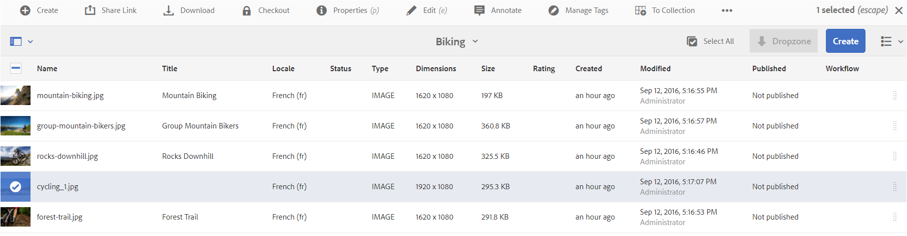
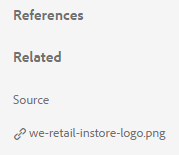
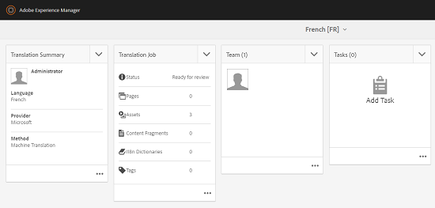

# Risorse correlate {#related-assets}

[!DNL Adobe Experience Manager Assets] consente di correlare manualmente le risorse in base alle esigenze dell’organizzazione utilizzando la funzione risorse correlate. Ad esempio, puoi correlare un file di licenza con una risorsa o un’immagine o un video su un argomento simile. Puoi correlare risorse che condividono alcuni attributi comuni. È inoltre possibile utilizzare la funzione per creare relazioni di origine/derivate tra le risorse. Se ad esempio si dispone di un file PDF generato da un file INDD, è possibile correlare il file PDF al relativo file INDD di origine.

Grazie a questa funzione, è possibile condividere un file PDF o JPG a bassa risoluzione con fornitori o agenzie e rendere disponibile il file INDD ad alta risoluzione solo su richiesta.

>[!NOTE]
>
>Solo gli utenti con autorizzazioni di modifica per le risorse possono correlare e scollegare le risorse.

## Riferire le risorse {#relating-assets}

1. Dalla sezione [!DNL Experience Manager] , aprire **[!UICONTROL Proprietà]** per una risorsa da correlare.

   

   *Figura: [!DNL Assets] [!UICONTROL Proprietà] pagina per correlare le risorse.*

   In alternativa, seleziona la risorsa dalla vista a elenco.

   

   Puoi anche selezionare la risorsa da una raccolta.

   

1. Per correlare un’altra risorsa alla risorsa selezionata, fai clic su **[!UICONTROL Correlare]**  dalla barra degli strumenti.
1. Effettua una delle operazioni seguenti:

   * Per correlare il file di origine della risorsa, seleziona **[!UICONTROL Sorgente]** dall&#39;elenco.
   * Per correlare un file derivato, selezionare **[!UICONTROL Derivato]** dall&#39;elenco.
   * Per creare una relazione bidirezionale tra le risorse, seleziona **[!UICONTROL Altro]** dall&#39;elenco.

1. Dalla sezione **[!UICONTROL Seleziona risorsa]** , passa alla posizione della risorsa da correlare e selezionala.

   

1. Clic **[!UICONTROL Conferma]**.
1. Clic **[!UICONTROL OK]** per chiudere la finestra di dialogo A seconda della scelta effettuata nella relazione al passaggio 3, la risorsa correlata viene elencata in una categoria appropriata nella sezione **[!UICONTROL Correlato]** sezione. Ad esempio, se la risorsa correlata è il file di origine della risorsa corrente, viene elencata in **[!UICONTROL Sorgente]**.

   

1. Per scollegare una risorsa, fai clic su **[!UICONTROL Scollega]**  dalla barra degli strumenti.

1. Seleziona le risorse da rimuovere dalla relazione **[!UICONTROL Rimuovi relazioni]** e fai clic su **[!UICONTROL Scollega]**.

   

1. Clic **[!UICONTROL OK]** per chiudere la finestra di dialogo Le risorse per le quali hai rimosso le relazioni vengono eliminate dall’elenco delle risorse correlate in **[!UICONTROL Correlato]** sezione.

## Tradurre le risorse correlate {#translating-related-assets}

La creazione di relazioni origine/derivate tra risorse utilizzando la funzione risorse correlate è utile anche nei flussi di lavoro di traduzione. Quando esegui un flusso di lavoro di traduzione su una risorsa derivata, [!DNL Experience Manager Assets] recupera automaticamente qualsiasi risorsa a cui il file di origine fa riferimento e la include per la traduzione. In questo modo, la risorsa a cui fa riferimento la risorsa sorgente viene tradotta insieme alle risorse sorgente e derivate. Ad esempio, considera uno scenario in cui la copia in lingua inglese include una risorsa derivata e il relativo file di origine, come illustrato.

Se il file di origine è correlato a un’altra risorsa, [!DNL Experience Manager Assets] recupera la risorsa di riferimento e la include per la traduzione.

*Figura: Risorsa di origine delle risorse correlate da includere per la traduzione.*

1. Traduci le risorse nella cartella di origine in una lingua di destinazione seguendo i passaggi descritti in [Creare un progetto di traduzione](translation-projects.md#create-a-new-translation-project). Ad esempio, in questo caso, traduci le risorse in francese.

1. Dalla sezione [!UICONTROL Progetti] , apri la cartella di traduzione.

1. Fai clic sul riquadro del progetto per aprire la pagina dei dettagli.

   

1. Fai clic sui puntini di sospensione sotto la scheda Lavoro di traduzione per visualizzare lo stato della traduzione.

   

1. Seleziona la risorsa e fai clic su **[!UICONTROL Mostra in Assets]** dalla barra degli strumenti per visualizzare lo stato di traduzione della risorsa.

   

1. Per verificare se le risorse correlate all’origine sono state tradotte, fai clic sulla risorsa di origine.

1. Seleziona la risorsa correlata all’origine, quindi fai clic su **[!UICONTROL Mostra in Assets]**. Viene visualizzata la risorsa correlata tradotta.
