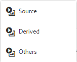

# Risorse correlate {#related-assets}

Risorse Adobe Experience Manager (AEM) consente di correlare manualmente le risorse in base alle esigenze dell’organizzazione mediante la funzione delle risorse correlate. Ad esempio, potete collegare un file di licenza a una risorsa o un&#39;immagine/video su un argomento simile. Potete correlare le risorse che condividono alcuni attributi comuni. Potete anche usare la funzione per creare relazioni sorgente/derivate tra le risorse. Ad esempio, se si dispone di un file PDF generato da un file INDD, è possibile collegare il file PDF al relativo file INDD di origine.

Grazie a questa funzione, potete condividere un file PDF o JPG a bassa risoluzione con fornitori o agenzie e rendere il file INDD ad alta risoluzione disponibile solo su richiesta.

>[!NOTE] Solo gli utenti con autorizzazioni di modifica per le risorse possono collegare e scollegare le risorse.
>

## Relate assets {#relating-assets}

1. Dall’interfaccia di AEM, aprite la pagina **[!UICONTROL Proprietà]** di una risorsa da correlare.

   

   *Figura: Pagina delle proprietà della risorsa per correlare le risorse*

   In alternativa, selezionate la risorsa dalla vista a elenco.

   

   Potete anche selezionare la risorsa da una raccolta.

   

1. Per mettere in relazione un’altra risorsa con la risorsa selezionata, toccate o fate clic sull’icona **[!UICONTROL Relate]** nella barra degli strumenti.

   

1. Effettua una delle operazioni seguenti:

   * Per correlare il file di origine della risorsa, selezionate **[!UICONTROL Origine]** dall’elenco.
   * Per correlare un file derivato, selezionare **[!UICONTROL Derivato]** dall&#39;elenco.
   * Per creare una relazione bidirezionale tra le risorse, selezionate **[!UICONTROL Altre]** dall’elenco.
   

1. Dalla schermata **[!UICONTROL Seleziona risorsa]** , individuate la posizione della risorsa da correlare e selezionatela.

   

1. Tocca o fai clic sull’icona **[!UICONTROL Conferma]** .
1. Tocca o fai clic su **[!UICONTROL OK]** per chiudere la finestra di dialogo. A seconda della relazione scelta nel passaggio 3, la risorsa correlata è elencata in una categoria appropriata nella sezione **[!UICONTROL correlata]** . Ad esempio, se la risorsa correlata è il file di origine della risorsa corrente, viene elencata in **[!UICONTROL Origine]**.

   

1. Per non correlare una risorsa, toccate o fate clic su **[!UICONTROL Annulla correlazione]** nella barra degli strumenti.

   

1. Selezionate le risorse da rimuovere dalla finestra di dialogo **[!UICONTROL Rimuovi relazioni]** e toccate o fate clic su **[!UICONTROL Annulla relazione]**.

   

1. Toccate o fate clic su **[!UICONTROL OK]** per chiudere la finestra di dialogo. Le risorse per le quali avete rimosso le relazioni vengono eliminate dall’elenco delle risorse correlate nella sezione **[!UICONTROL Correlati]** .

## Conversione di risorse correlate {#translating-related-assets}

La creazione di relazioni sorgente/derivate tra risorse mediante la funzione Risorse correlate è utile anche nei flussi di lavoro di traduzione. Quando eseguite un flusso di lavoro di traduzione su una risorsa derivata, Risorse AEM recupera automaticamente tutte le risorse a cui fa riferimento il file sorgente e le include per la traduzione. In questo modo, la risorsa a cui fa riferimento la risorsa di origine viene convertita insieme alle risorse sorgente e derivate. Ad esempio, in uno scenario in cui la copia in lingua inglese include una risorsa derivata e il relativo file di origine come mostrato.

Se il file di origine è correlato a un’altra risorsa, Experience Manager Assets recupera la risorsa di riferimento e la include per la traduzione.

*Figura: Risorsa di origine delle risorse correlate da includere per la traduzione*

1. Traducete le risorse presenti nella cartella di origine in una lingua di destinazione seguendo la procedura descritta in [Creazione di un nuovo progetto](translation-projects.md#create-a-new-translation-project)di traduzione. Ad esempio, in questo caso, potete tradurre le risorse in francese.

1. Dalla pagina [!UICONTROL Progetti] , aprite la cartella di traduzione.

   

1. Toccate o fate clic sulla sezione del progetto per aprire la pagina dei dettagli.

   

1. Toccate o fate clic sulle ellissi sotto la scheda Processo di traduzione per visualizzare lo stato della traduzione.

   

1. Selezionate la risorsa, quindi toccate o fate clic su **[!UICONTROL Mostra in risorse]** nella barra degli strumenti per visualizzare lo stato di conversione della risorsa.

   

1. Per verificare se le risorse correlate all’origine sono state tradotte, toccate o fate clic sulla risorsa sorgente.

   

1. Selezionate la risorsa correlata all’origine, quindi toccate o fate clic su **[!UICONTROL Rivela in risorse]**. Viene visualizzata la risorsa correlata convertita.

   
