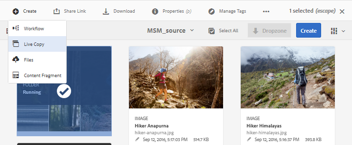
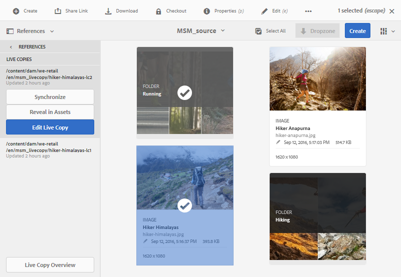
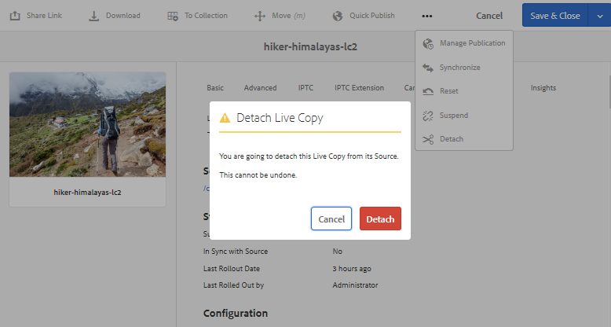

# Riutilizzare le risorse utilizzando MSM per [!DNL Assets] {#reuse-assets-using-msm-for-assets}

La funzionalità Multi Site Manager (MSM) in [!DNL Adobe Experience Manager] consente agli utenti di riutilizzare il contenuto creato una volta e riutilizzato in più posizioni Web. Lo stesso è disponibile per le risorse digitali come MSM per la funzionalità [!DNL Assets]. MSM per [!DNL Assets] consente di:

* Create una volta e quindi copiate le risorse da riutilizzare in altre aree del sito.
* Mantenete più copie in sincronizzazione e aggiornate la copia principale originale una volta per inviare le modifiche alle copie figlio.
* Apportate modifiche locali sospendendo temporaneamente o permanentemente il collegamento tra risorse padre e risorse figlio.

## Prerequisiti {#configprereq}

Per utilizzare MSM per [!DNL Assets], installare almeno Service Pack 1. Per ulteriori informazioni, vedere [le note sulla versione](/help/release-notes/sp-release-notes.md).

## Comprendere i vantaggi e i concetti {#concepts}

### Come funziona e vantaggi {#how-it-works-and-the-benefits}

Per comprendere gli scenari di utilizzo per riutilizzare lo stesso contenuto (testo e risorse) in più posizioni Web, vedere [possibili scenari MSM](/help/sites-administering/msm.md). [!DNL Experience Manager] mantiene un collegamento tra la risorsa originale e le relative copie collegate, denominate Live Copy (LC). Il collegamento mantenuto consente di trasferire le modifiche centralizzate a molte copie dal vivo. Questo consente di velocizzare gli aggiornamenti eliminando i limiti di gestione delle copie duplicate. La propagazione delle modifiche è senza errori e centralizzata. Questa funzione consente di aggiornare le copie in diretta selezionate. Gli utenti possono scollegare il collegamento, ossia interrompere l’ereditarietà, e apportare modifiche locali che non verranno sovrascritte al successivo aggiornamento della copia principale e al rollout delle modifiche. Lo scollegamento può essere eseguito per alcuni campi di metadati selezionati o per un’intera risorsa. Consente la flessibilità di aggiornare localmente le risorse che sono state originariamente ereditate da una copia principale.

MSM mantiene una relazione live tra la risorsa di origine e le sue copie in tempo reale in modo che:

* Le modifiche apportate alle risorse sorgente vengono applicate anche alle copie in diretta, ossia le copie in diretta vengono sincronizzate con l’origine.
* Potete aggiornare le copie in diretta sospendendo la relazione in diretta o rimuovendo l&#39;ereditarietà per alcuni campi limitati. Le modifiche all&#39;origine non vengono più applicate alla Live Copy.

### Glossario di MSM per [!DNL Assets] termini {#glossary}

**Origine:** le risorse o le cartelle originali. Copia principale da cui derivano le copie in diretta.

**Live Copy:** la copia delle risorse/delle cartelle sorgente sincronizzata con la relativa origine. Le copie in diretta possono essere fonte di ulteriori copie in diretta. Scopri come creare LC.

**Ereditarietà:** collegamento/riferimento tra una risorsa/cartella Live Copy e la relativa origine usati dal sistema per ricordare dove inviare gli aggiornamenti. L’ereditarietà esiste a un livello granulare per i campi di metadati. L’ereditarietà può essere rimossa per i campi di metadati selettivi, mantenendo al contempo la relazione live tra l’origine e la copia dal vivo.

**Rollout:** azione che invia le modifiche apportate all&#39;origine a valle alle sue copie dal vivo. È possibile aggiornare una o più copie live in una sola volta mediante l&#39;azione di rollout. Consultate Rollout.

**Configurazione rollout:** Regole che determinano le proprietà da sincronizzare, come e quando. Queste configurazioni vengono applicate durante la creazione di copie live; può essere modificato successivamente; e un figlio può ereditare la configurazione di rollout dalla risorsa principale. Per MSM per [!DNL Assets], utilizzate solo la configurazione rollout standard. Le altre configurazioni di rollout non sono disponibili per MSM per [!DNL Assets].

**Sincronizza:** Un&#39;altra azione, oltre al rollout, che porta la parità tra l&#39;origine e la sua live copy inviando gli aggiornamenti dall&#39;origine alle Live Copy. Viene avviata la sincronizzazione per una particolare Live Copy e l&#39;azione richiama le modifiche dall&#39;origine. Utilizzando questa azione, è possibile aggiornare solo una delle Live Copy. Consultate Sincronizzare l’azione.

**Sospendi: rimuovete** temporaneamente la relazione dal vivo tra una Live Copy e la relativa risorsa/cartella di origine. È possibile riprendere la relazione. Consultate sospensione dell’azione.

**Riprendi:** riprende la relazione dal vivo in modo che una Live Copy riceva nuovamente gli aggiornamenti dall&#39;origine. Consultate Azione di ripresa.

**Reimposta:** Reimposta l&#39;azione per la copia dal vivo una replica dell&#39;origine sovrascrivendo eventuali modifiche locali. Inoltre rimuove le cancellazioni dell’ereditarietà e ripristina l’ereditarietà in tutti i campi di metadati. Per apportare modifiche locali in futuro, è necessario annullare nuovamente l&#39;ereditarietà di campi specifici. Consultate le modifiche locali a LC.

**Scollega:** Rimuove in modo irreversibile la relazione live di una risorsa/cartella Live Copy. Dopo l&#39;azione di scollegamento, le copie live non potranno mai ricevere gli aggiornamenti dall&#39;origine e non saranno più una live copy. Consultate rimuovere la relazione.

## Creare una Live Copy di una risorsa {#createlc}

Per creare una Live Copy da una o più risorse o cartelle sorgente, effettuate le seguenti operazioni:

* Metodo 1: Selezionate le risorse sorgente e fate clic su **[!UICONTROL Crea]** > **[!UICONTROL Live Copy]** nella barra degli strumenti nella parte superiore.
* Metodo 2: Nell&#39;interfaccia utente di [!DNL Experience Manager], fare clic su **[!UICONTROL Crea]** > **[!UICONTROL Live Copy]** dall&#39;angolo superiore destro dell&#39;interfaccia.

Potete creare copie dal vivo di una risorsa o di una cartella una per volta. Potete creare delle copie dal vivo derivate da una risorsa o da una cartella che è una Live Copy stessa. I frammenti di contenuto (CF) non sono supportati per il caso di utilizzo. Quando tentano di creare le loro copie dal vivo, i CF vengono copiati così come non esiste alcuna relazione. Gli CF copiati sono un&#39;istantanea nel tempo e non si aggiornano quando gli CF originali vengono aggiornati.

Per creare copie live con il primo metodo, attenetevi alla seguente procedura:

1. Selezionate le risorse o le cartelle sorgente. Dalla barra degli strumenti, fare clic su **[!UICONTROL Crea]** > **[!UICONTROL Live Copy]**.

   

   *Figura: Crea live copy dall&#39; [!DNL Experience Manager] interfaccia.*

1. Selezionate una cartella di destinazione. Fai clic su **[!UICONTROL Avanti]**.
1. Fornire titolo e nome. Le risorse non hanno elementi figlio. Quando create una Live Copy di cartelle, potete scegliere di includere o escludere gli elementi figlio.
1. Selezionate una configurazione di rollout. Fai clic su **[!UICONTROL Crea]**.

Per creare copie live con il secondo metodo, attenetevi alla seguente procedura:

1. Nell&#39;interfaccia [!DNL Experience Manager], dall&#39;angolo superiore destro, fare clic su **[!UICONTROL Crea]** > **[!UICONTROL Live Copy]**.

   

   *Figura: Crea live copy dall&#39; [!DNL Experience Manager] interfaccia.*

1. Selezionate la risorsa o la cartella sorgente. Fai clic su **[!UICONTROL Avanti]**.
1. Selezionate la cartella di destinazione. Fai clic su **[!UICONTROL Avanti]**.
1. Fornire titolo e nome. Le risorse non hanno elementi figlio. Quando create una Live Copy di cartelle, potete scegliere di includere o escludere gli elementi figlio.
1. Selezionate una configurazione di rollout. Fai clic su **[!UICONTROL Crea]**.

>[!NOTE]
>
>Quando si sposta un&#39;origine o una Live Copy, le relazioni vengono mantenute. Quando una Live Copy viene eliminata, le relazioni vengono rimosse.

## Visualizza varie proprietà e stati dell&#39;origine e della Live Copy {#properties}

È possibile visualizzare le informazioni e gli stati relativi a MSM della Live Copy, come relazione, sincronizzazione, rollout e altro dalle varie aree dell&#39;interfaccia utente [!DNL Experience Manager].

Per risorse e cartelle funzionano i due metodi seguenti:

* Selezionate la risorsa Live Copy e cercate le informazioni nella relativa pagina Proprietà.
* Seleziona la cartella di origine e trova le informazioni dettagliate di ciascuna Live Copy dalla [!UICONTROL Live Copy Console].

>[!TIP]
>
>Per verificare lo stato di alcune Live Copy separate, utilizzate il primo metodo che consiste nella visualizzazione della pagina Proprietà. Per verificare lo stato di molte Live Copies, utilizza il secondo metodo, ovvero visualizzare la pagina **[!UICONTROL Stato di relazione]**.

### Informazioni e stato di una Live Copy {#statuslcasset}

Per verificare le informazioni e gli stati di una risorsa Live Copy o di una cartella, effettuate le seguenti operazioni.

1. Selezionate una risorsa Live Copy o una cartella. Fare clic su **[!UICONTROL Proprietà]** dalla barra degli strumenti. In alternativa, utilizzare la scelta rapida da tastiera `p`.
1. Fare clic su **[!UICONTROL Live Copy]**. Potete controllare il percorso dell&#39;origine, lo stato di sospensione, lo stato di sincronizzazione, l&#39;ultima data di rollout e l&#39;utente che ha eseguito l&#39;ultimo rollout.

   

   *Figura: Informazioni e stati della Live Copy.*

1. Potete attivare o disattivare se le risorse secondarie prendono in prestito la configurazione della Live Copy.

1. Potete scegliere l&#39;opzione per la Live Copy per ereditare la configurazione di rollout dall&#39;elemento padre o modificare la configurazione.

### Informazioni e stati di tutte le copie in diretta di una cartella {#statuslcfolder}

[!DNL Experience Manager] fornisce una console per controllare le statue di tutte le copie live di una cartella sorgente. In questa console viene visualizzato lo stato di tutte le risorse figlio.

1. Selezionate una cartella sorgente. Fare clic su **[!UICONTROL Proprietà]** dalla barra degli strumenti. In alternativa, utilizzare la scelta rapida da tastiera `p`.
1. Fai clic su **[!UICONTROL Origine Live Copy]**. Per aprire la console, fai clic su **[!UICONTROL Panoramica Live Copy]**. Questo dashboard offre uno stato di primo livello per tutte le risorse figlie.

   

   *Figura: Visualizzare gli stati delle copie in diretta nella  [!UICONTROL Live Copy ] Consoleof source.*

1. Per visualizzare informazioni dettagliate su ciascuna risorsa della cartella Live Copy, seleziona la risorsa in questione, quindi dalla barra degli strumenti fai clic su **[!UICONTROL Stato di relazione]**.

   

   Informazioni dettagliate e stato di una risorsa figlia Live Copy in una cartella

>[!TIP]
>
>È possibile visualizzare rapidamente gli stati delle Live Copy di altre cartelle senza dover consultare troppo. È sufficiente cambiare la cartella nell&#39;elenco a comparsa nella parte superiore centrale dell&#39;interfaccia **[!UICONTROL Live Copy Overview]**.

### Azioni rapide dalla barra laterale Riferimenti per l&#39;origine {#refrailsource}

Per una risorsa o una cartella sorgente, potete visualizzare le informazioni seguenti ed effettuare le seguenti operazioni direttamente dalla barra laterale Riferimenti:

* Visualizzare i percorsi delle copie dal vivo.
* Aprite o visualizzate una Live Copy specifica nell&#39;interfaccia utente di [!DNL Experience Manager].
* Sincronizzate gli aggiornamenti con una Live Copy specifica.
* Sospendi la relazione o modifica la configurazione di rollout per una Live Copy specifica.
* Accedete alla console della panoramica Live Copy.

Selezionate la risorsa o la cartella di origine, aprite la barra a sinistra e fate clic su **[!UICONTROL References]**. In alternativa, seleziona una risorsa o una cartella e utilizza la scelta rapida da tastiera `Alt + 4`.

*Figura: Azioni e informazioni disponibili nella barra laterale Riferimenti per l’origine selezionata.*

Per una Live Copy specifica, fate clic su **[!UICONTROL Modifica Live Copy]** per sospendere la relazione o modificare la configurazione del rollout.

*Figura: Sospendere la relazione o modificare la configurazione di rollout di una Live Copy specifica.*

### Azioni rapide dalla barra laterale Riferimenti per Live Copy {#refraillc}

Per una risorsa o una cartella Live Copy, potete visualizzare le informazioni seguenti ed effettuare le seguenti operazioni direttamente dalla barra laterale Riferimenti:

* Visualizzare il percorso della relativa origine.
* Aprite o visualizzate una Live Copy specifica nell&#39;interfaccia utente di [!DNL Experience Manager].
* Implementate gli aggiornamenti.

Seleziona una risorsa o una cartella Live Copy, apri la barra a sinistra e fai clic su **[!UICONTROL Riferimenti]**. In alternativa, seleziona una risorsa o una cartella e utilizza la scelta rapida da tastiera `Alt + 4`.

*Figura: Azioni disponibili nella barra laterale Riferimenti per la Live Copy selezionata.*

## Propagare le modifiche dall&#39;origine alle Live Copy {#rolloutsync}

Dopo la modifica di un&#39;origine, le modifiche possono essere propagate alle Live Copy tramite un&#39;azione di sincronizzazione o un&#39;azione di rollout. Per comprendere la differenza tra entrambe le azioni, vedere [glossario](#glossary).

### Azione di rollout {#rollout}

Potete avviare un’azione di rollout dalla risorsa di origine e aggiornare tutte o alcune copie attive selezionate.

1. Selezionate una risorsa Live Copy o una cartella. Fare clic su **[!UICONTROL Proprietà]** dalla barra degli strumenti. In alternativa, utilizzare la scelta rapida da tastiera `p`.
1. Fai clic su **[!UICONTROL Origine Live Copy]**. Nella barra degli strumenti della parte superiore, fai clic su **[!UICONTROL Rollout]**.
1. Selezionate le Live Copy da aggiornare. Fare clic su **[!UICONTROL Rollout]**. Per distribuire gli aggiornamenti apportati alle risorse figlio, selezionate **[!UICONTROL Origine rollout e tutti gli elementi figlio]**.

   

   *Figura: Distribuite le modifiche di origine su alcune o tutte le copie in diretta.*

>[!NOTE]
>
>Le modifiche apportate in una risorsa di origine vengono distribuite solo alle copie live direttamente correlate. Se una Live Copy viene derivata da un’altra Live Copy, le modifiche non vengono implementate nella Live Copy derivata.

In alternativa, potete avviare un’azione di rollout dalla barra laterale Riferimenti dopo aver selezionato una Live Copy specifica. Per ulteriori informazioni, vedere [Azioni rapide dalla barra laterale Riferimenti per Live Copy](#refraillc). In questo metodo di rollout, vengono aggiornati solo la Live Copy selezionata e facoltativamente i relativi elementi figlio.

*Figura: Trasmettete le modifiche di origine nella Live Copy selezionata.*

### Informazioni sulla sincronizzazione dell&#39;azione {#aboutsync}

Un&#39;azione di sincronizzazione richiama le modifiche da un&#39;origine solo alla Live Copy selezionata. L’azione di sincronizzazione rispetta e mantiene le modifiche locali apportate dopo l’annullamento dell’ereditarietà. Le modifiche locali non vengono sovrascritte e l&#39;ereditarietà annullata non viene ripristinata. Puoi avviare un&#39;azione di sincronizzazione in tre modi.

| Dove si trova nell&#39;interfaccia [!DNL Experience Manager] | Quando e perché utilizzare | Come utilizzare |
|---|---|---|
|  Referencesrail | Sincronizzazione rapida quando la sorgente è già selezionata. | Vedere [Azioni rapide dalla barra laterale Riferimenti per origine](#refrailsource) |
| Barra degli strumenti nella pagina [!UICONTROL Proprietà] | Avviate una sincronizzazione quando avete già le proprietà Live Copy aperte. | Vedere [Sincronizzazione di una Live Copy](#synclc) |
| [!UICONTROL Live Copy ] Overviewconsole | Sincronizzate rapidamente più risorse (non necessariamente tutte) quando la cartella di origine è selezionata o la console [!UICONTROL Live Copy Overview] è già aperta. L’azione di sincronizzazione viene avviata per una risorsa alla volta, ma rappresenta un modo più rapido per eseguire la sincronizzazione per più risorse contemporaneamente. | Vedere [Azioni su molte risorse in una cartella Live Copy](#bulkactions) |

### Sincronizzazione di una Live Copy {#synclc}

Per avviare un’azione di sincronizzazione, apri la pagina **[!UICONTROL Proprietà]** di una Live Copy, fai clic su **[!UICONTROL Live Copy]** e nella barra degli strumenti seleziona l’azione desiderata.

Per visualizzare gli stati e le informazioni relativi a un’azione di sincronizzazione, consulta le sezioni [Informazioni e stato di una Live Copy](#statuslcasset) e [Informazioni e stati di tutte le Live Copy di una cartella](#statuslcfolder).

*Figura: L’azione di sincronizzazione richiama le modifiche apportate all’origine.*

>[!NOTE]
>
>Se la relazione è sospesa, l’azione di sincronizzazione non è disponibile nella barra degli strumenti. Mentre l’azione di sincronizzazione è disponibile nella barra laterale Riferimenti, le modifiche non vengono propagate anche dopo un’implementazione completata correttamente.

## Sospendi e riprendi relazione {#suspendresume}

Potete sospendere temporaneamente la relazione per impedire a una Live Copy di ricevere le modifiche apportate alla risorsa o alla cartella di origine. È inoltre possibile riprendere la relazione affinché la Live Copy inizi a ricevere le modifiche dall&#39;origine.

Per sospendere o riprendere, apri la pagina **[!UICONTROL Proprietà]** di una Live Copy, fai clic su **[!UICONTROL Live Copy]** e nella barra degli strumenti fai clic sull’azione desiderata.

In alternativa, puoi sospendere o riprendere rapidamente le relazioni tra più risorse in una cartella Live Copy della console **[!UICONTROL Panoramica Live Copy]**. Consulta la sezione [Azioni su numerose risorse presenti nelle cartelle Live Copy](#bulkactions).

## Apportate modifiche locali a una Live Copy {#localmods}

Una Live Copy è una replica dell&#39;origine originale al momento della creazione. I valori dei metadati di una Live Copy vengono ereditati dall&#39;origine. I campi di metadati mantengono l’ereditarietà singolarmente con i rispettivi campi della risorsa sorgente.

Tuttavia, puoi apportare modifiche locali a una Live Copy per cambiare alcune proprietà selezionate. Per eseguire modifiche locali, annulla l’ereditarietà della proprietà desiderata. Quando l’ereditarietà di uno o più campi di metadati viene annullata, si mantiene la relazione live della risorsa e l’ereditarietà degli altri campi di metadati. Qualsiasi sincronizzazione o rollout non sovrascrive le modifiche locali. A questo scopo, aprite la pagina **[!UICONTROL Proprietà]** di una risorsa Live Copy, fate clic sull&#39;opzione **[!UICONTROL Annulla ereditarietà]** accanto a un campo di metadati.

Potete annullare tutte le modifiche locali e ripristinare lo stato della risorsa all’origine. L’azione Reimposta sostituisce in modo irrevocabile e immediato tutte le modifiche locali e ripristina l’ereditarietà in tutti i campi di metadati. Per ripristinare, dalla pagina **[!UICONTROL Proprietà]** di una risorsa Live Copy, fate clic su **[!UICONTROL Reimposta]** dalla barra degli strumenti.

*Figura: L’azione Reimposta sovrascrive le modifiche locali e inserisce la Live Copy nella relativa origine.*

## Rimuovi relazione live {#detach}

È possibile rimuovere completamente la relazione tra un&#39;origine e una Live Copy utilizzando l&#39;azione Scollega. Una volta scollegata, la live copy diventa una risorsa o una cartella autonoma. Viene visualizzata come nuova risorsa nell&#39;interfaccia [!DNL Experience Manager] subito dopo lo scollegamento. Per scollegare una Live Copy dall&#39;origine, attenetevi alla seguente procedura.

1. Selezionate una risorsa o una cartella Live Copy. Fare clic su **[!UICONTROL Proprietà]** dalla barra degli strumenti. In alternativa, utilizzare la scelta rapida da tastiera `p`.

1. Fare clic su **[!UICONTROL Live Copy]**. Fare clic su **[!UICONTROL Scollega]** nella barra degli strumenti. Fare clic su **[!UICONTROL Scollega]** nella finestra di dialogo visualizzata.

   

   *Figura: L&#39;azione di sconnessione rimuove completamente la relazione tra sorgente e live copy.*

   >[!CAUTION]
   >
   >La relazione viene rimossa immediatamente quando si fa clic su **[!UICONTROL Scollega]** dalla finestra di dialogo. Non è possibile annullare l&#39;operazione facendo clic su **[!UICONTROL Annulla]** nella pagina Proprietà.

In alternativa, è possibile scollegare rapidamente più risorse in una cartella Live Copy dalla console **[!UICONTROL Live Copy Overview]**. Consulta la sezione [Azioni su numerose risorse presenti nelle cartelle Live Copy](#bulkactions).

## Azioni su più risorse in una cartella Live Copy {#bulkactions}

Se in una cartella di Live Copy sono presenti più risorse, l’avvio di azioni su ciascuna risorsa può risultare noioso. Puoi avviare rapidamente le azioni di base su più risorse dalla [!UICONTROL Live Copy Console]. I metodi indicati sopra continuano a funzionare per singole risorse.

1. Selezionate una cartella sorgente. Fare clic su **[!UICONTROL Proprietà]** dalla barra degli strumenti. In alternativa, utilizzare la scelta rapida da tastiera `p`.
1. Fai clic su **[!UICONTROL Origine Live Copy]**. Per aprire la console, fai clic su **[!UICONTROL Panoramica Live Copy]**.
1. In questo dashboard, seleziona una risorsa Live Copy da una cartella Live Copy. Nella barra degli strumenti, scegli le azioni desiderate. Le azioni disponibili sono: **[!UICONTROL Sincronizza]**, **[!UICONTROL Reimposta]**, **[!UICONTROL Sospendi]** e **[!UICONTROL Stacca]**. Potete avviare rapidamente queste azioni su qualsiasi risorsa presente in un numero qualsiasi di cartelle di Live Copy che si trovano in una relazione live con la cartella sorgente selezionata.

   

   *Figura: Aggiornate facilmente molte risorse nelle cartelle Live Copy dalla console  [!UICONTROL Live Copy ] Overviewfinder.*

## Estendi MSM per [!DNL Assets] {#extendapi}

[!DNL Experience Manager] consente di estendere la funzionalità tramite le API Java MSM. Per [!DNL Assets], l&#39;estensione funziona esattamente come con MSM per [!DNL Sites]. Per informazioni dettagliate, vedere [Estensione di MSM](/help/sites-developing/extending-msm.md) e i seguenti riferimenti per informazioni su attività specifiche:

* [Panoramica delle API](/help/sites-developing/extending-msm.md#overview-of-the-java-api)
* [Creare una nuova azione di sincronizzazione](/help/sites-developing/extending-msm.md#creating-a-new-synchronization-action)
* [Creare una nuova configurazione di rollout](/help/sites-developing/extending-msm.md#creating-a-new-rollout-configuration)
* [Creare e utilizzare una semplice classe LiveActionFactory](/help/sites-developing/extending-msm.md#creating-and-using-a-simple-liveactionfactory-class)

>[!NOTE]
>
>* Blueprint in MSM per [!DNL Sites] è denominata origine Live Copy in MSM per [!DNL Assets].
>* La rimozione del passaggio dei capitoli nella procedura guidata di creazione del sito non è supportata in MSM per [!DNL Assets].
>* La configurazione dei blocchi MSM, nelle proprietà della pagina (interfaccia touch), non è supportata in MSM per [!DNL Assets].

## Impatto delle attività di gestione delle risorse sulle copie live {#manageassets}

Le copie e le origini dal vivo sono risorse o cartelle che possono essere gestite, in una certa misura, come risorse digitali. Alcune attività di gestione delle risorse in [!DNL Experience Manager] hanno un impatto specifico sulle copie live.

* Copiando una Live Copy, viene creata una risorsa Live Copy con la stessa origine della prima live copy.
* Quando si sposta un&#39;origine o la sua Live Copy, la relazione live viene mantenuta.
* L&#39;azione di modifica non funziona per le risorse Live Copy. Se l&#39;origine di una Live Copy è di per sé una Live Copy, l&#39;azione di modifica non funziona.
* L’azione di estrazione non è disponibile per le risorse Live Copy.
* Per la cartella di origine, è disponibile l&#39;opzione per creare le attività di revisione.
* Quando visualizzate l’elenco delle risorse nelle viste a elenco e a colonne, viene visualizzata una risorsa o una cartella Live Copy con il comando Live Copy. Questo consente di identificare facilmente le copie dal vivo in una cartella.

## Confronta MSM per [!DNL Assets] e [!DNL Sites] {#comparison}

In altri scenari, MSM per [!DNL Assets] corrisponde al comportamento di MSM per la funzionalità Sites. Alcune delle principali differenze da sottolineare sono:

* Blueprint in MSM per [!DNL Sites] è denominata origine Live Copy in MSM per [!DNL Assets].
* In Siti è possibile confrontare un blueprint e la relativa Live Copy, ma non è possibile in [!DNL Assets] confrontare un&#39;origine con la sua Live Copy.
* Non è possibile modificare una Live Copy in [!DNL Assets].
* I siti in genere hanno figli, ma [!DNL Assets] no. L’opzione per includere o escludere elementi figlio non è presente quando si creano copie live di singole risorse.
* La rimozione del passaggio dei capitoli nella procedura guidata di creazione del sito non è supportata in MSM per [!DNL Assets].
* La configurazione dei blocchi MSM sulle proprietà della pagina (interfaccia touch) non è supportata in MSM per [!DNL Assets].
* Per MSM per [!DNL Assets], utilizzare solo la **[!UICONTROL configurazione rollout standard]**. Le altre configurazioni di rollout non sono disponibili per MSM per [!DNL Assets].

## Best practice {#bestpractices}

Alcune best practice per MSM sono:

* Pianificate le relazioni padre-figlio dei flussi di risorse e contenuti prima di avviare l&#39;implementazione.

## Limitazioni e problemi noti di MSM per [!DNL Assets] {#limitations}

Di seguito è riportata una limitazione di MSM per [!DNL Assets].

* I frammenti di contenuto (CF) non sono supportati per il caso di utilizzo. Quando tentano di creare le loro copie dal vivo, i CF vengono copiati così come non esiste alcuna relazione. Gli CF copiati sono un&#39;istantanea nel tempo e non si aggiornano quando gli CF originali vengono aggiornati.
