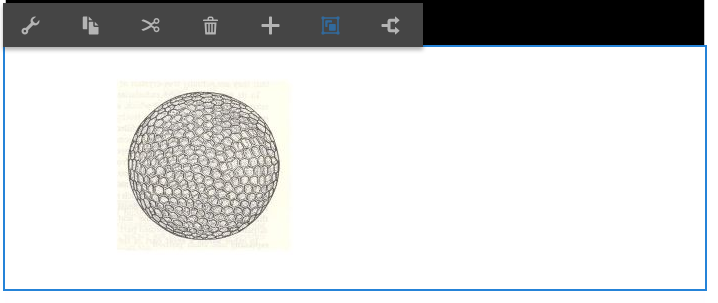
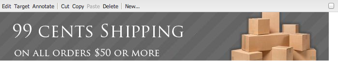
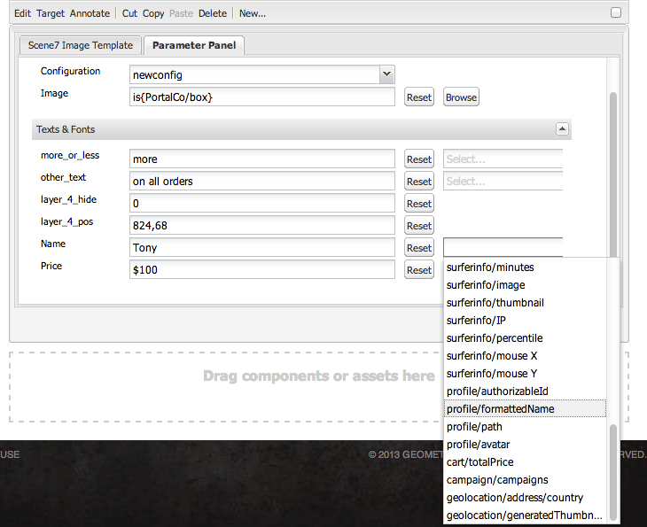

# Aggiungere funzioni di Dynamic Media Classic alle pagine {#adding-scene-features-to-your-page}

[Adobe Dynamic Media Classic](https://experienceleague.adobe.com/docs/dynamic-media-classic/using/home.html) è una soluzione ospitata per la gestione, l&#39;ottimizzazione, la pubblicazione e la distribuzione di risorse rich media a visualizzazioni e stampe connesse a Internet, dispositivi mobili e posta elettronica.

Puoi visualizzare le risorse di Experience Manager pubblicate in Dynamic Media Classic in vari visualizzatori:

* Zoom
* A comparsa
* Video
* Modello immagini
* Immagine

Puoi pubblicare le risorse digitali direttamente da Experience Manager a Dynamic Media Classic, e le risorse digitali da Dynamic Media Classic a Experience Manager.

Questo documento descrive come pubblicare le risorse digitali da Experience Manager a Dynamic Media Classic e viceversa. Vengono descritti in dettaglio anche i visualizzatori. Per informazioni sulla configurazione di Experience Manager per Dynamic Media Classic, consulta [Integrare Dynamic Media Classic con Experience Manager](/help/sites-administering/scene7.md).

Vedi anche [Aggiungi mappe immagine](image-maps.md).

Per ulteriori informazioni sull&#39;utilizzo dei componenti video con Experience Manager, vedere [Video](video.md).

>[!NOTE]
>
>Se le risorse Dynamic Media Classic non vengono visualizzate correttamente, verificare che Dynamic Medie sia [disabilitato](config-dynamic.md#disabling-dynamic-media), quindi aggiornare la pagina.

## Pubblicazione manuale in Dynamic Media Classic dalle risorse {#manually-publishing-to-scene-from-assets}

Puoi pubblicare le risorse digitali in Dynamic Media Classic nel modo seguente:

* [Nell’interfaccia utente classica dalla console Assets](/help/sites-classic-ui-authoring/manage-assets-classic-s7.md#publishing-from-the-assets-console)
* [Nell’interfaccia utente classica da una risorsa](/help/sites-classic-ui-authoring/manage-assets-classic-s7.md#publishing-from-an-asset)
* [Nell’interfaccia utente classica dall’esterno della cartella di CQ Target](/help/sites-classic-ui-authoring/manage-assets-classic-s7.md#publishing-assets-from-outside-the-cq-target-folder)

>[!NOTE]
>
>Experience Manager pubblica in Dynamic Media Classic in modo asincrono. Dopo aver selezionato **[!UICONTROL Publish]**, la pubblicazione della risorsa in Dynamic Media Classic richiede alcuni secondi.
>

## Componenti Dynamic Media Classic {#scene-components}

In Experience Manager sono disponibili i seguenti componenti di Dynamic Media Classic:

* Zoom
* A comparsa (Zoom)
* Modello immagini
* Immagine
* Video

>[!NOTE]
>
>Questi componenti non sono disponibili per impostazione predefinita e devono essere selezionati in modalità **[!UICONTROL Progettazione]** prima di utilizzare.

Dopo che sono stati resi disponibili in modalità **[!UICONTROL Progettazione]**, puoi aggiungere i componenti alla pagina come qualsiasi altro componente di Experience Manager. Le Assets che non sono ancora state pubblicate in Dynamic Media Classic vengono pubblicate in Dynamic Media Classic se si trovano in una cartella sincronizzata o in una pagina o con una configurazione cloud di Dynamic Media Classic.

>[!NOTE]
>
>Se crei e sviluppi visualizzatori personalizzati e utilizzi Content Finder, devi aggiungere esplicitamente il parametro `allowfullscreen`.

### Avviso sulla fine del ciclo di vita dei visualizzatori di Flash {#flash-viewers-end-of-life-notice}

A partire dal 31 gennaio 2017, Adobe Dynamic Media Classic ha terminato il supporto per la piattaforma di visualizzazione dei Flash.

### Aggiungere un componente Dynamic Media Classic (Scene7) a una pagina {#adding-a-scene-component-to-a-page}

L’aggiunta di un componente Dynamic Media Classic (Scene7) a una pagina equivale all’aggiunta di un componente a qualsiasi pagina. I componenti Dynamic Media Classic sono descritti in dettaglio nelle sezioni seguenti.

**Per aggiungere un componente Dynamic Media Classic (Scene7) a una pagina:**

1. Ad Experience Manager, aprire la pagina in cui si desidera aggiungere il componente **[!UICONTROL Dynamic Media Classic (Scene7)]**.

1. Se non sono disponibili componenti di Dynamic Media Classic, selezionare la modalità **[!UICONTROL Progettazione]**, selezionare qualsiasi componente con un bordo blu, selezionare l&#39;icona **[!UICONTROL Elemento padre]** e quindi l&#39;icona **[!UICONTROL Configurazione]**. In **[!UICONTROL Parsys (Progettazione)]**, selezionare tutti i componenti di Dynamic Media Classic per renderli disponibili e selezionare **[!UICONTROL OK]**.

   

1. Seleziona **[!UICONTROL Modifica]** per tornare alla modalità **[!UICONTROL Modifica]**.

1. Trascina un componente dal gruppo Dynamic Media Classic nella barra laterale e rilascialo sulla pagina nella posizione desiderata.

1. Seleziona l&#39;icona **[!UICONTROL Configurazione]** per aprire il componente.

1. Modificare il componente in base alle esigenze e selezionare **[!UICONTROL OK]** per salvare le modifiche.
1. Trascina l’immagine o il video dal browser dei contenuti al componente Dynamic Media Classic aggiunto alla pagina.

   >[!NOTE]
   >
   >Solo nell’interfaccia touch, devi trascinare e rilasciare l’immagine o il video sul componente Dynamic Media Classic inserito nella pagina. Non sono supportate la selezione e la modifica del componente Dynamic Media Classic e la scelta della risorsa.

### Aggiungere un’esperienza di visualizzazione interattiva a un sito reattivo {#adding-interactive-viewing-experiences-to-a-responsive-website}

Il design reattivo delle risorse si adatta a seconda della posizione in cui vengono visualizzate. Con il design reattivo, le stesse risorse possono essere visualizzate in modo efficace su più dispositivi.

Vedi anche [Progettazione reattiva per le pagine Web](/help/sites-developing/responsive.md).

**Per aggiungere un&#39;esperienza di visualizzazione interattiva a un sito reattivo:**

1. Accedi ad Experience Manager e accertati di disporre di [Cloud Service Adobe Dynamic Media Classic configurati](/help/sites-administering/scene7.md#configuring-scene-integration) e che i componenti Dynamic Media Classic siano disponibili.

   >[!NOTE]
   >
   >Se i componenti di Dynamic Media Classic non sono disponibili, assicurati [di abilitarli tramite la modalità Progettazione](/help/sites-authoring/default-components-designmode.md).

1. In un sito Web con i componenti **[!UICONTROL Dynamic Media Classic]** abilitati, trascina un componente **[!UICONTROL Image]** nella pagina.
1. Seleziona il componente e fai clic sull’icona di configurazione.
1. Nella scheda **[!UICONTROL Impostazioni Dynamic Media Classic]**, regola i punti di interruzione.

   

1. Verifica che i visualizzatori siano ridimensionati in modo dinamico e che tutte le interazioni siano ottimizzate per desktop, tablet e dispositivi mobili.

### Impostazioni comuni a tutti i componenti Dynamic Media Classic {#settings-common-to-all-scene-components}

Sebbene le opzioni di configurazione siano diverse, le seguenti sono comuni a tutti i [!UICONTROL componenti di Dynamic Media Classic]:

* **[!UICONTROL Riferimento file]** - Individuare il file a cui si desidera fare riferimento. Il riferimento file mostra l’URL della risorsa e non necessariamente l’URL completo di Dynamic Media Classic, inclusi i comandi e i parametri dell’URL. Non è possibile aggiungere comandi e parametri URL di Dynamic Media Classic in questo campo. Puoi invece aggiungerli attraverso la funzionalità corrispondente nel componente.
* **[!UICONTROL Larghezza]** - Consente di impostare la larghezza.
* **[!UICONTROL Altezza]** - Consente di impostare l&#39;altezza.

Per impostare queste opzioni di configurazione, apri (facendo doppio clic) un componente Dynamic Media Classic, ad esempio, quando apri un componente **[!UICONTROL Zoom]**:

### Zoom {#zoom}

Il componente Zoom di HTML5 visualizza un&#39;immagine più grande quando si preme il pulsante **[!UICONTROL +]**.

La risorsa presenta strumenti di zoom in basso. Selezionare **[!UICONTROL +]** se si desidera ingrandire; selezionare **[!UICONTROL -]** se si desidera ridurre. Toccando **[!UICONTROL x]** o la freccia di zoom ripristina, l&#39;immagine torna alle dimensioni originali in cui è stata importata. Seleziona le frecce diagonali per renderle a schermo intero. Seleziona **[!UICONTROL Modifica]** per configurare il componente. Con questo componente, puoi configurare [impostazioni comuni a tutti i [!UICONTROL componenti di Dynamic Media Classic]](#settings-common-to-all-scene-components).

### A comparsa {#flyout}

Nel componente HTML5 **[!UICONTROL A comparsa]**, la risorsa viene visualizzata come schermata divisa; la risorsa viene lasciata nelle dimensioni specificate; a destra viene visualizzata la porzione di zoom. Seleziona **[!UICONTROL Modifica]** per configurare il componente. Con questo componente è possibile configurare [impostazioni comuni a tutti i componenti di Dynamic Media Classic](#settings-common-to-all-scene-components).

>[!NOTE]
>
>Se il componente **[!UICONTROL A comparsa]** utilizza una dimensione personalizzata, questa viene utilizzata e la configurazione reattiva del componente è disabilitata.
>
>Se il componente **[!UICONTROL A comparsa]** utilizza le dimensioni predefinite, impostate in **[!UICONTROL Visualizzazione Struttura]**, vengono utilizzate le dimensioni predefinite e il componente si estende per adattarsi alle dimensioni del layout di pagina con la configurazione reattiva del componente abilitata. La configurazione reattiva del componente è limitata. Quando si utilizza il componente **[!UICONTROL A comparsa]** con la configurazione reattiva, non utilizzarlo con l&#39;estensione di pagina intera. In caso contrario, il **[!UICONTROL elemento a comparsa]** si estende oltre il bordo destro della pagina.

### Immagine {#image}

Il componente **[!UICONTROL Immagine]** di Dynamic Media Classic consente di aggiungere funzionalità Dynamic Media Classic alle immagini, ad esempio modificatori Dynamic Media Classic, predefiniti per immagini o visualizzatori e nitidezza. Il componente **[!UICONTROL Immagine]** di Dynamic Media Classic è simile ad altri componenti immagine in Experience Manager con funzionalità Dynamic Media Classic speciali. In questo esempio all&#39;immagine è applicato il modificatore URL di Dynamic Media Classic `&op_invert=1`.

**[!UICONTROL Titolo, Testo alternativo]** - Nella scheda **[!UICONTROL Avanzate]**, aggiungi un titolo all&#39;immagine e testo alternativo per gli utenti che hanno la grafica disattivata.

**[!UICONTROL URL, Apri in]** - Puoi impostare una risorsa da per aprire un collegamento. Imposta l&#39;**[!UICONTROL URL]** e in **[!UICONTROL Apri in]** indica se desideri che venga aperto nella stessa finestra o in una nuova finestra.

**[!UICONTROL Predefinito visualizzatore]** - Seleziona un predefinito visualizzatore esistente dal menu a discesa. Se il predefinito visualizzatore che stai cercando non è visibile, devi renderlo visibile. Vedere [Gestione predefiniti visualizzatore](/help/assets/managing-viewer-presets.md). Non è possibile selezionare un predefinito visualizzatore se si utilizza un predefinito immagine e viceversa.

**[!UICONTROL Configurazione Dynamic Media Classic]** - Seleziona la configurazione Dynamic Media Classic da utilizzare per recuperare i predefiniti immagine attivi da SPS.

**[!UICONTROL Predefinito immagine]** - Seleziona un predefinito immagine esistente dal menu a discesa. Se il predefinito immagine che state cercando non è visibile, dovete renderlo visibile. Consulta [Gestione predefiniti immagine](/help/assets/managing-image-presets.md). Non è possibile selezionare un predefinito visualizzatore se si utilizza un predefinito immagine e viceversa.

**[!UICONTROL Formato output]** - Selezionare il formato di output dell&#39;immagine, ad esempio jpeg. A seconda del formato di output selezionato, sono disponibili opzioni di configurazione aggiuntive. Consulta le [best practice per i predefiniti immagine](/help/assets/managing-image-presets.md#image-preset-options).

**[!UICONTROL Nitidezza]** - Seleziona la modalità di nitidezza dell&#39;immagine. La nitidezza è spiegata in dettaglio nelle [best practice per i predefiniti immagine](/help/assets/managing-image-presets.md#image-preset-options) e nelle [best practice per la nitidezza](/help/assets/assets/sharpening_images.pdf).

**[!UICONTROL Modificatori URL]** - È possibile modificare gli effetti immagine fornendo ulteriori comandi immagine Dynamic Media Classic. Questi comandi sono descritti in [Predefiniti immagine](/help/assets/managing-image-presets.md) e nel [Riferimento comando](https://experienceleague.adobe.com/docs/dynamic-media-developer-resources/image-serving-api/image-serving-api/http-protocol-reference/command-reference/c-command-reference.html).

**[!UICONTROL Punti di interruzione]** - Se il sito Web è reattivo, modificare i punti di interruzione. I punti di interruzione devono essere separati da virgole ( , ).

### Modello immagini {#image-template}

[I modelli di immagine Dynamic Media Classic](https://experienceleague.adobe.com/docs/dynamic-media-classic/using/template-basics/quick-start-template-basics.html) sono contenuti Photoshop a più livelli importati in Dynamic Media Classic, in cui il contenuto e le proprietà sono stati parametrizzati per la variabilità. Il componente **[!UICONTROL Modello immagine]** consente di importare immagini e modificare il testo in modo dinamico in Experience Manager. È inoltre possibile configurare il componente **[!UICONTROL Modello immagine]** in modo che utilizzi i valori del contesto client, in modo che ogni utente visualizzi l&#39;immagine in modo personalizzato.

Selezionare **[!UICONTROL Modifica]** per configurare il componente. È possibile configurare [impostazioni comuni a tutti i componenti di Dynamic Media Classic](#settings-common-to-all-scene-components) e altre impostazioni descritte in questa sezione.

**[!UICONTROL Riferimento file, larghezza, altezza]** - Vedere le impostazioni comuni a tutti i componenti ScDynamic Media Classicene7.

>[!NOTE]
>
>I comandi e i parametri URL di Dynamic Media Classic non possono essere aggiunti direttamente all’URL di riferimento del file. Possono essere definiti solo nell&#39;interfaccia utente del componente nel pannello **[!UICONTROL Parametro]**.

**[!UICONTROL Titolo, Testo alt]** - Nella scheda Modello immagine Dynamic Media Classic, aggiungi un titolo all&#39;immagine e testo alt per gli utenti che hanno la grafica disattivata.

**[!UICONTROL URL, Apri in]** - Puoi impostare una risorsa da per aprire un collegamento. Imposta l’URL e in Apri in indicano se desideri aprirlo nella stessa finestra o in una nuova finestra.

**[!UICONTROL Pannello parametri]** - Durante l&#39;importazione di un&#39;immagine, i parametri vengono precompilati con le informazioni dell&#39;immagine. Se non è possibile modificare dinamicamente alcun contenuto, la finestra è vuota.

#### Modificare il testo in modo dinamico {#changing-text-dynamically}

Per modificare il testo in modo dinamico, immettere il nuovo testo nei campi e selezionare **[!UICONTROL OK]**. In questo esempio, il **[!UICONTROL Prezzo]** è ora di $50 e la spedizione è di 99 centesimi.

Il testo nell&#39;immagine cambia. Per ripristinare il testo originale, tocca **[!UICONTROL Reimposta]** accanto al campo.

#### Modificare il testo in modo che rifletta il valore di un contesto client {#changing-text-to-reflect-the-value-of-a-client-context-value}

Per collegare un campo a un valore di contesto client, selezionare **[!UICONTROL Seleziona]** per aprire il menu di scelta rapida client, selezionare il contesto client e selezionare **[!UICONTROL OK]**. In questo esempio, il nome cambia in base al collegamento del Nome con il nome formattato nel profilo.

Il testo riflette il nome dell’utente attualmente connesso. Per ripristinare il testo originale, fai clic su **[!UICONTROL Reimposta]** accanto al campo.

#### Imposta il modello di immagine Dynamic Media Classic come collegamento {#making-the-scene-image-template-a-link}

1. Nella pagina con il componente **[!UICONTROL Modello immagine]** di Dynamic Media Classic, seleziona **[!UICONTROL Modifica]**.
1. Nel campo **[!UICONTROL URL]**, immetti l&#39;URL a cui gli utenti accedono quando l&#39;immagine viene toccata. Nel campo **[!UICONTROL Apri in]**, selezionare se si desidera aprire la destinazione (una nuova finestra o la stessa finestra).

   

1. Selezionare **[!UICONTROL OK]**.

### Componente video {#video-component}

Il componente **[!UICONTROL Video]** di Dynamic Media Classic (disponibile nella sezione Dynamic Media Classic della barra laterale) utilizza il rilevamento del dispositivo e della larghezza di banda per distribuire il video corretto a ogni schermata. Questo componente è un lettore video HTML5; è un singolo visualizzatore che può essere utilizzato cross channel.

Può essere utilizzato per set video adattivi, un singolo video MP4 o un singolo video F4V.

Consulta [Video](s7-video.md) per ulteriori informazioni sul funzionamento dei video con l&#39;integrazione di Dynamic Media Classic. Inoltre, vedere [il componente video Dynamic Media Classic rispetto al componente video Foundation](s7-video.md).

### Limitazioni note del componente video {#known-limitations-for-the-video-component}

Adobe DAM e WCM mostrano se viene caricato un video sorgente principale. Non mostrano queste risorse proxy:

* Rappresentazioni con codifica Dynamic Media Classic
* Set video adattivi Dynamic Media Classic

Quando utilizzi un set di video adattivi con il componente video Dynamic Media Classic, devi ridimensionare il componente in base alle dimensioni del video.

## Browser contenuti Dynamic Media Classic {#scene-content-browser}

Il browser del contenuto di Dynamic Media Classic consente di visualizzare il contenuto da Dynamic Media Classic direttamente in Experience Manager. Per accedere al browser dei contenuti, in **[!UICONTROL Content Finder]**, seleziona **[!UICONTROL Dynamic Media Classic]** nell&#39;interfaccia utente ottimizzata per il tocco o l&#39;icona **[!UICONTROL S7]** nell&#39;interfaccia utente classica. La funzionalità è identica tra le due interfacce utente.

Se sono presenti più configurazioni, per impostazione predefinita in Experience Manager viene visualizzata la [configurazione predefinita](/help/sites-administering/scene7.md#configuring-a-default-configuration). Puoi selezionare diverse configurazioni direttamente nel browser del contenuto di Dynamic Media Classic nel menu a discesa.

>[!NOTE]
>
>* Assets nella cartella on-demand non viene visualizzato nel browser contenuti di Dynamic Media Classic.
>* Dynamic Media Classic Quando [Anteprima sicura è abilitata](/help/sites-administering/scene7.md#configuring-the-state-published-unpublished-of-assets-pushed-to-scene), nel browser del contenuto di Dynamic Media Classic vengono visualizzate sia le risorse pubblicate che quelle non pubblicate.
>* Se **[!UICONTROL Dynamic Media Classic]** o l&#39;icona **[!UICONTROL S7]** non sono visualizzati come opzione nel browser del contenuto, è necessario [configurare Dynamic Media Classic per l&#39;utilizzo con Experience Manager](/help/sites-administering/scene7.md).
>* Per i video, il browser dei contenuti di Dynamic Media Classic supporta:
>
>   * Set video adattivi: contenitore di tutte le rappresentazioni video necessarie per una riproduzione fluida su più schermi
>   * Video MP4 singolo
>   * Singolo video F4V

### Sfogliare i contenuti nell’interfaccia touch {#browsing-content-in-the-touch-optimized-ui}

Puoi accedere al browser dei contenuti dall’interfaccia utente classica o ottimizzata per il tocco. Attualmente, il touch-optimized presenta i seguenti limiti:

* Le risorse FXG e Flash di Dynamic Media Classic non sono supportate.

Sfoglia le risorse Dynamic Media Classic selezionando **[!UICONTROL Dynamic Media Classic]** dal terzo menu a discesa. Dynamic Media Classic non viene visualizzato nell’elenco se non è stata configurata l’integrazione Dynamic Media Classic/Experience Manager.

>[!NOTE]
>
>* Il browser del contenuto di Dynamic Media Classic carica circa 100 risorse e le ordina per nome.
>* Se hai impostato un server di anteprima protetto, il browser lo utilizza per eseguire il rendering di miniature e risorse.
>

Inoltre, puoi sfogliare le informazioni sulla risoluzione, le dimensioni, i giorni trascorsi dalla modifica e il nome del file passando il puntatore del mouse sulla risorsa nel browser.

* Per i set e i modelli video adattivi, non vengono generate informazioni sulle dimensioni delle miniature.
* Per i set video adattivi, non viene generata alcuna risoluzione per le miniature.

### Cercare risorse Dynamic Media Classic con il browser del contenuto {#searching-for-scene-assets-with-the-content-browser}

La ricerca delle risorse in Dynamic Media Classic è simile alla ricerca delle risorse in Experience Manager Assets. Tuttavia, quando esegui una ricerca, visualizzi effettivamente una visualizzazione remota delle risorse nel sistema Dynamic Media Classic, anziché importarle direttamente in Experience Manager.

Per visualizzare e cercare le risorse puoi utilizzare sia l’interfaccia classica che quella ottimizzata per il tocco. A seconda dell’interfaccia, la modalità di ricerca è leggermente diversa.

Quando esegui una ricerca in una delle due interfacce, puoi filtrare in base ai seguenti criteri (illustrati qui nell’interfaccia touch):

**[!UICONTROL Inserisci parole chiave]** - Puoi cercare le risorse per nome. Durante la ricerca, le parole chiave immesse sono quelle iniziali del nome del file. Ad esempio, digitando la parola &quot;nuotare&quot; si cercheranno i nomi dei file di risorse che iniziano con tali lettere in tale ordine. Assicurati di premere Invio dopo aver digitato il termine per trovare la risorsa.

**[!UICONTROL Cartella/percorso]** - Il nome della cartella visualizzata si basa sulla configurazione selezionata. Per eseguire il drill-down ai livelli inferiori, tocca l’icona della cartella e seleziona una sottocartella, quindi tocca il segno di spunta per selezionarla.

Se si immette una parola chiave e si seleziona una cartella, Experience Manager esegue la ricerca in tale cartella e nelle sottocartelle. Tuttavia, se non immetti alcuna parola chiave durante la ricerca, la selezione della cartella mostra solo le risorse presenti in quella cartella e non include alcuna sottocartella.

Per impostazione predefinita, in Experience Manager vengono cercate la cartella selezionata e tutte le sottocartelle.

**[!UICONTROL Tipo di risorsa]** - Selezionare **[!UICONTROL Dynamic Media Classic]** per sfogliare il contenuto di Dynamic Media Classic. Questa opzione è disponibile solo se Dynamic Media Classic è stato configurato.

**[!UICONTROL Configurazione]** - Se in [!UICONTROL Cloud Service] sono definite più configurazioni Dynamic Media Classic, è possibile selezionarle qui. Di conseguenza, la cartella cambia in base alla configurazione scelta.

**[!UICONTROL Tipo risorsa]** - Nel browser Dynamic Media Classic puoi filtrare i risultati in modo da includere i seguenti elementi: immagini, modelli, video e set di video adattivi. Se non selezioni alcun tipo di risorsa, ad Experience Manager, per impostazione predefinita, cerca tutti i tipi di risorsa.

>[!NOTE]
>
>* Nell&#39;interfaccia classica, è inoltre possibile cercare **Flash** e **FXG**. Il filtro per questi tipi nell’interfaccia touch non è supportato.
>
>* Durante la ricerca di un video, viene eseguita la ricerca in un&#39;unica rappresentazione. I risultati restituiscono la rappresentazione originale (solo &ast;.mp4) e la rappresentazione codificata.
>* Durante la ricerca in un set di video adattivi, la ricerca viene eseguita nella cartella e in tutte le sottocartelle, ma solo se alla ricerca è stata aggiunta una parola chiave. Se non è stata aggiunta alcuna parola chiave, la ricerca nelle sottocartelle non verrà eseguita in Experience Manager.
>

**[!UICONTROL Stato Publish]** - È possibile filtrare le risorse in base allo stato di pubblicazione: **[!UICONTROL Non pubblicato]** o **[!UICONTROL Pubblicato]**. Se non si seleziona alcun **[!UICONTROL Stato Publish]**, per impostazione predefinita in Experience Manager vengono cercati tutti gli stati di pubblicazione.

