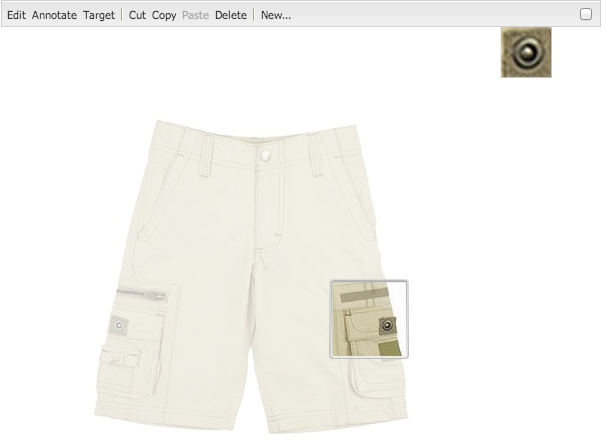

# Aggiunta di funzioni Dynamic Media Classic alla pagina {#adding-scene-features-to-your-page}

[ Adobe Dynamic Media ](https://help.adobe.com/en_US/scene7/using/WS26AB0D9A-F51C-464e-88C8-580A5A82F810.html) Classicis è una soluzione in hosting per la gestione, il miglioramento, la pubblicazione e la distribuzione di risorse multimediali su display e stampe Web, mobili, e-mail e connessi a Internet.

Potete visualizzare AEM risorse pubblicate in Dynamic Media Classic in diversi visualizzatori:

* Zoom
* A comparsa
* Video
* Modello immagini
* Immagine

Potete pubblicare le risorse digitali direttamente da AEM a Dynamic Media Classic e pubblicare le risorse digitali da Dynamic Media Classic a AEM.

Questo documento descrive come pubblicare risorse digitali da AEM a Dynamic Media Classic e viceversa. Sono inoltre descritti nel dettaglio i visualizzatori. Per informazioni sulla configurazione delle AEM per Dynamic Media Classic, consultate [Integrazione di Dynamic Media Classic con AEM](/help/sites-administering/scene7.md).

Consulta anche [Aggiunta di mappe immagine](image-maps.md).

Per ulteriori informazioni sull&#39;utilizzo dei componenti video con AEM, vedere [Video](video.md).

>[!NOTE]
>
>Se le risorse Dynamic Media Classic non vengono visualizzate correttamente, accertatevi che l&#39;elemento multimediale dinamico sia [disabilitato](config-dynamic.md#disabling-dynamic-media), quindi aggiornate la pagina.

## Pubblicazione manuale su Dynamic Media Classic dalle risorse {#manually-publishing-to-scene-from-assets}

Potete pubblicare le risorse digitali su Dynamic Media Classic come segue:

* [Nell’interfaccia utente classica dalla console Risorse](/help/sites-classic-ui-authoring/manage-assets-classic-s7.md#publishing-from-the-assets-console)
* [Nell’interfaccia utente classica da una risorsa](/help/sites-classic-ui-authoring/manage-assets-classic-s7.md#publishing-from-an-asset)
* [Nell’interfaccia utente classica dall’esterno della cartella CQ Target](/help/sites-classic-ui-authoring/manage-assets-classic-s7.md#publishing-assets-from-outside-the-cq-target-folder)

>[!NOTE]
>
>AEM viene pubblicato in modo asincrono su Dynamic Media Classic. Dopo aver fatto clic su **[!UICONTROL Pubblica]**, la pubblicazione della risorsa in Dynamic Media Classic potrebbe richiedere alcuni secondi.

## Componenti Dynamic Media Classic {#scene-components}

I seguenti componenti Dynamic Media Classic sono disponibili in AEM:

* Zoom
* Zoom a comparsa
* Modello immagini
* Immagine
* Video

>[!NOTE]
>
>Questi componenti non sono disponibili per impostazione predefinita e devono essere selezionati in modalità **[!UICONTROL Progettazione]** prima di poter essere utilizzati.

Una volta resi disponibili in modalità **[!UICONTROL Progettazione]**, potete aggiungere i componenti alla pagina come qualsiasi altro componente AEM. Le risorse non ancora pubblicate in Dynamic Media Classic vengono pubblicate in Dynamic Media Classic se si trovano in una cartella sincronizzata o su una pagina o con una configurazione cloud Dynamic Media Classic.

>[!NOTE]
>
>Se create e sviluppate visualizzatori personalizzati e utilizzate Content Finder, dovete aggiungere esplicitamente il parametro **[!UICONTROL allowlscreen]**.

### Avviso sulla fine del ciclo di vita dei visualizzatori Flash {#flash-viewers-end-of-life-notice}

A partire dal 31 gennaio 2017,  Adobe Dynamic Media Classic ha terminato il supporto per la piattaforma di visualizzatore Flash.

Per ulteriori informazioni su questa importante modifica, consulta le [domande frequenti sulla terminazione dei visualizzatori Flash](https://docs.adobe.com/content/docs/en/aem/6-1/administer/integration/marketing-cloud/scene7/flash-eol.html).

### Aggiunta di un componente Dynamic Media Classic (Scene7) a una pagina {#adding-a-scene-component-to-a-page}

L’aggiunta di un componente Dynamic Media Classic (Scene7) a una pagina equivale all’aggiunta di un componente a qualsiasi pagina. I componenti Dynamic Media Classic sono descritti dettagliatamente nelle sezioni seguenti.

**Aggiunta di un componente Dynamic Media Classic (Scene7) a una pagina**

1. In AEM, aprite la pagina in cui desiderate aggiungere il componente Dynamic Media Classic (Scene7).

1. Se non sono disponibili componenti Dynamic Media Classic, fare clic su **[!UICONTROL Modalità Progettazione]**, toccare qualsiasi componente con bordo blu, toccare l&#39;icona **[!UICONTROL Elemento padre]** e quindi l&#39;icona **[!UICONTROL Configurazione]**. In **[!UICONTROL Parsys (Design)]**, selezionare tutti i componenti Dynamic Media Classic per renderli disponibili e fare clic su **[!UICONTROL OK.]**

   

1. Fare clic su **[!UICONTROL Modifica]** per tornare alla modalità **[!UICONTROL Modifica]**.

1. Trascinate un componente dal gruppo Dynamic Media Classic nella barra laterale sulla pagina nella posizione desiderata.

1. Fate clic sull&#39;icona **[!UICONTROL Configuration]** per aprire il componente.

1. Se necessario, modifica il componente, quindi fai clic su **[!UICONTROL OK]** per salvare le modifiche.
1. Trascinate l’immagine o il video dal browser del contenuto al componente Dynamic Media Classic aggiunto alla pagina.

   >[!NOTE]
   >
   >Solo nell’interfaccia touch, è necessario trascinare l’immagine o il video sul componente Dynamic Media Classic inserito nella pagina. La selezione e la modifica del componente Dynamic Media Classic e la scelta della risorsa non sono supportate.

### Aggiunta di esperienze di visualizzazione interattive a un sito reattivo {#adding-interactive-viewing-experiences-to-a-responsive-website}

Una progettazione reattiva per le risorse significa che queste si adattano a seconda di dove vengono visualizzate. Grazie alla progettazione reattivo, le stesse risorse possono essere visualizzate in modo efficace su dispositivi diversi.

Vedere anche [Responsive Design for Web Pages](/help/sites-developing/responsive.md).

**Per aggiungere un&#39;esperienza di visualizzazione interattiva a un sito reattivo**

1. Accedete a AEM e accertatevi di avere [configurato  Adobe Dynamic Media Classic Cloud Services](/help/sites-administering/scene7.md#configuring-scene-integration) e che siano disponibili componenti Dynamic Media Classic.

   >[!NOTE]
   >
   >Se i componenti Dynamic Media Classic non sono disponibili, accertatevi che [vengano attivati in modalità Progettazione](/help/sites-authoring/default-components-designmode.md).

1. In un sito Web con i componenti **[!UICONTROL Dynamic Media Classic]** abilitati, trascinate un componente **[!UICONTROL Image]** sulla pagina.
1. Selezionate il componente e toccate l’icona di configurazione.
1. Nella scheda **[!UICONTROL Dynamic Media Classic Settings]**, regolare i punti di interruzione.

   

1. Verifica che i visualizzatori si ridimensionino in modo reattivo e che tutte le interazioni siano ottimizzate per desktop, tablet e dispositivi mobili.

### Impostazioni comuni a tutti i componenti Dynamic Media Classic {#settings-common-to-all-scene-components}

Anche se le opzioni di configurazione variano, quanto segue è comune a tutti i componenti [!UICONTROL Dynamic Media Classic]:

* **[!UICONTROL Riferimento]**  file - Individuare il file a cui si desidera fare riferimento. Il riferimento al file mostra l’URL della risorsa e non necessariamente l’URL completo di Dynamic Media Classic, inclusi i comandi e i parametri dell’URL. In questo campo non è possibile aggiungere parametri e comandi URL Dynamic Media Classic. che devono essere aggiunti attraverso la funzionalità corrispondente nel componente.
* **[!UICONTROL Larghezza]** : consente di impostare la larghezza.
* **[!UICONTROL Altezza]** : consente di impostare l&#39;altezza.

Per impostare queste opzioni di configurazione, aprire (doppio clic) un componente Dynamic Media Classic, ad esempio, quando si apre un componente **[!UICONTROL Zoom]**:

### Zoom {#zoom}

Il componente Zoom HTML5 visualizza un’immagine più grande quando si preme il pulsante **[!UICONTROL +]**.

La risorsa dispone di strumenti di zoom nella parte inferiore. Toccate **[!UICONTROL +]** per ingrandire. Toccate **[!UICONTROL -]** per ridurre. Toccando la **[!UICONTROL x]** o la freccia di ripristino dello zoom l&#39;immagine torna alle dimensioni originali con cui è stata importata. Toccate le frecce diagonali per visualizzarle a schermo intero. Toccate **[!UICONTROL Modifica]** per configurare il componente. Con questo componente, potete configurare le [impostazioni comuni a tutti i componenti [!UICONTROL Dynamic Media Classic]](#settings-common-to-all-scene-components).

### A comparsa {#flyout}

Nel componente HTML5 **[!UICONTROL Flyout]**, la risorsa viene visualizzata come schermata divisa; ha lasciato la risorsa nella dimensione specificata; a destra viene visualizzata la parte di zoom. Toccate **[!UICONTROL Modifica]** per configurare il componente. Con questo componente, potete configurare le [impostazioni comuni a tutti i componenti Dynamic Media Classic](#settings-common-to-all-scene-components).

>[!NOTE]
>
>Se il componente **[!UICONTROL Flyout]** utilizza una dimensione personalizzata, tale dimensione personalizzata viene utilizzata e la configurazione reattiva del componente viene disattivata.
>
>Se il componente **[!UICONTROL Flyout]** utilizza le dimensioni predefinite, come impostato in **[!UICONTROL Visualizzazione struttura]**, vengono utilizzate le dimensioni predefinite e il componente si estende per adattarsi alle dimensioni del layout di pagina con l&#39;impostazione reattiva del componente abilitato. Tuttavia, tenete presente che esiste un limite alla configurazione reattiva del componente. Quando si utilizza il componente **[!UICONTROL Flyout]** con configurazione reattiva, non è consigliabile utilizzarlo con l&#39;estensione completa della pagina. In caso contrario, il **[!UICONTROL Flyout]** può estendersi oltre il bordo destro della pagina.

### Immagine {#image}

Il componente Dynamic Media Classic **[!UICONTROL Image]** consente di aggiungere alle immagini funzionalità Dynamic Media Classic, ad esempio modificatori Dynamic Media Classic, predefiniti per immagini o visualizzatori e nitidezza. Il componente Dynamic Media Classic **[!UICONTROL Image]** è simile ad altri componenti immagine in AEM con la speciale funzionalità Dynamic Media Classic. In questo esempio, all&#39;immagine è applicato il modificatore URL per elementi multimediali dinamici, `&op_invert=1`.

**[!UICONTROL Titolo, Testo]**  Alt - Nella scheda  **** Avanzate, aggiungete un titolo all’immagine e testo alternativo per gli utenti che hanno disattivato la grafica.

**[!UICONTROL URL, Apri in]**  - Puoi impostare una risorsa da cui aprire un collegamento. Imposta l’**[!UICONTROL URL]** e in **[!UICONTROL Apri in]** indica se desideri aprirlo nella stessa finestra o in una nuova finestra.

**[!UICONTROL Predefinito]**  visualizzatore - Selezionate un predefinito esistente dal menu a discesa. Se il predefinito per visualizzatori che cerchi non è visibile, potrebbe essere necessario renderlo visibile. Consulta [Gestione dei predefiniti per visualizzatori](/help/assets/managing-viewer-presets.md). Non è possibile selezionare un predefinito per visualizzatori se si utilizza un predefinito per immagini, e viceversa.

**[!UICONTROL Configurazione]**  Dynamic Media Classic - Selezionate la configurazione Dynamic Media Classic da usare per recuperare i predefiniti per immagini attivi da SPS.

**[!UICONTROL Predefinito]**  immagine - Selezionate un predefinito per immagini esistente dal menu a discesa. Se il predefinito per immagini che cerchi non è visibile, potrebbe essere necessario renderlo visibile. Consulta [Gestione dei predefiniti per immagini](/help/assets/managing-image-presets.md). Non è possibile selezionare un predefinito per visualizzatori se si utilizza un predefinito per immagini, e viceversa.

**[!UICONTROL Formato]**  di output - Selezionare il formato di output dell&#39;immagine, ad esempio jpeg. A seconda del formato di output selezionato, è possibile che siano disponibili ulteriori opzioni di configurazione. Consulta [Best practice sui predefiniti per immagini](/help/assets/managing-image-presets.md#image-preset-options).

**[!UICONTROL Nitidezza]**  - Selezionate la modalità di nitidezza dell’immagine. La regolazione della nitidezza è descritta in dettaglio in [Best practice sui predefiniti per immagini](/help/assets/managing-image-presets.md#image-preset-options) e [Best practice sulla nitidezza](/help/assets/assets/s7_sharpening_images.pdf).

**[!UICONTROL Modificatori]**  URL: potete modificare gli effetti immagine fornendo ulteriori comandi immagine Dynamic Media Classic. Tali situazioni vengono descritte in [Predefiniti per immagini](/help/assets/managing-image-presets.md) e nella [Guida ai comandi](https://docs.adobe.com/content/help/en/dynamic-media-developer-resources/image-serving-api/image-serving-api/http-protocol-reference/command-reference/c-command-reference.html).

**[!UICONTROL Punti di interruzione]**  - Se il sito Web è reattivo, è necessario regolare i punti di interruzione. I punti di interruzione devono essere separati da virgole ( , ).

### Modello immagini {#image-template}

[I ](https://docs.adobe.com/help/en/dynamic-media-classic/using/template-basics/quick-start-template-basics.html) modelli di immagini Dynamic Media Classic sono contenuti Photoshop con più livelli importati in Dynamic Media Classic, con contenuti e proprietà parametrizzati per la variabilità. Il componente **[!UICONTROL Modello immagini]** consente di importare immagini e modificare il testo in modo dinamico in AEM. Inoltre, è possibile configurare il componente **[!UICONTROL Modello immagini]** in modo che utilizzi valori contestuali ClientContext, affinché ogni utente possa avere un’esperienza personalizzata dell’immagine.

Toccate **[!UICONTROL Modifica]** per configurare il componente. Potete configurare le impostazioni [comuni a tutti i componenti Dynamic Media Classic](#settings-common-to-all-scene-components), nonché altre impostazioni descritte in questa sezione.

**[!UICONTROL Riferimento file, Larghezza, Altezza]**  - Consultate le impostazioni comuni a tutti i componenti di ScDynamic Media Classic7.

>[!NOTE]
>
>I comandi e i parametri dell’URL di Dynamic Media Classic non possono essere aggiunti direttamente all’URL di riferimento del file. Possono essere definiti solo nell’interfaccia utente del componente del pannello **[!UICONTROL Parametri]**.

**[!UICONTROL Titolo, Testo]**  Alt - Nella scheda Modello immagine per elemento multimediale dinamico classico, aggiungere un titolo all’immagine e testo alternativo per gli utenti che hanno disattivato la grafica.

**[!UICONTROL URL, Apri in]**  - Puoi impostare una risorsa da cui aprire un collegamento. Imposta l’URL e in Apri in indica se desideri aprirlo nella stessa finestra o in una nuova finestra.

**[!UICONTROL Pannello]**  parametri - Quando importate un’immagine, i parametri vengono precompilati con le informazioni dell’immagine. Se non vi sono contenuti modificabili dinamicamente, questa finestra è vuota.

#### Modifica dinamica del testo {#changing-text-dynamically}

Per modificare il testo in modo dinamico, immetti un nuovo testo nei campi e fai clic su **[!UICONTROL OK.]** In questo esempio, il **[!UICONTROL Prezzo]** è ora di $50 e la spedizione è di 99 centesimi.

Il testo nell’immagine cambia. Per ripristinare il testo sul valore originale, toccate **[!UICONTROL Reimposta]** accanto al campo.

#### Modifica del testo in base a un valore personalizzato ClientContext {#changing-text-to-reflect-the-value-of-a-client-context-value}

Per collegare un campo a un valore di contesto client, toccate **[!UICONTROL Seleziona]** per aprire il menu di scelta rapida del client, selezionate il contesto client e toccate **[!UICONTROL OK.]** In questo esempio, il nome cambia perché è collegato al nome formattato nel profilo.

Il testo si aggiorna con il nome dell’utente attualmente connesso. Per ripristinare il testo al valore originale, fai clic su **[!UICONTROL Ripristina]** accanto al campo.

#### Come impostare il modello di immagine per elementi multimediali dinamici come collegamento {#making-the-scene-image-template-a-link}

1. Sulla pagina con il componente Dynamic Media Classic **[!UICONTROL Modello immagine]**, toccare **[!UICONTROL Modifica.]**
1. Nel campo **[!UICONTROL URL]**, immettete l&#39;URL a cui gli utenti accedono quando l&#39;immagine viene toccata. Nel campo **[!UICONTROL Apri in]**, selezionare se si desidera aprire la destinazione (una nuova finestra o una stessa finestra).

   

1. Toccare **[!UICONTROL OK.]**

### Componente video {#video-component}

Il componente Dynamic Media Classic **[!UICONTROL Video]** (disponibile dalla sezione Dynamic Media Classic della barra laterale) utilizza il rilevamento della periferica e della larghezza di banda per distribuire il video corretto a ogni schermo. Questo componente è un lettore video HTML5; è un singolo visualizzatore che può essere usato su più canali.

Può essere usato per set video adattivi, un singolo video MP4 o un singolo video F4V.

Per ulteriori informazioni sul funzionamento dei video con l&#39;integrazione di Dynamic Media Classic, consultate [Video](s7-video.md). Inoltre, vedete [il componente Video Dynamic Media Classic rispetto al componente Video Foundation](s7-video.md).

### Limitazioni note per il componente video {#known-limitations-for-the-video-component}

 Adobe DAM e WCM mostra se viene caricato un video sorgente principale. Non mostrano queste risorse proxy:

* Rappresentazioni codificate Dynamic Media Classic
* Set video adattivi Dynamic Media Classic

Quando usate un set video adattivo con il componente video Dynamic Media Classic, dovete ridimensionare il componente per adattarlo alle dimensioni del video.

## Browser contenuti Dynamic Media Classic {#scene-content-browser}

Il browser Contenuti di Dynamic Media Classic consente di visualizzare i contenuti di Dynamic Media Classic direttamente in AEM. Per accedere al browser dei contenuti, nell&#39; **[!UICONTROL Content Finder]**, selezionate **[!UICONTROL Dynamic Media Classic]** nell&#39;interfaccia utente ottimizzata per il tocco o nell&#39;icona **[!UICONTROL S7]** nell&#39;interfaccia utente classica. La funzionalità è identica nelle due interfacce utente.

Se si dispone di più configurazioni, per impostazione predefinita AEM visualizza la [configurazione predefinita](/help/sites-administering/scene7.md#configuring-a-default-configuration). Puoi selezionare diverse configurazioni direttamente nel browser Contenuti di Dynamic Media Classic nel menu a discesa.

>[!NOTE]
>
>* Le risorse che si trovano nella cartella ad hoc non verranno visualizzate nel browser del contenuto di Dynamic Media Classic.
>* Quando [Anteprima protetta è abilitata](/help/sites-administering/scene7.md#configuring-the-state-published-unpublished-of-assets-pushed-to-scene), le risorse pubblicate e non pubblicate su Dynamic Media Classic vengono visualizzate nel browser dei contenuti di Dynamic Media Classic.
>* Se nel browser dei contenuti non è disponibile l&#39;icona **[!UICONTROL Dynamic Media Classic]** o **[!UICONTROL S7]** come opzione, è necessario [configurare Dynamic Media Classic in modo che funzioni con AEM](/help/sites-administering/scene7.md).
>* Per i video, il browser di contenuti Dynamic Media Classic supporta:

   >
   >   
   * Set di video adattivo: contenitore di tutte le rappresentazioni video necessarie per consentirne la riproduzione su diversi tipi di schermi
   >   * Video MP4 singolo
   >   * Video F4V singolo

### Esplorazione di contenuti nell&#39;interfaccia touch {#browsing-content-in-the-touch-optimized-ui}

Potete accedere al browser del contenuto nell’interfaccia touch o classica. Al momento l’interfaccia touch presenta i seguenti limiti:

* Le risorse FXG e Flash da Dynamic Media Classic non sono supportate.

Per sfogliare le risorse Dynamic Media Classic, selezionate **[!UICONTROL Dynamic Media Classic]** dal terzo menu a discesa. Dynamic Media Classic non viene visualizzato nell&#39;elenco se non è stata configurata l&#39;integrazione Dynamic Media Classic/AEM.

>[!NOTE]
>
>* Il browser Contenuti di Dynamic Media Classic carica circa 100 risorse e le ordina per nome.
>* Se è impostato un server di anteprima protetto, il browser utilizzerà tale server di anteprima per eseguire il rendering delle miniature e delle risorse.

>

Inoltre, potete sfogliare le informazioni sulla risoluzione, le dimensioni, i giorni successivi alla modifica e il nome del file passando il puntatore del mouse sulla risorsa nel browser.

* Per i set video adattivi e i modelli, per le miniature non vengono generate informazioni sulle dimensioni.
* Per i set video adattivi, non viene generata alcuna risoluzione per le miniature.

### Ricerca di risorse Dynamic Media Classic con il browser dei contenuti {#searching-for-scene-assets-with-the-content-browser}

La ricerca di risorse Dynamic Media Classic è simile alla ricerca AEM risorse, ma quando effettuate una ricerca viene visualizzata una visualizzazione remota delle risorse nel sistema Dynamic Media Classic, anziché importarle direttamente in AEM.

Per visualizzare e cercare le risorse è possibile utilizzare l’interfaccia touch o classica. A seconda dell’interfaccia, la modalità di ricerca è leggermente diversa.

Durante la ricerca in una qualsiasi delle interfacce utente, è possibile filtrare in base ai seguenti criteri (mostrati qui nell’interfaccia touch):

**[!UICONTROL Inserite le parole chiave]** : potete cercare le risorse per nome. Durante la ricerca, immetti le parole chiave con cui inizia il nome del file. Ad esempio, se digiti la parola “nuoto” verranno cercati i nomi dei file delle risorse che iniziano con queste lettere, in questo ordine. Toccate Invio dopo aver digitato il termine per trovare la risorsa.

**[!UICONTROL Cartella/percorso]** : il nome della cartella visualizzata si basa sulla configurazione selezionata. Per approfondire i livelli inferiori, toccate l’icona della cartella e selezionate una sottocartella, quindi toccate il segno di spunta per selezionarla.

Se si immette una parola chiave e si seleziona una cartella, AEM esegue la ricerca in tale cartella e in tutte le relative sottocartelle. Tuttavia, se non si immettono parole chiave durante la ricerca, la selezione della cartella mostrerà solo le risorse in quella cartella, senza includere le sottocartelle.

Per impostazione predefinita, AEM cerca nella cartella selezionata e in tutte le sue sottocartelle.

**[!UICONTROL Tipo di risorsa]** : selezionate  **[!UICONTROL Dynamic Media]** Classic per sfogliare il contenuto Dynamic Media Classic. Questa opzione è disponibile solo se è stato configurato Dynamic Media Classic.

**[!UICONTROL Configurazione]** : se hai più di una configurazione Dynamic Media Classic definita in  [!UICONTROL Cloud Services], puoi selezionarla qui. Di conseguenza, la cartella cambierà in base alla configurazione scelta.

**[!UICONTROL Tipo]**  di risorsa - Nel browser Dynamic Media Classic potete filtrare i risultati in modo da includere: immagini, modelli, video e set video adattivi. Se non si seleziona alcun tipo di risorsa, per impostazione predefinita AEM ricerca tutti i tipi di risorsa.

>[!NOTE]
>
>* Nell’interfaccia classica, è anche possibile cercare **Flash** e **FXG**. Al momento questi non sono disponibili come filtro di ricerca nell’interfaccia touch.
   >
   >
* Durante la ricerca di video, si cerca una singola rappresentazione. I risultati restituiscono la rappresentazione originale (solo &amp;ast;.mp4) e la rappresentazione codificata.
>* Quando eseguite una ricerca in un set video adattivo, dovete cercare nella cartella e in tutte le sottocartelle, ma solo se avete aggiunto una parola chiave alla ricerca. Se non hai aggiunto una parola chiave, AEM non cerca nelle sottocartelle.

>

**[!UICONTROL Stato]**  pubblicazione: potete filtrare le risorse in base allo stato di pubblicazione:  **[!UICONTROL Non]** pubblicato o  **[!UICONTROL pubblicato.]** Se non selezionate Stato **** pubblicazione, AEM per impostazione predefinita esegue la ricerca in tutti gli stati di pubblicazione.

