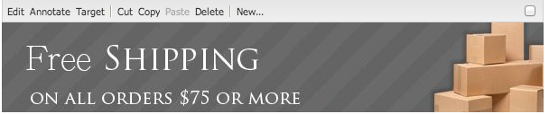

# Aggiunta di funzionalità di Dynamic Media Classic alla pagina {#adding-scene-features-to-your-page}

[Adobe Dynamic Media ](https://help.adobe.com/en_US/scene7/using/WS26AB0D9A-F51C-464e-88C8-580A5A82F810.html) Classic è una soluzione in hosting per la gestione, l’ottimizzazione, la pubblicazione e la distribuzione di risorse multimediali sul web, su dispositivi mobili, e-mail, schermi collegati a Internet e la stampa.

Puoi visualizzare AEM risorse pubblicate in Dynamic Media Classic in diversi visualizzatori:

* Zoom
* A comparsa
* Video
* Modello immagini
* Immagine

Puoi pubblicare risorse digitali direttamente da AEM a Dynamic Media Classic e le risorse digitali da Dynamic Media Classic a AEM.

Questo documento descrive come pubblicare risorse digitali da AEM a Dynamic Media Classic e viceversa. Sono inoltre descritti nel dettaglio i visualizzatori. Per informazioni sulla configurazione di AEM per Dynamic Media Classic, consulta [Integrazione di Dynamic Media Classic con AEM](/help/sites-administering/scene7.md).

Consulta anche [Aggiunta di mappe immagine](image-maps.md).

Per ulteriori informazioni sull&#39;utilizzo dei componenti video con AEM, consulta [Video](video.md).

>[!NOTE]
>
>Se le risorse Dynamic Media Classic non vengono visualizzate correttamente, verifica che gli elementi multimediali dinamici siano [disabilitati](config-dynamic.md#disabling-dynamic-media) e aggiorna la pagina.

## Pubblicazione manuale in Dynamic Media Classic dalle risorse {#manually-publishing-to-scene-from-assets}

Puoi pubblicare risorse digitali in Dynamic Media Classic come segue:

* [Nell’interfaccia utente classica dalla console Assets](/help/sites-classic-ui-authoring/manage-assets-classic-s7.md#publishing-from-the-assets-console)
* [Nell’interfaccia utente classica da una risorsa](/help/sites-classic-ui-authoring/manage-assets-classic-s7.md#publishing-from-an-asset)
* [Nell’interfaccia utente classica dall’esterno della cartella di CQ Target](/help/sites-classic-ui-authoring/manage-assets-classic-s7.md#publishing-assets-from-outside-the-cq-target-folder)

>[!NOTE]
>
>AEM pubblicato in Dynamic Media Classic in modo asincrono. Dopo aver fatto clic su **[!UICONTROL Pubblica]**, la pubblicazione della risorsa in Dynamic Media Classic potrebbe richiedere alcuni secondi.

## Componenti Dynamic Media Classic {#scene-components}

I seguenti componenti di Dynamic Media Classic sono disponibili in AEM:

* Zoom
* Zoom a comparsa
* Modello immagini
* Immagine
* Video

>[!NOTE]
>
>Questi componenti non sono disponibili per impostazione predefinita e devono essere selezionati in modalità **[!UICONTROL Progettazione]** prima di utilizzare.

Una volta resi disponibili in modalità **[!UICONTROL Progettazione]**, puoi aggiungere i componenti alla pagina come qualsiasi altro componente AEM. Le risorse non ancora pubblicate in Dynamic Media Classic vengono pubblicate in Dynamic Media Classic se si trovano in una cartella sincronizzata, in una pagina o con una configurazione cloud di Dynamic Media Classic.

>[!NOTE]
>
>Se stai creando e sviluppando visualizzatori personalizzati e utilizzi Content Finder, devi aggiungere esplicitamente il parametro **[!UICONTROL allowfullscreen]** .

### Avviso sulla fine del ciclo di vita dei visualizzatori Flash {#flash-viewers-end-of-life-notice}

A partire dal 31 gennaio 2017, Adobe Dynamic Media Classic ha terminato il supporto per la piattaforma di visualizzatori di Flash.

Per ulteriori informazioni su questa importante modifica, consulta le [domande frequenti sulla terminazione dei visualizzatori Flash](https://docs.adobe.com/content/docs/en/aem/6-1/administer/integration/marketing-cloud/scene7/flash-eol.html).

### Aggiunta di un componente Dynamic Media Classic (Scene7) a una pagina {#adding-a-scene-component-to-a-page}

L’aggiunta di un componente Dynamic Media Classic (Scene7) a una pagina equivale all’aggiunta di un componente a qualsiasi pagina. I componenti di Dynamic Media Classic sono descritti in dettaglio nelle sezioni seguenti.

**Aggiunta di un componente Dynamic Media Classic (Scene7) a una pagina**

1. In AEM, apri la pagina in cui desideri aggiungere il componente Dynamic Media Classic (Scene7).

1. Se non sono disponibili componenti di Dynamic Media Classic, fai clic su **[!UICONTROL Modalità Progettazione]**, tocca un componente con bordo blu, tocca l&#39;icona **[!UICONTROL Elemento padre]** e quindi l&#39;icona **[!UICONTROL Configurazione]**. In **[!UICONTROL Parsys (Design)]**, seleziona tutti i componenti di Dynamic Media Classic per renderli disponibili e fai clic su **[!UICONTROL OK]**.

   

1. Fai clic su **[!UICONTROL Modifica]** per tornare alla modalità **[!UICONTROL Modifica]**.

1. Trascina un componente dal gruppo Dynamic Media Classic nella barra laterale sulla pagina nella posizione desiderata.

1. Fai clic sull&#39;icona **[!UICONTROL Configurazione]** per aprire il componente.

1. Se necessario, modifica il componente, quindi fai clic su **[!UICONTROL OK]** per salvare le modifiche.
1. Trascina l’immagine o il video dal browser del contenuto sul componente Dynamic Media Classic aggiunto alla pagina.

   >[!NOTE]
   >
   >Solo nell’interfaccia touch, devi trascinare l’immagine o il video sul componente Dynamic Media Classic inserito nella pagina. La selezione e la modifica del componente Dynamic Media Classic e quindi la scelta della risorsa non sono supportate.

### Aggiunta di esperienze di visualizzazione interattive a un sito reattivo {#adding-interactive-viewing-experiences-to-a-responsive-website}

Una progettazione reattiva per le risorse significa che queste si adattano a seconda di dove vengono visualizzate. Grazie alla progettazione reattivo, le stesse risorse possono essere visualizzate in modo efficace su dispositivi diversi.

Vedere anche [Progettazione reattiva per pagine web](/help/sites-developing/responsive.md).

**Per aggiungere un’esperienza di visualizzazione interattiva a un sito reattivo**

1. Accedi a AEM e assicurati di aver [configurato i Cloud Services Dynamic Media Classic](/help/sites-administering/scene7.md#configuring-scene-integration) e che i componenti Dynamic Media Classic siano disponibili.

   >[!NOTE]
   >
   >Se i componenti di Dynamic Media Classic non sono disponibili, assicurati di [abilitarli in modalità Progettazione](/help/sites-authoring/default-components-designmode.md).

1. In un sito web con i componenti **[!UICONTROL Dynamic Media Classic]** abilitati, trascina un componente **[!UICONTROL Immagine]** sulla pagina.
1. Seleziona il componente e tocca l’icona di configurazione.
1. Nella scheda **[!UICONTROL Impostazioni di Dynamic Media Classic]**, regola i punti di interruzione.

   

1. Verifica che i visualizzatori si ridimensionino in modo reattivo e che tutte le interazioni siano ottimizzate per desktop, tablet e dispositivi mobili.

### Impostazioni comuni a tutti i componenti di Dynamic Media Classic {#settings-common-to-all-scene-components}

Anche se le opzioni di configurazione variano, quanto segue è comune a tutti i componenti [!UICONTROL Dynamic Media Classic]:

* **[!UICONTROL File di riferimento]** : consente di individuare il file a cui si desidera fare riferimento. Il riferimento al file mostra l’URL della risorsa e non necessariamente l’URL completo di Dynamic Media Classic, inclusi i comandi e i parametri URL. Non è possibile aggiungere comandi e parametri URL di Dynamic Media Classic in questo campo. che devono essere aggiunti attraverso la funzionalità corrispondente nel componente.
* **[!UICONTROL Larghezza]** : consente di impostare la larghezza.
* **[!UICONTROL Altezza]** : consente di impostare l’altezza.

Per impostare queste opzioni di configurazione, apri (fai doppio clic) un componente Dynamic Media Classic, ad esempio, quando apri un componente **[!UICONTROL Zoom]** :

### Zoom {#zoom}

Il componente Zoom HTML5 visualizza un’immagine più grande quando si preme il pulsante **[!UICONTROL +]** .

La risorsa dispone di strumenti di zoom nella parte inferiore. Tocca **[!UICONTROL +]** per ingrandire. Tocca **[!UICONTROL -]** per ridurre. Quando si tocca **[!UICONTROL x]** o la freccia di reimpostazione dello zoom, l&#39;immagine torna alle dimensioni originali in cui era stata importata. Toccare le frecce diagonali per visualizzarle a schermo intero. Tocca **[!UICONTROL Modifica]** per configurare il componente. Con questo componente, puoi configurare le impostazioni [comuni a tutti i componenti [!UICONTROL Dynamic Media Classic]](#settings-common-to-all-scene-components).

### A comparsa {#flyout}

Nel componente HTML5 **[!UICONTROL A comparsa]**, la risorsa viene visualizzata come schermata divisa; ha lasciato la risorsa nella dimensione specificata; a destra viene visualizzata la parte dello zoom. Tocca **[!UICONTROL Modifica]** per configurare il componente. Con questo componente, puoi configurare le impostazioni [comuni a tutti i componenti di Dynamic Media Classic](#settings-common-to-all-scene-components).

>[!NOTE]
>
>Se il componente **[!UICONTROL A comparsa]** utilizza una dimensione personalizzata, questa viene utilizzata e la configurazione reattiva del componente viene disabilitata.
>
>Se il componente **[!UICONTROL A comparsa]** utilizza le dimensioni predefinite, come impostato in **[!UICONTROL Visualizzazione struttura]**, viene utilizzata la dimensione predefinita e il componente si estende per adattarsi alle dimensioni del layout di pagina con la configurazione reattiva del componente abilitata. Tieni presente, tuttavia, che esiste un limite alla configurazione reattiva del componente. Quando utilizzi il componente **[!UICONTROL A comparsa]** con configurazione reattiva, non utilizzarlo con dilatazione pagina completa. In caso contrario, il percorso **[!UICONTROL A comparsa]** può estendersi oltre il bordo destro della pagina.

### Immagine {#image}

Il componente Dynamic Media Classic **[!UICONTROL Immagine]** consente di aggiungere funzionalità di Dynamic Media Classic alle immagini, ad esempio modificatori Dynamic Media Classic, predefiniti per immagini o visualizzatori e nitidezza. Il componente Dynamic Media Classic **[!UICONTROL Immagine]** è simile ad altri componenti immagine in AEM con funzionalità Dynamic Media Classic speciali. In questo esempio, all’immagine è applicato il modificatore URL Dynamic Media Classic `&op_invert=1` .

**[!UICONTROL Titolo, Testo Alt]**  - Nella scheda  **** Avanzate , aggiungi un titolo all’immagine e un testo Alt per gli utenti che hanno disattivato la grafica.

**[!UICONTROL URL, Apri in]** : puoi impostare una risorsa da per aprire un collegamento. Imposta l’**[!UICONTROL URL]** e in **[!UICONTROL Apri in]** indica se desideri aprirlo nella stessa finestra o in una nuova finestra.

**[!UICONTROL Predefinito visualizzatore]** : seleziona un predefinito visualizzatore esistente dal menu a discesa. Se il predefinito per visualizzatori che cerchi non è visibile, potrebbe essere necessario renderlo visibile. Consulta [Gestione dei predefiniti per visualizzatori](/help/assets/managing-viewer-presets.md). Non è possibile selezionare un predefinito per visualizzatori se si utilizza un predefinito per immagini, e viceversa.

**[!UICONTROL Configurazione Dynamic Media Classic]**  - Seleziona la configurazione Dynamic Media Classic da utilizzare per recuperare i predefiniti immagine attivi da SPS.

**[!UICONTROL Preimpostazione immagine]** : seleziona un predefinito immagine esistente dal menu a discesa. Se il predefinito per immagini che cerchi non è visibile, potrebbe essere necessario renderlo visibile. Consulta [Gestione dei predefiniti per immagini](/help/assets/managing-image-presets.md). Non è possibile selezionare un predefinito per visualizzatori se si utilizza un predefinito per immagini, e viceversa.

**[!UICONTROL Formato di output]**  - Seleziona il formato di output dell&#39;immagine, ad esempio jpeg. A seconda del formato di output selezionato, è possibile che siano disponibili ulteriori opzioni di configurazione. Consulta [Best practice sui predefiniti per immagini](/help/assets/managing-image-presets.md#image-preset-options).

**[!UICONTROL Nitidezza]** : seleziona la modalità di nitidezza dell’immagine. La regolazione della nitidezza è descritta in dettaglio in [Best practice sui predefiniti per immagini](/help/assets/managing-image-presets.md#image-preset-options) e [Best practice sulla nitidezza](/help/assets/assets/sharpening_images.pdf).

**[!UICONTROL Modificatori URL]** : è possibile modificare gli effetti immagine fornendo ulteriori comandi immagine di Dynamic Media Classic. Tali situazioni vengono descritte in [Predefiniti per immagini](/help/assets/managing-image-presets.md) e nella [Guida ai comandi](https://experienceleague.adobe.com/docs/dynamic-media-developer-resources/image-serving-api/image-serving-api/http-protocol-reference/command-reference/c-command-reference.html).

**[!UICONTROL Punti di interruzione]**  - Se il sito web è reattivo, è necessario regolare i punti di interruzione. I punti di interruzione devono essere separati da virgole ( , ).

### Modello immagini {#image-template}

[I ](https://docs.adobe.com/help/en/dynamic-media-classic/using/template-basics/quick-start-template-basics.html) modelli di immagini Dynamic Media Classic sono contenuti Photoshop a più livelli importati in Dynamic Media Classic, dove il contenuto e le proprietà sono stati parametrizzati per la variabilità. Il componente **[!UICONTROL Modello immagini]** consente di importare immagini e modificare il testo in modo dinamico in AEM. Inoltre, è possibile configurare il componente **[!UICONTROL Modello immagini]** in modo che utilizzi valori contestuali ClientContext, affinché ogni utente possa avere un’esperienza personalizzata dell’immagine.

Tocca **[!UICONTROL Modifica]** per configurare il componente. Puoi configurare le impostazioni [comuni a tutti i componenti di Dynamic Media Classic](#settings-common-to-all-scene-components) e ad altre impostazioni descritte in questa sezione.

**[!UICONTROL Riferimento file, Larghezza, Altezza]**  - Vedi le impostazioni comuni a tutti i componenti ScDynamic Media Classic7.

>[!NOTE]
>
>I comandi e i parametri dell’URL di Dynamic Media Classic non possono essere aggiunti direttamente all’URL di riferimento del file. Possono essere definiti solo nell’interfaccia utente del componente del pannello **[!UICONTROL Parametri]**.

**[!UICONTROL Titolo, Testo Alt]** : nella scheda Modello immagini di Dynamic Media Classic aggiungete un titolo all’immagine e un testo Alt per gli utenti che hanno disattivato la grafica.

**[!UICONTROL URL, Apri in]** : puoi impostare una risorsa da per aprire un collegamento. Imposta l’URL e in Apri in indica se desideri aprirlo nella stessa finestra o in una nuova finestra.

**[!UICONTROL Pannello parametri]** : quando si importa un’immagine, i parametri vengono precompilati con le informazioni dell’immagine. Se non vi sono contenuti modificabili dinamicamente, questa finestra è vuota.

#### Modifica dinamica del testo {#changing-text-dynamically}

Per modificare il testo in modo dinamico, immetti un nuovo testo nei campi e fai clic su **[!UICONTROL OK]**. In questo esempio, il **[!UICONTROL Prezzo]** è ora di $50 e la spedizione è di 99 centesimi.

Il testo nell’immagine cambia. Per ripristinare il testo al valore originale, tocca **[!UICONTROL Ripristina]** accanto al campo .

#### Modifica del testo in base a un valore personalizzato ClientContext {#changing-text-to-reflect-the-value-of-a-client-context-value}

Per collegare un campo a un valore di contesto client, tocca **[!UICONTROL Seleziona]** per aprire il menu di scelta rapida, seleziona il contesto client e tocca **[!UICONTROL OK]**. In questo esempio, il nome cambia perché è collegato al nome formattato nel profilo.

Il testo si aggiorna con il nome dell’utente attualmente connesso. Per ripristinare il testo al valore originale, fai clic su **[!UICONTROL Ripristina]** accanto al campo.

#### Come rendere il modello di immagine Dynamic Media Classic un collegamento {#making-the-scene-image-template-a-link}

1. Nella pagina con il componente Dynamic Media Classic **[!UICONTROL Modello immagini]**, tocca **[!UICONTROL Modifica]**.
1. Nel campo **[!UICONTROL URL]** , immetti l’URL a cui gli utenti indirizzano quando l’immagine viene toccata. Nel campo **[!UICONTROL Apri in]** , seleziona se desideri aprire la destinazione (una nuova finestra o una stessa finestra).

   

1. Toccare **[!UICONTROL OK]**.

### Componente video {#video-component}

Il componente Dynamic Media Classic **[!UICONTROL Video]** (disponibile dalla sezione Dynamic Media Classic della barra laterale) utilizza il rilevamento del dispositivo e della larghezza di banda per distribuire il video giusto a ogni schermata. Questo componente è un lettore video HTML5; è un singolo visualizzatore che può essere usato su più canali.

Può essere utilizzato per set video adattivi, per un singolo video MP4 o per un singolo video F4V.

Per ulteriori informazioni sul funzionamento dei video con l’integrazione Dynamic Media Classic, consulta [Video](s7-video.md) . Inoltre, vedi [il componente Video di Dynamic Media Classic rispetto al componente Video di base](s7-video.md).

### Limitazioni note per il componente video {#known-limitations-for-the-video-component}

Adobe DAM e WCM mostra se viene caricato un video sorgente principale. Non mostrano queste risorse proxy:

* Rendering codificati in Dynamic Media Classic
* Set video adattivi Dynamic Media Classic

Quando utilizzi un set di video adattivo con il componente video Dynamic Media Classic, devi ridimensionare il componente per adattarlo alle dimensioni del video.

## Browser dei contenuti di Dynamic Media Classic {#scene-content-browser}

Il browser dei contenuti di Dynamic Media Classic consente di visualizzare il contenuto da Dynamic Media Classic direttamente in AEM. Per accedere al browser dei contenuti, nell’ **[!UICONTROL Content Finder]**, seleziona **[!UICONTROL Dynamic Media Classic]** nell’interfaccia utente touch o l’icona **[!UICONTROL S7]** nell’interfaccia utente classica. La funzionalità è identica nelle due interfacce utente.

Se si dispone di più configurazioni, per impostazione predefinita AEM visualizza la [configurazione predefinita](/help/sites-administering/scene7.md#configuring-a-default-configuration). Puoi selezionare diverse configurazioni direttamente nel browser dei contenuti di Dynamic Media Classic nel menu a discesa.

>[!NOTE]
>
>* Le risorse che si trovano nella cartella ad-hoc non verranno visualizzate nel browser dei contenuti di Dynamic Media Classic.
>* Quando [Anteprima protetta è abilitato](/help/sites-administering/scene7.md#configuring-the-state-published-unpublished-of-assets-pushed-to-scene), nel browser dei contenuti di Dynamic Media Classic vengono visualizzate sia le risorse pubblicate che quelle non pubblicate in Dynamic Media Classic.
>* Se nel browser dei contenuti non è presente l&#39;opzione **[!UICONTROL Dynamic Media Classic]** o l&#39;icona **[!UICONTROL S7]** , è necessario [configurare Dynamic Media Classic per il funzionamento con AEM](/help/sites-administering/scene7.md).
>* Per i video, il browser dei contenuti di Dynamic Media Classic supporta:

   >
   >   
   * Set di video adattivo: contenitore di tutte le rappresentazioni video necessarie per consentirne la riproduzione su diversi tipi di schermi
   >   * Singolo video MP4
   >   * Singolo video F4V

### Esplorazione dei contenuti nell’interfaccia touch {#browsing-content-in-the-touch-optimized-ui}

È possibile accedere al browser dei contenuti nell’interfaccia touch o classica. Attualmente l’ottimizzazione touch presenta le seguenti limitazioni:

* FXG e risorse di Flash da Dynamic Media Classic non sono supportate.

Sfoglia le risorse di Dynamic Media Classic selezionando **[!UICONTROL Dynamic Media Classic]** dal terzo menu a discesa. Dynamic Media Classic non viene visualizzato nell&#39;elenco se non hai configurato l&#39;integrazione Dynamic Media Classic/AEM.

>[!NOTE]
>
>* Il browser dei contenuti di Dynamic Media Classic carica circa 100 risorse e le ordina per nome.
>* Se hai impostato un server di anteprima sicuro, il browser utilizzerà tale server di anteprima per eseguire il rendering di miniature e risorse.

>

Inoltre, puoi sfogliare le informazioni sulla risoluzione, le dimensioni, i giorni successivi alla modifica e il nome del file passando il cursore sulla risorsa nel browser.

* Per i set video adattivi e i modelli, non vengono generate informazioni sulle dimensioni per le miniature.
* Per i set video adattivi, non viene generata alcuna risoluzione per le miniature.

### Ricerca di risorse Dynamic Media Classic con il browser dei contenuti {#searching-for-scene-assets-with-the-content-browser}

La ricerca delle risorse di Dynamic Media Classic è simile alla ricerca AEM risorse, ma quando esegui una ricerca viene visualizzata una visualizzazione remota delle risorse nel sistema Dynamic Media Classic, anziché importarle direttamente in AEM.

Per visualizzare e cercare le risorse è possibile utilizzare l’interfaccia touch o classica. A seconda dell’interfaccia, la modalità di ricerca è leggermente diversa.

Durante la ricerca in una qualsiasi delle interfacce utente, è possibile filtrare in base ai seguenti criteri (mostrati qui nell’interfaccia touch):

**[!UICONTROL Immetti le parole chiave]** : puoi cercare le risorse per nome. Durante la ricerca, immetti le parole chiave con cui inizia il nome del file. Ad esempio, se digiti la parola “nuoto” verranno cercati i nomi dei file delle risorse che iniziano con queste lettere, in questo ordine. Tocca Invio dopo aver digitato il termine per trovare la risorsa.

**[!UICONTROL Cartella/percorso]** : il nome della cartella visualizzata si basa sulla configurazione selezionata. Per espandere i livelli inferiori, tocca l’icona della cartella e seleziona una sottocartella, quindi tocca il segno di spunta per selezionarla.

Se si immette una parola chiave e si seleziona una cartella, AEM esegue la ricerca in tale cartella e in tutte le relative sottocartelle. Tuttavia, se non si immettono parole chiave durante la ricerca, la selezione della cartella mostrerà solo le risorse in quella cartella, senza includere le sottocartelle.

Per impostazione predefinita, AEM cerca nella cartella selezionata e in tutte le sue sottocartelle.

**[!UICONTROL Tipo di risorsa]** : seleziona  **[!UICONTROL Dynamic Media]** Classic per sfogliare il contenuto di Dynamic Media Classic. Questa opzione è disponibile solo se è stato configurato Dynamic Media Classic.

**[!UICONTROL Configurazione]** : se hai definito più di una configurazione Dynamic Media Classic in  [!UICONTROL Cloud Services], puoi selezionarla qui. Di conseguenza, la cartella cambierà in base alla configurazione scelta.

**[!UICONTROL Tipo di risorsa]** : nel browser Dynamic Media Classic puoi filtrare i risultati per includere uno dei seguenti elementi: immagini, modelli, video e set video adattivi. Se non si seleziona alcun tipo di risorsa, per impostazione predefinita AEM ricerca tutti i tipi di risorsa.

>[!NOTE]
>
>* Nell’interfaccia classica, è anche possibile cercare **Flash** e **FXG**. Al momento questi non sono disponibili come filtro di ricerca nell’interfaccia touch.
   >
   >
* Durante la ricerca di video, si cerca una singola rappresentazione. I risultati restituiscono il rendering originale (solo &amp;ast;.mp4) e il rendering codificato.
>* Durante la ricerca di un set video adattivo, stai cercando nella cartella e in tutte le sottocartelle, ma solo se hai aggiunto una parola chiave alla ricerca. Se non hai aggiunto una parola chiave, AEM non cerca nelle sottocartelle.

>

**[!UICONTROL Stato pubblicazione]** : puoi filtrare le risorse in base allo stato della pubblicazione:  **** Annulla pubblicazione o  **[!UICONTROL Pubblicato]**. Se non selezioni alcun **[!UICONTROL Stato pubblicazione]**, AEM per impostazione predefinita cerca tutti gli stati di pubblicazione.

