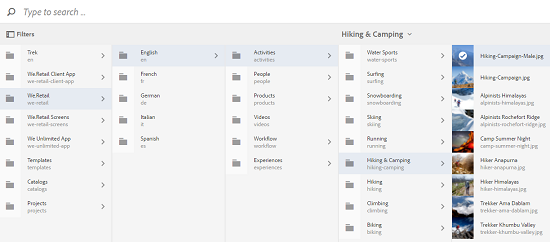

# Cerca risorse digitali in [!DNL Adobe Experience Manager] {#search-assets-in-aem}

| Versione | Collegamento articolo |
| -------- | ---------------------------- |
| AEM as a Cloud Service | [Fai clic qui](https://experienceleague.adobe.com/docs/experience-manager-cloud-service/content/assets/manage/search-assets.html?lang=it) |
| AEM 6.5 | Questo articolo |

[!DNL Adobe Experience Manager Assets] fornisce metodi affidabili per l&#39;individuazione delle risorse che consentono di velocizzare le operazioni relative ai contenuti. I tuoi team possono ridurre i tempi di commercializzazione con un’esperienza di ricerca intelligente e fluida utilizzando funzionalità pronte all’uso e metodi personalizzati. La ricerca delle risorse è fondamentale per l’utilizzo di un sistema di gestione delle risorse digitali, che sia destinato a un ulteriore utilizzo da parte dei creativi, per la gestione affidabile delle risorse da parte degli utenti aziendali e dei professionisti del marketing o per l’amministrazione da parte degli amministratori DAM. Ricerche semplici, avanzate e personalizzate che è possibile eseguire tramite l&#39;interfaccia utente di [!DNL Assets] o altre applicazioni e superfici consentono di soddisfare questi casi d&#39;uso.

[!DNL Experience Manager Assets] supporta i casi d&#39;uso seguenti e questo articolo descrive l&#39;utilizzo, i concetti, le configurazioni, le limitazioni e la risoluzione dei problemi relativi a tali casi d&#39;uso.

| Cercare le risorse | Configurare e amministrare la funzionalità di ricerca | Utilizzare i risultati della ricerca |
|---|---|---|
| [Ricerche di base](#searchbasics) | [Indice di ricerca](#searchindex) | [Ordina risultati](#sort) |
| [Interfaccia utente di ricerca](#searchui) | [Ricerca visiva o per similarità](#configvisualsearch) | [Verifica proprietà e metadati di una risorsa](#checkinfo) |
| [Suggerimenti per la ricerca](#searchsuggestions) | [Metadati obbligatori](#mandatorymetadata) | [Download](#download) |
| [Comprendere i risultati e il comportamento della ricerca](#searchbehavior) | [Modifica facet di ricerca](#searchfacets) | [Aggiornamenti in blocco dei metadati](#metadataupdates) |
| [Ricerca classificazione e potenziamento](#searchrank) | [Estrazione testo](#extracttextupload) | [Raccolte avanzate](#collections) |
| [Ricerca avanzata: filtro e ambito della ricerca](#scope) | [Predicati personalizzati](#custompredicates) | [Comprendere e risolvere i problemi relativi ai risultati imprevisti](#unexpected-results) |
| [Cerca in altre soluzioni e app](#search-assets-other-surfaces):<ul><li>[Adobe Asset Link](#aal)</li><li>[Brand Portal](#brand-portal)</li><li>[app desktop di Experience Manager](#desktop-app)</li><li>[immagini Adobe Stock](#adobe-stock)</li><li>[Risorse Dynamic Medie](#dynamic-media)</li></ul> | | |
| [Selettore risorse](#asset-picker) | | |
| [Limitazioni](#limitations) e [Suggerimenti](#tips) | | |
| [Esempi illustrati](#samples) | | |

Cerca le risorse digitali utilizzando il campo Omnisearch nella parte superiore dell&#39;interfaccia Web [!DNL Experience Manager]. Vai a **[!UICONTROL Assets]** > **[!UICONTROL File]** in [!DNL Experience Manager], fai clic su  nella barra superiore, immetti la parola chiave di ricerca e seleziona `Return`. In alternativa, utilizzare la scelta rapida da tastiera `/` (barra) per aprire il campo Omnisearch. `Location:Assets` è preselezionato per limitare le ricerche alle risorse DAM. [!DNL Experience Manager] fornisce suggerimenti per iniziare a digitare una parola chiave di ricerca.

Utilizza il pannello **[!UICONTROL Filtri]** per cercare risorse, cartelle, tag e metadati. Puoi filtrare i risultati della ricerca in base alle varie opzioni (predicati), ad esempio tipo di file, dimensione del file, data dell’ultima modifica, stato della risorsa, dati approfonditi e licenze di Adobe Stock. Puoi personalizzare il pannello Filtri e aggiungere o rimuovere predicati di ricerca utilizzando [facet di ricerca](/help/assets/search-facets.md). Il filtro [!UICONTROL Tipo file] nel pannello [!UICONTROL Filtri] contiene caselle di controllo a stato misto. Pertanto, a meno che non selezioni tutti i predicati nidificati (o formati), le caselle di controllo di primo livello vengono parzialmente selezionate.

La funzionalità di ricerca di [!DNL Experience Manager] supporta la ricerca di raccolte e di risorse all&#39;interno di una raccolta. Vedi [Cerca raccolte](/help/assets/manage-collections.md).

## Interfaccia di ricerca {#searchui}

Acquisisci familiarità con l’interfaccia di ricerca e le azioni disponibili.

*Figura: Comprendere l&#39;interfaccia dei risultati di ricerca di [!DNL Experience Manager Assets].*

**A.** Salva la ricerca come raccolta avanzata. **B.** Filtri o predicati per limitare i risultati della ricerca. **C.** Visualizza file, cartelle o entrambi. **D.** Fai clic su Filtri per aprire o chiudere la barra a sinistra. **E.** Il percorso di ricerca è DAM. **F.** campo Omnisearch con la parola chiave di ricerca fornita dall&#39;utente. **G.** Selezionare i risultati della ricerca caricati. **H.** Numero di risultati di ricerca visualizzati rispetto al totale dei risultati. **I.** Chiudere la ricerca. **J.** Passare dalla vista a schede alla vista a elenco.

### Facet di ricerca dinamica {#dynamicfacets}

Puoi trovare più rapidamente le risorse desiderate dalla pagina dei risultati della ricerca utilizzando il numero aggiornato dinamicamente di risultati di ricerca previsti nei facet di ricerca. Il numero previsto di risorse viene aggiornato anche prima di applicare il filtro di ricerca. Visualizzare il conteggio previsto rispetto al filtro consente di navigare tra i risultati della ricerca in modo rapido ed efficiente.

*Figura: visualizza il numero approssimativo di risorse senza filtrare i risultati di ricerca nei facet di ricerca.*

## Comprendere i risultati e il comportamento della ricerca {#searchbehavior}

### Termini e risultati di ricerca di base {#searchbasics}

Puoi eseguire ricerche per parola chiave dal campo OmniSearch. La ricerca per parola chiave non fa distinzione tra maiuscole e minuscole ed è una ricerca full-text (tra i campi di metadati più diffusi). Se vengono utilizzate più parole chiave, `AND` è l&#39;operatore predefinito tra le parole chiave.

I risultati sono ordinati in base alla rilevanza, a partire dalle corrispondenze più vicine. Per più parole chiave, i risultati più rilevanti sono le risorse che contengono entrambi i termini nei loro metadati. All’interno dei metadati, le parole chiave visualizzate come tag avanzati hanno una classificazione più alta rispetto alle parole chiave visualizzate in altri campi di metadati. [!DNL Experience Manager] consente di aumentare il peso di un particolare termine di ricerca. Inoltre, è possibile [aumentare la classificazione](#searchrank) di alcune risorse di destinazione per specifici termini di ricerca.

Per trovare rapidamente le risorse rilevanti, l’interfaccia avanzata offre meccanismi di filtro, ordinamento e selezione. Puoi filtrare i risultati in base a più criteri e visualizzare il numero di risorse trovate per vari filtri. In alternativa, puoi eseguire nuovamente la ricerca modificando la query nel campo Omnisearch. Quando modifichi i termini di ricerca o i filtri, gli altri filtri rimangono applicati per mantenere il contesto della ricerca.

Quando i risultati sono molte risorse, [!DNL Experience Manager] visualizza i primi 100 nella vista a schede e 200 nella vista a elenco. Man mano che gli utenti scorrono, vengono caricate più risorse. Questo per migliorare le prestazioni. Guarda una dimostrazione video del [numero di risorse visualizzate](https://www.youtube.com/watch?v=LcrGPDLDf4o).

Talvolta potresti visualizzare alcune risorse impreviste nei risultati della ricerca. Per ulteriori informazioni, vedere [risultati imprevisti](#unexpected-results).

[!DNL Experience Manager] può eseguire ricerche in molti formati di file e i filtri di ricerca possono essere personalizzati in base alle esigenze aziendali. Contatta l’amministratore per comprendere quali opzioni di ricerca sono rese disponibili per l’archivio DAM e quali restrizioni ha l’account.

### Risultati con e senza tag avanzati migliorati {#withsmarttags}

Per impostazione predefinita, la ricerca [!DNL Experience Manager] combina i termini di ricerca con una clausola AND. Ad esempio, si consiglia di cercare parole chiave donna in esecuzione. Per impostazione predefinita, nei risultati della ricerca vengono visualizzate solo le risorse con le parole chiave woman e running nei metadati. Lo stesso comportamento viene mantenuto quando si utilizzano caratteri speciali (punti, trattini bassi o trattini) con le parole chiave. Le seguenti query di ricerca restituiscono gli stessi risultati:

* `woman running`
* `woman.running`
* `woman-running`

Tuttavia, la query `woman -running` restituisce le risorse senza `running` nei relativi metadati.
L&#39;utilizzo di tag avanzati aggiunge una clausola `OR` aggiuntiva per trovare i termini di ricerca come smart tag applicati. In tale query di ricerca viene visualizzata anche una risorsa con tag `woman` o `running` che utilizza tag avanzati. I risultati della ricerca sono quindi una combinazione di:

* Assets con `woman` e `running` parole chiave nei metadati (comportamento predefinito).

* Smart tag di Assets con una delle parole chiave (comportamento Smart Tags).

### Suggerimenti per la ricerca durante la digitazione {#searchsuggestions}

Quando si inizia a digitare parole chiave, [!DNL Experience Manager] suggerisce le parole chiave o le frasi di ricerca possibili. I suggerimenti si basano sui metadati delle risorse esistenti. [!DNL Experience Manager] indicizza tutti i campi di metadati per facilitare la ricerca. Per fornire suggerimenti di ricerca, il sistema utilizza i valori dei seguenti campi di metadati. Per fornire suggerimenti di ricerca, è consigliabile compilare i campi seguenti con le parole chiave appropriate:

* Tag risorsa. (mappa su `jcr:content/metadata/cq:tags`)
* Titolo risorsa. (mappa su `jcr:content/metadata/dc:title`)
* Descrizione risorsa. (mappa su `jcr:content/metadata/dc:description`)
* Titolo nell’archivio JCR. Il valore può essere mappato al titolo della risorsa. (mappa su `jcr:content/jcr:title`)
* Descrizione nell’archivio JCR. Il valore può essere mappato alla descrizione della risorsa. (mappa su `jcr:content/jcr:description`)

Per ricevere suggerimenti per più parole chiave di ricerca, continuare a digitare tutte le parole chiave senza selezionare alcun suggerimento per una singola parola chiave.

*Figura: digitare più parole chiave per visualizzare suggerimenti che si adattano a tutte.*

### Ricerca classificazione e potenziamento {#searchrank}

I risultati della ricerca che corrispondono a tutti i termini di ricerca nei campi di metadati vengono visualizzati per primi, seguiti dai risultati della ricerca che corrispondono a qualsiasi termine di ricerca nei tag avanzati. Nell’esempio precedente, l’ordine approssimativo di visualizzazione dei risultati della ricerca è:

1. Corrisponde a `woman running` nei vari campi di metadati.
1. Corrisponde a `woman running` negli smart tag.
1. Corrisponde a `woman` o `running` negli smart tag.

Puoi migliorare la pertinenza delle parole chiave per determinate risorse in modo da aumentare le ricerche basate sulle parole chiave. In altre parole, le immagini per le quali vengono promosse parole chiave specifiche vengono visualizzate nella parte superiore dei risultati di ricerca quando si esegue una ricerca basata su queste parole chiave.

1. Dall&#39;interfaccia utente [!DNL Assets], apri la pagina delle proprietà della risorsa. Fai clic su **[!UICONTROL Avanzate]** e poi su **[!UICONTROL Aggiungi]** in **[!UICONTROL Privilegi elevati per parole chiave di ricerca]**.
1. Nella casella **[!UICONTROL Promozione ricerca]**, specifica una parola chiave per la quale vuoi aumentare la ricerca dell&#39;immagine, quindi fai clic su **[!UICONTROL Aggiungi]**. È possibile specificare più parole chiave nello stesso modo.
1. Fai clic su **[!UICONTROL Salva e chiudi]**. La risorsa promossa per questa parola chiave viene visualizzata tra i risultati di ricerca principali.

Puoi utilizzarlo a tuo vantaggio, incrementando la classificazione di alcune risorse nei risultati di ricerca per la parola chiave di destinazione. Guarda l’esempio di video seguente. Per informazioni dettagliate, vedi [Ricerca in [!DNL Experience Manager]](https://experienceleague.adobe.com/docs/experience-manager-learn/assets/search-and-discovery/search-boost.html?lang=it).

>[!VIDEO](https://video.tv.adobe.com/v/3410337/?quality=6&captions=ita)

*Video: scopri come vengono classificati i risultati della ricerca e come può essere influenzato il livello.*

## Ricerca avanzata {#scope}

[!DNL Experience Manager] fornisce vari metodi, come filtri, che si applicano alle risorse trovate per aiutarti a individuare più rapidamente le risorse desiderate. Di seguito sono descritti alcuni metodi comunemente utilizzati. Di seguito sono riportati alcuni [esempi illustrati](#samples).

**Cerca file o cartelle**: nei risultati della ricerca, vedere file, cartelle o entrambi. Dal pannello **[!UICONTROL Filtri]**, puoi selezionare l&#39;opzione appropriata. Vedi [interfaccia di ricerca](#searchui).

**Ricerca risorse in una cartella**: è possibile limitare la ricerca a una cartella specifica. Aggiungi il percorso di una cartella nel pannello **[!UICONTROL Filtri]**. È possibile selezionare una sola cartella alla volta.

*Figura: limitare i risultati della ricerca a una cartella aggiungendo un percorso di cartella nel pannello Filtri.*

### Trova immagini simili {#visualsearch}

Per trovare immagini visivamente simili a quelle selezionate dall’utente, fai clic su **[!UICONTROL Trova simili]** nella vista a schede di un’immagine o nella barra degli strumenti. [!DNL Experience Manager] visualizza le immagini con tag avanzati dall&#39;archivio DAM che sono simili a quelle selezionate dall&#39;utente. Scopri [come configurare la ricerca per similarità](#configvisualsearch).

*Figura: Trovare immagini simili utilizzando l&#39;opzione nella vista a schede.*

### Immagini di Adobe Stock {#adobe-stock}

Dall&#39;interfaccia utente di [!DNL Experience Manager], gli utenti possono cercare [risorse Adobe Stock](/help/assets/aem-assets-adobe-stock.md) e concedere in licenza le risorse richieste. Aggiungi `Location: Adobe Stock` nella barra di Omnisearch. Puoi anche utilizzare il pannello Filtri per trovare tutte le risorse con o senza licenza oppure cercare una risorsa specifica utilizzando il numero di file di Adobe Stock.

### Risorse Dynamic Medie {#dmassets}

Per filtrare le immagini in base a Dynamic Media, dal pannello **[!UICONTROL Filtri]** seleziona **[!UICONTROL Dynamic Media]** > **[!UICONTROL Set]**. Filtra e visualizza le risorse come set di immagini, caroselli, set di file multimediali diversi e set 360 gradi.

### Ricerca GQL utilizzando valori specifici nei campi di metadati {#gql-search}

Puoi cercare le risorse digitali in base ai valori esatti dei campi di metadati, ad esempio titolo, descrizione e creatore. La funzione di ricerca full-text GQL recupera solo le risorse il cui valore di metadati corrisponde esattamente alla query di ricerca. I nomi delle proprietà (Autore, Titolo e così via) e i valori fanno distinzione tra maiuscole e minuscole.

| Campo metadati | Valore e utilizzo facet |
|---|---|
| Titolo | titolo:Giovanni |
| Creatore | creatore:John |
| Dove si trova | posizione:NA |
| Descrizione | description:&quot;Immagine di esempio&quot; |
| Strumento creazione | creatortool:&quot;Adobe Photoshop&quot; |
| Proprietario copyright | copyright:&quot;Adobe Systems&quot; |
| Collaboratore | collaboratore:John |
| Condizioni d&#39;uso | usageterms:&quot;CopyRights Reserved&quot; |
| Creato | creato:AAAA-MM-GG |
| Data di scadenza | scade:AAAA-MM-GG |
| Ora di attivazione | in tempo reale:YYYY-MM-DDTHH |
| Ora di disattivazione | fuori orario:AAAA-MM-GG |
| Intervallo di tempo (data di scadenza, ora di inattività) | campo facet : limite inferiore.in alto |
| Percorso | /content/dam/&lt;nome cartella> |
| Titolo PDF | pdftitle:&quot;Documento Adobe&quot; |
| Oggetto | oggetto: &quot;Formazione&quot; |
| Tag | tags:&quot;Posizione e viaggio&quot; |
| Tipo | type:&quot;image\png&quot; |
| Larghezza immagine | larghezza:limite inferiore..in alto |
| Altezza immagine | altezza:limite inferiore.in alto |
| Persona | persona:John |

Impossibile combinare le proprietà `path`, `limit`, `size` e `orderby` utilizzando l&#39;operatore `OR` con altre proprietà.

<!-- TBD: Where are the limit, size, orderby properties defined?
-->

La parola chiave per una proprietà generata dall&#39;utente è la relativa etichetta di campo nell&#39;editor delle proprietà in minuscolo, con gli spazi rimossi.

Di seguito sono riportati alcuni esempi di formati di ricerca per query complesse:

* Per visualizzare tutte le risorse con più campi facet (ad esempio: title=John Doe e creator tool = Adobe Photoshop): `title:"John Doe" creatortool:Adobe*`
* Per visualizzare tutte le risorse quando il valore facet non è una singola parola ma una frase (ad esempio: title=Scott Reynolds): `title:"Scott Reynolds"`
* Per visualizzare le risorse con più valori di una singola proprietà (ad esempio: title=Scott Reynolds o John Doe): `title:"Scott Reynolds" OR "John Doe"`
* Per visualizzare le risorse con valori di proprietà che iniziano con una stringa specifica (ad esempio, il titolo è Scott Reynolds): `title:Scott*`
* Per visualizzare le risorse con valori di proprietà che terminano con una stringa specifica (ad esempio, il titolo è Scott Reynolds): `title:*Reynolds`
* Per visualizzare le risorse con un valore di proprietà contenente una stringa specifica (ad esempio: title = Sala riunioni di Basilea): `title:*Meeting*`
* Per visualizzare le risorse che contengono una stringa specifica e che hanno un valore di proprietà specifico (ad esempio: cerca un Adobe di stringa nelle risorse con title=John Doe): `*Adobe* title:"John Doe"`

## Cerca risorse digitali da altre offerte o interfacce [!DNL Experience Manager] {#search-assets-other-surfaces}

[!DNL Adobe Experience Manager] collega l&#39;archivio DAM a varie altre soluzioni [!DNL Experience Manager] per fornire un accesso più rapido alle risorse digitali e semplificare i flussi di lavoro creativi. L’individuazione delle risorse inizia con la ricerca o l’esplorazione. Il comportamento di ricerca rimane in gran parte lo stesso tra le varie superfici e soluzioni. Alcuni metodi di ricerca cambiano in base al pubblico di destinazione, ai casi d&#39;uso e all&#39;interfaccia utente che variano tra le soluzioni [!DNL Experience Manager]. I metodi specifici sono documentati per le singole soluzioni ai link riportati di seguito. I suggerimenti e i comportamenti universalmente applicabili sono documentati in questo articolo.

### Cercare risorse digitali dal pannello Adobe Asset Link {#aal}

Utilizzando Adobe Asset Link, i professionisti della creatività possono ora accedere al contenuto archiviato in [!DNL Experience Manager Assets] senza uscire dalle app Adobe Creative Cloud supportate. I creativi possono sfogliare, cercare, estrarre e archiviare senza problemi le risorse tramite il pannello in-app nelle app [!DNL Adobe Creative Cloud]: [!DNL Adobe Photoshop], [!DNL Adobe Illustrator] e [!DNL Adobe InDesign]. Asset Link consente inoltre agli utenti di cercare risultati visivamente simili. I risultati della visualizzazione della ricerca visiva si basano sugli algoritmi di apprendimento automatico di Adobe Sensei e aiutano gli utenti a trovare immagini esteticamente simili. Consulta [cercare e sfogliare le risorse](https://helpx.adobe.com/it/enterprise/using/manage-assets-using-adobe-asset-link.html#UseAdobeAssetLink) tramite Adobe Asset Link.

### Cerca risorse digitali nell&#39;app desktop [!DNL Experience Manager] {#desktop-app}

I creativi utilizzano l&#39;app desktop per rendere [!DNL Experience Manager Assets] facilmente ricercabile e disponibile sul desktop locale (Windows o Mac). I creativi possono visualizzare facilmente le risorse desiderate in Mac Finder o Esplora risorse, aperte in applicazioni desktop e modificate localmente. Le modifiche vengono salvate in [!DNL Experience Manager] con una nuova versione creata nell&#39;archivio. L&#39;applicazione supporta ricerche di base utilizzando una o più parole chiave, caratteri jolly `*` e `?` e l&#39;operatore `AND`. Consulta [Sfogliare, cercare e visualizzare in anteprima le risorse](https://experienceleague.adobe.com/docs/experience-manager-desktop-app/using/using.html?lang=it#browse-search-preview-assets) nell&#39;app desktop.

### Cerca risorse digitali in [!DNL Brand Portal] {#brand-portal}

Gli utenti e i professionisti del marketing che operano nel settore commerciale utilizzano Brand Portal per condividere in modo efficiente e sicuro le risorse digitali approvate con i loro team interni, partner e rivenditori. Vedi [cercare risorse in Brand Portal](https://experienceleague.adobe.com/docs/experience-manager-brand-portal/using/search-capabilities/brand-portal-searching.html?lang=it).

### Cerca in [!DNL Adobe Stock] immagini {#adobe-stock1}

Dall&#39;interfaccia utente di [!DNL Experience Manager], gli utenti possono cercare le risorse Adobe Stock e concedere in licenza le risorse richieste. Aggiungi `Location: Adobe Stock` nel campo Omnisearch. È inoltre possibile utilizzare il pannello **[!UICONTROL Filtri]** per trovare tutte le risorse concesse in licenza o senza licenza oppure cercare una risorsa specifica utilizzando il numero di file di Adobe Stock. Vedi [gestire [!DNL Adobe Stock] immagini in [!DNL Experience Manager]](/help/assets/aem-assets-adobe-stock.md#usemanage).

### Cerca in [!DNL Dynamic Media] risorse {#dynamic-media}

Per filtrare le immagini in base a Dynamic Media, dal pannello **[!UICONTROL Filtri]** seleziona **[!UICONTROL Dynamic Media]** > **[!UICONTROL Set]**. Filtra e visualizza le risorse come set di immagini, caroselli, set di file multimediali diversi e set 360 gradi. Durante la creazione di pagine web, gli autori possono cercare i set direttamente da Content Finder. Nel menu pop-up è disponibile un filtro per i set.

### Cercare risorse digitali in Content Finder durante l’authoring di pagine web {#content-finder}

Gli autori possono utilizzare Content Finder per cercare le risorse rilevanti nell’archivio DAM e utilizzare le risorse nelle pagine web che creano. Gli autori possono inoltre utilizzare la funzionalità Connected Assets per cercare le risorse disponibili in una distribuzione remota di [!DNL Experience Manager]. Gli autori possono quindi utilizzare queste risorse nelle pagine Web di una distribuzione locale di [!DNL Experience Manager]. Vedi [utilizzare risorse remote](/help/assets/use-assets-across-connected-assets-instances.md#use-remote-assets).

### Cerca raccolte {#collections}

La funzionalità di ricerca di [!DNL Experience Manager] supporta la ricerca di raccolte e di risorse all&#39;interno di una raccolta. Vedi [Cerca raccolte](/help/assets/manage-collections.md).

## Selettore risorse {#asset-picker}

>[!NOTE]
>
>Il selettore risorse è stato chiamato [selettore risorse](https://helpx.adobe.com/it/experience-manager/6-2/assets/using/asset-picker.html) nelle versioni precedenti di [!DNL Adobe Experience Manager].

Il selettore delle risorse consente di cercare, filtrare e sfogliare le risorse DAM in modo speciale. Il selettore risorse è disponibile in `https://[aem_server]:[port]/aem/assetpicker.html`. Puoi recuperare i metadati delle risorse selezionate utilizzando il selettore risorse. Puoi avviarlo con i parametri di richiesta supportati, ad esempio tipo di risorsa (immagine, video, testo) e modalità di selezione (selezione singola o multipla). Questi parametri impostano il contesto del selettore di risorse per una particolare istanza di ricerca e rimangono intatti per tutta la selezione.

Il selettore risorse utilizza il messaggio HTML5 `Window.postMessage` per inviare i dati della risorsa selezionata al destinatario. Funziona solo in modalità Sfoglia e solo con la pagina dei risultati di Omnisearch.

Passa i seguenti parametri di richiesta in un URL per avviare il selettore risorse in un particolare contesto:

| Nome | Valori | Esempio | Scopo |
|---|---|---|---|
| suffisso risorsa (B) | Percorso della cartella come suffisso della risorsa nell&#39;URL: [https://localhost:4502/aem/assetpicker.html/&lt;percorso_cartella>](https://localhost:4502/aem/assetpicker.html) | Per avviare il selettore risorse con una particolare cartella selezionata, ad esempio con la cartella `/content/dam/we-retail/en/activities` selezionata, l&#39;URL deve essere nel formato: `https://localhost:4502/aem/assetpicker.html/content/dam/we-retail/en/activities?assettype=images` | Se devi selezionare una particolare cartella all&#39;avvio del selettore di risorse, trasmettila come suffisso di risorsa. |
| `mode` | singolo, multiplo | <ul><li>`https://localhost:4502/aem/assetpicker.html?mode=single`</li><li>`https://localhost:4502/aem/assetpicker.html?mode=multiple`</li></ul> | In modalità multipla, puoi selezionare più risorse contemporaneamente utilizzando il selettore risorse. |
| `dialog` | true, false | [https://localhost:4502/aem/assetpicker.html?dialog=true](https://localhost:4502/aem/assetpicker.html?dialog=true) | Utilizza questi parametri per aprire il selettore risorse come finestra di dialogo Granite. Questa opzione è applicabile solo quando avvii il selettore risorse tramite il campo Percorso Granite e lo configuri come URL pickerSrc. |
| `root` | &lt;percorso_cartella> | `https://localhost:4502/aem/assetpicker.html?assettype=images&root=/content/dam/we-retail/en/activities` | Utilizza questa opzione per specificare la cartella principale per il selettore risorse. In questo caso, il selettore delle risorse consente di selezionare solo le risorse figlie (dirette/indirette) sotto la cartella principale. |
| `viewmode` | ricerca | | Per avviare il selettore risorse in modalità di ricerca, con `assettype` e `mimetype` parametri. |
| `assettype` | Immagini, documenti, multimedia, archivi. | <ul><li>`https://localhost:4502/aem/assetpicker.html?viewmode=search&assettype=images`</li><li> `https://localhost:4502/aem/assetpicker.html?viewmode=search&assettype=documents` </li><li> `https://localhost:4502/aem/assetpicker.html?viewmode=search&assettype=multimedia` </li><li> `https://localhost:4502/aem/assetpicker.html?viewmode=search&assettype=archives` </li></ul> | Utilizza l’opzione per filtrare i tipi di risorse in base al valore fornito. |
| `mimetype` | Tipo MIME (`/jcr:content/metadata/dc:format`) di una risorsa (supporto di caratteri jolly). | <ul><li>`https://localhost:4502/aem/assetpicker.html?mimetype=image/png`</li><li>`https://localhost:4502/aem/assetpicker.html?mimetype=*png`</li><li>`https://localhost:4502/aem/assetpicker.html?mimetype=*presentation`</li><li>`https://localhost:4502/aem/assetpicker.html?mimetype=*presentation&mimetype=*png`</li></ul> | Utilizzala per filtrare le risorse in base al tipo MIME. |

Per accedere all&#39;interfaccia del selettore risorse, passa a `https://[aem_server]:[port]/aem/assetpicker`. Passa alla cartella desiderata e seleziona una o più risorse. In alternativa, cerca la risorsa desiderata dalla casella Omnisearch, applica il filtro in base alle esigenze, quindi selezionala.

*Figura: Sfoglia e seleziona la risorsa nel selettore risorse.*

## Limitazioni {#limitations}

La funzionalità di ricerca in [!DNL Experience Manager Assets] presenta le seguenti limitazioni:

* Non inserire uno spazio iniziale nella query di ricerca, altrimenti la ricerca non funziona.
* [!DNL Experience Manager] potrebbe continuare a mostrare il termine di ricerca dopo aver selezionato le proprietà di una risorsa dai risultati di ricerca e quindi aver annullato la ricerca. <!-- (CQ-4273540) -->
* Durante la ricerca di cartelle o file e cartelle, i risultati della ricerca non possono essere ordinati in base a nessun parametro.
* Se si seleziona `Return` senza digitare nella barra di Omnisearch, [!DNL Experience Manager] restituisce un elenco di soli file e non cartelle. Se si esegue una ricerca specifica per le cartelle senza utilizzare una parola chiave, [!DNL Experience Manager] non restituisce alcun risultato.
* È possibile eseguire ricerche full-text nelle cartelle. Specifica un termine di ricerca per il funzionamento della ricerca.

La ricerca visiva o per somiglianza presenta le seguenti limitazioni:

* La ricerca visiva funziona meglio con un archivio di grandi dimensioni. Anche se non esiste un numero minimo di immagini necessarie per ottenere buoni risultati, la qualità delle corrispondenze con alcune immagini non è buona come le corrispondenze da un archivio di grandi dimensioni.
* Impossibile modificare il modello o addestrare [!DNL Experience Manager] per trovare immagini simili. Ad esempio, l’aggiunta o la rimozione di tag avanzati ad alcune risorse non modifica il modello. Le risorse vengono escluse dai risultati di ricerca visivamente simili.

La funzionalità di ricerca può presentare limiti di prestazioni nei seguenti scenari:

* La vista a schede ha un tempo di caricamento più veloce rispetto alla vista a elenco per visualizzare i risultati della ricerca.

## Suggerimenti per la ricerca {#tips}

* Quando si controlla lo stato di revisione delle risorse, utilizzare l&#39;opzione appropriata per individuare le risorse approvate o quelle in attesa di approvazione.
* Utilizza il predicato Insights per cercare le risorse supportate in base alle statistiche di utilizzo ottenute da varie app Creative. I dati di utilizzo sono raggruppati per categorie Punteggio di utilizzo, Impression, Clic e Canali multimediali in cui le risorse appaiono.
* Utilizza la casella di controllo **[!UICONTROL Seleziona tutto]** per selezionare le risorse trovate. [!DNL Experience Manager] visualizza inizialmente 100 risorse nella vista a schede e 200 risorse nella vista a elenco. Man mano che scorri i risultati della ricerca, vengono caricate più risorse. Puoi selezionare più risorse delle risorse caricate. Il conteggio delle risorse selezionate viene visualizzato nell’angolo superiore destro della pagina dei risultati di ricerca. Puoi utilizzare la selezione, ad esempio scaricare le risorse selezionate, aggiornare in blocco le proprietà dei metadati per le risorse selezionate o aggiungere le risorse selezionate a una raccolta. Quando sono selezionate più risorse di quante ne vengano visualizzate, viene applicata un’azione su tutte le risorse selezionate oppure viene visualizzata una finestra di dialogo in cui viene visualizzato il numero di risorse a cui vengono applicate. Per applicare un’azione alle risorse che non sono state caricate, accertati che tutte le risorse siano selezionate in modo esplicito.
* Per cercare le risorse che non contengono i metadati obbligatori, vedi [metadati obbligatori](#mandatorymetadata).
* La ricerca utilizza tutti i campi di metadati. Una ricerca generica, ad esempio la ricerca di 12, in genere restituisce molti risultati. Per ottenere risultati migliori, utilizzare virgolette doppie (non singole) o verificare che il numero sia contiguo a una parola senza un carattere speciale (ad esempio, `shoe12`).
* La ricerca full-text supporta operatori quali `-` e `^`. Per cercare queste lettere come valori letterali stringa, racchiudere l&#39;espressione di ricerca tra virgolette doppie. Utilizzare ad esempio `"Notebook - Beauty"` anziché `Notebook - Beauty`.
* Se i risultati della ricerca sono troppi, limitare l&#39;ambito [della ricerca](#scope) a zero nelle risorse desiderate. Funziona meglio quando hai un’idea su come cercare meglio le risorse desiderate, ad esempio tipo di file specifico, posizione specifica, metadati specifici e così via.

* **Assegnazione tag**: i tag consentono di categorizzare le risorse che possono essere visualizzate e cercate in modo più efficiente. L’assegnazione tag consente di estendere la tassonomia appropriata ad altri utenti e flussi di lavoro. [!DNL Experience Manager] offre metodi per assegnare tag automatici alle risorse utilizzando i servizi Adobe Sensei intelligenti artificialmente che consentono di assegnare tag migliori alle risorse in base all&#39;utilizzo e alla formazione. Quando cerchi le risorse, vengono considerati i tag avanzati se la funzione è abilitata sul tuo account. Funziona insieme alla funzionalità di ricerca incorporata. Vedi [comportamento di ricerca](#searchbehavior). Per ottimizzare l&#39;ordine di visualizzazione dei risultati della ricerca, puoi [aumentare la classificazione della ricerca](#searchrank) di alcune risorse selezionate.

* **Indicizzazione**: nei risultati della ricerca vengono restituiti solo i metadati e le risorse indicizzate. Per una copertura e prestazioni migliori, assicurati che l’indicizzazione sia corretta e segui le best practice. Vedi [indicizzazione](#searchindex).

* Per escludere risorse specifiche dai risultati della ricerca, utilizzare la proprietà `excludedPath` nell&#39;indice Lucene.

## Alcuni esempi che illustrano la ricerca {#samples}

Utilizza le virgolette doppie intorno alle parole chiave per trovare le risorse che contengono la frase esatta nell’ordine esatto specificato dall’utente.

*Figura: comportamento di ricerca con e senza virgolette.*

**Ricerca con carattere jolly asterisco**: per ampliare la ricerca, utilizzare un asterisco prima o dopo la parola di ricerca per trovare un numero qualsiasi di caratteri. Ad esempio, la ricerca di eseguita senza un asterisco non restituisce le risorse contenenti alcuna variante della parola (inclusi i metadati). Un asterisco sostituisce un numero qualsiasi di caratteri. Ad esempio:

* `run` restituisce le risorse con la parola chiave esattamente run
* `run*` restituisce risorse con `running`, `run`, `runaway` e così via.
* `*run` restituisce risorse con `outrun`, `rerun` e così via.
* `*run*` restituisce tutte le possibili combinazioni.

*Figura: utilizzo di un carattere jolly asterisco nella ricerca di risorse utilizzando un esempio.*

**Ricerca con carattere jolly punto interrogativo**: per ampliare la ricerca, utilizzare uno o più caratteri &#39;?&#39; caratteri, in modo che corrispondano al numero esatto di caratteri. Ad esempio, nell&#39;illustrazione seguente:

* La query `run???` non corrisponde ad alcuna risorsa.

* La query `run????` corrisponde alla parola `running` con quattro caratteri dopo `run`.

* La query `??run` corrisponde alla parola `rerun` con due caratteri prima di `run`.

*Figura: utilizzo del carattere jolly punto interrogativo nella ricerca di risorse tramite un esempio.*

**Escludere una parola chiave**: utilizzare il trattino per cercare risorse che non contengono una parola chiave. Ad esempio, la query `running -shoe` restituisce risorse che contengono `running`, ma non `shoe`. Analogamente, la query `camp -night` restituisce risorse che contengono `camp` ma non `night`. La query `camp-night` restituisce risorse che contengono sia `camp` che `night`.

*Figura: utilizzo del trattino per cercare risorse che non contengono una parola chiave esclusa.*

## Attività di configurazione e amministrazione relative alla funzionalità di ricerca {#configadmin}

### Configurazioni dell’indice di ricerca {#searchindex}

L’individuazione delle risorse si basa sull’indicizzazione dei contenuti DAM, inclusi i metadati. L’individuazione più rapida e precisa delle risorse si basa su un’indicizzazione ottimizzata e su configurazioni appropriate. Consulta [indice di ricerca](/help/assets/performance-tuning-guidelines.md#search-indexes), [query e indicizzazione oak](/help/sites-deploying/queries-and-indexing.md) e [best practice](/help/sites-deploying/best-practices-for-queries-and-indexing.md).

Per escludere risorse specifiche dai risultati della ricerca, utilizzare la proprietà `excludedPath` nell&#39;indice Lucene.

### Ricerca visiva o per somiglianza {#configvisualsearch}

La ricerca visiva utilizza tag avanzati. Dopo aver configurato la funzionalità di assegnazione tag avanzati, segui la procedura riportata di seguito.

1. In [!DNL Experience Manager] CRXDE, nel nodo `/oak:index/lucene`, aggiungere le proprietà e i valori seguenti e salvare le modifiche.

   * Proprietà `costPerEntry` di tipo `Double` con valore `10`.
   * Proprietà `costPerExecution` di tipo `Double` con valore `2`.
   * Proprietà `refresh` di tipo `Boolean` con valore `true`.

   Questa configurazione consente di effettuare ricerche dall’indice appropriato.

1. Per creare l&#39;indice Lucene, in CRXDE, in corrispondenza di `/oak:index/damAssetLucene/indexRules/dam:Asset/properties`, creare un nodo denominato `imageFeatures` di tipo `nt-unstructured`. Nel nodo `imageFeatures`,

   * Aggiungere la proprietà `name` di tipo `String` con il valore `jcr:content/metadata/imageFeatures/haystack0`.
   * Aggiungere la proprietà `nodeScopeIndex` di tipo `Boolean` con il valore di `true`.
   * Aggiungere la proprietà `propertyIndex` di tipo `Boolean` con il valore di `true`.
   * Aggiungere la proprietà `useInSimilarity` di tipo `Boolean` con il valore `true`.

   Salva le modifiche.

1. Accedere a `/oak:index/damAssetLucene/indexRules/dam:Asset/properties/predictedTags` e aggiungere la proprietà `similarityTags` di tipo `Boolean` con il valore di `true`.
1. Applica tag avanzati alle risorse nell&#39;archivio [!DNL Experience Manager]. Consulta [come configurare i tag avanzati](https://experienceleague.adobe.com/docs/experience-manager-learn/assets/configuring/tagging.html?lang=it#configuring).
1. In CRXDE, nel nodo `/oak-index/damAssetLucene`, impostare la proprietà `reindex` su `true`. Salva le modifiche.
1. (Facoltativo) Se hai un modulo di ricerca personalizzato, copia il nodo `/libs/settings/dam/search/facets/assets/jcr%3Acontent/items/similaritysearch` in `/conf/global/settings/dam/search/facets/assets/jcr:content/items`. Salva le modifiche.

Per informazioni correlate, vedere [informazioni sugli smart tag in Experience Manager](https://experienceleague.adobe.com/docs/experience-manager-learn/assets/metadata/image-smart-tags.html?lang=it) e [informazioni sulla gestione degli smart tag](/help/assets/enhanced-smart-tags.md).

>[!CAUTION]
>
>Se l&#39;indicizzazione Lucene viene eseguita su [!DNL Adobe Experience Manager], la ricerca basata su smart tag non funziona come previsto.

### Metadati vincolanti {#mandatorymetadata}

Gli utenti aziendali, gli amministratori o le librerie DAM possono definire alcuni metadati come metadati obbligatori, indispensabili per il funzionamento dei processi aziendali. Per vari motivi, alcuni metadati potrebbero non essere presenti in alcune risorse, ad esempio risorse legacy o risorse di cui è stata eseguita la migrazione in blocco. Assets con metadati mancanti o non validi vengono rilevati e segnalati in base alla proprietà dei metadati indicizzati. Per configurarlo, vedi [metadati obbligatori](/help/assets/metadata-schemas.md#define-mandatory-metadata).

### Modificare i facet di ricerca {#searchfacets}

Per migliorare la velocità di individuazione, [!DNL Experience Manager Assets] offre facet di ricerca che consentono di filtrare i risultati della ricerca. Per impostazione predefinita, il pannello Filtri include alcuni facet standard. Gli amministratori possono personalizzare il pannello Filtri per modificare i facet predefiniti utilizzando i predicati incorporati. [!DNL Experience Manager] fornisce una buona raccolta di predicati incorporati e un editor per personalizzare i facet. Vedi [facet di ricerca](/help/assets/search-facets.md).

### Estrarre testo durante il caricamento delle risorse {#extracttextupload}

È possibile configurare [!DNL Experience Manager] per estrarre il testo dalle risorse quando gli utenti caricano risorse, ad esempio file PSD o PDF. [!DNL Experience Manager] indicizza il testo estratto e consente agli utenti di cercare queste risorse in base al testo estratto. Consulta [caricare le risorse](/help/assets/manage-assets.md#uploading-assets).

Se l&#39;estrazione del testo richiede troppe risorse per la distribuzione, provare a [disattivare l&#39;estrazione del testo](https://helpx.adobe.com/experience-manager/kb/Disable-binary-text-extraction-to-optimize-Lucene-indexing-AEM.html).

### Predicati personalizzati per filtrare i risultati della ricerca {#custompredicates}

I predicati vengono utilizzati per creare facet. Gli amministratori possono personalizzare i facet di ricerca nel pannello Filtri utilizzando predicati preconfigurati. Questi predicati possono essere personalizzati utilizzando le sovrapposizioni. Consulta [creare predicati personalizzati](/help/assets/searchx.md).

Puoi cercare le risorse digitali in base a una o più delle seguenti proprietà. I filtri che si applicano ad alcune di queste proprietà sono disponibili per impostazione predefinita e alcuni altri filtri possono essere creati su misura per essere applicati alle altre proprietà.

| Campo di ricerca | Cerca valori proprietà |
|-----------------|----------------------------------------------------------------------------------------------------------------------------------------|
| Tipi MIME | Immagini, documenti, file multimediali, archivi o altro. |
| Ultima modifica | Ora, Giorno, Settimana, Mese o Anno. |
| Dimensione file | Small, Medium o Large. |
| Stato pubblicazione | Pubblicato o non pubblicato. |
| Stato approvato | Approvato o rifiutato. |
| Orientamento | Orizzontale, Verticale o Quadrato. |
| Stile | Colore o Bianco e nero. |
| Altezza video | Specificato come valore minimo e massimo. Il valore viene memorizzato solo nei metadati delle rappresentazioni video. |
| Larghezza video | Specificato come valore minimo e massimo. Il valore viene memorizzato solo nei metadati delle rappresentazioni video. |
| Formato video | DVI, Flash, MPEG4, MPEG, OGG Theora, QuickTime, Windows Media. Il valore viene memorizzato nei metadati del video sorgente e di eventuali rappresentazioni. |
| Codec video | x264. Il valore viene memorizzato solo nei metadati delle rappresentazioni video. |
| Bitrate video | Specificato come valore minimo e massimo. Il valore viene memorizzato solo nei metadati delle rappresentazioni video. |
| Codec audio | Libvorbis, Lame MP3, codifica AAC. Il valore viene memorizzato solo nei metadati delle rappresentazioni video. |
| Bitrate audio | Specificato come valore minimo e massimo. Il valore viene memorizzato solo nei metadati delle rappresentazioni video. |

## Utilizzare i risultati della ricerca delle risorse {#aftersearch}

Con le risorse cercate in [!DNL Experience Manager] puoi effettuare le seguenti operazioni:

* Visualizzare le proprietà dei metadati e altre informazioni.
* Scarica una o più risorse.
* Utilizza Azioni desktop per aprire queste risorse nell’app desktop.
* Creare raccolte avanzate.
* Crea una versione
* Avviare un flusso di lavoro
* Riferisci o rimuovi correlazione tra attività
* Per limitare i risultati della ricerca, applica i filtri utilizzando il pannello Filtri visualizzato automaticamente dopo aver eseguito la ricerca.

### Ordinare i risultati della ricerca {#sort}

Ordina i risultati della ricerca per individuare più rapidamente le risorse richieste. Puoi ordinare i risultati della ricerca nella vista a elenco e solo quando selezioni **[[!UICONTROL File]](#searchui)** dal pannello **[!UICONTROL Filtri]**. [!DNL Assets] utilizza l&#39;ordinamento lato server per ordinare rapidamente tutte le risorse (indipendentemente dal numero) all&#39;interno di una cartella o nei risultati di una query di ricerca. L’ordinamento lato server fornisce risultati più rapidi e precisi rispetto all’ordinamento lato client.

Nella vista a elenco, puoi ordinare i risultati della ricerca così come puoi ordinare le risorse in qualsiasi cartella. L&#39;ordinamento funziona su queste colonne: Nome, Titolo, Stato, Dimension, Dimensione, Valutazione, Utilizzo, Creato, Modificato, Pubblicato, Flusso di lavoro ed Estratto.

Per limitazioni della funzionalità di ordinamento, vedi [limitazioni](#limitations).

### Controllare le informazioni dettagliate di una risorsa {#checkinfo}

Puoi controllare le informazioni dettagliate di una risorsa cercata dalla pagina dei risultati della ricerca.

Per visualizzare tutti i metadati di una risorsa, selezionala e fai clic su **[!UICONTROL proprietà]** nella barra degli strumenti.

Per controllare i commenti relativi a una risorsa o alla sua cronologia della versione, fai clic sulla risorsa per aprirne l’anteprima di grandi dimensioni. Apri la timeline nella barra a sinistra e seleziona **[!UICONTROL Commenti]** o **[!UICONTROL Versioni]**. Puoi anche ordinare l’attività della timeline come commenti o versioni in ordine cronologico.

*Figura: ordinare le voci della sequenza temporale per una risorsa di ricerca.*

### Scaricare le risorse trovate {#download}

Puoi scaricare le risorse trovate e le relative rappresentazioni nello stesso modo in cui scarichi le risorse normali dalle cartelle. Seleziona una o più risorse dai risultati della ricerca e fai clic su **[!UICONTROL Scarica]** nella barra degli strumenti.

### Proprietà metadati aggiornamento in blocco {#metadataupdates}

È possibile effettuare aggiornamenti in blocco dei campi di metadati comuni a più risorse. Dai risultati della ricerca, seleziona una o più risorse. Fai clic su **[!UICONTROL Proprietà]** nella barra degli strumenti e aggiorna i metadati come richiesto. Al termine, fai clic su **[!UICONTROL Salva e chiudi]**. I metadati esistenti in precedenza nei campi aggiornati vengono sovrascritti.

Per le risorse disponibili in una singola cartella o raccolta, è più semplice [aggiornare i metadati in blocco](/help/assets/metadata.md) senza utilizzare la funzionalità di ricerca. Per le risorse disponibili in più cartelle o che corrispondono a un criterio comune, è più rapido aggiornare i metadati in blocco tramite la ricerca.

### Raccolte avanzate {#smart-collections}

Una raccolta è un insieme ordinato di risorse che può includere risorse da posizioni diverse, in quanto le raccolte contengono solo riferimenti a tali risorse. Le raccolte sono dei due tipi seguenti:

* Un elenco di riferimenti statici di risorse, cartelle e altre raccolte.
* Elenco dinamico (raccolta avanzata) che popola le risorse nella raccolta in base a un criterio di ricerca.

Puoi creare raccolte avanzate in base ai criteri di ricerca. Dal pannello **[!UICONTROL Filtri]**, seleziona **[!UICONTROL File]** e fai clic su **[!UICONTROL Salva raccolta avanzata]**. Consulta la sezione [Gestisci raccolte](/help/assets/manage-collections.md).

### Crea una versione {#create-version}

Crea una versione per le risorse visualizzate nei risultati di ricerca. Seleziona la risorsa e fai clic su **[!UICONTROL Crea]** > **[!UICONTROL Versione]**. Aggiungi un&#39;etichetta facoltativa o un commento e fai clic su **[!UICONTROL Crea]**. Puoi anche selezionare più risorse e crearne simultaneamente le versioni.

### Crea un flusso di lavoro {#create-workflow}

Analogamente alla funzionalità di creazione della versione, puoi anche creare un flusso di lavoro per le risorse visualizzate nei risultati di ricerca. Seleziona le risorse e fai clic su **[!UICONTROL Crea]** > **[!UICONTROL Flusso di lavoro]**. Selezionare il modello di flusso di lavoro, specificare un titolo per il flusso di lavoro e fare clic su **[!UICONTROL Avvia]**.

### Correlare e scollegare le risorse {#relate-unrelate-assets}

Collega e rimuovi le risorse visualizzate nei risultati di ricerca. Seleziona le risorse e fai clic su **[!UICONTROL Correlato]** o **[!UICONTROL Non correlato]**.

## Risultati e problemi di ricerca imprevisti {#unexpected-results}

| Errore, problemi, sintomi | Possibile motivo | Possibile correzione o comprensione del problema |
|---|---|---|
| Risultati errati durante la ricerca di risorse con metadati mancanti. | Durante la ricerca di risorse a cui mancano i metadati obbligatori, [!DNL Experience Manager] potrebbe visualizzare alcune risorse con metadati validi. I risultati si basano sulla proprietà dei metadati indicizzati. | Dopo l’aggiornamento dei metadati, è necessaria la reindicizzazione per riflettere lo stato corretto dei metadati delle risorse. Vedi [metadati obbligatori](metadata-schemas.md#define-mandatory-metadata). |
| Troppi risultati di ricerca. | Parametro di ricerca ampio. | Valuta di limitare l&#39;ambito [di ricerca](#scope). L’utilizzo di tag avanzati potrebbe fornire più risultati di quanto previsto. Vedere [comportamento di ricerca con smart tag](#withsmarttags). |
| Risultati di ricerca non correlati o parzialmente correlati. | Il comportamento di ricerca cambia con l’assegnazione di tag avanzati. | Comprendere [come cambia la ricerca dopo l&#39;assegnazione di tag avanzati](#withsmarttags). |
| Nessun suggerimento per il completamento automatico delle risorse. | Le nuove risorse caricate non sono ancora indicizzate. I metadati non sono immediatamente disponibili come suggerimenti quando inizi a digitare una parola chiave di ricerca nella barra di Omnisearch. | [!DNL Experience Manager] attende la scadenza di un periodo di timeout (un&#39;ora per impostazione predefinita) prima di eseguire un processo in background per indicizzare i metadati per tutte le risorse appena caricate o aggiornate, quindi aggiunge i metadati all&#39;elenco dei suggerimenti. |
| Nessun risultato. | <ul><li>Assets che corrisponde alla query non esiste. </li><li> Spazio vuoto aggiunto prima della query di ricerca. </li><li> Il campo dei metadati non supportato contiene la parola chiave cercata.</li><li> Ricerca effettuata durante la disattivazione di una risorsa. </li></ul> | <ul><li>Cerca utilizzando una parola chiave diversa. In alternativa, utilizza l’assegnazione di tag avanzati o la ricerca per similarità per migliorare i risultati della ricerca. </li><li>[Limitazione nota](#limitations).</li><li>Tutti i campi di metadati non vengono considerati per le ricerche. Vedi [ambito](#scope).</li><li>Cerca in un secondo momento o modifica l’orario di attivazione e l’orario di disattivazione delle risorse richieste.</li></ul> |
| Filtro di ricerca o predicato non disponibile. | <ul><li>Il filtro di ricerca non è configurato.</li><li>Non è disponibile per l’accesso.</li><li>(È meno probabile) Le opzioni di ricerca non vengono personalizzate nella distribuzione in uso.</li></ul> | <ul><li>Contatta l’amministratore per verificare se le personalizzazioni della ricerca sono disponibili o meno.</li><li>Contatta l’amministratore per verificare se il tuo account dispone dei privilegi o delle autorizzazioni per utilizzare la personalizzazione.</li><li>Contattare l&#39;amministratore e verificare le personalizzazioni disponibili per la distribuzione di [!DNL Assets] in uso.</li></ul> |
| Quando si cercano immagini visivamente simili, manca un’immagine prevista. | <ul><li>Immagine non disponibile in [!DNL Experience Manager].</li><li>Immagine non indicizzata. In genere, se è stato caricato di recente.</li><li>L’immagine non dispone di tag avanzati.</li></ul> | <ul><li>Aggiungi l&#39;immagine a [!DNL Assets].</li><li>Contatta l’amministratore per reindicizzare l’archivio. Inoltre, assicurati di utilizzare l’indice appropriato.</li><li>Contatta l’amministratore per assegnare tag avanzati alle risorse rilevanti.</li></ul> |
| Quando si ricercano immagini visivamente simili, viene visualizzata un’immagine irrilevante. | Comportamento di ricerca visiva. | [!DNL Experience Manager] visualizza il maggior numero possibile di risorse potenzialmente rilevanti. Ai risultati vengono aggiunte immagini meno rilevanti, se presenti, ma con una classificazione di ricerca inferiore. La qualità delle corrispondenze e la rilevanza delle risorse trovate diminuiscono con lo scorrimento verso il basso dei risultati di ricerca. |
| Quando selezioni e operi sui risultati della ricerca, tutte le risorse trovate non vengono utilizzate. | L&#39;opzione [!UICONTROL Seleziona tutto] seleziona solo i primi 100 risultati di ricerca nella vista a schede e i primi 200 risultati di ricerca nella vista a elenco. | |

>[!MORELIKETHIS]
>
>* [[!DNL Experience Manager] guida all&#39;implementazione per la ricerca](https://experienceleague.adobe.com/docs/experience-manager-learn/sites/developing/search-tutorial-develop.html?lang=it)
>* [Configurazione avanzata per migliorare i risultati della ricerca](https://experienceleague.adobe.com/docs/experience-manager-learn/assets/search-and-discovery/search-boost.html?lang=it)
>* [Configura ricerca traduzione automatica](https://experienceleague.adobe.com/docs/experience-manager-learn/assets/translation/smart-translation-search-technical-video-setup.html)
