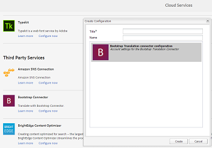

# Applica servizi cloud di traduzione alle cartelle {#applying-translation-cloud-services-to-folders}

[!DNL Adobe Experience Manager] consente di usufruire di servizi di traduzione basati su cloud dal provider di traduzione di tua scelta per garantire che le risorse siano tradotte in base alle tue esigenze.

Puoi applicare il servizio cloud di traduzione direttamente alla cartella delle risorse in modo che possano essere utilizzati durante i flussi di lavoro di traduzione.

## Applicare i servizi di traduzione {#applying-the-translation-services}

L’applicazione dei servizi cloud di traduzione direttamente nella cartella delle risorse elimina la necessità di configurare i servizi di traduzione quando crei o aggiorni flussi di lavoro di traduzione.

1. Dall’interfaccia utente [!DNL Assets] , seleziona la cartella a cui desideri applicare i servizi di traduzione.
1. Dalla barra degli strumenti, fai clic su **[!UICONTROL Proprietà]** per visualizzare la pagina **[!UICONTROL Proprietà cartella]**.

   

1. Vai alla scheda **[!UICONTROL Cloud Services]**.
1. Dall’elenco Configurazioni Cloud Service, scegli il provider di traduzione desiderato. Ad esempio, se desideri usufruire di servizi di traduzione da Microsoft, scegli **[!UICONTROL Microsoft Translator]**.

   

1. Scegliere il connettore per il provider di traduzione.

   

1. Dalla barra degli strumenti, fai clic su **[!UICONTROL Salva]**, quindi fai clic su **[!UICONTROL OK]** per chiudere la finestra di dialogo.Il servizio di traduzione viene applicato alla cartella.

## Applica connettore di traduzione personalizzato {#applying-custom-translation-connector}

Se vuoi applicare un connettore personalizzato per i servizi di traduzione che desideri utilizzare nei flussi di lavoro di traduzione, attieniti alla seguente procedura. Per applicare un connettore personalizzato, procedi prima con l’installazione del connettore da Gestione pacchetti. Quindi, configura il connettore dalla console Cloud Services. Dopo aver configurato il connettore, questo è disponibile nell’elenco dei connettori nella scheda Cloud Services descritta in [Applicazione dei servizi di traduzione](transition-cloud-services.md#applying-the-translation-services). Dopo aver applicato il connettore personalizzato e aver eseguito i flussi di lavoro di traduzione, nella sezione **[!UICONTROL Riepilogo di traduzione]** del progetto di traduzione vengono visualizzati i dettagli del connettore, rispettivamente sotto le head **[!UICONTROL Provider]** e **[!UICONTROL Metodo]**.

1. Installa il connettore da Gestione pacchetti.
1. Fai clic sul logo [!DNL Experience Manager] e passa a **[!UICONTROL Strumenti]** > **[!UICONTROL Implementazione]** > **[!UICONTROL Cloud Services]**.
1. Nella pagina **[!UICONTROL Cloud Services]**, individua il connettore installato in **[!UICONTROL Servizi di terze parti]**.

   

1. Fai clic sul collegamento **[!UICONTROL Configura ora]** per aprire la finestra di dialogo **[!UICONTROL Crea configurazione]**.

   

1. Specifica un titolo e un nome per il connettore, quindi fai clic su **[!UICONTROL Crea]**. Il connettore personalizzato è disponibile nell’elenco dei connettori nella scheda **[!UICONTROL Cloud Services]** descritta nel passaggio 5 di [Applicazione dei servizi di traduzione](#applying-the-translation-services).
1. Dopo aver applicato il connettore personalizzato, esegui uno dei flussi di lavoro di traduzione descritti in [Creazione di progetti di traduzione](translation-projects.md). Puoi verificare i dettagli del connettore nella sezione **[!UICONTROL Riepilogo di traduzione]** del progetto di traduzione della console **[!UICONTROL Progetti]**.

   
