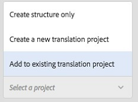

# Creazione di progetti di traduzione {#creating-translation-projects}

Per creare una copia per lingua, attivare uno dei seguenti flussi di lavoro di copia per lingua disponibili nella barra laterale Riferimenti nell&#39;interfaccia utente [!DNL Experience Manager].

* **Crea e traduci**: In questo flusso di lavoro, le risorse da tradurre vengono copiate nella directory principale della lingua in cui desiderate tradurre. Inoltre, a seconda delle opzioni selezionate, viene creato un progetto di traduzione per le risorse nella console Progetti. A seconda delle impostazioni, il progetto di traduzione può essere avviato manualmente o può essere eseguito automaticamente non appena viene creato il progetto di traduzione.

* **Aggiorna copie** della lingua: Eseguite questo flusso di lavoro per tradurre un altro gruppo di risorse e includerlo in una copia per lingua per una lingua specifica. In questo caso, le risorse convertite vengono aggiunte alla cartella di destinazione che contiene già risorse tradotte in precedenza.

>[!NOTE]
>
>I file binari di risorse vengono tradotti solo se il provider di servizi di traduzione supporta la traduzione dei file binari.

>[!NOTE]
>
>Se avviate un flusso di lavoro di traduzione per risorse complesse, come file PDF e [!DNL Adobe InDesign], le relative risorse secondarie o rappresentazioni (se presenti) non vengono inviate per la traduzione.

## Crea e traduci flusso di lavoro {#create-and-translate-workflow}

È possibile utilizzare il flusso di lavoro di creazione e traduzione per generare per la prima volta copie della lingua per una lingua particolare. Il flusso di lavoro offre le seguenti opzioni:

* Crea solo struttura.
* Crea un nuovo progetto di traduzione.
* Aggiungi a progetto di traduzione esistente.

### Crea solo struttura {#create-structure-only}

Utilizza l’opzione **[!UICONTROL Crea solo struttura]** per creare una gerarchia di cartelle di destinazione all’interno della directory principale lingua di destinazione, in modo che corrisponda alla gerarchia della cartella di origine all’interno della directory principale lingua di origine. In questo caso, le risorse di origine vengono copiate nella cartella di destinazione. Tuttavia, non viene generato alcun progetto di traduzione.

1. Nell&#39;interfaccia [!DNL Assets], selezionate la cartella di origine per la quale desiderate creare una struttura nella directory principale della lingua di destinazione.
1. Aprire il riquadro **[!UICONTROL Riferimenti]** e fare clic su **[!UICONTROL Copie lingua]** in **[!UICONTROL Copie]**.

   

1. Fare clic su **[!UICONTROL Crea e trascina]** in basso.

1. Nell&#39;elenco **[!UICONTROL Lingue di destinazione]**, selezionate la lingua per la quale desiderate creare una struttura di cartelle.

1. Dall’elenco **[!UICONTROL Progetto]**, scegli **[!UICONTROL Crea solo struttura]**.

   

1. Fai clic su **[!UICONTROL Crea]**. La nuova struttura per la lingua di destinazione è elencata in **[!UICONTROL Copie della lingua]**.

   

1. Fate clic sulla struttura dall&#39;elenco, quindi fate clic su **[!UICONTROL Mostra in risorse]** per passare alla struttura di cartelle all&#39;interno della lingua di destinazione.

   

### Crea un nuovo progetto di traduzione {#create-a-new-translation-project}

Se utilizzate questa opzione, le risorse da tradurre vengono copiate nella directory principale della lingua in cui desiderate tradurre. A seconda delle opzioni selezionate, viene creato un progetto di traduzione per le risorse nella console Progetti. A seconda delle impostazioni, il progetto di traduzione può essere avviato manualmente o eseguito automaticamente non appena viene creato il progetto di traduzione.

1. Nell&#39;interfaccia utente [!DNL Assets], selezionate la cartella di origine per la quale desiderate creare una copia della lingua.
1. Aprire il riquadro **[!UICONTROL Riferimenti]** e fare clic su **[!UICONTROL Copie lingua]** in **[!UICONTROL Copie]**.

   

1. Fare clic su **[!UICONTROL Crea e trascina]** in basso.

1. Nell’elenco **[!UICONTROL Lingue di destinazione]**, seleziona le lingue per le quali vuoi creare una struttura di cartelle.

   

1. Nell&#39;elenco **[!UICONTROL Progetto]**, selezionare **[!UICONTROL Crea un nuovo progetto di traduzione]**.

   

1. Nel campo **[!UICONTROL Titolo progetto]**, inserisci un titolo.

   

1. Fai clic su **[!UICONTROL Crea]**. [!DNL Assets] dalla cartella di origine vengono copiati nelle cartelle di destinazione per le impostazioni internazionali selezionate al punto 4.

   

1. Per passare alla cartella, selezionate la copia della lingua e fate clic su **[!UICONTROL Mostra in risorse]**.

   

1. Passate alla console Progetti. La cartella di traduzione viene copiata nella console Progetti.

   

1. Aprite la cartella per visualizzare il progetto di traduzione.

   

1. Fate clic sul progetto per aprire la pagina dei dettagli.

   

1. Per visualizzare lo stato del processo di traduzione, fate clic sui puntini di sospensione nella parte inferiore della sezione **[!UICONTROL Processo di traduzione]**.

   

   Per ulteriori informazioni sugli stati del processo, vedere [Monitoraggio dello stato di un processo di traduzione](/help/sites-administering/tc-manage.md#monitoring-the-status-of-a-translation-job).

1. Andate all&#39; [!DNL Assets] interfaccia utente e aprite la pagina Proprietà per ciascuna risorsa convertita per visualizzare i metadati convertiti.

   

   *Figura: Metadati tradotti nella pagina delle proprietà della risorsa.*

   >[!NOTE]
   >
   >Questa funzione è disponibile sia per le risorse che per le cartelle. Quando una risorsa viene selezionata al posto di una cartella, viene copiata l’intera gerarchia di cartelle fino alla radice della lingua per creare una copia della lingua per la risorsa.

### Aggiungi a progetto di traduzione esistente {#add-to-existing-translation-project}

Se utilizzate questa opzione, il flusso di lavoro di traduzione viene eseguito per le risorse aggiunte alla cartella di origine dopo aver eseguito un flusso di lavoro di traduzione precedente. Solo le risorse appena aggiunte vengono copiate nella cartella di destinazione che contiene le risorse tradotte in precedenza. In questo caso non viene creato alcun nuovo progetto di traduzione.

1. Nell&#39;interfaccia di [!DNL Assets], andate alla cartella di origine che contiene risorse non tradotte.
1. Seleziona una risorsa da tradurre e apri il **[!UICONTROL riquadro Riferimento]**. Nella sezione **[!UICONTROL Copie per lingua]** viene visualizzato il numero di copie di traduzione attualmente disponibili.
1. Fare clic su **[!UICONTROL Copie lingua]** in **[!UICONTROL Copie]**. Viene visualizzato un elenco delle copie di traduzione disponibili.
1. Fare clic su **[!UICONTROL Crea e trascina]** in basso.

1. Nell’elenco **[!UICONTROL Lingue di destinazione]**, seleziona le lingue per le quali vuoi creare una struttura di cartelle.

1. Dall’elenco **[!UICONTROL Progetto]**, seleziona **[!UICONTROL Aggiungi al progetto di traduzione esistente]** per eseguire il flusso di lavoro di traduzione nella cartella.

   

   >[!NOTE]
   >
   >Se scegliete l&#39;opzione **[!UICONTROL Aggiungi al progetto di traduzione esistente]**, il progetto di traduzione viene aggiunto a un progetto preesistente solo se le impostazioni del progetto corrispondono esattamente alle impostazioni del progetto preesistente. In caso contrario, viene creato un nuovo progetto.

1. Dall&#39;elenco **[!UICONTROL Progetto di traduzione esistente]**, selezionate un progetto per aggiungere la risorsa per la traduzione.

1. Fai clic su **[!UICONTROL Crea]**. Le risorse da tradurre vengono aggiunte alla cartella di destinazione. La cartella aggiornata è elencata nella sezione **[!UICONTROL Copie per lingua]**.

   

1. Passate alla console Progetti e aprite il progetto di traduzione esistente a cui avete aggiunto.
1. Fate clic sulla pagina dei dettagli del progetto di traduzione.

   

1. Fate clic sui puntini di sospensione nella parte inferiore della sezione **Processo di traduzione** per visualizzare le risorse nel flusso di lavoro di traduzione. Nell’elenco dei processi di traduzione vengono visualizzate anche le voci per i metadati risorsa e i tag. Queste voci indicano che anche i metadati e i tag per le risorse vengono tradotti.

   >[!NOTE]
   >
   >Se eliminate la voce relativa a tag o metadati, non vengono convertiti tag o metadati per nessuna risorsa.

   >[!NOTE]
   >
   >Se utilizzate Traduzione automatica, i file binari delle risorse non vengono tradotti.

   >[!NOTE]
   >
   >Se la risorsa aggiunta al processo di conversione include risorse secondarie, selezionate le risorse secondarie e rimuoverle affinché la conversione possa proseguire senza problemi.

1. Per avviare la conversione delle risorse, fate clic sulla freccia nella sezione **[!UICONTROL Processo di traduzione]** e selezionate **[!UICONTROL Start]** dall&#39;elenco.

   

   Un messaggio notifica l’inizio del processo di traduzione.

1. Per visualizzare lo stato del processo di traduzione, fate clic sui puntini di sospensione nella parte inferiore della sezione **[!UICONTROL Processo di traduzione]**.

   

   Per ulteriori dettagli, vedere [Monitoraggio dello stato di un processo di traduzione](/help/sites-administering/tc-manage.md#monitoring-the-status-of-a-translation-job).

1. Al termine della traduzione, lo stato diventa Pronto per la revisione. Andate all&#39; [!DNL Assets] interfaccia utente e aprite la pagina Proprietà per ciascuna risorsa convertita per visualizzare i metadati convertiti.

## Aggiorna copie per lingua {#update-language-copies}

Eseguite questo flusso di lavoro per tradurre qualsiasi altro set di risorse e includerlo in una copia della lingua per una lingua specifica. In questo caso, le risorse convertite vengono aggiunte alla cartella di destinazione che contiene già risorse tradotte in precedenza. A seconda della scelta delle opzioni, viene creato un progetto di traduzione o viene aggiornato un progetto di traduzione esistente per le nuove risorse. Il flusso di lavoro Copia lingua aggiornamento include le seguenti opzioni:

* Crea un nuovo progetto di traduzione
* Aggiungi a progetto di traduzione esistente

### Crea un nuovo progetto di traduzione {#create-a-new-translation-project-1}

Se utilizzate questa opzione, viene creato un progetto di traduzione per il set di risorse per il quale desiderate aggiornare una copia in lingua.

1. Nell&#39;interfaccia di [!DNL Assets], selezionate la cartella di origine in cui avete aggiunto una risorsa.
1. Aprire il riquadro **[!UICONTROL References]**, quindi fare clic su **[!UICONTROL Copie lingua]** in **[!UICONTROL Copie]** per visualizzare l&#39;elenco delle copie lingua.
1. Seleziona la casella di controllo che precede **[!UICONTROL Copie per lingua]**, quindi fai clic sulla cartella di destinazione che corrisponde alle impostazioni internazionali appropriate.

   

1. Fare clic su **[!UICONTROL Aggiorna copie lingua]** in basso.

1. Nell&#39;elenco **[!UICONTROL Progetto]**, scegliere **[!UICONTROL Crea un nuovo progetto di traduzione]**.

   

1. Nel campo **[!UICONTROL Titolo progetto]**, inserisci un titolo.

1. Fare clic su **[!UICONTROL Start]**.
1. Passate alla console Progetti. La cartella di traduzione viene copiata nella console Progetti.

   

1. Aprite la cartella per visualizzare il progetto di traduzione.

   

1. Fate clic sul progetto per aprire la pagina dei dettagli.

   

1. Per avviare la conversione delle risorse, fate clic sulla freccia nella sezione **[!UICONTROL Processo di traduzione]** e selezionate **[!UICONTROL Start]** dall&#39;elenco.

   

   Un messaggio notifica l’inizio del processo di traduzione.

1. Per visualizzare lo stato del processo di traduzione, fate clic sui puntini di sospensione nella parte inferiore della sezione **[!UICONTROL Processo di traduzione]**.

   

   Per ulteriori informazioni sugli stati del processo, vedere [Monitoraggio dello stato di un processo di traduzione](../sites-administering/tc-manage.md#monitoring-the-status-of-a-translation-job).

1. Andate all&#39;interfaccia utente [!DNL Assets] e aprite la pagina Proprietà per ciascuna risorsa convertita per visualizzare i metadati convertiti.

### Aggiungi a progetto di traduzione esistente {#add-to-existing-translation-project-1}

Se utilizzate questa opzione, il set di risorse viene aggiunto a un progetto di traduzione esistente per aggiornare la copia della lingua per le impostazioni internazionali scelte.

1. Nell&#39;interfaccia di [!DNL Assets], selezionate la cartella di origine in cui avete aggiunto una cartella di risorse.
1. Aprire il **[!UICONTROL riquadro Riferimenti]** e fare clic su **[!UICONTROL Copie lingua]** in **[!UICONTROL Copie]** per visualizzare l&#39;elenco delle copie lingua.

   

1. Per selezionare tutte le copie della lingua, seleziona la casella di controllo che precede **[!UICONTROL Copie per lingua]**. Deseleziona le altre copie, ad eccezione della copia (o copie) per lingua corrispondente alle impostazioni internazionali verso cui vuoi tradurre.

   

1. Fare clic su **[!UICONTROL Aggiorna copie lingua]** in basso.

1. Nell&#39;elenco **[!UICONTROL Progetto]**, scegliere **[!UICONTROL Aggiungi a progetto di traduzione esistente]**.

   

1. Dall&#39;elenco **[!UICONTROL Progetto di traduzione esistente]**, selezionate un progetto per aggiungere la risorsa per la traduzione.

1. Fare clic su **[!UICONTROL Start]**.
1. Per completare il resto della procedura, vedere i passaggi da 9 a 14 di [Aggiungi al progetto di traduzione esistente](translation-projects.md#add-to-existing-translation-project).

## Creare copie in lingua temporanea {#creating-temporary-language-copies}

Quando eseguite un flusso di lavoro di traduzione per aggiornare una copia per lingua con versioni modificate di risorse originali, la copia per lingua esistente viene mantenuta fino all’approvazione delle risorse tradotte. [!DNL Adobe Experience Manager Assets] memorizza le risorse appena tradotte in una posizione temporanea e aggiorna la copia della lingua esistente dopo l’approvazione esplicita delle risorse. Se rifiutate le risorse, la copia nella lingua rimane invariata.

1. Fare clic sulla cartella principale di origine in **[!UICONTROL Copie di lingua]** per la quale è già stata creata una copia della lingua, quindi fare clic su **[!UICONTROL Mostra in risorse]** per aprire la cartella in [!DNL Experience Manager Assets].

   

1. Dall&#39;interfaccia [!DNL Assets], selezionate una risorsa già tradotta e fate clic su **[!UICONTROL Modifica]** nella barra degli strumenti per aprire la risorsa in modalità di modifica.
1. Modificate la risorsa e salvate le modifiche.
1. Eseguire i passaggi da 2 a 14 della procedura [Aggiungi al progetto di traduzione esistente](#add-to-existing-translation-project) per aggiornare la copia della lingua.
1. Fare clic sui puntini di sospensione nella parte inferiore della sezione **[!UICONTROL Processo di traduzione]**. Dall&#39;elenco delle risorse nella pagina **[!UICONTROL Processo di traduzione]**, potete visualizzare chiaramente la posizione temporanea in cui è memorizzata la versione convertita della risorsa.

   

1. Selezionare la casella di controllo accanto a **[!UICONTROL Titolo]**.
1. Dalla barra degli strumenti, fate clic su **[!UICONTROL Accetta traduzione]** , quindi fate clic su **[!UICONTROL Accetta]** nella finestra di dialogo per sovrascrivere la risorsa tradotta nella cartella di destinazione con la versione tradotta della risorsa modificata.

   >[!NOTE]
   >
   >Per abilitare il flusso di lavoro di traduzione per aggiornare le risorse di destinazione, accettate sia la risorsa che i metadati.

   Fate clic su **[!UICONTROL Rifiuta traduzione]**  per mantenere la versione tradotta originariamente nella directory principale delle impostazioni internazionali di destinazione e rifiutare la versione modificata.

1. Per visualizzare i metadati convertiti, andate alla console [!DNL Assets] e aprite la pagina [!UICONTROL Proprietà] per ciascuna risorsa convertita.

>[!MORELIKETHIS]
>
>* [Suggerimenti per tradurre in modo efficiente i metadati](https://blogs.adobe.com/experiencedelivers/experience-management/translate_aemassets_metadata/).

