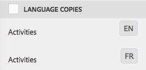

# Creazione di progetti di traduzione {#creating-translation-projects}

Per creare una copia per lingua, attivare uno dei seguenti flussi di lavoro di copia per lingua disponibili nella barra laterale Riferimenti nell’interfaccia [!DNL Experience Manager] utente.

* **Crea e traduci**: In questo flusso di lavoro, le risorse da tradurre vengono copiate nella directory principale della lingua in cui desiderate tradurre. Inoltre, a seconda delle opzioni selezionate, viene creato un progetto di traduzione per le risorse nella console Progetti. A seconda delle impostazioni, il progetto di traduzione può essere avviato manualmente o può essere eseguito automaticamente non appena viene creato il progetto di traduzione.

* **Aggiorna copie** della lingua: Eseguite questo flusso di lavoro per tradurre un altro gruppo di risorse e includerlo in una copia per lingua per una lingua specifica. In questo caso, le risorse convertite vengono aggiunte alla cartella di destinazione che contiene già risorse tradotte in precedenza.

>[!NOTE]
>
>I file binari di risorse vengono tradotti solo se il provider di servizi di traduzione supporta la traduzione dei file binari.

>[!NOTE]
>
>Se avviate un flusso di lavoro di traduzione per risorse complesse, come file PDF e InDesign, le relative risorse secondarie o rappresentazioni (se presenti) non vengono inviate per la traduzione.

## Crea e traduci flusso di lavoro {#create-and-translate-workflow}

È possibile utilizzare il flusso di lavoro di creazione e traduzione per generare per la prima volta copie della lingua per una lingua particolare. Il flusso di lavoro offre le seguenti opzioni:

* Crea solo struttura.
* Crea un nuovo progetto di traduzione.
* Aggiungi a progetto di traduzione esistente.

### Crea solo struttura {#create-structure-only}

Utilizza l’opzione **[!UICONTROL Crea solo struttura]** per creare una gerarchia di cartelle di destinazione all’interno della directory principale lingua di destinazione, in modo che corrisponda alla gerarchia della cartella di origine all’interno della directory principale lingua di origine. In questo caso, le risorse di origine vengono copiate nella cartella di destinazione. Tuttavia, non viene generato alcun progetto di traduzione.

1. Nell&#39; [!DNL Assets] interfaccia, selezionate la cartella di origine per la quale desiderate creare una struttura nella directory principale della lingua di destinazione.
1. Open the **[!UICONTROL References]** pane and click **[!UICONTROL Language Copies]** under **[!UICONTROL Copies]**.

   

1. Fate clic su **[!UICONTROL Crea e traduci]** in basso.

   

1. From the **[!UICONTROL Target Languages]** list, select the language for which you want to create a folder structure.

   

1. Dall’elenco **[!UICONTROL Progetto]**, scegli **[!UICONTROL Crea solo struttura]**.

   

1. Fai clic su **[!UICONTROL Crea]**. La nuova struttura per la lingua di destinazione è elencata in Copie **[!UICONTROL lingua]**.

   

1. Fai clic sulla struttura dall’elenco, quindi fai clic su **[!UICONTROL Mostra in risorse]** per passare alla struttura di cartelle nella lingua di destinazione.

   

### Crea un nuovo progetto di traduzione {#create-a-new-translation-project}

Se utilizzate questa opzione, le risorse da tradurre vengono copiate nella directory principale della lingua in cui desiderate tradurre. A seconda delle opzioni selezionate, viene creato un progetto di traduzione per le risorse nella console Progetti. A seconda delle impostazioni, il progetto di traduzione può essere avviato manualmente o eseguito automaticamente non appena viene creato il progetto di traduzione.

1. Nell’interfaccia utente Risorse, seleziona la cartella di origine per la quale vuoi creare una copia per la lingua.
1. Open the **[!UICONTROL References]** pane and click **[!UICONTROL Language Copies]** under **[!UICONTROL Copies]**.

   

1. Fate clic su **[!UICONTROL Crea e traduci]** in basso.

   

1. Nell’elenco **[!UICONTROL Lingue di destinazione]**, seleziona le lingue per le quali vuoi creare una struttura di cartelle.

   

1. Dall’elenco **[!UICONTROL Progetto]** , selezionate **[!UICONTROL Crea un nuovo progetto]** di traduzione.

   

1. Nel campo **[!UICONTROL Titolo progetto]**, inserisci un titolo.

   

1. Fai clic su **[!UICONTROL Crea]**. Le risorse della cartella di origine vengono copiate nelle cartelle di destinazione per le impostazioni internazionali selezionate al punto 4.

   

1. Per passare alla cartella, selezionate la copia della lingua e fate clic su **[!UICONTROL Mostra nelle risorse]**.

   

1. Passate alla console Progetti. La cartella di traduzione viene copiata nella console Progetti.

   

1. Aprite la cartella per visualizzare il progetto di traduzione.

   

1. Fate clic sul progetto per aprire la pagina dei dettagli.

   

1. Per visualizzare lo stato del processo di traduzione, fate clic sui puntini di sospensione nella parte inferiore della sezione Processo **[!UICONTROL di]** traduzione.

   

   Per ulteriori dettagli sugli stati dei processi, vedere [Monitoraggio dello stato di un processo](/help/sites-administering/tc-manage.md#monitoring-the-status-of-a-translation-job)di traduzione.

1. Andate all’interfaccia utente delle risorse e aprite la pagina Proprietà per ciascuna risorsa convertita per visualizzare i metadati tradotti.

   

   *Figura: Metadati tradotti nella pagina delle proprietà della risorsa.*

   >[!NOTE]
   >
   >Questa funzione è disponibile sia per le risorse che per le cartelle. Quando una risorsa viene selezionata al posto di una cartella, viene copiata l’intera gerarchia di cartelle fino alla radice della lingua per creare una copia della lingua per la risorsa.

### Aggiungi a progetto di traduzione esistente {#add-to-existing-translation-project}

Se utilizzate questa opzione, il flusso di lavoro di traduzione viene eseguito per le risorse aggiunte alla cartella di origine dopo aver eseguito un flusso di lavoro di traduzione precedente. Solo le risorse appena aggiunte vengono copiate nella cartella di destinazione che contiene le risorse tradotte in precedenza. In questo caso non viene creato alcun nuovo progetto di traduzione.

1. Nell’interfaccia utente Risorse, passa alla cartella di origine contenente le risorse non tradotte.
1. Seleziona una risorsa da tradurre e apri il **[!UICONTROL riquadro Riferimento]**. Nella sezione **[!UICONTROL Copie per lingua]** viene visualizzato il numero di copie di traduzione attualmente disponibili.
1. Click **[!UICONTROL Language Copies]** under **[!UICONTROL Copies]**. Viene visualizzato un elenco delle copie di traduzione disponibili.
1. Fate clic su **[!UICONTROL Crea e traduci]** in basso.

   

1. Nell’elenco **[!UICONTROL Lingue di destinazione]**, seleziona le lingue per le quali vuoi creare una struttura di cartelle.

   

1. Dall’elenco **[!UICONTROL Progetto]**, seleziona **[!UICONTROL Aggiungi al progetto di traduzione esistente]** per eseguire il flusso di lavoro di traduzione nella cartella.

   

   >[!NOTE]
   >
   >Se scegliete l’opzione **[!UICONTROL Aggiungi al progetto]** di traduzione esistente, il progetto di traduzione viene aggiunto a un progetto preesistente solo se le impostazioni del progetto corrispondono esattamente alle impostazioni del progetto preesistente. In caso contrario, viene creato un nuovo progetto.

1. Dall’elenco Progetto **[!UICONTROL di traduzione]** esistente, selezionate un progetto per aggiungere la risorsa per la traduzione.

   

1. Fai clic su **[!UICONTROL Crea]**. Le risorse da tradurre vengono aggiunte alla cartella di destinazione. La cartella aggiornata è elencata nella sezione **[!UICONTROL Copie per lingua]**.

   

1. Passate alla console Progetti e aprite il progetto di traduzione esistente a cui avete aggiunto.
1. Fate clic sulla pagina dei dettagli del progetto di traduzione.

   

1. Click the ellipsis at the bottom of the **Translation Job** tile to view the assets in the translation workflow. Nell’elenco dei processi di traduzione vengono visualizzate anche le voci per i metadati risorsa e i tag. Queste voci indicano che anche i metadati e i tag per le risorse vengono tradotti.

   >[!NOTE]
   >
   >Se eliminate la voce relativa a tag o metadati, non vengono convertiti tag o metadati per nessuna risorsa.

   >[!NOTE]
   >
   >Se utilizzate Traduzione automatica, i file binari delle risorse non vengono tradotti.

   >[!NOTE]
   >
   >Se la risorsa aggiunta al processo di conversione include risorse secondarie, selezionate le risorse secondarie e rimuoverle affinché la conversione possa proseguire senza problemi.

1. Per avviare la conversione delle risorse, fate clic sulla freccia nella sezione Processo **[!UICONTROL di]** traduzione e selezionate **[!UICONTROL Avvia]** dall’elenco.

   

   Un messaggio notifica l’inizio del processo di traduzione.

   

1. Per visualizzare lo stato del processo di traduzione, fate clic sui puntini di sospensione nella parte inferiore della sezione Processo **[!UICONTROL di]** traduzione.

   

   Per ulteriori dettagli, consultate [Monitoraggio dello stato di un processo](/help/sites-administering/tc-manage.md#monitoring-the-status-of-a-translation-job)di traduzione.

1. Al termine della traduzione, lo stato diventa Pronto per la revisione. Andate all’interfaccia utente delle risorse e aprite la pagina Proprietà per ciascuna risorsa convertita per visualizzare i metadati tradotti.

## Aggiorna copie per lingua {#update-language-copies}

Eseguite questo flusso di lavoro per tradurre qualsiasi altro set di risorse e includerlo in una copia della lingua per una lingua specifica. In questo caso, le risorse convertite vengono aggiunte alla cartella di destinazione che contiene già risorse tradotte in precedenza. A seconda della scelta delle opzioni, viene creato un progetto di traduzione o viene aggiornato un progetto di traduzione esistente per le nuove risorse. Il flusso di lavoro Copia lingua aggiornamento include le seguenti opzioni:

* Crea un nuovo progetto di traduzione
* Aggiungi a progetto di traduzione esistente

### Crea un nuovo progetto di traduzione {#create-a-new-translation-project-1}

Se utilizzate questa opzione, viene creato un progetto di traduzione per il set di risorse per il quale desiderate aggiornare una copia in lingua.

1. Nell’interfaccia utente Risorse, seleziona la cartella di origine in cui hai aggiunto una risorsa.
1. Open the **[!UICONTROL References]** pane, and click **[!UICONTROL Language Copies]** under **[!UICONTROL Copies]** to display the list of language copies.
1. Seleziona la casella di controllo che precede **[!UICONTROL Copie per lingua]**, quindi fai clic sulla cartella di destinazione che corrisponde alle impostazioni internazionali appropriate.

   

1. Fate clic su **[!UICONTROL Aggiorna copie]** della lingua in basso.

   

1. Dall’elenco **[!UICONTROL Progetto]** , scegliete **[!UICONTROL Crea un nuovo progetto]** di traduzione.

   

1. Nel campo **[!UICONTROL Titolo progetto]**, inserisci un titolo.

   

1. Fate clic su **[!UICONTROL Avvia]**.
1. Passate alla console Progetti. La cartella di traduzione viene copiata nella console Progetti.

   

1. Aprite la cartella per visualizzare il progetto di traduzione.

   

1. Fate clic sul progetto per aprire la pagina dei dettagli.

   

1. Per avviare la conversione delle risorse, fate clic sulla freccia nella sezione Processo **[!UICONTROL di]** traduzione e selezionate **[!UICONTROL Avvia]** dall’elenco.

   

   Un messaggio notifica l’inizio del processo di traduzione.

   

1. Per visualizzare lo stato del processo di traduzione, fate clic sui puntini di sospensione nella parte inferiore della sezione Processo **[!UICONTROL di]** traduzione.

   

   Per ulteriori dettagli sugli stati dei processi, vedere [Monitoraggio dello stato di un processo](../sites-administering/tc-manage.md#monitoring-the-status-of-a-translation-job)di traduzione.

1. Andate all’interfaccia utente delle risorse e aprite la pagina Proprietà per ciascuna risorsa convertita per visualizzare i metadati tradotti.

### Aggiungi a progetto di traduzione esistente {#add-to-existing-translation-project-1}

Se utilizzate questa opzione, il set di risorse viene aggiunto a un progetto di traduzione esistente per aggiornare la copia della lingua per le impostazioni internazionali scelte.

1. Dall’interfaccia utente Risorse, selezionate la cartella di origine in cui avete aggiunto una cartella di risorse.
1. Open the **[!UICONTROL References pane]**, and click **[!UICONTROL Language Copies]** under **[!UICONTROL Copies]** to display the list of language copies.

   

1. Per selezionare tutte le copie della lingua, seleziona la casella di controllo che precede **[!UICONTROL Copie per lingua]**. Deseleziona le altre copie, ad eccezione della copia (o copie) per lingua corrispondente alle impostazioni internazionali verso cui vuoi tradurre.

   

1. Fate clic su **[!UICONTROL Aggiorna copie]** della lingua in basso.

   

1. Dall’elenco **[!UICONTROL Progetto]** , scegliete **[!UICONTROL Aggiungi al progetto]** di traduzione esistente.

   

1. Dall’elenco Progetto **[!UICONTROL di traduzione]** esistente, selezionate un progetto per aggiungere la risorsa per la traduzione.

   

1. Fate clic su **[!UICONTROL Avvia]**.
1. Per completare il resto della procedura, consulta i passaggi da 9 a 14 di [Aggiungi al progetto](translation-projects.md#add-to-existing-translation-project) di traduzione esistente.

## Creare copie in lingua temporanea {#creating-temporary-language-copies}

Quando eseguite un flusso di lavoro di traduzione per aggiornare una copia per lingua con versioni modificate di risorse originali, la copia per lingua esistente viene mantenuta fino all’approvazione delle risorse tradotte. [!DNL Adobe Experience Manager Assets] memorizza le risorse appena tradotte in una posizione temporanea e aggiorna la copia della lingua esistente dopo l’approvazione esplicita delle risorse. Se rifiutate le risorse, la copia nella lingua rimane invariata.

1. Click the source root folder under **[!UICONTROL Language Copies]** for which you already created a language copy, and then click **[!UICONTROL Reveal in Assets]** to open the folder in [!DNL Experience Manager Assets].

   

1. Dall’ [!DNL Assets] interfaccia, selezionate una risorsa già tradotta e fate clic sull’icona **[!UICONTROL Modifica]** nella barra degli strumenti per aprire la risorsa in modalità di modifica.
1. Modificate la risorsa e salvate le modifiche.
1. Per aggiornare la copia della lingua, eseguite i passaggi da 2 a 14 della procedura [Aggiungi al progetto](#add-to-existing-translation-project) di traduzione esistente.
1. Fate clic sui puntini di sospensione nella parte inferiore della sezione Processo **[!UICONTROL di]** traduzione. Dall’elenco delle risorse nella pagina Processo **[!UICONTROL di]** traduzione, potete visualizzare chiaramente la posizione temporanea in cui è memorizzata la versione convertita della risorsa.

   

1. Selezionate la casella di controllo accanto a **[!UICONTROL Titolo]**.
1. From the toolbar, click **[!UICONTROL Accept Translation]** and then click **[!UICONTROL Accept]** in the dialog to overwrite the translated asset in the target folder with the translated version of the edited asset.

   

   >[!NOTE]
   >
   >Per abilitare il flusso di lavoro di traduzione per aggiornare le risorse di destinazione, accettate sia la risorsa che i metadati.

   Fate clic su **[!UICONTROL Rifiuta traduzione]** per mantenere la versione tradotta originariamente nella directory principale delle impostazioni internazionali di destinazione e rifiutare la versione modificata.

   

1. Per visualizzare i metadati convertiti, andate alla [!DNL Assets] console e aprite la pagina [!UICONTROL Proprietà] per ciascuna risorsa convertita.

>[!MORELIKETHIS]
>
>* [Suggerimenti per tradurre in modo efficiente i metadati](https://blogs.adobe.com/experiencedelivers/experience-management/translate_aemassets_metadata/).

