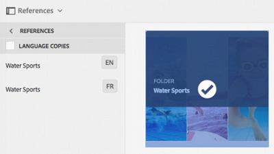

# Creare progetti di traduzione {#creating-translation-projects}

Per creare una copia per lingua, attiva uno dei seguenti flussi di lavoro per la copia della lingua disponibili nella barra Riferimenti in [!DNL Experience Manager] dell&#39;utente.

* **Creare e tradurre**: in questo flusso di lavoro, le risorse da tradurre vengono copiate nella directory principale della lingua nella quale desideri tradurre. Inoltre, a seconda delle opzioni scelte, viene creato un progetto di traduzione per le risorse nella console Progetti. A seconda delle impostazioni, il progetto di traduzione può essere avviato manualmente o può essere eseguito automaticamente non appena viene creato.

* **Aggiorna copie per lingua**: esegui questo flusso di lavoro per tradurre un gruppo aggiuntivo di risorse e includerlo in una copia per lingua specifica. In questo caso, le risorse tradotte vengono aggiunte alla cartella di destinazione che contiene già le risorse tradotte in precedenza.

>[!PREREQUISITES]
>
>* Gli utenti che creano progetti di traduzione sono membri del gruppo `projects-administrators`.
>* Il fornitore di servizi di traduzione supporta la traduzione dei file binari.

## Creare e tradurre il flusso di lavoro {#create-and-translate-workflow}

Puoi utilizzare il flusso di lavoro Crea e traduci per generare per la prima volta copie per una determinata lingua. Il flusso di lavoro fornisce le seguenti opzioni:

* Crea solo struttura.
* Crea un progetto di traduzione.
* Aggiungi a progetto di traduzione esistente.

### Crea solo struttura {#create-structure-only}

Utilizza l’opzione **[!UICONTROL Crea solo struttura]** per creare una gerarchia di cartelle di destinazione all’interno della directory principale lingua di destinazione, in modo che corrisponda alla gerarchia della cartella di origine all’interno della directory principale lingua di origine. In questo caso, le risorse di origine vengono copiate nella cartella di destinazione. Tuttavia, non viene generato alcun progetto di traduzione.

1. In [!DNL Assets] , selezionare la cartella di origine per la quale si desidera creare una struttura nella directory principale lingua di destinazione.

1. Apri **[!UICONTROL Riferimenti]** e fare clic su **[!UICONTROL Copie per lingua]** in **[!UICONTROL Copie]**.

   

1. Clic **[!UICONTROL Crea e traduci]**. Dalla sezione **[!UICONTROL Lingue di destinazione]** selezionare la lingua per la quale si desidera creare una struttura di cartelle.

1. Dall’elenco **[!UICONTROL Progetto]**, scegli **[!UICONTROL Crea solo struttura]**.

1. Fai clic su **[!UICONTROL Crea]**. La nuova struttura per la lingua di destinazione è elencata in **[!UICONTROL Copie per lingua]**.

   

1. Selezionare la struttura dall&#39;elenco, quindi fare clic su **[!UICONTROL Mostra in Assets]** per passare alla struttura di cartelle nella lingua di destinazione.

   

### Crea un progetto di traduzione {#create-a-new-translation-project}

Se utilizzi questa opzione, le risorse da tradurre vengono copiate nella directory principale della lingua in cui desideri tradurre. A seconda delle opzioni scelte, viene creato un progetto di traduzione per le risorse nella console Progetti. A seconda delle impostazioni, il progetto di traduzione può essere avviato manualmente o eseguito automaticamente non appena viene creato.

1. In [!DNL Assets] nell&#39;interfaccia utente, selezionare la cartella di origine per la quale si desidera creare una copia in lingua.
1. Apri **[!UICONTROL Riferimenti]** e fare clic su **[!UICONTROL Copie per lingua]** in **[!UICONTROL Copie]**.

   

1. Clic **[!UICONTROL Crea e traduci]** in basso.

1. Dalla sezione **[!UICONTROL Lingue di destinazione]** selezionare le lingue per le quali si desidera creare una struttura di cartelle.

1. Dalla sezione **[!UICONTROL Progetto]** elenco, seleziona **[!UICONTROL Crea un nuovo progetto di traduzione]**.

1. Nel campo **[!UICONTROL Titolo progetto]**, inserisci un titolo.

1. Fai clic su **[!UICONTROL Crea]**. [!DNL Assets] dalla cartella di origine vengono copiate nelle cartelle di destinazione per le impostazioni internazionali selezionate al passaggio 4.

   

1. Per passare alla cartella, seleziona la copia per lingua e fai clic su **[!UICONTROL Mostra in Assets]**.

   

1. Passa alla console Progetti. La cartella di traduzione viene copiata nella console Progetti.

   

1. Apri la cartella per visualizzare il progetto di traduzione.

   

1. Fai clic sul progetto per aprire la pagina dei dettagli.

   

1. Per visualizzare lo stato del processo di traduzione, fai clic sui puntini di sospensione nella parte inferiore della **[!UICONTROL Lavoro di traduzione]** affiancare.

   

   Per ulteriori dettagli sugli stati dei processi, vedi [Monitoraggio dello stato di un processo di traduzione](/help/sites-administering/tc-manage.md#monitoring-the-status-of-a-translation-job).

1. Accedi a [!DNL Assets] e aprire la [!UICONTROL Proprietà] pagina per ciascuna delle risorse tradotte per visualizzare i metadati tradotti.

   

   *Figura: Metadati tradotti nella pagina delle proprietà della risorsa.*

   >[!NOTE]
   >
   >Questa funzione è disponibile sia per le risorse che per le cartelle. Quando viene selezionata una risorsa invece di una cartella, l’intera gerarchia di cartelle fino alla directory principale della lingua viene copiata per creare una copia per lingua della risorsa.

### Aggiungi a progetto di traduzione esistente {#add-to-existing-translation-project}

Se utilizzi questa opzione, il flusso di lavoro di traduzione viene eseguito per le risorse aggiunte alla cartella di origine dopo l’esecuzione di un flusso di lavoro di traduzione precedente. Solo le risorse appena aggiunte vengono copiate nella cartella di destinazione che contiene le risorse tradotte in precedenza. In questo caso non viene creato alcun nuovo progetto di traduzione.

1. In [!DNL Assets] UI, passa alla cartella di origine che contiene le risorse non tradotte.
1. Seleziona una risorsa da tradurre e apri il **[!UICONTROL riquadro Riferimento]**. Nella sezione **[!UICONTROL Copie per lingua]** viene visualizzato il numero di copie di traduzione attualmente disponibili.
1. Clic **[!UICONTROL Copie per lingua]** in **[!UICONTROL Copie]**. Viene visualizzato un elenco delle copie di traduzione disponibili.
1. Clic **[!UICONTROL Crea e traduci]** in basso.

1. Dalla sezione **[!UICONTROL Lingue di destinazione]** selezionare le lingue per le quali si desidera creare una struttura di cartelle.

1. Dall’elenco **[!UICONTROL Progetto]**, seleziona **[!UICONTROL Aggiungi al progetto di traduzione esistente]** per eseguire il flusso di lavoro di traduzione nella cartella.

   >[!NOTE]
   >
   >Se si sceglie **[!UICONTROL Aggiungi a progetto di traduzione esistente]** , il progetto di traduzione viene aggiunto a un progetto preesistente solo se le impostazioni del progetto corrispondono esattamente a quelle del progetto preesistente. In caso contrario, viene creato un nuovo progetto.

1. Dalla sezione **[!UICONTROL Progetto di traduzione esistente]** , seleziona un progetto per aggiungere la risorsa da tradurre.

1. Fai clic su **[!UICONTROL Crea]**. Le risorse da tradurre vengono aggiunte alla cartella di destinazione. La cartella aggiornata è elencata nella sezione **[!UICONTROL Copie per lingua]**.

   

1. Passa alla console Progetti e apri il progetto di traduzione esistente aggiunto a.
1. Fai clic sul progetto di traduzione per visualizzare la pagina dei dettagli del progetto.

   

1. Fai clic sui puntini di sospensione nella parte inferiore della sezione **Lavoro di traduzione** affianca per visualizzare le risorse nel flusso di lavoro di traduzione. Nell’elenco dei processi di traduzione vengono visualizzate anche le voci per i metadati risorsa e i tag. Queste voci indicano che anche i metadati e i tag per le risorse vengono tradotti.

   >[!NOTE]
   >
   >Se elimini la voce per tag o metadati, nessun tag o metadati viene tradotto per nessuna delle risorse.

   >[!NOTE]
   >
   >Se la risorsa aggiunta al processo di traduzione include risorse secondarie, selezionale e rimuovile affinché la traduzione possa procedere senza errori.

1. Per avviare la traduzione delle risorse, fai clic sulla freccia nella **[!UICONTROL Lavoro di traduzione]** affiancare e selezionare **[!UICONTROL Inizio]** dall&#39;elenco.

   

   Un messaggio notifica l’inizio del processo di traduzione.

1. Per visualizzare lo stato del processo di traduzione, fai clic sui puntini di sospensione nella parte inferiore della **[!UICONTROL Lavoro di traduzione]** affiancare.

   

   Per ulteriori dettagli, consulta [Monitoraggio dello stato di un processo di traduzione](/help/sites-administering/tc-manage.md#monitoring-the-status-of-a-translation-job).

1. Al termine della traduzione, lo stato diventa Pronto per la revisione. Accedi a [!DNL Assets] e aprire la pagina Proprietà di ciascuna delle risorse tradotte per visualizzare i metadati tradotti.

## Aggiorna copie per lingua {#update-language-copies}

Esegui questo flusso di lavoro per tradurre qualsiasi set aggiuntivo di risorse e includerlo in una copia per lingua specifica. In questo caso, le risorse tradotte vengono aggiunte alla cartella di destinazione che contiene già le risorse tradotte in precedenza. A seconda della scelta di opzioni, viene creato un progetto di traduzione o viene aggiornato un progetto di traduzione esistente per le nuove risorse. Il flusso di lavoro Aggiorna copie per lingua include le seguenti opzioni:

* Crea un progetto di traduzione
* Aggiungi a progetto di traduzione esistente

### Crea un progetto di traduzione {#create-a-new-translation-project-1}

Se utilizzi questa opzione, viene creato un progetto di traduzione per il set di risorse per il quale desideri aggiornare una copia per lingua.

1. Dalla sezione [!DNL Assets] UI, seleziona la cartella di origine in cui hai aggiunto una risorsa.
1. Apri **[!UICONTROL Riferimenti]** e fare clic su **[!UICONTROL Copie per lingua]** in **[!UICONTROL Copie]** per visualizzare l&#39;elenco delle copie per lingua.
1. Seleziona la casella di controllo che precede **[!UICONTROL Copie per lingua]**, quindi fai clic sulla cartella di destinazione che corrisponde alle impostazioni internazionali appropriate.

   

1. Clic **[!UICONTROL Aggiorna copie per lingua]** in basso.

1. Dalla sezione **[!UICONTROL Progetto]** elenco, scegli **[!UICONTROL Crea un nuovo progetto di traduzione]**.

1. Nel campo **[!UICONTROL Titolo progetto]**, inserisci un titolo.

1. Clic **[!UICONTROL Inizio]**.
1. Passa alla console Progetti. La cartella di traduzione viene copiata nella console Progetti.

   

1. Apri la cartella per visualizzare il progetto di traduzione.

   

1. Fai clic sul progetto per aprire la pagina dei dettagli.

   

1. Per avviare la traduzione delle risorse, fai clic sulla freccia nella **[!UICONTROL Lavoro di traduzione]** affiancare e selezionare **[!UICONTROL Inizio]** dall&#39;elenco.

   

   Un messaggio notifica l’inizio del processo di traduzione.

1. Per visualizzare lo stato del processo di traduzione, fai clic sui puntini di sospensione nella parte inferiore della **[!UICONTROL Lavoro di traduzione]** affiancare.

   

   Per ulteriori dettagli sugli stati dei processi, vedi [Monitoraggio dello stato di un processo di traduzione](../sites-administering/tc-manage.md#monitoring-the-status-of-a-translation-job).

1. Accedi a [!DNL Assets] e aprire la pagina Proprietà di ciascuna delle risorse tradotte per visualizzare i metadati tradotti.

### Aggiungi a progetto di traduzione esistente {#add-to-existing-translation-project-1}

Se si utilizza questa opzione, il set di risorse viene aggiunto a un progetto di traduzione esistente per aggiornare la copia per lingua scelta.

1. Dalla sezione [!DNL Assets] UI, seleziona la cartella di origine in cui hai aggiunto una cartella di risorse.
1. Apri **[!UICONTROL Riquadro Riferimenti]** e fai clic su **[!UICONTROL Copie per lingua]** in **[!UICONTROL Copie]** per visualizzare l&#39;elenco delle copie per lingua.

   

1. Per selezionare tutte le copie della lingua, seleziona la casella di controllo che precede **[!UICONTROL Copie per lingua]**. Deseleziona le altre copie, ad eccezione della copia (o copie) per lingua corrispondente alle impostazioni internazionali verso cui vuoi tradurre.

   

1. Clic **[!UICONTROL Aggiorna copie per lingua]** in basso.

1. Dalla sezione **[!UICONTROL Progetto]** elenco, scegli **[!UICONTROL Aggiungi a progetto di traduzione esistente]**.

1. Dalla sezione **[!UICONTROL Progetto di traduzione esistente]** , seleziona un progetto per aggiungere la risorsa da tradurre.

1. Clic **[!UICONTROL Inizio]**.
1. Vedere i passaggi 9-14 di [Aggiungi a progetto di traduzione esistente](translation-projects.md#add-to-existing-translation-project) per completare il resto della procedura.

## Creare copie per lingua temporanee {#creating-temporary-language-copies}

Quando esegui un flusso di lavoro di traduzione per aggiornare una copia per lingua con le versioni modificate delle risorse originali, la copia per lingua esistente viene mantenuta finché non approvi le risorse tradotte. [!DNL Adobe Experience Manager Assets] memorizza le risorse appena tradotte in una posizione temporanea e aggiorna la copia per lingua esistente dopo l’approvazione esplicita delle risorse. Se rifiuti le risorse, la copia per lingua rimane invariata.

1. Fai clic sulla cartella principale di origine in **[!UICONTROL Copie per lingua]** per il quale è già stata creata una copia per lingua, quindi fare clic su **[!UICONTROL Mostra in Assets]** per aprire la cartella in [!DNL Experience Manager Assets].

   

1. Dalla sezione [!DNL Assets] , seleziona una risorsa già tradotta e fai clic su **[!UICONTROL Modifica]** dalla barra degli strumenti per aprire la risorsa in modalità di modifica.
1. Modifica la risorsa, quindi salva le modifiche.
1. Eseguire i passaggi 2-14 della [Aggiungi a progetto di traduzione esistente](#add-to-existing-translation-project) per aggiornare la copia per lingua.
1. Fai clic sui puntini di sospensione nella parte inferiore della sezione **[!UICONTROL Lavoro di traduzione]** affiancare. Dall’elenco delle risorse in **[!UICONTROL Lavoro di traduzione]** , puoi visualizzare chiaramente la posizione temporanea in cui è memorizzata la versione tradotta della risorsa.

   

1. Seleziona la casella di controllo accanto a **[!UICONTROL Titolo]**.
1. Dalla barra degli strumenti, fai clic su **[!UICONTROL Accetta traduzione]**  e quindi fare clic su **[!UICONTROL Accetta]** nella finestra di dialogo, per sovrascrivere la risorsa tradotta nella cartella di destinazione con la versione tradotta della risorsa modificata.

   >[!NOTE]
   >
   >Per abilitare il flusso di lavoro di traduzione per aggiornare le risorse di destinazione, accetta sia la risorsa che i metadati.

   Clic **[!UICONTROL Rifiuta traduzione]**  per mantenere la versione tradotta originariamente della risorsa nella directory principale delle impostazioni locali di destinazione e rifiutare la versione modificata.

1. Per visualizzare i metadati tradotti, passa a [!DNL Assets] e aprire la [!UICONTROL Proprietà] pagina per ciascuna delle risorse tradotte.

## Suggerimenti e limitazioni {#tips-limitations}

* Se avvii un flusso di lavoro di traduzione per risorse complesse, ad esempio PDF e [!DNL Adobe InDesign] i file, le relative risorse secondarie o le eventuali rappresentazioni non vengono inviati per la traduzione.
* Se utilizzi la traduzione automatica, i binari delle risorse non vengono tradotti.
