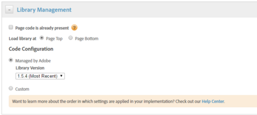

# Abilitare Assets Insights tramite DTM {#enable-asset-insights-through-dtm}

Adobe Dynamic Tag Management è uno strumento che attiva gli strumenti di marketing digitale. Viene fornito gratuitamente ai clienti Adobe Analytics. Puoi personalizzare il codice di tracciamento per consentire alle soluzioni CMS di terze parti di utilizzare Assets Insights oppure puoi utilizzare DTM per inserire i tag Assets Insights. Gli approfondimenti sono supportati e forniti solo per le immagini.

>[!CAUTION]
>
>Adobe DTM è obsoleto a favore di [!DNL Adobe Experience Platform] e presto raggiungerà [fine vita](https://medium.com/launch-by-adobe/dtm-plans-for-a-sunset-3c6aab003a6f). Adobe consiglia di: [utilizzare [!DNL Adobe Experience Platform] per approfondimenti su risorse](https://experienceleague.adobe.com/docs/experience-manager-learn/assets/advanced/asset-insights-launch-tutorial.html).

Segui questi passaggi per abilitare Assets Insights tramite DTM.

1. Fai clic sul logo dell’Experience Manager e vai a **[!UICONTROL Strumenti]** > **[!UICONTROL Risorse]** > **[!UICONTROL Configurazione approfondimenti]**.
1. [Configurare l’implementazione di Experience Manager con il Cloud Service DTM](/help/sites-administering/dtm.md)

   Il token API dovrebbe essere disponibile dopo l&#39;accesso a [https://dtm.adobe.com](https://dtm.adobe.com/) e visita **[!UICONTROL Impostazioni account]** nel profilo utente. Questo passaggio non è necessario dal punto di vista di Assets Insights, perché l’integrazione di Experience Manager Sites con Assets Insights è ancora in fase di elaborazione.

1. Accedi a [https://dtm.adobe.com](https://dtm.adobe.com/)e seleziona un’azienda, a seconda delle necessità.
1. Creare o aprire una proprietà Web esistente

   * Seleziona la **[!UICONTROL Proprietà Web]** e quindi fare clic su **[!UICONTROL Aggiungi proprietà]**.

   * Aggiorna i campi in base alle esigenze e fai clic su **[!UICONTROL Crea proprietà]**. Consulta [documentazione](https://experienceleague.adobe.com/docs/experience-manager-learn/getting-started-wknd-tutorial-develop/overview.html?lang=it).

   

1. In **[!UICONTROL Regole]** , seleziona **[!UICONTROL Regole di caricamento pagina]** dal riquadro di navigazione e fare clic su **[!UICONTROL Crea nuova regola]**.

   

1. Espandi **[!UICONTROL JavaScript/Tag di terze parti]**. Quindi fai clic su **[!UICONTROL Aggiungi nuovo script]** nel **[!UICONTROL Sequential HTML]** per aprire la finestra di dialogo Script.

   

1. Fai clic sul logo dell’Experience Manager e vai a **[!UICONTROL Strumenti]** > **[!UICONTROL Risorse]**.
1. Clic **[!UICONTROL Tracciamento pagina approfondimenti]**, copia il codice di tracciamento, quindi incollalo nella finestra di dialogo Script aperta al passaggio 6. Salva le modifiche.

   >[!NOTE]
   >
   >* `AppMeasurement.js` è stato rimosso. Dovrebbe essere disponibile tramite lo strumento Adobe Analytics di DTM.
   >* La chiamata a `assetAnalytics.dispatcher.init()` è stato rimosso. La funzione dovrebbe essere chiamata al termine del caricamento dello strumento Adobe Analytics di DTM.
   >* A seconda della posizione in cui è ospitato il tracciatore pagina di Assets Insights (ad Experience Manager, CDN e così via), l’origine dell’origine dello script potrebbe richiedere delle modifiche.
   >* Ad Experience Manager, il tracciatore di pagine in hosting, l’origine deve puntare a un’istanza Publish utilizzando il nome host dell’istanza di Dispatcher.

1. Accesso `https://dtm.adobe.com`. Clic **[!UICONTROL Panoramica]** nella proprietà web e fai clic su **[!UICONTROL Aggiungi strumento]** oppure apri uno strumento Adobe Analytics esistente. Durante la creazione dello strumento, potete impostare **[!UICONTROL Metodo di configurazione]** a **[!UICONTROL Automatico]**.

   

   Seleziona le suite di rapporti Staging/Produzione, a seconda delle necessità.

1. Espandi **[!UICONTROL Gestione libreria]** e garantire che **[!UICONTROL Carica libreria in]** è impostato su **[!UICONTROL Page Top]**.

   

1. Espandi **[!UICONTROL Personalizza codice pagina]** e fai clic su **[!UICONTROL Apri editor]**.

   

1. Incolla il seguente codice nella finestra:

   ```Java
   var sObj;
   
   if (arguments.length > 0) {
     sObj = arguments[0];
   } else {
     sObj = _satellite.getToolsByType('sc')[0].getS();
   }
   _satellite.notify('in assetAnalytics customInit');
   (function initializeAssetAnalytics() {
     if ((!!window.assetAnalytics) && (!!assetAnalytics.dispatcher)) {
       _satellite.notify('assetAnalytics ready');
       /** NOTE:
           Copy over the call to 'assetAnalytics.dispatcher.init()' from Assets Pagetracker
           Be mindful about changing the AppMeasurement object as retrieved above.
       */
       assetAnalytics.dispatcher.init(
             "",  /** RSID to send tracking-call to */
             "",  /** Tracking Server to send tracking-call to */
             "",  /** Visitor Namespace to send tracking-call to */
             "",  /** listVar to put comma-separated-list of Asset IDs for Asset Impression Events in tracking-call, for example, 'listVar1' */
             "",  /** eVar to put Asset ID for Asset Click Events in, for example, 'eVar3' */
             "",  /** event to include in tracking-calls for Asset Impression Events, for example, 'event8' */
             "",  /** event to include in tracking-calls for Asset Click Events, for example, 'event7' */
             sObj  /** [OPTIONAL] if the webpage already has an AppMeasurement object, include the object here. If unspecified, Pagetracker Core shall create its own AppMeasurement object */
             );
       sObj.usePlugins = true;
       sObj.doPlugins = assetAnalytics.core.updateContextData;
       assetAnalytics.core.optimizedAssetInsights();
     }
     else {
       _satellite.notify('assetAnalytics not available. Consider updating the Custom Page Code', 4);
     }
   })();
   ```

   * La regola di caricamento della pagina in DTM include solo `pagetracker.js` codice. Qualsiasi `assetAnalytics` I campi vengono considerati sostituzioni dei valori predefiniti. Non sono obbligatori per impostazione predefinita.
   * Le chiamate di codice `assetAnalytics.dispatcher.init()` dopo aver verificato che `_satellite.getToolsByType('sc')[0].getS()` è inizializzato e `assetAnalytics,dispatcher.init` è disponibile. Pertanto, non è necessario aggiungerla al passaggio 11.
   * Come indicato nei commenti all’interno del codice di Tracciamento pagina approfondimenti (**[!UICONTROL Strumenti > Risorse > Tracciamento pagina approfondimenti]**), quando il Tracciamento pagina non crea un `AppMeasurement` , i primi tre argomenti (RSID, Server di tracciamento e Spazio dei nomi visitatore) sono irrilevanti. Vengono invece passate stringhe vuote per evidenziarlo.\
     Gli argomenti rimanenti corrispondono a quanto configurato nella pagina Configurazione approfondimenti (**[!UICONTROL Strumenti > Risorse > Configurazione approfondimenti]**).
   * L&#39;oggetto AppMeasurement viene recuperato mediante query `satelliteLib` per tutti i motori di SiteCatalyst disponibili. Se sono configurati più tag, modifica in modo appropriato l’indice del selettore di array. Le voci nell’array sono ordinate in base agli strumenti di SiteCatalyst disponibili nell’interfaccia di DTM.

1. Salvare e chiudere la finestra dell&#39;editor di codice, quindi salvare le modifiche nella configurazione dello strumento.
1. In **[!UICONTROL Approvazioni]** , approva entrambe le approvazioni in sospeso. Il tag DTM è pronto per essere inserito nella pagina web.
