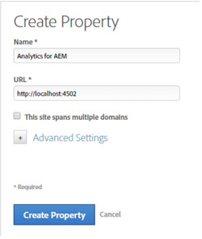

# Abilitare Assets Insights tramite DTM {#enable-asset-insights-through-dtm}

Adobe Dynamic Tag Management è uno strumento che attiva i tuoi strumenti di marketing digitale. È disponibile gratuitamente per i clienti Adobe Analytics. Puoi personalizzare il codice di tracciamento per abilitare soluzioni CMS di terze parti all’utilizzo di Asset Insights oppure puoi utilizzare DTM per inserire i tag Assets Insights. Gli approfondimenti sono supportati e forniti solo per le immagini.

>[!CAUTION]
>
>Adobe DTM è obsoleto a favore di [!DNL Adobe Experience Platform Launch] e raggiungerà presto [la fine di vita](https://medium.com/launch-by-adobe/dtm-plans-for-a-sunset-3c6aab003a6f). Adobe consiglia di [utilizzare [!DNL Launch] per informazioni sulle risorse](https://experienceleague.adobe.com/docs/experience-manager-learn/assets/advanced/asset-insights-launch-tutorial.html).

Esegui questi passaggi per abilitare Asset Insights tramite DTM.

1. Fai clic sul logo Experience Manager e vai a **[!UICONTROL Strumenti]** > **[!UICONTROL Risorse]** > **[!UICONTROL Configurazione approfondimenti]**.
1. [Configurare la distribuzione Experience Manager con il Cloud Service DTM](/help/sites-administering/dtm.md)

   Il token API dovrebbe essere disponibile dopo l&#39;accesso a [https://dtm.adobe.com](https://dtm.adobe.com/) e visitare **[!UICONTROL Impostazioni account]** nel profilo utente. Questo passaggio non è necessario dal punto di vista di Assets Insights, perché l’integrazione di Experience Manager Sites con Assets Insights è ancora in corso.

1. Accedi a [https://dtm.adobe.com](https://dtm.adobe.com/) e seleziona un&#39;azienda, a seconda dei casi.
1. Creare o aprire una proprietà Web esistente

   * Selezionare la scheda **[!UICONTROL Proprietà web]**, quindi fare clic su **[!UICONTROL Aggiungi proprietà]**.

   * Aggiorna i campi appropriati e fai clic su **[!UICONTROL Crea proprietà]**. Consulta la [documentazione](https://experienceleague.adobe.com/docs/experience-manager-learn/getting-started-wknd-tutorial-develop/overview.html).

   

1. Nella scheda **[!UICONTROL Regole]** , seleziona **[!UICONTROL Regole di caricamento pagina]** dal riquadro di navigazione e fai clic su **[!UICONTROL Crea nuova regola]**.

   

1. Espandi **[!UICONTROL JavaScript /Tag di terze parti]**. Quindi fai clic su **[!UICONTROL Aggiungi nuovo script]** nella scheda **[!UICONTROL HTML sequenziale]** per aprire la finestra di dialogo Script.

   

1. Fai clic sul logo Experience Manager e vai a **[!UICONTROL Strumenti]** > **[!UICONTROL Risorse]**.
1. Fai clic su **[!UICONTROL Tracciamento pagina approfondimenti]**, copia il codice di tracciamento, quindi incollalo nella finestra di dialogo Script aperta al passaggio 6. Salva le modifiche.

   >[!NOTE]
   >
   >* `AppMeasurement.js` viene rimosso. È previsto che sia disponibile tramite lo strumento Adobe Analytics di DTM.
   >* La chiamata a `assetAnalytics.dispatcher.init()` viene rimossa. La funzione deve essere chiamata una volta terminato il caricamento dello strumento Adobe Analytics di DTM.
   >* A seconda della posizione in cui è ospitato il Tracciamento pagina di Asset Insights (ad Experience Manager, CDN e così via), l’origine dell’origine dello script potrebbe richiedere modifiche.
   >* Ad Experience Manager, Page Tracker ospitato da , l&#39;origine dovrebbe puntare a un&#39;istanza di pubblicazione utilizzando il nome host dell&#39;istanza del dispatcher.


1. Accesso `https://dtm.adobe.com`. Fai clic su **[!UICONTROL Panoramica]** nella proprietà web e fai clic su **[!UICONTROL Aggiungi strumento]** oppure apri uno strumento Adobe Analytics esistente. Durante la creazione dello strumento, è possibile impostare **[!UICONTROL Metodo di configurazione]** su **[!UICONTROL Automatico]**.

   

   Seleziona le suite di rapporti Staging/Produzione , a seconda dei casi.

1. Espandi **[!UICONTROL Library Management]** e assicurati che **[!UICONTROL Load Library at]** sia impostato su **[!UICONTROL Page Top]**.

   

1. Espandi **[!UICONTROL Personalizza codice pagina]** e fai clic su **[!UICONTROL Apri editor]**.

   

1. Incolla il seguente codice nella finestra:

   ```Java
   var sObj;
   
   if (arguments.length > 0) {
     sObj = arguments[0];
   } else {
     sObj = _satellite.getToolsByType('sc')[0].getS();
   }
   _satellite.notify('in assetAnalytics customInit');
   (function initializeAssetAnalytics() {
     if ((!!window.assetAnalytics) && (!!assetAnalytics.dispatcher)) {
       _satellite.notify('assetAnalytics ready');
       /** NOTE:
           Copy over the call to 'assetAnalytics.dispatcher.init()' from Assets Pagetracker
           Be mindful about changing the AppMeasurement object as retrieved above.
       */
       assetAnalytics.dispatcher.init(
             "",  /** RSID to send tracking-call to */
             "",  /** Tracking Server to send tracking-call to */
             "",  /** Visitor Namespace to send tracking-call to */
             "",  /** listVar to put comma-separated-list of Asset IDs for Asset Impression Events in tracking-call, e.g. 'listVar1' */
             "",  /** eVar to put Asset ID for Asset Click Events in, e.g. 'eVar3' */
             "",  /** event to include in tracking-calls for Asset Impression Events, e.g. 'event8' */
             "",  /** event to include in tracking-calls for Asset Click Events, e.g. 'event7' */
             sObj  /** [OPTIONAL] if the webpage already has an AppMeasurement object, include the object here. If unspecified, Pagetracker Core shall create its own AppMeasurement object */
             );
       sObj.usePlugins = true;
       sObj.doPlugins = assetAnalytics.core.updateContextData;
       assetAnalytics.core.optimizedAssetInsights();
     }
     else {
       _satellite.notify('assetAnalytics not available. Consider updating the Custom Page Code', 4);
     }
   })();
   ```

   * La regola di caricamento della pagina in DTM include solo il codice `pagetracker.js`. Tutti i campi `assetAnalytics` sono considerati sostituzioni per i valori predefiniti. Non sono richieste per impostazione predefinita.
   * Il codice chiama `assetAnalytics.dispatcher.init()` dopo aver verificato che `_satellite.getToolsByType('sc')[0].getS()` sia inizializzato e che `assetAnalytics,dispatcher.init` sia disponibile. Pertanto, puoi saltare l’aggiunta al passaggio 11.
   * Come indicato nei commenti all&#39;interno del codice di tracciamento pagina approfondimenti (**[!UICONTROL Strumenti > Risorse > Tracciamento pagina approfondimenti]**), quando il tracciatore pagina non crea un oggetto `AppMeasurement`, i primi tre argomenti (RSID, Server di tracciamento e Spazio dei nomi dei visitatori) sono irrilevanti. Vengono invece passate stringhe vuote per evidenziarle.\
      Gli argomenti rimanenti corrispondono a ciò che è configurato nella pagina Configurazione approfondimenti (**[!UICONTROL Strumenti > Risorse > Configurazione approfondimenti]**).
   * L&#39;oggetto AppMeasurement viene recuperato eseguendo una query su `satelliteLib` per tutti i motori di SiteCatalyst disponibili. Se sono configurati più tag, modificare opportunamente l’indice del selettore dell’array. Le voci dell&#39;array sono ordinate in base agli strumenti di SiteCatalyst disponibili nell&#39;interfaccia DTM.

1. Salvare e chiudere la finestra Editor di codice, quindi salvare le modifiche nella configurazione dello strumento.
1. Nella scheda **[!UICONTROL Approvazioni]** , approva entrambe le approvazioni in sospeso. Il tag DTM è pronto per essere inserito nella pagina web. Per informazioni dettagliate su come inserire tag DTM nelle pagine web, consulta [Integrare DTM nei modelli di pagina personalizzati](https://blogs.adobe.com/experiencedelivers/experience-management/integrating-dtm-custom-aem6-page-template/).
