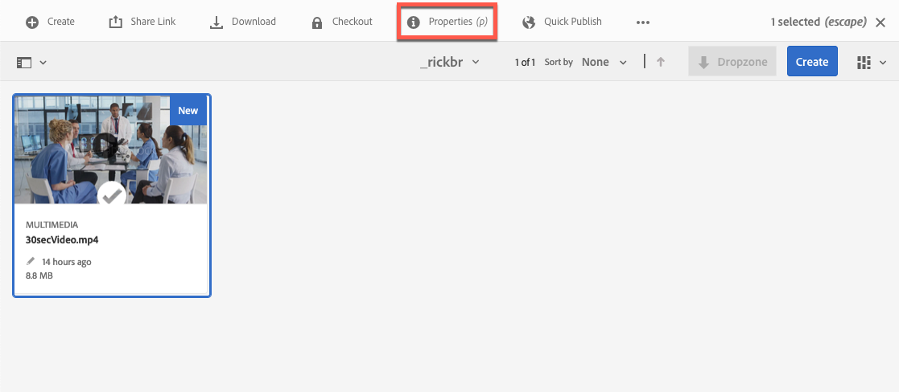
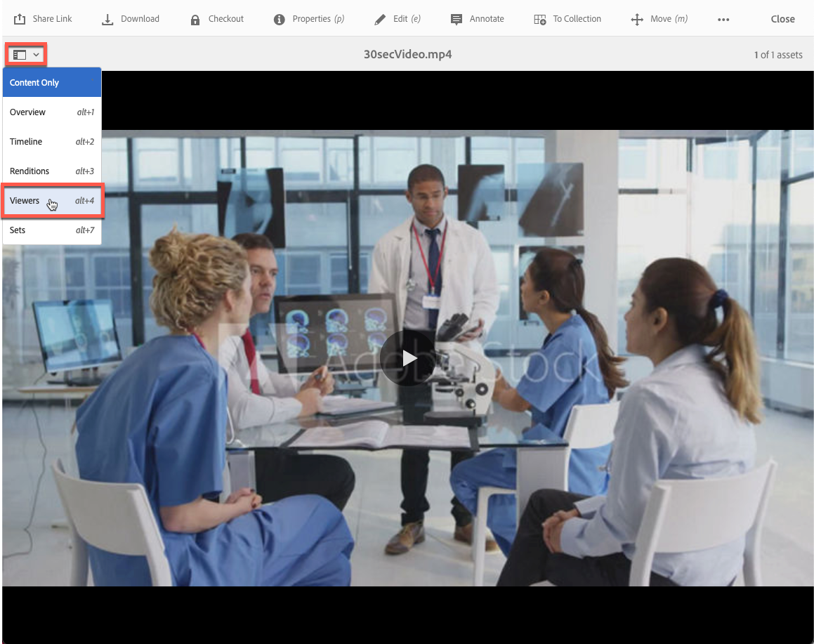

# Video in Dynamic Media {#video}

Questa sezione descrive come lavorare con i video in Dynamic Media.

## Guida introduttiva: Video {#quick-start-videos}

La seguente descrizione dettagliata del flusso di lavoro è stata progettata per aiutarti a iniziare rapidamente a utilizzare i set per video adattivi in Dynamic Media. Dopo ogni passaggio, sono disponibili riferimenti incrociati alle intestazioni degli argomenti in cui è possibile trovare ulteriori informazioni.

>[!IMPORTANT]
>
>Prima di lavorare con i video in Dynamic Media, assicurati che il tuo amministratore di Adobe Experience Manager abbia abilitato e configurato i servizi cloud per elementi multimediali dinamici in modalità Dynamic Media - Scene7 o ibrida.
>
>* Consulta [Configurare i servizi cloud Dynamic Media](/help/assets/config-dms7.md#configuring-dynamic-media-cloud-services) in Configurazione di Dynamic Media - Modalità Scene7 e [Risolvere i problemi relativi a Dynamic Media - Modalità Scene7](/help/assets/troubleshoot-dms7.md).
>
>* Consulta [Configurare i servizi cloud per elementi multimediali dinamici](/help/assets/config-dynamic.md#configuring-dynamic-media-cloud-services) in Configurazione di Dynamic Media - Modalità ibrida.
>
>Problema di riproduzione video noto corrente in Dynamic Media *solo su Experience Manager 6.5.9.0*:
>
>* Se un video pubblicato viene aggiornato, deve essere pubblicato nuovamente per riflettere le modifiche nella consegna.
>

1. **Carica i video Dynamic Media** effettuando le seguenti operazioni:

   * Crea un tuo profilo di codifica video. In alternativa, puoi semplicemente utilizzare il profilo predefinito _Codifica video adattivo_ fornito con Dynamic Media.

      * [Crea un profilo di codifica video](/help/assets/video-profiles.md#creating-a-video-encoding-profile-for-adaptive-streaming).
      * La risoluzione massima di codifica video in uscita è 8.192 × 4.320 o 4.320 × 8.192.md.
      * Ulteriori informazioni su [Best practice per la codifica video](#best-practices-for-encoding-videos).

   * Associa il profilo di elaborazione video a una o più cartelle in cui stai per caricare i video sorgente principali.

      * [Applicare un profilo video alle cartelle](/help/assets/video-profiles.md#applying-a-video-profile-to-folders).
      * Ulteriori informazioni su [Best practice per organizzare le risorse digitali per utilizzare i profili di elaborazione](/help/assets/organize-assets.md).
      * Ulteriori informazioni su [Organizzare risorse digitali](/help/assets/organize-assets.md).

   * Carica i video sorgente principali nelle cartelle. Quando aggiungi video alla cartella, questi vengono codificati in base al profilo di elaborazione video assegnato alla cartella.

      * Dynamic Media supporta principalmente video in formato breve con una lunghezza massima di 30 minuti e una risoluzione minima superiore a 25 × 25.
      * La risoluzione video in ingresso massima supportata è 16.384 × 16.384.
      * Puoi caricare file video con una capacità massima di 15 GB ciascuno.
      * [Carica i tuoi video](/help/assets/managing-video-assets.md#upload-and-preview-video-assets).
      * Ulteriori informazioni sui [Formati di file di input supportati](/help/assets/assets-formats.md#supported-multimedia-formats).

   * Monitora l&#39;avanzamento della codifica [video](#monitoring-video-encoding-and-youtube-publishing-progress) dalla visualizzazione della risorsa o del flusso di lavoro.

1. **Gestisci i video Dynamic Media** eseguendo una delle seguenti operazioni:

   * Organizzare, sfogliare e cercare risorse video

      * [Organizza risorse digitali](/help/assets/organize-assets.md)
Ulteriori informazioni su [Best practice per organizzare le risorse digitali per l&#39;utilizzo dei profili di elaborazione](organize-assets.md)

      * [Cerca risorse video](search-assets.md#custompredicates) o [Cerca risorse](/help/assets/search-assets.md)

   * Visualizzare in anteprima e pubblicare le risorse video

      * Visualizza il video sorgente e le relative rappresentazioni codificate, insieme alle miniature associate:
        [Anteprima video](managing-video-assets.md#upload-and-preview-video-assets) o [Anteprima risorse](previewing-assets.md)
        [Visualizza rappresentazioni video](video-renditions.md)
        [Gestione rappresentazioni video](manage-assets.md#managing-renditions)

      * [Gestire i predefiniti visualizzatore](managing-viewer-presets.md)
      * [Pubblicare le risorse](publishing-dynamicmedia-assets.md)

   * Utilizzare i metadati video

      * Visualizza le proprietà di un rendering video codificato come frame rate, bitrate audio e video e codec:
        [Visualizza proprietà rappresentazione video](video-renditions.md)

      * Modifica le proprietà del video come il titolo, la descrizione, i tag e i campi di metadati personalizzati:
        [Modifica proprietà video](manage-assets.md#editing-properties)

      * [Gestire i metadati per le risorse digitali](metadata.md)
      * [Schemi di metadati](metadata-schemas.md)

   * Rivedi, approva e commenta video e mantieni il controllo completo della versione

      * [Annota video](managing-video-assets.md#annotate-video-assets) o [Annota risorse](manage-assets.md#annotating)

      * [Crea una versione](manage-assets.md#asset-versioning)
      * [Applica flussi di lavoro alle risorse](assets-workflow.md) o vedi [Avvia un flusso di lavoro su una risorsa](manage-assets.md#starting-a-workflow-on-an-asset)

      * [Esaminare le risorse della cartella](bulk-approval.md)
      * [Progetti](../sites-authoring/projects.md)

1. **Pubblica i tuoi video Dynamic Media** effettuando una delle seguenti operazioni:

   * Se utilizzi Adobe Experience Manager come sistema di gestione dei contenuti web, puoi aggiungere video direttamente alle pagine web.

      * [Aggiungi video alle pagine Web](adding-dynamic-media-assets-to-pages.md).

   * Se utilizzi un sistema di gestione dei contenuti web di terze parti, puoi collegare o incorporare video nelle pagine web.

      * Integra video tramite URL:
        [Collega URL all&#39;applicazione Web](linking-urls-to-yourwebapplication.md).

      * Integra video utilizzando il codice di incorporamento in una pagina web:
        [Incorpora il visualizzatore video in una pagina Web](embed-code.md).

   * [Genera report video](#viewing-video-reports).

   * [Aggiungi didascalie al video](#adding-captions-to-video).

## Utilizzare i video in Dynamic Media {#working-with-video-in-dynamic-media}

Video in Dynamic Media è una soluzione end-to-end che consente di pubblicare facilmente video adattivi di alta qualità per lo streaming su più schermi, tra cui dispositivi mobili desktop, iOS, Android™, BlackBerry® e Windows. Un set video adattivo raggruppa le versioni dello stesso video che sono codificate in diversi formati e bit rate, ad esempio 400 kbps, 800 kbps e 1000 kbps. Il computer desktop o il dispositivo mobile rileva la larghezza di banda disponibile.

Ad esempio, su un dispositivo mobile iOS rileva una larghezza di banda, come 3G, 4G o Wi-Fi. Quindi seleziona automaticamente il video codificato giusto tra i vari bit rate video all’interno del set video adattivo. Il video viene inviato in streaming a desktop, dispositivi mobili o tablet.

Inoltre, la qualità video viene commutata automaticamente se cambiano le condizioni di rete sul desktop o sul dispositivo mobile. Inoltre, se un cliente entra in modalità a tutto schermo su un desktop, il set video adattivo risponde con una risoluzione migliore, migliorando l’esperienza di visualizzazione del cliente. I set video adattivi garantiscono una riproduzione ottimale per i clienti che visualizzano video Dynamic Media su più schermi e dispositivi.

La logica utilizzata da un lettore video per determinare quale video codificato riprodurre o selezionare durante la riproduzione si basa sul seguente algoritmo:

1. Il lettore video carica il frammento video iniziale in base al bitrate più vicino al valore impostato per &quot;bitrate iniziale&quot; nel lettore stesso.
1. Il lettore video cambia in base alle modifiche apportate alla velocità della larghezza di banda utilizzando i seguenti criteri:

   1. Il lettore sceglie il flusso di larghezza di banda più alto al di sotto o uguale alla larghezza di banda stimata.
   1. Il lettore considera solo l&#39;80% della larghezza di banda disponibile. Tuttavia, in caso di passaggio, è più prudente con solo il 70% per evitare di sovrastimare e tornare subito indietro.

Per informazioni tecniche dettagliate sull&#39;algoritmo, vedere [https://android.googlesource.com/platform/frameworks/av/+/master/media/libstagefright/httplive/LiveSession.cpp](https://android.googlesource.com/platform/frameworks/av/+/master/media/libstagefright/httplive/LiveSession.cpp)

Per la gestione di un singolo video e di set di video adattivi, sono supportati i seguenti elementi:

* Caricare video in vari formati supportati e codificarli in MP4 H.264 per la riproduzione su più schermi. È possibile utilizzare predefiniti per video adattivi, predefiniti per codifica video singola o personalizzare la propria codifica per controllare la qualità e le dimensioni del video.

   * Quando viene generato un set video adattivo, questo include video MP4.
   * **Nota**: i video principali/di origine non vengono aggiunti a un set di video adattivi.

* Sottotitoli video in tutti i visualizzatori video HTML5.
* Organizza, sfoglia e cerca video con supporto completo per i metadati, per una gestione efficiente delle risorse video.
* Distribuisci set video adattivi sul Web e su desktop e dispositivi mobili, inclusi iPhone, iPad, Android™, BlackBerry® e Windows Phone.

Lo streaming video adattivo è supportato su varie piattaforme iOS. Consulta la [Guida di riferimento per i visualizzatori Dynamic Media](https://experienceleague.adobe.com/it/docs/dynamic-media-developer-resources/library/viewers-aem-assets-dmc/video/c-html5-video-reference#video).

Dynamic Media supporta la riproduzione di video per dispositivi mobili per video MP4 H.264. <!-- LINK IS 404 WITH NO SUITABLE REPLACEMENT You can find BlackBerry&reg; devices that support this video format at the following: [Supported video formats on BlackBerry&reg;](https://support.blackberry.com/kb/articleDetail?ArticleNumber=000005482). -->

È possibile trovare i dispositivi Windows che supportano questo formato video nel seguente percorso: [Codec multimediali supportati per Windows Phone 8](https://learn.microsoft.com/en-us/windows/uwp/audio-video-camera/supported-codecs)

* Riproduci il video utilizzando i predefiniti visualizzatore video Dynamic Media, tra cui:

   * Visualizzatori video singoli.
   * Visualizzatori di file multimediali diversi che combinano contenuti sia video che immagini.

* Configura i lettori video in base alle tue esigenze di branding.
* Integra il video nel tuo sito web, sito mobile o app mobile con un semplice URL o codice da incorporare.

<!-- See [Dynamic video playback](https://s7d9.scene7.com/s7/uvideo.jsp?asset=GeoRetail/Mop_AVS&config=GeoRetail/Universal_Video1&stageSize=640,480) sample. -->

Consulta anche [Visualizzatori per Experience Manager Assets e Dynamic Media Classic](https://experienceleague.adobe.com/it/docs/dynamic-media-developer-resources/library/viewers-aem-assets-dmc/c-html5-s7-aem-asset-viewers#viewers-aem-assets-dmc) e [Visualizzatori per risorse di Experience Manager](https://experienceleague.adobe.com/it/docs/dynamic-media-developer-resources/library/viewers-for-aem-assets-only/c-html5-aem-asset-viewers#viewers-for-aem-assets-only).

## Best practice: utilizzo del visualizzatore video HTML5 {#best-practice-using-the-html-video-viewer}

I predefiniti visualizzatore video Dynamic Media HTML5 sono lettori video affidabili. È possibile utilizzarli per evitare molti problemi comuni associati alla riproduzione di video HTML5. Inoltre, problemi associati ai dispositivi mobili come la mancanza di distribuzione di streaming bitrate adattivo e la portata limitata del browser desktop.

Dal lato della progettazione del lettore, puoi progettare le funzionalità del lettore video utilizzando gli strumenti di sviluppo web standard. Ad esempio, puoi progettare pulsanti, controlli e sfondo personalizzato per le immagini del poster utilizzando HTML5 e CSS per raggiungere i clienti con un aspetto personalizzato.

Sul lato di riproduzione del visualizzatore, rileva automaticamente la funzionalità video del browser. Distribuisce quindi il video utilizzando HLS (HTTP Live Streaming) o DASH (Dynamic Adaptive Streaming over HTTP), noto anche come streaming bitrate adattivo. In alternativa, se tali metodi di distribuzione non sono presenti, viene utilizzato HTML5 progressive.

Combinando in un singolo lettore quanto segue:

* Possibilità di progettare i componenti di riproduzione utilizzando HTML5 e CSS
* Avere riproduzione incorporata
* Utilizza lo streaming adattivo e progressivo a seconda delle funzionalità del browser

È possibile estendere la portata dei contenuti rich media agli utenti desktop e mobili e garantire un&#39;esperienza video semplificata.

Vedi anche [Informazioni sui visualizzatori HTML5](https://experienceleague.adobe.com/it/docs/dynamic-media-developer-resources/library/viewers-for-aem-assets-only/c-html5-aem-asset-viewers#viewers-for-aem-assets-only).

### Riproduzione di video su computer desktop e dispositivi mobili mediante il visualizzatore video HTML5 {#playback-of-video-on-desktop-computers-and-mobile-devices-using-the-html-video-viewer}

Per lo streaming video adattivo per desktop e dispositivi mobili, i video utilizzati per il passaggio a bit rate si basano su tutti i video MP4 nel set di video adattivi.

La riproduzione video viene eseguita utilizzando DASH o HLS oppure tramite download progressivo di video. Nelle versioni precedenti di Experience Manager, come 6.0, 6.1 e 6.2, i video venivano inviati in streaming tramite HTTP.

In Experience Manager 6.3 e versioni successive, i video vengono ora inviati in streaming tramite HTTPS (ovvero DASH o HLS) perché l’URL del servizio gateway DM utilizza sempre anche HTTPS. Questo comportamento predefinito non ha alcun impatto sul cliente. Lo streaming video avviene sempre tramite HTTPS, tranne quando il browser non lo supporta. (Vedi la tabella seguente). Pertanto,

* Se disponi di un sito web HTTPS con streaming video HTTPS, lo streaming va bene.
* Se disponi di un sito web HTTP con streaming video HTTPS, lo streaming va bene e non vi sono problemi di contenuti misti dal browser web.

DASH è lo standard internazionale e HLS è uno standard Apple. Entrambi vengono utilizzati per lo streaming video adattivo. Entrambe le tecnologie regolano automaticamente la riproduzione in base alla capacità della larghezza di banda della rete. Consente inoltre al cliente di &quot;cercare&quot; in qualsiasi punto del video senza dover attendere il download del resto del video.

Il video progressivo viene distribuito scaricando e memorizzando il video localmente sul sistema desktop o sul dispositivo mobile di un utente.

La tabella seguente descrive il dispositivo, il browser e il metodo di riproduzione dei video su computer desktop e dispositivi mobili che utilizzano il visualizzatore video Dynamic Media.

<table>
 <tbody>
  <tr>
   <td><strong>Dispositivo</strong></td>
   <td><strong>Browser</strong></td>
   <td><strong>Modalità di riproduzione video</strong></td>
  </tr>
  <tr>
   <td>Desktop</td>
   <td>Internet Explorer 9 e 10</td>
   <td>Download progressivo.</td>
  </tr>
  <tr>
   <td>Desktop</td>
   <td>Internet Explorer 11+</td>
   <td>In Windows 8 e Windows 10 - Forza l’utilizzo di HTTPS ogni volta che viene richiesto DASH* o HLS. Limitazione nota: HTTP su DASH* o HLS non funziona in questa combinazione browser/sistema operativo<br /> <br /> In Windows 7 - Download progressivo. Utilizza la logica standard per selezionare il protocollo HTTP rispetto a HTTPS.</td>
  </tr>
  <tr>
   <td>Desktop</td>
   <td>Firefox 23-44</td>
   <td>Download progressivo.</td>
  </tr>
  <tr>
   <td>Desktop</td>
   <td>Firefox 45 o versione successiva</td>
   <td>Streaming bitrate adattivo DASH* o HLS.</td>
  </tr>
  <tr>
   <td>Desktop</td>
   <td>Chrome</td>
   <td>Streaming bitrate adattivo DASH* o HLS.</td>
  </tr>
  <tr>
   <td>Desktop</td>
   <td>Safari (Mac)</td>
   <td>Streaming bitrate adattivo HLS.</td>
  </tr>
  <tr>
   <td>Dispositivo mobile</td>
   <td>Chrome (Android™ 6 o versioni precedenti)</td>
   <td>Download progressivo.</td>
  </tr>
  <tr>
   <td>Dispositivo mobile</td>
   <td>Chrome (Android™ 7 o versione successiva)</td>
   <td>Streaming bitrate adattivo DASH* o HLS.</td>
  </tr>
  <tr>
   <td>Dispositivo mobile</td>
   <td>Android™ (browser predefinito)</td>
   <td>Download progressivo.</td>
  </tr>
  <tr>
   <td>Dispositivo mobile</td>
   <td>Safari (iOS)</td>
   <td>Streaming bitrate adattivo HLS.</td>
  </tr>
  <tr>
   <td>Dispositivo mobile</td>
   <td>Chrome (iOS)</td>
   <td>Streaming bitrate adattivo HLS.</td>
  </tr>
  <tr>
   <td>Dispositivo mobile</td>
   <td>Blackberry®</td>
   <td>Streaming bitrate adattivo DASH* o HLS./td&gt;
  </tr>
 </tbody>
</table>

## Architettura della soluzione video Dynamic Media {#architecture-of-dynamic-media-video-solution}

L’immagine seguente mostra il flusso di lavoro complessivo per l’authoring dei video caricati e codificati tramite DMGateway (in modalità ibrida Dynamic Media) e resi disponibili al pubblico.


## Architettura di pubblicazione ibrida per video {#hybrid-publishing-architecture-for-videos}


## Best practice per la codifica dei video {#best-practices-for-encoding-videos}

Se hai attivato Dynamic Media e hai impostato Cloud Services per i video, il flusso di lavoro **Codifica video elementi multimediali dinamici** ti consente di eseguire la codifica dei video. Questo flusso di lavoro acquisisce la cronologia del processo del flusso di lavoro e le informazioni di errore. Se hai attivato Dynamic Media e hai impostato Cloud Services per i video, il flusso di lavoro **[!UICONTROL Codifica video elementi multimediali dinamici]** viene applicato automaticamente al momento di caricare un video. Se non utilizzi Dynamic Media, viene applicato il flusso di lavoro **[!UICONTROL Risorsa di aggiornamento DAM]**.

<!-- DEAD The following are best-practice tips for encoding source video files.

For advice about video encoding, see [Video Encoding Basics](https://www.adobe.com/go/learn_s7_encoding_en).

* [Streaming 101: The Basics — Codecs, Bandwidth, Data Rate, and Resolution](https://www.adobe.com/go/learn_s7_streaming101_en). -->

### File video Source {#source-video-files}

Quando codificate un file video, utilizzate un file video sorgente della massima qualità possibile. Evita di utilizzare file video codificati in precedenza perché sono già compressi e un’ulteriore codifica crea un video di qualità inferiore.

* Dynamic Media supporta principalmente video in formato breve con una lunghezza massima di 30 minuti e una risoluzione minima superiore a 25 × 25.
* È possibile caricare file video di origine primari fino a 15 GB ciascuno.

La tabella seguente descrive le dimensioni, le proporzioni e la velocità bit minima consigliate per i file video sorgente prima di codificarli:

| Dimensione | Proporzioni | Velocità bit minima |
|--- |--- |--- |
| 1024 × 768 | 4:3 | 4500 kbps per la maggior parte dei video. |
| 1280 × 720 | 16:9 | 3000 - 6000 kbps, in base alla quantità di movimento nel video. |
| 1920 × 1080 | 16:9 | 6000 - 8000 kbps, a seconda della quantità di movimento nel video. |

### Ottenere i metadati di un file {#obtaining-a-file-s-metadata}

È possibile ottenere i metadati di un file visualizzandone i metadati mediante uno strumento di modifica video o un&#39;applicazione progettata per ottenere i metadati. Di seguito sono riportate le istruzioni per l’utilizzo di MediaInfo, un’applicazione di terze parti, per ottenere i metadati di un file video:

1. Vai a [Download di MediaInfo](https://mediaarea.net/en/MediaInfo/Download).
1. Selezionare e scaricare il programma di installazione per la versione GUI e seguire le istruzioni di installazione.
1. Dopo l&#39;installazione, fare clic con il pulsante destro del mouse sul file video (solo Windows) e selezionare MediaInfo, oppure aprire MediaInfo e trascinare il file video nell&#39;applicazione. Puoi visualizzare tutti i metadati associati al file video, compresi quelli relativi a larghezza, altezza e fps.

### Proporzioni {#aspect-ratio}

Quando selezioni o crei un predefinito di codifica video per il file video principale, assicurati che le proporzioni del predefinito corrispondano a quelle del file video principale. Le proporzioni corrispondono al rapporto tra la larghezza e l&#39;altezza del video.

Per determinare le proporzioni di un file video, recuperate i metadati del file e annotate la larghezza e l&#39;altezza del file. Consulta Ottenere i metadati di un file qui sopra. Quindi utilizza questa formula per determinare le proporzioni:

larghezza/altezza = proporzioni

Nella tabella seguente viene descritto come i risultati della formula si traducono in scelte di proporzioni comuni:

| Risultato formula | Proporzioni |
|--- |--- |
| 1,33 | 4:3 |
| 0,75 | 3:4 |
| 1,78 | 16:9 |
| 0,56 | 9:16 |

Ad esempio, un video con larghezza 1440 × altezza 1080 ha proporzioni 1440/1080 o 1,33. In questo caso, scegliete un predefinito di codifica video con proporzioni 4:3 per codificare il file video.

### Bitrate {#bitrate}

Un bitrate è la quantità di dati codificati per formare un singolo secondo di riproduzione video. Il bitrate viene misurato in kilobit al secondo (Kbps).

>[!NOTE]
>
>Poiché tutti i codec utilizzano la compressione con perdita di dati, il bitrate è il fattore più importante nella qualità video. Con la compressione con perdita di dati, più si comprime un file video, più la qualità si riduce. Per questo motivo, tutte le altre caratteristiche sono uguali (risoluzione, frame rate e codec), minore è il bitrate, minore è la qualità del file compresso.

Quando si seleziona una codifica bitrate, è possibile scegliere tra due tipi:

* **[!UICONTROL Codifica bitrate costante]** (CBR): durante la codifica CBR, il bitrate o il numero di bit al secondo viene mantenuto invariato durante tutto il processo di codifica. La codifica CBR mantiene la velocità dati impostata sull’impostazione per l’intero video. Inoltre, la codifica CBR non ottimizza i file multimediali per la qualità, ma consente di risparmiare spazio di archiviazione.
Utilizzate CBR se il video contiene un livello di movimento simile per l&#39;intero video. CBR viene utilizzato più comunemente per lo streaming di contenuti video. Vedi anche [Utilizzare parametri di codifica video personalizzati](/help/assets/video-profiles.md#using-custom-added-video-encoding-parameters).

* **[!UICONTROL Codifica bitrate variabile]** (VBR) - La codifica VBR regola la velocità dati verso il basso e al limite superiore impostato, in base ai dati richiesti dal compressore. Questa funzionalità significa che durante un processo di codifica VBR il bitrate del file multimediale aumenta o diminuisce in modo dinamico a seconda delle esigenze di bitrate del file multimediale.
La codifica VBR richiede più tempo, ma produce i risultati più favorevoli; la qualità del file multimediale è superiore. VBR viene utilizzato in genere per la distribuzione progressiva http di contenuti video.

Quando si utilizza VBR rispetto a CRB?
Quando selezioni VBR rispetto a CBR, si consiglia quasi sempre di utilizzare VBR per i file multimediali. VBR fornisce file di qualità superiore a bitrate competitivi. Quando si utilizza VBR, assicurarsi di utilizzare con la codifica a due passate e impostare il bitrate massimo su 1,5 volte il bitrate video di destinazione.

Quando scegli un predefinito di codifica video, ricorda la velocità di connessione dell’utente finale target. Scegli un predefinito con una velocità dati pari all’80% di quella velocità. Ad esempio, se la velocità di connessione dell&#39;utente finale è di 1000 Kbps, il valore predefinito migliore è 800 Kbps.

Questa tabella descrive la velocità dati delle velocità di connessione tipiche.

| Velocità (Kbps) | Tipo di connessione |
|--- |--- |
| 256 | Connessione remota. |
| 800 | Connessione mobile tipica. Per questa connessione, esegui il targeting di una velocità di dati compresa tra 400 e un massimo di 800 per le esperienze 3G. |
| 2000 | Connessione desktop a banda larga tipica. Per questa connessione, eseguire il targeting di una velocità di dati nell&#39;intervallo 800-2000 Kbps, con la maggior parte delle destinazioni in media 1200-1500 Kbps. |
| 5000 | Tipica connessione a banda larga. La codifica in questo intervallo superiore non è consigliata perché la distribuzione di video a questa velocità non è disponibile per la maggior parte dei consumatori. |

### Risoluzione {#resolution}

**La risoluzione** descrive l&#39;altezza e la larghezza in pixel di un file video. La maggior parte dei video sorgente viene memorizzata ad alta risoluzione (ad esempio, 1920 × 1080). Ai fini dello streaming, il video sorgente viene compresso a una risoluzione inferiore (640 × 480 o inferiore).

La risoluzione e la velocità dei dati sono due fattori strettamente collegati che determinano la qualità video. Per mantenere la stessa qualità video, maggiore è il numero di pixel in un file video (maggiore è la risoluzione), maggiore è la velocità dati. Ad esempio, si consideri il numero di pixel per fotogramma in un file video con risoluzione 320 × 240 e 640 × 480:

| Risoluzione | Pixel per frame |
|--- |--- |
| 320 × 240 | 76.800 |
| 640 × 480 | 307.200 |

Il file 640 × 480 ha un numero di pixel per fotogramma quattro volte superiore. Per ottenere la stessa velocità dati per queste due risoluzioni di esempio, applicate una compressione quattro volte superiore al file 640 × 480, riducendo in tal modo la qualità del video. Di conseguenza, una velocità di dati video di 250 Kbps produce una visualizzazione di alta qualità con una risoluzione di 320 × 240, ma non con una risoluzione di 640 × 480.

In generale, maggiore è la velocità dati utilizzata, migliore è l&#39;aspetto del video e maggiore è la risoluzione, maggiore è la velocità dati, maggiore è la qualità di visualizzazione (rispetto alle risoluzioni più basse).

Poiché la risoluzione e la velocità dati sono collegate, durante la codifica del video sono disponibili due opzioni:

* Scegli una velocità dati e quindi codificala alla risoluzione più alta che risulti appropriata alla velocità dati scelta.
* Scegliete una risoluzione e quindi codificate alla velocità dati necessaria per ottenere video di alta qualità alla risoluzione desiderata.

Quando scegli (o crei) un predefinito di codifica video per il file video sorgente principale, utilizza questa tabella per individuare la risoluzione corretta:

| Risoluzione | Altezza (pixel) | Dimensioni dello schermo |
|--- |--- |--- |
| 240P | 240 | Schermo piccolo |
| 300P | 300 | Schermo piccolo in genere per dispositivi mobili |
| 360P | 360 | Schermo piccolo |
| 480P | 480 | Schermata Medium |
| 720P | 720 | Schermo grande |
| 1080P | 1080 | Schermo ad alta definizione di grandi dimensioni |

La risoluzione video in ingresso massima supportata è 16.384 × 16.384. La risoluzione massima di codifica video in uscita è 8.192 × 4.320 o 4.320 × 8.192.

### Fps (frame al secondo) {#fps-frames-per-second}

Negli Stati Uniti e in Giappone, la maggior parte dei video sono registrati a 29,97 fotogrammi al secondo (fps). In Europa, lo standard è 25 fps. Il film, tuttavia, viene generalmente girato a 24 fps.

Scegli un predefinito di codifica video che corrisponda alla velocità fps del file video sorgente principale. Ad esempio, se il video sorgente principale è a 25 fps, scegliete un predefinito di codifica con 25 fps. Per impostazione predefinita, tutta la codifica personalizzata utilizza il fps del file video sorgente principale. Per questo motivo, non è necessario specificare esplicitamente l&#39;impostazione fps quando si crea un predefinito di codifica video.

### Dimensioni di codifica video {#video-encoding-dimensions}

Per risultati ottimali, seleziona dimensioni di codifica tali che il video sorgente sia un multiplo di tutti i video codificati.

Per calcolare questo rapporto, si divide la larghezza dell&#39;origine per la larghezza codificata per ottenere il rapporto di larghezza. Quindi, per ottenere il rapporto di altezza, dividi l’altezza sorgente per altezza codificata.

Se il rapporto risultante è un numero intero, significa che il video è ridimensionato in modo ottimale. Se il rapporto risultante non è un numero intero, influisce sulla qualità video lasciando sul display gli artefatti di pixel rimanenti. Questo effetto è più evidente quando il video contiene del testo.

Ad esempio, supponiamo che il video sorgente sia 1920 × 1080. Nella tabella seguente, i tre video codificati forniscono le impostazioni di codifica ottimali da utilizzare.

| Tipo di video | Larghezza × altezza | Rapporto larghezza | Rapporto altezza |
|--- |--- |--- |--- |
| Origine | 1920 × 1080 | 1 | 1 |
| Codificato | 960 × 540 | 2 | 2 |
| Codificato | 640 × 360 | 3 | 3 |
| Codificato | 480 × 270 | 4 | 4 |

### Formato file video codificato {#encoded-video-file-format}

Dynamic Media consiglia di utilizzare i predefiniti di codifica video MP4 H.264. Poiché i file MP4 utilizzano il codec video H.264, questo offre video di alta qualità ma in dimensioni di file compressi.

## Visualizzare rapporti video {#viewing-video-reports}

>[!NOTE]
>
>I rapporti video sono disponibili solo quando si esegue Dynamic Media in modalità ibrida.

I report video visualizzano diverse metriche aggregate in un determinato periodo di tempo per aiutarti a monitorare che *video pubblicati* singoli e aggregati stiano ottenendo le prestazioni previste. I seguenti dati sulle metriche principali sono aggregati per tutti i video pubblicati sull’intero sito web:

* Inizio video
* Tasso di completamento
* Tempo medio sul video
* Tempo totale su video
* Video per visita

È inoltre presente una tabella di tutti i video *pubblicati* che ti consente di tenere traccia dei video visualizzati più in alto sul tuo sito Web in base al totale degli avvii dei video.

Quando selezioni un nome video nell’elenco, viene visualizzato il rapporto di conservazione del pubblico (a discesa) del video sotto forma di un grafico a linee. Il grafico mostra il numero di visualizzazioni per un dato momento della riproduzione video. Quando si riproduce il video, la barra verticale viene sincronizzata con l&#39;indicatore di tempo nel lettore. Le cadute nei dati del grafico a linee indicano dove il pubblico abbandona il disinteresse.

Se il video è stato codificato al di fuori di Adobe Experience Manager Dynamic Media, il grafico di mantenimento del pubblico (a discesa) e i dati della percentuale di riproduzione nella tabella non sono disponibili.

Vedi anche [Configurare i servizi cloud per elementi multimediali dinamici](/help/assets/config-dynamic.md).

>[!NOTE]
>
>I dati di tracciamento e reporting si basano esclusivamente sull’utilizzo del lettore video di Dynamic Media e del relativo predefinito per lettore video. Di conseguenza, non è possibile tracciare e creare rapporti sui video riprodotti tramite altri lettori video.

Per impostazione predefinita, la prima volta che si immettono i rapporti video, il rapporto visualizza i dati video a partire dal primo del mese corrente e termina con la data del mese corrente. Tuttavia, puoi sovrascrivere l’intervallo di date predefinito specificando un intervallo di date personalizzato. Alla successiva immissione di Report video, viene utilizzato l&#39;intervallo di date specificato.

Affinché i rapporti video funzionino correttamente, viene creato automaticamente un ID suite di rapporti quando viene configurato Dynamic Media Cloud Services. Allo stesso tempo, l’ID suite di rapporti viene inviato al server di pubblicazione, in modo che sia disponibile per la funzione Copia URL quando visualizzi l’anteprima delle risorse. Tuttavia, questa funzionalità richiede che il server di pubblicazione sia già configurato. Se il server di pubblicazione non è configurato, puoi comunque eseguire la pubblicazione per visualizzare il rapporto video. Tuttavia, devi tornare alla configurazione cloud di Dynamic Media e selezionare **[!UICONTROL OK]**.

**Per visualizzare i report video:**

1. Nell&#39;angolo in alto a sinistra di Experience Manager, seleziona il logo Experience Manager, quindi nella barra a sinistra fai clic su **[!UICONTROL Strumenti]** (icona a forma di martello) > **[!UICONTROL Assets]** > **[!UICONTROL Rapporti video]**.
1. Nella pagina Rapporti video eseguire una delle operazioni seguenti:

   * Nell&#39;angolo superiore destro selezionare l&#39;icona **Aggiorna report video**.
Utilizzare Aggiorna solo se la data di fine del rapporto è il giorno corrente. In questo modo potrai vedere il tracciamento video che si è verificato dall’ultima volta che hai eseguito il rapporto.

   * Nell&#39;angolo superiore destro, seleziona l&#39;icona **Selezione data**.
Specificare l&#39;intervallo di date iniziale e finale per il quale si desidera visualizzare i dati video, quindi selezionare **[!UICONTROL Esegui report]**.

   La casella di gruppo Metriche principali identifica varie misurazioni aggregate per tutti i video *published* nel sito.

1. Nella tabella in cui sono elencati i video più pubblicati, seleziona un nome per riprodurre il video e consulta il rapporto sulla fidelizzazione del pubblico (drop-off) del video.

### Visualizzare rapporti video basati su un visualizzatore video creato con Dynamic Media HTML5 Viewer SDK {#viewing-video-reports-based-on-a-video-viewer-that-you-created-using-the-scene-hmtl-viewer-sdk}

Se utilizzi un visualizzatore video predefinito fornito da Dynamic Media, o se hai creato un predefinito visualizzatore personalizzato basato su un visualizzatore video predefinito, non sono necessari passaggi aggiuntivi per visualizzare i rapporti video. Tuttavia, se hai creato un visualizzatore video personalizzato basato sull’API SDK del visualizzatore di HTML5, procedi come segue per assicurarti che il visualizzatore video invii eventi di tracciamento ai rapporti video Dynamic Media.

Utilizza la [Guida di riferimento per i visualizzatori Dynamic Media di Adobe](https://experienceleague.adobe.com/it/docs/dynamic-media-developer-resources) e l&#39;API [HTML5 Viewer SDK](https://s7d1.scene7.com/s7sdk/3.10/docs/jsdoc/index.html) per creare visualizzatori video personalizzati.

**Per visualizzare i report video basati su un visualizzatore video creato con il visualizzatore Dynamic Media HTML5 SDK:**

1. Passa a qualsiasi risorsa video pubblicata.
1. Seleziona **[!UICONTROL Visualizzatori]** dall’elenco a discesa dell’angolo in alto a sinistra della pagina della risorsa.
1. Seleziona un predefinito visualizzatore video e copia il codice da incorporare.
1. Nel codice di incorporamento, individua la riga con la seguente:

   `videoViewer.setParam("config2", "<value>");`

   Il parametro `config2` abilita il tracciamento nei visualizzatori HTML5. È anche un predefinito specifico per l’azienda che contiene le informazioni di configurazione per Video Reporting e per le configurazioni Adobe Analytics specifiche per il cliente.

   Il valore corretto per il parametro config2 si trova sia nella funzione **[!UICONTROL Incorpora codice]** che nella copia **[!UICONTROL URL]**. Nell&#39;URL dal comando di copia **[!UICONTROL URL]**, il parametro da cercare è `&config2=<value>`. Il valore è quasi sempre `companypreset`, ma in alcuni casi può anche essere `companypreset-1`, `companypreset-2` e così via.

1. Nel codice del visualizzatore video personalizzato, aggiungi AppMeasurementBridge .jsp alla pagina del visualizzatore eseguendo le seguenti operazioni:

   * Determinare innanzitutto se è necessario il parametro `&preset`.

     Se il parametro `config2` è `companypreset`, *non* richiede `&preset=parameter`.

     Se `config2` è qualcos&#39;altro, impostare il parametro predefinito come parametro `config2`. Ad esempio, se `config2=companypreset-2`, aggiungi `&param2=companypreset-2` all&#39;URL AppMeasurmentBridge.jsp.

   * Quindi, aggiungi lo script AppMeasurementBridge.jsp:

     `<script language="javascript" type="text/javascript" src="https://s7d1.scene7.com/s7viewers/AppMeasurementBridge.jsp?company=robindallas&preset=companypreset-2"></script>`

1. Creare il componente TrackingManager eseguendo le operazioni seguenti:

   * Dopo aver chiamato `s7sdk.Util.init();`, creare un&#39;istanza di Tracking Manager per tenere traccia degli eventi aggiungendo quanto segue:

     `var trackingManager = new s7sdk.TrackingManager();`

   * Connettere i componenti a Tracking Manager effettuando le seguenti operazioni:

     Nel gestore eventi `s7sdk.Event.SDK_READY`, allegare il componente di cui si desidera tenere traccia a TrackingManager.

     Ad esempio, se il componente è `videoPlayer`, aggiungere

     `trackingManager.attach(videoPlayer);`

     per collegare il componente a trackingManager. Per tenere traccia di più visualizzatori su una pagina, utilizza più componenti di gestione del tracciamento.

   * Creare l&#39;oggetto AppMeasurementBridge aggiungendo gli elementi seguenti:

     ```
     var appMeasurementBridge = new AppMeasurementBridge(); appMeasurementBridge.setVideoPlayer(videoPlayer);
     ```

   * Aggiungi la funzione di tracciamento aggiungendo gli elementi seguenti:

     ```
     trackingManager.setCallback(appMeasurementBridge.track, 
      appMeasurementBridge);
     ```

   L&#39;oggetto appMeasurementBridge ha una funzione di tracciamento incorporata. Tuttavia, puoi fornire il tuo per supportare più sistemi di tracciamento o altre funzionalità.

<!--    For more information, see *Using the TrackingManager Component* in the *Scene7 HTML5 Viewer SDK User Guide* available for download from [Adobe Developer Connection](https://help.adobe.com/en_US/scene7/using/WSef8d5860223939e2-43dedf7012b792fc1d5-8000.html). -->


## Informazioni sul supporto di più didascalie e tracce audio per video in Dynamic Media{#about-msma}

Grazie alla funzionalità di didascalia multipla e traccia audio in Dynamic Media, è possibile aggiungere facilmente più sottotitoli e tracce audio a un video principale. Grazie a questa funzionalità, i video sono accessibili a un pubblico globale. È possibile personalizzare un singolo video principale pubblicato per un pubblico globale in più lingue e rispettare le linee guida sull’accessibilità per diverse aree geografiche. Gli autori possono anche gestire i sottotitoli e le tracce audio da una singola scheda nell’interfaccia utente.

Scheda 

Alcuni dei casi d’uso da considerare per aggiungere più didascalie e tracce audio al video principale sono i seguenti:

| Tipo | Caso d’uso |
|--- |--- |
| **Sottotitoli** | Supporto di più lingue |
|  | Testo descrittivo per accessibilità |
| **Brani audio** | Supporto di più lingue |
|  | Brani di commento |
|  | Audio descrittivo |

Tutti i formati video [supportati in Dynamic Media](/help/assets/assets-formats.md) e tutti i visualizzatori video Dynamic Media, ad eccezione del visualizzatore *Video_360* di Dynamic Media, sono supportati per l&#39;utilizzo con più didascalie e tracce audio.

### Aggiungere più didascalie e tracce audio al video {#add-msma}

Prima di aggiungere più didascalie e tracce audio al video, assicurati di avere già le seguenti informazioni:

* Dynamic Media è configurato in un ambiente AEM.
* Un profilo video [Dynamic Media viene applicato alla cartella in cui vengono acquisiti i video](/help/assets/video-profiles.md#applying-a-video-profile-to-folders).

Le didascalie e i sottotitoli aggiunti sono supportati nei formati WebVTT e Adobe `.vtt`. Inoltre, i file di traccia audio aggiunti sono supportati con il formato MP3.

>[!IMPORTANT]
>
>Tutti i video caricati *prima* dell&#39;abilitazione del supporto di didascalie multiple e tracce audio sul tuo account Dynamic Media, [devono essere rielaborati](/help/assets/processing-profiles.md#reprocessing-assets). Questo passaggio di rielaborazione video è necessario affinché siano disponibili capacità di didascalia multipla e di traccia audio. Gli URL del video continuano a funzionare e a essere riprodotti come di consueto, dopo la rielaborazione.

**Per aggiungere più didascalie e tracce audio al video:**

1. [Carica il video principale in una cartella](/help/assets/managing-video-assets.md#upload-and-preview-video-assets) a cui è già stato assegnato un profilo video.
1. Passa alla risorsa video caricata a cui desideri aggiungere più didascalie e tracce audio.
1. In modalità di selezione delle risorse, dalla Vista a elenco o dalla Vista a schede, seleziona la risorsa video.
1. Sulla barra degli strumenti, seleziona l’icona Proprietà (un cerchio con una &quot;i&quot; all’interno).
   *Risorsa video selezionata nella vista a schede.*
1. Nella pagina Proprietà del video, seleziona la scheda **[!UICONTROL Sottotitoli e tracce audio]**.

   >[!TIP]
   >Se la scheda **[!UICONTROL Sottotitoli e tracce audio]** non è visualizzata, significa che è presente uno dei due elementi seguenti:
   >
   >* Alla cartella in cui si trova il video selezionato non è assegnato alcun profilo video. In tal caso, vedere [Applicare un profilo video alla cartella](/help/assets/video-profiles.md#applying-video-profiles-to-specific-folders).
   >* In alternativa, Dynamic Media deve rielaborare il video. In questo caso, vedi [Rielabora risorse in una cartella](/help/assets/processing-profiles.md#reprocessing-assets).
   >
   >Dopo aver completato una delle attività di cui sopra, torna a questi passaggi.

   *Scheda Sottotitoli e tracce audio nella pagina Proprietà del video.*

1. (Facoltativo) Per aggiungere uno o più file di didascalia a un video, effettuate le seguenti operazioni:
   * Seleziona **[!UICONTROL Carica didascalie]**.
   * Individuare e selezionare uno o più file `.vtt` (tracce di testo video) e aprirli.
   * Affinché i sottotitoli siano visibili sul lettore multimediale, *devi* aggiungere i dettagli richiesti (metadati) su *ogni* file di sottotitoli caricato. Seleziona l’icona a forma di matita a destra del nome di un file di didascalia. Nella finestra di dialogo **Modifica didascalia**, immetti i seguenti dettagli richiesti sul file, quindi seleziona **[!UICONTROL Salva]**. Ripeti questa procedura per ogni file di didascalia caricato:

     | Metadati didascalia | Descrizione |
     |--- |--- |
     | Nome file | Il nome file predefinito è derivato dal nome file originale. Il nome del file può essere modificato solo durante il caricamento e non può essere modificato in un secondo momento. I requisiti di carattere per il nome file sono gli stessi di AEM Assets.<br>Impossibile utilizzare lo stesso nome di file per ulteriori file di didascalia e tracce audio. |
     | Lingua | Selezionare la lingua della didascalia. |
     | Tipo | Selezionare il tipo di didascalia in uso.<br>**Sottotitolo**: il testo della didascalia visualizzato con il video che traduce o trascrive la finestra di dialogo.<br>**Didascalia** - Il testo della didascalia include i rumori di sottofondo, la differenziazione degli altoparlanti e altri dettagli rilevanti. Fornisce anche la traduzione o la trascrizione della finestra di dialogo. Tutti questi aspetti rendono il contenuto più accessibile alle persone non udenti o con problemi di udito. |
     | Etichetta | Testo visualizzato per il nome della didascalia nell&#39;elenco a comparsa **[!UICONTROL Seleziona audio o sottotitoli]** nel lettore multimediale. L’etichetta è ciò che vede il cliente e corrisponde a un sottotitolo o a una traccia di didascalia. Ad esempio, `English (CC)`. |

     Se necessario, puoi modificare i metadati dei sottotitoli in un secondo momento. Quando il video viene pubblicato, questi dettagli si riflettono sugli URL pubblici nei video pubblicati.

1. (Facoltativo) Per aggiungere una o più tracce audio a un video, effettuate le seguenti operazioni:
   * Seleziona **[!UICONTROL Carica tracce audio]**.
   * Passa a uno o più file .mp3 e selezionali, quindi aprili.
   * Per visualizzare i brani audio nell&#39;elenco a comparsa **[!UICONTROL Seleziona audio o didascalia]** del lettore multimediale, è necessario *specificare* i dettagli richiesti. Questi dettagli sono necessari per *ogni* file di traccia audio aggiunto. Selezionate l&#39;icona della matita a destra del nome di un file di traccia audio. Nella finestra di dialogo **Modifica traccia audio**, immetti i dettagli richiesti seguenti, quindi seleziona **[!UICONTROL Salva]**. Ripetere questa procedura per ogni file di traccia audio caricato.

     | Metadati traccia audio | Descrizione |
     |--- |--- |
     | Nome file | Il nome file predefinito è derivato dal nome file originale. Il nome del file può essere modificato solo durante il caricamento e non può essere modificato in un secondo momento. I requisiti di carattere per il nome file sono gli stessi di AEM Assets.<br>Impossibile utilizzare lo stesso nome di file per altri file di traccia audio o di didascalia. |
     | Lingua | Selezionate la lingua della traccia audio. |
     | Tipo | Selezionate il tipo di traccia audio in uso.<br>**Originale** - La traccia audio originariamente allegata al video e rappresentata come `[Original]` nell&#39;etichetta con la lingua `English` selezionata per impostazione predefinita. Anche se è possibile modificare **[!UICONTROL Label]** e **[!UICONTROL Language]** nella finestra di dialogo **[!UICONTROL Modifica traccia audio]**, se il video principale viene rielaborato, per impostazione predefinita vengono utilizzati i valori originali.<br>**Standard** - Traccia audio aggiuntiva per una lingua diversa dall&#39;originale.<br>**Descrizione audio**: traccia audio che include anche una narrazione descrittiva delle azioni non verbali e dei gesti nel video, rendendo il contenuto più accessibile agli utenti ipovedenti. |
     | Etichetta | Testo visualizzato come nome della traccia audio nell&#39;elenco a comparsa **[!UICONTROL Seleziona audio o sottotitoli]** nel lettore multimediale. L’etichetta è ciò che il cliente vede e che corrisponde a una traccia audio. Ad esempio, `English [Original]`. L&#39;etichetta audio associata a un video è impostata su `[Original]` per impostazione predefinita. |

     Se necessario, potete modificare i metadati della traccia audio in un secondo momento. Quando il video viene pubblicato, questi dettagli si riflettono sugli URL pubblici nei video pubblicati.

1. Nell&#39;angolo superiore destro della pagina, dall&#39;elenco a discesa **[!UICONTROL Salva e chiudi]**, selezionare **[!UICONTROL Salva]**. I file vengono caricati e inizia l&#39;elaborazione dei metadati, come mostrato nella colonna **Stato** dell&#39;interfaccia.

   >[!NOTE]
   >
   >In base alle impostazioni di caching dell’istanza, l’elaborazione dei metadati può richiedere diversi minuti prima che venga visualizzata nell’anteprima e negli URL pubblicati.

1. (Facoltativo) Se hai selezionato **[!UICONTROL Salva e chiudi]** nel passaggio precedente, invece di selezionare **[!UICONTROL Salva]**, puoi comunque visualizzare lo stato di elaborazione dei file caricati. Consulta [Visualizzare lo stato del ciclo di vita dei file di didascalia e traccia audio caricati](#lifecycle-status-video).
1. (Facoltativo) Visualizza l&#39;anteprima del video prima della pubblicazione per assicurarti che i sottotitoli e l&#39;audio funzionino come previsto. Vedi [Anteprima di un video con più didascalie e tracce audio](#preview-video-audio-subtitle)
1. Pubblica il video. Consulta [Pubblicare risorse](publishing-dynamicmedia-assets.md).

#### Informazioni sull&#39;aggiunta di file di didascalia e traccia audio a un video già pubblicato

Il caricamento di ulteriori file di didascalia o di tracce audio in un video già pubblicato determina l&#39;assegnazione dello stato `Processed` a tali file. Questo stato viene applicato dopo la preparazione dei file dopo il caricamento. A questo punto, puoi visualizzare in anteprima il video in Dynamic Media per vedere o ascoltare i file appena caricati.

Dopo l&#39;anteprima, tuttavia, è necessario *pubblicare* di nuovo il video per pubblicare anche i file di didascalia o di traccia audio appena aggiunti. Dopo la pubblicazione, i sottotitoli o l’audio diventano disponibili con l’URL pubblico di Dynamic Media.

>[!NOTE]
>
>In base alle impostazioni di caching dell’istanza, gli aggiornamenti dei metadati possono richiedere alcuni minuti prima che vengano visualizzati nell’anteprima e negli URL pubblicati.

Se hai configurato Dynamic Media per la pubblicazione immediata, il caricamento di file di didascalia o audio aggiuntivi attiva immediatamente la pubblicazione del video in seguito al caricamento di file di didascalia o audio.

>[!CAUTION]
>
>Quando si caricano file di didascalia o file audio in un video pubblicato o non pubblicato, i file vengono eliminati se si [*rielabora*](/help/assets/processing-profiles.md#reprocessing-assets) il video. Solo l&#39;audio originale del video rimane intatto. In questi casi, è necessario caricare nuovamente i file di didascalia e di traccia audio nel video.

#### Aggiungere più sottotitoli a un video che ha un URL esistente con modificatore sottotitoli

Dynamic Media supporta l’aggiunta di una didascalia singola con video tramite un modificatore URL. Vedi [Aggiungere didascalie al video](#adding-captions-to-video).

Le modifiche apportate a più sottotitoli hanno la precedenza su una didascalia aggiunta tramite un modificatore URL per i video pubblicati.

**Per aggiungere più sottotitoli a un video che ha un URL esistente con modificatore di sottotitoli:**

1. Carica il file di didascalia già aggiunto come modificatore al video, in modo da poter gestire il file esplicitamente.
1. Carica eventuali file di didascalia aggiuntivi, se necessario.
1. Pubblica il video come di consueto.
L’URL esistente con il modificatore didascalia ora può caricare più didascalie.

### Visualizzare lo stato del ciclo di vita dei file di didascalia e traccia audio caricati{#lifecycle-status-video}

Puoi osservare lo stato del ciclo di vita di qualsiasi file di didascalia o traccia audio caricato nel video principale. Puoi farlo dalla scheda **Sottotitoli e tracce audio** di **Proprietà**.

**Per visualizzare lo stato del ciclo di vita di un video:**

1. Passa alla risorsa video di cui desideri visualizzare lo stato del ciclo di vita.
1. In modalità di selezione delle risorse, dalla Vista a elenco o dalla Vista a schede, seleziona la risorsa video.
1. Sulla barra degli strumenti, seleziona l’icona Proprietà (un cerchio con una &quot;i&quot; all’interno).
1. Nella pagina Proprietà, seleziona la scheda **[!UICONTROL Sottotitoli e tracce audio]**. Nella colonna Stato (Status), notate lo stato di ogni didascalia o file audio.

| Stato traccia audio o didascalia | Descrizione |
| --- | --- |
| Elaborazione | Quando viene aggiunta e salvata una nuova didascalia o un nuovo file di traccia audio, il file entra in uno stato di &quot;Elaborazione&quot;. Dynamic Media elabora il file allegando il manifesto di streaming al video principale. |
| Elaborato | Al termine dell&#39;elaborazione, il file di didascalia o di traccia audio, o la traccia audio originale associata al video principale, viene visualizzato in stato &quot;Elaborato&quot;. Puoi visualizzare in anteprima i file di didascalia e di traccia audio che appaiono come &quot;Elaborati&quot; *prima* che il video venga pubblicato live. |
| Pubblicato | Uno stato &quot;Pubblicato&quot; rappresenta uno stato simile a &quot;Pubblicato&quot; per un video principale. Le Assets vengono pubblicate quando il video principale viene pubblicato e sono disponibili sull’URL pubblico di Dynamic Media. |
| Non riuscito | Lo stato &quot;Non riuscito&quot; indica che l&#39;elaborazione di un file di didascalia o di traccia audio non è stata completata. Elimina la didascalia o il file di traccia audio e caricalo di nuovo. |
| La pagina di cui è stata annullata la pubblicazione   | Quando si annulla esplicitamente la pubblicazione di un video principale pubblicato, vengono annullati anche i file di didascalia o di traccia audio aggiunti al video. |

*Stato del ciclo di vita di ogni didascalia e file di traccia audio caricati.*

### Impostare l&#39;audio predefinito per un video con più tracce audio

Per impostazione predefinita, l&#39;audio originale di un video è impostato come audio predefinito da riprodurre.

Tuttavia, tutti i file di traccia audio caricati possono essere impostati come audio predefinito da riprodurre dopo il caricamento di un video nel visualizzatore. Nell&#39;interfaccia utente Proprietà, nella scheda **Sottotitoli e tracce audio**, l&#39;etichetta `Default` viene applicata a destra del file di traccia audio per la riproduzione video.

>[!NOTE]
>
>La riproduzione dell’audio predefinito può anche dipendere da quanto impostato nei seguenti browser:
>
>* Chrome: viene riprodotto l’audio predefinito impostato nel video.
>* Safari: se la lingua predefinita è impostata in Safari, l’audio viene riprodotto con la lingua predefinita impostata, se disponibile con il manifesto del video. In caso contrario, viene riprodotto l&#39;audio predefinito impostato come parte delle proprietà di un video.

**Per impostare l&#39;audio predefinito per un video con più tracce audio:**

1. Passa alla risorsa video di cui desideri impostare la traccia audio predefinita.
1. In modalità di selezione delle risorse, dalla Vista a elenco o dalla Vista a schede, seleziona la risorsa video.
1. Sulla barra degli strumenti, seleziona l’icona Proprietà (un cerchio con una &quot;i&quot; all’interno).
1. Nella pagina Proprietà, seleziona la scheda **[!UICONTROL Sottotitoli e tracce audio]**.
1. Sotto l&#39;intestazione **Tracce audio**, selezionare il file di traccia audio che si desidera impostare come predefinito del video.
1. Seleziona **[!UICONTROL Imposta come predefinito]**.
Nella finestra di dialogo **Imposta come predefinito**, seleziona **[!UICONTROL Sostituisci]**.

   *Impostazione della traccia audio predefinita per un video.*

1. Nell&#39;angolo superiore destro selezionare **[!UICONTROL Salva e chiudi]**.
1. Pubblica il video. Consulta [Pubblicare risorse](publishing-dynamicmedia-assets.md).

### Anteprima di un video con più didascalie e tracce audio{#preview-video-audio-subtitle}

Dopo aver caricato i file di didascalia e di traccia audio in un video ed elaborato, è possibile utilizzare il visualizzatore video Dynamic Media (o altri tipi di visualizzatore, se necessario) per visualizzare in anteprima tutte le diverse tracce. L&#39;anteprima consente di vedere l&#39;aspetto e l&#39;audio del video per i clienti e di assicurarsi che si comporti come previsto.

Se il video è soddisfacente, puoi [pubblicarlo](publishing-dynamicmedia-assets.md) utilizzando uno dei seguenti metodi.

Vedi [Incorporare il visualizzatore di video o immagini in una pagina Web](/help/assets/embed-code.md).
Consulta [Collegare gli URL all&#39;applicazione Web](/help/assets/linking-urls-to-yourwebapplication.md). Il metodo di collegamento basato su URL non è possibile se il contenuto interattivo presenta collegamenti con URL relativi, in particolare collegamenti a pagine Experience Manager Sites.
Consulta [Aggiungere Dynamic Media Assets alle pagine](/help/assets/adding-dynamic-media-assets-to-pages.md).

>[!NOTE]
>
>La scheda Anteprima Experience Manager predefinita non mostra più didascalie e tracce audio. Il motivo è che questi brani sono associati a Dynamic Media e possono essere visualizzati solo utilizzando l’anteprima del visualizzatore Dynamic Media.

**Per visualizzare in anteprima un video con più didascalie e tracce audio:**

1. In **[!UICONTROL Assets]**, passa a un video esistente a cui sono stati aggiunti più sottotitoli e tracce audio.
1. Fai clic sulla risorsa video per aprirla in modalità anteprima.
1. Nella pagina di anteprima, nell&#39;angolo superiore sinistro della pagina, seleziona l&#39;elenco a discesa, quindi seleziona **[!UICONTROL Visualizzatori]**.

   

1. Nell&#39;elenco Visualizzatori selezionare il visualizzatore che si desidera utilizzare per l&#39;anteprima video. Ad esempio, la schermata seguente mostra il visualizzatore **[!UICONTROL Video]** selezionato.

   

1. Nell&#39;angolo in basso a destra, a sinistra dell&#39;icona del volume, selezionare l&#39;icona a forma di fumetto, quindi selezionare l&#39;audio o la didascalia che si desidera ascoltare o vedere o entrambi. Se lo desideri, in Sottotitoli puoi selezionare **[!UICONTROL Disattivato]** in modo che i sottotitoli non vengano visualizzati.

   *Simulazione di un utente che seleziona l&#39;audio e la didascalia per la riproduzione del video.*

1. Per iniziare la riproduzione, seleziona il pulsante **[!UICONTROL Riproduci]** del video.
Osserva i pulsanti **[!UICONTROL URL]** e **[!UICONTROL Incorpora]** nell&#39;angolo inferiore sinistro. Utilizza questi pulsanti per [collegare l&#39;URL del video all&#39;applicazione Web](/help/assets/linking-urls-to-yourwebapplication.md) o per [incorporare il video rispettivamente in una pagina Web](/help/assets/embed-code.md).
1. Selezionare **[!UICONTROL Chiudi]** nell&#39;angolo superiore destro della pagina di anteprima.

### Eliminare i file di didascalia o di traccia audio da un video

Potete eliminare file di didascalia o di traccia audio da un video. L’eliminazione dei file di didascalia o di traccia audio pubblicati si riflette automaticamente nell’URL pubblicato del video.

Non è possibile eliminare la traccia audio originale estratta da un video principale.

**Per eliminare i file di didascalia o di traccia audio da un video:**

1. Passa alla risorsa video di cui desideri impostare la traccia audio predefinita.
1. In modalità di selezione delle risorse, dalla Vista a elenco o dalla Vista a schede, seleziona la risorsa video.
1. Sulla barra degli strumenti, seleziona l’icona Proprietà (un cerchio con una &quot;i&quot; all’interno).
1. Nella pagina Proprietà, seleziona la scheda **[!UICONTROL Sottotitoli e tracce audio]**.
1. Effettua una delle operazioni seguenti:

   * Sottotitoli: sotto l&#39;intestazione **Sottotitoli**, seleziona uno o più file di sottotitoli da eliminare dal video, quindi seleziona **[!UICONTROL Elimina]**.
   * Tracce audio - Sotto l&#39;intestazione **Tracce audio**, selezionare uno o più file di traccia audio che si desidera eliminare dal video, quindi selezionare **[!UICONTROL Elimina]**.

1. Nella finestra di dialogo Elimina selezionare **[!UICONTROL OK]**.
1. Pubblica il video.

### Scarica i file di didascalia o di traccia audio caricati in un video

Puoi scaricare uno o più file di didascalia o di traccia audio caricati per l&#39;utilizzo con un video. È possibile scaricare tutti i file selezionati come file.zip o creare una cartella di download separata per ciascun file.

Non è possibile scaricare la traccia audio originale estratta da un file principale.

**Per scaricare i file di didascalia o di traccia audio da un video:**

1. Passa alla risorsa video di cui desideri impostare la traccia audio predefinita.
1. In modalità di selezione delle risorse, dalla Vista a elenco o dalla Vista a schede, seleziona la risorsa video.
1. Sulla barra degli strumenti, seleziona l’icona Proprietà (un cerchio con una &quot;i&quot; all’interno).
1. Nella pagina Proprietà, seleziona la scheda **[!UICONTROL Sottotitoli e tracce audio]**.
1. Effettua una delle operazioni seguenti:

   * Sottotitoli: sotto l&#39;intestazione **Sottotitoli**, seleziona uno o più file di sottotitoli da scaricare dal video, quindi seleziona **[!UICONTROL Scarica]**.
   * Tracce audio - Sotto l&#39;intestazione **Tracce audio**, seleziona uno o più file di tracce audio da scaricare dal video, quindi seleziona **[!UICONTROL Scarica]**.

1. Nella finestra di dialogo Scarica impostare le opzioni seguenti:

   | Opzione | Descrizione |
   |--- |--- |
   | Salva con nome | Utilizzare il nome file predefinito specificato nel campo di testo Salva con nome oppure specificare un nome personalizzato. |
   | Crea una cartella separata per ogni risorsa | Creare una cartella per ogni file di didascalia o di traccia audio selezionato per il download. |
   | E-mail | Utilizza il tuo programma e-mail predefinito per inviare il file .zip a un indirizzo e-mail specificato. |
   | Risorse | Specifica il numero di file da scaricare e la dimensione totale combinata di tutti i file selezionati. Deselezionando questa opzione, il pulsante **[!UICONTROL Scarica]** viene disattivato, impedendo di scaricare qualsiasi file. |

1. Seleziona **[!UICONTROL Scarica]**.
1. Pubblica il video. Consulta [Pubblicare risorse](publishing-dynamicmedia-assets.md).


## Aggiungere sottotitoli codificati a un video {#adding-captions-to-video}

Puoi estendere la portata dei tuoi video ai mercati globali aggiungendo sottotitoli ai singoli video o ai set di video adattivi. Aggiungendo i sottotitoli, si evita di duplicare l&#39;audio o di utilizzare madrelingua per registrare nuovamente l&#39;audio per ogni lingua. Il video viene riprodotto nella lingua in cui è stato registrato. I sottotitoli delle lingue straniere vengono visualizzati in modo che persone di lingue diverse possano ancora comprendere la porzione audio.

I sottotitoli codificati consentono inoltre una maggiore accessibilità alle persone non udenti o ipoudenti.

>[!NOTE]
>
>Il lettore video utilizzato deve supportare la visualizzazione dei sottotitoli.

Vedi anche [Accessibilità in Dynamic Media](/help/assets/accessibility-dm.md).

Dynamic Media converte i file di didascalia in formato JSON (JavaScript Object Notation). Questa conversione ti consente di incorporare il testo JSON in una pagina web come trascrizione nascosta ma completa del video. I motori di ricerca possono quindi eseguire la ricerca per indicizzazione e indicizzare il contenuto per rendere i video più facilmente individuabili e fornire ai clienti ulteriori dettagli sul contenuto video.

Per ulteriori informazioni sull&#39;utilizzo della funzione JSON in un URL, vedere [Fornire contenuto statico (non immagine)](https://experienceleague.adobe.com/it/docs/dynamic-media-developer-resources/image-serving-api/image-serving-api/c-serving-static-nonimage-contents#image-serving-api).

**Per aggiungere sottotitoli codificati a un video:**

1. Utilizza un’applicazione o un servizio di terze parti per creare il file di sottotitoli video.

   Assicurati che il file creato segua lo standard WebVTT (Web Video Text Tracks). L&#39;estensione del nome file dei sottotitoli è `.vtt`. Ulteriori informazioni sullo standard per i sottotitoli WebVTT.

   Vedere [WebVTT: formato delle tracce di testo per video Web](https://w3c.github.io/webvtt/).

   Esistono molti siti web che offrono strumenti e servizi gratuiti e avanzati che puoi utilizzare per creare file di sottotitoli/didascalie WebVTT al di fuori di Dynamic Media. <!-- THE FOLLOWING LINK IS NO LONGER LIVE. CHECKED DECEMBER 13, 2023 For example, to create a simple video caption file with no styling, you can use the following free online caption authoring and editing tool: -->

   <!--[WebVTT Caption Maker](https://testdrive-archive.azurewebsites.net/Graphics/CaptionMaker/Default.html)

   For best results, use the tool in Internet Explorer 9 or above, Google Chrome, or Safari.

   In the tool, in the **[!UICONTROL Enter URL of video file]** field, paste the copied URL of your video file and then click **[!UICONTROL Load]**. See [Obtain a URL for an Asset](/help/assets/linking-urls-to-yourwebapplication.md#obtaining-a-url-for-an-asset) to get the URL to the video file itself which you can then paste into the **[!UICONTROL Enter URL of video file field]**. Internet Explorer, Chrome, or Safari can then natively play back the video. -->

   Seguire le istruzioni visualizzate da un sito per creare e salvare il file WebVTT. Al termine, copiare il contenuto del file di didascalia e incollarlo in un editor di testo normale e salvarlo con l&#39;estensione `.vtt`.

   >[!NOTE]
   >
   >Per il supporto globale dei sottotitoli video in più lingue, lo standard WebVTT richiede la creazione di `.vtt` file e chiamate separati per ogni lingua che si desidera supportare.

   In genere, si desidera assegnare al file di didascalia `.vtt` lo stesso nome del file video e aggiungerlo alle impostazioni locali della lingua, ad esempio -EN, -FR o -DE. In questo modo, è possibile automatizzare la generazione degli URL video utilizzando il sistema di gestione dei contenuti web esistente.

1. In Experience Manager, carica il file di didascalia WebVTT in DAM.
1. Passa alla *risorsa video pubblicata* che vuoi associare al file di didascalia caricato.

   Gli URL sono disponibili per la copia solo *dopo* la prima *pubblicazione* delle risorse.

   Consulta [Pubblicare risorse](/help/assets/publishing-dynamicmedia-assets.md).

1. Effettua una delle seguenti operazioni:

   * Per un&#39;esperienza di visualizzazione video popup, fai clic sull&#39;**[!UICONTROL URL]**. Nella finestra di dialogo URL, seleziona e copia l’URL negli Appunti, quindi trascina l’URL in un semplice editor di testo. Aggiungi all’URL copiato del video la seguente sintassi:

     `&caption=<server_path>/is/content/<path_to_caption.vtt_file,1>`

     Annotare `,1` alla fine del percorso della didascalia. Subito dopo l&#39;estensione del nome file `.vtt` nel percorso, è possibile abilitare (attivare) o disabilitare (disattivare) il pulsante dei sottotitoli codificati sulla barra del lettore video impostando rispettivamente su `,1` o `,0`.

   * Per un&#39;esperienza di visualizzazione video incorporata, selezionare **[!UICONTROL Codice di incorporamento]**. Nella finestra di dialogo Incorpora codice, seleziona e copia il codice da incorporare negli Appunti, quindi incolla il codice in un semplice editor di testo. Aggiungi il codice da incorporare copiato con la seguente sintassi:

     `videoViewer.setParam("caption","<path_to_caption.vtt_file,1>");`

     Annotare `,1` alla fine del percorso della didascalia. Subito dopo l&#39;estensione del nome file `.vtt` nel percorso, è possibile abilitare (attivare) o disabilitare (disattivare) il pulsante dei sottotitoli codificati sulla barra del lettore video impostando rispettivamente su `,1` o `,0`.

## Aggiungere marcatori capitolo al video {#adding-chapter-markers-to-video}

Per semplificare la visualizzazione e la navigazione dei video lunghi, aggiungi marcatori capitolo ai singoli video o ai set di video adattivi. Quando un utente riproduce il video, può fare clic sui contrassegni dei capitoli sulla timeline del video (nota anche come scorrimento video) per spostarsi facilmente nel punto di interesse. In alternativa, è possibile passare immediatamente a nuovi contenuti, dimostrazioni e tutorial.

>[!NOTE]
>
>Il lettore video utilizzato deve supportare l’uso dei contrassegni dei capitoli. I lettori video Dynamic Media supportano i marcatori capitolo, ma non i lettori video di terze parti.

Se lo desideri, puoi creare un visualizzatore video personalizzato con i capitoli e aggiungerlo al tuo marchio, invece di utilizzare un predefinito visualizzatore video. Per istruzioni sulla creazione di un visualizzatore HTML5 personalizzato con navigazione dei capitoli, nell&#39;API SDK del visualizzatore Adobe HTML5, fare riferimento all&#39;intestazione &quot;Personalizzazione del comportamento con i modificatori&quot; nelle classi `s7sdk.video.VideoPlayer` e `s7sdk.video.VideoScrubber`. Consulta la documentazione dell&#39;[API SDK del visualizzatore di HTML5](https://s7d1.scene7.com/s7sdk/3.10/docs/jsdoc/index.html).

<!-- If desired, you can create and brand your own custom video viewer with chapters instead of using a video viewer preset. For instructions on creating your own HTML5 viewer with chapter navigation, in the Adobe Scene7 Viewer SDK for HTML5 guide, reference the heading "Customizing Behavior Using Modifiers" under the classes `s7sdk.video.VideoPlayer` and `s7sdk.video.VideoScrubber`. The Adobe Scene7 Viewer SDK is available as a download from [Adobe Developer Connection](https://help.adobe.com/en_US/scene7/using/WSef8d5860223939e2-43dedf7012b792fc1d5-8000.html). -->

Per creare un elenco di capitoli per il video è necessario seguire le stesse procedure utilizzate per creare i sottotitoli. In altre parole, si crea un file WebVTT. Si noti, tuttavia, che questo file deve essere separato da qualsiasi file di sottotitoli WebVTT che si sta utilizzando anche; non è possibile combinare sottotitoli e capitoli in un unico file WebVTT.

L&#39;esempio seguente può essere utilizzato come esempio del formato utilizzato per creare un file WebVTT con navigazione nei capitoli:

### File WebVTT con navigazione capitolo video {#webvtt-file-with-video-chapter-navigation}

```xml
WEBVTT
Chapter 1
00:00.000 --> 01:04.364
The bicycle store behind it all.
Chapter 2
01:04.364 --> 02:00.944
Creative Cloud.
Chapter 3
02:00.944 --> 03:02.937
Ease of management for a working solution.
Chapter 4
03:02.937 --> 03:35.000
Cost-efficient access to rapidly evolving technology.
```

Nell&#39;esempio precedente, `Chapter 1` è l&#39;identificatore del cue ed è facoltativo. L&#39;ora di cue di `00:00:000 --> 01:04:364` specifica l&#39;ora di inizio e l&#39;ora di fine del capitolo, nel formato `00:00:000`. Le ultime tre cifre sono millisecondi e possono essere lasciate come `000`, se lo si desidera. Il titolo del capitolo di `The bicycle store behind it all` è la descrizione effettiva del contenuto del capitolo. L&#39;identificatore del cue, il tempo di cue iniziale e il titolo del capitolo vengono visualizzati in una finestra a comparsa del lettore video quando un utente passa il puntatore del mouse su un punto di cue visivo nella timeline del video.

Poiché si utilizza un visualizzatore video HTML5, assicurarsi che il file del capitolo creato segua lo standard WebVTT (Web Video Text Tracks). L&#39;estensione del nome file del capitolo è `.vtt`. Ulteriori informazioni sullo standard per i sottotitoli WebVTT.

Vedere [WebVTT: formato delle tracce di testo per video Web](https://w3c.github.io/webvtt/)

**Per aggiungere la navigazione del capitolo video:**

1. Salvare il file `.vtt` nella codifica UTF8 per evitare problemi con la rappresentazione dei caratteri nel testo del titolo del capitolo.

   In genere, si desidera assegnare al file del capitolo `.vtt` lo stesso nome del file video e aggiungerlo ai capitoli. In questo modo, è possibile automatizzare la generazione degli URL video utilizzando il sistema di gestione dei contenuti web esistente.
1. In Experience Manager, carica il file del capitolo WebVTT.

   Vedi [Caricamento di Assets](/help/assets/manage-assets.md#uploading-assets).

1. Effettua una delle seguenti operazioni:

   <table>
     <tbody>
      <tr>
       <td>Per un'esperienza di visualizzazione video pop-up:</td>
       <td>
       <ol>
       <li>Passa alla <i>risorsa video </i> pubblicata che desideri associare al file del capitolo caricato. Gli URL sono disponibili per la copia solo <i>dopo</i> la prima <i>pubblicazione</i> delle risorse. Vedi <a href="/help/assets/publishing-dynamicmedia-assets.md">Pubblicazione di Assets.</a></li>
       <li>Dal menu a discesa, fare clic su <strong>Visualizzatori</strong>.</li>
       <li>Nella barra a sinistra, fai clic sul nome del predefinito per visualizzatori video. Un’anteprima del video viene aperta in una pagina separata.</li>
       <li>Nella barra a sinistra, in basso, fai clic sull'<strong>URL</strong>.</li>
       <li>Nella finestra di dialogo URL, seleziona e copia l’URL negli Appunti, quindi trascina l’URL in un semplice editor di testo.</li>
       <li>Aggiungi l'URL copiato del video con la seguente sintassi per associarlo all'URL copiato nel file del capitolo:<br /> <br /> <code>&navigation=<<i>full_copied_URL_path_to_chapter_file</i>.vtt></code><br /> </li>
       </ol> </td>
      </tr>
      <tr>
       <td>Per un'esperienza di visualizzazione video incorporata,<br /> </td>
       <td>
       <ol>
       <li>Passa alla <i>risorsa video </i> pubblicata che desideri associare al file del capitolo caricato. Gli URL sono disponibili per la copia solo <i>dopo</i> la prima <i>pubblicazione</i> delle risorse. Vedi <a href="/help/assets/publishing-dynamicmedia-assets.md">Pubblicazione di Assets.</a></li>
       <li>Dal menu a discesa, fare clic su <strong>Visualizzatori</strong>.</li>
       <li>Nella barra a sinistra, fai clic sul nome del predefinito per visualizzatori video. Un’anteprima del video viene aperta in una pagina separata.</li>
       <li>Nella barra a sinistra, in basso, fai clic su <strong>Incorpora</strong>.</li>
       <li>Nella finestra di dialogo Incorpora codice, seleziona e copia l’intero codice negli Appunti, quindi incollalo in un semplice editor di testo.</li>
       <li>Aggiungi il codice di incorporamento del video con la seguente sintassi per associarlo all’URL copiato nel file del capitolo:<br /> <br /> <code>videoViewer.setParam("navigation","&lt;<i>full_copied_URL_path_to_chapter_file</i>.vtt&gt;"</code></li>
       </ol> </td>
      </tr>
     </tbody>
   </table>

## Informazioni sulle miniature video in modalità Dynamic Media - Scene7 {#about-video-thumbnails-in-dynamic-media-scene-mode}

Una miniatura video è una versione di dimensioni ridotte di un fotogramma video o di una risorsa immagine che rappresenta il video per il cliente. La miniatura serve a incoraggiare un cliente a selezionare il video.

A tutti i video in Experience Manager deve essere associata una miniatura; per eliminarla è necessario sostituirla. Per impostazione predefinita, quando caricate un video in Experience Manager, il primo fotogramma viene utilizzato come miniatura. Tuttavia, puoi personalizzare la miniatura a scopo di branding o di ricerca visiva, ad esempio. Quando si personalizza una miniatura video, è possibile riprodurre il video e metterlo in pausa sul fotogramma che si desidera utilizzare. In alternativa, puoi selezionare una risorsa immagine che hai già caricato e *pubblicato* nel tuo gestore di risorse digitali.

Un’immagine di miniatura video personalizzata selezionata da un video non viene estratta e salvata in DAM come risorsa separata e distinta. Tuttavia, una miniatura video personalizzata selezionata da una risorsa immagine esistente viene salvata in JCR. Il percorso della risorsa selezionata viene memorizzato nel nodo della risorsa video come nell’esempio di percorso seguente:

`/content/dam/*<folder_name*>/<*video_name*>/jcr:content/manualThumbnail`

La possibilità di personalizzare una miniatura video è disponibile solo dopo aver applicato un profilo video alla cartella in cui si trova il video.

Vedi anche [Informazioni sulle miniature video in Dynamic Media - Modalità ibrida](#about-video-thumbnails-in-dynamic-media-hybrid-mode).

### Aggiungi una miniatura video personalizzata {#adding-a-custom-video-thumbnail}

Questi passaggi si applicano solo a Dynamic Media in esecuzione in modalità &quot;Dynamicmedia_Scene7&quot;.

**Per aggiungere una miniatura video personalizzata:**

1. Accertati di aver già eseguito le seguenti operazioni:

   * È stata creata una cartella per le risorse video.
   * [Applica un profilo video alla cartella](/help/assets/video-profiles.md#applying-a-video-profile-to-folders).

   * [I tuoi video sono stati caricati nella cartella](/help/assets/managing-video-assets.md#upload-and-preview-video-assets).

1. Passa a una risorsa video caricata di cui desideri modificare l’immagine in miniatura.
1. In modalità di selezione delle risorse da **[!UICONTROL Vista a elenco]** o **[!UICONTROL Vista a schede]**, seleziona la risorsa video.
1. Sulla barra degli strumenti, seleziona l&#39;icona **[!UICONTROL Proprietà]** (un cerchio con una &quot;i&quot; all&#39;interno).
1. Nella pagina Proprietà del video, seleziona **[!UICONTROL Modifica miniatura]**.
1. Nella pagina Modifica miniatura eseguire una delle operazioni seguenti:

   * Per utilizzare un fotogramma del video come nuova miniatura:

      * Sulla barra degli strumenti, selezionare **[!UICONTROL Seleziona fotogramma da video]**.
      * Selezionare il pulsante Riproduci, quindi selezionare il pulsante Pausa sul fotogramma che si desidera catturare come nuova miniatura del video.

   * Per utilizzare una risorsa immagine come nuova miniatura:

      * Sulla barra degli strumenti, selezionare **[!UICONTROL Seleziona miniatura da Assets]**.
      * Seleziona **[!UICONTROL Seleziona miniatura]**.
      * Passa a una risorsa immagine caricata e pubblicata in precedenza che desideri utilizzare. La risorsa viene ridimensionata automaticamente in modo da fungere da immagine miniatura per il video.
      * Seleziona la risorsa immagine, quindi seleziona **[!UICONTROL Seleziona]**.

1. Nella pagina Modifica miniatura, seleziona **[!UICONTROL Salva modifica]**.
1. Nella pagina Proprietà del video, nell&#39;angolo superiore destro, seleziona **[!UICONTROL Salva e chiudi]**.

## Informazioni sulle miniature video in Dynamic Media: modalità ibrida {#about-video-thumbnails-in-dynamic-media-hybrid-mode}

Puoi scegliere una delle dieci immagini in miniatura generate automaticamente da Dynamic Media da aggiungere al video. Il lettore video mostra la miniatura selezionata quando una risorsa video viene utilizzata con il componente Dynamic Media nell’ambiente di authoring di Experience Manager Sites, Experience Manager Mobile o Experience Manager Screens. La miniatura funge da immagine statica che rappresenta al meglio il contenuto dell’intero video e incoraggia ulteriormente gli utenti a fare clic sul pulsante Play.

In base al tempo totale del video, Dynamic Media acquisisce dieci miniature (predefinite). Il sistema acquisisce le immagini ai seguenti intervalli video:

* 1%
* 11%
* 21%
* 31%
* 41%
* 51%
* 61%
* 71%
* 81%
* 91%

Le dieci miniature persistono, il che significa che se decidi di scegliere un’altra miniatura in un secondo momento, non è necessario rigenerare la serie. Puoi visualizzare in anteprima le dieci immagini in miniatura e quindi selezionare quella che desideri usare con il video. Se desideri impostare l’impostazione predefinita, puoi utilizzare CRXDE Lite per configurare l’intervallo di tempo in cui vengono generate le immagini in miniatura. Ad esempio, se desideri generare solo una serie di quattro immagini miniatura con spaziatura uniforme dal video, puoi configurare l’intervallo in modo che sia compreso tra 24%, 49%, 74% e 99%.

Idealmente, puoi aggiungere una miniatura video in qualsiasi momento dopo aver caricato il video, ma prima di pubblicarlo sul sito web.

Se lo desideri, puoi scegliere di caricare una miniatura personalizzata per rappresentare il video invece di utilizzare una miniatura generata da Dynamic Media. Ad esempio, puoi creare un’immagine miniatura personalizzata con il titolo del video, un’immagine di apertura accattivante o un’immagine specifica acquisita dal video. L’immagine miniatura video personalizzata caricata deve avere una risoluzione massima di 1280 × 720 pixel (larghezza minima di 640 pixel) e non superare i 2 MB.

Vedi anche [Informazioni sulle miniature video in Dynamic Media - Modalità Scene7](/help/assets/video.md#about-video-thumbnails-in-dynamic-media-scene-mode).

### Aggiungi una miniatura video {#adding-a-video-thumbnail}

Questi passaggi si applicano solo a Dynamic Media in esecuzione in modalità ibrida.

**Per aggiungere una miniatura video:**

1. Passa a una risorsa video caricata a cui desideri aggiungere una miniatura video.
1. In modalità di selezione delle risorse, dalla Vista a elenco o dalla Vista a schede, seleziona la risorsa video.
1. Sulla barra degli strumenti, selezionare l&#39;icona **[!UICONTROL Visualizza proprietà]** (un cerchio contenente una &quot;i&quot;).
1. Nella pagina Proprietà del video, seleziona **[!UICONTROL Modifica miniatura]**.
1. Nella pagina Cambia miniatura, sulla barra degli strumenti, selezionare **[!UICONTROL Seleziona fotogramma]**.

   Dynamic Media genera una serie di immagini in miniatura dal video, in base all’intervallo di tempo predefinito o personalizzato.

1. Visualizza l&#39;anteprima delle immagini in miniatura generate, quindi seleziona quella che desideri aggiungere al video.
1. Seleziona **[!UICONTROL Salva modifica]**.

   L&#39;immagine miniatura del video viene aggiornata in modo da utilizzare la miniatura selezionata. Se successivamente decidi di modificare l&#39;immagine miniatura, puoi tornare alla pagina **[!UICONTROL Cambia miniatura]** e selezionarne una nuova.

   Se imposti nuovi intervalli di tempo predefiniti o carichi un nuovo video in sostituzione di quello esistente, accertati che Dynamic Media rigeneri le miniature.

   Vedere [Configurare l&#39;intervallo di tempo predefinito per la generazione delle miniature video](#configuring-the-default-time-interval-that-video-thumbnails-are-generated).

#### Configura l&#39;intervallo di tempo predefinito per la generazione delle miniature video {#configuring-the-default-time-interval-that-video-thumbnails-are-generated}

Quando configuri e salvi il nuovo intervallo di tempo predefinito, la modifica viene applicata automaticamente solo ai video caricati in futuro. Il nuovo predefinito non viene applicato automaticamente ai video caricati in precedenza. Per i video esistenti, è necessario rigenerare le miniature.

Vedi [Aggiungere una miniatura video](#adding-a-video-thumbnail).

**Per configurare l&#39;intervallo di tempo predefinito per la generazione delle miniature video:**

1. In Experience Manager, seleziona **[!UICONTROL Strumenti]** > **[!UICONTROL Generale]** > **[!UICONTROL CRXDE Lite]**.

1. Nella pagina CRXDE Lite, nel pannello directory a sinistra, passa a `o etc/dam/imageserver/configuration/jcr:content/settings.`

   se il pannello directory non è visibile, seleziona l’icona >> a sinistra della scheda Home.

1. Nel pannello in basso a destra, nella scheda Proprietà, seleziona doppio `thumbnailtime`.
1. Nella finestra di dialogo **[!UICONTROL Modifica miniatura]**, utilizzare i campi di testo per immettere i valori dell&#39;intervallo come percentuali.

   * Selezionare l&#39;icona del segno più (+) se si desidera aggiungere uno o più campi del valore di intervallo. Se necessario, scorrere fino alla parte inferiore della finestra di dialogo per visualizzare l&#39;icona.
   * Selezionare l&#39;icona del segno meno (-) a destra di un campo del valore di intervallo per eliminarlo dall&#39;elenco.
   * Se si desidera riordinare i valori dell&#39;intervallo, selezionare l&#39;icona freccia su e l&#39;icona freccia giù.

1. Selezionare **[!UICONTROL OK]** e tornare alla scheda Proprietà.
1. Nell&#39;angolo in alto a sinistra della pagina CRXDE Lite, seleziona **[!UICONTROL Salva tutto]**, quindi seleziona l&#39;icona Indietro Home nell&#39;angolo in alto a sinistra per tornare ad Experience Manager.

   Vedi [Aggiungere una miniatura video](#adding-a-video-thumbnail).

### Aggiungi una miniatura video personalizzata {#adding-a-custom-video-thumbnail-1}

Questi passaggi si applicano solo a Dynamic Media in esecuzione in modalità ibrida.

**Per aggiungere una miniatura video personalizzata:**

1. Passa a una risorsa video caricata per aggiungere una miniatura video personalizzata.
1. In modalità di selezione delle risorse, dalla Vista a elenco o dalla Vista a schede, seleziona la risorsa video.
1. Sulla barra degli strumenti, selezionare l&#39;icona **[!UICONTROL Visualizza proprietà]** (un cerchio contenente una &quot;i&quot;).
1. Nella pagina Proprietà del video, seleziona **[!UICONTROL Modifica miniatura]**.
1. Nella pagina Cambia miniatura, sulla barra degli strumenti, selezionare **[!UICONTROL Carica nuova miniatura]**.
1. Passa alla miniatura da utilizzare, selezionala, quindi seleziona **[!UICONTROL Apri]** per iniziare a caricare l&#39;immagine in Experience Manager. Dopo il caricamento, assicurati di pubblicare l’immagine.
1. Dopo aver caricato e pubblicato correttamente l&#39;immagine, nella pagina Modifica miniatura, seleziona **[!UICONTROL Salva modifiche]**.

   La miniatura personalizzata viene aggiunta al video.

## Modificare l’URL di Dynamic Media per le risorse Dynamic Media {#manifest-urls}

I video elaborati in Dynamic Media possono essere utilizzati con visualizzatori predefiniti. Oppure, accedendo agli URL del manifesto e riproducendoli in visualizzatori personalizzati. Di seguito è riportata l’API per recuperare gli URL del manifesto di un video.

### Informazioni sull’API getVideoManifestURI

L&#39;API `getVideoManifestURI`è esposta tramite c`q-scene7-api:com.day.cq.dam.scene7.api` e può essere utilizzata per generare i seguenti URL manifesto:

```java
/**   
* Returns the manifest url for videos 
* @param resource video resource 
* @param manifestType type of video streaming manifest being requested 
* @param onlyIfPublished return a manifest only if the video is published 
* @return the manifest url for videos 
* 
* @throws Exception 
*/
@Nullable 
String getVideoManifestURI(Resource resource, ManifestType manifestType, boolean onlyIfPublished) throws Exception;
```

#### Parametri API getVideoManifestURI

Questa API accetta i tre parametri seguenti:

| Parametro | Descrizione |
| --- | --- |
| `resource` | Risorsa corrispondente al video acquisito da Dynamic Media. |
| `manifestType` | Può essere `ManifestType.DASH` o `ManifestType.HLS` |
| `onlyIfPublished` | Imposta su true se l’URI del manifesto viene generato solo se è pubblicato e disponibile sul livello di consegna. |

Per recuperare gli URL del manifesto per i video utilizzando il metodo descritto sopra, aggiungere un [profilo di codifica video](/help/assets/video-profiles.md#creating-a-video-encoding-profile-for-adaptive-streaming) a una cartella &quot;carica video&quot;. Dynamic Media elabora questi video in base alle codifiche trovate nel file di codifica video assegnato alla cartella. Ora puoi richiamare la precedente API per recuperare gli URL del manifesto per i video caricati.

### Scenari di errore

L’API restituisce null in caso di errori. Le eccezioni vengono registrate nei registri di errore di Experience Manager. Tutti gli errori registrati iniziano con `Could not generate Video Manifest URI`. Gli errori possono verificarsi nei seguenti scenari:

* `IllegalArgumentException` viene registrato per uno dei seguenti elementi:

   * Il parametro `resource` passato è nullo.
   * Il parametro `resource` passato non è un video.
   * Il parametro `manifestType` passato è nullo.
   * Il parametro `onlyIfPublished` viene passato come true, ma il video non viene pubblicato.
   * Il video non è stato acquisito utilizzando un set di video adattivi da Dynamic Media.

* `IOException` viene registrato quando si verifica un problema di connessione a Dynamic Media.
* `UnsupportedOperationException` viene registrato quando un parametro `manifestType` passato è `ManifestType.DASH`, mentre il video non è stato elaborato utilizzando il formato DASH.

Di seguito è riportato un esempio dell&#39;API precedente che utilizza i servlet scritti nella specifica *HTTPWhiteBoard*. Seleziona ogni scheda per la sintassi del codice.

>[!BEGINTABS]

>[!TAB Aggiungi dipendenza in pom.xml]

+++**Aggiungi dipendenza in pom.xml** 

```java
dependency> 
     <groupId>com.day.cq.dam</groupId> 
     <artifactId>cq-scene7-api</artifactId> 
     <version>5.12.64</version> 
     <scope>provided</scope> 
</dependency> 
```

+++

>[!TAB Servlet di esempio]

+++**Servlet di esempio** 

```java
@Component
        service = Servlet.class 
) 
@HttpWhiteboardServletPattern(value = ManifestServlet.SERVLET_PATTERN) 
@HttpWhiteboardContextSelect(value = Constants.SERVLET_CONTEXT_SELECTOR) 
public class ManifestServlet extends HttpServlet { 

   private static final Logger LOGGER = LoggerFactory.getLogger(ManifestServlet.class); 

   private final ObjectMapper objectMapper; 

    @Reference 
    private Scene7Service scene7Service; 

   public static final String SERVLET_PATTERN = Constants.VIDEO_API_PREFIX + "/manifestUrl"; 

   public ManifestServlet() {
         this.objectMapper = new ObjectMapper(); 
         objectMapper.setSerializationInclusion(JsonInclude.Include.NON_NULL); 
   }

   @Override 

   protected void doGet(HttpServletRequest request, HttpServletResponse response) throws IOException {
        final ResourceResolver resolver = getResourceResolver(request); 
        String assetPath = request.getParameter("assetPath"); 
        String manifest = request.getParameter("manifestType"); 
        String onlyIfPublished = request.getParameter("onlyIfPublished"); 
        Resource resource = resolver.getResource(assetPath); 
        response.setCharacterEncoding(StandardCharsets.UTF_8.toString()); 
        response.setContentType("application/json"); 
        if(resource == null) { 
            LOGGER.info("could not retrieve the resource from JCR"); 
            error("could not retrieve the resource from JCR", response); 
            return; 
        }

        String manifestUri = null; 

        try{ 
            ManifestType manifestType =  ManifestType.DASH; 
            if(manifest != null) { 
                manifestType = ManifestType.valueOf(manifest); 
            } 
            manifestUri = scene7Service.getVideoManifestURI(resource, manifestType, onlyIfPublished != null); 
            objectMapper.writeValue(response.getWriter(), new ManifestUrl(manifestUri)); 
            response.setContentType("application/json"); 
        } catch (Exception e) { 
            LOGGER.error(e.getMessage(), e); 
            error(String.format("Unable to get the manifest url for %s. %s", assetPath, e.getMessage()), response); 
        } 
    } 

    private ResourceResolver getResourceResolver(HttpServletRequest request) { 
        Object rr = request.getAttribute(AuthenticationSupport.REQUEST_ATTRIBUTE_RESOLVER); 
        if (!(rr instanceof ResourceResolver)) { 
            throw new IllegalStateException( 
                    "The request does not seem to have been created via Apache Sling's authentication mechanism."); 
        } else { 
            return (ResourceResolver) rr; 
        } 
    } 

    private void error(String errorMessage, HttpServletResponse response) throws IOException { 
        ManifestUrl errorManifest = new ManifestUrl(null); 
        errorManifest.setErrorMessage(errorMessage); 
        response.setStatus(HttpServletResponse.SC_INTERNAL_SERVER_ERROR); 
        objectMapper.writeValue(response.getWriter(), errorManifest); 
    } 
} 
```

+++

>[!TAB Classe di risposta per il servlet]

+++**Classe di risposta per il servlet** 

```java
public class ManifestUrl extends VideoResponse { 
     String manifestUrl; 
     public ManifestUrl(String manifestUrl) { 
         this.manifestUrl = manifestUrl; 
     } 
     public String getManifestUrl() { 
         return manifestUrl; 
     } 
} 

public abstract class VideoResponse { 
     String errorString; 

     public String getErrorString() { 
         return errorString; 
     } 

     public void setErrorMessage(String errorString) { 
         this.errorString = errorString; 
     } 
} 
```

+++

>[!TAB File delle costanti a cui si fa riferimento nel servlet]

+++**File delle costanti a cui si fa riferimento nel servlet** 

```java
public final class Constants { 

     private Constants() { 
     } 

     public static final String VIDEO_API_PREFIX = "/dynamicmedia/video"; 
     public static final String SERVLET_CONTEXT_SELECTOR = "(" + HttpWhiteboardConstants.HTTP_WHITEBOARD_CONTEXT_NAME + "=" + 
             DMSampleApiHttpContext.CONTEXT_NAME + ")"; 

 } 
```

+++

>[!TAB ContestoServlet]

+++**ContestoServlet** 

Montare il servlet di cui sopra utilizzando `servletContext`. Di seguito è riportato un esempio di `servletContext`.

```java
public class DMSampleApiHttpContext extends ServletContextHelper { 

 public static final String CONTEXT_NAME = "com.adobe.dmSample"; 
 public static final String CONTEXT_PATH = "/dmSample"; 

 private final MimeTypeService mimeTypeService; 

 private final AuthenticationSupport authenticationSupport; 

 /** 
  * Constructs a new context that will use the given dependencies. 
  * 
  * @param mimeTypeService Used when providing mime type of requests. 
  * @param authenticationSupport Used to authenticate requests with sling. 
  */ 
 @Activate 
 public DMSampleApiHttpContext(@Reference final MimeTypeService mimeTypeService, 
                               @Reference final AuthenticationSupport authenticationSupport) { 
     this.mimeTypeService = mimeTypeService; 
     this.authenticationSupport = authenticationSupport; 
 } 

 // ---------- HttpContext interface ---------------------------------------- 
 /** 
  * Returns the MIME type as resolved by the <code>MimeTypeService</code> or 
  * <code>null</code> if the service is not available. 
  */ 
 @Override 
 public String getMimeType(String name) { 
     MimeTypeService mtservice = mimeTypeService; 
     if (mtservice != null) { 
         return mtservice.getMimeType(name); 
     } 
     return null; 
 } 

 /** 
  * Returns the real context path that is used to mount this context. 
  * @param req servlet request 
  * @return the context path 
  */ 
 public static String getRealContextPath(HttpServletRequest req) { 
     final String path = req.getContextPath(); 
     if (path.equals(CONTEXT_PATH)) { 
         return ""; 
     } 
     return path.substring(CONTEXT_PATH.length()); 
 } 

 /** 
  * Returns a request wrapper that transforms the context path back to the original one 
  * @param req request 
  * @return the request wrapper 
  */ 
 public static HttpServletRequest createContextPathAdapterRequest(HttpServletRequest req) { 
     return new HttpServletRequestWrapper(req) { 

         @Override 
         public String getContextPath() { 
             return getRealContextPath((HttpServletRequest) getRequest()); 
         } 

     }; 

 } 

 /** 
  * Always returns <code>null</code> because resources are all provided 
  * through individual endpoint implementations. 
  */ 
 @Override 
 public URL getResource(String name) { 
     return null; 
 } 

 /** 
  * Tries to authenticate the request using the 
  * <code>SlingAuthenticator</code>. If the authenticator or the Repository 
  * is missing this method returns <code>false</code> and sends a 503/SERVICE 
  * UNAVAILABLE status back to the client. 
  */ 
 @Override 
 public boolean handleSecurity(HttpServletRequest request, 
                               HttpServletResponse response) throws IOException { 

     final AuthenticationSupport authenticator = this.authenticationSupport; 
     if (authenticator != null) { 
         return authenticator.handleSecurity(createContextPathAdapterRequest(request), response); 
     } 

     // send 503/SERVICE UNAVAILABLE, flush to ensure delivery 
     response.sendError(HttpServletResponse.SC_SERVICE_UNAVAILABLE, 
             "AuthenticationSupport service missing. Cannot authenticate request."); 
     response.flushBuffer(); 

     // terminate this request now 
     return false; 
 } 
}
```

+++

>[!ENDTABS]

### Utilizza il servlet di esempio

Il servlet viene richiamato eseguendo un&#39;operazione `GET` in `/dmSample/dynamicmedia/video/manifestUrl`. Vengono passati i seguenti parametri di query:

| Parametro query | Descrizione |
| --- | --- |
| `assetPath` | Obbligatorio Percorso del video per il quale viene generato `manifestUrl`. |
| `manifestType` | Facoltativo. Il parametro può essere DASH o HLS. Se non viene passato, per impostazione predefinita viene usato il DASH. |
| `onlyIfPublished` | Facoltativo. Se passato, `manifestUrl` viene restituito solo se il video è pubblicato. |

In questo esempio, si supponga di effettuare le seguenti operazioni di impostazione:

* L&#39;azienda è `samplecompany`.
* L&#39;istanza di authoring è `http://sample-aem-author.com`.
* Alla cartella `/content/dam/video-example` è applicato un profilo di codifica video.
* Il video `scenery.mp4` è stato caricato nella cartella `/content/dam/video-example`.

Puoi richiamare il servlet nei seguenti modi:

| Tipo | Descrizione |
| :--- | --- |
| HLS | `http://sample-aem-author.com/dmSample/dynamicmedia/video/manifestUrl?manifestType=HLS&assetPath=/content/dam/video-example/scenery.mp4`<br><br>Se la consegna DASH è abilitata:<br>`{"manifestUrl":"https://s7d1.scene7.com/is/content/samplecompany/scenery-AVS.m3u8?packagedStreaming=true"}`<br><br>Se la consegna DASH è disabilitata:<br>`{"manifestUrl":"https://s7d1.scene7.com/is/content/samplecompany/scenery-AVS.m3u8"}` |
| TRATTINO | `http://sample-aem-author.com/dmSample/dynamicmedia/video/manifestUrl?manifestType=DASH&assetPath=/content/dam/video-example/scenery.mp4`<br><br>Se la consegna DASH è abilitata:<br>`{"manifestUrl":"https://s7d1.scene7.com/is/content/samplecompany/scenery-AVS.mpd"}`<br><br>Se la consegna DASH è disabilitata:<br>`{}` |
| Errore: percorso risorsa errato | `http://sample-aem-author.com/dmSample/dynamicmedia/video/manifestUrl?manifestType=DASH&assetPath=/content/dam/video-example/scennnnnnery.mp4`<br><br>`{"errorString":"could not retrieve the resource from JCR"}` |


<!-- OBSOLETE. REMOVED AS PER EMAIL FROM RIYA MIDHA ON WEDNESDAY, MARCH 5, 2025

### Enable DASH, multiple caption and audio track support on your Dynamic Media account {#enable-dash}

**About enabling DASH on your account**
DASH (Digital Adaptive Streaming over HTTP) is the international standard for video streaming and is widely adopted across different video viewers. When DASH is enabled on your account, you get the option to choose from either DASH or HLS for adaptive video streaming. Or, you can opt for both with automatic switching between players when **[!UICONTROL auto]** is selected as the playback type in the Viewer preset.

Some key benefits from enabling DASH on your account include the following:
     
* Package DASH stream video for adaptive bitrate streaming. This method leads to higher efficiency of delivery. Adaptive streaming ensures the best viewing experience for your customers.
* Browser optimized streaming with Dynamic Media players switches between HLS and DASH streaming to ensure the best quality of service. The video player auto-switches to HLS when a Safari browser is used.
* You can configure your preferred streaming method (HLS or DASH) by editing the video viewer preset.
* Optimized video encoding ensures that no additional storage is used while enabling DASH capability. A single set of video encodings are created for both HLS and DASH to optimize video storage costs.
* Helps make video delivery more accessible for your customers.
* Get the streaming URL by way of APIs, too.

Enabling DASH on your account requires two steps: 

* Configuring Dynamic Media to use DASH, which you can easily do yourself.
* Configuring Experience Manager 6.5 to use DASH which is done by way of an Adobe Customer Support case that you create and submit.

When you create an Adobe Support case to enable DASH on your account, multiple caption and audio track support is automatically enabled as well. Once activated, all newly uploaded videos are processed using an updated backend architecture that supports adding multiple caption and audio tracks.

>[!IMPORTANT]
>
>Any videos that you uploaded *before* enabling multiple caption and audio track support on your Dynamic Media account, [must be reprocessed](/help/assets/processing-profiles.md#reprocessing-assets). This video reprocessing step is necessary so that multiple caption and audio track capability is available to them. The video URLs continue to work and play as usual, after reprocessing.

**To enable DASH, multiple caption and multiple audio track support on your Dynamic Media account:**

<!-- 1. **Configure Dynamic Media for DASH** - In Dynamic Media on Experience Manager 6.5, navigate to [https://localhost:4502/system/console/configMgr](https://localhost:4502/system/console/configMgr).

1. Search for **AEM Assets Dynamic Media Video Advanced Streaming** feature flag.
1. To enable (turn on) DASH, select the checkbox.
1. Begin by **configuring Dynamic Media for DASH** - From Experience Manager, navigate to **[!UICONTROL Tools]** > **[!UICONTROL Operations]** > **[!UICONTROL Web Console]**.

1. From the **[!UICONTROL Adobe Experience Manager Web Console Configuration]** page, scroll to the name *AEM Assets Dynamic Media Video Advanced Streaming Feature Flag*.

1. To the left of the name, select the checkbox to enable (turn on) DASH.

1. Select **[!UICONTROL Save]**.

1. Now, use the Admin Console to start the [creation of a new support case](https://helpx.adobe.com/it/enterprise/using/support-for-experience-cloud.html).
1. To create a support case, follow the instructions while ensuring you provide the following information:

    * Primary contact name, email, phone.
    * Name of your Dynamic Media account.
    * Specify that you want DASH, multiple caption and multiple audio track support enabled on your Dynamic Media account, on Experience Manager 6.5.
   
1. Adobe Customer Support adds you to the Customer Wait List based on the order in which requests are submitted.
1. When Adobe is ready to handle your request, Customer Support contacts you to coordinate and set a target date for enablement.
1. Customer support notifies you after completion.
1. Now, you can do either one of the following:

    * Create your [video viewer preset](/help/assets/managing-viewer-presets.md#creating-a-new-viewer-preset) as usual.
    * [Add multiple caption and audio tracks](#add-msma) to your video. -->


