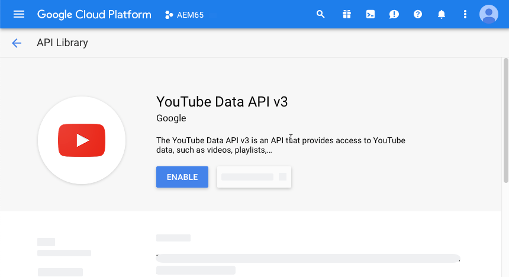

# Video in Dynamic Media {#video}

Questa sezione descrive come lavorare con i video in Dynamic Media.

## Avvio rapido: Video {#quick-start-videos}

La seguente descrizione dettagliata del flusso di lavoro è stata progettata per aiutarti a iniziare rapidamente a usare i set di video adattivi in Dynamic Media. Dopo ogni passaggio, sono presenti riferimenti incrociati alle intestazioni degli argomenti in cui è possibile trovare ulteriori informazioni.

>[!IMPORTANT]
>
>Prima di lavorare con i video in Dynamic Media, accertati che il tuo amministratore Adobe Experience Manager abbia già abilitato e configurato i Cloud Services Dynamic Media in modalità Dynamic Media - Scene7 o Dynamic Media - Hybrid.
>
>* Consulta [Configurare Cloud Services Dynamic Media](/help/assets/config-dms7.md#configuring-dynamic-media-cloud-services) in Configurazione di Dynamic Media - Modalità Scene7 e [Risoluzione dei problemi relativi a Dynamic Media - Modalità Scene7](/help/assets/troubleshoot-dms7.md).
   >
   >
* Consulta [Configurare Cloud Services Dynamic Media](/help/assets/config-dynamic.md#configuring-dynamic-media-cloud-services) in Configurazione di Dynamic Media - Modalità ibrida.
>
>
Problemi di riproduzione video attualmente noti in Dynamic Media *solo in Experience Manager 6.5.9.0*:
>
>* 

   <!-- CQDOC-18116 -->You cannot play video renditions from the asset's Details page on Experience Manager - Dynamic Media running in hybrid mode.
>* 

   <!-- CQDOC-18116 -->You cannot stream videos on Experience Manager - Dynamic Media running in hybrid mode.
>


1. **Carica i** video Dynamic Media facendo quanto segue:

   * Crea il tuo profilo di codifica video. Oppure, puoi semplicemente utilizzare il profilo predefinito _Codifica video adattiva_ fornito con Dynamic Media.

      * [Crea un profilo di codifica video](/help/assets/video-profiles.md#creating-a-video-encoding-profile-for-adaptive-streaming).
      * Ulteriori informazioni su [Best practice per la codifica video](#best-practices-for-encoding-videos).
   * Associa il profilo di elaborazione video a una o più cartelle in cui stai per caricare i video sorgente principali.

      * [Applicare un profilo video alle cartelle](/help/assets/video-profiles.md#applying-a-video-profile-to-folders).
      * Ulteriori informazioni sulle [Best practice per organizzare le risorse digitali per l&#39;utilizzo dei profili di elaborazione](/help/assets/organize-assets.md).
      * Ulteriori informazioni su [Organizzare risorse digitali](/help/assets/organize-assets.md).
   * Carica i video sorgente principali nelle cartelle. Puoi caricare file video fino a 15 GB ciascuno. Quando aggiungi dei video alla cartella, questi vengono codificati in base al profilo di elaborazione video assegnato alla cartella.

      * [Carica i video](/help/assets/managing-video-assets.md#upload-and-preview-video-assets).
      * Ulteriori informazioni su [Formati di file di input supportati](/help/assets/assets-formats.md#supported-multimedia-formats).
   * Monitora l&#39;avanzamento della codifica video [dalla visualizzazione della risorsa o del flusso di lavoro.](#monitoring-video-encoding-and-youtube-publishing-progress)


1. **Gestisci i tuoi** video Dynamic Media effettuando una delle seguenti operazioni:

   * Organizzare, sfogliare ed eseguire ricerche nelle risorse video

      * [Organizzazione delle ](/help/assets/organize-assets.md)
risorse digitaliUlteriori informazioni sulle  [best practice per organizzare le risorse digitali per l’utilizzo dei profili di elaborazione](organize-assets.md)

      * [Cercare risorse video ](search-assets.md#custompredicates) o  [cercare risorse](/help/assets/search-assets.md)
   * Anteprima e pubblicazione delle risorse video

      * Visualizzare il video sorgente e le rappresentazioni codificate del video insieme alle miniature associate:
         [Anteprima ](managing-video-assets.md#upload-and-preview-video-assets) video o  [Anteprima risorse](previewing-assets.md)
         [Visualizzare le rappresentazioni video](video-renditions.md)
         [Gestire le rappresentazioni video](manage-assets.md#managing-renditions)

      * [Gestire i predefiniti per visualizzatori](managing-viewer-presets.md)
      * [Pubblicare le risorse](publishing-dynamicmedia-assets.md)
   * Utilizzare i metadati video

      * Visualizzare le proprietà di un rendering video codificato quali frame rate, bitrate audio e video e codec:
         [Visualizzare le proprietà del rendering video](video-renditions.md)

      * Modifica le proprietà del video quali titolo, descrizione e tag, campi di metadati personalizzati:
         [Modifica delle proprietà video](manage-assets.md#editing-properties)

      * [Gestione dei metadati per le risorse digitali](metadata.md)
      * [Schemi metadati](metadata-schemas.md)
   * Rivedi, approva e annota i video e mantieni un controllo completo della versione

      * [Annotare ](managing-video-assets.md#annotate-video-assets) video o  [Annotare risorse](manage-assets.md#annotating)

      * [Crea una versione](manage-assets.md#asset-versioning)
      * [Applicare flussi di lavoro alle ](assets-workflow.md) risorse o vedere  [Avviare un flusso di lavoro su una risorsa](manage-assets.md#starting-a-workflow-on-an-asset)

      * [Esaminare le risorse delle cartelle](bulk-approval.md)
      * [Progetti](../sites-authoring/projects.md)


1. **Pubblica i** video Dynamic Media effettuando una delle seguenti operazioni:

   * Se utilizzi Adobe Experience Manager come sistema di gestione dei contenuti web, puoi aggiungere video direttamente alle pagine web.

      * [Aggiungi dei video alle tue pagine](adding-dynamic-media-assets-to-pages.md) web.
   * Se utilizzi un sistema di gestione dei contenuti web di terze parti, puoi collegare o incorporare video alle tue pagine web.

      * Integra i video utilizzando l’URL:
         [Collega URL all’applicazione](linking-urls-to-yourwebapplication.md) web.

      * Integra i video utilizzando il codice di incorporamento sulla pagina web:
         [Incorpora il visualizzatore video in una pagina](embed-code.md) web.
   * [Pubblica video in YouTube](#publishing-videos-to-youtube).
   * [Genera report video](#viewing-video-reports).

   * [Aggiungere sottotitoli al video](#adding-captions-to-video).


## Utilizzare i video in Dynamic Media {#working-with-video-in-dynamic-media}

Video in Dynamic Media è una soluzione end-to-end che semplifica la pubblicazione di video adattivi di alta qualità per lo streaming su diversi schermi, tra cui desktop, iOS, Android™, BlackBerry® e dispositivi mobili Windows. Un Adaptive Video Set raggruppa versioni dello stesso video codificate con diversi bit rate e formati come 400 kbps, 800 kbps e 1000 kbps. Il computer desktop o il dispositivo mobile rileva la larghezza di banda disponibile.

Ad esempio, su un dispositivo mobile iOS, rileva una larghezza di banda come 3G, 4G o Wi-Fi. Quindi, seleziona automaticamente il video codificato a destra tra i vari bit rate video all&#39;interno del set video adattivo. Il video viene inviato in streaming a desktop, dispositivi mobili o tablet.

Inoltre, la qualità video viene commutata in modo dinamico automaticamente se le condizioni di rete cambiano sul desktop o sul dispositivo mobile. Inoltre, se un cliente entra in modalità a schermo intero su un desktop, il set video adattivo risponde utilizzando una risoluzione migliore, migliorando l’esperienza di visualizzazione del cliente. L’utilizzo di Adaptive Video Sets offre la migliore riproduzione possibile per i clienti che riproducono video Dynamic Media su schermi e dispositivi multipli.

La logica utilizzata da un lettore video per determinare quale video codificato riprodurre o selezionare durante la riproduzione si basa sul seguente algoritmo:

1. Il lettore video carica il frammento video iniziale in base al bit rate più vicino al valore impostato per il &quot;bitrate iniziale&quot; nel lettore stesso.
1. Il lettore video commuta in base ai cambiamenti della velocità della larghezza di banda utilizzando i seguenti criteri:

   1. Player sceglie il flusso di banda più alto sotto o uguale alla larghezza di banda stimata.
   1. Il lettore considera solo l&#39;80% della larghezza di banda disponibile. Tuttavia, se sta cambiando, è più conservativo solo al 70% per evitare sovrastimazioni e immediatamente tornare indietro.

Per informazioni tecniche dettagliate sull&#39;algoritmo, consulta [https://android.googlesource.com/platform/frameworks/av/+/master/media/libstagefright/httplive/LiveSession.cpp](https://android.googlesource.com/platform/frameworks/av/+/master/media/libstagefright/httplive/LiveSession.cpp)

Per la gestione di set video singoli e di set video adattivi, sono supportati i seguenti elementi:

* Caricamento di video da numerosi formati video e formati audio supportati e codifica di video in formato MP4 H.264 per la riproduzione su più schermi. È possibile utilizzare predefiniti per video adattivi, predefiniti di codifica per video singoli o personalizzare la propria codifica per controllare la qualità e le dimensioni del video.

   * Quando viene generato un set video adattivo, questo include video MP4.
   * **Nota**: I video master/sorgente non vengono aggiunti a un set video adattivo.

* sottotitoli video in tutti i visualizzatori video HTML5.
* Organizza, sfoglia e cerca video con il supporto completo dei metadati per una gestione efficiente delle risorse video.
* Distribuire set video adattivi sul web e su desktop e dispositivi mobili, inclusi iPhone, iPad, Android™, BlackBerry® e Windows Phone.

Lo streaming video adattivo è supportato su varie piattaforme iOS. Consulta la [Guida di riferimento visualizzatori Dynamic Media](https://experienceleague.adobe.com/docs/dynamic-media-developer-resources/library/viewers-aem-assets-dmc/video/c-html5-video-reference.html#video).

Dynamic Media supporta la riproduzione video mobile per video MP4 H.264. I dispositivi BlackBerry® che supportano questo formato video sono disponibili nel seguente sito: [Formati video supportati su BlackBerry®](https://support.blackberry.com/kb/articleDetail?ArticleNumber=000005482).

È possibile trovare i dispositivi Windows che supportano questo formato video nel seguente percorso: [Codec multimediali supportati per Windows Phone 8](https://docs.microsoft.com/en-us/windows/uwp/audio-video-camera/supported-codecs)

* Riproduci il video utilizzando i predefiniti per visualizzatori video di Dynamic Media, tra cui:

   * Visualizzatori video singoli.
   * Visualizzatori per file multimediali diversi che combinano contenuti video e immagine.

* Configura i lettori video per soddisfare le tue esigenze di branding.
* Integra i video sul tuo sito web, sito mobile o applicazione mobile con un semplice URL o codice di incorporamento.

<!-- See [Dynamic video playback](https://s7d9.scene7.com/s7/uvideo.jsp?asset=GeoRetail/Mop_AVS&config=GeoRetail/Universal_Video1&stageSize=640,480) sample. -->

Consulta anche [Visualizzatori per risorse di Experience Manager e Dynamic Media Classic](https://experienceleague.adobe.com/docs/dynamic-media-developer-resources/library/viewers-aem-assets-dmc/c-html5-s7-aem-asset-viewers.html#viewers-aem-assets-dmc) e [Visualizzatori per risorse di Experience Manager solo](https://experienceleague.adobe.com/docs/dynamic-media-developer-resources/library/viewers-for-aem-assets-only/c-html5-aem-asset-viewers.html#viewers-for-aem-assets-only).

## Procedure consigliate: Utilizzo del visualizzatore video HTML5 {#best-practice-using-the-html-video-viewer}

I predefiniti per visualizzatori video HTML5 di Dynamic Media sono lettori video affidabili. È possibile utilizzarli per evitare molti problemi comuni associati alla riproduzione video HTML5. Inoltre, problemi associati a dispositivi mobili quali la mancanza di distribuzione in streaming adattiva e la portata limitata del browser desktop.

Dal lato del design del lettore, puoi progettare le funzionalità del lettore video utilizzando gli strumenti standard di sviluppo web. Ad esempio, puoi progettare pulsanti, controlli e sfondo personalizzato dell’immagine miniatura utilizzando HTML5 e CSS per aiutarti a raggiungere i clienti con un aspetto personalizzato.

Dal lato della riproduzione del visualizzatore, rileva automaticamente la funzionalità video del browser. Il video viene quindi trasmesso tramite HLS (HTTP Live Streaming), noto anche come streaming video adattivo. Oppure, se tali metodi di consegna non sono presenti, viene invece utilizzato il progressivo HTML5.

Combinando in un singolo player quanto segue:

* La possibilità di progettare i componenti di riproduzione utilizzando HTML5 e CSS
* Riproduzione incorporata
* Utilizza lo streaming adattivo e progressivo a seconda delle funzionalità del browser

Estendi la portata dei contenuti rich media sia agli utenti desktop che ai dispositivi mobili e assicurati un’esperienza video semplificata.

Vedere anche [Informazioni sui visualizzatori HTML5](https://experienceleague.adobe.com/docs/dynamic-media-developer-resources/library/viewers-for-aem-assets-only/c-html5-aem-asset-viewers.html#viewers-for-aem-assets-only).

### Riproduzione di video su computer desktop e dispositivi mobili utilizzando il visualizzatore video HTML5 {#playback-of-video-on-desktop-computers-and-mobile-devices-using-the-html-video-viewer}

Per lo streaming video adattivo per desktop e dispositivi mobili, i video utilizzati per la commutazione del bit rate si basano su tutti i video MP4 nel set video adattivo.

La riproduzione video si verifica utilizzando HLS o il download progressivo del video. Nelle versioni precedenti di Experience Manager, ad esempio 6.0, 6.1 e 6.2, i video venivano trasmessi in streaming via HTTP.

Tuttavia, all’Experience Manager 6.3 e versioni successive, i video vengono ora trasmessi in streaming su HTTPS (ovvero HLS) perché l’URL del servizio gateway DM utilizza sempre anche HTTPS. Questo comportamento predefinito non ha alcun impatto sui clienti. In altre parole, lo streaming video si verifica sempre su HTTPS a meno che non sia supportato dal browser. (vedere la tabella seguente). Quindi,

* Se disponi di un sito web HTTPS con streaming video HTTPS, lo streaming è a posto.
* Se disponi di un sito web HTTP con streaming video HTTPS, lo streaming è a posto e il browser Web non presenta problemi di contenuto misto.

HLS è uno standard Apple per lo streaming video adattivo che regola automaticamente la riproduzione in base alla capacità della larghezza di banda della rete. Permette inoltre al cliente di &quot;cercare&quot; in qualsiasi punto del video senza dover attendere che il resto del video venga scaricato.

Il video progressivo viene distribuito scaricando e memorizzando localmente il video sul sistema desktop o sul dispositivo mobile di un utente.

La tabella seguente descrive il dispositivo, il browser e il metodo di riproduzione dei video su computer desktop e dispositivi mobili che utilizzano il visualizzatore video Dynamic Media.

<table>
 <tbody>
  <tr>
   <td><strong>Dispositivo</strong></td>
   <td><strong>Browser</strong></td>
   <td><strong>Modalità di riproduzione video</strong></td>
  </tr>
  <tr>
   <td>Desktop</td>
   <td>Internet Explorer 9 e 10</td>
   <td>Download progressivo.</td>
  </tr>
  <tr>
   <td>Desktop</td>
   <td>Internet Explorer 11+</td>
   <td>Su Windows 8 e Windows 10 - Forza l'uso di HTTPS ogni volta che viene richiesto HLS. Limitazione nota: HTTP su HLS non funziona in questa combinazione browser/sistema operativo<br /> <br /> Su Windows 7 - Download progressivo. Utilizza la logica standard per selezionare il protocollo HTTP rispetto a quello HTTPS.</td>
  </tr>
  <tr>
   <td>Desktop</td>
   <td>Firefox 23-44</td>
   <td>Download progressivo.</td>
  </tr>
  <tr>
   <td>Desktop</td>
   <td>Firefox 45 o versione successiva</td>
   <td>HLS</td>
  </tr>
  <tr>
   <td>Desktop</td>
   <td>Chrome</td>
   <td>HLS</td>
  </tr>
  <tr>
   <td>Desktop</td>
   <td>Safari (Mac)</td>
   <td>HLS</td>
  </tr>
  <tr>
   <td>Mobile</td>
   <td>Chrome (Android™ 6 o precedente)</td>
   <td>Download progressivo.</td>
  </tr>
  <tr>
   <td>Mobile</td>
   <td>Chrome (Android™ 7 o successivo)</td>
   <td>HLS</td>
  </tr>
  <tr>
   <td>Mobile</td>
   <td>Android™ (browser predefinito)</td>
   <td>Download progressivo.</td>
  </tr>
  <tr>
   <td>Mobile</td>
   <td>Safari (iOS)</td>
   <td>HLS</td>
  </tr>
  <tr>
   <td>Mobile</td>
   <td>Chrome (iOS)</td>
   <td>HLS</td>
  </tr>
  <tr>
   <td>Mobile</td>
   <td>BlackBerry®</td>
   <td>HLS</td>
  </tr>
 </tbody>
</table>

## Architettura della soluzione video Dynamic Media {#architecture-of-dynamic-media-video-solution}

L’immagine seguente mostra il flusso di lavoro di authoring complessivo dei video caricati e codificati tramite DMGGateway (in modalità ibrida di Dynamic Media) e resi disponibili per il consumo pubblico.


## Architettura di pubblicazione ibrida per i video {#hybrid-publishing-architecture-for-videos}


## Best practice per la codifica dei video {#best-practices-for-encoding-videos}

Se hai abilitato Dynamic Media e hai impostato Cloud Services per i video, il flusso di lavoro **Codifica video Dynamic Media** codifica i video. Questo flusso di lavoro acquisisce la cronologia del processo del flusso di lavoro e le informazioni di errore. Consulta [Monitoraggio della codifica video e stato di pubblicazione di YouTube](#monitoring-video-encoding-and-youtube-publishing-progress). Se hai abilitato Dynamic Media e hai impostato Cloud Services per i video, il flusso di lavoro **[!UICONTROL Codifica video Dynamic Media]** ha effetto automaticamente al momento del caricamento di un video. (Se non utilizzi Dynamic Media, il flusso di lavoro **[!UICONTROL Aggiorna risorsa DAM]** ha effetto.)

<!-- DEAD The following are best-practice tips for encoding source video files.

For advice about video encoding, see [Video Encoding Basics](https://www.adobe.com/go/learn_s7_encoding_en).

* [Streaming 101: The Basics — Codecs, Bandwidth, Data Rate, and Resolution](https://www.adobe.com/go/learn_s7_streaming101_en). -->

### File video di origine {#source-video-files}

Quando codifichi un file video, utilizza un file video sorgente della massima qualità possibile. Evita di utilizzare file video codificati in precedenza perché sono già compressi e un’ulteriore codifica crea un video di qualità scadente.

La tabella seguente descrive le dimensioni, le proporzioni e il bit rate minimo consigliati che i file video sorgente devono avere prima di codificarli:

| Dimensione | Proporzioni | Bit rate minimo |
|--- |--- |--- |
| 1024 X 768 | 4:3 | 4500 kbps per la maggior parte dei video. |
| 1280 X 720 | 16:9 | 3000 - 6000 kbps, a seconda della quantità di movimento nel video. |
| 1920 X 1080 | 16:9 | 6000 - 8000 kbps, a seconda della quantità di movimento nel video. |

### Ottenere i metadati di un file {#obtaining-a-file-s-metadata}

È possibile ottenere i metadati di un file visualizzandone i metadati utilizzando uno strumento di editing video o un&#39;applicazione progettata per ottenere i metadati. Di seguito sono riportate le istruzioni per l’utilizzo di MediaInfo, un’applicazione di terze parti, per ottenere i metadati di un file video:

1. Vai a [Download di MediaInfo](https://mediaarea.net/en/MediaInfo/Download).
1. Selezionare e scaricare il programma di installazione per la versione GUI e seguire le istruzioni di installazione.
1. Dopo l&#39;installazione, fare clic con il pulsante destro del mouse sul file video (solo Windows) e selezionare MediaInfo oppure aprire MediaInfo e trascinare il file video nell&#39;applicazione. Vengono visualizzati tutti i metadati associati al file video, inclusi larghezza, altezza e fps.

### Proporzioni {#aspect-ratio}

Quando scegli o crei un predefinito di codifica video per il file video sorgente principale, accertati che il predefinito abbia le stesse proporzioni del file video sorgente principale. Il rapporto di formato è il rapporto tra la larghezza e l&#39;altezza del video.

Per determinare le proporzioni di un file video, ottieni i metadati del file e prendi nota della larghezza e dell’altezza del file (vedi Ottenere i metadati di un file qui sopra). Quindi utilizzare questa formula per determinare le proporzioni:

larghezza/altezza = proporzioni

La tabella seguente descrive come i risultati delle formule si traducono in scelte di proporzioni comuni:

| Risultato della formula | Proporzioni |
|--- |--- |
| 1,33 | 4:3 |
| 0,75 | 3:4 |
| 1,78 | 16:9 |
| 0,56 | 9:16 |

Ad esempio, un video con una larghezza x 1080 di 1440 ha un rapporto di formato di 1440/1080 o 1,33. In questo caso, scegli un predefinito di codifica video con un rapporto di formato 4:3 per codificare il file video.

### Bitrate {#bitrate}

Il bitrate è la quantità di dati codificati per creare un secondo di riproduzione video. Il bitrate viene misurato in kilobit al secondo (Kbps).

>[!NOTE]
>
>Poiché tutti i codec utilizzano la compressione con perdita di dati, il bitrate è il fattore più importante nella qualità video. Con la compressione con perdita di dati, più si comprime un file video, più la qualità è degradata. Per questo motivo, tutte le altre caratteristiche sono uguali (la risoluzione, il frame rate e il codec), più basso è il bitrate, minore è la qualità del file compresso.

Quando si seleziona una codifica a bit rate, è possibile scegliere due tipi:

* **[!UICONTROL Codifica a bitrate costante]**  (CBR) - Durante la codifica CBR, il bitrate o il numero di bit al secondo viene mantenuto lo stesso durante tutto il processo di codifica. La codifica CBR persiste quando la velocità dei dati impostata viene impostata sull’impostazione per l’intero video. Inoltre, la codifica CBR non ottimizza i file multimediali per la qualità, ma salva lo spazio di archiviazione.
Utilizzare CBR se il video contiene un livello di movimento simile per l&#39;intero video. CBR viene utilizzato più comunemente per lo streaming di contenuti video. Vedi anche [Utilizzare parametri di codifica video personalizzati](/help/assets/video-profiles.md#using-custom-added-video-encoding-parameters).

* **[!UICONTROL Codifica a bitrate variabile]**  (VBR) - La codifica VBR regola il tasso di dati in basso e al limite superiore impostato, in base ai dati richiesti dal compressore. Questa funzionalità significa che durante un processo di codifica VBR il bitrate del file multimediale aumenta o diminuisce dinamicamente a seconda delle esigenze del bitrate dei file multimediali.
VBR richiede più tempo per codificare ma produce i risultati più favorevoli; la qualità del file multimediale è superiore. VBR è utilizzato più comunemente per la distribuzione http progressiva dei contenuti video.

Quando utilizzi VBR o CRB?
Quando selezioni VBR rispetto a CBR, si consiglia quasi sempre di utilizzare VBR per i file multimediali. VBR offre file di qualità superiore a bit rate competitivi. Quando si utilizza il VBR, assicurarsi di utilizzare con la codifica a due passaggi e impostare il bitrate massimo su 1,5 volte il bitrate video di destinazione.

Quando scegli un predefinito di codifica video, ricorda la velocità di connessione dell’utente finale di destinazione. Scegli un predefinito con una velocità dati pari all&#39;80% di quella velocità. Ad esempio, se la velocità di connessione dell’utente finale target è di 1000 Kbps, la preimpostazione migliore è quella con una velocità dati video di 800 Kbps.

Questa tabella descrive la velocità dati delle velocità di connessione tipiche.

| Velocità (Kbps) | Tipo di connessione |
|--- |--- |
| 256 | Connessione remota. |
| 800 | Connessione mobile tipica. Per questa connessione, esegui il targeting di una velocità dati compresa tra 400 e un massimo di 800 per le esperienze 3G. |
| 2000 | Connessione desktop a banda larga tipica. Per questa connessione, eseguire il targeting di una velocità dati nell&#39;intervallo 800-2000 Kbps, con la maggior parte delle destinazioni con una media di 1200-1500 Kbps. |
| 5000 | Connessione a banda larga tipica. La codifica in questo intervallo superiore non è consigliata perché la distribuzione video a questa velocità non è disponibile per la maggior parte dei consumatori. |

### Risoluzione {#resolution}

**** La risoluzione descrive l’altezza e la larghezza in pixel di un file video. La maggior parte dei video sorgente viene memorizzata ad alta risoluzione (ad esempio, 1920 x 1080). A scopo di streaming, il video sorgente viene compresso in una risoluzione più piccola (640 x 480 o inferiore).

La risoluzione e la velocità dei dati sono due fattori strettamente collegati che determinano la qualità video. Per mantenere la stessa qualità video, più alto è il numero di pixel in un file video (più alta è la risoluzione), più alta deve essere la velocità dei dati. Ad esempio, considera il numero di pixel per fotogramma in una risoluzione 320 x 240 e un file video con risoluzione 640 x 480:

| Risoluzione | Pixel per frame |
|--- |--- |
| 320 x 240 | 76.800 |
| 640 x 480 | 307.200 |

Il file 640 x 480 ha quattro volte più pixel per frame. Per ottenere la stessa velocità dati per queste due risoluzioni di esempio, si applica una compressione quattro volte maggiore al file 640 x 480, che può ridurre la qualità del video. Pertanto, una velocità dati video di 250 Kbps produce una visualizzazione di alta qualità con una risoluzione di 320 x 240, ma non con una risoluzione di 640 x 480.

In generale, maggiore è la velocità dei dati utilizzata, migliore è l&#39;aspetto del video e maggiore è la risoluzione utilizzata, maggiore è la velocità dei dati che è necessario mantenere la qualità di visualizzazione (rispetto alle risoluzioni più basse).

Poiché la risoluzione e la velocità dei dati sono collegate, durante la codifica dei video sono disponibili due opzioni:

* Scegli una velocità dati e quindi codifica alla risoluzione più elevata che si adatta alla velocità dati scelta.
* Scegliete una risoluzione e quindi codificate alla velocità di dati necessaria per ottenere video di alta qualità alla risoluzione scelta.

Quando scegli (o crei) un predefinito di codifica video per il file video sorgente principale, utilizza questa tabella per impostare la risoluzione corretta:

| Risoluzione | Altezza (pixel) | Dimensioni dello schermo |
|--- |--- |--- |
| 240p | 240 | Schermo compatto |
| 300p | 300 | Schermo piccolo in genere per dispositivi mobili |
| 360p | 360 | Schermo piccolo |
| 480p | 480 | Schermo medio |
| 720p | 720 | Schermo grande |
| 1080p | 1080 | Schermo grande ad alta definizione |

### Fps (fotogrammi al secondo) {#fps-frames-per-second}

Negli Stati Uniti e in Giappone la maggior parte dei video viene girata a 29,97 fotogrammi al secondo (fps); in Europa, la maggior parte dei video viene girata a 25 fps. Il film è girato a 24 fps.

Scegli un predefinito di codifica video che corrisponda alla frequenza fps del file video sorgente principale. Ad esempio, se il video sorgente principale è 25 fps, scegli un predefinito di codifica con 25 fps. Per impostazione predefinita, tutte le codifiche personalizzate utilizzano fps del file video sorgente principale. Per questo motivo, non è necessario specificare esplicitamente l’impostazione fps quando si crea un predefinito di codifica video.

### Dimensioni di codifica video {#video-encoding-dimensions}

Per risultati ottimali, seleziona dimensioni di codifica tali che il video sorgente sia un intero multiplo di tutti i video codificati.

Per calcolare questo rapporto, dividete la larghezza sorgente per la larghezza codificata per ottenere il rapporto di larghezza. Poi, dividi l&#39;altezza della sorgente per l&#39;altezza codificata per ottenere il rapporto di altezza.

Se il rapporto risultante è un numero intero, significa che il video viene ridimensionato in modo ottimale. Se il rapporto risultante non è un numero intero, influisce sulla qualità video lasciando sul display gli artefatti dei pixel rimasti. Questo effetto è più evidente quando il video ha del testo.

Ad esempio, supponiamo che il video sorgente sia 1920 x 1080. Nella tabella seguente, i tre video codificati forniscono le impostazioni di codifica ottimali da utilizzare.

| Tipo video | Larghezza x altezza | Rapporto larghezza | Rapporto altezza |
|--- |--- |--- |--- |
| Origine | 1920x1080 | 1 | 1 |
| Codificato | 960 x 540 | 2 | 2 |
| Codificato | 640 x 360 | 3 | 1 |
| Codificato | 480 x 270 | 4 | 4 |

### Formato del file video codificato {#encoded-video-file-format}

Dynamic Media consiglia di utilizzare i predefiniti di codifica video MP4 H.264. Poiché i file MP4 utilizzano il codec video H.264, fornisce video di alta qualità ma in dimensioni file compresse.

## Pubblicare video in YouTube {#publishing-videos-to-youtube}

Puoi pubblicare risorse video di Experience Manager on-premise direttamente su un canale YouTube creato in precedenza.

Per pubblicare risorse video in YouTube, imposta Risorse Experience Manager con tag. Puoi associare questi tag a un canale YouTube. Se il tag di una risorsa video corrisponde al tag di un canale YouTube, il video viene pubblicato in YouTube. La pubblicazione in YouTube avviene insieme a una normale pubblicazione del video, purché venga utilizzato un tag associato.

YouTube esegue la propria codifica. Pertanto, il file video originale caricato in Experience Manager viene pubblicato in YouTube invece di qualsiasi rendering video creato dalla codifica di Dynamic Media. Sebbene non sia necessario elaborare i video con Dynamic Media, è previsto che lo facciano nel caso in cui sia necessario un predefinito visualizzatore per la riproduzione.

Quando bypassi il profilo di elaborazione video e lo pubblichi direttamente in YouTube, significa semplicemente che la risorsa video in Experience Manager Asset non riceve una miniatura visibile. Significa anche che se esegui le modalità di esecuzione `dynamicmedia` o `dynamicmedia_scene7` , i video non codificati non funzionano con nessuno dei tipi di risorse Dynamic Media.

La pubblicazione delle risorse video sui server YouTube comporta il completamento delle seguenti attività per garantire l’autenticazione server-to-server sicura con YouTube:

1. [Configurare le impostazioni di Google Cloud](#configuring-google-cloud-settings)
1. [Creare un canale YouTube](#creating-a-youtube-channel)
1. [Aggiungi tag per la pubblicazione](#adding-tags-for-publishing)
1. [Attivare l’agente di replica di pubblicazione YouTube](#enabling-the-youtube-publish-replication-agent)
1. [Configurare YouTube nell’Experience Manager](#setting-up-youtube-in-aem)
1. [(Facoltativo) Automatizza l&#39;impostazione delle proprietà predefinite di YouTube per i video caricati](#optional-automating-the-setting-of-default-youtube-properties-for-your-uploaded-videos)
1. [Pubblicare video sul canale YouTube](#publishing-videos-to-your-youtube-channel)
1. [(Facoltativo) Verifica il video pubblicato su YouTube](/help/assets/video.md#optional-verifying-the-published-video-on-youtube)
1. [Collegare gli URL di YouTube all’applicazione Web](#linking-youtube-urls-to-your-web-application)

Puoi anche [annullare la pubblicazione dei video per rimuoverli da YouTube](#unpublishing-videos-to-remove-them-from-youtube).

### Configurare le impostazioni di Google Cloud {#configuring-google-cloud-settings}

Per pubblicare su YouTube, è necessario un account Google. Se disponi di un account GMAIL, disponi già di un account Google; se non disponi di un account Google, puoi facilmente crearne uno. È necessario l’account perché sono necessarie le credenziali per pubblicare le risorse video in YouTube. Se hai già creato un account, salta questa attività e procedi direttamente a [Crea un canale YouTube](#creating-a-youtube-channel).

L’account utilizzato con Google Cloud e l’account Google utilizzato per YouTube non deve essere lo stesso.

Google cambia periodicamente la propria interfaccia utente. Di conseguenza, i passaggi per pubblicare i video in YouTube possono variare leggermente rispetto a quanto descritto di seguito. Questa avvertenza si applica anche ad YouTube quando tenti di verificare se i video sono caricati su di esso.

>[!NOTE]
>
>I seguenti passaggi erano accurati al momento di questa scrittura. Tuttavia, Google aggiorna periodicamente i loro siti web senza preavviso. Di conseguenza, questi passaggi possono essere leggermente diversi.

Per configurare le impostazioni di Google Cloud:

1. Crea un account Google.
   [https://accounts.google.com/SignUp?service=mail](https://accounts.google.com/SignUp?service=mail)

   Se disponi già di un account Google, passa al passaggio successivo.

1. Vai a [https://cloud.google.com/](https://cloud.google.com/).
1. Nella pagina Google Cloud, nell’angolo superiore destro, fai clic su **[!UICONTROL Console]**.

   Se necessario, **[!UICONTROL Accedi]** utilizzando le credenziali del tuo account Google per visualizzare l&#39;opzione **[!UICONTROL Console]**.

1. Nella pagina Dashboard, a destra di **[!UICONTROL Google Cloud Platform]**, fai clic sull&#39;elenco a discesa Progetto per aprire la finestra di dialogo Seleziona un progetto .
1. Nella finestra di dialogo Seleziona un progetto , tocca **[!UICONTROL Nuovo progetto]**.

   

1. Nella finestra di dialogo Nuovo progetto digitare il nome del nuovo progetto nel campo Nome progetto.

   L&#39;ID progetto si basa sul nome del progetto. Scegliere con attenzione il nome del progetto; non può essere modificato dopo la creazione. Inoltre, devi immettere nuovamente lo stesso ID progetto quando configuri YouTube in Experience Manager successivo; considera di annotarlo.

1. Fai clic su **[!UICONTROL Crea]**.

1. Effettua una delle seguenti operazioni:

   * Nella scheda Guida introduttiva della dashboard del progetto, tocca **[!UICONTROL Esplora e abilita API]**.
   * Nella scheda API della dashboard del progetto, tocca **[!UICONTROL Vai alla panoramica API]** nella scheda API.

   

1. Nella parte superiore della pagina API e servizi, tocca **[!UICONTROL Abilita API e servizi]**.
1. Nella pagina Libreria API, a sinistra, sotto **[!UICONTROL Categoria]**, tocca **[!UICONTROL YouTube]**. Sul lato destro della pagina, tocca **[!UICONTROL YouTube Data API]**.
1. Nella pagina YouTube Data API v3 , tocca **[!UICONTROL Abilita]**.

   

1. Per utilizzare l’API, sono necessarie le credenziali. Se necessario, fare clic su **[!UICONTROL Crea credenziali]**.

   

1. Nella pagina **[!UICONTROL Aggiungi credenziali al progetto]** , procedi come segue:

   * Da **[!UICONTROL Quale API utilizzi?]** dall’elenco a discesa, seleziona  **[!UICONTROL YouTube Data API v3]**.

   * Da **[!UICONTROL Da dove chiami l&#39;API?]** elenco a discesa, seleziona Server  **[!UICONTROL web (ad esempio, node.js, Tomcat)]**

   * Da **[!UICONTROL A quali dati si accede?]** dall’elenco a discesa, tocca Dati  **[!UICONTROL utente]**.

   

1. Toccare **[!UICONTROL Quali credenziali sono necessarie?]**
1. Inserisci un nome univoco nel campo Nome della pagina **[!UICONTROL Add credentials to your project (Aggiungi credenziali alla pagina del progetto)]**, al passaggio 2, sotto l’intestazione **[!UICONTROL Create an OAuth 2.0 client ID (Crea un ID client OAuth 2.0)]**. Oppure puoi utilizzare il nome predefinito specificato da Google.
1. Sotto l&#39;intestazione **[!UICONTROL Origini JavaScript autorizzate]**, nel campo di testo, immetti il seguente percorso, sostituendo il tuo dominio e il tuo numero di porta nel percorso, quindi premi **[!UICONTROL Invio]** per aggiungere il percorso all&#39;elenco:

   `https://<servername.domain>:<port_number>`

   Esempio, `https://1a2b3c.mycompany.com:4321`

   **Nota**: L’esempio di percorso sopra è destinato solo a scopo dimostrativo.

   

1. Sotto l’intestazione **[!UICONTROL URI di reindirizzamento autorizzati]**, nel campo di testo, immetti il seguente percorso, sostituendo il dominio e il numero di porta nel percorso, quindi premi **[!UICONTROL Invio]** per aggiungere il percorso all’elenco:

   `https://<servername.domain>:<port_number>/etc/cloudservices/youtube.youtubecredentialcallback.json`

   Esempio, `https://1a2b3c.mycompany.com:4321/etc/cloudservices/youtube.youtubecredentialcallback.json`

   **Nota**: L’esempio di percorso sopra è destinato solo a scopo dimostrativo.

1. Fai clic su **[!UICONTROL Crea ID client OAuth]**.
1. Nella pagina **[!UICONTROL Add credentials to your project (Aggiungi credenziali al progetto)]**, al passaggio 3, vai all’intestazione **[!UICONTROL Set up the OAuth 2.0 consent screen (Imposta la schermata di autorizzazione OAuth 2.0)]** e seleziona l’indirizzo e-mail di Gmail che è in uso.

   

1. Sotto l&#39;intestazione **[!UICONTROL Nome prodotto visualizzato agli utenti]**, nel campo di testo, immetti ciò che desideri mostrare nella schermata di consenso.

   La schermata di consenso viene visualizzata dall’amministratore di Experience Manager quando effettua l’autenticazione in YouTube; Experience Manager contatta YouTube per l&#39;autorizzazione.

1. Fai clic su **[!UICONTROL Continua]**.
1. Nella pagina Add credentials to your project (Aggiungi credenziali al progetto), passaggio 4, nell’intestazione **[!UICONTROL Download credentials (Scarica credenziali)]**, tocca **[!UICONTROL Download]**.

   

1. Salva il file `client_id.json`.

   È necessario scaricare questo file json quando si configura YouTube in Adobe Experience Manager in un secondo momento.

1. Fare clic su **[!UICONTROL Fine]**.

   Esci dal tuo account Google. Ora crea un canale YouTube.

### Creare un canale YouTube {#creating-a-youtube-channel}

Per pubblicare video in YouTube è necessario disporre di uno o più canali. Se hai già creato un canale YouTube, puoi saltare questa attività e passare a [Aggiungi tag per la pubblicazione](/help/assets/video.md#adding-tags-for-publishing).

>[!WARNING]
>
>Assicurati di aver già configurato uno o più canali in YouTube *prima di* aggiungere canali in Impostazioni YouTube nell&#39;Experience Manager (vedi [Configurazione YouTube in Experience Manager](#setting-up-youtube-in-aem) di seguito). Se non si riesce a impostare uno o più canali, non viene visualizzato alcun avviso di canali inesistenti. Tuttavia, l’autenticazione Google si verifica ancora quando aggiungi un canale, ma non è disponibile un’opzione per scegliere quale canale viene inviato il video.

**Per creare un canale YouTube:**

1. Vai a [https://www.youtube.com](https://www.youtube.com/) e accedi utilizzando le tue credenziali del tuo account Google.
1. Nell’angolo in alto a destra della pagina YouTube, fai clic sull’immagine del profilo (può anche essere visualizzata come una lettera all’interno di un cerchio colorato), quindi fai clic su **[!UICONTROL Impostazioni YouTube]** (icona a forma di ingranaggio circolare).
1. Nella pagina Panoramica, sotto l&#39;intestazione Funzioni aggiuntive, fai clic su **[!UICONTROL Vedi tutti i miei canali o crea un nuovo canale]**.
1. Nella pagina Canali, fai clic su **[!UICONTROL Crea un nuovo canale]**.
1. Nella pagina Account marchio , immetti un nome commerciale o un altro nome di canale scelto per pubblicare le risorse video nel campo Marchio Account , quindi fai clic su **[!UICONTROL Crea]**.

   Ricorda il nome immesso in questo campo perché è necessario immetterlo nuovamente quando si configura YouTube in Experience Manager.

1. (Facoltativo) Se necessario, aggiungi altri canali.

   Ora aggiungi i tag per la pubblicazione.

### Aggiungi tag per la pubblicazione {#adding-tags-for-publishing}

Per pubblicare nei video in YouTube, Experience Manager associa i tag a uno o più canali YouTube. Per aggiungere tag per la pubblicazione, consulta [Amministrare tag](/help/sites-administering/tags.md).

Oppure, se desideri utilizzare i tag predefiniti in Experience Manager, puoi saltare questa attività e passare a [Abilita l&#39;agente di replica di pubblicazione di YouTube](#enabling-the-youtube-publish-replication-agent).

### Abilitare l’agente di replica YouTube Publish {#enabling-the-youtube-publish-replication-agent}

Dopo aver abilitato l&#39;agente di replica YouTube Publish, se desideri testare la connessione all&#39;account Google Cloud, tocca **[!UICONTROL Prova connessione]**. Nella scheda del browser vengono visualizzati i risultati della connessione. Se hai aggiunto canali YouTube, un elenco di essi viene visualizzato come parte del test.

1. Nell&#39;angolo in alto a sinistra dell&#39;Experience Manager, fai clic sul logo dell&#39;Experience Manager, quindi nella barra a sinistra fai clic su **[!UICONTROL Strumenti]** > **[!UICONTROL Implementazione]** > **[!UICONTROL Replica]** > **[!UICONTROL Agenti sull&#39;autore]**.
1. Nella pagina Agenti di authoring, fai clic su **[!UICONTROL YouTube Publish]**.
1. Sulla barra degli strumenti, a destra di Impostazioni, fai clic su **[!UICONTROL Modifica]**.
1. Seleziona la casella di controllo **[!UICONTROL Enabled]** in modo da poter attivare l&#39;agente di replica.
1. Fai clic su **[!UICONTROL OK]**.

   Ora configura YouTube in Experience Manager.

### Configurare YouTube nell’Experience Manager {#setting-up-youtube-in-aem}

A partire da Experience Manager 6.4, è stato introdotto un nuovo metodo di interfaccia utente touch per configurare la pubblicazione YouTube in Experience Manager. In base all’istanza installata dell’Experience Manager in uso, effettua una delle seguenti operazioni:

* Per configurare YouTube in Experience Manager prima della versione 6.4, consulta [Configurare YouTube in Experience Manager prima della versione 6.4](/help/assets/video.md#setting-up-youtube-in-aem-before).
* Per configurare YouTube in Experience Manager 6.4 o versione successiva, consulta [Configurare YouTube in Experience Manager 6.4 e versioni successive](#setting-up-youtube-in-aem-and-later).

#### Configurare YouTube in Experience Manager 6.4 e versioni successive {#setting-up-youtube-in-aem-and-later}

1. Assicurati di accedere alla tua istanza di Dynamic Media come amministratore.
1. Nell’angolo in alto a sinistra, tocca il logo Experience Manager, quindi nella barra a sinistra tocca **[!UICONTROL Strumenti]**(icona a forma di martello) > **[!UICONTROL Cloud Services]** > **[!UICONTROL Configurazione pubblicazione YouTube]**.
1. Tocca **[!UICONTROL global]** (non selezionarlo).

1. Nell’angolo in alto a destra della pagina globale, tocca **[!UICONTROL Crea]**.
1. Nella pagina Crea configurazione YouTube, seleziona Impostazioni piattaforma Google Cloud, quindi immetti l’ID progetto Google nel campo **[!UICONTROL Nome applicazione]**.

   Hai specificato l’ID del progetto al momento della configurazione iniziale delle impostazioni di Google Cloud.
Lascia aperta la pagina Crea configurazione YouTube; tra un momento, ritornerete su di esso.

   

1. Utilizzando un editor di testo normale, apri il file JSON scaricato e salvato in precedenza nell&#39;attività [Configura le impostazioni di Google Cloud](/help/assets/video.md#configuring-google-cloud-settings).
1. Seleziona e copia l’intero testo JSON.
1. Torna alla finestra di dialogo Impostazioni account YouTube. Nel campo **[!UICONTROL Configurazione JSON]**, incolla il testo JSON.
1. Vicino all’angolo superiore destro della pagina, tocca **[!UICONTROL Salva]**.

   Ora configura i canali YouTube nell’Experience Manager.

1. Tocca **[!UICONTROL Aggiungi canale]**.
1. Nel campo Nome canale , immetti il nome del canale creato nell&#39;attività **[!UICONTROL Aggiunta di uno o più canali ad YouTube]** precedente.

   Facoltativamente, puoi aggiungere una descrizione.

1. Tocca **[!UICONTROL Aggiungi]**.
1. Viene visualizzata l’autenticazione YouTube/Google. Se non hai già effettuato l’accesso all’account Google Cloud, salta questo passaggio.

   * Immetti il nome utente e la password Google associati all’ID progetto Google e il testo JSON sopra.
   * A seconda del numero di canali di cui dispone l’account, vengono visualizzati due o più elementi. Seleziona un canale. Non selezionare l&#39;indirizzo di posta elettronica; non è un canale.
   * Nella pagina successiva, tocca **[!UICONTROL Accetta]** per consentire l’accesso a questo canale.

1. Tocca **[!UICONTROL Consenti]**.

   Ora imposta i tag per la pubblicazione.

1. **[!UICONTROL Impostazione dei tag per la pubblicazione]** : nella pagina Cloud Services > YouTube, tocca l’icona a forma di matita per modificare l’elenco dei tag da utilizzare.
1. Tocca l’icona dell’elenco a discesa (cursore verso il basso) per visualizzare l’elenco dei tag disponibili in Experience Manager.
1. Tocca uno o più tag per aggiungerli.

   Per eliminare un tag aggiunto, selezionalo e tocca **[!UICONTROL X]**.

1. Al termine dell&#39;aggiunta dei tag desiderati, tocca **[!UICONTROL Salva]**.

   Ora pubblichi i video sul tuo canale YouTube.

#### Configurare YouTube in Experience Manager prima della versione 6.4 {#setting-up-youtube-in-aem-before}

1. Assicurati di accedere alla tua istanza di Dynamic Media come amministratore.

1. Nell’angolo in alto a sinistra, tocca il logo Experience Manager, quindi nella barra a sinistra tocca **[!UICONTROL Strumenti]** (icona a forma di martello) > **[!UICONTROL Implementazione]** > **[!UICONTROL Cloud Services]**.
1. Sotto l’intestazione Servizi di terze parti, in YouTube, tocca **[!UICONTROL Configura ora]**.
1. Nella finestra di dialogo Crea configurazione, immetti un titolo (obbligatorio) e un nome (facoltativo) nei rispettivi campi.
1. Tocca **[!UICONTROL Crea]**.
1. Nella finestra di dialogo Impostazioni account di YouTube, immetti l’ID progetto Google nel campo **[!UICONTROL Nome applicazione]**.

   Hai specificato l&#39;ID del progetto quando inizialmente [hai configurato le impostazioni di Google Cloud](/help/assets/video.md#configuring-google-cloud-settings) in precedenza.
Lascia aperta la finestra di dialogo Impostazione account YouTube; vi ritornerete tra un momento.

1. Utilizzando un editor di testo normale, apri il file JSON scaricato e salvato in precedenza nell’attività Configurazione delle impostazioni di Google Cloud .
1. Seleziona e copia l’intero testo JSON.
1. Torna alla finestra di dialogo Impostazioni account YouTube. Nel campo **[!UICONTROL Configurazione JSON]**, incolla il testo JSON.
1. Toccare **[!UICONTROL OK]**.

   Ora configura i canali YouTube nell’Experience Manager.

1. A destra di **[!UICONTROL Canali disponibili]**, tocca **+** (icona del segno più).
1. Nella finestra di dialogo Impostazioni canale YouTube, fai clic sul campo Titolo e immetti il nome del canale creato nell’attività precedente **[!UICONTROL Aggiunta di uno o più canali a YouTube]**.

   Facoltativamente, puoi aggiungere una descrizione.

1. Toccare **[!UICONTROL OK]**.
1. Viene visualizzata l’autenticazione YouTube/Google. Se non hai già effettuato l’accesso all’account Google Cloud, salta questo passaggio.

   * Immetti il nome utente e la password Google associati all’ID progetto Google e il testo JSON sopra.
   * A seconda del numero di canali di cui dispone l’account, vengono visualizzati due o più elementi. Seleziona un canale. Non selezionare l&#39;indirizzo di posta elettronica; non è un canale.
   * Nella pagina successiva, tocca **[!UICONTROL Accetta]** per consentire l’accesso a questo canale.

1. Tocca **[!UICONTROL Consenti]**.

   Ora imposta i tag per la pubblicazione.

1. **[!UICONTROL Impostazione dei tag per la pubblicazione]** : nella pagina Cloud Services > YouTube, tocca l’icona a forma di matita per modificare l’elenco dei tag da utilizzare.
1. Tocca l’icona dell’elenco a discesa (cursore verso il basso) per visualizzare l’elenco dei tag disponibili in Experience Manager.
1. Tocca uno o più tag per aggiungerli.

   Per eliminare un tag aggiunto, selezionalo e tocca **X**.

1. Al termine dell&#39;aggiunta dei tag desiderati, tocca **[!UICONTROL OK]**.

   Ora pubblichi i video sul tuo canale YouTube.

### (Facoltativo) Automatizza l&#39;impostazione delle proprietà predefinite di YouTube per i video caricati {#optional-automating-the-setting-of-default-youtube-properties-for-your-uploaded-videos}

Facoltativamente, puoi automatizzare l’impostazione delle proprietà di YouTube al caricamento dei video creando un profilo di elaborazione dei metadati in Experience Manager.

Per creare il profilo di elaborazione dei metadati, devi prima copiare i valori dai campi **[!UICONTROL Etichetta campo]**, **[!UICONTROL Mappa su proprietà]** e **[!UICONTROL Scelte]**, tutti disponibili in Schemi metadati per i video. Quindi, puoi creare il tuo profilo di elaborazione dei metadati video YouTube aggiungendo tali valori a esso.

Per automatizzare l’impostazione delle proprietà predefinite di YouTube per i video caricati:

1. Nell’angolo in alto a sinistra, tocca il logo Experience Manager, quindi nella barra a sinistra fai clic su **[!UICONTROL Strumenti]** (icona a forma di martello) > **[!UICONTROL Risorse]** > **[!UICONTROL Schemi di metadati]**.
1. Fare clic su **[!UICONTROL default]**. (Non aggiungere un segno di spunta alla casella di selezione a sinistra di &quot;default&quot;.)
1. Nella pagina **[!UICONTROL default]** , seleziona la casella a sinistra di **[!UICONTROL video]**, quindi tocca **[!UICONTROL Modifica]**.
1. Nella pagina Editor schema metadati, tocca la scheda **[!UICONTROL Avanzate]** .
1. Nell’intestazione Pubblicazione su YouTube, fai clic su **[!UICONTROL Categoria YouTube]**.
1. Sul lato destro della pagina, sotto la scheda **[!UICONTROL Impostazioni]** , procedi come segue:

   * Nel campo di testo **[!UICONTROL Mappa su proprietà]** , seleziona e copia il valore.
Incolla il valore copiato nell’editor di testo aperto. Questo valore sarà necessario in un secondo momento quando crei il profilo di elaborazione dei metadati. Lascia aperto l’editor di testo.

   * In **[!UICONTROL Scelte]**, seleziona e copia il valore predefinito da utilizzare (ad esempio Persone e blog o Scienza e tecnologia).
Incolla il valore copiato nell’editor di testo aperto. Questo valore sarà necessario in un secondo momento quando crei il profilo di elaborazione dei metadati. Lascia aperto l’editor di testo.

1. Sotto l’intestazione Pubblicazione YouTube, tocca **[!UICONTROL Privacy YouTube]**.
1. Sul lato destro della pagina, sotto la scheda **[!UICONTROL Impostazioni]** , procedi come segue:

   * Nel campo di testo **[!UICONTROL Mappa su proprietà]** , seleziona e copia il valore.
Incolla il valore copiato nell’editor di testo aperto. Questo valore sarà necessario in un secondo momento quando crei il profilo di elaborazione dei metadati. Lascia aperto l’editor di testo.

   * In **[!UICONTROL Scelte]**, selezionare e copiare il valore predefinito da utilizzare. Le scelte sono raggruppate in coppie di due. Il campo inferiore della coppia è il valore predefinito che si desidera copiare, ad esempio pubblico, non elencato o privato.
Incolla il valore copiato nell’editor di testo aperto. Questo valore sarà necessario in un secondo momento quando crei il profilo di elaborazione dei metadati. Lascia aperto l’editor di testo.

1. Fai clic su **[!UICONTROL Annulla]** nell’angolo in alto a destra della pagina Editor schema metadati.
1. Nell’angolo in alto a sinistra dell’Experience Manager, tocca il logo dell’Experience Manager, quindi nella barra a sinistra fai clic su **[!UICONTROL Strumenti]** (icona a forma di martello) > **[!UICONTROL Risorse]** > **[!UICONTROL Profili metadati]**.

1. Nella pagina Profili metadati , fai clic su **[!UICONTROL Crea]** nell’angolo superiore destro della pagina.
1. Nella finestra di dialogo Aggiungi profilo metadati, vai al campo di testo **[!UICONTROL Titolo profilo]**, immetti il nome `YouTube Video` e fai clic su **[!UICONTROL Crea]**.
1. Nella pagina Editor profilo metadati , fai clic sulla scheda **[!UICONTROL Avanti]** .
1. Aggiungi i valori di pubblicazione YouTube copiati al profilo facendo quanto segue:

   * Sul lato destro della pagina, fai clic sulla scheda **[!UICONTROL Genera modulo]** .
   * (Facoltativo) Trascina a sinistra il componente con etichetta **[!UICONTROL Intestazione sezione]** e rilascialo nell’area del modulo.
   * (Facoltativo) Fai clic su **[!UICONTROL Etichetta campo]** per selezionare il componente.
   * (Facoltativo) Sul lato destro della pagina, sotto la scheda Impostazioni, nel campo di testo Etichetta campo, immetti `YouTube Publishing`.
   * Fai clic sulla scheda **[!UICONTROL Genera modulo]** , trascina il componente con etichetta **[!UICONTROL Testo con più valori]** e rilascialo sotto l&#39;intestazione **[!UICONTROL Pubblicazione YouTube]** creata.

   * Fai clic su **[!UICONTROL Etichetta campo]** per selezionare il componente.
   * Sul lato destro della pagina, nella scheda Impostazioni , incolla i valori di Pubblicazione YouTube (Valore etichetta campo e Mappa su valore proprietà) copiati in precedenza, nei rispettivi campi del modulo. Incolla il valore di Scelte nel campo Valore predefinito .

1. Aggiungi i valori di YouTube Privacy copiati al profilo facendo quanto segue:

   * Sul lato destro della pagina, fai clic sulla scheda **[!UICONTROL Genera modulo]** .
   * (Facoltativo) Trascina a sinistra il componente con etichetta **[!UICONTROL Intestazione sezione]** e rilascialo nell’area del modulo.
   * (Facoltativo) Fai clic su **[!UICONTROL Etichetta campo]** per selezionare il componente.
   * (Facoltativo) Sul lato destro della pagina, sotto la scheda Impostazioni, nel campo di testo Etichetta campo, immetti `YouTube Privacy`.
   * Fai clic sulla scheda **[!UICONTROL Genera modulo]** , trascina il componente con etichetta **[!UICONTROL Testo con più valori]** e rilascialo sotto l&#39;intestazione **[!UICONTROL Privacy YouTube]** creata.

   * Fai clic su **[!UICONTROL Etichetta campo]** per selezionare il componente.
   * Sul lato destro della pagina, nella scheda Impostazioni , incolla i valori di Pubblicazione YouTube (Valore etichetta campo e Mappa su valore proprietà) copiati in precedenza, nei rispettivi campi del modulo. Incolla il valore di Scelte nel campo Valore predefinito .

1. Fai clic su **[!UICONTROL Salva]** nell’angolo superiore destro della pagina.
1. Applica il profilo metadati Pubblicazione YouTube alle cartelle in cui stai per caricare i video. È necessario impostare sia il profilo metadati che il profilo video.

   Consulta le sezioni [Profili di metadati](/help/assets/metadata-config.md#metadata-profiles) e [Profili video](/help/assets/video-profiles.md).

### Pubblicare video sul canale YouTube {#publishing-videos-to-your-youtube-channel}

Ora puoi associare i tag aggiunti in precedenza alle risorse video. Questo processo consente ad Experience Manager di sapere quali risorse pubblicare sul tuo canale YouTube.

>[!NOTE]
>
>In modalità Dynamic Media - Scene7, la pubblicazione immediata non viene automaticamente pubblicata in YouTube. Quando è impostata la modalità Dynamic Media - Scene7, è possibile scegliere tra due opzioni di pubblicazione: **[!UICONTROL Immediatamente]** o **[!UICONTROL All&#39;attivazione]**.
>
>**[!UICONTROL Pubblica]** immediatamente significa che la risorsa caricata, una volta sincronizzata con IPS, viene pubblicata automaticamente nel sistema di consegna. Anche se questo vale per Dynamic Media, non è vero per YouTube. Per pubblicare in YouTube, devi pubblicarlo tramite Experience Manager Author.

>[!NOTE]
>
>Per pubblicare contenuti da YouTube, in Experience Manager viene utilizzato il flusso di lavoro **[!UICONTROL Pubblica in YouTube]** , che consente di monitorare l’avanzamento e visualizzare eventuali informazioni sull’errore.
>
>Consulta [Monitoraggio della codifica video e stato di pubblicazione di YouTube](#monitoring-video-encoding-and-youtube-publishing-progress).
>
>Per informazioni più dettagliate sullo stato, è possibile monitorare il log YouTube sotto replica. Tuttavia, tale monitoraggio richiede l’accesso dell’amministratore.

**Per pubblicare i video sul tuo canale YouTube:**

1. Ad Experience Manager, accedi a una risorsa video da pubblicare sul tuo canale YouTube.
1. Seleziona la risorsa video (il set video adattivo).
1. Sulla barra degli strumenti, fai clic su **[!UICONTROL Proprietà]**.
1. Nella scheda Base, sotto l’intestazione Metadati, fai clic su **[!UICONTROL Apri finestra di dialogo per selezione]** a destra del campo Tag.
1. Nella pagina Seleziona tag individua i tag da utilizzare, quindi seleziona uno o più tag.

   I tag devono essere associati al canale YouTube.

1. Nell&#39;angolo in alto a destra della pagina, fai clic su **[!UICONTROL Seleziona]**.
1. Nell&#39;angolo superiore destro della pagina delle proprietà del video, fai clic su **[!UICONTROL Salva e chiudi]**.
1. Sulla barra degli strumenti, fai clic su **[!UICONTROL Pubblicazione rapida]**.

   Vedi anche [Utilizzo della gestione della pubblicazione con Experience Manager Sites](https://experienceleague.adobe.com/docs/experience-manager-learn/sites/page-authoring/publication-management-feature-video-use.html).

   Facoltativamente, puoi verificare il video pubblicato sul tuo canale YouTube.

### (Facoltativo) Verifica il video pubblicato su YouTube {#optional-verifying-the-published-video-on-youtube}

Facoltativamente, puoi monitorare l’avanzamento della pubblicazione di YouTube (o l’annullamento della pubblicazione).

Consulta [Monitoraggio della codifica video e stato di pubblicazione di YouTube](#monitoring-video-encoding-and-youtube-publishing-progress).

I tempi di pubblicazione possono variare notevolmente a seconda di numerosi fattori che includono il formato del video sorgente principale, la dimensione del file e il traffico di caricamento. Il processo di pubblicazione può richiedere da qualche minuto a diverse ore. Inoltre, i formati a risoluzione più elevata vengono resi molto più lentamente. Ad esempio, 720p e 1080p richiedono più tempo per apparire di 480p.

Dopo otto ore se vedi ancora un messaggio di stato che dice **[!UICONTROL Caricato (elaborazione, attendi)]**, prova a rimuovere il video dal sito di Adobe e caricarlo di nuovo.

### Collegare gli URL di YouTube all’applicazione web {#linking-youtube-urls-to-your-web-application}

Puoi ottenere una stringa URL YouTube generata da Dynamic Media dopo la pubblicazione del video. Quando copi l’URL di YouTube, questo viene inserito negli Appunti, in modo da poterlo incollare come necessario nelle pagine del sito web o dell’applicazione.

>[!NOTE]
>
>L’URL di YouTube non è disponibile per la copia finché non avrai pubblicato la risorsa video in YouTube.

**Per collegare gli URL YouTube alla tua applicazione web:**

1. Passa alla risorsa video *pubblicata da YouTube* di cui desideri copiare l&#39;URL, quindi selezionala.

   Gli URL di YouTube sono disponibili solo per copiare *dopo* le prime *risorse video pubblicate* in YouTube.

1. Sulla barra degli strumenti, fai clic su **[!UICONTROL Proprietà]**.
1. Fare clic sulla scheda **[!UICONTROL Avanzate]**.
1. Sotto l’intestazione Pubblicazione YouTube, nell’elenco URL di YouTube, seleziona e copia il testo dell’URL nel browser web per visualizzare l’anteprima della risorsa o per aggiungerla alla pagina del contenuto web.

### Annullare la pubblicazione di video per rimuoverli da YouTube {#unpublishing-videos-to-remove-them-from-youtube}

Quando si annulla la pubblicazione di una risorsa video in Experience Manager, il video viene rimosso da YouTube.

>[!CAUTION]
>
>Se rimuovi un video direttamente da YouTube, Experience Manager ignora e continua a comportarsi come se il video fosse ancora pubblicato in YouTube. Per Experience Manager, annulla sempre la pubblicazione di una risorsa video da YouTube.

>[!NOTE]
>
>Per rimuovere contenuti da YouTube, in Experience Manager viene utilizzato il flusso di lavoro **[!UICONTROL Annulla pubblicazione da YouTube]** , che consente di monitorare l’avanzamento e visualizzare eventuali informazioni sull’errore.
>
>Consulta [Monitoraggio della codifica video e stato di pubblicazione di YouTube](#monitoring-video-encoding-and-youtube-publishing-progress).

**Per annullare la pubblicazione dei video e rimuoverli da YouTube:**

1. Passa alle risorse video da cui desideri annullare la pubblicazione dal canale YouTube.
1. In una modalità di selezione delle risorse, seleziona una o più risorse video pubblicate.
1. Sulla barra degli strumenti, fai clic su **[!UICONTROL Gestisci pubblicazione]**. Tocca l’icona dei tre punti (. . .) sulla barra degli strumenti in modo che si apra **[!UICONTROL Gestisci pubblicazione]** .
1. Nella pagina Gestisci pubblicazione, tocca **[!UICONTROL Annulla pubblicazione]**.
1. Nell’angolo in alto a destra della pagina, tocca **[!UICONTROL Avanti]**.
1. Nell’angolo in alto a destra della pagina, tocca **[!UICONTROL Annulla pubblicazione]**.

## Monitorare la codifica video e lo stato di pubblicazione di YouTube {#monitoring-video-encoding-and-youtube-publishing-progress}

Quando carichi un nuovo video in una cartella a cui è stata applicata la codifica video o pubblichi il video in YouTube, puoi monitorare l’avanzamento della codifica video/pubblicazione su YouTube. L’avanzamento effettivo della pubblicazione in YouTube è disponibile solo tramite i registri. Tuttavia, il suo errore o successo è elencato in modi aggiuntivi descritti nella procedura seguente. Inoltre, ricevi notifiche e-mail quando un flusso di lavoro o una codifica video di pubblicazione di YouTube viene completata o interrotta.

### Avanzamento monitor {#monitoring-progress}

1. Visualizza l’avanzamento della codifica video nella cartella delle risorse:

   * Nella vista a schede, l’avanzamento della codifica video viene visualizzato per percentuale sulla risorsa. In caso di errore, queste informazioni vengono visualizzate anche sulla risorsa.

   

   * Nella vista a elenco, l’avanzamento della codifica video viene visualizzato nella colonna **[!UICONTROL Stato elaborazione]** . In caso di errore, il messaggio viene visualizzato nella stessa colonna.

   

   Questa colonna non viene visualizzata per impostazione predefinita. Per abilitare la colonna, dal menu a discesa delle viste seleziona **[!UICONTROL Visualizza impostazioni]**, quindi aggiungi la colonna **[!UICONTROL Stato elaborazione]** e tocca o fai clic su **[!UICONTROL Aggiorna]**.

   

1. Visualizza l’avanzamento nei dettagli della risorsa. Quando tocchi o fai clic su una risorsa, apri il menu a discesa e seleziona **[!UICONTROL Timeline]**. Per limitare l&#39;attività del flusso di lavoro come la codifica o la pubblicazione YouTube, seleziona **[!UICONTROL Flussi di lavoro]**.

   

   Tutte le informazioni sul flusso di lavoro, ad esempio la codifica, vengono visualizzate nella timeline. Per la pubblicazione in YouTube, la timeline del flusso di lavoro include anche il nome del canale YouTube e l’URL video YouTube. Inoltre, puoi visualizzare eventuali notifiche di errore nella timeline del flusso di lavoro al termine della pubblicazione.

   >[!NOTE]
   >
   >Potrebbero essere necessari tempi lunghi per la registrazione dei messaggi di errore/errore a causa di più configurazioni del flusso di lavoro su **[!UICONTROL nuovi tentativi]**, **[!UICONTROL nuovo ritardo]** e **[!UICONTROL timeout]** da [https://localhost:4502/system/console/configMgr](https://localhost:4502/system/console/configMgr), ad esempio:
   >
   >    * Configurazione della coda dei processi Sling Apache
   >    * Adobe Granite Workflow External Process Job Handler
   >    * Coda timeout flusso di lavoro Granite

   >
   >In queste configurazioni è possibile regolare le proprietà **[!UICONTROL nuovi tentativi]**, **[!UICONTROL ritorna]** e **[!UICONTROL timeout]**.

1. Per i flussi di lavoro in corso, vedi l’opzione Istanze flusso di lavoro accedendo a **[!UICONTROL Strumenti]** > **[!UICONTROL Flusso]** di lavoro > **[!UICONTROL Istanze]**.

   >[!NOTE]
   >
   >Per accedere al menu **[!UICONTROL Strumenti]** è necessario disporre dei diritti di amministratore.

   

   Seleziona l&#39;istanza e tocca **[!UICONTROL Apri cronologia]**.

   

   Dall’area Istanze flusso di lavoro puoi anche sospendere, terminare o rinominare i flussi di lavoro. Per ulteriori informazioni, consulta [Amministrazione dei flussi di lavoro](/help/sites-administering/workflows-administering.md) .

1. Per i processi non riusciti, consulta l’opzione Errori di flusso di lavoro, accessibile da **[!UICONTROL Strumenti]** > **[!UICONTROL Flusso di lavoro]** > **[!UICONTROL Errori]**. In **[!UICONTROL Errore flusso di lavoro]** sono elencate tutte le attività del flusso di lavoro che hanno generato errori.

   >[!NOTE]
   >
   >Per accedere al menu **[!UICONTROL Strumenti]** è necessario disporre dei diritti di amministratore.

   

   >[!NOTE]
   >
   >Potrebbero essere necessari tempi lunghi per la registrazione del messaggio di errore a causa di più configurazioni del flusso di lavoro su **[!UICONTROL nuovi tentativi]**, **[!UICONTROL nuovi tentativi ritardati]** e **[!UICONTROL timeout]** da [https://localhost:4502/system/console/configMgr](https://localhost:4502/system/console/configMgr), ad esempio:
   >
   >
   >
   >    * Configurazione della coda dei processi Sling Apache
   >    * Adobe Granite Workflow External Process Job Handler
   >    * Coda timeout flusso di lavoro Granite

   >
   >
   >In queste configurazioni è possibile regolare le proprietà **[!UICONTROL nuovi tentativi]**, **[!UICONTROL ritorna]** e **[!UICONTROL timeout]**.

1. Per i flussi di lavoro completati, consulta Archivio flussi di lavoro, accessibile da **[!UICONTROL Strumenti]** > **[!UICONTROL Flusso di lavoro]** > **[!UICONTROL Archivio]**. **[!UICONTROL Archivio flussi di lavoro]** elenca tutte le attività del flusso di lavoro che sono state completate.

   >[!NOTE]
   >
   >Per accedere al menu **[!UICONTROL Strumenti]** è necessario disporre dei diritti di amministratore.

   

1. Ricevi notifiche e-mail sui processi del flusso di lavoro interrotti o non riusciti. Queste notifiche e-mail sono configurabili da un amministratore. Consulta [Configurare le notifiche e-mail](#configuring-e-mail-notifications).

#### Configurare le notifiche e-mail {#configuring-e-mail-notifications}

>[!NOTE]
>
>Per accedere al menu **[!UICONTROL Strumenti]** è necessario disporre dei diritti di amministratore.

La modalità di configurazione della notifica dipende dal fatto se si desidera ricevere notifiche per i processi di codifica o pubblicazione in YouTube:

* Per i lavori di codifica, puoi accedere alla pagina di configurazione per tutte le notifiche e-mail del flusso di lavoro di Experience Manager in **[!UICONTROL Strumenti]** > **[!UICONTROL Operazioni]** > **[!UICONTROL Console web]** e cercare **[!UICONTROL Servizio notifica e-mail del flusso di lavoro di Day CQ]**. Consulta [Configurare le notifiche e-mail in Experience Manager](/help/sites-administering/notification.md). È possibile selezionare o deselezionare le caselle di controllo per **[!UICONTROL Notifica su Abort]** o **[!UICONTROL Notifica su Complete]** di conseguenza.

* Per i lavori di pubblicazione di YouTube, procedi come segue:

1. Ad Experience Manager, tocca **[!UICONTROL Strumenti]** > **[!UICONTROL Flusso di lavoro]** > **[!UICONTROL Modelli]**.
1. Nella pagina Modelli flusso di lavoro , seleziona **[!UICONTROL Pubblica in YouTube]**, quindi tocca **[!UICONTROL Modifica]** sulla barra degli strumenti.
1. Vicino all&#39;angolo superiore destro della pagina del flusso di lavoro Pubblica in YouTube, tocca **[!UICONTROL Modifica]**.
1. Passa il puntatore del mouse sul componente Caricamento di YouTube, quindi tocca una volta per visualizzare la barra degli strumenti in linea.

   

1. Nella barra degli strumenti in linea, tocca l’icona Configurazione (chiave inglese). Fai clic sulla scheda **[!UICONTROL Argomenti]** .

   

1. Nella finestra di dialogo Processo di caricamento di YouTube - Proprietà passaggio , tocca la scheda **[!UICONTROL Argomenti]** .

   

1. È possibile selezionare o deselezionare le seguenti caselle di controllo:

   * Inizio pubblicazione
   * Errore di pubblicazione
   * Completamento pubblicazione : include informazioni su canali e URL

   Deselezionando una casella di controllo non riceverai la notifica e-mail specificata dal flusso di lavoro di pubblicazione di YouTube.

   >[!NOTE]
   >
   >Queste e-mail sono specifiche di YouTube e si aggiungono alle notifiche e-mail generiche del flusso di lavoro. Di conseguenza, puoi ricevere due set di notifiche e-mail: la notifica generica disponibile nel **[!UICONTROL Servizio di notifica e-mail del flusso di lavoro di Day CQ]** e una specifica per YouTube a seconda delle impostazioni di configurazione.

1. Al termine, vicino all’angolo superiore destro della finestra di dialogo, tocca l’icona **[!UICONTROL Fine]** (segno di spunta).
1. Nella pagina del flusso di lavoro Pubblica in YouTube, nell’angolo in alto a destra, tocca **[!UICONTROL Sincronizza]**.

## Visualizzare i rapporti video {#viewing-video-reports}

>[!NOTE]
>
>I rapporti video sono disponibili solo quando si esegue Dynamic Media - Modalità ibrida.

I rapporti video mostrano diverse metriche aggregate in un determinato periodo di tempo per aiutarti a monitorare che i video *pubblicati *singoli e aggregati abbiano prestazioni come previsto. I seguenti dati di metriche principali sono aggregati per tutti i video pubblicati sull’intero sito web:

* Inizio video
* Percentuale completata
* Tempo medio sul video
* Tempo totale sul video
* Video per visita

È inoltre elencata una tabella di tutti i video *pubblicati* in modo da poter tenere traccia dei video più visualizzati sul sito web in base al numero di avvii video totali.

Quando tocchi un nome video nell’elenco, questo ti mostra il rapporto di fidelizzazione (a discesa) del video sotto forma di grafico a linee. Il grafico mostra il numero di visualizzazioni per un dato momento di tempo durante la riproduzione del video. Quando si riproduce il video, la barra verticale traccia in sincronizzazione con l&#39;indicatore del tempo nel lettore. Le perdite nei dati del grafico a linee indicano dove il pubblico si allontana dal disinteresse.

Se il video è stato codificato al di fuori di Adobe Experience Manager Dynamic Media, il grafico a discesa di conservazione del pubblico e i dati in percentuale di riproduzione nella tabella non sono disponibili.

Vedere anche [Configurare Cloud Services Dynamic Media](/help/assets/config-dynamic.md).

>[!NOTE]
>
>Il tracciamento e il reporting dei dati si basano esclusivamente sull’uso del lettore video Dynamic Media e del lettore video associato preimpostati. Di conseguenza, non è possibile tenere traccia e generare rapporti sui video riprodotti da altri lettori video.

Per impostazione predefinita, al primo accesso a Rapporti video, il rapporto visualizza i dati video a partire dal primo del mese corrente e termina con la data del mese corrente. Tuttavia, puoi ignorare l’intervallo di date predefinito specificando il tuo intervallo di date. Alla successiva immissione di Rapporti video, viene utilizzato l’intervallo di date specificato.

Affinché i rapporti video funzionino correttamente, viene automaticamente creato un ID suite di rapporti quando sono configurati Cloud Services Dynamic Media. Allo stesso tempo, l’ID suite di rapporti viene inviato al server di pubblicazione in modo che sia disponibile per la funzione Copia URL quando visualizzi l’anteprima delle risorse. Tuttavia, questa funzionalità richiede che il server di pubblicazione sia già configurato. Se il server di pubblicazione non è configurato, puoi comunque pubblicare per visualizzare il rapporto video. Tuttavia, devi tornare alla configurazione cloud di Dynamic Media e toccare **[!UICONTROL OK]**.

**Per visualizzare i rapporti video:**

1. Nell’angolo in alto a sinistra dell’Experience Manager, tocca il logo dell’Experience Manager, quindi nella barra a sinistra tocca **[!UICONTROL Strumenti]** (icona a forma di martello) > **[!UICONTROL Risorse]** > **[!UICONTROL Rapporti video]**.
1. Nella pagina Rapporti video , effettua una delle seguenti operazioni:

   * Nell’angolo in alto a destra, tocca l’icona **Aggiorna rapporto video** .
Utilizzare Aggiorna solo se la data di fine del rapporto è il giorno corrente. In questo modo puoi visualizzare il tracciamento video che si è verificato dall’ultima volta che hai eseguito il rapporto.

   * Vicino all’angolo in alto a destra, tocca l’icona **Selettore data** .
Specifica l&#39;intervallo di date iniziale e finale per il quale vuoi visualizzare i dati video, quindi tocca **[!UICONTROL Esegui rapporto]**.

   La casella del gruppo Metriche principali identifica varie misurazioni aggregate per tutti i video *pubblicati* nel sito.

1. Nella tabella in cui sono elencati i video più pubblicati, tocca un nome video per riprodurre il video e guarda anche il rapporto di fidelizzazione (drop-off) del video.

### Visualizzare rapporti video basati su un visualizzatore video creato con l’SDK per visualizzatori HTML5 di Dynamic Media {#viewing-video-reports-based-on-a-video-viewer-that-you-created-using-the-scene-hmtl-viewer-sdk}

Se utilizzi un visualizzatore video predefinito fornito da Dynamic Media o se hai creato un predefinito per visualizzatori personalizzato basato su un visualizzatore video preconfigurato, non sono necessari ulteriori passaggi per visualizzare i rapporti video. Tuttavia, se hai creato un visualizzatore video personalizzato basato sull’API SDK per visualizzatori HTML5, procedi come segue per assicurarti che il visualizzatore video invii eventi di tracciamento ai rapporti video Dynamic Media.

Utilizza la [Guida di riferimento visualizzatori Dynamic Media di Adobe](https://experienceleague.adobe.com/docs/dynamic-media-developer-resources.html) e l’ [API SDK per visualizzatori HTML5](https://s7d1.scene7.com/s7sdk/3.10/docs/jsdoc/index.html) per creare visualizzatori video personalizzati.

**Per visualizzare i rapporti video basati su un visualizzatore video creato con l’SDK per visualizzatori HTML5 di Dynamic Media:**

1. Passa a qualsiasi risorsa video pubblicata.
1. Seleziona **[!UICONTROL Visualizzatori]** dall’elenco a discesa dell’angolo in alto a sinistra della pagina della risorsa.
1. Seleziona un predefinito per visualizzatori video e copia il codice da incorporare.
1. Nel codice di incorporamento, trova la riga con quanto segue:

   `videoViewer.setParam("config2", "<value>");`

   Il parametro `config2` abilita il tracciamento nei visualizzatori HTML5. È anche un predefinito specifico per l’azienda che contiene le informazioni di configurazione per Video Reporting e per le configurazioni Adobe Analytics specifiche per il cliente.

   Il valore corretto per il parametro config2 si trova sia nella funzione **[!UICONTROL Incorpora codice]** che in copia **[!UICONTROL URL]**. Nell’URL dal comando di copia **[!UICONTROL URL]**, il parametro da cercare è `&config2=<value>`. Il valore è quasi sempre `companypreset`, ma in alcuni casi può anche essere `companypreset-1`, `companypreset-2` e così via.

1. Nel codice del visualizzatore video personalizzato, aggiungi AppMeasurementBridge.jsp alla pagina del visualizzatore facendo quanto segue:

   * Innanzitutto, verifica se è necessario il parametro `&preset` .

      Se il parametro `config2` è `companypreset`, *non* è necessario `&preset=parameter`.

      Se `config2` è diverso, imposta il parametro predefinito allo stesso modo del parametro `config2`. Ad esempio, se `config2=companypreset-2`, aggiungi `&param2=companypreset-2` all&#39;URL AppMeasurementBridge.jsp.

   * Quindi, aggiungi lo script AppMeasurementBridge.jsp:

      `<script language="javascript" type="text/javascript" src="https://s7d1.scene7.com/s7viewers/AppMeasurementBridge.jsp?company=robindallas&preset=companypreset-2"></script>`

1. Crea il componente TrackingManager facendo quanto segue:

   * Dopo aver chiamato `s7sdk.Util.init();`, crea un&#39;istanza TrackingManager per tenere traccia degli eventi aggiungendo quanto segue:

      `var trackingManager = new s7sdk.TrackingManager();`

   * Connetti i componenti a TrackingManager eseguendo le operazioni seguenti:

      Nel gestore eventi `s7sdk.Event.SDK_READY`, allega il componente che desideri monitorare a TrackingManager.

      Ad esempio, se il componente è `videoPlayer`, aggiungi

      `trackingManager.attach(videoPlayer);`

      per allegare il componente a trackingManager. Per tenere traccia di più visualizzatori su una pagina, utilizza più componenti di tracking manager.

   * Crea l&#39;oggetto AppMeasurementBridge aggiungendo quanto segue:

      ```
      var appMeasurementBridge = new AppMeasurementBridge(); appMeasurementBridge.setVideoPlayer(videoPlayer);
      ```

   * Aggiungi la funzione di tracciamento aggiungendo quanto segue:

      ```
      trackingManager.setCallback(appMeasurementBridge.track, 
       appMeasurementBridge);
      ```
   L&#39;oggetto appMeasurementBridge dispone di una funzione di tracciamento incorporata. Tuttavia, puoi anche fornire un supporto personalizzato per supportare più sistemi di tracciamento o altre funzionalità.

<!--    For more information, see *Using the TrackingManager Component* in the *Scene7 HTML5 Viewer SDK User Guide* available for download from [Adobe Developer Connection](https://help.adobe.com/en_US/scene7/using/WSef8d5860223939e2-43dedf7012b792fc1d5-8000.html). -->

## Aggiungere sottotitoli o sottotitoli al video {#adding-captions-to-video}

Puoi estendere la portata dei tuoi video sui mercati globali aggiungendo sottotitoli a singoli video o a set di video adattivi. Aggiungendo i sottotitoli si evita la necessità di duplicare l&#39;audio o la necessità di utilizzare gli altoparlanti nativi per registrare nuovamente l&#39;audio per ogni lingua diversa. Il video viene riprodotto nella lingua in cui è stato registrato. I sottotitoli in lingua straniera vengono visualizzati in modo che le persone di lingue diverse possano ancora comprendere la porzione audio.

I sottotitoli consentono inoltre una maggiore accessibilità tramite l’uso di sottotitoli per persone non udenti o ipoudenti.

>[!NOTE]
>
>Il lettore video utilizzato deve supportare la visualizzazione dei sottotitoli.

Dynamic Media converte i file delle didascalie in formato JSON (JavaScript Object Notation). Questa conversione significa che puoi incorporare il testo JSON in una pagina web come trascrizione nascosta ma completa del video. I motori di ricerca possono quindi eseguire ricerche per indicizzazione e indicizzazione del contenuto per rendere i video più facilmente individuabili e fornire ai clienti ulteriori dettagli sul contenuto video.

Per ulteriori informazioni sull’utilizzo della funzione JSON in un URL, consulta [Distribuire contenuti statici (non immagini)](https://experienceleague.adobe.com/docs/dynamic-media-developer-resources/image-serving-api/image-serving-api/c-serving-static-nonimage-contents.html#image-serving-api) nella *Guida API di Dynamic Media Image Serving and Rendering* .

**Per aggiungere sottotitoli o sottotitoli al video:**

1. Utilizza un&#39;applicazione o un servizio di terze parti per creare il file di sottotitoli/sottotitoli video.

   Assicurati che il file creato sia conforme allo standard WebVTT (Web Video Text Tracks). L’estensione del nome del file dei sottotitoli è .vtt. Per ulteriori informazioni sullo standard WebVTT per i sottotitoli, consulta

   Consultare [WebVTT: Il formato Tracce testo video web](https://w3c.github.io/webvtt/).

   Sono disponibili strumenti e servizi gratuiti e premium da utilizzare per creare file di sottotitoli/sottotitoli all’esterno di Dynamic Media. Ad esempio, per creare un semplice file di sottotitoli video senza stili, è possibile utilizzare il seguente strumento online gratuito per la creazione e modifica di sottotitoli:

   [WebVTT Caption Maker](https://testdrive-archive.azurewebsites.net/Graphics/CaptionMaker/Default.html)

   Per risultati ottimali, utilizza lo strumento in Internet Explorer 9 o versioni successive, Google Chrome o Safari.

   Nello strumento, nel campo **[!UICONTROL Enter URL of video file]** (Inserisci URL del file video), incolla l&#39;URL copiato del file video, quindi fai clic su **[!UICONTROL Load]**. Per ottenere l’URL del file video stesso, consulta [Ottieni un URL per una risorsa](/help/assets/linking-urls-to-yourwebapplication.md#obtaining-a-url-for-an-asset) , che potrai incollare nel **[!UICONTROL Enter URL of video file field]** (Inserisci URL del file video). A quel punto, Internet Explorer, Chrome o Safari possono riprodurre il video in modalità nativa.

   Segui ora le istruzioni visualizzate sul sito per creare e salvare il file WebVTT. Al termine, copia il contenuto del file della didascalia e incollalo in un editor di testo normale e salvalo con un’estensione del nome file `.vtt`.

   >[!NOTE]
   >
   >Per il supporto globale dei sottotitoli video in più lingue, lo standard WebVTT richiede la creazione di file .vtt separati e di chiamate per ogni lingua che si desidera supportare.

   In genere, è consigliabile denominare il file VTT della didascalia con lo stesso nome del file video e aggiungerlo con le impostazioni internazionali della lingua, ad esempio -EN, -FR o -DE. In questo modo è possibile automatizzare la generazione degli URL video utilizzando il sistema di gestione dei contenuti web esistente.

1. Ad Experience Manager, carica il file della didascalia WebVTT in DAM.
1. Passa alla risorsa video *pubblicata* da associare al file di didascalia caricato.

   Gli URL sono disponibili per la copia solo *dopo* la prima *pubblicazione* delle risorse.

   Consulta [Pubblicazione di risorse](/help/assets/publishing-dynamicmedia-assets.md).

1. Effettua una delle operazioni seguenti:

   * Per un’esperienza di visualizzazione video a comparsa, tocca **[!UICONTROL URL]**. Nella finestra di dialogo URL, seleziona e copia l’URL negli Appunti, quindi passa l’URL a un semplice editor di testo. Aggiungi l’URL copiato del video con la seguente sintassi:

      `&caption=<server_path>/is/content/<path_to_caption.vtt_file,1>`

      Osserva il percorso `,1` alla fine del percorso della didascalia. Immediatamente dopo l’estensione del nome file `.vtt` nel percorso, è possibile attivare (attivare) o disattivare (disattivare) il pulsante dei sottotitoli nella barra del lettore video impostando rispettivamente `,1` o `,0`.

   * Per un’esperienza di visualizzazione video incorporata, tocca **[!UICONTROL Incorpora codice]**. Nella finestra di dialogo Incorpora codice selezionare e copiare il codice da incorporare negli Appunti, quindi incollare il codice in un semplice editor di testo. Aggiungi il codice di incorporamento copiato con la seguente sintassi:

      `videoViewer.setParam("caption","<path_to_caption.vtt_file,1>");`

      Osserva il percorso `,1` alla fine del percorso della didascalia. Immediatamente dopo l’estensione del nome file `.vtt` nel percorso, è possibile attivare (attivare) o disattivare (disattivare) il pulsante dei sottotitoli nella barra del lettore video impostando rispettivamente `,1` o `,0`.

## Aggiungere marcatori capitolo al video {#adding-chapter-markers-to-video}

Per rendere più semplice la visualizzazione e la navigazione dei video in formato esteso, è possibile aggiungere marcatori capitolo a singoli video o a set di video adattivi. Quando un utente riproduce il video, può fare clic sui marcatori capitolo nella timeline del video (nota anche come scorrimento video) per passare facilmente al punto di interesse. Oppure possono passare immediatamente a nuovi contenuti, dimostrazioni ed esercitazioni.

>[!NOTE]
>
>Il lettore video utilizzato deve supportare l&#39;uso di marcatori capitolo. I lettori video Dynamic Media supportano i marcatori capitolo, ma l&#39;utilizzo di lettori video di terze parti potrebbe non essere supportato.

Se lo desideri, puoi creare e assegnare un marchio al tuo visualizzatore video personalizzato con capitoli invece di utilizzare un predefinito per visualizzatori video. Per istruzioni su come creare un proprio visualizzatore HTML5 con navigazione nei capitoli, nell’API Adobe HTML5 Viewer SDK, fai riferimento all’intestazione &quot;Personalizzazione del comportamento utilizzando i modificatori&quot; nelle classi `s7sdk.video.VideoPlayer` e `s7sdk.video.VideoScrubber`. Consulta la documentazione [API SDK per visualizzatori HTML5](https://s7d1.scene7.com/s7sdk/3.10/docs/jsdoc/index.html) .

<!-- If desired, you can create and brand your own custom video viewer with chapters instead of using a video viewer preset. For instructions on creating your own HTML5 viewer with chapter navigation, in the Adobe Scene7 Viewer SDK for HTML5 guide, reference the heading “Customizing Behavior Using Modifiers” under the classes `s7sdk.video.VideoPlayer` and `s7sdk.video.VideoScrubber`. The Adobe Scene7 Viewer SDK is available as a download from [Adobe Developer Connection](https://help.adobe.com/en_US/scene7/using/WSef8d5860223939e2-43dedf7012b792fc1d5-8000.html). -->

È possibile creare un elenco di capitoli per il video nello stesso modo in cui si creano le didascalie. In altre parole, si crea un file WebVTT. Tieni presente, tuttavia, che questo file deve essere separato da qualsiasi file di didascalia WebVTT utilizzato anche; non è possibile combinare didascalie e capitoli in un unico file WebVTT.

È possibile utilizzare l&#39;esempio seguente come esempio del formato utilizzato per creare un file WebVTT con spostamento dei capitoli:

### File WebVTT con navigazione dei capitoli video {#webvtt-file-with-video-chapter-navigation}

```xml
WEBVTT
Chapter 1
00:00.000 --> 01:04.364
The bicycle store behind it all.
Chapter 2
01:04.364 --> 02:00.944
Creative Cloud.
Chapter 3
02:00.944 --> 03:02.937
Ease of management for a working solution.
Chapter 4
03:02.937 --> 03:35.000
Cost-efficient access to rapidly evolving technology.
```

Nell’esempio precedente, `Chapter 1` è l’identificatore del cue ed è facoltativo. Il tempo di cue di `00:00:000 --> 01:04:364` specifica l&#39;ora di inizio e di fine del capitolo, in formato `00:00:000`. Le ultime tre cifre sono millisecondi e possono essere lasciate come `000`, se necessario. Il titolo del capitolo di `The bicycle store behind it all` è la descrizione effettiva del contenuto del capitolo. L’identificatore di cue, il tempo di cue iniziale e il titolo del capitolo vengono visualizzati nella finestra a comparsa di un lettore video quando un utente passa il puntatore del mouse su un punto di cue visivo nella timeline del video.

Poiché utilizzi un visualizzatore video HTML5, accertati che il file dei capitoli creato sia conforme allo standard WebVTT (web Video Text Tracks). L&#39;estensione del nome del capitolo è `.vtt`. Per ulteriori informazioni sullo standard WebVTT per i sottotitoli, consulta

Consultare [WebVTT: Il formato Tracce testo video web](https://w3c.github.io/webvtt/)

**Per aggiungere marcatori capitolo al video:**

1. Salva il file `.vtt` nella codifica UTF8 in modo da evitare problemi con il rendering dei caratteri nel testo del titolo del capitolo.

   Generalmente, si desidera assegnare al file VTT capitolo lo stesso nome del file video e aggiungerlo con capitoli. In questo modo è possibile automatizzare la generazione degli URL video utilizzando il sistema di gestione dei contenuti web esistente.
1. Ad Experience Manager, carica il file del capitolo WebVTT.

   Consulta [Caricamento delle risorse](/help/assets/manage-assets.md#uploading-assets).

1. Effettua una delle operazioni seguenti:

   <table>
     <tbody>
      <tr>
       <td>Per un’esperienza di visualizzazione video a comparsa</td>
       <td>
       <ol>
       <li>Passa alla risorsa video <i>pubblicata </i>che desideri associare al file del capitolo caricato. Gli URL sono disponibili per la copia solo <i>dopo</i> la prima <i>pubblicazione</i> delle risorse. Consulta <a href="/help/assets/publishing-dynamicmedia-assets.md">Pubblicazione delle risorse.</a></li>
       <li>Dal menu a discesa, tocca o fai clic su <strong>Visualizzatori</strong>.</li>
       <li>Nella barra a sinistra, tocca o fai clic sul nome del predefinito visualizzatore video. Un’anteprima del video viene aperta in una pagina separata.</li>
       <li>Nella barra a sinistra, nella parte inferiore, fai clic su <strong>URL</strong>.</li>
       <li>Nella finestra di dialogo URL, seleziona e copia l’URL negli Appunti, quindi passa l’URL in un semplice editor di testo.</li>
       <li>Aggiungi l'URL copiato del video con la seguente sintassi in modo da poterlo associare all'URL copiato al file del capitolo:<br /> <br /> <code>&navigation=<<i>full_copied_URL_path_to_chapter_file</i>.vtt></code><br /> </li>
       </ol> </td>
      </tr>
      <tr>
       <td>Per un’esperienza di visualizzazione video incorporata<br /> </td>
       <td>
       <ol>
       <li>Passa alla risorsa video <i>pubblicata </i>che desideri associare al file del capitolo caricato. Gli URL sono disponibili per la copia solo <i>dopo</i> la prima <i>pubblicazione</i> delle risorse. Consulta <a href="/help/assets/publishing-dynamicmedia-assets.md">Pubblicazione delle risorse.</a></li>
       <li>Dal menu a discesa, tocca o fai clic su <strong>Visualizzatori</strong>.</li>
       <li>Nella barra a sinistra, tocca o fai clic sul nome del predefinito visualizzatore video. Un’anteprima del video viene aperta in una pagina separata.</li>
       <li>Nella barra a sinistra, nella parte inferiore, fai clic su <strong>Incorpora</strong>.</li>
       <li>Nella finestra di dialogo Incorpora codice selezionare e copiare l’intero codice negli Appunti, quindi incollarlo in un semplice editor di testo.</li>
       <li>Aggiungi il codice di incorporamento del video con la seguente sintassi in modo da poterlo associare all'URL copiato al file del capitolo:<br /> <br /> <code>videoViewer.setParam("navigation","&lt;<i>full_copied_URL_path_to_chapter_file</i>.vtt&gt;"</code></li>
       </ol> </td>
      </tr>
     </tbody>
   </table>

## Informazioni sulle miniature video in Dynamic Media - Modalità Scene7 {#about-video-thumbnails-in-dynamic-media-scene-mode}

Una miniatura video è una versione ridotta di un fotogramma video o di una risorsa immagine che rappresenta il video al cliente. La miniatura serve a incoraggiare un cliente a fare clic sul video.

A tutti i video in Experience Manager deve essere associata una miniatura; non è possibile eliminare una miniatura senza sostituirla. Per impostazione predefinita, quando carichi un video in Experience Manager, il primo fotogramma viene utilizzato come miniatura. Tuttavia, puoi personalizzare la miniatura a scopo di branding o di ricerca visiva, ad esempio. Quando personalizzi una miniatura video, puoi riprodurre il video e metterlo in pausa sul fotogramma che desideri usare. In alternativa, puoi selezionare una risorsa immagine che hai già caricato e *pubblicata* nel tuo digital asset manager.

Un’immagine di miniatura video personalizzata selezionata da un video non viene estratta e salvata in DAM come risorsa separata e distinta. Tuttavia, una miniatura video personalizzata selezionata da una risorsa immagine esistente viene salvata nel JCR. Il percorso della risorsa selezionata viene memorizzato sotto il nodo della risorsa video, come nel seguente percorso di esempio:

`/content/dam/*<folder_name*>/<*video_name*>/jcr:content/manualThumbnail`

La possibilità di personalizzare una miniatura video è disponibile solo dopo aver applicato un profilo video alla cartella in cui si trova il video.

Vedere anche [Informazioni sulle miniature video in Dynamic Media - Modalità ibrida](#about-video-thumbnails-in-dynamic-media-hybrid-mode).

### Aggiungi una miniatura video personalizzata {#adding-a-custom-video-thumbnail}

Questi passaggi si applicano solo a Dynamic Media in esecuzione in modalità &quot;Dynamicmedia_Scene7&quot;.

**Per aggiungere una miniatura video personalizzata:**

1. Assicurati di aver già fatto quanto segue:

   * È stata creata una cartella per le risorse video.
   * [Alla cartella](/help/assets/video-profiles.md#applying-a-video-profile-to-folders) è stato applicato un profilo video.

   * [Caricati i video nella cartella](/help/assets/managing-video-assets.md#upload-and-preview-video-assets).

1. Passa a una risorsa video caricata di cui desideri modificare l’immagine della miniatura.
1. Nella modalità di selezione delle risorse da **[!UICONTROL Vista a elenco]** o **[!UICONTROL Vista a schede]**, tocca la risorsa video.
1. Sulla barra degli strumenti, tocca l’icona **[!UICONTROL Proprietà]** (un cerchio con un segno &quot;i&quot; al suo interno).
1. Nella pagina Proprietà del video, tocca **[!UICONTROL Cambia miniatura]**.
1. Nella pagina Modifica miniatura eseguire una delle operazioni seguenti:

   * Per usare un fotogramma del video come nuova miniatura:

      * Sulla barra degli strumenti, tocca **[!UICONTROL Seleziona fotogramma dal video]**.
      * Toccare il pulsante Riproduci, quindi toccare il pulsante Pausa sul fotogramma che si desidera acquisire come nuova miniatura del video.
   * Per utilizzare una risorsa immagine come nuova miniatura:

      * Sulla barra degli strumenti, tocca **[!UICONTROL Seleziona miniatura da risorse]**.
      * Tocca **[!UICONTROL Seleziona miniatura]**.
      * Passa a una risorsa immagine caricata e pubblicata in precedenza che desideri utilizzare. La risorsa viene ridimensionata automaticamente in modo da fungere da miniatura del video.
      * Seleziona la risorsa immagine, quindi tocca **[!UICONTROL Seleziona]**.


1. Nella pagina Modifica miniatura, tocca **[!UICONTROL Salva modifica]**.
1. Nella pagina Proprietà del video, nell’angolo in alto a destra, tocca **[!UICONTROL Salva e chiudi]**.

## Informazioni sulle miniature video in Dynamic Media - Modalità ibrida {#about-video-thumbnails-in-dynamic-media-hybrid-mode}

Puoi scegliere tra una delle dieci miniature generate automaticamente da Dynamic Media per aggiungere al video. Il lettore video visualizza la miniatura selezionata quando una risorsa video viene utilizzata con il componente Dynamic Media nell’ambiente di authoring di Experience Manager Sites, Experience Manager Mobile o Experienci Manager Screens. La miniatura funge da immagine statica che rappresenta al meglio il contenuto dell’intero video e incoraggia ulteriormente gli utenti a fare clic sul pulsante Play.

In base al tempo totale del video, Dynamic Media acquisisce dieci immagini in miniatura (impostazione predefinita). Le immagini vengono acquisite nel video all&#39;1%, 11%, 21%, 31%, 41%, 51%, 61%, 71%, 81% e 91%. Le dieci miniature persistono, il che significa che se decidi di scegliere una miniatura diversa in un secondo momento, non devi rigenerare la serie. Puoi visualizzare in anteprima le dieci immagini in miniatura e quindi selezionare quella che desideri utilizzare con il video. Se si desidera modificare il valore predefinito, è possibile utilizzare CRXDE Lite per configurare l’intervallo di tempo durante il quale vengono generate le immagini in miniatura. Ad esempio, se desideri generare dal video solo una serie di quattro immagini in miniatura con spaziatura uniforme, puoi configurare l’intervallo di tempo al 24%, 49%, 74% e 99%.

Idealmente, puoi aggiungere una miniatura video in qualsiasi momento dopo aver caricato il video, ma prima di pubblicarlo sul tuo sito web.

Se preferisci, puoi scegliere di caricare una miniatura personalizzata per rappresentare il video invece di utilizzare una miniatura generata da Dynamic Media. Ad esempio, puoi creare un’immagine miniatura personalizzata con il titolo del video, un’immagine di apertura accattivante o un’immagine specifica acquisita dal video. L’immagine miniatura video personalizzata caricata deve avere una risoluzione massima di 1280 x 720 pixel (larghezza minima di 640 pixel) e non deve essere superiore a 2 MB.

Vedere anche [Informazioni sulle miniature video in Dynamic Media - Modalità Scene7](/help/assets/video.md#about-video-thumbnails-in-dynamic-media-scene-mode).

### Aggiungi una miniatura video {#adding-a-video-thumbnail}

Questi passaggi si applicano solo a Dynamic Media in esecuzione in modalità ibrida.

**Per aggiungere una miniatura video:**

1. Passa a una risorsa video caricata alla quale desideri aggiungere una miniatura video.
1. Nella modalità di selezione delle risorse dalla Vista a elenco o dalla Vista a schede, tocca la risorsa video.
1. Sulla barra degli strumenti, tocca l&#39;icona **[!UICONTROL Visualizza proprietà]** (un cerchio con un &quot;i&quot; al suo interno).
1. Nella pagina Proprietà del video, tocca **[!UICONTROL Cambia miniatura]**.
1. Nella pagina Modifica miniatura, sulla barra degli strumenti, tocca **[!UICONTROL Seleziona fotogramma]**.

   Dynamic Media genera una serie di immagini in miniatura dal video, in base all’intervallo di tempo predefinito o all’intervallo di tempo personalizzato.

1. Anteprima delle miniature generate, quindi seleziona quella da aggiungere al video.
1. Tocca **[!UICONTROL Salva modifica]**.

   L’immagine in miniatura del video viene aggiornata per utilizzare la miniatura selezionata. Se successivamente decidi di modificare l&#39;immagine in miniatura, puoi tornare alla pagina **[!UICONTROL Cambia miniatura]** e selezionarne una nuova.

   Se hai configurato nuovi intervalli di tempo predefiniti o hai caricato un nuovo video per sostituire il video esistente, fai in modo che Dynamic Media rigeneri le miniature.

   Consulta [Configurare l&#39;intervallo di tempo predefinito per la generazione delle miniature video](#configuring-the-default-time-interval-that-video-thumbnails-are-generated).

#### Configura l’intervallo di tempo predefinito per la generazione delle miniature video {#configuring-the-default-time-interval-that-video-thumbnails-are-generated}

Quando configuri e salvi il nuovo intervallo di tempo predefinito, la modifica si applica automaticamente solo ai video caricati in futuro. Non applica automaticamente il nuovo predefinito ai video caricati in precedenza. Per i video esistenti, devi rigenerare le miniature.

Consulta [Aggiungi una miniatura video](#adding-a-video-thumbnail).

**Per configurare l’intervallo di tempo predefinito generato per la generazione delle miniature video:**

1. Ad Experience Manager, tocca **[!UICONTROL Strumenti]** > **[!UICONTROL Generale]** > **[!UICONTROL CRXDE Lite]**.

1. Nella pagina CRXDE Lite, nel pannello directory a sinistra, passa a `o etc/dam/imageserver/configuration/jcr:content/settings.`

   se il pannello della directory non è visibile, tocca l’icona >> a sinistra della scheda Home.

1. Nel pannello in basso a destra, nella scheda Proprietà, tocca due volte `thumbnailtime`.
1. Nella finestra di dialogo **[!UICONTROL Modifica miniatura]**, utilizzare i campi di testo per immettere valori di intervallo come percentuali.

   * Toccare l’icona del segno più (+) se si desidera aggiungere uno o più campi del valore dell’intervallo. Se necessario, scorri fino alla parte inferiore della finestra di dialogo per visualizzare l’icona.
   * Toccare l’icona del segno meno (-) a destra di un campo del valore dell’intervallo se si desidera eliminarlo dall’elenco.
   * Per riordinare i valori dell’intervallo, tocca l’icona a forma di freccia su e l’icona a forma di freccia giù.

1. Tocca **[!UICONTROL OK]** e torna alla scheda Proprietà .
1. Nell’angolo in alto a sinistra della pagina CRXDE Lite, tocca **[!UICONTROL Salva tutto]**, quindi tocca l’icona Indietro Home nell’angolo in alto a sinistra per tornare all’Experience Manager.

   Consulta [Aggiungi una miniatura video](#adding-a-video-thumbnail).

### Aggiungi una miniatura video personalizzata {#adding-a-custom-video-thumbnail-1}

Questi passaggi si applicano solo a Dynamic Media in esecuzione in modalità ibrida.

**Per aggiungere una miniatura video personalizzata:**

1. Passa a una risorsa video caricata dalla quale desideri aggiungere una miniatura video personalizzata.
1. Nella modalità di selezione delle risorse dalla Vista a elenco o dalla Vista a schede, tocca la risorsa video.
1. Sulla barra degli strumenti, tocca l&#39;icona **[!UICONTROL Visualizza proprietà]** (un cerchio con un &quot;i&quot; al suo interno).
1. Nella pagina Proprietà del video, tocca **[!UICONTROL Cambia miniatura]**.
1. Nella pagina Modifica miniatura, sulla barra degli strumenti, tocca **[!UICONTROL Carica nuova miniatura]**.
1. Passa alla miniatura da utilizzare, selezionala, quindi tocca **[!UICONTROL Apri]** per iniziare a caricare l’immagine in Experience Manager. Dopo il caricamento, accertati di pubblicare l&#39;immagine.
1. Dopo aver caricato e pubblicato correttamente l&#39;immagine, nella pagina Modifica miniatura tocca **[!UICONTROL Salva modifiche]**.

   La miniatura personalizzata viene aggiunta al video.
