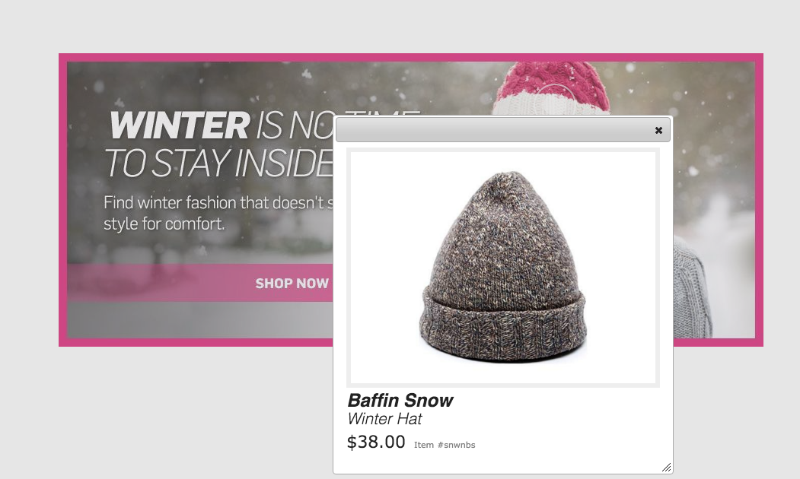

# Utilizzare i selettori {#working-with-selectors}

Quando lavori con un’immagine interattiva, un video interattivo o un banner carosello, seleziona le risorse e i siti e i prodotti per gli hotspot e le mappe immagine a cui collegarti. Quando lavori con Set immagini, Set 360 gradi e Set multimediali, puoi anche selezionare le risorse con il Selettore risorse.

Questo argomento illustra come utilizzare i selettori Prodotto, Sito e Risorsa, inclusa la possibilità di sfogliare, filtrare, ordinare all’interno dei selettori.

Puoi accedere ai selettori durante la creazione di set carosello, l’aggiunta di punti attivi e mappe immagine, la creazione di video e immagini interattivi.

Ad esempio, in questo banner carosello, puoi utilizzare il selettore Prodotto se stai collegando un punto attivo o una mappa immagine a una pagina Quickview. Utilizzare il selettore Sito se si sta collegando un punto attivo o una mappa immagine a un collegamento ipertestuale; utilizzate il selettore Risorsa durante la creazione di una diapositiva.

Quando selezioni (anziché immettere manualmente) i punti attivi o le mappe immagine a cui vai, stai utilizzando il selettore. Il selettore del sito funziona solo se sei un cliente Experience Manager Sites. Il selettore del prodotto richiede anche Experience Manager Commerce.

## Usa selettore prodotto {#selecting-products}

Utilizza il selettore Prodotto per scegliere un prodotto quando desideri un punto attivo o una mappa immagine per fornire una visualizzazione rapida a un prodotto specifico nel catalogo del prodotto.

1. Accedi al set carosello, all’immagine interattiva o al video interattivo e seleziona il **[!UICONTROL Azioni]** (disponibile solo se hai definito un punto attivo o una mappa immagine).

   Il selettore Prodotto è nel **[!UICONTROL Tipo di azione]** area.

   

1. Seleziona la **[!UICONTROL Selettore prodotto]** icona (lente di ingrandimento) e vai a un prodotto nel catalogo.

   

   Filtrare per parola chiave o tag toccando **[!UICONTROL Filtro]** e inserire le parole chiave, selezionare i tag o entrambi.

   

   Tocca per modificare la posizione in cui l’Experience Manager cerca i dati dei prodotti **[!UICONTROL Sfoglia]** e passare a un&#39;altra cartella.

   

   Seleziona **[!UICONTROL Ordinare]** da per cambiare se gli Experienci Manager vengono ordinati in base al più recente o dal più vecchio al più recente.

   

   Seleziona **[!UICONTROL Visualizza come]** per modificare la modalità di visualizzazione dei prodotti: **[!UICONTROL Vista a elenco]** o **[!UICONTROL Vista a schede]**.

   

1. Dopo aver selezionato il prodotto, il campo viene compilato con la miniatura e il nome del prodotto.

   

1. All&#39;interno **[!UICONTROL Anteprima]** in questa modalità, puoi selezionare il punto attivo o la mappa immagine e verificare come si presenta la visualizzazione rapida.

   

## Usa selettore del sito {#selecting-sites}

Utilizza il selettore del sito per scegliere una pagina web quando desideri che un punto attivo o una mappa immagine si colleghino a una pagina web gestita in Experience Manager Sites.

1. Accedi al set carosello, all’immagine interattiva o al video interattivo e seleziona il **[!UICONTROL Azioni]** (disponibile solo se hai definito un punto attivo o una mappa immagine).

   Il selettore del sito si trova nell’area **[!UICONTROL Tipo di azione]**.

   

1. Seleziona la **[!UICONTROL Selettore sito]** Icona (cartella con lente di ingrandimento) e vai alla pagina del tuo Experience Manager Sites a cui desideri collegare il punto attivo o la mappa immagine.

   

1. Dopo aver selezionato il sito, il campo si popola con il percorso.

   

1. All&#39;interno **[!UICONTROL Anteprima]** Se selezioni il punto attivo o la mappa immagine, accedi alla pagina del sito di Experience Manager specificata.

## Usa selettore risorse {#selecting-assets}

Utilizza questo selettore per scegliere le immagini da utilizzare in un banner carosello, un video interattivo, set di immagini, set di file multimediali diversi e set 360 gradi. Nel video interattivo, il selettore delle risorse è disponibile quando selezioni **[!UICONTROL Seleziona risorse]** in **[!UICONTROL Contenuto]** scheda . In Set carosello, il selettore delle risorse è disponibile quando crei una diapositiva. In Set immagini, Set di file multimediali diversi e Set 360 gradi, il selettore delle risorse è disponibile rispettivamente quando crei un set di immagini, un set di file multimediali diversi o un set 360 gradi.

Vedi anche [Selettore risorse](search-assets.md#assetpicker) per ulteriori informazioni.

1. Accedete al Set carosello e create una diapositiva. In alternativa, passa al video interattivo e passa al **[!UICONTROL Contenuto]** e seleziona le risorse. Oppure crea un set di file multimediali diversi, un set di immagini o un set 360 gradi.
1. Seleziona la **[!UICONTROL Selettore risorse]** icona (cartella con lente di ingrandimento) e passa a una risorsa.

   

   Filtrare per parola chiave o tag toccando **[!UICONTROL Filtro]** e inserire parole chiave, aggiungere criteri o entrambi.

   

   Modificare la posizione in cui Experience Manager cerca le risorse passando a un’altra cartella **[!UICONTROL Percorso]** campo .

   Seleziona **[!UICONTROL Raccolta]** per cercare solo le risorse all’interno delle raccolte.

   

   Seleziona **[!UICONTROL Visualizza come]** per modificare la modalità di visualizzazione dei prodotti: **[!UICONTROL Vista a elenco]**, **[!UICONTROL Vista a colonne]** oppure **[!UICONTROL Vista a schede]**.

   

1. Seleziona la risorsa toccando il segno di spunta. Viene visualizzata la risorsa.

   
