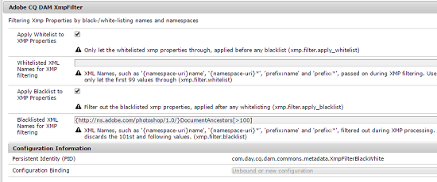

# Write-back XMP per le rappresentazioni {#xmp-writeback-to-renditions}

Questa funzione di XMP write-back in [!DNL Adobe Experience Manager Assets] replica le modifiche ai metadati alle rappresentazioni della risorsa originale. Quando modifichi i metadati di una risorsa dall’interno di Assets o durante il caricamento della risorsa, le modifiche vengono inizialmente memorizzate nel nodo di metadati nella gerarchia delle risorse.

La funzione di XMP write-back consente di propagare le modifiche ai metadati a tutte le rappresentazioni o a specifiche della risorsa. La funzione riscrive solo le proprietà dei metadati che utilizzano lo spazio dei nomi `jcr`, ovvero viene riscritta una proprietà denominata `dc:title` ma non una proprietà denominata `mytitle`.

Considera uno scenario in cui modifichi la proprietà [!UICONTROL Title] della risorsa denominata `Classic Leather` in `Nylon`.

In questo caso, il [!DNL Experience Manager Assets] salva le modifiche alla proprietà **[!UICONTROL Title]** nel parametro `dc:title` per i metadati delle risorse memorizzati nella gerarchia delle risorse.

Tuttavia, [!DNL Experience Manager Assets] non propaga automaticamente eventuali modifiche ai metadati delle rappresentazioni di una risorsa. Vedere [come abilitare XMP writeback](#enable-xmp-writeback).

## Abilita XMP writeback {#enable-xmp-writeback}

Per abilitare la propagazione delle modifiche ai metadati alle rappresentazioni della risorsa durante il caricamento, modifica la configurazione **[!UICONTROL Adobe CQ DAM Rendition Maker]** in Configuration Manager.

1. Per aprire Configuration Manager, accedere a `https://[aem_server]:[port]/system/console/configMgr`.
1. Apri la configurazione **[!UICONTROL Adobe CQ DAM Rendition Maker]** .
1. Selezionare l&#39;opzione **[!UICONTROL Propaga XMP]**, quindi salvare le modifiche.

   

## Abilitazione XMP ripristino per rappresentazioni specifiche {#enabling-xmp-writeback-for-specific-renditions}

Per consentire alla funzione XMP Writeback di propagare le modifiche ai metadati per selezionare le rappresentazioni, specifica queste rappresentazioni al passaggio del flusso di lavoro XMP Writeback Process del flusso di lavoro [!UICONTROL DAM Metadata WriteBack]. Per impostazione predefinita, questo passaggio è configurato con il rendering originale.

Per la funzione Writeback di XMP per la propagazione dei metadati alle miniature di rendering 140.100.png e 319.319.png, esegui questi passaggi.

1. Nell’interfaccia di Experience Manager, passa a **[!UICONTROL Strumenti]** > **[!UICONTROL Flusso di lavoro]** > **[!UICONTROL Modelli]**.
1. Dalla pagina Modelli , apri il modello di flusso di lavoro **[!UICONTROL Writeback di metadati DAM]** .
1. Nella pagina delle proprietà **[!UICONTROL Writeback di metadati DAM]**, apri il passaggio **[!UICONTROL Processo write-back XMPs]**.
1. Nella finestra di dialogo [!UICONTROL Proprietà passaggio], fare clic sulla scheda **[!UICONTROL Processo]**.
1. Nella casella **Argomenti**, aggiungere `rendition:cq5dam.thumbnail.140.100.png,rendition:cq5dam.thumbnail.319.319.png` e fare clic su **[!UICONTROL OK]**.

   

1. Salva le modifiche.
1. Per rigenerare le rappresentazioni TIFF piramidali per le immagini [!DNL Dynamic Media] con i nuovi attributi, aggiungi il passaggio **[!UICONTROL Dynamic Media Process Image Assets]** al flusso di lavoro [!UICONTROL DAM Metadata Writeback] .

   Le rappresentazioni PTIFF vengono create e memorizzate solo localmente in un’implementazione Dynamic Media Hybrid.

1. Salva il flusso di lavoro.

Le modifiche ai metadati vengono propagate alle rappresentazioni miniature.140.100.png e thumbnail.319.319.png della risorsa e non alle altre.

>[!NOTE]
>
>Per XMP problemi di write-back in Linux a 64 bit, vedere [Come abilitare XMP write-back su RedHat Linux a 64 bit](https://helpx.adobe.com/experience-manager/kb/enable-xmp-write-back-64-bit-redhat.html).
>
>Per le piattaforme supportate, consulta [XMP prerequisiti per la scrittura di metadati](/help/sites-deploying/technical-requirements.md#requirements-for-aem-assets-xmp-metadata-write-back).

## Filtro dei metadati XMP {#filtering-xmp-metadata}

[!DNL Experience Manager Assets] supporta sia il filtro elenco Bloccati che elenco Consentiti di proprietà/nodi per XMP metadati letti dai binari delle risorse e memorizzati in JCR quando le risorse vengono acquisite.

Il filtro mediante un elenco Bloccati consente di importare tutte le proprietà dei metadati XMP eccetto le proprietà specificate per l’esclusione. Tuttavia, per i tipi di risorse come i file INDD con grandi quantità di metadati XMP (ad esempio 1000 nodi con 10.000 proprietà), i nomi dei nodi da filtrare non sono sempre noti in anticipo. Se il filtraggio mediante un elenco Bloccati consente l’importazione di un numero elevato di risorse con numerosi metadati XMP, la distribuzione [!DNL Experience Manager] può incontrare problemi di stabilità, ad esempio code di osservazione intasate.

Il filtro dei metadati XMP tramite elenco Consentiti risolve questo problema consentendo di definire le proprietà XMP da importare. In questo modo, qualsiasi altra proprietà XMP o sconosciuta viene ignorata. Per la compatibilità con le versioni precedenti, puoi aggiungere alcune di queste proprietà al filtro che utilizza un elenco Bloccati.

>[!NOTE]
>
>Il filtraggio funziona solo per le proprietà derivate XMP origini nei binari delle risorse. Per le proprietà derivate da origini non XMP, come i formati EXIF e IPTC, il filtro non funziona. Ad esempio, la data di creazione delle risorse è memorizzata nella proprietà `CreateDate` in EXIF TIFF. Experience Manager memorizza questo valore in un campo di metadati denominato `exif:DateTimeOriginal`. Poiché l&#39;origine è un&#39;origine non XMP, il filtro non funziona su questa proprietà.

1. Per aprire Configuration Manager, accedere a `https://[aem_server]:[port]/system/console/configMgr`.
1. Apri la configurazione **[!UICONTROL Adobe CQ DAM XmpFilter]** .
1. Per applicare un filtro tramite un elenco Consentiti, selezionare **[!UICONTROL Applica Inserì nell&#39;elenco Consentiti a proprietà XMP]** e specificare le proprietà da importare nella casella **[!UICONTROL Nomi XML consentiti per XMP filtro]**.

   

1. Per filtrare le proprietà bloccate XMP dopo aver applicato il filtro tramite elenco Consentiti, specificale nella casella **[!UICONTROL Nomi XML bloccati per XMP filtro]**.

   >[!NOTE]
   >
   >L&#39;opzione **[!UICONTROL Applica Inserii nell&#39;elenco Bloccati a proprietà XMP]** è selezionata per impostazione predefinita. In altre parole, il filtro utilizzando un elenco Bloccati è abilitato per impostazione predefinita. Per disattivare questo filtro, annulla la selezione dell&#39;opzione **[!UICONTROL Applica Inserii nell&#39;elenco Bloccati a proprietà XMP]**.

1. Salva le modifiche.
