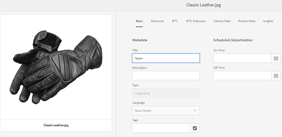

# Write-back di XMP alle rappresentazioni {#xmp-writeback-to-renditions}

| Versione | Collegamento articolo |
| -------- | ---------------------------- |
| AEM as a Cloud Service | [Fai clic qui](https://experienceleague.adobe.com/en/docs/experience-manager-cloud-service/content/assets/admin/xmp-metadata) |
| AEM 6.5 | Questo articolo |

Questa funzionalità di writeback di XMP in [!DNL Adobe Experience Manager Assets] replica le modifiche ai metadati nelle rappresentazioni della risorsa originale. Quando modifichi i metadati di una risorsa dall’interno di Assets o durante il caricamento della risorsa, le modifiche vengono inizialmente memorizzate nel nodo metadati nella gerarchia delle risorse.

La funzione di writeback di XMP consente di propagare le modifiche ai metadati a tutte le rappresentazioni specifiche della risorsa. La funzionalità riscrive solo le proprietà dei metadati che utilizzano spazi dei nomi registrati, ovvero una proprietà denominata `dc:title` viene riscritta ma una proprietà denominata `mytitle` no.

Considera uno scenario in cui modifichi la proprietà [!UICONTROL Title] della risorsa con titolo `Classic Leather` in `Nylon`.

In questo caso, [!DNL Experience Manager Assets] salva le modifiche alla proprietà **[!UICONTROL Title]** nel parametro `dc:title` per i metadati della risorsa memorizzati nella gerarchia della risorsa.

Tuttavia, [!DNL Experience Manager Assets] non propaga automaticamente le modifiche ai metadati alle rappresentazioni di una risorsa. Consulta [come abilitare il writeback di XMP](#enable-xmp-writeback).

## Abilita writeback di XMP {#enable-xmp-writeback}

Per abilitare la propagazione delle modifiche ai metadati alle rappresentazioni della risorsa durante il caricamento, modifica la configurazione **[!UICONTROL Adobe CQ DAM Rendition Maker]** in Configuration Manager.

1. Per aprire Configuration Manager, accedere a `https://[aem_server]:[port]/system/console/configMgr`.
1. Apri la configurazione di **[!UICONTROL Adobe CQ DAM Rendition Maker]**.
1. Selezionare l&#39;opzione **[!UICONTROL Propaga XMP]**, quindi salvare le modifiche.

   

## Abilitazione del writeback di XMP per rappresentazioni specifiche {#enabling-xmp-writeback-for-specific-renditions}

Per consentire alla funzionalità Writeback di XMP di propagare le modifiche ai metadati per selezionare le rappresentazioni, specificare queste rappresentazioni nel passaggio del flusso di lavoro Processo write-back di XMP del flusso di lavoro [!UICONTROL WriteBack di metadati DAM]. Per impostazione predefinita, questo passaggio è configurato con la rappresentazione originale.

Per la funzione Writeback di XMP per la propagazione dei metadati alle miniature di rendering 140.100.png e 319.319.png, eseguire la procedura seguente.

1. Nell&#39;interfaccia di Experience Manager, passa a **[!UICONTROL Strumenti]** > **[!UICONTROL Flusso di lavoro]** > **[!UICONTROL Modelli]**.
1. Dalla pagina Modelli, apri il modello di flusso di lavoro **[!UICONTROL Writeback metadati DAM]**.
1. Nella pagina delle proprietà **[!UICONTROL Writeback di metadati DAM]**, apri il passaggio **[!UICONTROL Processo write-back XMPs]**.
1. Nella finestra di dialogo [!UICONTROL Proprietà passaggio], fare clic sulla scheda **[!UICONTROL Processo]**.
1. Nella casella **Argomenti** aggiungere `rendition:cq5dam.thumbnail.140.100.png,rendition:cq5dam.thumbnail.319.319.png` e fare clic su **[!UICONTROL OK]**.

   

1. Salva le modifiche.
1. Per rigenerare le rappresentazioni piramidali di TIFF per le immagini [!DNL Dynamic Media] con i nuovi attributi, aggiungere il passaggio **[!UICONTROL Assets immagine processo elemento multimediale dinamico]** al flusso di lavoro [!UICONTROL Writeback metadati DAM].

   Le rappresentazioni PTIFF vengono create e memorizzate solo localmente in un’implementazione Dynamic Media Hybrid.

1. Salva il flusso di lavoro.

Le modifiche ai metadati vengono propagate alle rappresentazioni miniatura.140.100.png e miniatura.319.319.png della risorsa e non delle altre.

>[!NOTE]
>
>Per le piattaforme supportate, vedere [Prerequisiti per il write-back dei metadati di XMP](/help/sites-deploying/technical-requirements.md#requirements-for-aem-assets-xmp-metadata-write-back).

## Filtraggio dei metadati di XMP {#filtering-xmp-metadata}

[!DNL Experience Manager Assets] supporta sia il filtro elenco Bloccati che elenco Consentiti di proprietà/nodi per i metadati di XMP letti dai file binari delle risorse e memorizzati in JCR al momento dell&#39;acquisizione delle risorse.

L’utilizzo di un elenco Bloccati per filtrare consente di importare tutte le proprietà dei metadati di XMP, ad eccezione delle proprietà specificate per l’esclusione. Tuttavia, per i tipi di risorse come i file INDD che presentano grandi quantità di metadati di XMP (ad esempio, 1000 nodi con 10.000 proprietà), i nomi dei nodi da filtrare non sono sempre noti in anticipo. Se il filtro tramite un elenco Bloccati consente di importare un numero elevato di risorse con numerosi metadati XMP, l&#39;implementazione [!DNL Experience Manager] può incontrare problemi di stabilità, ad esempio code di osservazione intasate.

Il filtraggio dei metadati XMP tramite elenco Consentiti risolve questo problema consentendo di definire le proprietà XMP da importare. In questo modo, eventuali altre proprietà di XMP o sconosciute vengono ignorate. Per compatibilità con le versioni precedenti, puoi aggiungere alcune di queste proprietà al filtro che utilizza un elenco Bloccati.

>[!NOTE]
>
>Il filtro funziona solo per le proprietà derivate da origini XMP nei binari delle risorse. Per le proprietà derivate da origini non XMP, ad esempio i formati EXIF e IPTC, il filtro non funziona. Ad esempio, la data di creazione della risorsa è memorizzata nella proprietà denominata `CreateDate` in EXIF TIFF. Experience Manager archivia questo valore in un campo di metadati denominato `exif:DateTimeOriginal`. Poiché l&#39;origine non è XMP, il filtro non funziona su questa proprietà.

1. Per aprire Configuration Manager, accedere a `https://[aem_server]:[port]/system/console/configMgr`.
1. Apri la configurazione **[!UICONTROL Adobe CQ DAM XmpFilter]**.
1. Per applicare il filtro tramite un elenco Consentiti Inserì nell&#39;elenco Consentiti, selezionare **[!UICONTROL Applica il filtro a una proprietà di XMP]** e specificare le proprietà da importare nella casella **[!UICONTROL Nomi XML consentiti per il filtro di XMP]**.

   

1. Per filtrare le proprietà XMP bloccate dopo aver applicato il filtro nell&#39;elenco Consentiti, specificale nella casella **[!UICONTROL Nomi XML bloccati per il filtro di XMP]**.

   >[!NOTE]
   >
   >Per impostazione predefinita, l&#39;opzione **[!UICONTROL Applica Inserisci nell&#39;elenco Bloccati a XMP Properties]** è selezionata. In altre parole, il filtro con un elenco Bloccati è attivato per impostazione predefinita. Per disabilitare questo filtro, annullare la selezione dell&#39;opzione **[!UICONTROL Applica il Inserisco nell&#39;elenco Bloccati di XMP alle proprietà]**.

1. Salva le modifiche.
