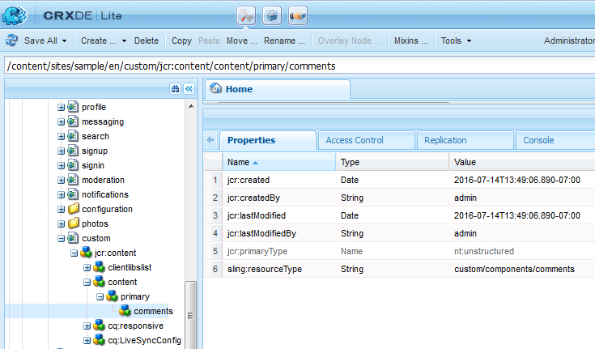

# Aggiungi Clientlibs{#add-clientlibs}

## Aggiungere una ClientLibraryFolder (clientlibs) {#add-a-clientlibraryfolder-clientlibs}

Create una ClientLibraryFolder denominata `clientlibs`che conterrà i file JS e CSS utilizzati per il rendering delle pagine del sito.

Il valore della `categories`proprietà dato a questa libreria client è l&#39;identificatore utilizzato per includere direttamente questa clientlib da una pagina di contenuto o per incorporarla in altri clientlibs.

1. utilizzando **CRXDE Lite**, espandere `/etc/designs`

1. fare clic con il pulsante destro del mouse `an-scf-sandbox` e selezionare `Create Node`

   * Nome : `clientlibs`
   * Tipo : `cq:ClientLibraryFolder`

1. click **OK**


Nella scheda **Proprietà** per il nuovo `clientlibs` nodo, immettere la proprietà **`categories`**s:

* Nome : **categorie**
* Tipo: **Stringa**
* Valore: **apps.an-scf-sandbox**
* click **Add**
* fate clic su **Salva tutto**

Nota: anteprima del valore delle categorie con &#39;app&#39;. è una convenzione per identificare l&#39;applicazione proprietaria come nella cartella /apps, non /libs.  IMPORTANTE: Aggiungete i file segnaposto `js.tx`t e**`css.tx`**t. (non è ufficialmente una cq:ClientLibraryFolder senza di esse.)

1. clic destro **`/etc/designs/an-scf-sandbox/clientlibs`**
1. selezionate **Crea file...**
1. **immettere** Nome: `css.txt`
1. selezionate **Crea file...**
1. **immettere** Nome: `js.txt`
1. fate clic su **Salva tutto**


La prima riga di css.txt e js.txt identifica la posizione di base dalla quale si trovano i seguenti elenchi di file.

Provate a impostare il contenuto di css.txt su

```
#base=.
 style.css
```

Quindi create un file in clientlibs denominato style.css e impostate il contenuto su

`body {`

`background-color: #b0c4de;`

`}`

### Incorpora client SCF {#embed-scf-clientlibs}

Nella scheda **Proprietà** del `clientlibs` nodo, immettere la proprietà String **embed** con più valori. Questo incorpora le librerie lato [client (clientlibs) necessarie per i componenti](/help/communities/client-customize.md#clientlibs-for-scf)SCF. Per questa esercitazione vengono aggiunti molti dei clientlibs necessari per i componenti Community.

**Notate** che questo potrebbe essere l&#39;approccio desiderato per un sito di produzione, in quanto vi sono considerazioni di convenienza rispetto alla dimensione/velocità dei clientlibs scaricati per ogni pagina.

Se si utilizza una sola funzione su una pagina, è possibile includere direttamente sulla pagina la clientlib completa della funzionalità, ad esempio &lt;% ui:includeClientLib category=cq.social.hbs.forum&quot; %>

In questo caso, includendo tutti e così i clienti SCF più basilari che sono gli autori clientlibé sono preferiti:

* Nome : **`embed`**
* Tipo : **`String`**
* clic **`Multi`**
* Valore: **`cq.social.scf`***&lt;enter> aprirà una finestra di dialogo clicca **[+]**dopo ogni voce per aggiungere le seguenti categorie clientlib:*

   * **`cq.ckeditor`**
   * **`cq.social.author.hbs.comments`**
   * **`cq.social.author.hbs.forum`**
   * **`cq.social.author.hbs.rating`**
   * **`cq.social.author.hbs.reviews`**
   * **`cq.social.author.hbs.voting`**
   * click **OK**

* fate clic su **Salva tutto**


Questo è il modo in cui `/etc/designs/an-scf-sandbox/clientlibs` dovrebbe essere visualizzato nella directory archivio:



### Includi Clientlibs nel modello PlayPage {#include-clientlibs-in-playpage-template}

Senza includere la categoria `apps.an-scf-sandbox` ClientLibraryFolder nella pagina, i componenti SCF non funzioneranno né saranno formattati in quanto non saranno disponibili i JavaScript e gli stili necessari.

Ad esempio, senza includere clientlibs, il componente commenti SCF non ha lo stile :


Una volta inclusi i clientlibs apps.an-scf-sandbox, il componente dei commenti SCF appare formattato :


L&#39;istruzione include appartiene alla variabile <head><meta http-equiv="Content-Type" content="text/html; charset=UTF-8"> della sezione <html> script. L&#39;impostazione predefinita **`foundation head.jsp`** include uno script che può essere sovrapposto : **`headlibs.jsp`**.

**Copiate headlibs.jsp e includete clientlibs:**

1. utilizzando **CRXDE Lite**, selezionare **`/libs/foundation/components/page/headlibs.jsp`**

1. fare clic con il pulsante destro del mouse e selezionare **Copy **(oppure selezionare Copia dalla barra degli strumenti)
1. select**`/apps/an-scf-sandbox/components/playpage`**
1. fare clic con il pulsante destro del mouse e selezionare **Incolla **(oppure selezionare Incolla dalla barra degli strumenti)
1. fare doppio clic **`headlibs.jsp`** per aprirlo
1. aggiungi la seguente riga alla fine del file
   **`<ui:includeClientLib categories="apps.an-scf-sandbox"/>`**

1. fate clic su **Salva tutto**

```xml
<%@ page session="false" %><%
%><%@include file="/libs/foundation/global.jsp" %><%
%><ui:includeClientLib categories="cq.foundation-main"/><%
%>
<cq:include script="/libs/cq/cloudserviceconfigs/components/servicelibs/servicelibs.jsp"/>
<% currentDesign.writeCssIncludes(pageContext); %>
<ui:includeClientLib categories="apps.an-scf-sandbox"/>
```

Caricate il sito Web nel browser e verificate se lo sfondo non è blu.

[https://localhost:4502/content/an-scf-sandbox/en/play.html](https://localhost:4502/content/an-scf-sandbox/en/play.html)


### Salvataggio del lavoro fino ad ora {#saving-your-work-so-far}

A questo punto, esiste una sandbox minimalista, e potrebbe essere utile salvarla come pacchetto in modo che, durante la riproduzione, se il repository diventa danneggiato e si desidera ricominciare, è possibile spegnere il server, rinominare o eliminare la cartella crx-quickstart/, attivare il server, caricare e installare questo pacchetto salvato, e non dover ripetere questi passaggi fondamentali.

Questo pacchetto è disponibile nell’esercitazione [Crea una pagina](/help/communities/create-sample-page.md) di esempio per coloro che non vedono l’ora di iniziare a riprodurre il pacchetto...

Per creare un pacchetto:

* da CRXDE Lite fate clic sull&#39;icona [Pacchetto](https://localhost:4502/crx/packmgr/)
* fate clic su **Crea pacchetto**

   * Nome pacchetto: an-scf-sandbox-minimal-pkg
   * Versione: 0,1
   * Gruppo: &lt;lasciare come predefinito>
   * click **OK**

* click **Edit**

   * select **Filters **tab

      * fate clic su **Aggiungi filtro**
      * Percorso directory principale: &lt;Browse to** /apps/an-scf-sandbox**>
      * fai clic su **Fine**
      * fate clic su **Aggiungi filtro**
      * Percorso directory principale: &lt;individuare **/etc/designs/an-scf-sandbox**>
      * fai clic su **Fine**
      * fate clic su **Aggiungi filtro**
      * Percorso directory principale: &lt;individuare **/content/an-scf-sandbox**>
      * fai clic su **Fine**
   * click **Save**


* fate clic su **Genera**

Ora potete selezionare **Scarica** per salvarlo su disco e **caricare il pacchetto** altrove, nonché **Altro > Replica** per inviare la sandbox a un&#39;istanza di pubblicazione localhost per espandere il realm della sandbox.