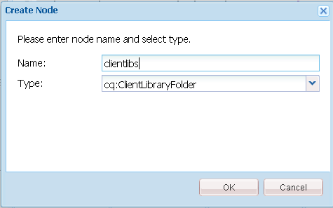

# Aggiungi Clientlibs {#add-clientlibs}

## Aggiungere una ClientLibraryFolder (clientlibs) {#add-a-clientlibraryfolder-clientlibs}

Creare una ClientLibraryFolder denominata `clientlibs` contenente JavaScript (JS) e Cascading Styles Sheets (CSS) utilizzati per il rendering delle pagine del sito.

Il valore della proprietà `categories` assegnato a questa libreria client è l&#39;identificatore utilizzato per includere direttamente la libreria client da una pagina di contenuto o per incorporarla in altre librerie client.

1. Utilizzando **CRXDE Liti**, espandere `/etc/designs`

1. Fare clic con il pulsante destro del mouse su `an-scf-sandbox` e selezionare `Create Node`

   * Nome: `clientlibs`
   * Tipo: `cq:ClientLibraryFolder`

1. Fai clic su **OK**



Nella scheda **Proprietà** per il nuovo nodo `clientlibs`, immetti la proprietà **categorie**:

* Nome : **categorie**
* Tipo: **Stringa**
* Valore : **apps.an-scf-sandbox**
* Fai clic su **Aggiungi**
* Fai clic su **Salva tutto**

Nota: anteprima del valore delle categorie con &quot;apps&quot;. è una convenzione per identificare l’applicazione proprietaria come presente nella cartella /apps, non in /libs. IMPORTANTE: aggiungere il segnaposto `js.tx` e **`css.txt`** file. (Non è ufficialmente un cq:ClientLibraryFolder senza di loro).

1. Fare clic con il pulsante destro del mouse su **`/etc/designs/an-scf-sandbox/clientlibs`**
1. Seleziona **Crea file...**
1. Immetti **Nome:** `css.txt`
1. Seleziona **Crea file...**
1. Immetti **Nome:** `js.txt`
1. Fai clic su **Salva tutto**


La prima riga dei file css.txt e js.txt identifica la posizione di base da cui si trovano i seguenti elenchi di file.

Prova a impostare il contenuto di css.txt su

```
#base=.
 style.css
```

Quindi crea un file in clientlibs denominato style.css e imposta il contenuto su

`body {`

`background-color: #b0c4de;`

`}`

### Incorpora librerie client SCF {#embed-scf-clientlibs}

Nella scheda **Proprietà** per il nodo `clientlibs`, immettere la proprietà String con più valori **incorpora**. In questo modo vengono incorporate le [librerie lato client (clientlibs) necessarie per i componenti SCF](/help/communities/client-customize.md#clientlibs-for-scf). Per questa esercitazione, vengono aggiunte molte delle clientlibs necessarie per i componenti Community.

Questo potrebbe essere o meno l&#39;approccio desiderato da utilizzare per un sito di produzione, in quanto ci sono considerazioni di convenienza rispetto alle dimensioni/velocità delle clientlibs scaricate per ogni pagina.

Se utilizzi una sola funzione su una pagina, puoi includere la libreria client completa della funzione direttamente sulla pagina, ad esempio,

`% ui:includeClientLib categories=cq.social.hbs.forum" %`

In questo caso, includendoli tutti e quindi si preferiscono le clientlibs SCF di base che sono le clientlibs dell’autore:

* Nome: **`embed`**
* Tipo: **`String`**
* Fai clic su **`Multi`**
* Valore: **`cq.social.scf`**

   * Apparirà una finestra di dialogo,
fare clic su **`+`** dopo ogni voce per aggiungere le seguenti categorie clientlib:

      * **`cq.ckeditor`**
      * **`cq.social.author.hbs.comments`**
      * **`cq.social.author.hbs.forum`**
      * **`cq.social.author.hbs.rating`**
      * **`cq.social.author.hbs.reviews`**
      * **`cq.social.author.hbs.voting`**
      * Fai clic su **OK**

* Fai clic su **Salva tutto**


`/etc/designs/an-scf-sandbox/clientlibs` dovrebbe ora essere visualizzato nell&#39;archivio:


### Includi clientlibs nel modello PlayPage {#include-clientlibs-in-playpage-template}

Senza includere la categoria `apps.an-scf-sandbox` ClientLibraryFolder nella pagina, i componenti SCF non funzionano né dispongono di uno stile, in quanto gli stili JavaScript e CSS necessari non sono disponibili.

Ad esempio, senza includere clientlibs, il componente SCF comments (commenti SCF) non viene formattato:


Una volta incluse le clientlibs apps.an-scf-sandbox, il componente commenti SCF appare con lo stile:


L&#39;istruzione include appartiene alla sezione `head` dello script `html`. Il valore predefinito **`foundation head.jsp`** include uno script che può essere sovrapposto: **`headlibs.jsp`**.

**Copia headlibs.jsp e includi clientlibs:**

1. Utilizzando **CRXDE Liti**, seleziona **`/libs/foundation/components/page/headlibs.jsp`**

1. Fai clic con il pulsante destro del mouse e seleziona **Copia** (oppure seleziona Copia dalla barra degli strumenti)
1. Seleziona **`/apps/an-scf-sandbox/components/playpage`**
1. Fai clic con il pulsante destro del mouse e seleziona **Incolla** (oppure seleziona Incolla dalla barra degli strumenti)
1. Fai doppio clic su **`headlibs.jsp`** per aprirlo
1. Aggiungi la riga seguente alla fine del file
   **`<ui:includeClientLib categories="apps.an-scf-sandbox"/>`**

1. Fai clic su **Salva tutto**

```xml
<%@ page session="false" %><%
%><%@include file="/libs/foundation/global.jsp" %><%
%><ui:includeClientLib categories="cq.foundation-main"/><%
%>
<cq:include script="/libs/cq/cloudserviceconfigs/components/servicelibs/servicelibs.jsp"/>
<% currentDesign.writeCssIncludes(pageContext); %>
<ui:includeClientLib categories="apps.an-scf-sandbox"/>
```

Carica il tuo sito web nel browser e osserva se lo sfondo non è una tonalità di blu.

[https://localhost:4502/content/an-scf-sandbox/en/play.html](https://localhost:4502/content/an-scf-sandbox/en/play.html)


### Salvataggio del lavoro {#saving-your-work-so-far}

A questo punto, esiste una sandbox minimalista. Potrebbe essere utile salvarlo come pacchetto in modo che, durante la riproduzione, se l’archivio diventa danneggiato e desideri ricominciare, puoi spegnere il server. Quindi rinomina o elimina la cartella crx-quickstart/, accendi il server, carica e installa questo pacchetto salvato e non devi ripetere questi passaggi più semplici.

Questo pacchetto esiste nell&#39;esercitazione [Creare una pagina di esempio](/help/communities/create-sample-page.md) per gli utenti che non possono attendere di entrare e iniziare la riproduzione.

Per creare un pacchetto:

* Da CRXDE Lite, fai clic sull&#39;icona [Pacchetto](https://localhost:4502/crx/packmgr/)
* Fai clic su **Crea pacchetto**

   * Nome pacchetto: an-scf-sandbox-minimal-pkg
   * Versione: 0.1
   * Gruppo: `leave as default`
   * Fai clic su **OK**

* Fai clic su **Modifica**

   * Seleziona la scheda **Filtri**

      * Fai clic su **Aggiungi filtro**
      * Percorso principale: passa a `/apps/an-scf-sandbox`
      * Fai clic su **Fine**
      * Fai clic su **Aggiungi filtro**
      * Percorso principale: passa a `/etc/designs/an-scf-sandbox`
      * Fai clic su **Fine**
      * Fai clic su **Aggiungi filtro**
      * Percorso principale: passa a `/content/an-scf-sandbox**`
      * Fai clic su **Fine**

   * Fai clic su **Salva**

* Fai clic su **Genera**

Ora puoi selezionare **Scarica** per salvarlo su disco e **Carica pacchetto** altrove e selezionare **Altro > Replica** per inviare la sandbox a un&#39;istanza Publish localhost per espandere il realm della sandbox.
