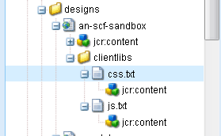
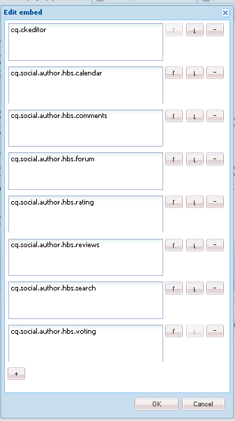

# Aggiungi Clientlibs {#add-clientlibs}

## Aggiungere una ClientLibraryFolder (clientlibs) {#add-a-clientlibraryfolder-clientlibs}

Create una ClientLibraryFolder denominata `clientlibs` che conterrà i file JS e CSS utilizzati per il rendering delle pagine del sito.

Il valore della `categories` proprietà dato a questa libreria client è l&#39;identificatore utilizzato per includere direttamente questa clientlib da una pagina di contenuto o per incorporarla in altri clientlibs.

1. Utilizzando **CRXDE Lite**, espandi `/etc/designs`

1. Fare clic con il pulsante destro del mouse `an-scf-sandbox` e selezionare `Create Node`

   * Nome : `clientlibs`
   * Tipo : `cq:ClientLibraryFolder`

1. Fai clic su **OK**


Nella scheda **Proprietà** del nuovo `clientlibs` nodo, immettere la proprietà **category** :

* Nome : **category**
* Tipo: **Stringa**
* Valore: **apps.an-scf-sandbox**
* Fate clic su **Aggiungi**
* Fate clic su **Salva tutto**

Nota: visualizzazione in anteprima del valore delle categorie con &#39;app&#39;. è una convenzione per identificare l&#39;applicazione proprietaria come nella cartella /apps, non /libs.  IMPORTANTE: Aggiungere segnaposto `js.tx`a e **`css.txt`** file. (non è ufficialmente una cq:ClientLibraryFolder senza di esse.)

1. Clic con il pulsante destro del mouse **`/etc/designs/an-scf-sandbox/clientlibs`**
1. Seleziona **Crea file...**
1. Enter **Name:** `css.txt`
1. Seleziona **Crea file...**
1. Enter **Name:** `js.txt`
1. Fate clic su **Salva tutto**



La prima riga di css.txt e js.txt identifica la posizione di base dalla quale si trovano i seguenti elenchi di file.

Provate a impostare il contenuto di css.txt su

```
#base=.
 style.css
```

Quindi create un file in clientlibs denominato style.css e impostate il contenuto su

`body {`

`background-color: #b0c4de;`

`}`

### Incorpora client SCF {#embed-scf-clientlibs}

Nella scheda **Proprietà** del `clientlibs` nodo, immettere la proprietà String **embed** con più valori. Questo incorpora le librerie lato [client (clientlibs) necessarie per i componenti](/help/communities/client-customize.md#clientlibs-for-scf)SCF. Per questa esercitazione vengono aggiunti molti dei clientlibs necessari per i componenti Community.

**Notate** che questo potrebbe essere l&#39;approccio desiderato per un sito di produzione, in quanto vi sono considerazioni di convenienza rispetto alla dimensione/velocità dei clientlibs scaricati per ogni pagina.

Se si utilizza una sola funzione su una pagina, è possibile includere la clientlib completa di tale funzione direttamente sulla pagina, ad esempio,

`% ui:includeClientLib categories=cq.social.hbs.forum" %`

In questo caso, includendo tutti e così i clienti SCF più basilari che sono gli autori clientlibé sono preferite:

* Nome : **`embed`**
* Tipo : **`String`**
* Clic **`Multi`**
* Valore: **`cq.social.scf`**

   * Viene visualizzata una finestra di dialogo, fate clic **`+`** dopo ogni voce per aggiungere le seguenti categorie clientlib:

      * **`cq.ckeditor`**
      * **`cq.social.author.hbs.comments`**
      * **`cq.social.author.hbs.forum`**
      * **`cq.social.author.hbs.rating`**
      * **`cq.social.author.hbs.reviews`**
      * **`cq.social.author.hbs.voting`**
      * Fai clic su **OK**

* Fate clic su **Salva tutto**



Questo è il modo in cui `/etc/designs/an-scf-sandbox/clientlibs` dovrebbe essere visualizzato nella directory archivio:


### Includi Clientlibs nel modello PlayPage {#include-clientlibs-in-playpage-template}

Senza includere la categoria `apps.an-scf-sandbox` ClientLibraryFolder nella pagina, i componenti SCF non funzioneranno né saranno formattati in quanto non saranno disponibili i JavaScript e gli stili necessari.

Ad esempio, senza includere clientlibs, il componente commenti SCF non ha lo stile :


Una volta inclusi i clientlibs apps.an-scf-sandbox, il componente dei commenti SCF appare formattato :


L&#39;istruzione include appartiene alla `head` sezione dello `html` script. L&#39;impostazione predefinita **`foundation head.jsp`** include uno script che può essere sovrapposto : **`headlibs.jsp`**.

**Copiate headlibs.jsp e includete clientlibs:**

1. Utilizzando **CRXDE Lite**, selezionare **`/libs/foundation/components/page/headlibs.jsp`**

1. Fare clic con il pulsante destro del mouse e selezionare **Copia** (oppure selezionare Copia dalla barra degli strumenti)
1. Seleziona **`/apps/an-scf-sandbox/components/playpage`**
1. Fare clic con il pulsante destro del mouse e selezionare **Incolla** (oppure selezionare Incolla dalla barra degli strumenti)
1. Fate doppio clic **`headlibs.jsp`** per aprirlo
1. Aggiungi la riga seguente alla fine del file
   **`<ui:includeClientLib categories="apps.an-scf-sandbox"/>`**

1. Fate clic su **Salva tutto**

```xml
<%@ page session="false" %><%
%><%@include file="/libs/foundation/global.jsp" %><%
%><ui:includeClientLib categories="cq.foundation-main"/><%
%>
<cq:include script="/libs/cq/cloudserviceconfigs/components/servicelibs/servicelibs.jsp"/>
<% currentDesign.writeCssIncludes(pageContext); %>
<ui:includeClientLib categories="apps.an-scf-sandbox"/>
```

Caricate il sito Web nel browser e verificate se lo sfondo non è blu.

[https://localhost:4502/content/an-scf-sandbox/en/play.html](https://localhost:4502/content/an-scf-sandbox/en/play.html)


### Salvataggio del lavoro fino ad ora {#saving-your-work-so-far}

A questo punto, esiste una sandbox minimalista, e potrebbe essere utile salvarla come pacchetto in modo che, durante la riproduzione, se il repository diventa danneggiato e si desidera ricominciare, è possibile spegnere il server, rinominare o eliminare la cartella crx-quickstart/, attivare il server, caricare e installare questo pacchetto salvato, e non dover ripetere questi passaggi fondamentali.

Questo pacchetto è disponibile nell’esercitazione [Crea una pagina](/help/communities/create-sample-page.md) di esempio per coloro che non vedono l’ora di iniziare a riprodurre il pacchetto...

Per creare un pacchetto:

* Dal CRXDE Lite fate clic sull&#39;icona [Pacchetto](https://localhost:4502/crx/packmgr/)
* Fate clic su **Crea pacchetto**

   * Nome pacchetto: an-scf-sandbox-minimal-pkg
   * Versione: 0,1
   * Gruppo: `leave as default`
   * Fai clic su **OK**

* Fai clic su **Modifica**

   * Seleziona **filtri** , scheda

      * Fate clic su **Aggiungi filtro**
      * Percorso directory principale: individuare `/apps/an-scf-sandbox`
      * Fate clic su **Fine**
      * Fate clic su **Aggiungi filtro**
      * Percorso directory principale: individuare `/etc/designs/an-scf-sandbox`
      * Fate clic su **Fine**
      * Fate clic su **Aggiungi filtro**
      * Percorso directory principale: individuare `/content/an-scf-sandbox**`
      * Fate clic su **Fine**
   * Fai clic su **Salva**


* Fate clic su **Genera**

Ora potete selezionare **Scarica** per salvarlo su disco e **caricare il pacchetto** altrove, nonché **Altro > Replica** per inviare la sandbox a un&#39;istanza di pubblicazione localhost per espandere l&#39;area di autenticazione della sandbox.