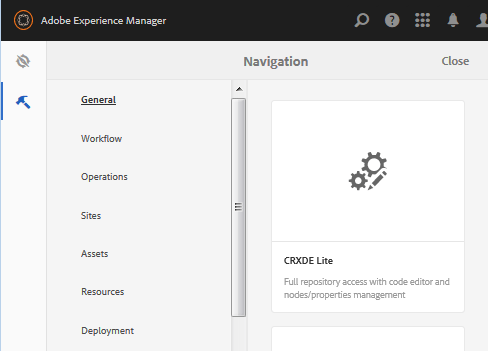

# Creare una sandbox SCF  {#create-an-scf-sandbox}

A partire da AEM 6.1 Communities, il modo più semplice per creare rapidamente una sandbox è creare un sito community. See [Getting Started with AEM Communities](getting-started.md).

Un altro strumento utile per gli sviluppatori è la guida Community Components, che consente di esplorare e creare rapidamente prototipi di componenti e caratteristiche di Communities.

L’esercizio di creazione di un sito Web può essere utile per comprendere la struttura di un sito Web AEM che può includere funzioni per Community, fornendo al contempo pagine semplici su cui esplorare l’utilizzo del framework dei componenti [social (SCF)](scf.md).

Questa esercitazione è destinata principalmente agli sviluppatori, nuovi di AEM, interessati all’utilizzo dei componenti SCF. Viene descritta la creazione di un sito sandbox SCF, simile all’esercitazione [How to Create a Fully Featured Internet Website](../../help/sites-developing/website.md) (Come creare un sito Internet completo) che si concentra sulle strutture del sito, come la navigazione, il logo, la ricerca, la barra degli strumenti e l’elenco delle pagine figlie.

Lo sviluppo avviene in un’istanza di authoring, mentre la sperimentazione con il sito risulta ottimale in un’istanza di pubblicazione.

I passaggi di questa esercitazione sono:

* [Imposta struttura sito Web](setup-website.md)
* [Applicazione sandbox iniziale](initial-app.md)
* [Contenuto sandbox iniziale](initial-content.md)
* [Sviluppo di applicazioni sandbox](develop-app.md)
* [Aggiungi Clientlibs](add-clientlibs.md)
* [Sviluppo di contenuto sandbox](develop-content.md)

>[!CAUTION]
>
>Questa esercitazione non crea un sito community con le funzionalità create mediante la console [Siti](sites-console.md)community. Ad esempio, questa esercitazione non descrive come impostare login, registrazione automatica, login [per](social-login.md)social network, messaggi, profili e così via.
>
>Se preferite un semplice sito community, seguite l’esercitazione [Create a Sample Page (Crea una pagina](create-sample-page.md) di esempio).

## Prerequisiti {#prerequisites}

Questa esercitazione presuppone che siano installati un’istanza di creazione AEM e un’istanza di pubblicazione AEM con l’ [ultima versione](deploy-communities.md#latest-releases) di Communities.

Di seguito sono riportati alcuni utili collegamenti per gli sviluppatori che hanno introdotto la piattaforma AEM:

* [Guida introduttiva](../../help/sites-deploying/deploy.md#getting-started): per la distribuzione di istanze AEM.

   * [Nozioni di base](../../help/sites-developing/the-basics.md): per sviluppatori di siti Web e funzionalità.
   * [Primi passi per gli autori](../../help/sites-authoring/first-steps.md): per la creazione del contenuto della pagina.

## Utilizzo dell&#39;ambiente di sviluppo CRXDE Lite {#using-crxde-lite-development-environment}

Gli sviluppatori AEM dedicano gran parte del loro tempo all’ambiente di sviluppo [CRXDE Lite](../../help/sites-developing/developing-with-crxde-lite.md) in un’istanza di authoring. CRXDE Lite offre un accesso meno limitato all&#39;archivio CRX. Gli strumenti dell’interfaccia classica e le console dell’interfaccia touch consentono di accedere in modo più strutturato a porzioni specifiche dell’archivio CRX.

Dopo l&#39;accesso con privilegi amministrativi, esistono diversi modi per accedere a CRXDE Lite:

1. Dalla navigazione globale, selezionate **[!UICONTROL Strumenti di navigazione > CRXDE Lite]**.

   

2. Nella pagina [di benvenuto dell’interfaccia](http://localhost:4502/welcome.html)classica, scorri verso il basso e fai clic su **[!UICONTROL CRXDE Lite]** nel pannello a destra.

   

3. Passa direttamente a `CRXDE Lite`: `<server>:<port>/crx/de`

   Ad esempio, in un’istanza di creazione locale: [http://localhost:4502/crx/de](http://localhost:4502/crx/de)

Per lavorare con CRXDE Lite, dovete accedere con i privilegi di sviluppatore o amministratore. Per l&#39;istanza localhost predefinita, è possibile accedere con

* `username: admin`
* `password: admin`

**Tieni presente** che questo accesso si interromperà e che sarà necessario eseguire nuovamente l&#39;accesso utilizzando il pull down all&#39;estremità destra della barra degli strumenti CRXDe Lite.

Se non è stato effettuato l&#39;accesso, non sarà possibile navigare nell&#39;archivio JCR né eseguire operazioni di modifica/salvataggio.

***In caso di dubbi, effettuate nuovamente l&#39;accesso!***

