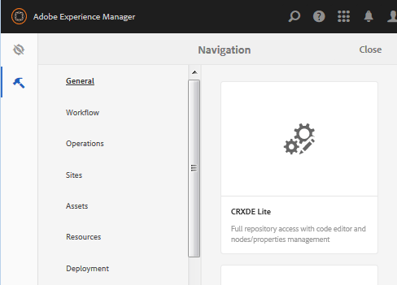
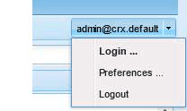

# Creare una sandbox SCF  {#create-an-scf-sandbox}

A partire da AEM 6.1 Communities, il modo più semplice per creare rapidamente una sandbox è quello di creare un sito community. Consulta [Guida introduttiva ad AEM Communities](getting-started.md).

Un altro strumento utile per gli sviluppatori è la [guida ai componenti della community](components-guide.md), che consente di esplorare e creare rapidamente prototipi per i componenti e le funzionalità della community.

L&#39;esercizio di creazione di un sito Web può essere utile per comprendere la struttura di un sito Web AEM che può includere funzionalità di Communities, fornendo al contempo pagine semplici su cui esplorare come utilizzare il [framework di componenti social (SCF)](scf.md).

Questo tutorial è principalmente destinato agli sviluppatori che non hanno mai usato AEM e che sono interessati a utilizzare i componenti SCF. Viene descritto come creare un sito Sandbox SCF, simile all&#39;esercitazione per [Creare un sito Web Internet completo](../../help/sites-developing/website.md) che si concentra su strutture del sito, quali navigazione, logo, ricerca, barra degli strumenti ed elenco di pagine figlie.

Lo sviluppo avviene su un’istanza di authoring, mentre la sperimentazione con il sito è consigliata su un’istanza di pubblicazione.

I passaggi descritti in questa esercitazione sono i seguenti:

* [Imposta struttura sito Web](setup-website.md)
* [Applicazione sandbox iniziale](initial-app.md)
* [Contenuto sandbox iniziale](initial-content.md)
* [Sviluppa applicazione sandbox](develop-app.md)
* [Aggiungi Clientlibs](add-clientlibs.md)
* [Sviluppare contenuti sandbox](develop-content.md)

>[!CAUTION]
>
>Questo tutorial non crea un sito community con la funzionalità creata utilizzando la console [Siti community](sites-console.md). Ad esempio, questo tutorial non descrive come impostare l’accesso, la registrazione autonoma, l’[accesso social](social-login.md), i messaggi, i profili e così via.
>
>Se si preferisce un sito community semplice, seguire l&#39;esercitazione [Crea pagina di esempio](create-sample-page.md).

## Prerequisiti {#prerequisites}

Questo tutorial presuppone che siano installati un&#39;istanza di AEM Author e un&#39;istanza di AEM Publish con la [versione più recente](deploy-communities.md#latest-releases) di Communities.

Di seguito sono riportati alcuni collegamenti utili per sviluppatori che non hanno mai utilizzato la piattaforma AEM:

* [Guida introduttiva](../../help/sites-deploying/deploy.md#getting-started): per la distribuzione di istanze di AEM.

  * [Nozioni di base](../../help/sites-developing/the-basics.md): per sviluppatori di siti Web e funzionalità.
  * [Primi passi per autori](../../help/sites-authoring/first-steps.md): per la creazione di contenuti di pagina.

## Utilizzo dell’ambiente di sviluppo CRXDE Lite {#using-crxde-lite-development-environment}

Gli sviluppatori AEM trascorrono gran parte del loro tempo nell&#39;ambiente di sviluppo [CRXDE Lite](../../help/sites-developing/developing-with-crxde-lite.md) in un&#39;istanza Autore. CRXDE Lite offre un accesso meno limitato all’archivio CRX. Gli strumenti dell’interfaccia classica e le console dell’interfaccia touch forniscono un accesso più strutturato a parti specifiche dell’archivio CRX.

Dopo aver effettuato l&#39;accesso con privilegi amministrativi, è possibile accedere a CRXDE Lite in diversi modi:

1. Dalla navigazione globale, seleziona **[!UICONTROL Strumenti > CRXDE Lite]**.

   

2. Dalla [pagina iniziale dell&#39;interfaccia classica](http://localhost:4502/welcome.html), scorri verso il basso e fai clic su **[!UICONTROL CRXDE Lite]** nel pannello di destra.

   

3. Sfoglia direttamente a `CRXDE Lite`: `<server>:<port>/crx/de`

   Ad esempio, in un&#39;istanza Autore locale: [http://localhost:4502/crx/de](http://localhost:4502/crx/de)

Per lavorare con CRXDE Lite, devi accedere con privilegi di sviluppatore o amministratore. Per l’istanza localhost predefinita, puoi accedere con

* `username: admin`
* `password: admin`

Questo login va in timeout ed è necessario effettuare nuovamente l’accesso periodicamente utilizzando il menu a discesa nell’estremità destra della barra degli strumenti di CRXDE Lite.

Se non hai effettuato l’accesso, non potrai navigare nell’archivio JCR o eseguire operazioni di modifica/salvataggio.

***In caso di dubbi, effettua di nuovo l&#39;accesso!***

