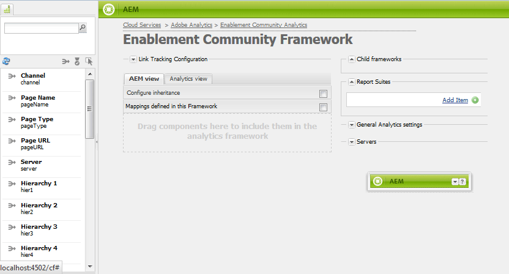

# Funzionalità di configurazione di Analytics for Communities {#analytics-configuration-for-communities-features}

## Panoramica {#overview}

Adobe Analytics e Adobe Experience Manager (AEM) sono entrambe soluzioni di Adobe Marketing Cloud.

Adobe Analytics può essere configurato per AEM Communities in modo che, quando un membro interagisce con le funzioni di Communities supportate, gli eventi vengano inviati ad Adobe Analytics da cui vengono generati i rapporti.

Ad esempio, quando un membro di un sito della community di abilitazione visualizza una risorsa video assegnata loro, il lettore della risorsa invierà gli eventi ad Analytics, inclusi i dati heartbeat video. Dal sito della community, gli amministratori possono vedere vari report relativi alla riproduzione del video.

Inoltre, l’analisi è necessaria per:

* Nell’ambiente di pubblicazione:

   * Generazione di rapporti sulla community [tendenze](/help/communities/trends.md)
   * Consente ai visitatori del sito di ordinare per &quot;più visualizzati&quot;, &quot;più attivi&quot;, &quot;più graditi&quot;
   * Conteggi di visualizzazione sugli elenchi UGC

* Nell’ambiente di authoring:

   * Visualizzazione dei dati di partecipazione nella [console di gestione membri](/help/communities/members.md) (visualizzazioni, post, segue, mi piace)
   * Riepilogo delle tendenze, heartbeat video e dispositivo video per risorse di abilitazione [report](/help/communities/reports.md)

Le funzioni supportate da Communities includono:

* [Risorse di abilitazione](/help/communities/resources.md)
* [Forum](/help/communities/forum.md)
* [D/R](/help/communities/working-with-qna.md)
* [Blog](/help/communities/blog-feature.md)
* [Libreria file](/help/communities/file-library.md)
* [Calendario](/help/communities/calendar.md)

Questa sezione della documentazione descrive come collegare una suite di rapporti di Analytics alle funzioni di Communities. Le fasi di base sono le seguenti:

1. [Replicare la ](#replicate-the-crypto-key) chiave di crittografia per garantire che la crittografia/decrittografia si verifichi correttamente su tutte le istanze AEM
1. Prepara una suite di rapporti Adobe Analytics [](#adobe-analytics-report-suite-for-video-reporting)
1. Crea un servizio AEM Analytics [cloud service](#aem-analytics-cloud-service-configuration) e [framework](#aem-analytics-framework-configuration)

1. [Abilitare ](#enable-analytics-for-a-community-site) Analytics per un sito community
1. [****](#verify-analytics-to-aem-variable-mapping) Verifica Analytics AEM mappatura variabile
1. Identifica [editore principale](#primary-publisher)
1. [](#publish-community-site-and-analytics-cloud-service) Pubblica il sito della community
1. Configurare [l&#39;importazione di dati del report](#obtaining-reports-from-analytics) da Adobe Analytics al sito della community

## Prerequisiti {#prerequisites}

Per configurare le funzioni di Analytics for Communities, è necessario collaborare con il rappresentante commerciale di riferimento per impostare un account Adobe Analytics e una [suite di rapporti](#adobe-analytics-report-suite-for-video-reporting). Una volta stabiliti, devono essere disponibili le seguenti informazioni:

* **Nome dell&#39;azienda**

   Società associata all’account Adobe Analytics.

* **Nome utente**

   Nome utente di accesso per l’utente autorizzato a gestire l’account Analytics
(dovrebbe includere i privilegi di accesso al servizio Web).

* **Password**

   Password di accesso per l&#39;utente autorizzato.

* **Centro dati di Analytics**

   URL del data center di Analytics per l’account.

* **Suite di rapporti**

   Nome della suite di rapporti di Analytics da utilizzare.

## Suite di rapporti Adobe Analytics per la generazione di rapporti video {#adobe-analytics-report-suite-for-video-reporting}

Utilizzando il [Report Suite Manager](https://docs.adobe.com/content/help/en/analytics/admin/manage-report-suites/new-report-suite/new-report-suite.html) di Adobe Marketing Cloud, è possibile configurare le suite di rapporti di Analytics in modo che un sito community possa essere abilitato per fornire rapporti per le funzioni di Communities.

Accedendo a [Adobe Experience Cloud](https://docs.adobe.com/content/help/en/analytics/analyze/analysis-workspace/home.html) con [Nome società e nome utente](/help/communities/analytics.md#prerequisites), è possibile configurare una suite di rapporti nuova o esistente in modo che abbia:

* [11 Variabili di conversione](https://docs.adobe.com/content/help/en/analytics/admin/admin-tools/conversion-variables/conversion-var-admin.html)  (eVar)

   * **`evar1`** tramite  **`evar11`** abilitato

   * Può riutilizzare (rinominare) eVar esistenti o crearne di nuovi da utilizzare per le funzioni di Communities

* [7 Eventi di successo](https://docs.adobe.com/content/help/en/analytics/admin/admin-tools/success-events/success-event.html)  (eventi)

   * **`event1`** tramite  **`event7`** abilitato

   * tipo **`Counter`**

      * not **`Counter (no subrelations)`**
   * Può ridefinire (rinominare) gli eventi esistenti o crearne di nuovi da utilizzare per le funzioni di Communities


* [Gestione video](https://docs.adobe.com/content/help/en/media-analytics/using/media-overview.html)

   * Console Video Reporting

      * Attiva `Video Core`
      * Seleziona Salva
   * Console di misurazione video core

      * Seleziona `Use Solution Variables`
      * Seleziona Salva


Se utilizzi una **nuova suite di rapporti**, tieni presente che una nuova suite di rapporti può avere solo 4 evar e 6 variabili di evento, mentre per le community sono necessarie 11 evar e 7 variabili di evento.

Se utilizzi una **suite di rapporti esistente**, potrebbe essere necessario [modificare la mappatura della variabile](#modifying-analytics-variable-mapping) prima di attivare il framework Analytics per un sito community.

Contatta il rappresentante del tuo account per eventuali dubbi sulle variabili dedicate a Communities.

>[!CAUTION]
>
>**Se utilizzi una suite di rapporti esistente che utilizza già variabili all’interno di**
>
>* Da **`evar1`** a **`evar11`**
   >
   >
* Da **`event1`** a **`event7`**
>
>
**Quindi, prima della pubblicazione del sito community,** è importante ripristinare la mappatura preesistente spostando le variabili AEM mappate automaticamente alle variabili di Analytics quando Analytics era abilitato per un sito community.
>
>Per ripristinare la mappatura preesistente e spostare AEM variabili in altre variabili di Analytics, consulta la sezione su [Modifica della mappatura delle variabili di Analytics](#modifying-analytics-variable-mapping).
>
>In caso contrario, potrebbe verificarsi una perdita di dati non recuperabile.

### Video Heartbeat Analytics {#video-heartbeat-analytics}

Quando si concede la licenza Video Heartbeat Analytics, viene assegnato un `Marketing Cloud Org Id`.

Per abilitare il reporting di Video Heartbeat dopo [la configurazione della suite di rapporti di Analytics per il reporting video](#adobe-analytics-report-suite-for-video-reporting):

* Creare un [servizio cloud di Analytics](#aem-analytics-cloud-service-configuration)
* Abilita [Analytics per un sito community](#enable-analytics-for-a-community-site)
* Associa il `Marketing Cloud Org Id` al sito della community

Il `Marketing Cloud Org Id` può essere immesso al momento della [creazione di siti community](/help/communities/sites-console.md#enablement) o successivamente [modificando](/help/communities/sites-console.md#modifying-site-properties) le proprietà del sito community. [](#aem-analytics-cloud-service-configuration)


Quando Video Heartbeat Analytics è abilitato, il codice JavaScript (JS) per il lettore video crea un&#39;istanza del codice della libreria heartbeat video (anche in JS) che gestisce tutta la logica per l&#39;invio di aggiornamenti dello stato video ai server di tracciamento video di Analytics ogni 10 secondi (non configurabile) e infine invia un rapporto cumulativo della sessione video ai server Analytics principali.

Se non è abilitato, il codice heartbeat video non viene mai creato e solo l’avanzamento video e il tracciamento della posizione di ripresa vengono mantenuti nell’SRP per il reporting.

## Configurazione del servizio Analytics Cloud AEM {#aem-analytics-cloud-service-configuration}

Per creare una nuova integrazione di Analytics, che integra Adobe Analytics con il sito della community AEM, utilizzando l’interfaccia utente standard nell’istanza di authoring:

* Dalla navigazione globale: **[!UICONTROL Strumenti]** > **[!UICONTROL Implementazione]** > **[!UICONTROL Cloud Services]**
* Scorri verso il basso fino a **[!UICONTROL Adobe Analytics]**
* Seleziona **[!UICONTROL Configura ora]** o **[!UICONTROL Mostra configurazioni]**


### Finestra di dialogo Crea configurazione {#create-configuration-dialog}

* Seleziona l&#39;icona `[+]` accanto a **[!UICONTROL Configurazioni disponibili]** per creare una nuova configurazione

Nella finestra di dialogo Crea configurazione, i valori da immettere identificano la configurazione.


* **Titolo**

   (Obbligatorio) Un titolo di visualizzazione per la configurazione.
Ad esempio, immetti *Abilita Analytics community*

* **Nome**

   (Facoltativo) Se non viene specificato, il nome verrà impostato automaticamente su un nome di nodo valido derivato dal titolo.
Ad esempio, immetti *communities*

* **Modello**

   Seleziona `Adobe Analytics Configuration`

* Seleziona **Crea**

   * Avvia la pagina di configurazione e apre la finestra di dialogo `Analytics Settings`

### Finestra di dialogo Impostazioni di Analytics {#analytics-settings-dialog}

La creazione iniziale di una nuova configurazione di Analytics comporta la visualizzazione della configurazione e una nuova finestra di dialogo per l’immissione delle impostazioni di Analytics. Questa finestra di dialogo richiede le [informazioni preliminari sull&#39;account](#prerequisites) ottenute dal rappresentante dell&#39;account.


* **Azienda**

   Società associata all’account Adobe Analytics.

* **Nome utente**

   Nome utente di accesso per l’utente autorizzato a gestire l’account Analytics.

* **Password**

   Password di accesso per l&#39;utente autorizzato.

* **Datacenter**

   Seleziona il data center di Analytics che ospita la suite di rapporti.

* **Non aggiungere tag di tracciamento alla pagina**

   Lascia come predefinito (deselezionato).

* **Usa AppMeasurement**

   Lascia come predefinito (deselezionato).

* **Non importare di notte le impression della pagina (creazione)**

   Lascia come predefinito (deselezionato).

* **Non importare di notte le impression della pagina (pubblicazione)**

   Lascia come predefinito (deselezionato).

Per salvare le impostazioni:

* Seleziona **Connetti ad Analytics**

   * In caso contrario,

      * Verificare che le voci non contengano spazi iniziali.
      * Provare un centro dati diverso.

* Selezionare **OK**.

   

### Crea framework {#create-framework}

Dopo aver configurato correttamente la connessione di base ad Adobe Analytics, è necessario creare o modificare un framework per il sito della community. Lo scopo del framework è quello di mappare le variabili delle funzioni (AEM) di Communities alle variabili di Analytics (suite di rapporti).

* Seleziona l&#39;icona `[+]` accanto a **[!UICONTROL Framework disponibili]** per creare un nuovo framework

   

* **Titolo**

   (Obbligatorio) Un titolo di visualizzazione per il framework
Ad esempio, immetti *Enablement Community Framework*.

* **Nome**

   (Facoltativo) Se non viene specificato, il nome verrà impostato automaticamente su un nome di nodo valido derivato dal titolo.
Ad esempio, immetti *communities*.

* *Modello*

   Seleziona `Adobe Analytics Framework`.

* Seleziona **Crea**.

La creazione del framework di Analytics apre il framework per la configurazione.

## Configurazione AEM framework di Analytics {#aem-analytics-framework-configuration}

Lo scopo del framework è quello di mappare AEM variabili alle variabili di Analytics (eVar ed eventi). Le variabili Analytics disponibili per la mappatura sono [definite nella suite di rapporti](#adobe-analytics-report-suite-for-video-reporting).



### Seleziona suite di rapporti {#select-report-suite}

Seleziona la suite di rapporti configurata per la generazione di rapporti video.

Se una suite di rapporti non è ancora stata creata o non è stata impostata correttamente, consulta la sezione precedente:
[Suite di rapporti Adobe Analytics per Video Reporting](#adobe-analytics-report-suite-for-video-reporting)

La barra laterale non è necessaria e può essere ridotta a icona in modo da non ostacolare l’accesso alle impostazioni delle suite di rapporti.

#### Finestra di dialogo Suite di rapporti prima e dopo la selezione di &quot;Aggiungi elemento&quot; {#report-suites-dialog-before-and-after-selecting-add-item}


1. Selezionare **Aggiungi elemento +**.

   Vengono visualizzate due caselle a discesa.

1. Scegli un `Report suite.`

   Le suite di rapporti associate all&#39;account aziendale sono disponibili per la selezione.

1. Seleziona **Sì** nella finestra di dialogo visualizzata:

   ```
   Load default server settings?
    Do you want to load the default server settings and overwrite current values in the Server section?
   ```

1. Scegli un `Run Mode`.

1. Selezionate **Pubblica**.


Il servizio cloud e il framework di Analytics sono ora completi. Le mappature verranno definite dopo la creazione di un sito community con questo servizio Analytics abilitato.

## Abilitare Analytics per un sito community {#enable-analytics-for-a-community-site}

### Abilita per nuovo sito della community {#enable-for-new-community-site}

Per aggiungere il servizio cloud Analytics durante la [creazione di un nuovo sito community](/help/communities/sites-console.md):

* Nel passaggio 3, sotto la scheda [ANALYTICS](/help/communities/sites-console.md#analytics):
   * Seleziona la casella di controllo **Abilita Analytics** .
   * Seleziona il framework dalla casella a discesa.

* Facoltativamente, torna alla configurazione del framework di Analytics per regolare le mappature delle variabili.

### Abilita per sito community esistente {#enable-for-existing-community-site}

Per aggiungere il servizio cloud Analytics a un [sito community esistente](/help/communities/sites-console.md#modifying-site-properties):

* Passa alla console **Community > Sites** .
* Seleziona l&#39;icona Modifica sito del sito della community.
* Selezionare IMPOSTAZIONI.
* Nella sezione Analytics :
   * Seleziona la casella di controllo **Abilita Analytics** .
   * Scegli il framework dalla casella a discesa.

* Facoltativamente, torna alla configurazione del framework di Analytics per regolare le mappature delle variabili.

### Abilita per siti personalizzati {#enable-for-customized-sites}

Affinché il tracciamento e l&#39;importazione di Analytics funzioni correttamente per un sito community, è necessario che sia presente un elemento di pagina con gli attributi `scf-js-site-title` e href . Nella pagina dovrebbe esistere un solo elemento di questo tipo, ad esempio in uno script `sitepage.hbs` non modificato per un sito community. Il valore di `siteUrl` viene estratto e inviato ad Adobe Analytics come *percorso del sito*.

```xml
# present in default sitepage.hbs
# only one scf-js-site-title class should be included
# this example sets it to be hidden as it serves no visual purpose
<div
    class="navbar-brand scf-js-site-title"
    href="{{siteUrl}}.html"
    style="visibility: hidden;"
>
</div>
```

Per un **sito community personalizzato** che si sovrappone allo script `sitepage.hbs`, assicurati che l’elemento sia presente. La variabile `siteUrl` viene impostata quando viene eseguito il rendering sul server prima di servire al client.

Per un **sito AEM generico** che include i componenti di Communities, ma non viene creato con la [procedura guidata di creazione del sito](/help/communities/sites-console.md), è necessario aggiungere l&#39;elemento . Il valore del href deve essere il percorso del sito. Ad esempio, se il percorso del sito è `/content/my/company/en`, utilizza:

```xml
<div
    class="navbar-brand scf-js-site-title"
    href="/content/my/company/en.html"
    style="visibility: hidden;"
>
</div>
```

## Funzioni di Analytics for Communities {#analytics-for-communities-features}

Analytics viene utilizzato automaticamente per diverse funzioni di Communities.

La [configurazione OSGi dell&#39;ambiente di authoring](/help/sites-deploying/configuring-osgi.md), `AEM Communities Analytics Component Configuration` fornisce un elenco dei componenti che sono stati strumentalizzati per Analytics. La mappatura automatica delle variabili è determinata dai componenti elencati.

Se vengono creati nuovi componenti personalizzati che sono strumentalizzati per Analytics, questi devono essere aggiunti a questo elenco di componenti configurati.

### Configurazione del componente {#component-configuration}


>[!NOTE]
>
>I componenti del journal vengono utilizzati per implementare la funzione blog.

### Analytics mappato alle variabili AEM {#mapped-analytics-to-aem-variables}

Una volta salvato il sito community con Analytics abilitato e selezionato il framework di configurazione cloud, le variabili AEM verranno mappate automaticamente agli eVar e agli eventi di Analytics che iniziano rispettivamente con evar1 e event1 e incrementano di 1.

Se utilizzi una suite di rapporti esistente che ha mappato una qualsiasi delle variabili all&#39;interno di evar1-evar11 e event1-event7, sarà necessario [mappare nuovamente le variabili AEM](#modifying-analytics-variable-mapping) e ripristinare la mappatura originale.

Di seguito è riportato un esempio di mappature predefinite dopo aver seguito l&#39;esercitazione [guida introduttiva](/help/communities/getting-started-enablement.md):


#### Mappa delle eVar inviate con ogni evento {#map-of-evars-sent-with-each-event}

<table>
 <tbody>
  <tr>
   <td><strong> </strong></td>
   <td><strong>Tipo di abilitazione<br /> Risorsa<br /></strong></td>
   <td><strong>Titolo del sito<br /></strong></td>
   <td><strong>Funzione<br /> Tipo</strong></td>
   <td><strong>Titolo gruppo<br /></strong></td>
   <td><strong>Percorso gruppo<br /></strong></td>
   <td><strong>Tipo UGC<br /></strong></td>
   <td><strong>Titolo UGC<br /></strong></td>
   <td><strong>Utente<br /> (membro)</strong></td>
   <td><strong>Percorso UGC<br /></strong></td>
   <td><strong>Percorso del sito<br /></strong></td>
  </tr>
  <tr>
   <td><strong> </strong></td>
   <td><strong>eVar1</strong></td>
   <td><strong>eVar 2</strong></td>
   <td><strong>eVar 3</strong></td>
   <td><strong>eVar4</strong></td>
   <td><strong>eVar5</strong></td>
   <td><strong>eVar 6</strong></td>
   <td><strong>eVar7</strong></td>
   <td><strong>eVar8</strong></td>
   <td><strong>eVar 9</strong></td>
   <td><strong>eVar10</strong></td>
  </tr>
  <tr>
   <td><strong>event1<br /> Riproduzione risorse</strong></td>
   <td><em>(a)</em></td>
   <td><em>-</em></td>
   <td><em>-</em></td>
   <td><em>-</em></td>
   <td><em>-</em></td>
   <td><em>-</em></td>
   <td><em>-</em></td>
   <td><em>-</em></td>
   <td><em>i)</em></td>
   <td><em>-</em></td>
  </tr>
  <tr>
   <td><strong>event2<br /> SCFView</strong></td>
   <td><em>a)</em></td>
   <td><em>b)</em></td>
   <td><em>c)</em></td>
   <td><em>(d)</em></td>
   <td><em>(e)</em></td>
   <td><em>(f)</em></td>
   <td><em>(g)</em></td>
   <td><em>(h)</em></td>
   <td><em>i)</em></td>
   <td><em>j)</em></td>
  </tr>
  <tr>
   <td><strong>event3<br /> SCFCreate (Post)</strong></td>
   <td><em>-</em></td>
   <td><em>b)</em></td>
   <td><em>c)</em></td>
   <td><em>d)</em></td>
   <td><em>e)</em></td>
   <td><em>f)</em></td>
   <td><em>g)</em></td>
   <td><em>h)</em></td>
   <td><em>i)</em></td>
   <td><em>j)</em></td>
  </tr>
  <tr>
   <td><strong>event4<br /> SCFFollow</strong></td>
   <td><em>-</em></td>
   <td><em>b)</em></td>
   <td><em>c)</em></td>
   <td><em>d)</em></td>
   <td><em>e)</em></td>
   <td><em>f)</em></td>
   <td><em>g)</em></td>
   <td><em>h)</em></td>
   <td><em>i)</em></td>
   <td><em>j)</em></td>
  </tr>
  <tr>
   <td><strong>event5<br /> SCFVoteUp</strong></td>
   <td><em>-</em></td>
   <td><em>b)</em></td>
   <td><em>c)</em></td>
   <td><em>d)</em></td>
   <td><em>e)</em></td>
   <td><em>f)</em></td>
   <td><em>g)</em></td>
   <td><em>h)</em></td>
   <td><em>i)</em></td>
   <td><em>j)</em></td>
  </tr>
  <tr>
   <td><strong>event6<br /> SCFVoteDown</strong></td>
   <td><em>-</em></td>
   <td><em>b)</em></td>
   <td><em>c)</em></td>
   <td><em>d)</em></td>
   <td><em>e)</em></td>
   <td><em>f)</em></td>
   <td><em>g)</em></td>
   <td><em>h)</em></td>
   <td><em>i)</em></td>
   <td><em>j)</em></td>
  </tr>
  <tr>
   <td><strong>event7<br /> SCFRate</strong></td>
   <td><em>-</em></td>
   <td><em>b)</em></td>
   <td><em>c)</em></td>
   <td><em>d)</em></td>
   <td><em>e)</em></td>
   <td><em>f)</em></td>
   <td><em>g)</em></td>
   <td><em>h)</em></td>
   <td><em>i)</em></td>
   <td><em>j)</em></td>
  </tr>
 </tbody>
</table>

**Esempi per i valori eVar :**

* *[Tipo](https://www.iana.org/assignments/media-types)* MIME: video/mp4
* *[titolo](/help/communities/sites-console.md#step13asitetemplate)* del sito community: Geometrixx Communities
* *[nome](/help/communities/functions.md)* della funzione community: Forum
* *[nome](/help/communities/creating-groups.md#creating-a-new-group)* gruppo community: Escursioni
* *percorso del contenuto* del gruppo community:  `/content/sites/<site name>/en/groups/hiking`
* *[UGC component resourceType](/help/communities/essentials.md)*:  `social/forum/components/hbs/topic`
* *Titolo* del componente UGC: Argomenti sull&#39;escursionismo
* *login (authorizableId)*:  `aaron.mcdonald@mailinator.com`
* *Percorso SRP a UGC*:  `/content/usergenerated/asi/.../forum/jmtz-topic3`
o 
*percorso del componente da seguire*:  `/content/sites/<site name>/en/jcr:content/content/primary/forum`

* *percorso del contenuto* del sito community:  `/content/sites/<site name>/en`

### Modifica della mappatura delle variabili di Analytics {#modifying-analytics-variable-mapping}

La mappatura di eVar ed eventi di Analytics su variabili AEM è visibile dalla configurazione del framework dopo che Analytics è abilitato per un sito della community.

Dopo che Analytics è stato abilitato e prima che il sito della community venga pubblicato, la mappatura può essere modificata nel framework trascinando l’evar o l’evento di Analytics desiderato dalla barra a sinistra e rilasciandolo nella riga pertinente nella tabella di mappatura.

Per evitare mappature duplicate, assicurati di rimuovere dalla riga l’eVar o l’evento di Analytics sostituito passando il cursore sopra di esso e selezionando la X che appare a destra dell’elemento variabile di Analytics.

Se le eVar e gli eventi di Communities sovrascrivono le mappature preesistenti nella suite di rapporti, quindi per evitare la perdita di dati, assegna le variabili AEM per le funzionalità di Communities ad altre eVar o eventi di Analytics e ripristina le mappature originali.

>[!CAUTION]
>
>È importante eseguire il remap prima che il sito della community sia [pubblicato](#publishing-the-community-site) con Analytics abilitato, altrimenti c&#39;è il rischio di perdita di dati.

#### Esempio 1: Trascinamento dell’evar14 di Analytics nella tabella di mappatura {#example-step-dragging-analytics-evar-into-mapping-table}


#### Esempio 2: Selezionando &#39;x&#39; per rimuovere evar11 sostituito {#example-step-selecting-x-to-remove-replaced-evar}


#### Esempio 3: AEM var eventdata.siteId è stato rimappato in Analytics evar14 {#example-step-aem-var-eventdata-siteid-remapped-to-analytics-evar}


## Pubblicazione del sito della community {#publishing-the-community-site}

### Verificare Analytics per AEM mappatura delle variabili {#verify-analytics-to-aem-variable-mapping}

È opportuno verificare la mappatura delle variabili prima di pubblicare il sito community, che pubblica anche il servizio cloud e il framework di Analytics.

Vedere le sezioni:

* [Analytics mappato alle variabili AEM](#mapped-analytics-to-aem-variables)
* [Modifica della mappatura delle variabili di Analytics](#modifying-analytics-variable-mapping)

>[!CAUTION]
>
>**Se utilizzi una suite di rapporti esistente che utilizza già variabili all’interno di**
>
>* Da **`evar1`** a **`evar11`**
   >
   >
* Da **`event1`** a **`event7`**
>
>
**Quindi, prima della pubblicazione del sito community,** è importante ripristinare la mappatura preesistente e spostare le variabili AEM community che sono state mappate automaticamente (quando Analytics era abilitato per il sito community) su altre variabili Analytics. Questa nuova mappatura deve essere coerente per tutti i componenti di Communities.
>
>In caso contrario, potrebbe verificarsi una perdita di dati non recuperabile.

### Editore principale {#primary-publisher}

Quando la distribuzione scelta è una [farm di pubblicazione](/help/communities/topologies.md#tarmk-publish-farm), un&#39;istanza di pubblicazione AEM deve essere identificata come editore principale per il polling di Adobe Analytics per i dati del report da scrivere a [SRP](/help/communities/working-with-srp.md).

Per impostazione predefinita, la configurazione `AEM Communities Publisher Configuration` OSGi identifica l’istanza di pubblicazione come editore principale, in modo che tutte le istanze di pubblicazione in una farm di pubblicazione si identifichino automaticamente come principale.

Pertanto, è necessario modificare la configurazione su tutte le istanze di pubblicazione secondarie per deselezionare la casella di controllo **Editore principale**.

Per istruzioni specifiche, consulta la sezione dell’editore principale di [Distribuzione di Communities](/help/communities/deploy-communities.md#primary-publisher).

>[!CAUTION]
>
>È importante che l’editore principale sia configurato per impedire il polling da più istanze di pubblicazione.

### Replicare la chiave Crypto {#replicate-the-crypto-key}

Le credenziali Adobe Analytics sono crittografate. Per facilitare la replica o la trasmissione delle credenziali di analisi crittografate tra autore ed editori, tutte le istanze AEM devono condividere la stessa chiave di crittografia primaria.

Per farlo, segui le istruzioni in [Replicare la chiave Crypto](/help/communities/deploy-communities.md#replicate-the-crypto-key).

### Pubblica sito della community e servizio Analytics Cloud {#publish-community-site-and-analytics-cloud-service}

Una volta abilitato il servizio cloud Analytics per un sito community e, se necessario, dopo aver modificato la [mappatura di Analytics AEM variabili](#mapped-analytics-to-aem-variables), è necessario replicare la configurazione nell&#39;ambiente di pubblicazione pubblicando [(ri)il sito community](/help/communities/sites-console.md#publishing-the-site).

## Ottenimento di report da Analytics {#obtaining-reports-from-analytics}

### Gestione dei report {#report-management}

La configurazione [OSGi dell&#39;autore e dell&#39;editore principale](/help/sites-deploying/configuring-osgi.md), `AEM Communities Analytics Report Management`, viene utilizzata per eseguire query su Analytics.

Su autore, le query sono per rapporti in tempo reale.

Nell’editore principale, le query vengono utilizzate per fornire informazioni in preparazione all’importazione di dati analitici da parte dell’importatore di rapporti.

Per impostazione predefinita, l’intervallo di query è di 10 secondi.

### Importazione report {#report-importer}

Una volta pubblicato un sito della community abilitato per Analytics, la configurazione [OSGi dell&#39;editore principale](/help/sites-deploying/configuring-osgi.md), `AEM Communities Analytics Report Importer` può essere configurata per impostare l&#39;intervallo di polling predefinito per quelle configurazioni che non sono configurate singolarmente in CRXDE.

L&#39;intervallo di polling controlla la frequenza delle richieste ad Adobe Analytics per i dati da richiamare e salvare in [SRP](/help/communities/working-with-srp.md).

Quando i dati possono essere classificati come &quot;big data&quot;, sondaggi più frequenti potrebbero mettere un grosso carico sul sito della comunità.

Il polling predefinito **Intervallo di importazione** è impostato su 12 ore.


### Personalizzazione dei report componenti {#component-report-customization}

Al momento, per personalizzare le metriche da monitorare, i nodi vengono creati nell’archivio che definiscono i periodi di tempo per i quali generare un rapporto su tale metrica.

L&#39;argomento forum è attualmente l&#39;unico esempio di questa personalizzazione:

* Sull&#39;editore principale, accedi con privilegi amministrativi.
* Passa a [CRXDE Lite](/help/sites-developing/developing-with-crxde-lite.md). Ad esempio, [https://localhost:4503/crx/de](https://localhost:4503/crx/de).

* Sotto il nodo jcr:content della directory principale lingua (ad esempio `/content/sites/engage/en/jcr:content),`naviga fino al componente configurato per il reporting di Analytics.
Esempio, **`analytics/reportConfigs/social_forum_components_hbs_topic`**

* Osserva i periodi di tempo creati:

   * `last30Days`
   * `last90Days`
   * `thisYear`

* Osserva il nodo `total`.

   * La modifica della proprietà **`interval`** sostituisce l’intervallo di importazione dei rapporti.
   * Il valore è in secondi ed è impostato su 4 ore (14400 secondi).


## Gestione dei dati utente in Analytics {#manage-user-data-in-analytics}

Adobe Analytics fornisce API che ti consentono di accedere, esportare ed eliminare i dati utente. Per ulteriori informazioni, consulta [Inviare richieste di accesso e cancellazione](https://docs.adobe.com/content/help/en/analytics/admin/data-governance/gdpr-submit-access-delete.html).

## Riferimenti {#resources}

* Adobe Experience Cloud: [Guida e riferimenti di Analytics](https://docs.adobe.com/content/help/en/analytics/landing/home.html)
* AEM: [Integrazione con Adobe Analytics](/help/sites-administering/adobeanalytics.md)
* AEM: [Analytics con fornitori esterni](/help/sites-administering/external-providers.md)
