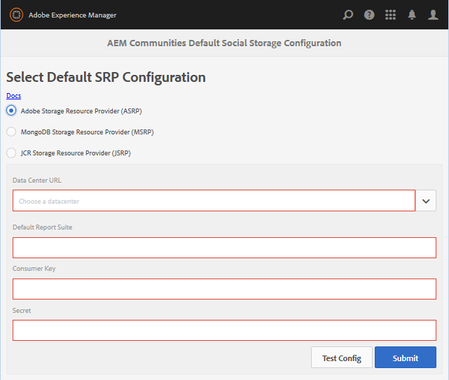

# ASRP - Provider risorsa di archiviazione Adobe {#asrp-adobe-storage-resource-provider}

## Informazioni su ASRP {#about-asrp}

Quando AEM Communities è configurato per utilizzare ASRP come archivio comune, il contenuto generato dall’utente (UGC) è accessibile da tutte le istanze di authoring e pubblicazione senza la necessità di sincronizzazione o replica.

Vedi anche [Caratteristiche delle opzioni SRP](/help/communities/working-with-srp.md#characteristics-of-srp-options) e [Topologie consigliate](/help/communities/topologies.md).

## Requisiti  {#requirements}

Per l’utilizzo dell’ASRP è necessaria una licenza aggiuntiva.

Per configurare il sito AEM Communities per l’utilizzo di ASRP per UGC, contatta il rappresentante del tuo account per:

* URL del centro dati (indirizzo dell’endpoint ASRP)
* Chiave consumer
* Chiave segreta
* ID suite di rapporti

Le chiavi consumer e segrete sono condivise in tutte le suite di rapporti per un&#39;azienda. Esiste una suite di rapporti per tenant.

## Configurazione {#configuration}

### Seleziona ASRP {#select-asrp}

La [Console di configurazione dell&#39;archiviazione](/help/communities/srp-config.md) consente la selezione della configurazione di storage predefinita, che identifica quale implementazione dell&#39;SRP utilizzare.

**Nell’istanza di AEM Author:**

* Dalla navigazione globale, passa a **[!UICONTROL Strumenti > Community > Configurazione storage]** e seleziona **[!UICONTROL Provider di risorse di archiviazione Adobe (ASRP)]**.

Le seguenti informazioni provengono dal processo di provisioning:

* **URL del centro dati**: Pull down per selezionare il data center di produzione identificato dal rappresentante del tuo account.
* **Suite di rapporti predefinita**: Immetti il nome della suite di rapporti predefinita.
* **Chiave del consumatore**: Immetti la chiave del consumatore.
* **Segreto**: Inserisci il segreto.
* Seleziona **Invia**.

Prepara le istanze di pubblicazione:

* [Replicare la chiave crittografica](#replicate-the-crypto-key)
* [Replicare la configurazione](#publishing-the-configuration)

Dopo aver inviato la configurazione, verifica la connessione:

* Seleziona **Configurazione del test**.

   Per ogni istanza di authoring e pubblicazione, verificare la connessione al data center dalla console Configurazione archiviazione.

* Assicurati che gli URL del sito per i dati del profilo siano indirizzabili dal centro dati per [esternalizzazione dei collegamenti](#externalize-links).

### Replicare la chiave Crypto {#replicate-the-crypto-key}

La chiave del consumatore e la chiave segreta sono crittografate. Affinché le chiavi siano crittografate o decrittografate correttamente, la chiave principale di crittografia Granite deve essere la stessa su tutte le istanze AEM.

Segui le istruzioni riportate in [Replicare la chiave Crypto](/help/communities/deploy-communities.md#replicate-the-crypto-key).

### Collegamenti esternalizzati {#externalize-links}

Per i collegamenti corretti al profilo e all’immagine del profilo, assicurati di [Configurare l’esternalizzatore di collegamenti](/help/sites-developing/externalizer.md).

Assicurati di impostare i domini come URL indirizzabili dall’URL del centro dati (endpoint ASRP).

### Sincronizzazione dei tempi {#time-synchronization}

Affinché l&#39;autenticazione con l&#39;endpoint ASRP abbia successo, i computer che eseguono l&#39;AEM Communities ospitato devono essere sincronizzati in tempo, ad esempio con il [Network Time Protocol (NTP)](https://www.ntp.org/).

### Pubblicazione della configurazione {#publishing-the-configuration}

L’ASRP deve essere identificato come archivio comune su tutte le istanze di authoring e pubblicazione.

Per rendere disponibile nell’ambiente di pubblicazione la stessa configurazione:

Nell’istanza di AEM Author:

* Passa dal menu principale a **[!UICONTROL Strumenti]** > **[!UICONTROL Operazioni]** > **[!UICONTROL Replica]**
* Seleziona **Attiva albero**
* **Percorso iniziale**: naviga a `/conf/global/settings/communities/srpc/`
* Deseleziona **Modificato solo**
* Seleziona **Attiva**

## Aggiornamento da AEM 6.0 {#upgrading-from-aem}

>[!CAUTION]
>
>Se si abilita ASRP su un sito community pubblicato, qualsiasi UGC già memorizzato in [JCR](/help/communities/jsrp.md) non è più visibile, in quanto non vi è sincronizzazione di dati tra l’archiviazione on-premise e l’archiviazione cloud.

**`AEM Communities Extension`** è stato introdotto in AEM 6.0 social community as a cloud service. A partire da AEM 6.1 Communities, non è necessaria alcuna configurazione cloud, è sufficiente selezionare ASRP da [console di configurazione dello storage](/help/communities/srp-config.md).

A causa della nuova struttura di storage, è necessario seguire il [aggiornamento](/help/communities/upgrade.md#adobe-cloud-storage) istruzioni per l&#39;aggiornamento da social community a Communities.

## Gestione dei dati utente {#managing-user-data}

Per informazioni riguardanti *utenti*, *profili utente* e *gruppi di utenti*, spesso inserito nell’ambiente di pubblicazione, visita

* [Sincronizzazione utente](/help/communities/sync.md)
* [Gestione di utenti e gruppi di utenti](/help/communities/users.md)

## Risoluzione dei problemi {#troubleshooting}

### UGC scompare dopo l&#39;aggiornamento {#ugc-disappears-after-upgrade}

Se effettui l&#39;aggiornamento da un sito esistente della community social AEM 6.0, assicurati di seguire la [istruzioni di aggiornamento](/help/communities/upgrade.md#adobe-cloud-storage), altrimenti UGC sembra essere perso.

### Errori di autenticazione {#authentication-errors}

Se ricevi errori di autenticazione rispetto all&#39;URL del centro dati e il registro degli errori AEM contiene messaggi sulle marche temporali non aggiornate, verifica che la sincronizzazione dell&#39;ora sia in corso.

Utilizza uno strumento come [Network Time Protocol (NTP)](https://www.ntp.org/) sincronizza con il tempo tutti i server di authoring e pubblicazione AEM.

### Il nuovo contenuto non viene visualizzato nelle ricerche {#new-content-does-not-appear-in-searches}

L&#39;infrastruttura di archiviazione cloud Adobe utilizza *coerenza finale* per raggiungere gli obiettivi di scalabilità e prestazioni. Per questo motivo, i nuovi contenuti non sono immediatamente disponibili e la loro visualizzazione nei risultati della ricerca richiede diversi secondi.

Mentre l’intervallo che influisce sulla coerenza finale viene monitorato, contatta il rappresentante del tuo account se ci vogliono più di pochi secondi perché il nuovo contenuto venga visualizzato nelle ricerche.

### UGC non visibile nell’ASRP {#ugc-not-visible-in-asrp}

Assicurati che l’ASRP sia stato configurato come provider predefinito controllando la configurazione dell’opzione di archiviazione. Per impostazione predefinita, il provider delle risorse di archiviazione è JSRP, non ASRP.

Su tutte le istanze di authoring e pubblicazione AEM, rivedi la console di configurazione dello storage o controlla l’archivio AEM.

In JCR, se [/conf/global/settings/communities](https://localhost:4502/crx/de/index.jsp#/etc/socialconfig/):

* Non contiene un [srpc](https://localhost:4502/crx/de/index.jsp#/conf/global/settings/communities/srp) node, significa che il provider di archiviazione è JSRP.
* Se il nodo srpc esiste e contiene [configurazione predefinita](https://localhost:4502/crx/de/index.jsp#/conf/global/settings/communities/srp/defaultconfiguration) le proprietà della configurazione predefinita definiscono ASRP come provider predefinito.
