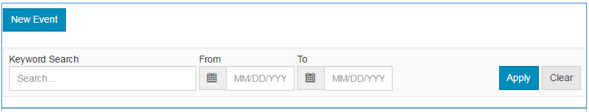

# Funzione calendario {#calendar-feature}

## Introduzione {#introduction}

La funzione calendario supporta la fornitura di informazioni sugli eventi della community in formato calendario a tutti i visitatori del sito o solo ai visitatori del sito (membri della community), mentre solo i membri autorizzati possono aggiungere eventi.

Questa sezione della documentazione descrive

* Aggiunta della funzione calendario a un sito AEM
* Impostazioni di configurazione per `Calendar` componenti

## Aggiunta di un calendario a una pagina {#adding-a-calendar-to-a-page}

Per aggiungere una `Calendar` componente per una pagina in modalità di creazione, usate il browser componenti per individuare

* `Communities / Calendar`

e trascinarlo nella posizione desiderata su una pagina, ad esempio una posizione relativa alla funzione da rivedere per gli utenti.

Per le informazioni necessarie, visita [Nozioni di base sui componenti di Communities](/help/communities/basics.md).

Quando il [librerie lato client richieste](/help/communities/calendar-basics-for-developers.md#essentials-for-client-side) sono inclusi, è così che `Calendar` apparirà .

### Configurazione del calendario {#configuring-calendar}

Seleziona il `Calendar` per accedere e selezionare il `Configure` che apre la finestra di dialogo di modifica.

#### Scheda Impostazioni {#settings-tab}

Sotto la **Impostazioni** specificare se consentire o meno l’applicazione dei tag alle voci del calendario.

* **Eventi per pagina**

   Definisce il numero di eventi visualizzati per pagina. Il valore predefinito è 10.

* **Moderato**

   Se questa opzione è selezionata, è necessario approvare la pubblicazione degli eventi di calendario e dei commenti prima che vengano visualizzati su un sito di pubblicazione. Il valore predefinito è deselezionato.

* **Chiuso**

   Se questa opzione è selezionata, il calendario viene chiuso alle nuove voci e ai nuovi commenti dell’evento. Il valore predefinito è deselezionato.

* **Editor Rich Text**

   Se questa opzione è selezionata, è possibile inserire eventi di calendario e commenti con markup. Il valore predefinito è selezionato.

* **Consenti assegnazione tag**

   Se questa opzione è selezionata, consenti ai membri di aggiungere etichette di tag agli eventi pubblicati (consulta **Campo tag** ). Il valore predefinito è selezionato.

* **Consenti caricamenti file**

   Se questa opzione è selezionata, consentire l&#39;aggiunta di allegati di file a un evento di calendario o a un commento. Il valore predefinito è selezionato.

* **Consenti Segui**

   Se questa opzione è selezionata, consentire ai membri di seguire gli eventi pubblicati nel calendario. Il valore predefinito è selezionato.

* **Dimensione file massima**

   Pertinente solo se `Allow File Uploads` è controllata. Questo campo limita le dimensioni (in byte) di un file caricato. Il valore predefinito è 104857600 (10 Mb).

* **Tipi di file consentiti**

   Pertinente solo se `Allow File Uploads` è controllata. Elenco di estensioni di file separate da virgola con il separatore &quot;punto&quot;. Ad esempio: .jpg, .jpeg, .png, .doc, .docx, .pdf. Se sono specificati dei tipi di file, non sarà possibile caricare quelli non specificati. Il valore predefinito non è specificato in modo che tutti i tipi di file siano consentiti.

* **Dimensione massima per file immagine allegato**

   Pertinente solo se l’opzione Consenti caricamenti file è selezionata. Numero massimo di byte di un file immagine caricato. Il valore predefinito è 2097152** **(2 Mb).

* **Tipi di immagine di copertina consentiti**

   Elenco separato da virgole di estensioni di file immagine con il separatore &quot;punto&quot;. Il valore predefinito è `.jpg,.jpeg,.png,.gif,.bmp`.

* **Consenti risposte concatenate**

   Se questa opzione è selezionata, consenti risposte ai commenti inviati all&#39;evento calendario. Il valore predefinito è selezionato.

* **Consenti agli utenti di eliminare commenti ed eventi**

   Se questa opzione è selezionata, consentire ai membri di eliminare i commenti e gli eventi di calendario che hanno pubblicato. Il valore predefinito è** **selezionato.

* **Consenti votazione**

   Se questa opzione è selezionata, includi la funzione Voto con un evento calendario. Il valore predefinito è selezionato.

* **Mostra breadcrumb**

   Mostra breadcrumb su pagina eventi. Il valore predefinito è selezionato.

* **Filtro intervallo di date**

   Definisce il numero di giorni aggiunti alla data corrente per calcolare il valore &quot;A&quot; del filtro della pagina di elenco eventi del calendario. Il numero predefinito è 30.

* **Consenti contenuto in primo piano**

   Se questa opzione è selezionata, l’idea può essere identificata come [contenuto in primo piano](/help/communities/featured.md). Il valore predefinito è deselezionato.

Sotto la **Moderazione utente** scheda , specifica come vengono gestiti gli argomenti e le risposte pubblicati (contenuto generato dall’utente). Per ulteriori informazioni, consulta [Moderazione dei contenuti generati dagli utenti](/help/communities/moderate-ugc.md).

#### Scheda Moderazione utente {#user-moderation-tab}

* **Rifiuta post**

   Se questa opzione è selezionata, ai moderatori di membri affidabili sarà consentito di negare i post e impedire che il post appaia sul forum pubblico. Il valore predefinito è selezionato.

* **Chiudi/Riapri eventi**

   Se questa opzione è selezionata, i moderatori membri attendibili possono chiudere un evento per ulteriori modifiche e commenti e riaprire un evento. Il valore predefinito è selezionato.

* **Segnala post**

   Se questa opzione è selezionata, consentire ai membri di contrassegnare gli eventi o i commenti di altri utenti come inappropriati. Il valore predefinito è selezionato.

* **Elenco di motivi per segnalazione**

   Se questa opzione è selezionata, consenti ai membri di scegliere, da un elenco a discesa, il motivo per cui contrassegnano un evento o un commento come inappropriato. Il valore predefinito è deselezionato.

* **Motivo per segnalazione personalizzato**

   Se questa opzione è selezionata, consentire ai membri di inserire il proprio motivo per contrassegnare un evento o un commento come inappropriato. Il valore predefinito è deselezionato.

* **Soglia moderazione**

   Immetti il numero di volte in cui un evento o un commento deve essere segnalato dai membri prima che i moderatori vengano informati. Il valore predefinito è 1 (una volta).

* **Limite segnalazione**

   Immetti il numero di volte in cui un evento o un commento deve essere contrassegnato prima che sia nascosto dalla visualizzazione pubblica. Se è impostato su -1, l&#39;argomento o il commento contrassegnato non viene mai nascosto dalla visualizzazione pubblica. In caso contrario, questo numero deve essere maggiore o uguale alla soglia di moderazione. Il valore predefinito è 5.

#### Scheda Campo tag {#tag-field-tab}

Sotto la **Campo tag** , i tag che possono essere applicati, se consentiti nella **Impostazioni** sono limitati in base ai namespace selezionati.

* **Namespace consentiti**

   Pertinente se `Allow Tagging` è controllato sotto **Impostazioni** scheda . I tag che possono essere applicati sono limitati a quelli nelle categorie dello spazio dei nomi selezionate. L’elenco dei namespace include sia &quot;Tag standard&quot; (lo spazio dei nomi predefinito) che &quot;Includi tutti i tag&quot;. Il valore predefinito non è selezionato, il che significa che tutti i namespace sono consentiti.

* **Limite di suggerimenti**

   Immettere il numero di tag da visualizzare come suggerimento al membro che pubblica sul forum. Il valore predefinito è **-**1 (nessun limite).

>[!NOTE]
>
>Visita [Amministrazione dei tag](/help/sites-administering/tags.md) per scoprire come aggiungere un nuovo namespace tag (tassonomia).

#### Scheda Traduzione {#translation-tab}

Sotto la **Traduzione** Se la traduzione è abilitata per il sito community, la traduzione può essere impostata per tradurre l&#39;intero thread (evento e commenti) invece di post specifici.

* **Traduci tutto**

   Se questa opzione è selezionata, l&#39;evento e i commenti vengono tradotti nella lingua preferita dell&#39;utente. Il valore predefinito è selezionato.

## Esperienza dei visitatori del sito {#site-visitor-experience}

Nell’ambiente di pubblicazione, la funzione calendario visualizza un campo di ricerca con un intervallo di date predefinito ed eventuali eventi di calendario che rientrano in tale intervallo.

Quando si seleziona un evento calendario, vengono visualizzati i dettagli, la descrizione e i commenti dell&#39;evento calendario.

Altre funzionalità dipendono dal fatto che il visitatore del sito sia un moderatore, un amministratore, un membro della community, un membro privilegiato o un anonimo.

### Moderatori e amministratori {#moderators-and-administrators}

Quando l&#39;utente connesso dispone di privilegi di moderatore o amministratore, può eseguire [attività di moderazione](/help/communities/moderate-ugc.md) (come consentito dalla configurazione del componente) su tutti gli eventi del calendario e i commenti inviati a un evento.

#### Membri {#members}

Quando l&#39;utente connesso è un membro della community o [membro privilegiato](/help/communities/users.md#privileged-members-group) (a seconda della configurazione), possono selezionare `New Event` per creare e pubblicare un nuovo evento calendario.

In particolare, possono:

* Crea un nuovo evento calendario
* Pubblica un commento a un evento calendario
* Modifica un proprio evento o commento calendario
* Elimina il proprio evento o commento calendario
* Contrassegna altri eventi o commenti del calendario

#### Anonimo {#anonymous}

I visitatori del sito che non hanno effettuato l’accesso possono solo leggere eventi di calendario postati, tradurli se supportati, ma non possono aggiungere un evento o un commento né contrassegnare eventi o commenti di altri.

## Informazioni aggiuntive {#additional-information}

Per ulteriori informazioni, consulta [Nozioni di base sul calendario](/help/communities/calendar-basics-for-developers.md) per sviluppatori.

Per la moderazione degli eventi e dei commenti del calendario, vedi [Moderazione dei contenuti generati dagli utenti](/help/communities/moderate-ugc.md).

Per assegnare tag agli eventi e ai commenti del calendario, consulta [Assegnazione tag ai contenuti generati dagli utenti](/help/communities/tag-ugc.md).

Per la traduzione di eventi e commenti relativi al calendario, vedi [Traduzione di contenuti generati dagli utenti](/help/communities/translate-ugc.md).
