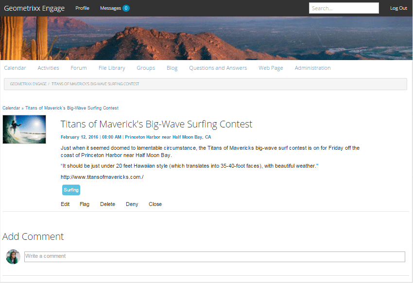

# Funzione calendario {#calendar-feature}

## Introduzione {#introduction}

La funzione di calendario supporta la fornitura di informazioni sull&#39;evento community in formato calendario a tutti i visitatori del sito o solo ai visitatori del sito (membri della community), mentre solo i membri autorizzati possono aggiungere eventi.

Questa sezione della documentazione descrive

* Aggiunta della funzione calendario a un sito AEM
* Impostazioni di configurazione per `Calendar` i componenti

## Adding a Calendar to a Page {#adding-a-calendar-to-a-page}

Per aggiungere un `Calendar` componente a una pagina in modalità di creazione, usate il browser dei componenti per individuare

* `Communities / Calendar`

e trascinarlo nella posizione desiderata su una pagina, ad esempio una posizione relativa alla funzione che gli utenti potranno rivedere.

Per le informazioni necessarie, consulta [Community Components Basics](/help/communities/basics.md).

Quando vengono incluse le librerie [lato client](/help/communities/calendar-basics-for-developers.md#essentials-for-client-side) richieste, viene visualizzato così il `Calendar` componente.

### Configurazione del calendario {#configuring-calendar}

Selezionate il `Calendar` componente inserito a cui accedere e selezionate l’ `Configure` icona che apre la finestra di dialogo di modifica.

#### scheda Impostazioni {#settings-tab}

Nella scheda **Impostazioni** , specificare se consentire o meno l&#39;applicazione dei tag alle voci del calendario.

* **Eventi per pagina**

   Definisce il numero di eventi visualizzati per pagina. Il valore predefinito è 10.

* **Moderato**

   Se questa opzione è attivata, gli eventi di calendario e i commenti devono essere approvati prima che vengano visualizzati su un sito di pubblicazione. Il valore predefinito è deselezionato.

* **Chiuso**

   Se questa opzione è attivata, il calendario viene chiuso alle nuove voci e ai commenti dell&#39;evento. Il valore predefinito è deselezionato.

* **Editor Rich Text**

   Se questa opzione è attivata, è possibile inserire eventi e commenti del calendario con la marcatura. Il valore predefinito è selezionato.

* **Consenti assegnazione tag**

   Se questa opzione è selezionata, consentite ai membri di aggiungere etichette di tag agli eventi inseriti (consultate la scheda Campo **** tag ). Il valore predefinito è selezionato.

* **Consenti caricamenti file**

   Se questa opzione è selezionata, consentire l&#39;aggiunta di allegati a un evento o commento del calendario. Il valore predefinito è selezionato.

* **Consenti Segui**

   Se questa opzione è selezionata, consentire ai membri di seguire gli eventi inviati al calendario. Il valore predefinito è selezionato.

* **Dimensione file massima**

   Pertinente solo se `Allow File Uploads` è controllato. Questo campo limita la dimensione (in byte) di un file caricato. Il valore predefinito è 104857600 (10 Mb).

* **Tipi di file consentiti**

   Pertinente solo se `Allow File Uploads` è controllato. Un elenco separato da virgole di estensioni di file con il separatore &quot;punto&quot;. Ad esempio: .jpg, .jpeg, .png, .doc, .docx, .pdf. Se vengono specificati dei tipi di file, non sarà possibile caricare quelli non specificati. Il valore predefinito non è specificato, pertanto tutti i tipi di file sono consentiti.

* **Dimensione massima per file immagine allegato**

   Pertinente solo se l&#39;opzione Consenti caricamenti file è selezionata. Numero massimo di byte di cui può disporre un file immagine caricato. Il valore predefinito è 2097152****(2 Mb).

* **Tipi di immagine di copertina consentiti**

   Elenco separato da virgole di estensioni di file immagine con il separatore &quot;punto&quot;. Default is `.jpg,.jpeg,.png,.gif,.bmp`.

* **Consenti risposte concatenate**

   Se questa opzione è selezionata, consentire le risposte ai commenti inviati all&#39;evento del calendario. Il valore predefinito è selezionato.

* **Consenti agli utenti di eliminare commenti ed eventi**

   Se questa opzione è selezionata, consentire ai membri di eliminare i commenti e gli eventi di calendario da essi inviati. Il valore predefinito è** **selezionato.

* **Consenti votazione**

   Se questa opzione è selezionata, includete la funzione di votazione con un evento del calendario. Il valore predefinito è selezionato.

* **Mostra breadcrumb**

   Mostra breadcrumb su pagina eventi. Il valore predefinito è selezionato.

* **Filtro intervallo di date**

   Definisce il numero di giorni aggiunti alla data corrente al fine di calcolare il valore &quot;A&quot; del filtro della pagina di elenco eventi del calendario. Il numero predefinito è 30.

* **Consenti contenuto in primo piano**

   Se questa opzione è selezionata, l’idea può essere identificata come contenuto disponibile. Il valore predefinito è deselezionato.

Nella scheda Moderazione **** utente, specificate in che modo vengono gestiti gli argomenti e le risposte inviati (contenuto generato dall’utente). Per ulteriori informazioni, consultate [Moderazione del contenuto](/help/communities/moderate-ugc.md)generato dall&#39;utente.

#### Scheda Moderazione utente {#user-moderation-tab}

* **Rifiuta post**

   Se questa opzione è attivata, i moderatori di membri attendibili potranno negare i post e impedirne la visualizzazione nel forum pubblico. Il valore predefinito è selezionato.

* **Chiudi/Riapri eventi**

   Se questa opzione è attivata, i moderatori dei membri attendibili possono chiudere un evento per apportare ulteriori modifiche e commenti e riaprire un evento. Il valore predefinito è selezionato.

* **Segnala post**

   Se questa opzione è selezionata, consentire ai membri di contrassegnare eventi o commenti di altri utenti come inappropriati. Il valore predefinito è selezionato.

* **Elenco di motivi per segnalazione**

   Se questa opzione è selezionata, consentite ai membri di scegliere, da un elenco a discesa, il motivo per cui l&#39;evento è contrassegnato o il commento è inappropriato. Il valore predefinito è deselezionato.

* **Motivo per segnalazione personalizzato**

   Se questa opzione è selezionata, consentite ai membri di inserire il proprio motivo per cui un evento o un commento è contrassegnato come inappropriato. Il valore predefinito è deselezionato.

* **Soglia moderazione**

   Immettete il numero di volte in cui un evento o un commento deve essere contrassegnato dai membri prima che i moderatori siano informati. Il valore predefinito è 1 (una volta).

* **Limite segnalazione**

   Immettete il numero di volte in cui un evento o un commento deve essere contrassegnato prima che venga nascosto dalla visualizzazione pubblica. Se è impostato su -1, l&#39;argomento o il commento contrassegnato non viene mai nascosto dalla visualizzazione pubblica. In caso contrario, questo numero deve essere maggiore o uguale alla soglia di moderazione. Il valore predefinito è 5.

#### Scheda Campo tag {#tag-field-tab}

Nella scheda Campo **** tag, i tag che possono essere applicati, se consentiti nella scheda **Impostazioni** , sono limitati in base agli spazi dei nomi selezionati.

* **Namespace consentiti**

   Pertinente se `Allow Tagging` è selezionato sotto la scheda **Impostazioni** . I tag che possono essere applicati sono limitati a quelli all&#39;interno delle categorie dello spazio nomi selezionate. L’elenco degli spazi dei nomi include &quot;Tag standard&quot; (lo spazio dei nomi predefinito) e &quot;Includi tutti i tag&quot;. Il valore predefinito non è selezionato, il che significa che tutti gli spazi dei nomi sono consentiti.

* **Limite di suggerimenti**

   Immettete il numero di tag da visualizzare come suggerimento al membro che invia il messaggio al forum. Il valore predefinito è **-**1 (nessun limite).

>[!NOTE]
>
>Per informazioni su come aggiungere un nuovo spazio nomi tag (tassonomia), visitate [Amministrazione tag](/help/sites-administering/tags.md) .

#### Scheda Traduzione {#translation-tab}

Nella scheda **Traduzione** , se la traduzione è abilitata per il sito della comunità, la traduzione può essere impostata per tradurre l&#39;intero thread (evento e commenti) invece di post specifici.

* **Traduci tutto**

   Se questa opzione è attivata, l&#39;evento e i commenti vengono tradotti nella lingua preferita dell&#39;utente. Il valore predefinito è selezionato.

## Esperienza dei visitatori del sito {#site-visitor-experience}

Nell&#39;ambiente di pubblicazione, la funzione calendario visualizzerà un campo di ricerca con un intervallo di date predefinito, nonché tutti gli eventi di calendario che rientrano in tale intervallo.

Quando viene selezionato un evento del calendario, vengono visualizzati i dettagli, la descrizione e i commenti dell&#39;evento del calendario.

Altre capacità dipendono dal fatto che il visitatore del sito sia un moderatore, un amministratore, un membro della community, un membro privilegiato o un utente anonimo.

### Moderatori e amministratori {#moderators-and-administrators}

Quando l’utente che ha effettuato l’accesso dispone di privilegi di moderatore o amministratore, può eseguire attività [di](/help/communities/moderate-ugc.md) moderazione (come consentito dalla configurazione del componente) su tutti gli eventi del calendario e i commenti inviati a un evento.

#### Membri {#members}

Quando l&#39;utente che ha effettuato l&#39;accesso è un membro della community o un membro  privilegiato (a seconda della configurazione), può selezionare `New Event` di creare e pubblicare un nuovo evento del calendario.

In particolare, essi possono:

* Creazione di un nuovo evento del calendario
* Pubblicare un commento su un evento del calendario
* Modifica di un proprio evento o commento calendario
* Elimina un proprio evento o commento calendario
* Contrassegnare eventi o commenti di calendario di altri utenti

#### Anonimo {#anonymous}

I visitatori del sito che non hanno effettuato l&#39;accesso possono solo leggere gli eventi del calendario postati, tradurli se supportati, ma non possono aggiungere un evento o un commento né contrassegnare eventi o commenti di altri utenti.

## Informazioni aggiuntive {#additional-information}

Ulteriori informazioni sono disponibili nella pagina [Calendar Essentials](/help/communities/calendar-basics-for-developers.md) per gli sviluppatori.

Per la moderazione degli eventi del calendario e dei commenti, vedere [Moderazione del contenuto](/help/communities/moderate-ugc.md)generato dall&#39;utente.

Per assegnare tag agli eventi e ai commenti del calendario, consulta [Assegnazione di tag ai contenuti](/help/communities/tag-ugc.md)generati dagli utenti.

Per la traduzione di eventi e commenti del calendario, vedere [Traduzione di contenuti](/help/communities/translate-ugc.md)generati dagli utenti.
