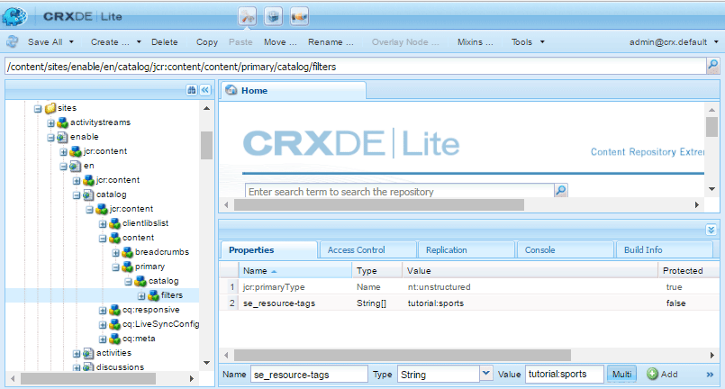

# Nozioni di base sul catalogo {#catalog-essentials}

Questa pagina fornisce le informazioni essenziali per l’utilizzo della funzione di catalogo dei siti della community di abilitazione.

La funzione catalogo, se inclusa in un sito community, consente ai membri della community di sfogliare e selezionare le risorse di abilitazione elencate in un catalogo.

Il [ `enablement catalog` componente](catalog.md) consente ai membri della community di accedere a un catalogo di [risorse di abilitazione](resources.md). L’utilizzo dei tag AEM è una parte importante della gestione dell’aspetto delle risorse di abilitazione in un catalogo.

Consulta [Assegnazione tag alle risorse di abilitazione](tag-resources.md).

## Funzionalità di base per lato client {#essentials-for-client-side}

<table>
 <tbody>
  <tr>
   <td> <strong>resourceType</strong></td>
   <td>social/enablement/components/hbs/catalog</td>
  </tr>
  <tr>
   <td> <a href="scf.md#add-or-include-a-communities-component"><strong>comprensivo</strong></a></td>
   <td>No</td>
  </tr>
  <tr>
   <td> <a href="clientlibs.md"><strong>clientlibs</strong></a></td>
   <td>cq.social.enablement.hbs.breadcrumbs  cq.social.enablement.hbs.catalog  cq.social.enablement.hbs.resource  cq.social.enablement.hbs.learningpath</td>
  </tr>
  <tr>
   <td> <strong>templates</strong></td>
   <td> /libs/social/enablement/components/hbs/catalog/catalog.hbs  </td>
  </tr>
  <tr>
   <td> <strong>css</strong></td>
   <td> /libs/social/enablement/components/hbs/catalog/clientlibs/catalog.css</td>
  </tr>
  <tr>
   <td><strong> proprietà</strong></td>
   <td>Consulta <a href="catalog.md">Funzionalità del catalogo</a></td>
  </tr>
 </tbody>
</table>

## Funzioni di base per lato server {#essentials-for-server-side}

### Funzione Catalogo {#catalog-function}

Una struttura del sito community che include la [funzione Catalogo](functions.md#catalog-function), include un componente `enablement catalog` configurato.

### Pre-filtri {#pre-filters}

Quando una funzione Catalogo è stata aggiunta a un sito community, è possibile limitare le risorse di abilitazione e i percorsi di apprendimento visualizzati nel catalogo specificando un filtro preliminare. A questo scopo, imposta le proprietà sull’istanza della risorsa del catalogo per il sito.

Utilizzando l&#39;esempio del [Tutorial di abilitazione](getting-started-enablement.md):

* Autore
* Utilizzo di [CRXDE](../../help/sites-developing/developing-with-crxde-lite.md)

   * Ad esempio [https://&lt;server>:&lt;port>/crx/de](http://localhost:4502/crx/de)

* Passa alla risorsa del catalogo nella pagina del catalogo

   * Esempio, `/content/sites/enable/en/catalog/jcr:content/content/primary/catalog`

* Aggiungi un nodo di filtri figlio

   * Selezionare il nodo `catalog`
   * Seleziona **[!UICONTROL Crea nodo]**

      * Nome: `filters`
      * Tipo: `nt:unstructured`
      * Seleziona **[!UICONTROL Salva tutto]**

* Aggiungi la proprietà `se_resource-tags` al nodo `filters`

   * Seleziona il nodo `filters`
   * Aggiungi una proprietà multipla

      * Nome: `se_resource-tags`
      * Tipo: Stringa
      * Valore: *&lt;enter a [TagID](#pre-filter-tagids)>*
         * Seleziona **[!UICONTROL Multi]**
         * Seleziona **[!UICONTROL Aggiungi]**

            * Nella finestra di dialogo a comparsa, seleziona `+` per aggiungere tag ID pre-filtro aggiuntivi

* Ripubblica il sito della community

#### Tag ID pre-filtro {#pre-filter-tagids}

Il pre-filtro [TagIDs](../../help/sites-developing/framework.md#tagid) deve corrispondere esattamente ai tag applicati alle risorse di abilitazione. Questi sono visibili nella cartella `resources` del sito come valori della proprietà `se_resource-tags`.

### API di riferimento {#reference-apis}

* [API di abilitazione](https://helpx.adobe.com/experience-manager/6-5/sites/developing/using/reference-materials/javadoc/com/adobe/cq/social/enablement/reporting/model/api/package-summary.html)

* [API di reporting](https://helpx.adobe.com/experience-manager/6-5/sites/developing/using/reference-materials/javadoc/com/adobe/cq/social/reporting/dv/api/package-summary.html)

* [API di Reporting Analytics](https://helpx.adobe.com/experience-manager/6-5/sites/developing/using/reference-materials/javadoc/com/adobe/cq/social/reporting/dv/model/api/package-summary.html)
