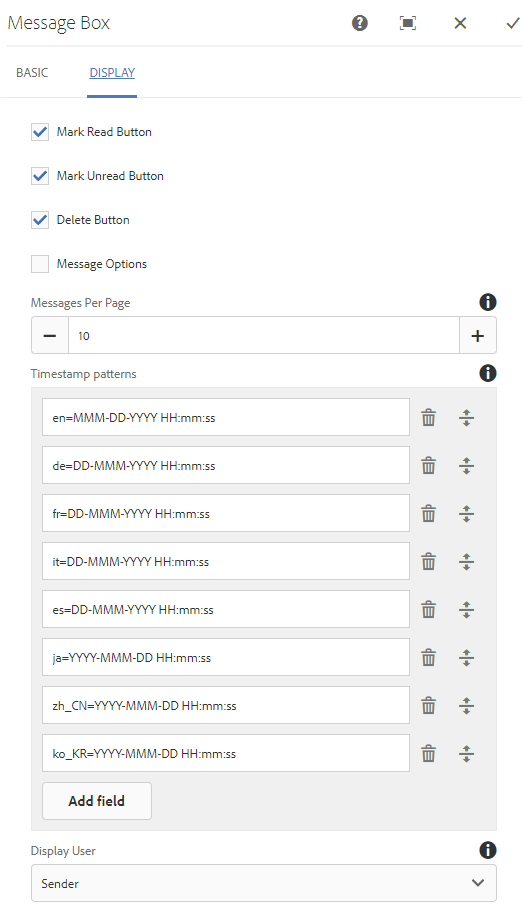

# Funzione di messaggistica {#messaging-feature}

Oltre alle interazioni pubblicamente visibili che si verificano nei forum e nei commenti, la funzione di messaggistica di AEM Communities consente ai membri della community di interagire tra loro in modo più privato.

Questa funzione può essere inclusa quando [sito community](/help/communities/overview.md#communitiessites) viene creato.

La funzione di messaggistica consente di effettuare le seguenti operazioni:

**A** - inviare un messaggio a uno o più membri della community

**B** - inviare messaggi diretti in [bulk ai gruppi membri della community](/help/communities/messaging.md#group-messaging)

**C** - inviare un messaggio con allegati

**D** - inoltra un messaggio

**E** - rispondere a un messaggio

**F** - eliminare un messaggio

**G** - ripristinare un messaggio eliminato

Per abilitare e modificare la funzione di messaggistica, consulta:

* [Configurare la messaggistica](/help/communities/messaging.md) per gli amministratori
* [Nozioni di base sulla messaggistica](/help/communities/essentials-messaging.md) per sviluppatori

>[!NOTE]
>
>Non è supportato per l’aggiunta `Compose Message, Message, or Message List` componenti (disponibili in `Communities`gruppo di componenti) a una pagina in modalità di modifica dell’autore.

## Configurare i componenti di messaggistica {#configure-messaging-components}

Quando la messaggistica è abilitata per un sito community, non è necessario configurarla ulteriormente. Le informazioni vengono fornite se è necessario modificare la configurazione predefinita.

### Configura elenco messaggi (finestra di messaggio) {#configure-message-list-message-box}

Per modificare la configurazione dell&#39;elenco di messaggi per **Casella in entrata**, **Elementi inviati**, e **Cestino** pagine della funzione di messaggistica, apri il sito in [modalità modifica autore](/help/communities/sites-console.md#authoring-site-content).

1. In entrata `Preview` , seleziona la **Messaggi** per aprire la pagina di messaggistica principale. Quindi seleziona **Casella in entrata**, **Elementi inviati** o **Cestino** per configurare il componente per l’elenco dei messaggi.

1. In entrata `Edit` in modalità, seleziona il componente nella pagina.
1. Per accedere alla finestra di dialogo di configurazione, annulla l’ereditarietà selezionando la `link` icona.
Una volta annullata l’ereditarietà, è possibile selezionare l’icona di configurazione per aprire la finestra di dialogo di configurazione.

1. Una volta completata la configurazione, è necessario ripristinare l’ereditarietà selezionando la `broken link` icona.

#### Scheda Base {#basic-tab}

* **Selettore servizio**

  (*Obbligatorio*) Impostate questo valore sul valore della proprietà **`serviceSelector.name`** dal [Servizio operazioni di messaggistica di AEM Communities](/help/communities/messaging.md#messaging-operations-service).

* **Componi pagina**

  (*Obbligatorio*) Pagina da aprire quando un membro fa clic su **`Reply`** pulsante. La pagina di destinazione deve contenere **Componi messaggio** modulo.

* **Rispondi/Visualizza come risorsa**

  Se questa opzione è selezionata, l’URL di risposta e l’URL di visualizzazione fanno riferimento a una risorsa, altrimenti i dati vengono trasmessi come parametri di query nell’URL.

* **Modulo di visualizzazione profilo**

  Modulo di profilo da utilizzare per visualizzare il profilo mittenti.

* **Cartella cestino**

  Se questa opzione è selezionata, in questo componente Elenco messaggi vengono visualizzati solo i messaggi contrassegnati come eliminati (cestino).

* **Percorsi cartelle**

  (*Obbligatorio*) Con riferimento ai valori impostati per **inbox.path.name** e **sentitems.path.name** nel [Servizio operazioni di messaggistica di AEM Communities](/help/communities/messaging.md#messaging-operations-service). Durante la configurazione per un `Inbox`, aggiungi una voce utilizzando il valore di **inbox.path.name**. Durante la configurazione per un `Outbox`, aggiungi una voce utilizzando il valore di **sentitems.path.name**. Durante la configurazione di per `Trash`, aggiungi due voci con entrambi i valori.

#### Scheda Visualizzazione {#display-tab}

* **Pulsante Segna come già letto**

  Se questa opzione è selezionata, visualizza una `Read`che consente di contrassegnare un messaggio come letto.

* **Pulsante Segna come da leggere**

  Se questa opzione è selezionata, visualizza una `Mark Unread` che consente di contrassegnare un messaggio come letto.

* **Pulsante Elimina**

  Se questa opzione è selezionata, visualizza una `Delete` che consente di contrassegnare un messaggio come letto. Duplica la funzionalità di eliminazione se **`Message Options`** è selezionato anche.

* **Opzioni messaggio**

  Se questa opzione è selezionata, visualizza **`Reply`**, **`Reply All`**, **`Forward`**, e **`Delete`** pulsanti che consentono di inviare o eliminare nuovamente un messaggio. Duplica la funzionalità di eliminazione se **`Delete Button`** è selezionato anche.

* **Messaggi per pagina**

  Il numero specificato è il numero massimo di messaggi visualizzati per pagina in uno schema di impaginazione. Se non viene specificato alcun numero (lasciato vuoto), vengono visualizzati tutti i messaggi e non è presente alcuna impaginazione.

* **Pattern per marca temporale**

  Fornisci modelli di marca temporale per una o più lingue. Il valore predefinito è en, de, fr, it, es, ja, zh_CN, ko_KR.

* **Visualizza utente**

  Scegli una delle seguenti opzioni **`Sender`** o **`Recipients`** in modo da poter determinare se visualizzare il mittente o i destinatari.

### Configura messaggio di composizione {#configure-compose-message}

Per modificare la configurazione della pagina del messaggio di composizione, apri il sito in [modalità modifica autore](/help/communities/sites-console.md#authoring-site-content).

* In entrata `Preview` , seleziona la **Messaggi** per aprire la pagina di messaggistica principale. Quindi seleziona il pulsante Nuovo messaggio per aprire `Compose Message` pagina.

* In entrata `Edit` , seleziona il componente principale nella pagina contenente il corpo del messaggio.
* Per accedere alla finestra di dialogo di configurazione, annulla l’ereditarietà selezionando la `link` icona.
Una volta annullata l’ereditarietà, è possibile selezionare l’icona di configurazione per aprire la finestra di dialogo di configurazione.

* Una volta completata la configurazione, è necessario ripristinare l’ereditarietà selezionando la `broken link` icona.

#### Scheda Base {#basic-tab-1}

* **URL di reindirizzamento**

  Immetti l’URL della pagina visualizzata dopo l’invio del messaggio. Esempio: `../messaging.html`.

* **Annulla URL**

  Inserisci l’URL della pagina visualizzata se il mittente annulla il messaggio. Esempio: `../messaging.html`.

* **Lunghezza massima oggetto del messaggio**

  Numero massimo di caratteri consentito nel campo Oggetto. Ad esempio, 500. Il valore predefinito non è un limite.

* **Lunghezza massima del corpo del messaggio**

  Numero massimo di caratteri consentito nel campo Contenuto. Ad esempio, 10000. Il valore predefinito non è un limite.

* **Selettore servizio**

  (*Obbligatorio*) Impostate questo valore sul valore della proprietà **`serviceSelector.name`** dal [Servizio operazioni di messaggistica di AEM Communities](/help/communities/messaging.md#messaging-operations-service).

#### Scheda Visualizzazione {#display-tab-1}

* **Mostra campo oggetto**

  Se questa opzione è selezionata, mostra `Subject` e abilitare l’aggiunta di un oggetto al messaggio. Il valore predefinito non è selezionato.

* **Etichetta oggetto**

  Immettere il testo che si desidera visualizzare accanto al `Subject` campo. Il valore predefinito è `Subject`.

* **Mostra campo Allega file**

  Se questa opzione è selezionata, mostra `Attachment` e abilitare l’aggiunta di allegati al messaggio. Il valore predefinito non è selezionato.

* **Etichetta Allega file**

  Immettere il testo che si desidera visualizzare accanto al `Attachment` campo. Il valore predefinito è **`Attach File`**.

* **Mostra campo contenuto**

  Se questa opzione è selezionata, mostra `Content` e abilitare l’aggiunta di un corpo del messaggio. Il valore predefinito non è selezionato.

* **Etichetta contenuto**

  Immettere il testo che si desidera visualizzare accanto al `Content` campo. Il valore predefinito è **`Body`**.

* **Con editor Rich Text**

  Se questa opzione è selezionata, indica l&#39;utilizzo di una casella di testo Contenuto personalizzata con il relativo editor Rich Text. Il valore predefinito non è selezionato.

* **Pattern per marca temporale**

  Fornisci modelli di marca temporale per una o più lingue. Il valore predefinito è en, de, fr, it, es, ja, zh_CN, ko_KR.
