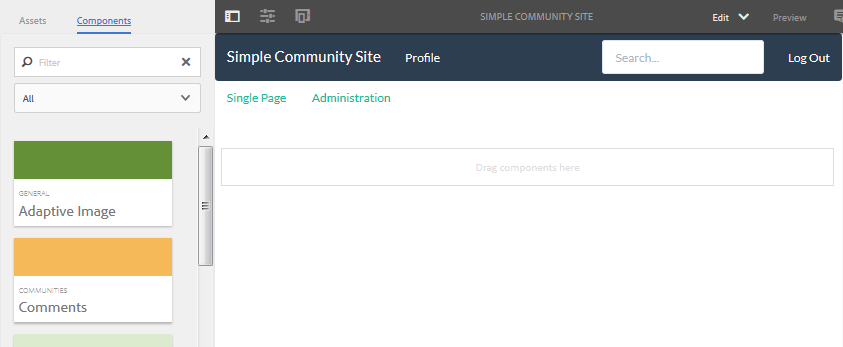

# Crea una pagina di esempio {#create-a-sample-page}

A partire da AEM 6.1 Communities, il modo più semplice per creare una pagina di esempio è quello di creare un sito community semplice, costituito semplicemente da una funzione Pagina.

Ciò include un componente parsys che consente di [abilitare i componenti per l&#39;authoring](basics.md#accessing-communities-components).

Un&#39;altra opzione per l&#39;esplorazione con componenti di esempio consiste nell&#39;utilizzare le funzionalità presentate nella [Guida ai componenti della community](components-guide.md).

## Creare un sito community {#create-a-community-site}

È simile alla creazione di un sito descritto in [Guida introduttiva ad AEM Communities](getting-started.md).

La differenza principale è che questa esercitazione crea un modello di sito community contenente solo la funzione [Pagina](functions.md#page-function) per creare un sito community semplice. Questa operazione è priva di altre funzioni (diverse dalle funzioni pre-cablate di base per tutti i siti della community).

### Crea nuovo modello sito {#create-new-site-template}

Per iniziare, creare un semplice [modello di sito community](sites.md).

Dalla navigazione globale in un&#39;istanza Autore, seleziona **[!UICONTROL Strumenti]** > **[!UICONTROL Community]** > **[!UICONTROL Modelli sito]**.

* Seleziona `Create button`
* INFORMAZIONI DI BASE

   * `Name`: modello a pagina singola
   * `Description`: modello costituito da una singola funzione Page.
   * Seleziona `Enabled`

* STRUTTURA

   * Trascina una funzione `Page` nel Generatore di modelli
   * Per Dettagli funzione di configurazione, immetti

      * `Title`: pagina singola
      * `URL`: pagina

* Seleziona **`Save`** per la configurazione
* Seleziona **`Save`** per il modello di sito

### Crea nuovo sito community {#create-new-community-site}

Ora crea un sito community basato sul modello di sito semplice.

Dopo aver creato il modello di sito, dalla navigazione globale selezionare **[!UICONTROL Community > Siti]**.

* Seleziona icona **`Create`**

* Passaggio `1 - Site Template`

   * `Title`: sito community semplice
   * `Description`: sito community costituito da una singola pagina per la sperimentazione.
   * `Community Site Root: (leave blank)`
   * `Community Site Base Language: English`
   * `Name`: esempio

      * url = http://localhost:4502/content/sites/sample

      * `Template`: scegli `Single Page Template`

     

* Seleziona `Next`
* Passaggio `2 - Design`

   * Seleziona qualsiasi design

* Seleziona `Next`
* Seleziona `Next`

  (Accetta tutte le impostazioni predefinite)

* Seleziona `Create`

  

## Publish del sito {#publish-the-site}

Dalla console [siti community](sites-console.md), selezionare l&#39;icona Pubblica per pubblicare il sito, per impostazione predefinita http://localhost:4503.

## Apri il sito su Author in modalità Modifica {#open-the-site-on-author-in-edit-mode}

Selezionare l&#39;icona Apri sito per visualizzare il sito in modalità di modifica.

URL: [http://localhost:4502/editor.html/content/sites/sample/en.html](http://localhost:4502/editor.html/content/sites/sample/en.html)

Nella semplice home page è possibile vedere cosa è preconnesso tramite le funzioni e i modelli della community e giocare con l&#39;aggiunta e la configurazione di componenti della community.

## Visualizza sito su Publish {#view-site-on-publish}

Dopo aver pubblicato la pagina, apri la pagina nell&#39;[istanza di pubblicazione](http://localhost:4503/content/sites/sample/en.html) per sperimentare le funzionalità come visitatore anonimo del sito, membro connesso o amministratore. Il collegamento Amministrazione visibile nell’ambiente di authoring non viene visualizzato nell’ambiente di pubblicazione a meno che un amministratore non effettui l’accesso.
