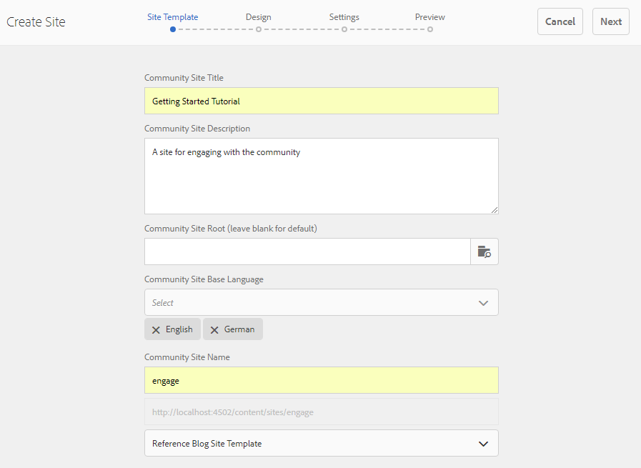

# Creare un sito community{#author-a-new-community-site}

## Creare un sito community {#create-a-community-site}

Utilizza l’istanza di authoring per creare un sito community. Sull’istanza dell’autore AEM:

1. Accedi con privilegi di amministratore.
1. Dalla navigazione globale, passa a **[!UICONTROL Communities]** > **[!UICONTROL Sites]**.

La console Siti di Communities offre una procedura guidata per illustrare i passaggi necessari per la creazione di un sito di community. È possibile passare al passaggio `Next` o `Back` al passaggio precedente prima di eseguire il commit del sito nel passaggio finale.

Per iniziare a creare un sito community:

* Selezionare il pulsante `Create`.

### Passaggio 1: modello del sito {#step-site-template}

Nel [passaggio Modello sito](/help/communities/sites-console.md#step2013asitetemplate), immettere un titolo, una descrizione e il nome dell&#39;URL, quindi selezionare un modello di sito community, ad esempio:

* **Titolo sito community**: `Getting Started Tutorial`
* **Descrizione sito community**: `A site for engaging with the community.`
* **Directory principale sito community**: (lasciare vuoto per la directory principale predefinita `/content/sites`)
* **Configurazioni cloud**: (lasciare vuoto se non si specifica alcuna configurazione cloud) fornisce il percorso delle configurazioni cloud specificate.
* **Lingua base del sito community**: (non modificare per una sola lingua: inglese) utilizzare l&#39;elenco a discesa per scegliere una *o più* lingue di base tra le lingue disponibili: tedesco, italiano, francese, giapponese, spagnolo, portoghese (Brasile), cinese (tradizionale) e cinese (semplificato). Viene creato un sito community per ogni lingua aggiunta ed esiste nella stessa cartella siti seguendo la best practice descritta in [Traduzione di contenuto per siti multilingue](/help/sites-administering/translation.md). La pagina principale di ciascun sito contiene una pagina figlia denominata con il codice della lingua di una delle lingue selezionate, ad esempio &#39;en&#39; per l&#39;inglese o &#39;fr&#39; per il francese.

* **Nome sito community**: Coinvolgi

   * Ricontrolla il nome poiché non è più facile modificarlo dopo la creazione del sito
   * L&#39;URL iniziale viene visualizzato sotto il nome del sito community
   * Per un URL valido, aggiungi un codice della lingua di base + &quot;.html&quot;
   * *Ad esempio*, https://localhost:4502/content/sites/ `engage/en.html`

* **Modello**: trascinare verso il basso per scegliere `Reference Site`

* Seleziona **Avanti**.

### Passaggio 2: Progettazione {#step-design}

Il passaggio Progettazione è presentato in due sezioni per la selezione del tema e del banner di branding:

#### TEMA DEL SITO COMMUNITY {#community-site-theme}

Seleziona lo stile desiderato da applicare al modello. Quando è selezionata, il tema viene sovrapposto con un segno di spunta.

#### MARCHIO PER SITO COMMUNITY {#community-site-branding}

(Facoltativo) Carica un&#39;immagine del banner da visualizzare nelle pagine del sito. Il banner è fissato al bordo sinistro del browser, tra l&#39;intestazione del sito community e i collegamenti di navigazione. L&#39;altezza del banner viene ridotta a 120 pixel. Il banner non viene ridimensionato in base alla larghezza del browser e all&#39;altezza di 120 pixel.

Seleziona **Avanti**.

### Passaggio 3: Impostazioni {#step-settings}

Nel passaggio Impostazioni, prima di selezionare `Next`, sono disponibili sette sezioni che forniscono accesso a configurazioni che includono gestione degli utenti, assegnazione di tag, moderazione, gestione dei gruppi, analisi e traduzione.

#### User Management {#user-management}

Seleziona tutte le caselle di controllo per [Gestione utente](/help/communities/sites-console.md#user-management)

* Per consentire ai visitatori del sito di registrarsi autonomamente
* Per consentire ai visitatori del sito di visualizzare il sito senza effettuare l&#39;accesso
* Per consentire ai membri di inviare e ricevere messaggi da altri membri della community
* Per consentire l’accesso con Facebook anziché registrare e creare un profilo
* Per consentire l&#39;accesso con il Twitter invece di registrare e creare un profilo

>[!NOTE]
>
>Per un ambiente di produzione, è necessario creare applicazioni Facebook e di Twitter personalizzate. Consulta [Accesso social network con Facebook e Twitter](/help/communities/social-login.md).

#### ASSEGNAZIONE TAG {#tagging}

I tag applicati al contenuto della community vengono controllati selezionando gli spazi dei nomi AEM precedentemente definiti tramite la [console di assegnazione tag](/help/sites-administering/tags.md#tagging-console) (ad esempio lo spazio dei nomi [Tutorial](/help/communities/setup.md#create-tutorial-tags)).

Trovare gli spazi dei nomi è facile con la ricerca del tipo-ahead. Ad esempio:

* Digita `tut`
* Seleziona `Tutorial`

#### RUOLI {#roles}

[I ruoli dei membri della community](/help/communities/users.md) vengono assegnati tramite le impostazioni nella sezione Ruoli.

Per consentire a un membro della community (o a un gruppo di membri) di utilizzare il sito come manager della community, utilizzare la ricerca di completamento automatico e selezionare il nome del membro o del gruppo tra le opzioni disponibili nel menu a discesa.

Ad esempio:

* Digita `q`
* Seleziona Quinn Harper

>[!NOTE]
>
>[Il servizio tunnel](https://helpx.adobe.com/it/experience-manager/6-3/help/communities/deploy-communities.html#tunnel-service-on-author) consente la selezione di membri e gruppi esistenti solo nell&#39;ambiente di pubblicazione.

#### MODERAZIONE {#moderation}

Accetta le impostazioni globali predefinite per [moderazione](/help/communities/sites-console.md#moderation) contenuto generato dall&#39;utente (UGC).

#### ANALISI {#analytics}

Se Adobe Analytics è concesso in licenza e sono stati configurati un servizio e un framework di Analytics Cloud, è possibile abilitare Analytics e selezionare il framework.

Consulta [Configurazione di Analytics per le funzionalità delle community](/help/communities/analytics.md).

#### TRADUZIONE {#translation}

Le [impostazioni di traduzione](/help/communities/sites-console.md#translation) specificano la lingua di base per il sito, se è possibile tradurre UGC e in quale lingua.

* Seleziona **Consenti traduzione automatica**
* Lascia le lingue predefinite selezionate per la traduzione dal servizio di traduzione automatica predefinito
* Lascia provider di traduzione e configurazione predefiniti
* Non è necessario uno store globale perché non sono presenti copie in lingua
* Seleziona **Traduci intera pagina**
* Lascia opzione di persistenza predefinita

### Passaggio 4: creare il sito community {#step-create-communities-site}

Seleziona **Crea.**

Al termine del processo, la cartella per il nuovo sito viene visualizzata nella console Community - Sites.

## Publish il sito community {#publish-the-community-site}

Il sito creato deve essere gestito dalla console Community - Sites, la stessa da cui è possibile creare nuovi siti.

Dopo aver selezionato la cartella del sito community per aprirla, passa il puntatore sull&#39;icona del sito in modo da visualizzare quattro icone di azione:

Quando selezioni la quarta icona con i puntini di sospensione (Altre azioni), vengono visualizzate le opzioni Esporta sito ed Elimina sito.

Da sinistra a destra:

* **Apri sito**

  Selezionando l’icona a forma di matita si apre il sito community in modalità di modifica Creazione, dove è possibile aggiungere o configurare i componenti della pagina.

* **Modifica sito**

  Selezionando l&#39;icona delle proprietà si apre il sito community per modificare le proprietà, ad esempio il titolo o il tema.

* **Sito Publish**

  Se si seleziona l&#39;icona mondo, il sito community verrà pubblicato (ad esempio, se il server di pubblicazione è in esecuzione sul computer locale, su localhost:4503 per impostazione predefinita).

* **Esporta sito**

  Selezionando l&#39;icona di esportazione viene creato un pacchetto del sito community archiviato in [Gestione pacchetti](/help/sites-administering/package-manager.md) e scaricato. UGC non incluso nel pacchetto del sito.

* **Elimina sito**

  Se si seleziona l&#39;icona Elimina, il sito community verrà eliminato dalla console **[!UICONTROL Community > Sites]**. Questa azione rimuove tutti gli elementi associati al sito, ad esempio UGC, gruppi di utenti, risorse e record di database.

>[!NOTE]
>
>Se non utilizzi la porta predefinita 4503 per l’istanza Publish, modifica l’agente di replica predefinito per impostare il numero della porta sul valore corretto.
>
>Nell’istanza di authoring, dal menu principale:
>
>1. Passa al menu **[!UICONTROL Strumenti]** > **[!UICONTROL Operazioni]** > **[!UICONTROL Replica]**.
>1. Seleziona **[!UICONTROL agenti sull&#39;autore]**.
>1. Selezionare **[!UICONTROL Agente predefinito (pubblicazione)]**.
>1. Accanto a **[!UICONTROL Impostazioni]**, selezionare **[!UICONTROL Modifica]**.
>1. Nella finestra di dialogo popup per Impostazioni agente, selezionare la scheda **[!UICONTROL Trasporto]**.
>1. In URI, modificare il numero di porta, 4503, nel numero di porta desiderato. Ad esempio, per utilizzare la porta 6103: https://localhost:6103/bin/receive?sling:authRequestLogin=1
>1. Selezionare **[!UICONTROL OK]**.
>1. (Facoltativo) Seleziona **[!UICONTROL Cancella]** o **[!UICONTROL Forza nuovo tentativo]** per reimpostare la coda di replica.

### Seleziona Publish {#select-publish}

Dopo aver verificato che il server di pubblicazione sia in esecuzione, seleziona l’icona mondo per pubblicare il sito community.

Dopo la pubblicazione del sito community, viene visualizzato brevemente il messaggio Sito pubblicato.

### Nuovi gruppi di utenti della community {#new-community-user-groups}

Insieme al nuovo sito della community, vengono creati nuovi gruppi di utenti che dispongono delle autorizzazioni appropriate impostate per diverse funzioni amministrative. Per ulteriori informazioni, visitare [Gruppi di utenti per i siti della community](/help/communities/users.md#usergroupsforcommunitysites).

Per questo nuovo sito community, dato il nome del sito &quot;coinvolgimento&quot; nel passaggio 1, i quattro nuovi gruppi di utenti possono essere visualizzati dalla console [Gruppi](/help/communities/members.md) (navigazione globale: Communities, Gruppi):

* Community Engage manager
* Amministratori del gruppo Community Engage
* Membri del coinvolgimento community
* Moderatori del coinvolgimento della community
* Membri con privilegi di coinvolgimento community
* Gestione contenuti del sito community Engage

[Aaron McDonald](/help/communities/tutorials.md#demo-users) è membro di

* Community Engage manager
* Moderatori del coinvolgimento della community
* Membri del coinvolgimento della community (indirettamente come membro del gruppo Moderatori)

#### https://localhost:4503/content/sites/engage/en.html {#http-localhost-content-sites-engage-en-html}

## Errore di configurazione per l’autenticazione {#configure-for-authentication-error}

Una volta configurato e inviato un sito alla pubblicazione, [configura il log in mapping](/help/communities/sites-console.md#configure-for-authentication-error) ( `Adobe Granite Login Selector Authentication Handler`) nell&#39;istanza di pubblicazione. Il vantaggio è che quando le credenziali di accesso non vengono immesse correttamente, l&#39;errore di autenticazione visualizza nuovamente la pagina di accesso del sito community con un messaggio di errore.

Aggiungi `Login Page Mapping` come

* `/content/sites/engage/en/signin:/content/sites/engage/en`

## Passaggi facoltativi {#optional-steps}

### Modificare la home page predefinita {#change-the-default-home-page}

Quando si lavora con il sito pubblicato a scopo dimostrativo, potrebbe essere utile impostare la home page predefinita sul nuovo sito.

Per eseguire questa operazione è necessario utilizzare [CRXDE](https://localhost:4503/crx/de) Lite per modificare la tabella [resource-mapping](/help/sites-deploying/resource-mapping.md) al momento della pubblicazione.

Per iniziare:

1. Nell’istanza di pubblicazione, accedi con privilegi di amministratore.
1. Passa a [https://localhost:4503/crx/de](https://localhost:4503/crx/de).
1. Nel browser del progetto, espandere `/etc/map.`
1. Selezionare il nodo `http`:

   * Seleziona **Crea nodo:**

      * **Nome** localhost.4503
(*not* utilizza &#39;:&#39;)

      * **Tipo** [sling:Mapping](https://sling.apache.org/documentation/the-sling-engine/mappings-for-resource-resolution.html)

1. Con il nodo `localhost.4503` appena creato selezionato:

   * Aggiungi proprietà:

   * **Nome** sling:match
      * **Tipo** Stringa
      * **Valore** localhost.4503/$
(deve terminare con il carattere &#39;$&#39;)

   * Aggiungi proprietà:

      * **Nome** sling:internalRedirect
      * **Tipo** Stringa
      * **Valore** /content/sites/engage/en.html

1. Seleziona **Salva tutto.**
1. (Facoltativo) Elimina la cronologia esplorazioni.
1. Passa a https://localhost:4503/.

   * Arrivare a https://localhost:4503/content/sites/engage/en.html

>[!NOTE]
>
>Per disattivare, è sufficiente aggiungere al valore della proprietà `sling:match` un prefisso &#39;x&#39; - `xlocalhost.4503/$` - e **Salva tutto**.

#### Risoluzione dei problemi: errore durante il salvataggio della mappa {#troubleshooting-error-saving-map}

Se non è possibile salvare le modifiche, verificare che il nome del nodo sia `localhost.4503`, con un separatore di punto e non `localhost:4503` con un separatore di due punti, poiché `localhost` non è un prefisso valido per lo spazio dei nomi.

#### Risoluzione dei problemi: impossibile reindirizzare {#troubleshooting-fail-to-redirect}

L&#39;oggetto &#39;**$**&#39; alla fine della stringa dell&#39;espressione regolare `sling:match` è fondamentale, in modo che venga mappato solo `https://localhost:4503/`. In caso contrario, il valore di reindirizzamento viene anteposto a qualsiasi percorso che potrebbe esistere dopo server:port nell&#39;URL. Pertanto, quando l’AEM tenta di reindirizzare alla pagina di accesso, questo non riesce.

### Modificare il sito {#modify-the-site}

Dopo la creazione iniziale del sito, gli autori potranno utilizzare l&#39;[icona Apri sito](/help/communities/sites-console.md#authoring-site-content) per eseguire attività standard di creazione AEM.

Inoltre, gli amministratori possono utilizzare l&#39;icona [Modifica sito](/help/communities/sites-console.md#modifying-site-properties) per modificare le proprietà del sito, ad esempio il titolo.

Dopo eventuali modifiche, ricorda di **Salvare** e di **Publish** il sito.

>[!NOTE]
>
>Se non conosci l&#39;AEM, consulta la documentazione sulle [operazioni di base](/help/sites-authoring/basic-handling.md) e una [guida rapida all&#39;authoring delle pagine](/help/sites-authoring/qg-page-authoring.md).
