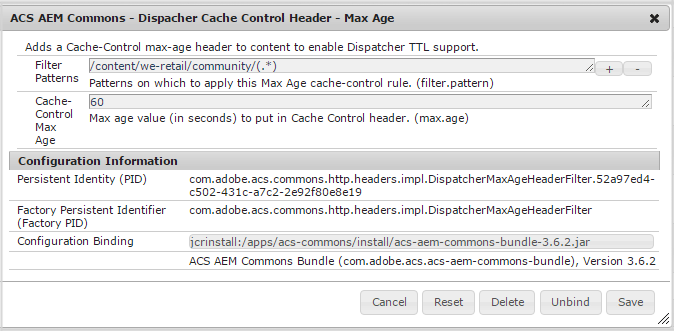

# Configurazione di Dispatcher per le community {#configuring-dispatcher-for-communities}

## Community AEM {#aem-communities}

Per AEM Communities, è necessario configurare Dispatcher per garantire il corretto funzionamento di [siti community](overview.md#community-sites). Sono necessarie configurazioni aggiuntive quando si includono funzioni come l’accesso social.

Per scoprire cosa è necessario per la distribuzione e la progettazione del sito specifiche

* Contatta il [Servizio clienti](https://experienceleague.adobe.com/?support-solution=General&amp;support-tab=homehome?lang=it#support)

Vedi anche la sezione principale [Documentazione di Dispatcher](https://experienceleague.adobe.com/docs/experience-manager-dispatcher/using/dispatcher.html?lang=it).

## Memorizzazione in cache di Dispatcher {#dispatcher-caching}

### Panoramica {#overview}

Il caching di Dispatcher per AEM Communities consente a Dispatcher di distribuire versioni completamente memorizzate nella cache delle pagine di un sito community.

Attualmente, è supportato solo per i visitatori anonimi del sito, ad esempio gli utenti che navigano nel sito della community o che arrivano su una pagina della community dopo una ricerca, e per i motori di ricerca che indicizzano le pagine. Il vantaggio è che gli utenti anonimi e i motori di ricerca ottengono prestazioni migliori.

Per i membri con accesso, Dispatcher ignora la cache, inoltrando le richieste direttamente all’editore in modo che tutte le pagine vengano generate e distribuite in modo dinamico.

Quando è configurato per supportare il caching di Dispatcher, all’intestazione viene aggiunta una scadenza &quot;max age&quot; basata su TTL per garantire che le pagine memorizzate in cache di Dispatcher siano correnti.

### Requisiti {#requirements}

* Dispatcher versione 4.1.2 o successiva (vedi [Installazione di Dispatcher](https://experienceleague.adobe.com/docs/experience-manager-dispatcher/using/getting-started/dispatcher-install.html?lang=en) per la versione più recente)
* [Pacchetto ACS AEM Commons](https://adobe-consulting-services.github.io/acs-aem-commons/)

   * Versione 3.3.2 o successiva
   * `ACS AEM Commons - Dispatcher Cache Control Header - Max Age` Configurazione OSGi

### Configurazione {#configuration}

Configurazione OSGi **ACS AEM Commons - Intestazione di controllo cache di Dispatcher - Età massima** imposta la scadenza delle pagine memorizzate nella cache che vengono visualizzate in un percorso specificato.

* Dalla sezione [Console web](../../help/sites-deploying/configuring-osgi.md).

   * Ad esempio: [http://localhost:4503/system/console/configMgr](http://localhost:4503/system/console/configMgr)

* Individua `ACS AEM Commons - Dispatcher Cache Control Header - Max Age`
* Seleziona l’icona &quot;+&quot; per creare una configurazione di connessione.

  

* **Modelli di filtro**
  *(obbligatorio)* Uno o più percorsi per le pagine community. Esempio: `/content/sites/engage/(.*)`.

* **Scadenza massima controllo cache**
  *(obbligatorio)* Durata massima (in secondi) da aggiungere all’intestazione Controllo cache. Il valore deve essere maggiore di zero (0).

## Filtri di Dispatcher {#dispatcher-filters}

La sezione /filter del `dispatcher.any` il file è documentato in [Configurazione dell’accesso al contenuto: /filter](https://experienceleague.adobe.com/docs/experience-manager-dispatcher/using/configuring/dispatcher-configuration.html?lang=it).

Questa sezione descrive le voci che potrebbero essere necessarie per il corretto funzionamento delle funzioni di Communities.

I nomi delle proprietà del filtro seguono la convenzione di utilizzare un numero di quattro cifre per indicare l’ordine in cui applicare i pattern di filtro. Quando a una richiesta sono applicati più modelli di filtro, l’ultimo modello applicato ha effetto. Pertanto, il primo pattern di filtro viene spesso utilizzato per negare tutto, in modo che i seguenti pattern servano a ripristinare l’accesso in modo controllato.

Negli esempi seguenti vengono utilizzati nomi di proprietà che probabilmente devono essere modificati per adattarsi a un particolare `dispatcher.any` file.

Consulta anche:

* [Elenco di controllo della sicurezza di Dispatcher](https://experienceleague.adobe.com/docs/experience-manager-dispatcher/using/getting-started/security-checklist.html?lang=en)

>[!NOTE]
>
>**Esempi di nome proprietà**
>Vengono visualizzati tutti i nomi delle proprietà, ad esempio **/0050** e **/0170**, devono essere adattati per essere inclusi in un `dispatcher.any` file di configurazione.
>

>[!CAUTION]
>
>Per ulteriori considerazioni sulla limitazione dell’accesso tramite Dispatcher, vedi [Elenco di controllo della sicurezza di Dispatcher](https://experienceleague.adobe.com/docs/experience-manager-dispatcher/using/getting-started/security-checklist.html). Inoltre, leggi [Elenco di controllo della sicurezza AEM](https://experienceleague.adobe.com/docs/experience-manager-release-information/aem-release-updates/previous-updates/aem-previous-versions.html?lang=it) per ulteriori dettagli sulla sicurezza relativi all’installazione di AEM.
>

Le seguenti voci devono essere aggiunte alla fine della sezione /filter, specialmente dopo tutte le voci negate.

<!-- New code wrt CQDOC-16081, changed by Vishabh on 10 Dec 2020.
-->

```shell
# design and template assets
/0050 { /type "allow" /url "/etc/designs/*" }

# collected JS/CSS from the components and design
/0051 { /type "allow" /url "/etc/clientlibs/*" }

# foundation search component - write stats
/0052 { /type "allow" /url "/bin/statistics/tracker/*" }

# allow users to edit profile page
/0054 { /type "allow" /url "* /home/users/*/*/profile.form.html*" }

# all profile data
/0057 { /type "allow" /url "/home/users/*/profile/*" }

# required for social "Sign In" link.
/0059 { /type "allow" /url "/etc/clientcontext/*" }

# required for "Sign Out" operation
/0063 { /type "allow" /url "* /system/sling/logout*" }

# enable Facebook and Twitter signin
/0064 { /type "allow" /url "/etc/cloudservices/*" }

# enable personalization
/0062 { /type "allow" /url "/libs/cq/personalization/*" }

# Enable CSRF token otherwise nothings works.
/5001 { /type "allow" /url "/libs/granite/csrf/token.json *"}
# Allow SCF User Model to bootstrap as it depends on the granite user
/5002 { /type "allow" /url "/libs/granite/security/currentuser.json*" }

# Allow Communities Site Logout button work
/5003 { /type "allow" /url "/system/sling/logout.html*" }

# Allow i18n to load correctly
/5004 { /type "allow" /url "/libs/cq/i18n/dict.en.json *" }

# Allow social json get pattern.
/6002 { /type "allow" /url "*.social.*.json*" }

# Allow loading of templates
/6003 { /type "allow" /url "/services/social/templates*" }

# Allow SCF User model to check moderator rules
/6005 { /type "allow" /url "/services/social/getLoggedInUser?moderatorCheck=*" }

# Allow CKEditor to load which uses a query pattern.
/6006 { /type "allow" /url "/etc/clientlibs/social/thirdparty/ckeditor/*.js?t=*" }
/6007 { /type "allow" /url "/etc/clientlibs/social/thirdparty/ckeditor/*.css?t=*" }

# Allow Fonts from Communities to load
/6050 { /type "allow" /url "*.woff" }
/6051 { /type "allow" /url "*.ttf" }

# Enable CQ Security checkpoint for component guide.
/7001 { /type "allow" /url "/libs/cq/security/userinfo.json?cq_ck=*"
```


<!-- existing content as of Dec 10, wrt CQDOC-16081

```shell
# design and template assets
/0050 { /type "allow" /glob "GET /etc/designs/*" }

# collected JS/CSS from the components and design
/0051 { /type "allow" /glob "GET /etc/clientlibs/*" }

# foundation search component - write stats
/0052 { /type "allow" /glob "GET /bin/statistics/tracker/*" }

# allow users to edit profile page
/0054 { /type "allow" /glob "* /home/users/*/*/profile.form.html*" }

# all profile data
/0057 { /type "allow" /glob "GET /home/users/*/profile/*" }

# required for social "Sign In" link.
/0059 { /type "allow" /glob "GET /etc/clientcontext/*" }

# required for "Sign Out" operation
/0063 { /type "allow" /glob "* /system/sling/logout*" }

# enable Facebook and Twitter signin
/0064 { /type "allow" /glob "GET /etc/cloudservices/*" }

# enable personalization
/0062 { /type "allow" /url "/libs/cq/personalization/*" }

# Enable CSRF token otherwise nothings works.
/5001 { /type "allow" /glob "GET /libs/granite/csrf/token.json *"}
# Allow SCF User Model to bootstrap as it depends on the granite user
/5002 { /type "allow" /glob "GET /libs/granite/security/currentuser.json*" }

# Allow Communities Site Logout button work
/5003 { /type "allow" /glob "GET /system/sling/logout.html*" }

# Allow i18n to load correctly
/5004 { /type "allow" /glob "GET /libs/cq/i18n/dict.en.json *" }

# Allow social json get pattern.
/6002 { /type "allow" /glob "GET *.social.*.json*" }

# Allow loading of templates
/6003 { /type "allow" /glob "GET /services/social/templates*" }

# Allow SCF User model to check moderator rules
/6005 { /type "allow" /glob "GET /services/social/getLoggedInUser?moderatorCheck=*" }

# Allow CKEditor to load which uses a query pattern not sufficed by regular glob above.
/6006 { /type "allow" /glob "GET /etc/clientlibs/social/thirdparty/ckeditor/*.js?t=*" }
/6007 { /type "allow" /glob "GET /etc/clientlibs/social/thirdparty/ckeditor/*.css?t=*" }

# Allow Fonts from Communities to load
/6050 { /type "allow" /glob "GET *.woff *" }
/6051 { /type "allow" /glob "GET *.ttf *" }

# Enable CQ Security checkpoint for component guide.
/7001 { /type "allow" /glob "GET /libs/cq/security/userinfo.json?cq_ck=*"

```
-->

## Regole di Dispatcher {#dispatcher-rules}

La sezione delle regole di `dispatcher.any` definisce quali risposte devono essere memorizzate nella cache in base all’URL richiesto. Per le community, la sezione regole viene utilizzata per definire cosa non deve mai essere memorizzato in cache.

<!-- New code wrt CQDOC-16081, changed by Vishabh on 10 Dec 2020.
-->

```shell
# Never cache the client-side .social.json calls
/0001 { /type "deny" /url "*.social.json*" }

# Never cache the user-specific .json requests
/0002 { /type "deny" /url "/libs/granite/csrf/token.json*" }
/0003 { /type "deny" /url "/libs/granite/security/currentuser.json*" }
/0004 { /type "deny" /url "/libs/granite/security/userinfo.json*" }

# Never cache the private community groups pages in case - add your own deny rules in there
/0005 { /type "deny" /url "/content/*/groups/*" }

# Never cache the assignments page in case the Enablement feature is in use - add your own deny rules in there
/0006 { /type "deny" /url "/content/*/assignments/*" }

# Never cache user generated content
/0208 { /type "deny" /url "/content/usergenerated/*" }
```

<!-- existing content as of Dec 10, wrt CQDOC-16081

```shell
# Never cache the client-side .social.json calls
/0001 { /type "deny" /glob "*.social.json*" }

# Never cache the user-specific .json requests
/0002 { /type "deny" /glob "/libs/granite/csrf/token.json*" }
/0003 { /type "deny" /glob "/libs/granite/security/currentuser.json*" }
/0004 { /type "deny" /glob "/libs/granite/security/userinfo.json*" }

# Never cache the private community groups pages in case - add your own deny rules in there
/0005 { /type "deny" /glob "/content/*/groups/*" }

# Never cache the assignments page in case the Enablement feature is in use - add your own deny rules in there
/0006 { /type "deny" /glob "/content/*/assignments/*" }

# Never cache user generated content
/0208 { /type "deny" /glob "/content/usergenerated/*" }
```
-->

## Risoluzione dei problemi {#troubleshooting}

Una delle principali cause di problemi è l’inserimento di regole di filtro senza prestare attenzione all’effetto sulle regole precedenti, in particolare quando si aggiunge una regola per negare l’accesso.

Il primo modello di filtro viene spesso utilizzato per negare tutto in modo che i filtri seguenti ripristinino l’accesso in modo controllato. Quando a una richiesta sono applicati più filtri, l’ultimo filtro applicato è quello in vigore.

## Esempio di dispatcher.any {#sample-dispatcher-any}

Di seguito è riportato un esempio `dispatcher.any` che include Communities /filters e /rules.

<!-- New code wrt CQDOC-16081, changed by Vishabh on 10 Dec 2020.
-->

```shell
# Each farm configures a set of load balanced renders (that is, remote servers)
/farms
  {
  # First farm entry
  /website
    {
    # Request headers that should be forwarded to the remote server.
    /clientheaders
      {
      # Forward all request headers that are end-to-end. If you want
      # to forward a specific set of headers, you'll have to list
      # them here.
      "*"
      }

    # Hostname matching for farm selection (virtual domain addressing)
    /virtualhosts
      {
      # Entries will be compared against the "Host" request header
      # and an optional request URL prefix.
      #
      # Examples:
      #
      #   www.company.com
      #   intranet.*
      #   myhost:8888/mysite
      "*"
      }

    # The load will be balanced among these render instances
    /renders
      {
      /rend01
        {
        # Hostname or IP of the render
        /hostname "127.0.0.1"
        # Port of the render
        /port "4503"
        # Connect timeout in milliseconds, 0 to wait indefinitely
        # /timeout "0"
        }
      }

    # The filter section defines the requests that should be handled by the dispatcher.
    #
    # Entries can be either specified using urls, or elements of the request line:
    #
    # (1) urls will be compared against the entire request line, for example,:
    #
    #     /0001 { /type "deny" /url "* /index.html *" }
    #
    #   matches request "GET /index.html HTTP/1.1" but not "GET /index.html?a=b HTTP/1.1".
    #
    # (2) method/url/query/protocol will be compared againts the respective elements of
    #   the request line, for example,:
    #
    #     /0001 { /type "deny" /method "GET" /url "/index.html" }
    #
    #   matches both "GET /index.html" and "GET /index.html?a=b HTTP/1.1".
    #
    # Note: specifying elements of the request line is the preferred method.
    /filter
      {
      # Deny everything first and then allow specific entries
      /0001 { /type "deny" /url "*" }

      # Open consoles
#     /0011 { /type "allow" /url "/admin/*"  }  # allow servlet engine admin
#     /0012 { /type "allow" /url "/crx/*"    }  # allow content repository
#     /0013 { /type "allow" /url "/system/*" }  # allow OSGi console

      # Allow non-public content directories
#     /0021 { /type "allow" /url "/apps/*"   }  # allow apps access
#     /0022 { /type "allow" /url "/bin/*"    }
      /0023 { /type "allow" /url "/content*" }  # disable this rule to allow mapped content only

#     /0024 { /type "allow" /url "/libs/*"   }
#     /0025 { /type "deny"  /url "/libs/shindig/proxy*" } # if you enable /libs close access to proxy

#     /0026 { /type "allow" /url "/home/*"   }
#     /0027 { /type "allow" /url "/tmp/*"    }
#     /0028 { /type "allow" /url "/var/*"    }

      # Enable specific mime types in non-public content directories
      /0041 { /type "allow" /url "*.css"   }  # enable css
      /0042 { /type "allow" /url "*.gif"   }  # enable gifs
      /0043 { /type "allow" /url "*.ico"   }  # enable icos
      /0044 { /type "allow" /url "*.js"    }  # enable javascript
      /0045 { /type "allow" /url "*.png"   }  # enable png
      /0046 { /type "allow" /url "*.swf"   }  # enable flash
      /0047 { /type "allow" /url "*.jpg"   }  # enable jpg
      /0048 { /type "allow" /url "*.jpeg"  }  # enable jpeg

      # Deny content grabbing
      /0081 { /type "deny"  /url "*.infinity.json" }
      /0082 { /type "deny"  /url "*.tidy.json"     }
      /0083 { /type "deny"  /url "*.sysview.xml"   }
      /0084 { /type "deny"  /url "*.docview.json"  }
      /0085 { /type "deny"  /url "*.docview.xml"  }

      /0086 { /type "deny"  /url "*.*[0-9].json" }
#     /0087 { /type "allow" /method "GET" /url "*.1.json" }  # allow one-level json requests

      # Deny query
   /0090 { /type "deny"  /url "*.query.json" }

      #######################################
      ## BEGIN: AEM COMMUNITITES ADDITIONS
   #######################################
   /0050 { /type "allow" /url "/etc/designs/*" }
   /0051 { /type "allow" /url "/etc/clientlibs/*" }
   /0052 { /type "allow" /url "/bin/statistics/tracker/*" }
   /0054 { /type "allow" /url "* /home/users/*/*/profile.form.html*" }
   /0057 { /type "allow" /url "/home/users/*/profile/*" }
   /0059 { /type "allow" /url "/etc/clientcontext/*" }
   /0063 { /type "allow" /url "* /system/sling/logout*" }
   /0064 { /type "allow" /url "/etc/cloudservices/*" }
   /0062 { /type "allow" /url "/libs/cq/personalization/*"  }  # enable personalization

         # Enable CSRF token otherwise nothings works.
   /5001 { /type "allow" /url "/libs/granite/csrf/token.json *"}

   # Allow SCF User Model to bootstrap as it depends on the granite user
   /5002 { /type "allow" /url "/libs/granite/security/currentuser.json*" }

      # Allow Communities Site Logout button work
      /5003 { /type "allow" /url "/system/sling/logout.html*" }

   # Allow i18n to load correctly
   /5004 { /type "allow" /url "/libs/cq/i18n/dict.en.json *" }

   # Allow social json get pattern.
   /6002 { /type "allow" /url "*.social.*.json*" }

   # Allow loading of templates
   /6003 { /type "allow" /url "/services/social/templates*" }

   # Allow SCF User model to check moderator rules
   /6005 { /type "allow" /url "/services/social/getLoggedInUser?moderatorCheck=*" }

   # Allow CKEditor to load which uses a query pattern.
   /6006 { /type "allow" /url "/etc/clientlibs/social/thirdparty/ckeditor/*.js?t=*" }
   /6007 { /type "allow" /url "/etc/clientlibs/social/thirdparty/ckeditor/*.css?t=*" }

   # Allow Fonts from Communities to load
   /6050 { /type "allow" /url "*.woff" }
   /6051 { /type "allow" /url "*.ttf" }

      # Enable CQ Security checkpoint for component guide.
   /7001 { /type "allow" /url "/libs/cq/security/userinfo.json?cq_ck=*"}

      #######################################
      ## END: AEM COMMUNITITES ADDITIONS
   #######################################

      }

    # The cache section regulates what responses will be cached and where.
    /cache
      {
      # The docroot must be equal to the document root of the webserver. The
      # dispatcher will store files relative to this directory and subsequent
      # requests may be "declined" by the dispatcher, allowing the webserver
      # to deliver them just like static files.
      /docroot "/opt/dispatcher"

      # Sets the level upto which files named ".stat" will be created in the
      # document root of the webserver. When an activation request for some
      # page is received, only files within the same subtree are affected
      # by the invalidation.
      #/statfileslevel "0"

      # Flag indicating whether to cache responses to requests that contain
      # authorization information.
      /allowAuthorized "1"

      # Flag indicating whether the dispatcher should serve stale content if
      # no remote server is available.
      #/serveStaleOnError "0"

      # The rules section defines what responses should be cached based on
      # the requested URL. Only the following requests can
      # lead to cacheable responses:
      #
      # - HTTP method is GET
      # - URL has an extension
      # - Request has no query string
      # - Request has no "Authorization" header (unless allowAuthorized is 1)
      /rules
        {
        /0000
          {
          # the matching pattern to be compared against the url
          # example: * -> everything
          #        : /foo/bar.* -> only the /foo/bar documents
          #        : /foo/bar/* -> all pages below /foo/bar
          #        : /foo/bar[./]* -> all pages below and /foo/bar itself
          #        : *.html        -> all .html files
          /url "*"
          /type "allow"
          }

      #######################################
      ## BEGIN: AEM COMMUNITITES ADDITIONS
     #######################################

   # Never cache the client-side .social.json calls
   /0001 { /type "deny" /url "*.social.json*" }

   # Never cache the user-specific .json requests
   /0002 { /type "deny" /url "/libs/granite/csrf/token.json*" }
   /0003 { /type "deny" /url "/libs/granite/security/currentuser.json*" }
   /0004 { /type "deny" /url "/libs/granite/security/userinfo.json*" }

   # Never cache the private community groups pages in case - add your own deny rules in there
   /0005 { /type "deny" /url "/content/*/groups/*" }

   # Never cache the assignments page in case the enablement feature is in use - add your own deny rules in there
   /0006 { /type "deny" /url "/content/*/assignments/*" }

      #######################################
      ## END: AEM COMMUNITITES ADDITIONS
      #######################################

        }

      # The invalidate section defines the pages that are "invalidated" after
      # any activation. The activated page itself and all
      # related documents are flushed on an modification. For example: if the
      # page /foo/bar is activated, all /foo/bar.* files are removed from the
      # cache.
      /invalidate
        {
        /0000
          {
          /url "*"
          /type "deny"
          }
        /0001
          {
          # Consider all HTML files stale after an activation.
          /url "*.html"
          /type "allow"
          }
        /0002
          {
          /url "/etc/segmentation.segment.js"
          /type "allow"
          }
        /0003
          {
          /url "*/analytics.sitecatalyst.js"
          /type "allow"
          }
        }

      # The allowedClients section restricts the client IP addresses that are
      # allowed to issue activation requests.
      /allowedClients
        {
        # Uncomment the following to restrict activation requests to originate
        # from "localhost" only.
        #
        #/0000
        #  {
        #  /url "*"
        #  /type "deny"
        #  }
        #/0001
        #  {
        #  /url "127.0.0.1"
        #  /type "allow"
        #  }
        }

      # The ignoreUrlParams section contains query string parameter names that
      # should be ignored when determining whether some request's output can be
      # cached or delivered from cache.
      #
      # In this example configuration, the "q" parameter will be ignored.
      #/ignoreUrlParams
      #  {
      #  /0001 { /url "*" /type "deny" }
      #  /0002 { /url "q" /type "allow" }
      #  }

    /enableTTL "1"

      }

    # The statistics sections dictates how the load should be balanced among the
    # renders according to the media-type.
    /statistics
      {
      /categories
        {
        /html
          {
          /url "*.html"
          }
        /others
          {
          /url "*"
          }
        }
      }
    }
  }
```

<!-- existing content as of Dec 10, wrt CQDOC-16081

```shell
# Each farm configures a set of load balanced renders (that is, remote servers)
/farms
  {
  # First farm entry
  /website
    {
    # Request headers that should be forwarded to the remote server.
    /clientheaders
      {
      # Forward all request headers that are end-to-end. If you want
      # to forward a specific set of headers, you'll have to list
      # them here.
      "*"
      }

    # Hostname globbing for farm selection (virtual domain addressing)
    /virtualhosts
      {
      # Entries will be compared against the "Host" request header
      # and an optional request URL prefix.
      #
      # Examples:
      #
      #   www.company.com
      #   intranet.*
      #   myhost:8888/mysite
      "*"
      }

    # The load will be balanced among these render instances
    /renders
      {
      /rend01
        {
        # Hostname or IP of the render
        /hostname "127.0.0.1"
        # Port of the render
        /port "4503"
        # Connect timeout in milliseconds, 0 to wait indefinitely
        # /timeout "0"
        }
      }

    # The filter section defines the requests that should be handled by the dispatcher.
    #
    # Entries can be either specified using globs, or elements of the request line:
    #
    # (1) globs will be compared against the entire request line, for example,:
    #
    #     /0001 { /type "deny" /glob "* /index.html *" }
    #
    #   matches request "GET /index.html HTTP/1.1" but not "GET /index.html?a=b HTTP/1.1".
    #
    # (2) method/url/query/protocol will be compared againts the respective elements of
    #   the request line, for example,:
    #
    #     /0001 { /type "deny" /method "GET" /url "/index.html" }
    #
    #   matches both "GET /index.html" and "GET /index.html?a=b HTTP/1.1".
    #
    # Note: specifying elements of the request line is the preferred method.
    /filter
      {
      # Deny everything first and then allow specific entries
      /0001 { /type "deny" /glob "*" }

      # Open consoles
#     /0011 { /type "allow" /url "/admin/*"  }  # allow servlet engine admin
#     /0012 { /type "allow" /url "/crx/*"    }  # allow content repository
#     /0013 { /type "allow" /url "/system/*" }  # allow OSGi console

      # Allow non-public content directories
#     /0021 { /type "allow" /url "/apps/*"   }  # allow apps access
#     /0022 { /type "allow" /url "/bin/*"    }
      /0023 { /type "allow" /url "/content*" }  # disable this rule to allow mapped content only

#     /0024 { /type "allow" /url "/libs/*"   }
#     /0025 { /type "deny"  /url "/libs/shindig/proxy*" } # if you enable /libs close access to proxy

#     /0026 { /type "allow" /url "/home/*"   }
#     /0027 { /type "allow" /url "/tmp/*"    }
#     /0028 { /type "allow" /url "/var/*"    }

      # Enable specific mime types in non-public content directories
      /0041 { /type "allow" /url "*.css"   }  # enable css
      /0042 { /type "allow" /url "*.gif"   }  # enable gifs
      /0043 { /type "allow" /url "*.ico"   }  # enable icos
      /0044 { /type "allow" /url "*.js"    }  # enable javascript
      /0045 { /type "allow" /url "*.png"   }  # enable png
      /0046 { /type "allow" /url "*.swf"   }  # enable flash
      /0047 { /type "allow" /url "*.jpg"   }  # enable jpg
      /0048 { /type "allow" /url "*.jpeg"  }  # enable jpeg

      # Deny content grabbing
      /0081 { /type "deny"  /url "*.infinity.json" }
      /0082 { /type "deny"  /url "*.tidy.json"     }
      /0083 { /type "deny"  /url "*.sysview.xml"   }
      /0084 { /type "deny"  /url "*.docview.json"  }
      /0085 { /type "deny"  /url "*.docview.xml"  }

      /0086 { /type "deny"  /url "*.*[0-9].json" }
#     /0087 { /type "allow" /method "GET" /url "*.1.json" }  # allow one-level json requests

      # Deny query
   /0090 { /type "deny"  /url "*.query.json" }

      #######################################
      ## BEGIN: AEM COMMUNITITES ADDITIONS
   #######################################
   /0050 { /type "allow" /glob "GET /etc/designs/*" }
   /0051 { /type "allow" /glob "GET /etc/clientlibs/*" }
   /0052 { /type "allow" /glob "GET /bin/statistics/tracker/*" }
   /0054 { /type "allow" /glob "* /home/users/*/*/profile.form.html*" }
   /0057 { /type "allow" /glob "GET /home/users/*/profile/*" }
   /0059 { /type "allow" /glob "GET /etc/clientcontext/*" }
   /0063 { /type "allow" /glob "* /system/sling/logout*" }
   /0064 { /type "allow" /glob "GET /etc/cloudservices/*" }
   /0062 { /type "allow" /url "/libs/cq/personalization/*"  }  # enable personalization
   
      # Enable CSRF token otherwise nothings works.
   /5001 { /type "allow" /glob "GET /libs/granite/csrf/token.json *"}

   # Allow SCF User Model to bootstrap as it depends on the granite user
   /5002 { /type "allow" /glob "GET /libs/granite/security/currentuser.json*" }

      # Allow Communities Site Logout button work
      /5003 { /type "allow" /glob "GET /system/sling/logout.html*" }

   # Allow i18n to load correctly
   /5004 { /type "allow" /glob "GET /libs/cq/i18n/dict.en.json *" }

   # Allow social json get pattern.
   /6002 { /type "allow" /glob "GET *.social.*.json*" }

   # Allow loading of templates
   /6003 { /type "allow" /glob "GET /services/social/templates*" }

   # Allow SCF User model to check moderator rules
   /6005 { /type "allow" /glob "GET /services/social/getLoggedInUser?moderatorCheck=*" }

   # Allow CKEditor to load which uses a query pattern not sufficed by regular glob above.
   /6006 { /type "allow" /glob "GET /etc/clientlibs/social/thirdparty/ckeditor/*.js?t=*" }
   /6007 { /type "allow" /glob "GET /etc/clientlibs/social/thirdparty/ckeditor/*.css?t=*" }

   # Allow Fonts from Communities to load
   /6050 { /type "allow" /glob "GET *.woff *" }
   /6051 { /type "allow" /glob "GET *.ttf *" }

      # Enable CQ Security checkpoint for component guide.
   /7001 { /type "allow" /glob "GET /libs/cq/security/userinfo.json?cq_ck=*"}

      #######################################
      ## END: AEM COMMUNITITES ADDITIONS
   #######################################

      }

    # The cache section regulates what responses will be cached and where.
    /cache
      {
      # The docroot must be equal to the document root of the webserver. The
      # dispatcher will store files relative to this directory and subsequent
      # requests may be "declined" by the dispatcher, allowing the webserver
      # to deliver them just like static files.
      /docroot "/opt/dispatcher"

      # Sets the level upto which files named ".stat" will be created in the
      # document root of the webserver. When an activation request for some
      # page is received, only files within the same subtree are affected
      # by the invalidation.
      #/statfileslevel "0"

      # Flag indicating whether to cache responses to requests that contain
      # authorization information.
      /allowAuthorized "1"

      # Flag indicating whether the dispatcher should serve stale content if
      # no remote server is available.
      #/serveStaleOnError "0"

      # The rules section defines what responses should be cached based on
      # the requested URL. Only the following requests can
      # lead to cacheable responses:
      #
      # - HTTP method is GET
      # - URL has an extension
      # - Request has no query string
      # - Request has no "Authorization" header (unless allowAuthorized is 1)
      /rules
        {
        /0000
          {
          # the globbing pattern to be compared against the url
          # example: * -> everything
          #        : /foo/bar.* -> only the /foo/bar documents
          #        : /foo/bar/* -> all pages below /foo/bar
          #        : /foo/bar[./]* -> all pages below and /foo/bar itself
          #        : *.html        -> all .html files
          /glob "*"
          /type "allow"
          }

      #######################################
      ## BEGIN: AEM COMMUNITITES ADDITIONS
     #######################################

   # Never cache the client-side .social.json calls
   /0001 { /type "deny" /glob "*.social.json*" }

   # Never cache the user-specific .json requests
   /0002 { /type "deny" /glob "/libs/granite/csrf/token.json*" }
   /0003 { /type "deny" /glob "/libs/granite/security/currentuser.json*" }
   /0004 { /type "deny" /glob "/libs/granite/security/userinfo.json*" }

   # Never cache the private community groups pages in case - add your own deny rules in there
   /0005 { /type "deny" /glob "/content/*/groups/*" }

   # Never cache the assignments page in case the enablement feature is in use - add your own deny rules in there
   /0006 { /type "deny" /glob "/content/*/assignments/*" }

      #######################################
      ## END: AEM COMMUNITITES ADDITIONS
      #######################################

        }

      # The invalidate section defines the pages that are "invalidated" after
      # any activation. The activated page itself and all
      # related documents are flushed on an modification. For example: if the
      # page /foo/bar is activated, all /foo/bar.* files are removed from the
      # cache.
      /invalidate
        {
        /0000
          {
          /glob "*"
          /type "deny"
          }
        /0001
          {
          # Consider all HTML files stale after an activation.
          /glob "*.html"
          /type "allow"
          }
        /0002
          {
          /glob "/etc/segmentation.segment.js"
          /type "allow"
          }
        /0003
          {
          /glob "*/analytics.sitecatalyst.js"
          /type "allow"
          }
        }

      # The allowedClients section restricts the client IP addresses that are
      # allowed to issue activation requests.
      /allowedClients
        {
        # Uncomment the following to restrict activation requests to originate
        # from "localhost" only.
        #
        #/0000
        #  {
        #  /glob "*"
        #  /type "deny"
        #  }
        #/0001
        #  {
        #  /glob "127.0.0.1"
        #  /type "allow"
        #  }
        }

      # The ignoreUrlParams section contains query string parameter names that
      # should be ignored when determining whether some request's output can be
      # cached or delivered from cache.
      #
      # In this example configuration, the "q" parameter will be ignored.
      #/ignoreUrlParams
      #  {
      #  /0001 { /glob "*" /type "deny" }
      #  /0002 { /glob "q" /type "allow" }
      #  }

    /enableTTL "1"

      }

    # The statistics sections dictates how the load should be balanced among the
    # renders according to the media-type.
    /statistics
      {
      /categories
        {
        /html
          {
          /glob "*.html"
          }
        /others
          {
          /glob "*"
          }
        }
      }
    }
  }

```

-->
