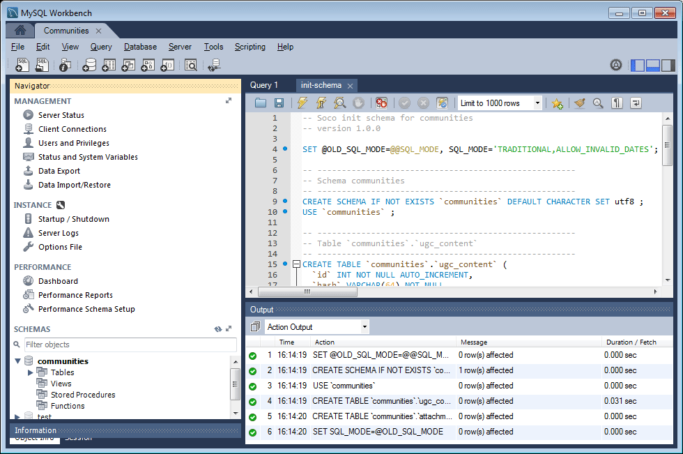

# Configurazione MySQL per DSRP {#mysql-configuration-for-dsrp}

MySQL è un database relazionale che può essere utilizzato per memorizzare il contenuto generato dall&#39;utente (UGC).

Queste istruzioni descrivono come connettersi a MySQL Server e stabilire il database UGC.

## Requisiti {#requirements}

* [Pacchetto di funzioni per le ultime community](deploy-communities.md#latestfeaturepack)
* [Driver JDBC per MySQL](deploy-communities.md#jdbc-driver-for-mysql)
* Un database relazionale:

   * [MySQL ](https://dev.mysql.com/downloads/mysql/) serverCommunity Server versione 5.6 o successiva

      * Può essere eseguito sullo stesso host AEM o in remoto
   * [Workbench MySQL](https://dev.mysql.com/downloads/tools/workbench/)

## Installazione di MySQL {#installing-mysql}

 MySQLdovrebbe essere scaricato e installato seguendo le istruzioni per il sistema operativo di destinazione.

### Nomi delle tabelle in lettere maiuscole {#lower-case-table-names}

Poiché SQL non fa distinzione tra maiuscole e minuscole, per i sistemi operativi con distinzione tra maiuscole e minuscole è necessario includere un&#39;impostazione per i nomi di tutte le tabelle con distinzione tra maiuscole e minuscole.

Ad esempio, per specificare tutti i nomi di tabella in lettere minuscole in un sistema operativo Linux:

* Modifica file `/etc/my.cnf`
* Nella sezione `[mysqld]`, aggiungete la seguente riga:

   `lower_case_table_names = 1`

### Set di caratteri UTF8 {#utf-character-set}

Per fornire un supporto multilingue migliore, è necessario utilizzare il set di caratteri UTF8.

Modificate MySQL in modo che abbia UTF8 come set di caratteri:

* mysql > SET NAMES &#39;utf8&#39;;

Modificate il database MySQL impostando il valore predefinito su UTF8:

* Modifica file `/etc/my.cnf`
* Nella sezione `[client]`, aggiungete la seguente riga:

   `default-character-set=utf8`

* Nella sezione `[mysqld]`, aggiungete la seguente riga:

   `character-set-server=utf8`

## Installazione di MySQL Workbench {#installing-mysql-workbench}

Workbench SQL fornisce un&#39;interfaccia utente per l&#39;esecuzione di script SQL che installano lo schema e i dati iniziali.

MySQL Workbench deve essere scaricato e installato seguendo le istruzioni per il sistema operativo di destinazione.

## Connessione community {#communities-connection}

Al primo avvio di MySQL Workbench, a meno che non sia già in uso per altri scopi, non verrà ancora visualizzata alcuna connessione:

### Nuove impostazioni di connessione {#new-connection-settings}

1. Selezionate l&#39;icona `+` a destra di `MySQL Connections`.
1. Nella finestra di dialogo `Setup New Connection`, immettete i valori appropriati per la piattaforma

   A scopo dimostrativo, con l&#39;istanza AEM autore e MySQL sullo stesso server:

   * Nome connessione: `Communities`
   * Metodo di connessione: `Standard (TCP/IP)`
   * Nome host: `127.0.0.1`
   * Nome utente: `root`
   * Password: `no password by default`
   * Schema predefinito: `leave blank`

1. Selezionare `Test Connection` per verificare la connessione al servizio MySQL in esecuzione

**Note**:

* La porta predefinita è `3306`
* Il nome di connessione scelto viene immesso come nome dell&#39;origine dati nella configurazione [JDBC OSGi](#configurejdbcconnections)

#### Nuova connessione community {#new-communities-connection}

## Impostazione database {#database-setup}

Per installare il database, aprite la connessione Community.

### Ottenere lo script SQL {#obtain-the-sql-script}

Lo script SQL viene ottenuto dall&#39;archivio AEM:

1. Passa al CRXDE Lite

   * Ad esempio, [http://localhost:4502/crx/de](http://localhost:4502/crx/de)

1. Selezionare la cartella /libs/social/config/datastore/dsrp/schema
1. Scarica `init-schema.sql`

   

Un metodo per scaricare lo schema è:

* Selezionare il nodo `jcr:content` per il file sql
* Notate che il valore della proprietà `jcr:data` è un collegamento di visualizzazione

* Selezionare il collegamento di visualizzazione per salvare i dati in un file locale

### Creare il database DSRP {#create-the-dsrp-database}

Per installare il database, effettuate le operazioni seguenti. Il nome predefinito del database è `communities`.

Se il nome del database viene modificato nello script, assicurarsi di modificarlo anche nella configurazione [JDBC](#configurejdbcconnections).

#### Passaggio 1: aprire il file SQL {#step-open-sql-file}

In MySQL Workbench

* Dal menu a discesa File
* Selezionare il `init_schema.sql` scaricato

#### Passaggio 2: eseguire script SQL {#step-execute-sql-script}

Nella finestra Workbench per il file aperto al passaggio 1, selezionare `lightening (flash) icon` per eseguire lo script.

Nell&#39;immagine seguente, il file `init_schema.sql` è pronto per essere eseguito:

#### Aggiorna {#refresh}

Una volta eseguito lo script, è necessario aggiornare la sezione `SCHEMAS` del `Navigator` per visualizzare il nuovo database. Utilizzate l&#39;icona di aggiornamento a destra di &#39;SCHEMAS&#39;:

## Configurare la connessione JDBC {#configure-jdbc-connection}

La configurazione OSGi per **Day Commons JDBC Connections Pool** configura il driver JDBC MySQL.

Tutte le istanze di pubblicazione e creazione AEM devono puntare allo stesso server MySQL.

Quando MySQL viene eseguito su un server diverso da AEM, il nome host del server deve essere specificato al posto di &#39;localhost&#39; nel connettore JDBC.

* Per ogni istanza di creazione e pubblicazione AEM.
* Accesso con privilegi di amministratore.
* Accedere alla [console Web](../../help/sites-deploying/configuring-osgi.md).

   * Ad esempio, [http://localhost:4502/system/console/configMgr](http://localhost:4502/system/console/configMgr)

* Individuare il percorso `Day Commons JDBC Connections Pool`
* Selezionate l&#39;icona `+` per creare una nuova configurazione di connessione.

   

* Immettete i seguenti valori:

   * **[!UICONTROL Classe]** driver JDBC:  `com.mysql.jdbc.Driver`
   * **[!UICONTROL URI]** connessione JDBC:  `jdbc:mysql://localhost:3306/communities?characterEncoding=UTF-8`

      Specificare il server al posto di localhost se MySQL Server non è uguale a &#39;this&#39; AEM server *community* è il nome predefinito del database (schema).

   * **[!UICONTROL Nome utente]**:  `root`

      In alternativa, immettere il nome utente configurato per MySQL Server, se non &#39;root&#39;.

   * **[!UICONTROL Password]**:

      Cancella questo campo se non è impostata alcuna password per MySQL,

      altrimenti immettere la password configurata per il nome utente MySQL.

   * **[!UICONTROL Nome]** origine dati: nome immesso per la connessione MySQL, ad esempio &#39;community&#39;.

* Seleziona **[!UICONTROL Salva]**

