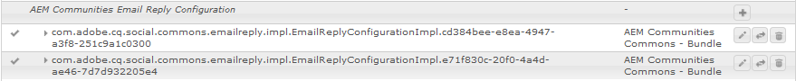

# Configurazione e-mail {#configuring-email}

 AEM Communities utilizza l’e-mail per:

* [Notifiche community](notifications.md)
* [Iscrizioni community](subscriptions.md)

Per impostazione predefinita, la funzione e-mail non funziona perché richiede la specifica di un server SMTP e di un utente SMTP.

>[!CAUTION]
>
>Le e-mail per le notifiche e le iscrizioni devono essere configurate solo sull&#39; [editore principale](deploy-communities.md#primary-publisher).

## Configurazione servizio di posta elettronica predefinita {#default-mail-service-configuration}

Il servizio e-mail predefinito è richiesto sia per le notifiche che per le iscrizioni.

* Accedete all&#39;editore principale con privilegi di amministratore e accedete alla [console Web](../../help/sites-deploying/configuring-osgi.md):

   * Ad esempio, [http://localhost:4503/system/console/configMgr](http://localhost:4503/system/console/configMgr)

* Individuare il percorso `Day CQ Mail Service`.
* Selezionate l’icona di modifica.

Questo è basato sulla documentazione relativa alla [configurazione delle notifiche e-mail](../../help/sites-administering/notification.md), ma con una differenza nel fatto che il campo `"From" address` è *non* richiesto e deve essere lasciato vuoto.

Ad esempio (con valori solo a scopo illustrativo):

* **[!UICONTROL Nome host del server SMTP]**

   *(Obbligatorio)* Server SMTP da utilizzare.

* **[!UICONTROL Porta server SMTP]**

   *(Obbligatorio)* La porta del server SMTP deve essere 25 o superiore.

* **[!UICONTROL Utente SMTP]**

   *(Obbligatorio)* L&#39;utente SMTP.

* **[!UICONTROL Password SMTP]**

   *(Obbligatorio)* La password dell&#39;utente SMTP.

* **[!UICONTROL Indirizzo &quot;Da&quot;]**

   Lascia vuoto
* **[!UICONTROL SMTP usa SSL]**

   Se questa opzione è selezionata, verrà inviata un&#39;e-mail protetta. Verificare che la porta sia impostata su 465 o come richiesto per il server SMTP.
* **[!UICONTROL Esegui debug e-mail]**

   Se questa opzione è selezionata, consente la registrazione delle interazioni del server SMTP.

##  Configurazione e-mail AEM Communities {#aem-communities-email-configuration}

Una volta configurato il [servizio di posta predefinito](#default-mail-service-configuration), le due istanze esistenti della configurazione `AEM Communities Email Reply Configuration` OSGi, incluse nella release, diventano operative.

Per consentire la risposta tramite e-mail, è necessario configurare ulteriormente solo l’istanza per le iscrizioni.

1. [Istanza ](#configuration-for-notifications) e-mail:

   Per le notifiche, che non supportano le e-mail di risposta, e non devono essere modificate.

1. [Iscrizioni-](#configuration-for-subscriptions) e-mail:

   Richiede la configurazione per abilitare completamente la creazione di post dal messaggio e-mail di risposta.

Per raggiungere le istanze di configurazione e-mail di Communities:

* Accedete all&#39;editore principale con privilegi di amministratore e accedete alla [console Web](../../help/sites-deploying/configuring-osgi.md)

   * Ad esempio, [http://localhost:4503/system/console/configMgr](http://localhost:4503/system/console/configMgr)

* Individuare `AEM Communities Email Reply Configuration`.

### Configurazione per le notifiche {#configuration-for-notifications}

L&#39;istanza della configurazione `AEM Communities Email Reply Configuration` OSGi con l&#39;e-mail Name è una funzionalità di notifica. Questa funzione non include la risposta tramite e-mail.

Questa configurazione non deve essere modificata.

* Individuare il percorso `AEM Communities Email Reply Configuration`.
* Selezionate l’icona di modifica.
* Verificare che **Name** sia `email`.

* Verifica che **Crea post dal messaggio e-mail di risposta** sia `unchecked`.

### Configurazione per iscrizioni {#configuration-for-subscriptions}

Per le iscrizioni Community, è possibile abilitare o disabilitare la possibilità per un membro di pubblicare contenuto rispondendo a un&#39;e-mail.

* Individuare il percorso `AEM Communities Email Reply Configuration`.
* Selezionate l’icona di modifica.
* Verificare che **Name** sia `subscriptions-email`.

   

* **[!UICONTROL Nome]**

   *(Obbligatorio)* `subscriptions-email`. Non Modificate.

* **[!UICONTROL Crea post dal messaggio e-mail di risposta]**

   Se questa opzione è attivata, il destinatario dell&#39;e-mail di iscrizione può inviare contenuti inviando una risposta. Il valore predefinito è selezionato.
* **[!UICONTROL Aggiunta di ID tracciati all’intestazione]**

   Il valore predefinito è `Reply-To`.

* **[!UICONTROL Lunghezza massima oggetto]**

   Se l’ID tracciatore viene aggiunto all’oggetto, si tratta della lunghezza massima dell’oggetto, escluso l’ID tracciato, dopo di che verrà tagliato. Tieni presente che questo deve essere il più piccolo possibile per evitare che le informazioni ID tracciate vadano perdute. Il valore predefinito è 200.

* **[!UICONTROL Indirizzo e-mail &quot;Rispondi a&quot;]**

   Indirizzo utilizzato come indirizzo e-mail &quot;Rispondi a&quot;. Il valore predefinito è `no-reply@example.com`.

* **[!UICONTROL Rispondi a delimitatore]**

   Se viene aggiunto l’ID tracciatore all’intestazione Rispondi a, verrà utilizzato questo delimitatore. Il valore predefinito è `+` (segno più).

* **[!UICONTROL Prefisso ID tracciatore nell’oggetto]**

   Se alla riga dell’oggetto viene aggiunto l’ID tracciatore, verrà utilizzato questo prefisso. Il valore predefinito è `post#`.

* **[!UICONTROL Prefisso ID tracciatore nel corpo del messaggio]**

   Se viene aggiunto l’ID tracciatore al corpo del messaggio, verrà utilizzato questo prefisso. Il valore predefinito è `Please do not remove this:`.

* **[!UICONTROL E-mail come HTML]**: Se questa opzione è selezionata, il tipo di contenuto dell’e-mail verrà impostato come  `"text/html;charset=utf-8"`. Il valore predefinito è selezionato.

* **[!UICONTROL Nome utente predefinito]**

   Questo nome verrà utilizzato per gli utenti senza nome. Il valore predefinito è `no-reply@example.com`.

* **[!UICONTROL Percorso principale dei modelli]**

   Il messaggio e-mail viene creato mediante il modello presente in questo percorso directory principale. Il valore predefinito è `/etc/community/templates/subscriptions-email`.

## Configura Importazione polling {#configure-polling-importer}

Affinché l’e-mail possa essere inserita nella directory archivio, è necessario configurare manualmente un modulo di importazione polling e configurarne le proprietà nella directory archivio.

### Aggiungi nuovo importatore di polling {#add-new-polling-importer}

* Accedete all’editore principale con i privilegi di amministratore e individuate la console di Importazione polling:

   Ad esempio, [http://localhost:4503/etc/importers/polling.html](http://localhost:4503/etc/importers/polling.html)

* Selezionare **[!UICONTROL Aggiungi]**

   

* **[!UICONTROL Tipo]**

   *(Obbligatorio)* Per selezionare, trascinate verso il basso  `POP3 (over SSL)`.

* **[!UICONTROL URL]**

   *(Obbligatorio)* Server di posta in uscita. Esempio, `pop.gmail.com:995/INBOX?username=community-emailgmail.com&password=****`.

* **[!UICONTROL Importa in Path]**&amp;ast;

   *(Obbligatorio)* Impostate su  `/content/usergenerated/mailFolder/postEmails`
visitando la  `postEmails`cartella e selezionando  **OK**.

* **[!UICONTROL Intervallo di aggiornamento in secondi]**

   *(Facoltativo)* Il server di posta configurato per il servizio di posta elettronica predefinito potrebbe presentare requisiti per il valore dell&#39;intervallo di aggiornamento. Ad esempio, Gmail potrebbe richiedere un intervallo di `300`.

* **[!UICONTROL Accesso]**

   *(Facoltativo)*

* **[!UICONTROL Password]**

   *(Facoltativo)*

* Selezionare **[!UICONTROL OK]**.

### Regola protocollo per il nuovo importatore di polling {#adjust-protocol-for-new-polling-importer}

Una volta salvata la nuova configurazione di polling, è necessario modificare ulteriormente le proprietà di utilità di importazione delle e-mail di sottoscrizione per modificare il protocollo da `POP3` a `emailreply`.

Utilizzando [CRXDE Lite](../../help/sites-developing/developing-with-crxde-lite.md):

* Accedete all&#39;editore principale con privilegi di amministratore e andate a [https://&lt;server>:&lt;porta>/crx/de/index.jsp#/etc/importer/polling](http://localhost:4503/crx/de/index.jsp#/etc/importers/polling).
* Selezionate la configurazione appena creata e modificate le seguenti proprietà:

   * **feedType**: Sostituisci  `pop3s` con  **`emailreply`**
   * **source**: Sostituire il protocollo di origine  `pop3s://` con  **`emailreply://`**

I triangoli rossi indicano le proprietà modificate. Salvare le modifiche:

* Selezionare **[!UICONTROL Salva tutto]**.

