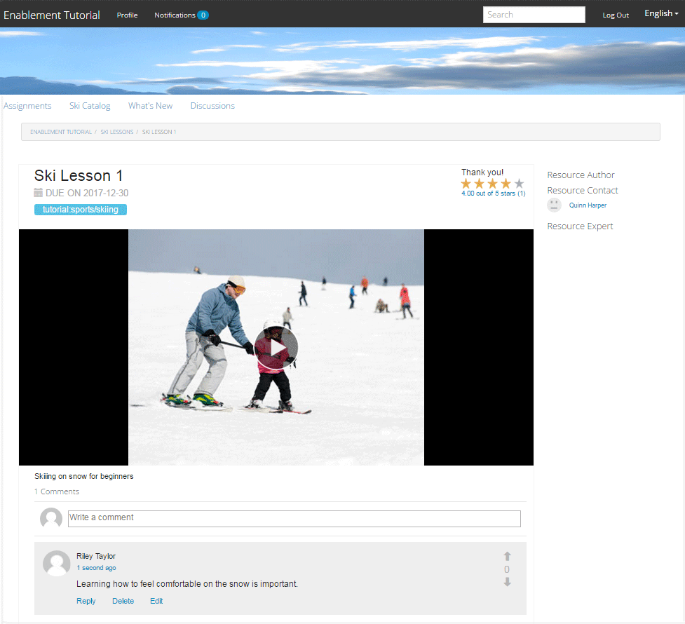

# Esperienza con il sito pubblicato {#experience-the-published-site}

**[⇐ creare e assegnare risorse di abilitazione](resource.md)**

## Passa a nuovo sito in Pubblica {#browse-to-new-site-on-publish}

Ora che il sito della community appena creato e le relative risorse di abilitazione e il percorso di apprendimento sono stati pubblicati, è possibile utilizzare il sito di tutorial sull’abilitazione.

Per iniziare, cerca l’URL visualizzato al momento della creazione del sito, ma sul server di pubblicazione, ad esempio

* URL autore = [http://localhost:4502/content/sites/enable/en.html](http://localhost:4502/content/sites/enable/en.html)
* URL di pubblicazione = [http://localhost:4503/content/sites/enable/en.html](http://localhost:4503/content/sites/enable/en.html)

Se la [home page predefinita impostata](enablement-create-site.md#changethedefaulthomepage), quindi cerca semplicemente [http://localhost:4503/](Http://localhost:4503/) dovrebbe avviare il sito.

Al primo arrivo sul sito pubblicato, il visitatore del sito in genere non era già connesso e sarebbe anonimo.

**http://localhost:4503/content/sites/enable/en.html**

## Visitatore anonimo del sito {#anonymous-site-visitor}

A un visitatore del sito anonimo viene immediatamente presentata la pagina di accesso per questo sito community di abilitazione privato. Tieni presente che non esiste alcuna opzione per effettuare l’autoregistrazione né per effettuare l’accesso con Facebook o Twitter.

Questa home page mostra quattro voci di menu: `Assignments, Ski Catalog, What's New` e `Discussions`, ma non è possibile raggiungerne nessuna senza effettuare l&#39;accesso.

>[!NOTE]
>
>È possibile concedere l’accesso anonimo a un sito di abilitazione senza consentire ai visitatori del sito di registrarsi autonomamente.
>
>Se una risorsa di abilitazione è impostata su `show in catalog` e `allow anonymous access`, i visitatori anonimi del sito potranno visualizzare le risorse nel catalogo.

### Impedisci l&#39;accesso anonimo su JCR {#prevent-anonymous-access-on-jcr}

Una limitazione nota espone il contenuto del sito della community ai visitatori anonimi attraverso contenuti jcr e json , anche se **[!UICONTROL consenti accesso anonimo]** è disabilitato per il contenuto del sito. Tuttavia, questo comportamento può essere controllato utilizzando le Restrizioni Sling come soluzione alternativa.

Per proteggere il contenuto del tuo sito community dall’accesso di utenti anonimi tramite contenuti jcr e json , segui questi passaggi:

1. Per AEM’istanza di authoring, visita https://&lt;host>:&lt;port>/editor.html/content/site/&lt;sitename>.html.

   >[!NOTE]
   >
   >Non andare al sito localizzato.

1. Vai a **[!UICONTROL Proprietà pagina]**.

   

1. Vai a **[!UICONTROL Avanzate]** scheda .
1. Abilita **[!UICONTROL Autenticazione richiesta]**.

   

1. Aggiungi il percorso della pagina di accesso. Esempio: `/content/......./GetStarted`.
1. Pubblica la pagina.

## Membro iscritto {#enrolled-member}

Questa esperienza si basa sugli utenti `Riley Taylor` e `Sidney Croft` essere [creato](enablement-setup.md#publishcreateenablementmembers) e [assegnato](resource.md#settings) al *Lezioni di sci* percorso di apprendimento attraverso la loro appartenenza *Classe sciistica comunitaria* gruppo.

Accedi con

* `Username: riley`
* `Password: password`

Se il profilo utente non è stato creato tramite registrazione automatica, la prima volta che un membro effettua l’accesso viene visualizzata la relativa pagina Profilo in modo che possa verificarla e modificarla in base alle esigenze.

Al successivo accesso del membro, viene visualizzata la home page identificata dalla prima voce di menu.

### Assegnazioni {#assignments}

Nella pagina Assegnazioni il membro viene visualizzato tutti i percorsi di apprendimento e le risorse di abilitazione assegnate specificatamente a tale utente.

Ogni assegnazione fornisce informazioni di base su:

* Tipo di assegnazione
* Se si tratta di una nuova assegnazione
* Nome
* Dettagli relativi al tipo di assegnazione
* Contatto assegnazione, esperto e autore (se fornito)

Il tipo di assegnazione è indicato da un&#39;icona nell&#39;angolo superiore sinistro della scheda. L&#39;immagine di una strada è per un percorso di apprendimento con il numero di risorse di abilitazione incluse.

Selezione *Lezioni di sci* visualizza le due risorse di abilitazione a cui fa riferimento il percorso di apprendimento.

Selezione *Lezioni di sci 1* aprirà la pagina dei dettagli della risorsa di abilitazione.

Dalla pagina dei dettagli, il membro è in grado di imparare, [rate](rating.md) la lezione e aggiungi [commenti](comments.md). Qualsiasi attività membro verrà visualizzata nella sezione Novità del sito.

Le interazioni con la risorsa di abilitazione saranno annotate nella sezione Rapporto accessibile nell’ambiente di authoring.

### Catalogo degli sci {#ski-catalog}

La pagina Catalogo sci è il catalogo di risorse di abilitazione taggate con tag provenienti da `Tutorial` spazio dei nomi. I due *Lezioni di sci* alle risorse vengono assegnati i tag `Skiing` , in modo che se sono presenti tag diversi da `All` o `Tutorial: Sports / Skiing` è selezionato, non viene visualizzato nulla.

Quando a un membro non sono state assegnate risorse di abilitazione, direttamente o tramite un percorso di apprendimento, è possibile interagire con le risorse di abilitazione situate all’interno di un catalogo e fornire feedback tramite commenti e valutazioni.

### Discussioni {#discussions}

Oltre a valutare e commentare le risorse di abilitazione ([quando abilitato](enablement-create-site.md#step33asettings)), il modello di sito community da cui `Enablement Tutorial` è stato creato include [funzione forum](functions.md#forum-function) (il titolo è `Discussions)`.

Seleziona la `Discussions`collega e pubblica un argomento.

Esci e accedi come Sidney Croft (sidney / password) e rispondi alla domanda, così come Segui l&#39;argomento.

Nota che, oltre alla moderazione in linea, ci sono opzioni per condividere l&#39;argomento sui social media o per inviare l&#39;argomento via e-mail.

### Novità {#what-s-new}

La `What's New` voce di menu è il titolo dato [funzione flusso di attività](functions.md#activity-stream-function) nella struttura del sito della comunità.

Sempre connesso come Sidney, seleziona il `What's New` per mostrare l’attività.

## Membro della comunità di fiducia {#trusted-community-member}

Questa esperienza presuppone ` [Quinn Harper](enablement-setup.md#publishcreateenablementmembers)` è stato assegnato i ruoli di [moderatore](enablement-create-site.md#moderation) e [contatto risorse](resource.md#settings).

Accedi con

* `Username: quinn`
* `Password: password`

Una volta effettuato l&#39;accesso, noterai che esiste una nuova voce di menu, `Administration`, che viene visualizzato perché al membro è stato assegnato il ruolo di moderatore.

La home page è identificata dalla prima voce di menu, Assegnazioni. Quinn è il moderatore e il contatto delle risorse di abilitazione e non è stato iscritto in alcuna risorsa di abilitazione o percorsi di apprendimento, quindi non c&#39;è nulla da visualizzare.

### Amministrazione {#administration}

Ciò che c&#39;è, è l&#39;attività dei due discenti, `Riley Taylor` e `Sidney Croft`. Selezionando la `Administration` per accedere alla console di moderazione, Quinn può utilizzare [console di moderazione di gruppo](moderation.md) moderare i loro post.

Quando si seleziona l’icona del pannello laterale, vengono aperti i filtri utilizzati per cercare contenuti nella community.

Passando il puntatore del mouse su una scheda di commento vengono visualizzate le azioni di moderazione.

## Report sull&#39;autore {#reports-on-author}

Esistono due modi per accedere al reporting sugli studenti e sulle risorse di abilitazione.

All&#39;autore, accedi alla pagina **Comunità, [Console Risorse](resources.md)**, in cui vengono gestite le risorse di abilitazione e dopo aver selezionato un sito community, è possibile generare rapporti per

* Tutte le risorse di abilitazione e i percorsi di apprendimento
* Una risorsa di abilitazione specifica o un percorso di apprendimento

Passa a **Comunità, [Console Rapporti](reports.md)** e genera rapporti in base a:

* Assegnazioni a risorse di abilitazione e percorsi di apprendimento
* Invia a un sito community in un periodo specifico
* Visualizzazioni (visite al sito) di un sito community in un periodo specifico

* I post e le visualizzazioni possono essere per tutti i contenuti o per contenuti specifici:

   * Forum
   * Topic forum
   * D/R
   * Domanda d/r
   * Blog
   * Articolo di blog
   * Calendario
   * Evento calendario

### Console Risorse {#resources-console}

Con una piccola attività e interazione con le risorse al momento della pubblicazione, la visualizzazione dei rapporti sull’autore merita un’occhiata.

* Sull&#39;autore, accedi con privilegi amministrativi.
* Passa dal menu principale a **[!UICONTROL Community]** > **[!UICONTROL Risorse]**.
* Seleziona la `Enablement Tutorial` sito.
* Seleziona la `Report` icona per un riepilogo di tutte le risorse.
* Seleziona una risorsa e quindi la `Report` icona per un rapporto sulla risorsa.

È probabile che sia troppo presto per mostrare i dati da Adobe Analytics, che possono richiedere da 1 a 12 ore per essere visualizzati. Tuttavia, i rapporti SCORM di base sono già disponibili.

#### Rapporto sulle risorse delle lezioni di sci {#ski-lessons-resource-report}

#### Rapporto utente sulle lezioni di sci {#ski-lessons-user-report}

* Seleziona **[!UICONTROL Community > Risorse]**

* Scheda aperta `Enablement Tutorial`
* Scheda aperta `Ski Lessons`
* Seleziona `Report > User Report`

### Console Rapporti {#reports-console}

La console Rapporti consente di generare rapporti su

* **Assegnazioni** per qualsiasi sito community di abilitazione
* **Viste** per qualsiasi sito della community
* **Post** per qualsiasi sito della community

Per i rapporti sulle assegnazioni:

* Sull&#39;autore, accedi con privilegi amministrativi.
* Passa a **[!UICONTROL Community]** > **[!UICONTROL Rapporti]** > **[!UICONTROL Rapporto Assegnazioni]**.
* Seleziona una **[!UICONTROL Sito]** dal menu a discesa (seleziona `Enablement Tutorial`).

* Seleziona **[!UICONTROL Gruppo]** (seleziona `Community Ski Class`)

* Seleziona un **[!UICONTROL Assegnazione]** (seleziona `Ski Lessons`)

* Seleziona **[!UICONTROL Genera]**

Per i rapporti sulle visualizzazioni:

* Sull&#39;autore, accedi con privilegi amministrativi.
* Passa a **[!UICONTROL Community]** > **[!UICONTROL Rapporti]** > **[!UICONTROL Rapporto visualizzazioni]**.
* Seleziona una **Sito** dal menu a discesa (seleziona `Enablement Tutorial`).

* Seleziona **[!UICONTROL Tipo di contenuto]** (seleziona `all`).

* Seleziona una **[!UICONTROL intervallo date]** (seleziona `Last 7 days`).

* Seleziona **[!UICONTROL Genera]**.

**[⇐ creare e assegnare risorse di abilitazione](resource.md)**
