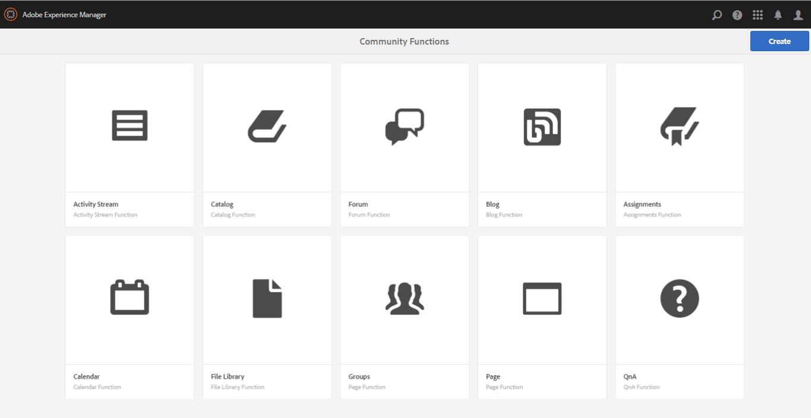

# Funzioni per community{#community-functions}

Il tipo di funzionalità previste da un&#39;esperienza di community è noto. Le funzioni della community Internet sono disponibili come funzioni della community Internet. Essenzialmente, si tratta di una o più pagine precollegate per implementare una funzione community che richiede più di un semplice aggiunta di un componente a una pagina in modalità di creazione. Si tratta dei componenti di base utilizzati per definire la struttura di un [modello di sito community](/help/communities/sites.md) da cui vengono creati i siti community [creati](/help/communities/sites-console.md).

Una volta creato un sito community, il contenuto può essere aggiunto alle pagine risultanti utilizzando la modalità di authoring standard [AEM](/help/sites-authoring/editing-content.md). Varie funzioni della community sono disponibili nella console delle funzioni community.

>[!NOTE]
>
>Le console per la creazione di [siti community](/help/communities/sites-console.md), [modelli di siti community](/help/communities/sites.md), [modelli di gruppi community](/help/communities/tools-groups.md) e [funzioni community](/help/communities/functions.md) sono utilizzabili solo nell&#39;ambiente di authoring.

## Console funzioni community {#community-functions-console}

Per accedere alla console delle funzioni per la community nell’ambiente di authoring:

* Passare a **[!UICONTROL Strumenti]** > **[!UICONTROL Community]** > **[!UICONTROL Funzioni community]**.

## Funzioni pre-costruite {#pre-built-functions}

Segue una breve descrizione delle funzioni fornite con  AEM Communities. Ogni funzione include una o più pagine AEM contenenti componenti Community collegati tra loro in una funzione facilmente incorporata in un [modello di sito community](/help/communities/sites.md).

Un modello di sito community fornisce la struttura di un sito community, inclusi login, profili utente, notifiche, messaggi, menu del sito, ricerca, temi e funzioni di branding.

### Impostazioni titolo e URL {#title-and-url-settings}

**** Titolo e  **** URL sono proprietà comuni a tutte le funzioni della community.

Quando una funzione community viene aggiunta a un modello di sito community o quando [modifica](/help/communities/sites-console.md#modifying-site-properties) la struttura di un sito community, si apre la finestra di dialogo della funzione in modo che sia possibile configurare il Titolo e l&#39;URL.

#### Dettagli funzione di configurazione {#configuration-function-details}

* **Titolo**

   (*Obbligatorio*) Testo visualizzato nel menu delle funzioni per il sito

* **URL**

   (*Obbligatorio*) Nome utilizzato per generare l&#39;URI. Il nome deve essere conforme alle [convenzioni di denominazione](/help/sites-developing/naming-conventions.md) imposte da AEM e JCR.

Ad esempio, utilizzando il sito creato seguendo l&#39;esercitazione [Guida introduttiva](/help/communities/getting-started.md), se

* Titolo = Pagina Web
* URL = page

Quindi, l’URL della pagina è https://localhost:4503/content/sites/engage/en/page.html

e il collegamento del menu per la pagina viene visualizzato come segue:

### Funzione Flusso attività {#activity-stream-function}

La funzione del flusso di attività è una pagina con un [componente Flussi di attività](/help/communities/activities.md) con tutte le viste selezionate (tutte le attività, le attività dell&#39;utente e così via). Vedere anche [Activity Stream Essentials](/help/communities/essentials-activities.md) per gli sviluppatori.

Quando viene aggiunto a un modello, si apre la finestra di dialogo seguente:

#### Dettagli funzione di configurazione {#configuration-function-details-1}

* [Impostazioni titolo e URL](#title-and-url-settings)

* **Mostra vista Le mie attività**

   Se selezionata, la pagina Attività include una scheda che filtra le attività in base a quelle generate all&#39;interno della community dal membro corrente. Il valore predefinito è selezionato.

* **Mostra la vista Tutte le attività**

   Se selezionata, la pagina Attività include una scheda che include tutte le attività generate all&#39;interno della comunità a cui il membro corrente ha accesso. Il valore predefinito è selezionato.

* **Mostra vista Feed notizie**

   Se selezionata, le pagine Attività includono una scheda che filtra le attività in base a quelle che il membro corrente sta seguendo. Il valore predefinito è selezionato.

### Funzione Assegnazioni {#assignments-function}

La funzione di assegnazione è la funzione di base che definisce un [sito community per l&#39;abilitazione](/help/communities/overview.md#enablement-community). Consente di assegnare le risorse di abilitazione ai membri della community. Vedere anche [Assignments Essentials](/help/communities/essentials-assignments.md) per gli sviluppatori.

Questa funzione è disponibile come funzione del componente aggiuntivo [enablement](/help/communities/enablement.md). Il componente aggiuntivo di abilitazione richiede licenze aggiuntive da utilizzare in un ambiente di produzione.

Quando viene aggiunta a un modello, l&#39;unica configurazione è per le [Impostazioni titolo e URL](#title-and-url-settings).

### Funzione Blog {#blog-function}

La funzione blog è una pagina con un [componente Blog](/help/communities/blog-feature.md) configurato per l&#39;assegnazione di tag, il caricamento di file, i seguenti elementi, i membri per l&#39;automodifica, il voto e la moderazione. Vedere anche [Blog Essentials](/help/communities/blog-developer-basics.md) per gli sviluppatori.

Quando viene aggiunto a un modello, si apre la finestra di dialogo seguente:

* [Impostazioni titolo e URL](#title-and-url-settings)

* **Consenti membri privilegiati**

   Se selezionato, il blog consente solo ai membri privilegiati di creare articoli consentendo la selezione di un [gruppo di membri privilegiati](/help/communities/users.md#privileged-members-group). Se non è selezionata, tutti i membri della community possono creare. Il valore predefinito è deselezionato.

* **Consenti caricamenti file**

   Se selezionato, il blog include la possibilità per i membri di caricare i file. Il valore predefinito è selezionato.

* **Consenti risposte concatenate**

   Se non è selezionato, il blog consente le risposte (commenti) a un articolo, ma le risposte ai commenti non sono consentite. Il valore predefinito è selezionato.

* **Consenti contenuto in primo piano**

   Se selezionato, il blog è identificato come [contenuto in evidenza](/help/communities/featured.md). Il valore predefinito è selezionato.

### Funzione Calendario {#calendar-function}

La funzione Calendario è una pagina con un [componente Calendario](/help/communities/calendar.md) configurato per consentire l&#39;assegnazione di tag. Vedere anche [Calendar Essentials](/help/communities/calendar-basics-for-developers.md) per gli sviluppatori.

Quando viene aggiunto a un modello, si apre la finestra di dialogo seguente:

* [Impostazioni titolo e URL](#title-and-url-settings)

* **Consenti blocco**

   Se questa opzione è selezionata, il forum consente di fissare le risposte dell&#39;argomento all&#39;inizio dell&#39;elenco dei commenti. Il valore predefinito è selezionato.

* **Consenti membri privilegiati**

   Se selezionato, il blog consente solo ai membri privilegiati di creare articoli consentendo la selezione di un [gruppo di membri privilegiati](/help/communities/users.md#privileged-members-group). Se non è selezionata, tutti i membri della community possono creare. Il valore predefinito è deselezionato.

* **Consenti caricamenti file**

   Se selezionato, il blog include la possibilità per i membri di caricare i file. Il valore predefinito è selezionato.

* **Consenti risposte concatenate**

   Se non è selezionato, il blog consente le risposte (commenti) a un articolo, ma le risposte ai commenti non sono consentite. Il valore predefinito è selezionato.

* **Consenti contenuto in primo piano**

   Se selezionato, il relativo contenuto è identificato come [contenuto in evidenza](/help/communities/featured.md). Il valore predefinito è selezionato.

### Funzione Catalogo {#catalog-function}

La funzione di catalogo consente ai membri della [community di abilitazione](/help/communities/overview.md#enablement-community) di sfogliare le risorse di abilitazione che non sono loro assegnate. Per gli sviluppatori, consultate [Risorse per l&#39;abilitazione dei tag](/help/communities/tag-resources.md) e [Catalog Essentials](/help/communities/catalog-developer-essentials.md).

Tutte le risorse di abilitazione e i percorsi di apprendimento per il sito community vengono visualizzati in tutti i cataloghi se la loro proprietà, ` [Show in Catalog](/help/communities/resources.md)`, è impostata su true. Per includere esplicitamente le risorse e i percorsi di apprendimento, è necessario applicare un [pre-filtro](/help/communities/catalog-developer-essentials.md#pre-filters) al catalogo.

Quando viene aggiunta a un modello, la configurazione consente di specificare i nomi dei tag utilizzati per configurare il filtro dei tag presentato ai visitatori del sito:

* [Impostazioni titolo e URL](#title-and-url-settings)

* **Seleziona tutti i namespace**

   Gli spazi dei nomi dei tag selezionati definiscono quali tag possono essere selezionati dai visitatori per filtrare l’elenco delle risorse di abilitazione elencate nel catalogo.
Se selezionato, sono disponibili tutti gli spazi dei nomi dei tag consentiti per il sito community.
Se questa opzione è deselezionata, è possibile selezionare uno o più spazi di nomi consentiti per il sito community.
Il valore predefinito è selezionato.

### Funzione contenuto in evidenza {#featured-content-function}

La funzione di contenuto disponibile è una pagina con un [componente Contenuto in evidenza](/help/communities/featured.md) configurato per consentire l&#39;aggiunta e l&#39;eliminazione di commenti.

La capacità di visualizzare il contenuto può essere consentita o disabilitata per componente (vedere [Funzione blog](#blog-function), [Funzione calendario](#calendar-function), [Funzione forum](#forum-function), [Funzione ideazione](#ideation-function) e [Funzione QnA](#qna-function)).

Quando viene aggiunta a un modello, l&#39;unica configurazione è per le [Impostazioni titolo e URL](#title-and-url-settings).

### Funzione Libreria file {#file-library-function}

La funzione di libreria dei file è una pagina con un [componente Libreria file](/help/communities/file-library.md) configurato per consentire l&#39;aggiunta e l&#39;eliminazione di commenti.

Quando viene aggiunta a un modello, l&#39;unica configurazione è per le [Impostazioni titolo e URL](#title-and-url-settings).

### Funzione Forum {#forum-function}

La funzione forum è una pagina con un [componente Forum](/help/communities/forum.md) configurato per l&#39;assegnazione di tag, il caricamento di file, i seguenti elementi, i membri per l&#39;automodifica, il voto e la moderazione.

Quando viene aggiunto a un modello, si apre la finestra di dialogo seguente:

#### Dettagli funzione di configurazione {#configuration-function-details-2}

* [Impostazioni titolo e URL](#title-and-url-settings)

* **Consenti blocco**

   Se questa opzione è selezionata, il forum consente di fissare le risposte dell&#39;argomento all&#39;inizio dell&#39;elenco dei commenti. Il valore predefinito è selezionato.

* **Consenti membri privilegiati**

   Se selezionato, il forum consente solo ai membri privilegiati di pubblicare argomenti consentendo la selezione di un [gruppo di membri privilegiati](/help/communities/users.md#privileged-members-group). Se non è selezionata, tutti i membri della community possono pubblicare i post. Il valore predefinito è deselezionato.

* **Consenti caricamenti file**

   Se selezionato, il forum include la possibilità per i membri di caricare i file. Il valore predefinito è selezionato.

* **Consenti risposte concatenate**

   Se non è selezionata, il forum consente di inserire commenti su un argomento, ma non è consentito rispondere a tali commenti. Il valore predefinito è selezionato.

* **Consenti contenuto in primo piano**

   Se selezionato, il contenuto del componente viene identificato come [contenuto in evidenza](/help/communities/featured.md). Il valore predefinito è selezionato.

### Funzione dei gruppi {#groups-function}

>[!CAUTION]
>
>La funzione dei gruppi deve *not* essere la *prima e la sola funzione* nella struttura di un sito o in un modello di sito community.
>
>Qualsiasi altra funzione, come la funzione [page](#page-function), deve essere inclusa ed elencata per prima.

La funzione Groups (Gruppi) consente ai membri della community di creare sub-community all&#39;interno del sito della community nell&#39;ambiente di pubblicazione.

A seconda delle [impostazioni](/help/communities/sites-console.md#groupmanagement) quando la funzione Groups è inclusa in un [modello di sito community](/help/communities/sites.md), i gruppi possono essere pubblici o privati e uno o più modelli di gruppo community possono essere configurati per fornire una scelta di modelli quando il gruppo community viene effettivamente creato (ad esempio dall&#39;ambiente di pubblicazione). Un [modello di gruppo community](/help/communities/tools-groups.md) specifica quali funzioni Community vengono create per le pagine del gruppo, ad esempio forum e calendari.

Quando viene creato un gruppo di community, viene creato dinamicamente un gruppo membro per il nuovo gruppo a cui i membri possono essere assegnati o associati. Per ulteriori informazioni, vedere [Gestione di utenti e gruppi di utenti](/help/communities/users.md).

A partire dal [feature pack 1](/help/communities/deploy-communities.md#latestfeaturepack) Community, i gruppi community vengono creati nell&#39;ambiente di authoring utilizzando la [console Gruppi di siti community](/help/communities/groups.md) e possono essere creati nell&#39;ambiente di pubblicazione se attivato.

Quando viene aggiunto a un modello, si apre la finestra di dialogo seguente:

* [Impostazioni titolo e URL](#title-and-url-settings)

* **Seleziona modelli per gruppi**

   Un elenco a discesa che consente di selezionare uno o più modelli di gruppo abilitati da cui scegliere il futuro creatore di un nuovo gruppo community (nell’ambiente di pubblicazione).

* **Consenti membri privilegiati**

   Se selezionato, il forum consente solo ai membri privilegiati di pubblicare argomenti consentendo la selezione di un [gruppo di sicurezza dei membri privilegiati](/help/communities/users.md#privileged-members-group). Se non è selezionata, tutti i membri della community possono pubblicare i post. Il valore predefinito è deselezionato.

* **Consenti creazione pubblicazione**

   Se selezionato, i membri della community autorizzati possono creare un gruppo nell’ambiente di pubblicazione. Se questa opzione è deselezionata, i nuovi gruppi (sub-community) possono essere creati solo nell’ambiente di authoring dalla console Gruppi di siti community.
Il valore predefinito è selezionato.

### Funzione ideazione {#ideation-function}

La funzione di ideazione è una pagina con un [componente Ideazione](/help/communities/ideation-feature.md).

Quando viene aggiunta a un modello, si apre la finestra di dialogo seguente, che specifica i nomi predefiniti di Titolo e URL, nonché le impostazioni di visualizzazione predefinite per il modello:

* [Impostazioni titolo e URL](#title-and-url-settings)

* **Consenti membri privilegiati**

   Se selezionato, il forum consente solo ai membri privilegiati di pubblicare argomenti consentendo la selezione di un [gruppo di sicurezza dei membri privilegiati](/help/communities/users.md#privileged-members-group). Se non è selezionata, tutti i membri della community possono pubblicare i post. Il valore predefinito è deselezionato.

* **Consenti caricamenti file**

   Se selezionata, l&#39;idea include la possibilità per i membri di caricare i file. Il valore predefinito è selezionato.

* **Consenti risposte concatenate**

   Se non è selezionata, l&#39;idea consente di rispondere (commenti) a un argomento, ma non di rispondere ai commenti. Il valore predefinito è selezionato.

* **Consenti contenuto in primo piano**

   Se selezionato, il relativo contenuto è identificato come [contenuto in evidenza](/help/communities/featured.md). Il valore predefinito è selezionato.

### Funzione Classifica {#leaderboard-function}

La funzione della classifica è una pagina con un componente [Leaderboard](/help/communities/enabling-leaderboard.md).

**NOTA**: Il componente Leaderboard richiede un&#39;ulteriore configurazione  ** dopo la creazione di un sito community da un modello community che include la funzione Leaderboard. Specificare le [regole](/help/communities/enabling-leaderboard.md#rules-tab) del componente Leaderboard, che dipendono dalla configurazione di [punteggio e simboli](/help/communities/implementing-scoring.md) per il sito community.

Quando viene aggiunta a un modello, si apre la finestra di dialogo seguente, che specifica i nomi predefiniti di Titolo e URL, nonché le impostazioni di visualizzazione predefinite per il modello:

* [Impostazioni titolo e URL](#title-and-url-settings)

* **Visualizza badge**

   Se questa opzione è selezionata, nella classifica è inclusa una colonna per le icone dei simboli.
Il valore predefinito è deselezionato.

* **Nome badge visualizzato**

   Se questa opzione è selezionata, nella classifica è inclusa una colonna per il nome del contrassegno.
Il valore predefinito è deselezionato.

* **Visualizza avatar**

   Se questa opzione è selezionata, l&#39;immagine avatar del membro viene inclusa nella classifica, accanto al suo collegamento nome al profilo membro.
Il valore predefinito è deselezionato.

### Funzione Pagina {#page-function}

La funzione page aggiunge una pagina vuota al sito della community che viene collegata alle funzioni del sito della community: login, menu, notifiche, messaggi, temi e branding. Il contenuto viene aggiunto alla pagina utilizzando la [modalità standard di authoring AEM](/help/sites-authoring/editing-content.md).

Quando viene aggiunta a un modello, l&#39;unica configurazione è per le [Impostazioni titolo e URL](#title-and-url-settings).

### Funzione D/R {#qna-function}

La funzione QnA è una pagina con un componente [QnA](/help/communities/working-with-qna.md) configurato per l&#39;assegnazione di tag, il caricamento di file, i seguenti, i membri per l&#39;automodifica, il voto e la moderazione.

Quando viene aggiunta a un modello, la configurazione consente restrizioni ai membri privilegiati:

* [Impostazioni titolo e URL](#title-and-url-settings)

* **Consenti blocco**

   Se questa opzione è selezionata, il forum consente di fissare le risposte dell&#39;argomento all&#39;inizio dell&#39;elenco dei commenti. Il valore predefinito è selezionato.

* **Consenti membri privilegiati**

   Se selezionato, il forum QnA consente solo ai membri privilegiati di porre domande consentendo la selezione di un [gruppo di membri privilegiati](/help/communities/users.md#privileged-members-group). Se non è selezionata, tutti i membri della community possono pubblicare i post. Il valore predefinito è deselezionato.

* **Consenti caricamenti file**

   Se selezionato, il forum QnA include la possibilità per i membri di caricare i file. Il valore predefinito è selezionato.

* **Consenti risposte concatenate**

   Se non è selezionata, il forum QnA consente di inserire commenti (risposte) a una domanda pubblicata, ma non è consentito rispondere alle risposte. Il valore predefinito è selezionato.

* **Consenti contenuto in primo piano**

   Se selezionato, il relativo contenuto è identificato come [contenuto in evidenza](/help/communities/featured.md). Il valore predefinito è selezionato.

## Crea funzione community {#create-community-function}

È possibile creare una funzione community selezionando l&#39;icona `Create Community Function` nella parte superiore della console Funzioni community. Possono essere create più funzioni basate sulla stessa Blueprint AEM e successivamente personalizzate in modo univoco aprendo la modalità di modifica dell’autore.

### Nome funzione community {#community-function-name}

Nel pannello Nome funzione community, sono configurati un nome, una descrizione e se la funzione è abilitata o disabilitata:

* **Nome funzione community**

   Nome della funzione utilizzata per la visualizzazione e l&#39;archiviazione.

* **Descrizione della funzione community**

   Descrizione della funzione per la visualizzazione.

* **Disattivato/Abilitato**

   Un interruttore di attivazione/disattivazione che controlla se la funzione è referenziabile.

### Blueprint AEM {#aem-blueprint}

Nel pannello `AEM Blueprint` è possibile selezionare il modello che è l&#39;implementazione sottostante della funzione community.

La funzione community è un mini-sito che include una o più pagine, precablate per l&#39;inclusione in un sito community, inclusi login, profili utente, notifiche, messaggi, menu del sito, ricerca, temi e funzioni di branding. Una volta creata la funzione, è possibile [aprire la funzione](#open-community-function) in modalità di modifica dell&#39;autore e personalizzare le impostazioni della pagina o del componente.

Poiché la funzione community è implementata come [live copy](/help/sites-administering/msm.md#live-copies) di un [blueprint](/help/sites-administering/msm-livecopy.md#creatingablueprint), è possibile eseguire il rollout delle modifiche apportate a una funzione che interessa tutte le pagine di siti community create dal [modello di sito community](/help/communities/sites.md) o dal modello di gruppo [community](/help/communities/tools-groups.md) che include la funzione. È inoltre possibile dissociare una pagina dal relativo blueprint padre per apportare modifiche a livello di pagina.

Vedere anche [Multi Site Manager](/help/sites-administering/msm.md).

### Miniatura  {#thumbnail}

Nel pannello Miniature, è possibile caricare un&#39;immagine da visualizzare nella [console Funzioni community](#community-functions-console).

## Apri funzione community {#open-community-function}

Selezionate l&#39;icona `Open Community Function` per passare alla modalità di modifica dell&#39;autore per creare il contenuto della pagina e modificare la configurazione dei componenti della funzione.

### Configurazione dei componenti {#configuring-components}

Una funzione community è implementata come Live Copy di una Blueprint AEM, i cui dettagli sono documentati in [Multi Site Manager](/help/sites-administering/msm.md).

È possibile creare non solo contenuti di pagina, ma anche componenti.

Se si configura un componente in una pagina di un sito community creato, potrebbe essere necessario annullare l&#39;ereditarietà[per configurare il componente. ](/help/sites-administering/msm-livecopy.md#changing-live-copy-content) L&#39;ereditarietà deve essere ristabilita al termine della configurazione.

Per informazioni dettagliate sulla configurazione, visitare [Community Components](/help/communities/author-communities.md) per gli autori.

## Funzione modifica per community {#edit-community-function}

Selezionare l&#39;icona `Edit Community Function` per modificare le proprietà della funzione utilizzando gli stessi pannelli di [creazione di una funzione community](#create-community-function), compresa l&#39;attivazione o la disattivazione della funzione.
