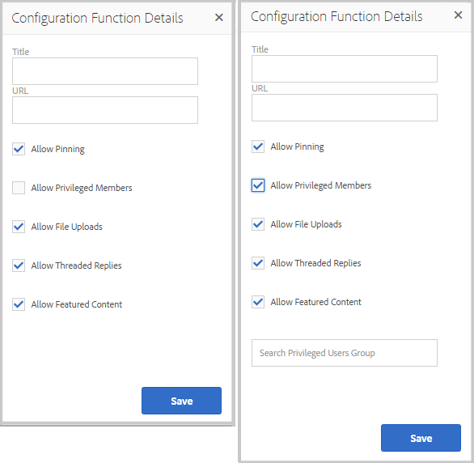
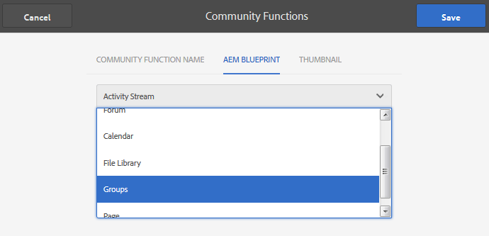

# Funzioni community{#community-functions}

Il tipo di funzioni previste da un’esperienza della community sono ben note. Le funzioni della community sono disponibili come funzioni della community. In sostanza, si tratta di una o più pagine collegate per implementare una funzione per la community che richiede molto di più della semplice aggiunta di un componente a una pagina in modalità di authoring. Sono i blocchi predefiniti utilizzati per definire la struttura di un’ [modello per sito community](/help/communities/sites.md) da cui provengono i siti community [creato](/help/communities/sites-console.md).

Una volta creato il sito community, il contenuto può essere aggiunto alle pagine risultanti utilizzando lo standard [Modalità di authoring AEM](/help/sites-authoring/editing-content.md). Sono disponibili diverse funzioni per la community, come illustrato nella console delle funzioni per la community.

>[!NOTE]
>
>Le console per la creazione di [siti community](/help/communities/sites-console.md), [modelli per sito community](/help/communities/sites.md), [modelli per gruppi community](/help/communities/tools-groups.md), e [funzioni community](/help/communities/functions.md) devono essere utilizzati solo nell’ambiente di authoring.

## Console funzioni community {#community-functions-console}

Per raggiungere la console delle funzioni community nell’ambiente di authoring:

* Accedi a **[!UICONTROL Strumenti]** > **[!UICONTROL Community]** > **[!UICONTROL Funzioni community]**.

## Funzioni predefinite {#pre-built-functions}

Segue una breve descrizione delle funzioni fornite con AEM Communities. Ogni funzione include una o più pagine AEM contenenti i componenti Communities collegati tra loro in una funzione che può essere facilmente incorporata in una [modello per sito community](/help/communities/sites.md).

Un modello di sito community fornisce la struttura di un sito community, incluse le funzioni di accesso, profili utente, notifiche, messaggistica, menu del sito, ricerca, temi e branding.

### Impostazioni titolo e URL {#title-and-url-settings}

**Titolo** e **URL** sono proprietà comuni a tutte le funzioni della community.

Quando una funzione di community viene aggiunta a un modello di sito community o quando [modifica](/help/communities/sites-console.md#modifying-site-properties) Nella struttura di un sito community, viene visualizzata la finestra di dialogo della funzione in cui è possibile configurare Titolo e URL.

#### Dettagli funzione di configurazione {#configuration-function-details}

* **Titolo**

   (*Obbligatorio*) Testo visualizzato nel menu delle funzioni del sito

* **URL**

   (*Obbligatorio*) Nome utilizzato per generare l&#39;URI. Il nome deve essere conforme al [convenzioni di denominazione](/help/sites-developing/naming-conventions.md) imposto dall&#39;AEM e dal JCR.

Ad esempio, utilizzando il sito creato da seguendo la [Guida introduttiva](/help/communities/getting-started.md) esercitazione, se

* Title = Pagina Web
* URL = pagina

L’URL della pagina è https://localhost:4503/content/sites/engage/en/page.html

e il collegamento del menu per la pagina viene visualizzato come:

### Funzione Flusso attività {#activity-stream-function}

La funzione di flusso di attività è una pagina con [Componente Flussi attività](/help/communities/activities.md) con tutte le visualizzazioni selezionate (tutte le attività, le attività utente e seguenti). Vedi anche [Nozioni di base sul flusso di attività](/help/communities/essentials-activities.md) per sviluppatori.

Quando si aggiunge un modello, viene visualizzata la seguente finestra di dialogo:

#### Dettagli funzione di configurazione {#configuration-function-details-1}

* [Impostazioni titolo e URL](#title-and-url-settings)

* **Mostra vista Le mie attività**

   Se selezionata, la pagina Attività include una scheda che filtra le attività in base a quelle generate all&#39;interno della community dal membro corrente. L&#39;opzione Predefinita è selezionata.

* **Mostra la vista Tutte le attività**

   Se selezionata, la pagina Attività include una scheda che include tutte le attività generate all&#39;interno della comunità a cui il membro corrente ha accesso. L&#39;opzione Predefinita è selezionata.

* **Mostra vista Feed notizie**

   Se selezionata, le pagine Attività includono una scheda che filtra le attività in base a quelle che il membro corrente sta seguendo. L&#39;opzione Predefinita è selezionata.

### Funzione Blog {#blog-function}

La funzione blog è una pagina con [Componente blog](/help/communities/blog-feature.md) configurato per l&#39;assegnazione di tag, il caricamento di file, i membri seguenti per la modifica automatica, il voto e la moderazione. Vedi anche [Nozioni di base sul blog](/help/communities/blog-developer-basics.md) per sviluppatori.

Quando si aggiunge un modello, viene visualizzata la seguente finestra di dialogo:

* [Impostazioni titolo e URL](#title-and-url-settings)

* **Consenti membri privilegiati**

   Se viene selezionato, il blog consente ai membri con privilegi di creare articoli solo selezionando una [gruppo di membri privilegiati](/help/communities/users.md#privileged-members-group). Se non viene selezionata, tutti i membri della community possono creare. Il valore predefinito è deselezionato.

* **Consenti caricamenti file**

   Se viene selezionato, il blog consente ai membri di caricare i file. L&#39;opzione Predefinita è selezionata.

* **Consenti risposte concatenate**

   Se non è selezionato, il blog consente di rispondere (commenti) a un articolo, ma non di rispondere ai commenti. L&#39;opzione Predefinita è selezionata.

* **Consenti contenuto in primo piano**

   Se viene selezionato, il blog viene identificato come [contenuto in primo piano](/help/communities/featured.md). L&#39;opzione Predefinita è selezionata.

### Funzione Calendario {#calendar-function}

La funzione calendario è una pagina con [Componente calendario](/help/communities/calendar.md) configurato per consentire l’assegnazione tag. Vedi anche [Elementi di base di Calendar](/help/communities/calendar-basics-for-developers.md) per sviluppatori.

Quando si aggiunge un modello, viene visualizzata la seguente finestra di dialogo:

* [Impostazioni titolo e URL](#title-and-url-settings)

* **Consenti blocco**

   Se viene selezionato, il forum consente di fissare le risposte all&#39;argomento all&#39;inizio dell&#39;elenco dei commenti. L&#39;opzione Predefinita è selezionata.

* **Consenti membri privilegiati**

   Se viene selezionato, il blog consente ai membri con privilegi di creare articoli solo selezionando una [gruppo di membri privilegiati](/help/communities/users.md#privileged-members-group). Se non viene selezionata, tutti i membri della community possono creare. Il valore predefinito è deselezionato.

* **Consenti caricamenti file**

   Se viene selezionato, il blog consente ai membri di caricare i file. L&#39;opzione Predefinita è selezionata.

* **Consenti risposte concatenate**

   Se non è selezionato, il blog consente di rispondere (commenti) a un articolo, ma non di rispondere ai commenti. L&#39;opzione Predefinita è selezionata.

* **Consenti contenuto in primo piano**

   Se viene selezionato, il contenuto viene identificato come [contenuto in primo piano](/help/communities/featured.md). L&#39;opzione Predefinita è selezionata.

### Funzione contenuto in primo piano {#featured-content-function}

La funzione di contenuto in primo piano è una pagina con [Componente contenuto in primo piano](/help/communities/featured.md) configurato per consentire l’aggiunta e l’eliminazione di commenti.

La possibilità di visualizzare contenuti può essere consentita o non consentita per ogni componente (vedi [Funzione Blog](#blog-function), [Funzione Calendario](#calendar-function), [Funzione forum](#forum-function), [Funzione ideazione](#ideation-function), e [Funzione QnA](#qna-function)).

Quando viene aggiunto a un modello, l’unica configurazione è per [Impostazioni titolo e URL](#title-and-url-settings).

### Funzione Libreria file {#file-library-function}

La funzione libreria file è una pagina con [Componente Libreria file](/help/communities/file-library.md) configurato per consentire l’aggiunta e l’eliminazione di commenti.

Quando viene aggiunto a un modello, l’unica configurazione è per [Impostazioni titolo e URL](#title-and-url-settings).

### Funzione Forum {#forum-function}

La funzione forum è una pagina con [Componente forum](/help/communities/forum.md) configurato per l&#39;assegnazione di tag, il caricamento di file, i membri seguenti per la modifica automatica, il voto e la moderazione.

Quando si aggiunge un modello, viene visualizzata la seguente finestra di dialogo:

#### Dettagli funzione di configurazione {#configuration-function-details-2}

* [Impostazioni titolo e URL](#title-and-url-settings)

* **Consenti blocco**

   Se viene selezionato, il forum consente di fissare le risposte all&#39;argomento all&#39;inizio dell&#39;elenco dei commenti. L&#39;opzione Predefinita è selezionata.

* **Consenti membri privilegiati**

   Se viene selezionato, il forum consente solo ai membri con privilegi di pubblicare argomenti consentendo la selezione di un [gruppo di membri privilegiati](/help/communities/users.md#privileged-members-group). Se non è selezionata, tutti i membri della community possono pubblicare post. Il valore predefinito è deselezionato.

* **Consenti caricamenti file**

   Se viene selezionato, il forum consente ai membri di caricare i file. L&#39;opzione Predefinita è selezionata.

* **Consenti risposte concatenate**

   Se non viene selezionato, il forum consente di inserire commenti su un argomento, ma non è consentito rispondere a tali commenti. L&#39;opzione Predefinita è selezionata.

* **Consenti contenuto in primo piano**

   Se selezionata, il contenuto del componente viene identificato come [contenuto in primo piano](/help/communities/featured.md). L&#39;opzione Predefinita è selezionata.

### Funzione Gruppi {#groups-function}

>[!CAUTION]
>
>La funzione dei gruppi deve *non* essere *primo e unico* funzione nella struttura di un sito o in un modello di sito community.
>
>Qualsiasi altra funzione, ad esempio [funzione page](#page-function), deve essere incluso ed elencato per primo.

La funzione gruppi consente ai membri della community di creare sottocomunità all’interno del sito community nell’ambiente di pubblicazione.

A seconda di [impostazioni](/help/communities/sites-console.md#groupmanagement) quando la funzione Groups è inclusa in un [modello per sito community](/help/communities/sites.md), i gruppi possono essere pubblici o privati e uno o più modelli di gruppo community possono essere configurati per fornire una scelta di modelli al momento della creazione effettiva del gruppo community (ad esempio dall’ambiente di pubblicazione). A [modello per gruppo community](/help/communities/tools-groups.md) specifica quali funzioni di Communities vengono create per le pagine del gruppo, ad esempio forum e calendari.

Quando si crea un gruppo community, viene creato in modo dinamico un gruppo di membri per il nuovo gruppo, al quale è possibile assegnare o unire membri. Per ulteriori informazioni, consulta [Gestione di utenti e gruppi di utenti](/help/communities/users.md).

A partire da Communities [feature pack 1](/help/communities/deploy-communities.md#latestfeaturepack), i gruppi della community vengono creati nell’ambiente di authoring utilizzando [Console Gruppi di siti community](/help/communities/groups.md)e possono essere create nell’ambiente di pubblicazione se abilitate.

Quando si aggiunge un modello, viene visualizzata la seguente finestra di dialogo:

* [Impostazioni titolo e URL](#title-and-url-settings)

* **Seleziona modelli per gruppi**

   Un elenco a discesa che consente di selezionare uno o più modelli di gruppo abilitati tra cui può scegliere il futuro creatore di un nuovo gruppo community (nell’ambiente di pubblicazione).

* **Consenti membri privilegiati**

   Se viene selezionato, il forum consente solo ai membri con privilegi di pubblicare argomenti consentendo la selezione di un [gruppo di sicurezza membri privilegiati](/help/communities/users.md#privileged-members-group). Se non è selezionata, tutti i membri della community possono pubblicare post. Il valore predefinito è deselezionato.

* **Consenti creazione pubblicazione**

   Se questa opzione è selezionata, i membri autorizzati della community possono creare un gruppo nell’ambiente di pubblicazione. Se questa opzione è deselezionata, è possibile creare nuovi gruppi (sottocomunità) nell’ambiente di authoring solo dalla console Gruppi di siti community.
L&#39;opzione Predefinita è selezionata.

### Funzione ideazione {#ideation-function}

La funzione di ideazione è una pagina con una [Componente ideazione](/help/communities/ideation-feature.md).

Quando viene aggiunto a un modello, viene visualizzata la seguente finestra di dialogo che specifica i nomi di titolo e URL predefiniti e le impostazioni di visualizzazione predefinite per il modello:

* [Impostazioni titolo e URL](#title-and-url-settings)

* **Consenti membri privilegiati**

   Se viene selezionato, il forum consente solo ai membri con privilegi di pubblicare argomenti consentendo la selezione di un [gruppo di sicurezza membri privilegiati](/help/communities/users.md#privileged-members-group). Se non è selezionata, tutti i membri della community possono pubblicare post. Il valore predefinito è deselezionato.

* **Consenti caricamenti file**

   Se selezionata, l&#39;idea include la possibilità per i membri di caricare i file. L&#39;opzione Predefinita è selezionata.

* **Consenti risposte concatenate**

   Se non viene selezionata, l&#39;idea consente di rispondere (commenti) a un argomento, ma non di rispondere ai commenti. L&#39;opzione Predefinita è selezionata.

* **Consenti contenuto in primo piano**

   Se viene selezionato, il contenuto viene identificato come [contenuto in primo piano](/help/communities/featured.md). L&#39;opzione Predefinita è selezionata.

### Funzione Classifica {#leaderboard-function}

La funzione classifica è una pagina con una [Componente classifica](/help/communities/enabling-leaderboard.md).

**NOTA**: il componente Classifica deve essere ulteriormente configurato *dopo* un sito community viene creato da un modello di community che include la funzione Classifica. Specifica del componente Classifica [regole](/help/communities/enabling-leaderboard.md#rules-tab), che dipendono dalla configurazione di [punteggio e badge](/help/communities/implementing-scoring.md) per il sito community.

Quando viene aggiunto a un modello, viene visualizzata la seguente finestra di dialogo che specifica i nomi di titolo e URL predefiniti e le impostazioni di visualizzazione predefinite per il modello:

* [Impostazioni titolo e URL](#title-and-url-settings)

* **Visualizza badge**

   Se questa opzione è selezionata, nella classifica verrà inclusa una colonna per le icone dei badge.
Il valore predefinito è deselezionato.

* **Nome badge visualizzato**

   Se questa opzione è selezionata, nella classifica viene inclusa una colonna per il nome del badge.
Il valore predefinito è deselezionato.

* **Visualizza avatar**

   Se l&#39;opzione è selezionata, l&#39;immagine avatar del membro viene inclusa nella classifica, accanto al collegamento del nome al suo profilo membro.
Il valore predefinito è deselezionato.

### Funzione Pagina {#page-function}

La funzione di pagina aggiunge una pagina vuota al sito community da collegare alle funzioni del sito community: accesso, menu, notifiche, messaggi, temi e branding. Il contenuto viene aggiunto alla pagina utilizzando [modalità di creazione AEM standard](/help/sites-authoring/editing-content.md).

Quando viene aggiunto a un modello, l’unica configurazione è per [Impostazioni titolo e URL](#title-and-url-settings).

### Funzione D/R {#qna-function}

La funzione QnA è una pagina con [Componente QnA](/help/communities/working-with-qna.md) configurato per l&#39;assegnazione di tag, il caricamento di file, i membri seguenti per la modifica automatica, il voto e la moderazione.

Quando viene aggiunta a un modello, la configurazione consente di limitare i membri con privilegi:

* [Impostazioni titolo e URL](#title-and-url-settings)

* **Consenti blocco**

   Se viene selezionato, il forum consente di fissare le risposte all&#39;argomento all&#39;inizio dell&#39;elenco dei commenti. L&#39;opzione Predefinita è selezionata.

* **Consenti membri privilegiati**

   Se viene selezionato, il forum QnA consente solo ai membri con privilegi di pubblicare domande consentendo la selezione di un [gruppo di membri privilegiati](/help/communities/users.md#privileged-members-group). Se non è selezionata, tutti i membri della community possono pubblicare post. Il valore predefinito è deselezionato.

* **Consenti caricamenti file**

   Se viene selezionato, il forum QnA consente ai membri di caricare i file. L&#39;opzione Predefinita è selezionata.

* **Consenti risposte concatenate**

   Se non viene selezionato, il forum di QnA consente di inserire commenti (risposte) a una domanda pubblicata, ma non sono consentite risposte alle risposte. L&#39;opzione Predefinita è selezionata.

* **Consenti contenuto in primo piano**

   Se viene selezionato, il contenuto viene identificato come [contenuto in primo piano](/help/communities/featured.md). L&#39;opzione Predefinita è selezionata.

## Crea funzione community {#create-community-function}

Per creare una funzione per la community, seleziona la `Create Community Function` nella parte superiore della console Funzioni community. È possibile creare più funzioni basate sulla stessa blueprint AEM e personalizzarle in modo univoco aprendo la modalità di modifica dell’autore.

### Nome funzione community {#community-function-name}

Nel pannello Nome funzione community, vengono configurati un nome, una descrizione e l’abilitazione o meno della funzione:

* **Nome funzione community**

   Nome della funzione utilizzato per la visualizzazione e l&#39;archiviazione.

* **Descrizione della funzione community**

   Descrizione della funzione per la visualizzazione.

* **Disabilitato/abilitato**

   Un interruttore che controlla se la funzione è referenziabile.

### Blueprint AEM {#aem-blueprint}

Il giorno `AEM Blueprint` del gruppo, è possibile selezionare il blueprint su cui si basa l’implementazione della funzione comunitaria.

La funzione community è un mini sito che include una o più pagine, precollegate per l’inserimento in un sito community e include le funzioni di accesso, profili utente, notifiche, messaggistica, menu del sito, ricerca, temi e branding. Una volta creata la funzione, è possibile: [aprire la funzione](#open-community-function) in modalità modifica autore e personalizza le impostazioni della pagina o del componente.

Poiché la funzione community viene implementata come [live copy](/help/sites-administering/msm.md#live-copies) di un [blueprint](/help/sites-administering/msm-livecopy.md#creatingablueprint), è possibile eseguire il rollout delle modifiche apportate a una funzione che influisce su tutte le pagine del sito community create da [modello per sito community](/help/communities/sites.md) o [modello per gruppo community](/help/communities/tools-groups.md) che includeva la funzione. È inoltre possibile dissociare una pagina dalla blueprint principale per apportare modifiche a livello di pagina.

Vedi anche [Gestore multisito](/help/sites-administering/msm.md).

### Miniatura  {#thumbnail}

Nel pannello Miniature è possibile caricare un’immagine da visualizzare nel [Console Funzioni community](#community-functions-console).

## Apri funzione community {#open-community-function}

Seleziona la `Open Community Function` per accedere alla modalità di modifica dell’autore per creare il contenuto della pagina e modificare la configurazione dei componenti della funzione.

### Configurazione dei componenti {#configuring-components}

Una funzione community è implementata come Live Copy di un blueprint AEM, i cui dettagli sono documentati in [Gestore multisito](/help/sites-administering/msm.md).

È possibile non solo creare il contenuto della pagina, ma anche configurare i componenti.

Durante la configurazione di un componente in una pagina di un sito community creato, potrebbe essere necessario annullare l&#39;operazione [ereditarietà](/help/sites-administering/msm-livecopy.md#changing-live-copy-content) per configurare il componente. Al termine della configurazione, l’ereditarietà deve essere ristabilita.

Per informazioni dettagliate sulla configurazione, visita [Componenti community](/help/communities/author-communities.md) per autori.

## Funzione modifica per community {#edit-community-function}

Seleziona la `Edit Community Function` per modificare le proprietà della funzione utilizzando gli stessi pannelli [creazione di una funzione community](#create-community-function), inclusa l&#39;attivazione o la disattivazione della funzione.
