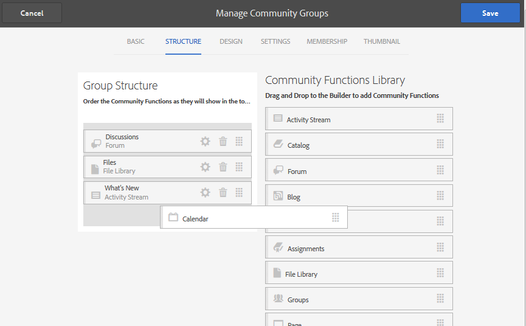

# Console Gruppi per community {#community-groups-console}

La console Gruppi consente di creare gruppi della community quando il sito [struttura del modello](/help/communities/sites-console.md#step1) include [funzione gruppi](/help/communities/functions.md#groups-function).

* AEM Communities supporta la nidificazione di gruppi all’interno di altri gruppi. La nidificazione dei gruppi è possibile quando [struttura del nuovo gruppo](/help/communities/tools-groups.md) contiene la funzione groups.
* Solo per l’ambiente di authoring, è disponibile una procedura guidata per la creazione di gruppi simile alla procedura guidata per la creazione di siti.
* Se i membri possono o meno creare gruppi nell&#39;ambiente di pubblicazione, è possibile configurarlo quando si aggiunge una funzione Gruppi a una struttura del sito o del gruppo di community.

Dei tre modelli di gruppo inclusi, solo `Reference Group` Il modello include una funzione di gruppi nella struttura.

I diversi aspetti dei gruppi comunitari sono:

* **Creazione**: è possibile creare un nuovo gruppo nell’istanza di authoring e, facoltativamente, in quella di pubblicazione.
* **Controllo**: il gruppo può essere aperto o segreto.
* **Nidificazione**: il gruppo può contenere zero o più gruppi.

<!-- This is a 404 on helpx. Please update or remove.
>[!NOTE]
>
>Community groups, created in the publish environment before the [existence of the Community Groups console](/help/communities/version-history.md#featurepack1fp1), will not be listed in the Community Groups console, and thus, are not modifiable using the console.
-->

>[!NOTE]
>
>Questa console Gruppi, accessibile solo dalla console Siti di Communities, non deve essere confusa con il membro [Console Gruppi](/help/communities/members.md) per la gestione dei gruppi membri.
>
>I gruppi di membri sono gruppi di utenti registrati nell’ambiente di pubblicazione e a cui si accede dall’ambiente di authoring utilizzando [servizio tunnel](/help/communities/deploy-communities.md#tunnel-service-on-author).

## Creazione gruppo {#group-creation}

Per accedere alla console Gruppi:

* All&#39;autore, accedi con privilegi di amministratore.
* Dalla navigazione globale: **[!UICONTROL Community]** > **[!UICONTROL Sites]**.
* Selezionare una cartella del sito community esistente per aprirla.
* Selezionare un&#39;istanza di un sito community all&#39;interno della cartella.

   * La struttura del sito community deve includere una funzione di gruppo.
   * Queste schermate sono riprese dall&#39;esercitazione introduttiva dopo [creazione di gruppi al momento della pubblicazione](/help/communities/published-site.md).

  

* Seleziona la **Cartella Gruppi** per aprirlo.

  All’apertura, vengono visualizzati tutti i gruppi esistenti, siano essi creati durante l’authoring o la pubblicazione.

  Da questa console Gruppi è possibile creare nuovi gruppi.

  

* Seleziona la **Crea gruppo** pulsante.

### Passaggio 1: modello per gruppo community {#step-community-group-template}

* **Titolo gruppo community**

  Titolo da visualizzare per il gruppo.
Il titolo del gruppo viene visualizzato nel sito pubblicato.

* **Descrizione gruppo community**

  Descrizione del gruppo.

* **Directory principale gruppo community**

  Percorso della directory principale del gruppo.
La directory principale predefinita è il sito padre, ma la directory principale può essere spostata in qualsiasi posizione all’interno del sito web. Non è consigliabile modificarlo.

* **Lingue aggiuntive gruppo community disponibili** menu

  Utilizzare il menu a discesa per selezionare le lingue disponibili per i gruppi community. Il menu visualizza tutte le lingue in cui viene creato il sito community principale. Gli utenti possono scegliere tra queste lingue per creare gruppi in più lingue in questo singolo passaggio. Lo stesso gruppo viene creato in più lingue specificate nella console Gruppi dei rispettivi siti community.

* **Nome gruppo community**

  Il nome della pagina principale del gruppo che viene visualizzata nell&#39;URL. Evita di usare caratteri di sottolineatura (_) e parole chiave come risorse e configurazione nel nome del gruppo.

   * Ricontrollare il nome in quanto non può essere modificato facilmente dopo la creazione del gruppo.
   * L’URL di base viene visualizzato sotto al `Community Group Name`.
   * Per un URL valido, aggiungi &quot;.html&quot;
     *ad esempio*, `https://localhost:4502/content/sites/mysight/en/mygroup.html`.

* **Modello per gruppo community** menu

  Utilizza il menu a discesa per scegliere un [modello per gruppo community](/help/communities/tools.md).

### Passaggio 2: Progettazione {#step-design}

### TEMA GRUPPO COMMUNITY {#community-group-theme}

Il framework utilizza `Twitter Bootstrap` per offrire al sito un design flessibile e reattivo. È possibile selezionare uno dei numerosi temi di Bootstrap precaricati per assegnare uno stile al modello di gruppo community selezionato oppure caricare un tema di Bootstrap.

Se questa opzione è selezionata, il tema viene sovrapposto con un segno di spunta blu opaco.

È possibile selezionare un tema diverso da quello del sito principale.

Dopo la pubblicazione del sito della community, è possibile [modificare le proprietà](#modifyinggroupproperties) e seleziona un tema diverso.

### MARCHIO PER GRUPPO COMMUNITY {#community-group-branding}

Il branding del sito community è un’immagine visualizzata come intestazione nella parte superiore di ogni pagina. È possibile visualizzare un banner per il gruppo diverso da altre pagine del sito.

L’immagine deve essere ridimensionata in modo da avere la larghezza prevista per la pagina nel browser e un’altezza di 120 pixel.

Quando crei o selezioni un’immagine, tieni presente quanto segue:

* L’altezza dell’immagine viene ritagliata a 120 pixel misurati dal bordo superiore dell’immagine
* L&#39;immagine è bloccata sul bordo sinistro della finestra del browser
* Non esiste alcun ridimensionamento dell’immagine, tale che quando la larghezza dell’immagine è:

   * Inferiore alla larghezza del browser, l’immagine viene ripetuta orizzontalmente.
   * Maggiore della larghezza del browser, l’immagine verrà ritagliata.

### Passaggio 3: Impostazioni {#step-settings}

**MODERAZIONE**

**Moderatori gruppo community**

Per impostazione predefinita, viene ereditato l&#39;elenco di moderatori del sito della community principale.

È possibile aggiungere moderatori specifici al gruppo. Cerca membri (dall’ambiente di pubblicazione) per aggiungerli come moderatori

**Amministratori gruppo**

Per impostazione predefinita, l&#39;amministratore del sito della community padre è anche l&#39;amministratore dei gruppi.

Tuttavia, è possibile assegnare amministratori di gruppi indipendenti. Gli amministratori di gruppi possono gestire il proprio gruppo (ad esempio G1) e creare un sottogruppo nidificato in G1. Possono inoltre assegnare amministratori diversi per il sottogruppo.

Un utente U1 può quindi essere un amministratore in un gruppo G1 e un utente normale nel suo gruppo nidificato G2.

**ISCRIZIONE**

L&#39;impostazione di appartenenza consente di selezionare uno dei tre modi per proteggere un gruppo community.

* **Iscrizione opzionale**

  Se viene selezionato, il gruppo community è un gruppo pubblico. I membri del sito possono partecipare al gruppo e pubblicare i post senza partecipare esplicitamente al gruppo. L&#39;opzione Predefinita è selezionata.

* **Iscrizione obbligatoria**

  Se viene selezionato, il gruppo community è un gruppo aperto. I membri del sito della community possono visualizzare il contenuto del gruppo, ma per pubblicare il contenuto è necessario unirsi al gruppo. I membri si uniscono selezionando il `Join` nell’ambiente di pubblicazione. Impostazione predefinita non selezionata.

* **Iscrizione limitata**

  Se viene selezionato, il gruppo community è un gruppo segreto. I membri della community devono essere invitati esplicitamente. I membri invitati vengono inseriti nella casella di ricerca. I membri possono essere aggiunti in un secondo momento utilizzando [Console membri e gruppi](/help/communities/members.md) l’ambiente di authoring. Impostazione predefinita non selezionata.

**MINIATURA**

La miniatura è un’immagine da visualizzare per il gruppo durante l’authoring e la pubblicazione.

Le dimensioni ottimali di un&#39;immagine di gruppo sono 170 x 90 pixel in un formato di immagine supportato (ad esempio JPG o PNG).

Se non viene aggiunta alcuna immagine, viene visualizzata un&#39;immagine predefinita.

### Passaggio 4: creare un gruppo {#step-create-group}

Se sono necessarie delle regolazioni, utilizzare **Indietro** per farle.

Una volta **Crea** è selezionato e avviato, il processo di creazione del gruppo non può essere interrotto.

Al termine del processo, la scheda del nuovo sito (gruppo) della comunità secondaria viene visualizzata nella console Gruppi di siti community, da cui gli autori possono aggiungere contenuto di pagina o gli amministratori possono modificare le proprietà del sito.

>[!NOTE]
>
>Il gruppo viene creato in tutte le lingue, come specificato in [Passaggio 1: modello per gruppo community](/help/communities/groups.md#step-community-group-template) in Lingue aggiuntive disponibili per il gruppo community, nella console Gruppi community dei rispettivi siti community.

## Contenuto gruppo di authoring {#author-group-content}

Il contenuto della pagina di un gruppo può essere creato con gli stessi strumenti di qualsiasi altra pagina dell’AEM. Per aprire il gruppo per la creazione, seleziona l’icona Apri sito che viene visualizzata quando passi il puntatore sulla scheda del gruppo.

## Modifica proprietà gruppo {#modify-group-properties}

Le proprietà di un sito della comunità secondaria esistente, specificate durante il processo di creazione del gruppo della comunità, possono essere modificate selezionando l&#39;icona Modifica sito che viene visualizzata quando si passa il puntatore sulla scheda del gruppo:

I dettagli delle seguenti proprietà corrispondono alle descrizioni fornite nella [Creazione gruppo](#group-creation) sezione. Qualsiasi gruppo nidificato può essere modificato, sia che venga creato nell’ambiente di pubblicazione che in quello di authoring.

### Modifica di base {#modify-basic}

Il pannello BASIC consente di modificare

* Titolo gruppo community
* Descrizione gruppo community

Il nome del gruppo community non può essere modificato.

La scelta di un modello di gruppo community diverso non avrà alcun effetto su un sito di gruppo community esistente, poiché non rimane alcuna connessione tra modelli e siti.

Al contrario, [STRUTTURA](#modify-structure) della sottocomunità può essere modificata.

### Modifica struttura {#modify-structure}

Il pannello STRUTTURA consente di modificare la struttura inizialmente creata dal modello di gruppo community selezionato durante la creazione del sito della sottocommunity dall’ambiente di authoring o di pubblicazione. Dal pannello, è possibile:

* Trascinamento della selezione [funzioni community](/help/communities/functions.md) nella struttura del sito.
* In un’istanza di una funzione community nella struttura del sito:

   * **`Gear icon`**
Modifica le impostazioni, tra cui il titolo visualizzato, l’URL e [gruppi di membri con privilegi](/help/communities/users.md#privilegedmembersgroups).

   * **`Trashcan icon`**
Rimuovere (eliminare) le funzioni dalla struttura del sito.

   * **`Grid icon`**
Modificare l&#39;ordine delle funzioni visualizzato nella barra di navigazione di primo livello del sito.

>[!CAUTION]
>
>Anche se il titolo visualizzato può essere modificato senza effetti collaterali, si sconsiglia di modificare il nome URL di una funzione community appartenente a un sito community.
>
>Ad esempio, la ridenominazione dell’URL non sposterà l’UGC esistente, causando la perdita dell’UGC.

>[!CAUTION]
>
>La funzione dei gruppi deve *non* essere *primo e unico* nella struttura del sito.
>
>Qualsiasi altra funzione, ad esempio [funzione page](/help/communities/functions.md#page-function), deve essere incluso ed elencato per primo.

**Esempio: aggiunta di una funzione Calendario a una struttura di sottocomunità (gruppo)**

### Modifica progettazione {#modify-design}

Il pannello DESIGN consente di modificare il tema:

* [Tema gruppo community](#community-group-theme)
* [Marchio gruppo community](#community-group-branding)

   * Scorri fino alla parte inferiore del pannello per modificare l’immagine del brand.

### Modifica impostazioni {#modify-settings}

Il pannello IMPOSTAZIONI consente di aggiungere la community [moderatori](#moderation).

### Modifica appartenenza {#modify-membership}

Il [ISCRIZIONE](#membership) Il pannello è solo informativo. Non è possibile modificare il tipo di appartenenza al gruppo stabilito, sia esso facoltativo, obbligatorio o limitato.

### Modifica miniatura {#modify-thumbnail}

Il [MINIATURA](#thumbnail) Il pannello consente di caricare un’immagine per rappresentare il gruppo community presso i visitatori nell’ambiente di pubblicazione e nella console Gruppi del sito Communities nell’ambiente di authoring.

## Pubblicare il gruppo {#publish-the-group}

Dopo aver creato o modificato un gruppo community, puoi pubblicarlo (attivarlo) selezionando la `Publish Site` icona.

Una volta pubblicato correttamente il gruppo, viene visualizzato un messaggio:

>[!CAUTION]
>
>Il sito della community padre e i gruppi padre avrebbero dovuto essere già stati pubblicati.
>
>Il sito della community e i gruppi nidificati devono essere pubblicati in modalità top-down.

## Elimina il gruppo {#delete-the-group}

Per eliminare un gruppo dalla console Gruppi della community, fai clic sull’icona Elimina gruppo, visualizzata quando si passa il puntatore del mouse sul gruppo.

In questo modo vengono rimossi tutti gli elementi associati al gruppo, ad esempio tutto il contenuto del gruppo viene eliminato definitivamente e le appartenenze utente vengono rimosse dal sistema.
