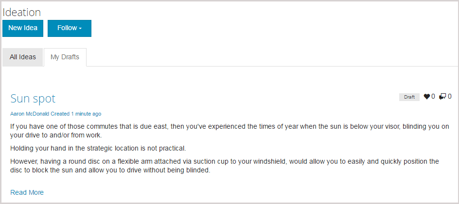

# Funzione ideativa {#ideation-feature}

## Introduzione {#introduction}

La funzione di identificazione fornisce un’area per i visitatori del sito con accesso (membri della community) nell’ambiente di pubblicazione per:

* Crea idee da condividere con la community.
* Visualizza e commenta le idee.
* Segui un&#39;idea.
* Votate un&#39;idea.

Questa sezione della documentazione descrive:

* Aggiunta della funzione di identificazione a un sito AEM.
* Impostazioni di configurazione per il componente Ideazione.

### Aggiunta di un’idea a una pagina {#adding-a-ideation-to-a-page}

Per aggiungere una `Ideation` componente per una pagina in modalità di creazione, usate il browser componenti per individuare

* `Communities / Ideation`

e trascinatela nella posizione desiderata su una pagina in cui dovrebbe essere visualizzata l’idea.

Per le informazioni necessarie, visita [Nozioni di base sui componenti di Communities](/help/communities/basics.md).

Quando il [librerie lato client richieste](/help/communities/ideation.md#essentials-for-client-side) sono inclusi, è così che `Ideation` apparirà il componente:

### Configurazione di un’idea {#configuring-an-ideation}

Seleziona il `Ideation` per accedere e selezionare il `Configure` che apre la finestra di dialogo di modifica.

#### Scheda Impostazioni {#settings-tab}

Sotto la **[!UICONTROL Impostazioni]** scheda , specifica le impostazioni per idee e commenti:

* **Consenti miniatura allegato**
* **Dimensione max miniatura allegato**
* **Dimensioni minime immagine per miniatura**
* **Dimensione massima miniatura**
* **Consenti membri privilegiati**
* **Membri privilegiati consentiti**
* **Blocca i contenuti generati dagli utenti in modalità di modifica Creazione**
* **Titolo ideazione**

* Il titolo visualizzato dell&#39;idea. Il valore predefinito è `Ideation`.
* **Descrizione ideazione**

   Descrizione da visualizzare come sottotitolo dell’idea. Il valore predefinito non è una descrizione.

* **Topic per pagina**

   Definisce il numero di idee/post visualizzati per pagina. Il valore predefinito è 10.

* **Moderato**

   Se questa opzione è selezionata, è necessario approvare la pubblicazione di idee e commenti prima che vengano visualizzati su un sito di pubblicazione. Il valore predefinito è deselezionato.

* **Chiuso**

   Se questa opzione è selezionata, il forum di ideazione è chiuso a nuove idee e commenti. Il valore predefinito è deselezionato.

* **Editor Rich Text**

   Se questa opzione è selezionata, è possibile inserire con markup idee e commenti. Il valore predefinito è deselezionato.

* **Consenti assegnazione tag**

   Se questa opzione è selezionata, consenti ai membri di aggiungere etichette di tag al proprio post (consulta **[!UICONTROL Campo tag]** ). Il valore predefinito è deselezionato.

* **Consenti caricamenti file**

   Se questa opzione è selezionata, consenti l’aggiunta di allegati all’idea o al commento. Il valore predefinito è deselezionato.

* **Dimensione file massima**

   Pertinente solo se `Allow File Uploads` è controllata. Questo campo limita le dimensioni (in byte) di un file caricato. Il valore predefinito è 104857600 (10 Mb).

* **Tipi di file consentiti**

   Pertinente solo se `Allow File Uploads` è controllata. Elenco di estensioni di file separate da virgola con il separatore &quot;punto&quot;. Ad esempio: .jpg, .jpeg, .png, .doc, .docx, .pdf. Se sono specificati dei tipi di file, non sarà possibile caricare quelli non specificati. Il valore predefinito non è specificato in modo che tutti i tipi di file siano consentiti.

* **Dimensione massima per file immagine allegato**

   Pertinente solo se l’opzione Consenti caricamenti file è selezionata. Numero massimo di byte di un file immagine caricato. Il valore predefinito è 2097152 (2 Mb).

* **Consenti risposte**

   Se questa opzione è selezionata, consenti risposte ai commenti pubblicati sull&#39;idea. Il valore predefinito è deselezionato.

* **Consenti votazione**

   Se questa opzione è selezionata, consentire la votazione dei commenti di un&#39;idea. Il valore predefinito è deselezionato.

* **Consenti agli utenti di eliminare commenti e argomenti**

   Se questa opzione è selezionata, consentire ai membri di eliminare i commenti e le idee che hanno pubblicato. Il valore predefinito è deselezionato.

* **Consenti Segui**

   Se questa opzione è selezionata, includi la seguente funzione per i post di idee, che consente ai membri di essere [notificato](/help/communities/notifications.md) di nuovi posti. Il valore predefinito è deselezionato.

* **Consenti iscrizioni e-mail**

   Se questa opzione è selezionata, consente ai membri di ricevere notifiche sui nuovi post via e-mail ([abbonamento](/help/communities/subscriptions.md)). Richiede `Allow Following` da controllare e [e-mail configurata](/help/communities/email.md). Il valore predefinito è deselezionato.

* **Consenti votazione**

   Se questa opzione è selezionata, consentire la votazione dei commenti di un&#39;idea. Il valore predefinito è deselezionato.

* **Visualizza badge**

   Se selezionato, visualizza guadagnato e assegnato [badge](/help/communities/implementing-scoring.md) con l&#39;idea di un membro. Il valore predefinito è deselezionato.

* **Non ottenere risposte sulla pagina di elenco**

* **Consenti contenuto in primo piano**

   Se questa opzione è selezionata, l’idea può essere identificata come [contenuto in primo piano](/help/communities/featured.md). Il valore predefinito è deselezionato.

* **Abilita menzione**
* **Max menzioni**
* **Pattern menzioni interfaccia**

#### Scheda Moderazione utente {#user-moderation-tab}

Sotto la **[!UICONTROL Moderazione utente]** , specifica come vengono gestite le idee e i commenti pubblicati (contenuto generato dall’utente). Per ulteriori informazioni, consulta [Moderazione dei contenuti generati dagli utenti](/help/communities/moderate-ugc.md).

* **Rifiuta post**

   Se questa opzione è selezionata, ai moderatori di membri affidabili sarà consentito di negare i post e impedire che il post appaia sul forum pubblico. Il valore predefinito è deselezionato.

* **Chiudi/Riapri argomenti**

   Se questa opzione è selezionata, i moderatori di membri attendibili possono chiudere un argomento per ulteriori modifiche e commenti e riaprire un argomento. Il valore predefinito è deselezionato.

* **Segnala post**

   Se questa opzione è selezionata, consentire ai membri di contrassegnare gli argomenti o i commenti di altri come inappropriati. Il valore predefinito è deselezionato.

* **Elenco di motivi per segnalazione**

   Se questa opzione è selezionata, consenti ai membri di scegliere, da un elenco a discesa, il motivo per cui contrassegnano un argomento o un commento come inappropriato. Il valore predefinito è deselezionato.

* **Motivo per segnalazione personalizzato**

   Se questa opzione è selezionata, consenti ai membri di inserire il proprio motivo per contrassegnare un argomento o un commento come inappropriato. Il valore predefinito è deselezionato.

* **Soglia moderazione**

   Immettere il numero di volte in cui un argomento o un commento deve essere segnalato dai membri prima che i moderatori ne vengano informati. Il valore predefinito è 1 (una volta).

* **Limite segnalazione**

   Immetti il numero di volte in cui un argomento o un commento deve essere contrassegnato prima che sia nascosto dalla visualizzazione pubblica. Se è impostato su -1, l&#39;argomento o il commento contrassegnato non viene mai nascosto dalla visualizzazione pubblica. In caso contrario, questo numero deve essere maggiore o uguale alla soglia di moderazione. Il valore predefinito è 5.

#### Scheda Campo tag {#tag-field-tab}

Sotto la **[!UICONTROL Campo tag]** , i tag che possono essere applicati, se consentiti nella **[!UICONTROL Impostazioni]** sono limitati in base ai namespace selezionati.

* **Namespace consentiti**

   Pertinente se `Allow Tagging` è controllato sotto **[!UICONTROL Impostazioni]** scheda . I tag che possono essere applicati sono limitati a quelli nelle categorie dello spazio dei nomi selezionate. L’elenco dei namespace include sia &quot;Tag standard&quot; (lo spazio dei nomi predefinito) che &quot;Includi tutti i tag&quot;. Il valore predefinito non è selezionato, il che significa che tutti i namespace sono consentiti.

* **Limite di suggerimenti**

   Immettere il numero di tag da visualizzare come suggerimento al membro che pubblica sul forum. Un valore di **-1** significa nessun limite. Il valore predefinito è 0.

#### Scheda Impostazioni di ordinamento {#sort-settings-tab}

Sotto la **[!UICONTROL Impostazioni di ordinamento]** specificare l&#39;ordine dei commenti inviati quando vengono visualizzati.

* **Ordina per**

   Seleziona tutte le selezioni di ordinamento consentite: `Newest, Oldest, Last Updated, Most Viewed, Most Active, Most Followed and Most Liked`. Il valore predefinito è `Newest, Oldest, Last Updated`.

* **Imposta come predefinito**

   Passa il mouse verso il basso per selezionare una delle opzioni di ordinamento selezionate da visualizzare come impostazione predefinita. Il valore predefinito è `Newest`.

* **Seleziona le opzioni di tempo per l&#39;ordinamento Analytics**

   Abbassi per selezionare uno dei `All, Last 24 Hours, Last 7 Days, Last 30 Days`. Il valore predefinito è `All`.

## Esperienza dei visitatori del sito {#site-visitor-experience}

### Creazione di un&#39;idea {#creating-idea}

Come per tutte le funzionalità di Communities, se non hai effettuato l’accesso, un visitatore del sito può solo leggere idee e visualizzare opinioni altrui (tramite commenti e votanti/mi piace).

Una volta effettuato l&#39;accesso, un membro può creare una nuova idea.

Prima di presentare l&#39;idea, è possibile per il membro salvare una bozza.

Selezionando la `Save as Draft` viene salvata una bozza.

Quando si visualizzano le bozze salvate nel `My Drafts` scheda , seleziona `Read More` per tornare alla modalità di modifica:

#### Feedback {#providing-feedback}

Una volta pubblicata l’idea, altri membri possono accedervi, aprire l’idea ( `Read More`) e come l&#39;idea, aggiungendo così al conteggio dei voti, e fare commenti.

### Informazioni aggiuntive {#additional-information}

Per ulteriori informazioni, consulta [Idee Essenziali](/help/communities/ideation.md) per sviluppatori.

Per la moderazione degli argomenti e dei commenti pubblicati, vedi [Moderazione dei contenuti generati dagli utenti](/help/communities/moderate-ugc.md).

Per assegnare tag agli argomenti e ai commenti pubblicati, vedi [Assegnazione tag ai contenuti generati dagli utenti](/help/communities/tag-ugc.md).
